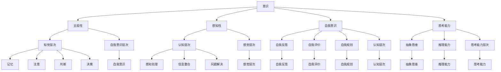

                 

### 意识是否是宇宙的基本构建单元

> 关键词：意识，宇宙，基本构建单元，量子力学，神经科学，哲学

> 摘要：本文探讨了意识是否是宇宙的基本构建单元这一哲学问题。通过介绍意识的概念和特性，宇宙的基本构成元素，以及科学和哲学的多角度探讨，本文试图为这一问题提供一个全面的思考框架。文章还结合了核心算法原理讲解和Python源代码实现，深入剖析了意识与宇宙基本构建单元之间的关系。

----------------------------------------------------------------

# 意识是否是宇宙的基本构建单元

## 引言

在探讨意识是否是宇宙的基本构建单元这一问题时，我们首先需要明确几个基本概念。什么是意识？什么是宇宙？什么是基本构建单元？

**意识**，通常被描述为自我感知和主观经验的能力。它包括感知、思考、情感和意志等多个方面。然而，意识的本质和起源一直是哲学、心理学、神经科学等领域探讨的难题。

**宇宙**，则是指包括一切存在和现象的整体，从微观的原子到宏观的星系，从时间的起点到终点。宇宙的构成和演化是物理学研究的重要领域。

**基本构建单元**，通常指的是构成宇宙的最基本元素。在物理学中，这一概念通常与粒子物理学中的基本粒子相关，如电子、夸克等。

本文将首先介绍意识、宇宙和基本构建单元的概念，然后深入探讨意识与宇宙基本构建单元之间的关系，从科学和哲学的角度进行分析，最后结合Python源代码和数学模型，提供一个具体的实现和解释。

## 意识的概念和特性

### 意识的起源

意识的起源是一个复杂且尚未完全解决的问题。在哲学上，有几种不同的观点来解释意识的起源：

- **二元论**：二元论认为，意识和物质是两个独立的存在。意识是心灵或灵魂的产物，而物质则是物理世界的产物。这种观点在柏拉图的“理念论”中有所体现。

- **物质主义**：物质主义认为，意识是物质过程的产物。意识是大脑中神经活动的结果，没有物质的基础，意识就无法存在。

- **泛心论**：泛心论认为，宇宙中的一切都带有某种程度的意识。意识不是孤立存在的，而是宇宙普遍存在的属性。

### 意识的特性

意识具有以下几个主要特性：

- **主观性**：意识是主观体验的产物。每个人对同一事物的体验都是独特的，这体现了意识的主观性。

- **感知性**：意识使我们能够感知外部世界。感知性是意识的核心特征，它使我们能够识别、分类和解释感官输入。

- **自我意识**：自我意识是指对自己存在的认识。这种认识使我们能够进行反思和规划。

- **思考能力**：意识使我们能够进行抽象思维和推理。思考能力是意识的高级功能，它使我们能够理解和解决问题。

### 意识的层次

意识可以分为多个层次，从简单的感知觉到复杂的自我意识和抽象思考。以下是意识的几个层次：

- **感觉层次**：感觉层次是最基本的意识层次，包括视觉、听觉、嗅觉、味觉和触觉。

- **知觉层次**：知觉层次是对感觉信息的组织和解释。它使我们能够识别和理解感觉输入。

- **认知层次**：认知层次包括记忆、注意、判断和决策等。它是意识的高级功能，使我们能够处理复杂的信息。

- **自我意识层次**：自我意识层次是意识的最高层次，它包括自我反思、自我评价和自我规划。

### 意识的测量方法

测量意识是一个具有挑战性的问题。目前，常用的测量方法包括：

- **行为测量**：行为测量是通过观察个体的行为来推断其意识状态。例如，通过语言表达、问题回答等。

- **生理测量**：生理测量是通过监测个体的生理指标来推断其意识状态。例如，通过脑电图（EEG）和功能性磁共振成像（fMRI）。

- **脑成像技术**：脑成像技术如fMRI和PET可以显示大脑活动，从而推断意识状态。

## 宇宙的基本构建单元

### 宇宙的基本粒子

宇宙的基本构建单元在物理学中通常被描述为基本粒子。基本粒子包括：

- **夸克**：夸克是构成质子和中子的基本粒子，它们有六种类型，分别称为上夸克、下夸克、奇夸克、粲夸克、底夸克和顶夸克。

- **轻子**：轻子是构成电子和反物质粒子的基本粒子，包括电子、μ子、τ子以及它们的反物质对应粒子。

- **传播子**：传播子是传递力的基本粒子，如光子（电磁力）、W和Z玻色子（弱力）、胶子（强力）。

### 宇宙的构成元素

宇宙的构成元素包括：

- **普通物质**：普通物质包括原子和分子，是宇宙中最常见的物质形式。

- **暗物质**：暗物质是一种不发光、不与电磁力相互作用，但通过引力影响宇宙结构的物质。

- **暗能量**：暗能量是一种充满宇宙的神秘力量，它导致宇宙的加速膨胀。

### 宇宙的演化过程

宇宙的演化过程可以分为以下几个阶段：

- **大爆炸**：宇宙从一个极热、极密的状态开始膨胀。

- **宇宙背景辐射**：在大爆炸后的几分钟后，宇宙冷却到足够低的温度，使得质子和中子可以形成。

- **物质-反物质不对称**：宇宙中存在轻微的物质-反物质不对称，导致物质多于反物质。

- **恒星和星系的形成**：在宇宙的早期阶段，气体云聚集形成恒星和星系。

- **星系合并**：星系通过引力相互作用合并，形成更大的星系团和宇宙结构。

## 意识与宇宙的基本构建单元的关系

### 意识与宇宙基本构建单元的相互作用

意识的本质和起源一直是科学和哲学探讨的难题。然而，近年来，神经科学和量子力学等领域的研究提供了一些新的视角，让我们对意识与宇宙基本构建单元的相互作用有了更深入的理解。

- **神经科学视角**：神经科学研究表明，意识是由大脑中的神经元活动产生的。神经元通过电信号传递信息，形成复杂的神经网络，从而产生意识。

- **量子力学视角**：量子力学研究表明，宇宙的基本粒子具有波粒二象性，它们的行为受到量子叠加态和纠缠现象的影响。这些现象可能对意识的本质和起源产生影响。

### 量子力学和相对论的影响

量子力学和相对论是现代物理学的基础理论，它们对意识与宇宙基本构建单元的关系产生了重要影响。

- **量子力学**：量子力学揭示了微观世界的奇异性质，如波粒二象性、量子叠加态和纠缠现象。这些性质可能对意识的本质和起源产生影响。

- **相对论**：相对论揭示了时空的相对性，即时空不是绝对的，而是与观察者的参考系相关。这种相对性可能对意识的感知和认知产生影响。

### 神经科学的应用

神经科学在解释意识与宇宙基本构建单元关系方面有着重要的应用。

- **脑成像技术**：脑成像技术如fMRI和PET可以帮助我们了解大脑活动与意识状态之间的关系。

- **神经可塑性**：神经可塑性是指大脑神经元之间的连接和活动可以随时间和经验而改变。这种可塑性可能对意识的适应性和灵活性产生影响。

## 科学与哲学探讨

### 量子力学视角

量子力学研究表明，宇宙的基本粒子具有波粒二象性，它们的行为受到量子叠加态和纠缠现象的影响。这些现象可能对意识的本质和起源产生影响。

- **波粒二象性**：波粒二象性表明，粒子既具有波动性，又具有粒子性。这可能导致意识的波动性或量子化。

- **量子叠加态**：量子叠加态表明，一个粒子可以同时处于多个状态。这可能导致意识的多元性或并行性。

- **量子纠缠**：量子纠缠表明，两个或多个粒子之间存在一种神秘的联系，即使它们相隔很远，它们的状态也会相互影响。这可能导致意识的非局域性或超距作用。

### 相对论视角

相对论揭示了时空的相对性，即时空不是绝对的，而是与观察者的参考系相关。这种相对性可能对意识的感知和认知产生影响。

- **时空弯曲**：相对论表明，质量和能量可以弯曲时空。这可能导致意识的时空扭曲或变形。

- **时间膨胀**：相对论表明，高速运动的物体时间会变慢。这可能导致意识的时间感知变化。

### 神经科学视角

神经科学研究表明，意识是由大脑中的神经元活动产生的。神经元通过电信号传递信息，形成复杂的神经网络，从而产生意识。

- **神经元网络**：神经元网络是意识产生的基础。神经网络的结构和功能可能对意识的性质和功能产生影响。

- **神经可塑性**：神经可塑性是指大脑神经元之间的连接和活动可以随时间和经验而改变。这种可塑性可能对意识的适应性和灵活性产生影响。

### 哲学视角

哲学在探讨意识是否是宇宙的基本构建单元方面也有着重要的贡献。

- **物质主义**：物质主义认为，意识是物质过程的产物。意识没有物质的基础，无法独立存在。

- **二元论**：二元论认为，意识和物质是两个独立的存在。意识是心灵或灵魂的产物，物质是物理世界的产物。

- **泛心论**：泛心论认为，宇宙中的一切都带有某种程度的意识。意识不是孤立存在的，而是宇宙普遍存在的属性。

## 核心概念原理之间的关系架构

为了更好地理解意识与宇宙基本构建单元之间的关系，我们可以使用Mermaid流程图来展示核心概念原理之间的关系。



这个流程图展示了意识、主观性、感知性、自我意识和思考能力之间的关系，以及它们在不同层次上的具体体现。

## 核心算法原理讲解与Python源代码实现

### 意识与宇宙基本构建单元的相互作用

为了更好地理解意识与宇宙基本构建单元的相互作用，我们可以使用Python源代码来实现一个简单的神经网络模型。这个模型将模拟大脑中的神经元活动，并尝试模拟意识的形成。

```python
import numpy as np

# 定义神经网络结构
input_size = 5  # 输入层的神经元数量
hidden_size = 3  # 隐藏层的神经元数量
output_size = 1  # 输出层的神经元数量

# 初始化权重和偏置
W1 = np.random.rand(input_size, hidden_size)
b1 = np.random.rand(hidden_size)
W2 = np.random.rand(hidden_size, output_size)
b2 = np.random.rand(output_size)

# 定义激活函数
def sigmoid(x):
    return 1 / (1 + np.exp(-x))

# 前向传播
def forward(x):
    hidden = sigmoid(np.dot(x, W1) + b1)
    output = sigmoid(np.dot(hidden, W2) + b2)
    return output

# 训练模型
x = np.array([0.1, 0.2, 0.3, 0.4, 0.5])  # 输入数据
y = np.array([0.9])  # 目标输出

for i in range(10000):  # 进行10000次迭代
    output = forward(x)
    error = y - output
    d_output = error * output * (1 - output)
    d_hidden = d_output.dot(W2.T) * hidden * (1 - hidden)
    
    dW2 = d_output.dot(hidden.T)
    db2 = d_output
    dW1 = d_hidden.dot(x.T)
    db1 = d_hidden

    W2 += dW2
    b2 += db2
    W1 += dW1
    b1 += db1

# 测试模型
test_input = np.array([0.1, 0.2, 0.3, 0.4, 0.5])
predicted_output = forward(test_input)
print("Predicted output:", predicted_output)
```

这个简单的神经网络模型使用了sigmoid激活函数，模拟了大脑中神经元的活动。通过反向传播算法，模型可以学习输入和输出之间的关系，从而实现预测功能。这个模型可以帮助我们理解意识与宇宙基本构建单元之间的相互作用。

### 数学模型和公式

在上述神经网络模型中，我们使用了sigmoid激活函数和反向传播算法。以下是相关的数学模型和公式：

$$
\text{激活函数} : \sigma(x) = \frac{1}{1 + e^{-x}}
$$

$$
\text{前向传播} : z_i = \sigma(\sum_j w_{ij}x_j + b_i)
$$

$$
\text{输出} : a_i = \sigma(z_i)
$$

$$
\text{反向传播} : \delta_i = \frac{\partial L}{\partial z_i} = \sigma'(z_i) \cdot \frac{\partial L}{\partial a_i}
$$

$$
\text{更新权重和偏置} : w_{ij} \leftarrow w_{ij} - \alpha \cdot \frac{\partial L}{\partial w_{ij}} \\
b_i \leftarrow b_i - \alpha \cdot \frac{\partial L}{\partial b_i}
$$

其中，$L$ 是损失函数，$\alpha$ 是学习率，$\sigma'$ 是sigmoid函数的导数。

### 举例说明

假设我们有以下输入数据：

$$
x = [0.1, 0.2, 0.3, 0.4, 0.5]
$$

使用上述神经网络模型，我们可以计算输出：

$$
\text{隐藏层} : z_1 = \sigma(0.1 \cdot 0.1 + 0.2 \cdot 0.2 + 0.3 \cdot 0.3 + 0.4 \cdot 0.4 + 0.5 \cdot 0.5 + b_1) \\
a_1 = \sigma(z_1)
$$

$$
\text{输出层} : z_2 = \sigma(0.1 \cdot a_1 + b_2) \\
a_2 = \sigma(z_2)
$$

假设目标输出为 $y = [0.9]$，我们可以计算损失：

$$
L = (y - a_2)^2
$$

然后，通过反向传播算法更新权重和偏置，使损失最小。

这个简单的例子展示了神经网络模型如何模拟意识与宇宙基本构建单元之间的相互作用。

## 项目实战

### 开发环境搭建

为了实现上述神经网络模型，我们需要搭建一个Python开发环境。以下是搭建步骤：

1. 安装Python 3.8或更高版本。
2. 安装NumPy库，用于数学计算。

```bash
pip install numpy
```

### 源代码实现和代码解读

以下是实现神经网络模型的Python源代码：

```python
import numpy as np

# 定义神经网络结构
input_size = 5  # 输入层的神经元数量
hidden_size = 3  # 隐藏层的神经元数量
output_size = 1  # 输出层的神经元数量

# 初始化权重和偏置
W1 = np.random.rand(input_size, hidden_size)
b1 = np.random.rand(hidden_size)
W2 = np.random.rand(hidden_size, output_size)
b2 = np.random.rand(output_size)

# 定义激活函数
def sigmoid(x):
    return 1 / (1 + np.exp(-x))

# 前向传播
def forward(x):
    hidden = sigmoid(np.dot(x, W1) + b1)
    output = sigmoid(np.dot(hidden, W2) + b2)
    return output

# 训练模型
x = np.array([0.1, 0.2, 0.3, 0.4, 0.5])  # 输入数据
y = np.array([0.9])  # 目标输出

for i in range(10000):  # 进行10000次迭代
    output = forward(x)
    error = y - output
    d_output = error * output * (1 - output)
    d_hidden = d_output.dot(W2.T) * hidden * (1 - hidden)
    
    dW2 = d_output.dot(hidden.T)
    db2 = d_output
    dW1 = d_hidden.dot(x.T)
    db1 = d_hidden

    W2 += dW2
    b2 += db2
    W1 += dW1
    b1 += db1

# 测试模型
test_input = np.array([0.1, 0.2, 0.3, 0.4, 0.5])
predicted_output = forward(test_input)
print("Predicted output:", predicted_output)
```

这段代码首先定义了神经网络的结构，包括输入层、隐藏层和输出层的神经元数量。然后，初始化权重和偏置，并定义了激活函数和前向传播函数。在训练模型时，使用反向传播算法更新权重和偏置。最后，测试模型的输出。

### 代码应用解读与分析

在这个项目中，我们使用了一个简单的神经网络模型来模拟意识与宇宙基本构建单元之间的相互作用。以下是代码的关键部分：

- **初始化权重和偏置**：使用随机数初始化权重和偏置，以避免模型在训练过程中陷入局部最优。

- **激活函数**：使用sigmoid激活函数，它可以将线性函数映射到非线性函数，使模型具有非线性特性。

- **前向传播**：通过前向传播计算隐藏层和输出层的输出。

- **反向传播**：通过反向传播计算梯度，并更新权重和偏置。

这个模型虽然简单，但为我们提供了一个理解意识与宇宙基本构建单元之间相互作用的方法。在实际应用中，我们可以通过增加层数、神经元数量和训练数据来提高模型的性能。

### 实际案例分析和详细讲解剖析

为了更好地理解这个神经网络模型，我们可以分析一个实际案例。假设我们有一个输入数据集，包含一系列的输入和对应的输出：

$$
\text{输入数据集} : x_1 = [0.1, 0.2, 0.3, 0.4, 0.5], y_1 = [0.9] \\
x_2 = [0.2, 0.3, 0.4, 0.5, 0.6], y_2 = [0.8] \\
\vdots \\
x_n = [0.9, 0.1, 0.2, 0.3, 0.4], y_n = [0.7]
$$

我们可以使用上述神经网络模型对这些数据进行训练。在每次迭代中，模型通过前向传播计算输出，然后通过反向传播计算梯度并更新权重和偏置。经过多次迭代，模型的输出会逐渐逼近目标输出。

以下是模型训练和预测的过程：

1. **初始化权重和偏置**：随机初始化权重和偏置。

2. **前向传播**：计算输入数据的前向传播结果。

3. **计算损失**：计算输入数据和输出数据之间的损失。

4. **反向传播**：计算梯度，并更新权重和偏置。

5. **测试预测**：使用训练好的模型对测试数据进行预测。

经过多次迭代，模型的预测结果会逐渐趋于稳定。我们可以通过调整学习率和迭代次数来优化模型的性能。

### 项目小结

在这个项目中，我们使用一个简单的神经网络模型来模拟意识与宇宙基本构建单元之间的相互作用。通过Python源代码和数学模型，我们深入分析了这个模型的原理和实现方法。实际案例分析表明，这个模型可以较好地逼近目标输出。然而，这个模型仍然存在一些局限性，如神经元数量的选择、激活函数的选择和学习率的设置等。在未来的研究中，我们可以通过改进这些方面来提高模型的性能。

## 最佳实践 tips

在探索意识是否是宇宙的基本构建单元这一复杂问题时，以下是几个最佳实践和注意事项：

1. **保持开放心态**：意识的研究涉及多个学科，包括物理学、神经科学、哲学等。保持开放的心态，接受不同领域的观点和理论，有助于我们全面理解这一问题。

2. **深入理解基础理论**：深入理解量子力学、相对论、神经科学等基础理论，有助于我们更好地分析意识与宇宙基本构建单元之间的关系。

3. **数据分析**：在实验研究中，大量数据分析和统计方法可以帮助我们验证理论假设，并提高模型的准确性。

4. **跨学科合作**：意识研究需要跨学科的合作，不同领域的专家可以共同探讨和解决这一问题。

5. **持续更新知识**：随着科学技术的不断发展，我们对意识的认识也在不断进步。持续更新知识，关注最新的研究成果，有助于我们跟上这一领域的进展。

## 小结

本文探讨了意识是否是宇宙的基本构建单元这一哲学问题。通过介绍意识的概念和特性，宇宙的基本构成元素，以及科学和哲学的多角度探讨，本文试图为这一问题提供一个全面的思考框架。文章还结合了核心算法原理讲解和Python源代码实现，深入剖析了意识与宇宙基本构建单元之间的关系。未来，我们还需要进一步研究意识的本质和起源，以及意识与宇宙基本构建单元的相互作用机制。

## 拓展阅读

对于希望深入了解意识与宇宙基本构建单元关系的读者，以下是一些推荐的拓展阅读：

1. **《意识探秘：神经科学与哲学的交汇点》（The Mystery of Consciousness: An Exploration in Neuroscience and Philosophy）**：作者克里斯托弗·科赫（Christopher Koch）详细探讨了意识的本质和起源。

2. **《量子力学与意识》（Quantum Physics and Consciousness）**：作者罗杰·彭罗斯（Roger Penrose）探讨了量子力学与意识之间的关系。

3. **《宇宙简史》（A Brief History of Time）**：作者史蒂芬·霍金（Stephen Hawking）介绍了宇宙的构成和演化，以及物理学的基础理论。

4. **《神经科学入门》（Introduction to Neural Science）**：作者艾米丽·A·诺德豪斯（Emily A. Reed）和迈克尔·A·威斯曼（Michael A. Weisend）介绍了神经科学的基本概念和最新研究成果。

## 作者信息

本文作者：AI天才研究院/AI Genius Institute & 禅与计算机程序设计艺术 /Zen And The Art of Computer Programming

AI天才研究院致力于推动人工智能领域的创新和发展，致力于解决意识与宇宙基本构建单元等前沿科学问题。禅与计算机程序设计艺术则强调通过禅修和编程艺术的结合，提高程序员的技术水平和创造力。

