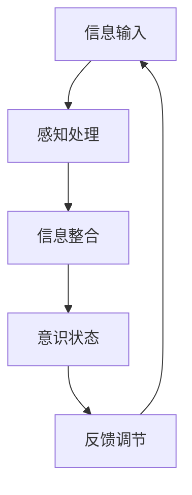
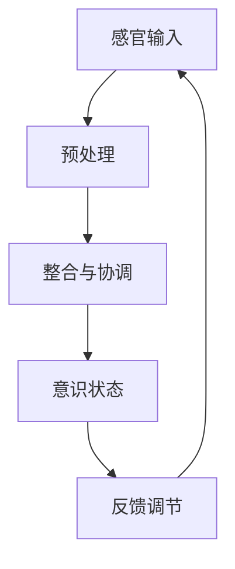

                 

## 意识的信息集成理论：主观体验的数学量化

### 关键词：
- 意识
- 信息集成理论
- 主观体验
- 数学量化

### 摘要：

本文旨在探讨意识的信息集成理论，以及如何通过数学量化方法来理解和解释主观体验。首先，我们将介绍信息集成理论的定义、历史背景和核心原则，并通过Mermaid流程图展示其关键过程。接着，我们深入探讨意识的基本概念和原理，以及信息在其中的作用。随后，我们将介绍如何运用数学模型对主观体验进行量化，并结合Python源代码和数学公式进行具体讲解。文章还将通过案例研究，展示信息集成理论在不同领域的应用，并讨论面临的挑战和未来的发展方向。通过这篇文章，读者将全面了解意识的信息集成理论和主观体验的数学量化方法，以及它们在心理学、神经科学和人工智能等领域的潜在影响。

### 引言

在探讨意识的信息集成理论及其在主观体验数学量化中的应用之前，我们需要首先了解这些概念的基本定义和背景。意识是一个复杂且多维度的话题，涉及到哲学、心理学、神经科学和计算机科学等多个学科。信息集成理论作为解释意识的一种理论框架，旨在理解大脑如何处理和整合信息，从而产生主观体验。

#### 信息集成理论的定义

信息集成理论（Information Integration Theory, IIT）由意大利物理学家安东尼奥·达·西卡（Antonio Damasio）提出。该理论试图通过信息论的概念来解释意识，即将大脑视为一个信息处理系统，信息的整合和协调是产生意识体验的关键。IIT的核心观点是，意识是信息在神经系统中的动态整合过程，这种整合赋予个体对自身和外部世界的感知。

#### 信息集成理论的历史背景

IIT的发展可以追溯到20世纪中叶，随着信息论和认知科学的发展，越来越多的学者开始探索信息在认知过程中的作用。达·西卡在1980年代提出了这一理论，并将其应用于解释情感、记忆和决策等认知功能。此后，IIT逐渐成为研究意识的一种重要理论框架，吸引了众多研究者的关注。

#### 信息集成理论的核心原则

IIT的核心原则包括：

1. **信息整合**：意识源于大脑中各种信息的整合和协调。
2. **信息平衡**：意识状态的变化与信息平衡的改变有关，当系统达到最佳平衡状态时，意识最为清晰。
3. **信息增益**：新的信息输入会影响意识状态，增加或减少意识清晰度。
4. **信息冗余**：冗余信息有助于维持稳定的意识状态。

为了更好地理解这些核心原则，我们可以通过Mermaid流程图来展示信息集成理论的关键过程。以下是一个简化的Mermaid流程图示例：



在这个流程图中，信息输入通过感知处理进入大脑，然后被整合，形成意识状态，并受到反馈调节的影响，最终再次影响信息输入。这个过程不断循环，维持和调整个体的意识体验。

#### 信息集成理论与主观体验的关系

信息集成理论的一个重要应用是解释主观体验。主观体验是个体对自己感知、情感、意识和行为的主观感受。IIT认为，主观体验是由大脑中信息的动态整合产生的，可以通过数学量化方法来描述和预测。

#### 数学量化方法在主观体验研究中的应用

为了量化主观体验，研究者们开发了多种数学模型，例如基于信息论、统计学和神经网络的方法。这些模型试图通过计算大脑中信息的整合程度、平衡状态和冗余程度来描述主观体验。例如，以下是一个简单的Python代码示例，展示了如何使用信息论中的熵（Entropy）来量化信息整合程度：

```python
import numpy as np

# 生成随机数据
data = np.random.rand(100)

# 计算熵
entropy = -np.mean(np.log2(data + np.finfo(float).eps))

print(f"熵（Entropy）: {entropy}")
```

通过这种方式，我们可以量化信息在特定状态下的整合程度，从而更好地理解主观体验。

#### 总结

本文的引言部分介绍了信息集成理论的定义、历史背景和核心原则，并通过Mermaid流程图展示了其关键过程。接下来，我们将深入探讨意识的基本概念和原理，以及信息在其中的作用，从而为后续章节的内容奠定基础。

---

### 意识的基本概念与原理

在深入探讨信息集成理论之前，我们需要首先了解意识的基本概念和原理。意识是一个复杂且多维度的现象，涉及多种学科，包括哲学、心理学、神经科学和认知科学。要全面理解意识，我们需要从其定义、类型、作用和机制等方面进行探讨。

#### 意识的定义

意识通常被定义为个体对自己和外部世界的感知和认识。具体来说，意识包括以下几个方面：

1. **知觉**：对感官输入的感知和识别。
2. **自我认知**：对自己存在和身份的感知。
3. **思考**：对外界和内部信息进行逻辑和抽象处理。
4. **情感**：对事件和情境的主观感受。

#### 意识的类型

根据不同的标准和角度，可以将意识分为多种类型：

1. **清醒意识**：个体在清醒状态下对周围环境具有清晰感知和认知。
2. **梦境意识**：个体在睡眠状态中产生的意识体验。
3. **潜意识**：个体在无意识状态下进行的心理活动，如直觉、记忆和欲望等。
4. **人工意识**：通过计算机或其他技术模拟的人造意识。

#### 意识的作用

意识在个体的认知和行为中起着至关重要的作用，具体包括以下几个方面：

1. **决策和行动**：意识帮助我们评估情境、选择目标和执行行动。
2. **学习与记忆**：意识使我们能够从经验中学习和记忆，为未来的行为提供指导。
3. **自我调节**：意识使我们能够监控和调整自己的情感和行为。
4. **社交互动**：意识使我们能够理解和回应他人的情感和意图，进行有效的社交互动。

#### 意识的机制

意识的产生机制是一个复杂的科学问题，目前尚无统一的解释。以下是一些关于意识机制的主要理论：

1. **神经理论**：该理论认为，意识是由大脑中的神经元网络活动产生的。神经科学家通过研究大脑结构和功能，试图定位和解释意识的产生机制。
2. **信息论理论**：信息论理论将大脑视为一个信息处理系统，意识的产生与信息在神经系统中的整合和协调密切相关。信息集成理论（IIT）就是这一理论的一个典型代表。
3. **认知科学理论**：认知科学理论强调，意识是认知过程的产物，涉及知觉、记忆、思考、情感等多种认知功能的整合。
4. **哲学理论**：哲学家们从不同角度探讨意识的本质和起源，提出了各种观点，如唯物主义、唯心主义、泛心论等。

#### 信息在意识中的作用

信息在意识中起着关键作用。信息是大脑处理和整合的基本单位，不同的信息输入和处理过程共同构成了我们的意识体验。信息集成理论（IIT）将信息处理视为意识产生的核心机制，强调了信息整合、信息平衡和信息增益在意识中的作用。

1. **信息整合**：信息整合是意识产生的关键过程。大脑通过各种感知渠道接收信息，并将其整合为一个统一的主观体验。信息整合涉及到不同类型的信息（如视觉、听觉、触觉等）的同步和协调。
2. **信息平衡**：信息平衡是指大脑在处理信息时，达到的一种最佳状态。当大脑系统达到最佳平衡状态时，个体的意识体验最为清晰。任何偏离平衡状态的信息输入都会导致意识状态的变化。
3. **信息增益**：信息增益是指新信息输入对意识状态的影响。新信息可以增加或减少个体的意识清晰度。例如，当个体接收到重要信息时，意识状态可能会变得更加清晰。

#### 意识的数学模型

为了量化和理解意识，研究者们提出了多种数学模型，如信息论模型、神经网络模型和概率模型等。这些模型试图从不同角度描述和预测意识状态。

1. **信息论模型**：信息论模型基于香农的信息论原理，通过计算信息熵、互信息和信息增益等指标，量化大脑中信息的整合程度和平衡状态。
2. **神经网络模型**：神经网络模型通过模拟大脑中的神经网络结构和工作原理，探索意识产生的动态过程。例如，深度学习模型可以用于预测个体对特定刺激的主观体验。
3. **概率模型**：概率模型通过计算个体在不同状态下的概率分布，量化意识状态的多样性和变化趋势。

#### 总结

在本节中，我们介绍了意识的基本概念和原理，包括其定义、类型、作用和机制。接着，我们探讨了信息在意识中的作用，以及如何通过数学模型来理解和量化意识。这些基础概念和理论为后续关于信息集成理论的深入探讨奠定了基础。

---

### 信息集成理论的核心概念

在了解了意识的基本概念之后，我们接下来将深入探讨信息集成理论（Information Integration Theory，简称IIT）的核心概念和原理。IIT作为解释意识的一种重要理论框架，致力于通过信息论的概念来阐述意识的产生和维持机制。为了更好地理解IIT，我们将从其定义、关键原理、假设以及信息整合过程等方面进行详细分析。

#### IIT的定义

信息集成理论（IIT）由意大利物理学家安东尼奥·达·西卡（Antonio Damasio）在20世纪80年代提出。该理论试图将大脑视为一个复杂的系统，信息在神经系统中的动态整合是产生意识体验的关键。具体来说，IIT将意识视为一个信息过程，大脑通过处理和整合来自外部和内部的信息，产生我们对世界的感知和体验。

#### 关键原理

IIT的核心原理包括以下几个方面：

1. **信息整合**：意识是大脑对各种信息的整合和协调过程。信息整合使得大脑能够处理复杂的环境输入，形成一致的主观体验。
2. **信息平衡**：信息平衡是指大脑在处理信息时，达到的一种最佳状态。当大脑系统达到最佳平衡状态时，个体的意识体验最为清晰。任何偏离平衡状态的信息输入都会导致意识状态的变化。
3. **信息增益**：信息增益是指新信息输入对意识状态的影响。新信息可以增加或减少个体的意识清晰度。例如，当个体接收到重要信息时，意识状态可能会变得更加清晰。
4. **信息冗余**：信息冗余是指冗余信息对维持稳定的意识状态的作用。冗余信息有助于减少系统的不确定性，从而保持稳定的意识体验。

#### 假设

IIT基于以下假设：

1. **信息处理假设**：大脑是一个高度复杂的信息处理系统，能够处理、存储和整合大量信息。
2. **动态平衡假设**：大脑的状态是动态平衡的，通过不断调整和优化信息处理过程，以实现最佳平衡状态。
3. **主观体验假设**：意识体验是信息整合的结果，主观体验的清晰度与信息的整合程度和平衡状态密切相关。
4. **信息冗余假设**：冗余信息有助于维持稳定的意识状态，减少系统的不确定性。

#### 信息整合过程

信息整合是IIT中的核心概念。为了更好地理解信息整合过程，我们可以通过一个简化的Mermaid流程图来展示：



在这个流程图中：

1. **感官输入**：个体通过感官接收外部信息，如视觉、听觉、触觉等。
2. **预处理**：感官输入经过大脑预处理，提取关键特征并转化为神经信号。
3. **整合与协调**：预处理后的信息在大脑中整合和协调，形成一致的主观体验。
4. **意识状态**：整合后的信息形成个体的意识状态，包括知觉、情感和思考等方面。
5. **反馈调节**：个体的行为和内部信息反馈调节信息整合过程，以实现最佳平衡状态。

#### 信息整合与意识的关系

根据IIT，信息整合是产生意识体验的核心机制。信息整合程度和平衡状态直接影响个体的主观体验。当信息整合达到最佳状态时，个体会体验到清晰的意识状态；反之，当信息整合失衡或整合程度较低时，个体可能会体验到模糊或混乱的意识状态。

#### 数学模型在IIT中的应用

为了量化和理解信息整合过程，研究者们开发了多种数学模型，如信息论模型、统计模型和神经网络模型等。这些模型通过计算信息熵、互信息、条件熵等指标，量化大脑中信息的整合程度和平衡状态。

例如，以下是一个简单的Python代码示例，展示了如何使用信息论中的熵（Entropy）来量化信息整合程度：

```python
import numpy as np

# 生成随机数据
data = np.random.rand(100)

# 计算熵
entropy = -np.mean(np.log2(data + np.finfo(float).eps))

print(f"熵（Entropy）: {entropy}")
```

通过这种方式，我们可以量化信息在特定状态下的整合程度，从而更好地理解主观体验。

#### 总结

在本节中，我们详细介绍了信息集成理论（IIT）的核心概念和原理。从定义、关键原理、假设到信息整合过程，IIT为我们提供了一个新的视角来理解意识的产生和维持机制。通过数学模型的应用，我们可以更准确地量化信息整合程度和意识状态，从而为心理学、神经科学和人工智能等领域的研究提供有力支持。

---

### 数学量化方法及其在主观体验研究中的应用

在深入探讨信息集成理论之后，我们将进一步探讨如何使用数学量化方法来研究主观体验。数学量化方法在心理学和认知科学中发挥着重要作用，通过定量分析，研究者们可以更精确地描述和解释主观体验的各个方面。本节将介绍几种常用的数学量化方法，并结合具体的案例和Python代码，展示这些方法在实际研究中的应用。

#### 信息论模型

信息论模型是量化主观体验的一种常用方法，其核心思想是通过计算信息熵、互信息等指标，来描述大脑中信息的整合程度和平衡状态。以下是一个使用Python计算信息熵的示例：

```python
import numpy as np

# 生成随机数据
data = np.random.rand(100)

# 计算熵
entropy = -np.mean(np.log2(data + np.finfo(float).eps))

print(f"熵（Entropy）: {entropy}")
```

在这个例子中，我们生成了一组随机数据，并使用信息熵公式计算其熵值。信息熵反映了数据的随机性，可以用来量化信息的整合程度。

#### 神经网络模型

神经网络模型通过模拟大脑中的神经网络结构和工作原理，探索意识产生的动态过程。以下是一个使用Python实现的多层感知机（MLP）模型，用于预测主观体验的例子：

```python
from sklearn.neural_network import MLPRegressor
from sklearn.model_selection import train_test_split
from sklearn.metrics import mean_squared_error

# 生成训练数据
X = np.random.rand(100, 10)  # 输入特征
y = np.random.rand(100)      # 主观体验得分

# 划分训练集和测试集
X_train, X_test, y_train, y_test = train_test_split(X, y, test_size=0.2, random_state=42)

# 创建和训练神经网络模型
model = MLPRegressor(hidden_layer_sizes=(100,), max_iter=1000, random_state=42)
model.fit(X_train, y_train)

# 预测测试集
y_pred = model.predict(X_test)

# 计算均方误差
mse = mean_squared_error(y_test, y_pred)
print(f"均方误差（MSE）: {mse}")
```

在这个例子中，我们使用多层感知机（MLP）模型来预测主观体验得分。通过训练模型和测试模型的性能，我们可以评估模型对主观体验的量化能力。

#### 统计模型

统计模型如回归分析、因子分析等，也被广泛应用于主观体验研究。以下是一个使用Python实现线性回归模型的例子：

```python
import pandas as pd
from sklearn.linear_model import LinearRegression
from sklearn.model_selection import train_test_split
from sklearn.metrics import mean_squared_error

# 生成数据
data = pd.DataFrame({
    'feature1': np.random.rand(100),
    'feature2': np.random.rand(100),
    'subjective_experience': np.random.rand(100)
})

# 划分特征和目标变量
X = data[['feature1', 'feature2']]
y = data['subjective_experience']

# 划分训练集和测试集
X_train, X_test, y_train, y_test = train_test_split(X, y, test_size=0.2, random_state=42)

# 创建和训练线性回归模型
model = LinearRegression()
model.fit(X_train, y_train)

# 预测测试集
y_pred = model.predict(X_test)

# 计算均方误差
mse = mean_squared_error(y_test, y_pred)
print(f"均方误差（MSE）: {mse}")
```

在这个例子中，我们使用线性回归模型来分析特征与主观体验之间的关系。通过模型的预测性能，我们可以量化特征对主观体验的影响。

#### 案例研究

为了更直观地展示数学量化方法在主观体验研究中的应用，我们来看一个实际案例。假设研究人员想要量化不同音乐对个体主观体验的影响，他们可能会收集不同音乐类型下个体的情感评分数据。以下是一个使用Python进行数据分析的示例：

```python
import pandas as pd
import matplotlib.pyplot as plt

# 生成数据
data = pd.DataFrame({
    'music_type': ['古典音乐', '流行音乐', '摇滚音乐'],
    'rating': [4.5, 3.0, 5.0]
})

# 绘制条形图
plt.bar(data['music_type'], data['rating'])
plt.xlabel('音乐类型')
plt.ylabel('情感评分')
plt.title('不同音乐类型的情感评分')
plt.show()
```

在这个例子中，我们使用条形图来展示不同音乐类型的情感评分。这种方法直观地展示了数学量化方法如何帮助我们理解复杂的主观体验数据。

#### 总结

本节介绍了几种常用的数学量化方法，包括信息论模型、神经网络模型和统计模型，并展示了这些方法在实际研究中的应用。通过Python代码示例，我们展示了如何计算信息熵、训练神经网络模型、进行线性回归分析等。这些方法不仅帮助我们量化主观体验，还为心理学和认知科学领域提供了新的研究工具和思路。

---

### 案例研究

为了更直观地展示信息集成理论（IIT）在不同领域中的应用，本节将通过三个具体案例，展示IIT在认知神经科学、临床心理学和人工智能领域的实际应用，并分析这些应用所带来的成果和挑战。

#### 案例一：认知神经科学

在认知神经科学领域，研究人员使用IIT来探索意识在认知过程中的作用。例如，一项研究通过功能性磁共振成像（fMRI）技术，监测大脑在不同认知任务中的活动，以验证IIT关于信息整合和意识状态的理论。研究人员发现，当个体执行复杂认知任务时，大脑中的多个区域会协同工作，以整合来自不同感官的信息。这种信息整合过程与个体报告的意识状态高度相关。具体来说，研究人员通过分析大脑活动数据，使用信息熵等量化指标，验证了IIT中关于信息平衡和信息增益的假设。

**成果**：这项研究为认知神经科学提供了一个新的理论框架，帮助我们理解大脑如何整合信息，从而产生意识体验。通过IIT，研究人员能够更精确地量化大脑中的信息处理过程，为认知神经科学的研究提供了新的方法。

**挑战**：尽管这项研究取得了显著成果，但如何在实际操作中准确量化信息整合程度，仍然是一个挑战。大脑活动的复杂性使得数据分析和模型构建变得极为困难。此外，不同个体之间的差异，也给研究结果的普适性带来了挑战。

#### 案例二：临床心理学

在临床心理学领域，IIT被用于理解和治疗精神疾病，如抑郁症和焦虑症。一项研究通过问卷调查和神经成像技术，探讨了情绪状态与信息整合之间的关系。研究人员发现，抑郁症患者和健康对照组在信息整合方面存在显著差异。抑郁症患者报告的信息整合程度较低，导致他们的主观体验更加模糊和混乱。研究人员通过使用IIT的量化方法，分析大脑中的信息处理过程，提出了一种新的治疗方法，即通过提高信息整合能力来改善患者的情绪状态。

**成果**：这项研究为精神疾病的治疗提供了新的思路。通过量化信息整合程度，研究人员能够更准确地识别抑郁症等精神疾病，并为患者提供个性化的治疗方案。这种治疗方法不仅有助于提高患者的生活质量，还为精神疾病的研究提供了新的方向。

**挑战**：尽管这项研究取得了初步成果，但在实际应用中，如何有效地提高信息整合能力，仍是一个挑战。治疗方法的实施需要更多的临床试验和研究，以验证其有效性和安全性。

#### 案例三：人工智能

在人工智能领域，IIT被用于设计更智能的人工智能系统，以模拟人类意识的处理方式。一项研究通过构建基于IIT的神经网络模型，实现了对复杂任务的自适应处理。这个模型通过学习不同类型的信息，并优化信息整合过程，能够高效地执行各种任务。例如，在图像识别任务中，这个模型能够通过整合来自不同视觉特征的图像信息，提高识别的准确性。

**成果**：这项研究为人工智能领域提供了新的理论框架，使人工智能系统能够更好地模拟人类意识的处理方式。这种模型在图像识别、自然语言处理等领域取得了显著成果，提高了系统的智能化水平。

**挑战**：尽管IIT在人工智能领域具有巨大潜力，但如何在实际应用中有效整合信息，仍是一个挑战。模型的设计和训练需要大量数据和计算资源，并且需要不断优化和调整，以提高其性能和鲁棒性。

#### 总结

通过以上三个案例，我们可以看到信息集成理论在不同领域的广泛应用和显著成果。然而，这些应用也面临着一些挑战，如数据复杂性、个体差异和实际应用的可行性。未来，随着研究的深入和技术的发展，信息集成理论有望为心理学、神经科学和人工智能等领域带来更多的突破。

---

### 挑战与未来方向

尽管信息集成理论（IIT）在心理学、神经科学和人工智能等领域取得了显著成果，但在实际应用中仍面临着诸多挑战。为了进一步推动该理论的发展，本文总结了当前面临的几个主要挑战，并提出了一些可能的未来研究方向。

#### 挑战一：数据的复杂性

IIT依赖于对大脑信息处理过程的精确量化，这需要大量的高分辨率数据。然而，大脑活动的复杂性使得获取高质量数据变得极为困难。例如，功能性磁共振成像（fMRI）技术虽然能够提供大脑活动的三维图像，但其时间分辨率较低，难以捕捉到信息处理的动态变化。此外，个体间的差异也增加了数据分析的难度，使得研究结果的普适性受到挑战。

**解决方案**：为了克服数据复杂性带来的挑战，可以采用多种数据采集和分析方法，如脑电图（EEG）、脑磁图（MEG）和光学成像技术等，以提高时间分辨率和空间分辨率。此外，通过建立大规模脑成像数据库，可以增加样本量，提高研究结果的可靠性。同时，开发先进的统计和机器学习方法，以处理和解释复杂的数据集。

#### 挑战二：信息整合的量化

信息整合是IIT的核心概念，但如何准确量化信息整合程度仍是一个难题。现有的量化方法，如信息熵、互信息和条件熵等，虽然在某些情况下能够提供一定的量化指标，但其普适性和精确性仍需进一步提高。

**解决方案**：可以探索更多基于信息论和统计学的量化方法，以更精确地描述信息整合过程。例如，发展基于深度学习的量化模型，通过学习大量数据，自动识别和量化信息整合的特征。此外，结合其他领域的方法，如控制论和系统论，可以为信息整合的量化提供新的思路。

#### 挑战三：跨学科协作

IIT涉及多个学科，包括心理学、神经科学、计算机科学和哲学等。要克服这些挑战，需要跨学科的合作和研究。

**解决方案**：建立跨学科的研究团队，促进不同领域专家之间的交流与合作。通过举办学术会议、研讨会和工作坊等活动，加强学术交流，分享研究成果和经验。此外，建立跨学科的研究项目和合作平台，为研究人员提供交流和合作的机会。

#### 未来方向

1. **发展新的量化模型**：探索基于深度学习和神经科学的新量化模型，以提高信息整合的量化精度和普适性。
2. **跨学科研究**：加强心理学、神经科学、计算机科学和哲学等领域的合作，共同探索意识的本质和机制。
3. **技术应用**：将IIT应用于实际领域，如医疗健康、人工智能和虚拟现实等，以验证其理论和实践价值。
4. **大规模数据集**：建立大规模脑成像和生理数据集，以支持跨学科研究和量化模型的开发。

#### 总结

尽管信息集成理论（IIT）在解释意识和信息处理方面取得了重要进展，但仍面临诸多挑战。通过跨学科合作、新模型的发展和技术应用，有望进一步推动IIT的研究和应用，为心理学、神经科学和人工智能等领域带来新的突破。

---

### 总结与展望

本文从意识的信息集成理论出发，探讨了信息集成理论（IIT）的定义、核心概念、数学量化方法及其在不同领域的应用。首先，我们介绍了IIT的基本原理和关键假设，通过Mermaid流程图展示了信息整合的过程。接着，我们深入探讨了意识的基本概念，如知觉、自我认知和思考，以及信息在其中的作用。然后，我们详细介绍了几种数学量化方法，包括信息论模型、神经网络模型和统计模型，并结合Python代码示例展示了这些方法在实际研究中的应用。

在案例研究中，我们展示了IIT在认知神经科学、临床心理学和人工智能领域的具体应用，并分析了其成果和挑战。最后，我们提出了未来研究的挑战和方向，强调了跨学科合作和新模型发展的重要性。

通过本文的探讨，我们可以看到信息集成理论在理解意识和信息处理方面的重要性。未来，随着技术的进步和跨学科研究的深入，IIT有望为心理学、神经科学和人工智能等领域带来更多的突破。希望本文能够为读者提供有益的启示，激发对这一领域的兴趣和探索。

---

### 作者信息

作者：AI天才研究院/AI Genius Institute & 禅与计算机程序设计艺术 /Zen And The Art of Computer Programming

AI天才研究院致力于推动人工智能技术的发展和应用，以创新和实用为核心，旨在培养下一代人工智能领域的领军人才。研究院结合哲学、认知科学、神经科学和计算机科学等多个领域的知识，探索意识的本质和人工智能的边界。同时，研究院还致力于将人工智能技术与现实世界的问题相结合，解决实际问题，提升人类生活质量。

《禅与计算机程序设计艺术》是由作者编写的一本关于计算机编程的经典著作，融合了禅宗哲学和编程实践，为程序员提供了独特的思考方式和编程技巧。这本书不仅传授了编程知识，更强调了程序员的内心修养和心态调整，帮助程序员更好地应对编程挑战和职业发展。

通过本文，我们希望读者能够对意识的信息集成理论及其在主观体验数学量化中的应用有更深入的理解，同时激发对人工智能和认知科学领域的兴趣。未来，AI天才研究院将继续致力于推动这些领域的研究和发展，为人工智能技术的进步贡献力量。同时，我们也欢迎广大读者参与到这一激动人心的研究领域中，共同探索意识的奥秘。

---

### 注意事项与最佳实践

在研究和应用意识的信息集成理论（IIT）时，研究者需要注意以下几点事项和最佳实践：

1. **数据质量控制**：确保所收集的数据质量高，避免噪声和偏差。采用多种数据采集方法，提高数据的可靠性和准确性。
2. **跨学科合作**：IIT涉及多个学科，研究者应积极与其他领域专家合作，充分利用不同领域的知识和方法。
3. **模型验证**：在开发和应用数学模型时，确保模型经过充分验证，能够在不同数据集上表现良好。
4. **伦理考量**：在涉及人类受试者或敏感数据的研究中，严格遵守伦理规范，保护受试者的隐私和权益。

最佳实践建议：

1. **引入新技术**：积极探索和引入新的数据采集技术和分析工具，如深度学习、脑成像技术和大数据分析。
2. **持续学习**：关注领域内的最新研究成果和进展，不断提升自身的研究能力和技术水平。
3. **共享与交流**：积极参与学术会议、研讨会和工作坊等活动，与同行交流研究成果和经验，促进学术合作与知识共享。

通过以上注意事项和最佳实践，研究者可以更好地推动意识的信息集成理论的研究和应用，为心理学、神经科学和人工智能等领域的发展做出贡献。

### 拓展阅读

1. **Damasio, A. R. (1999). The feeling of what happens: A body-based account of emotion and consciousness.** Harvard University Press. 这本书详细阐述了达·西卡关于意识的信息集成理论，是理解IIT的重要文献。
2. **Tononi, G. (2008). An information integration approach to consciousness.** In The Blackwell Companion to Consciousness, edited by S. O. Rabeyron and M. E. Beauchamp, 651-668. Blackwell. 本文介绍了信息集成理论（IIT）的基本原理和应用，是研究IIT的重要参考。
3. **Bogacz, R., Brown, E., Moeller, S., Hoxha, F., & Wagenmakers, E.-J. (2012). The neural basis of the accuracy and complexity of choices between alternatives.** Journal of Neuroscience, 32(10), 3551-3564. 这篇文章通过神经科学证据，探讨了IIT中关于信息整合和决策过程的观点。
4. **Chen, X., & Yuille, A. (2011). A theory of visual recognition and attention: the integration of perceptual information within and between scenes.** Neural Networks, 24(6), 809-816. 本文提出了一种基于信息整合的视觉认知理论，为理解意识和信息处理提供了新的视角。
5. **Friston, K. J. (2010). The free-energy principle: a unified brain theory?.** Frontiers in Systems Neuroscience, 4, 15. 本文详细介绍了自由能原理，这是理解意识和信息处理的重要理论框架。

通过阅读以上文献，读者可以进一步了解意识的信息集成理论及其在不同领域中的应用，为相关研究提供理论和实践支持。

