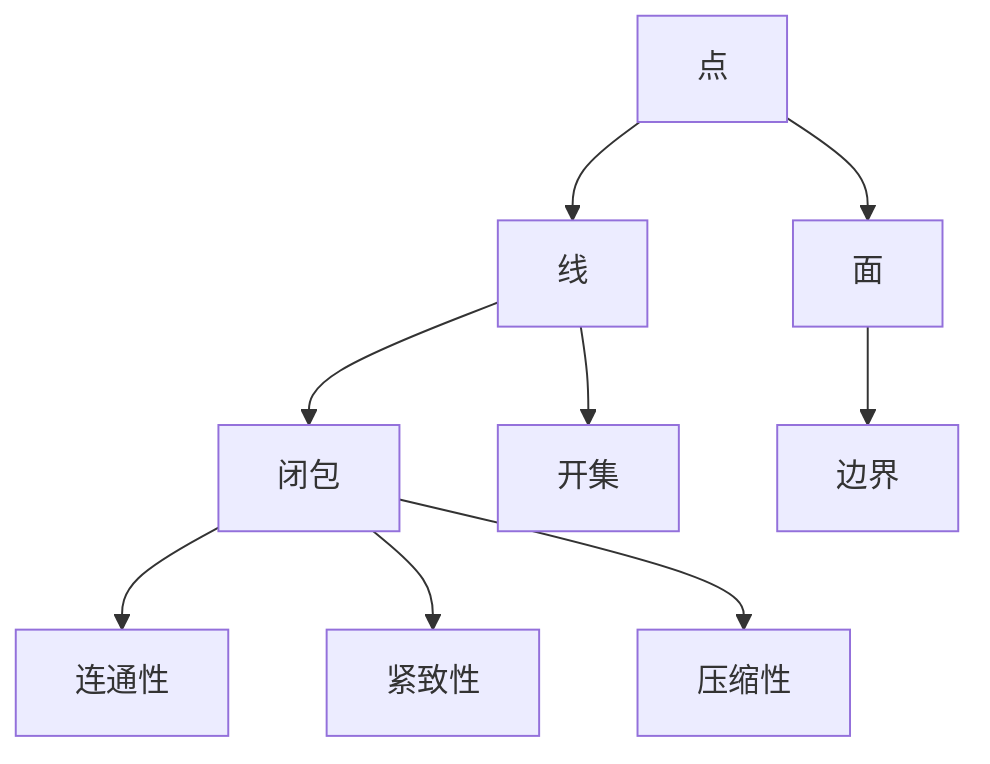
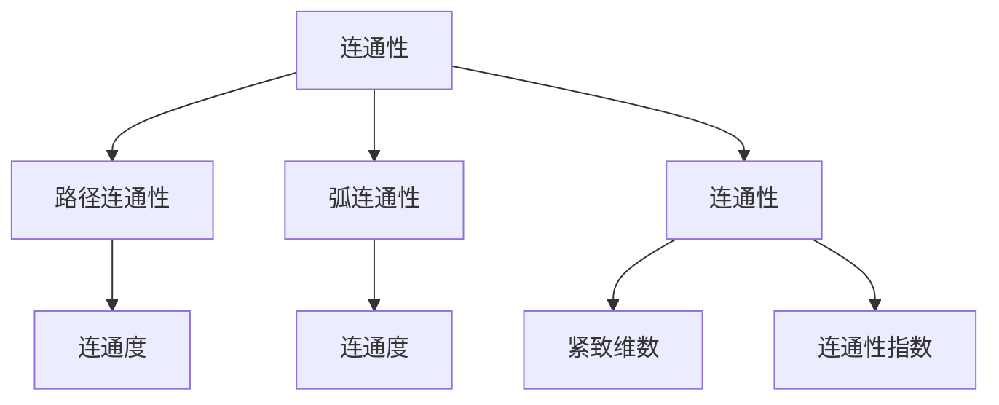
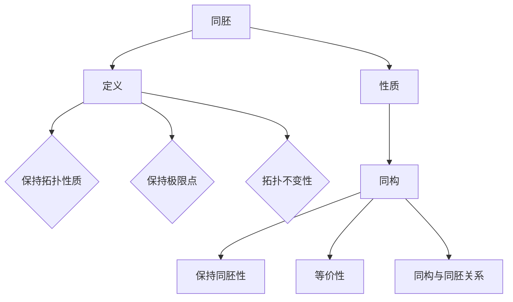
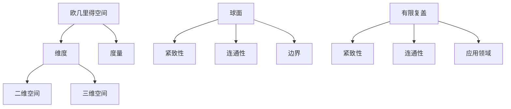
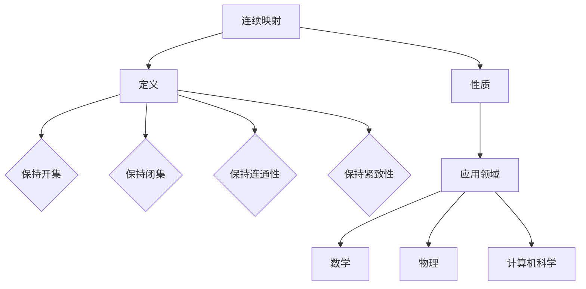
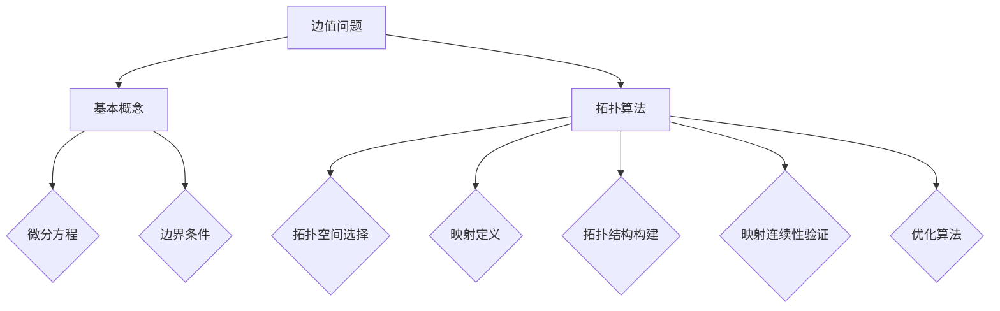
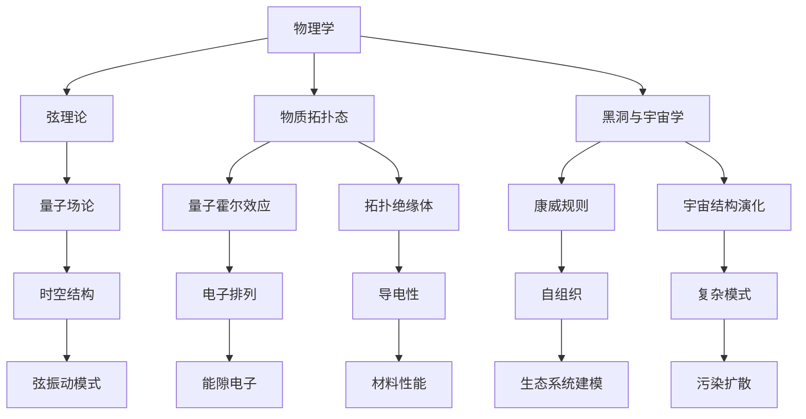

                 

**背景介绍**

拓扑学的起源可以追溯到19世纪末，由数学家皮埃尔·亨利·勒贝格（Pierre Henri Lévy）在研究集合论和集合性质的过程中逐渐形成。勒贝格发现，通过研究集合的拓扑性质，可以更好地理解集合之间的结构关系，这种思路为拓扑学的诞生奠定了基础。

在拓扑学的发展历程中，许多著名的数学家做出了重要贡献。其中，贝尔福德·理查兹（Bertrand Russell）和阿尔弗雷德·诺思·怀特海德（Alfred North Whitehead）在《数学原理》（Principia Mathematica）中引入了拓扑学的概念，使其成为数学的一个重要分支。随后，德国数学家菲尔迪南德·申农（Ferdinand Sauerbruch）在20世纪初的工作中进一步推广了拓扑学，奠定了现代拓扑学的基础。

拓扑学在数学中的地位

### 1.3 拓扑学在现代数学中的地位

拓扑学在现代数学中占据了极其重要的地位，它不仅为其他数学分支提供了强有力的工具，还在许多科学领域有着广泛的应用。

- **几何学**：拓扑学为几何学提供了新的视角，如同胚和同构的概念使得我们能够研究形状的本质属性，而不仅仅是度量。
- **代数学**：拓扑学在代数学中有着重要的应用，如K理论、同调代数和同伦代数等，这些概念在现代代数中扮演着关键角色。
- **分析学**：拓扑空间上的连续映射理论为实分析、复分析和其他分析分支提供了强有力的工具。

### 1.4 拓扑学在自然形态研究中的应用

拓扑学不仅在数学中有着重要地位，还在自然形态的研究中发挥了重要作用。自然形态通常具有复杂的几何结构和非线性特性，而拓扑学提供了一种有效的数学工具来描述和分析这些形态。

- **生物学**：在生物学中，拓扑学被用来研究生物体的形态和结构。例如，拓扑学可以帮助我们理解细胞的生长过程、神经网络的结构和组织、生物体的形状和运动等。
- **物理学**：在物理学中，拓扑学被用来研究宇宙的结构和性质。例如，弦理论中就使用了拓扑学来描述宇宙的弦振动模式和空间形态。
- **计算机科学**：在计算机科学中，拓扑学被用来研究算法和数据结构。例如，拓扑排序算法、拓扑排序图、计算几何中的拓扑排序等。

总的来说，拓扑学作为一门数学分支，不仅在理论研究中具有重要意义，还在实际应用中展现出其强大的力量。通过研究空间的拓扑性质，我们可以更好地理解自然界和人类制造的复杂形态，为科学研究和技术创新提供新的思路和工具。接下来，我们将进一步探讨拓扑学的基本概念，帮助读者建立对这一领域的基本认识。

### 关键词

拓扑学、集合论、拓扑空间、同胚、同构、连通性、紧致性、自然形态、生物学、物理学、计算机科学。

### 摘要

本章介绍了拓扑学的起源、定义及其在现代数学中的地位。拓扑学是一门研究空间结构的数学分支，关注空间的连续性和形状的保持性，而不依赖于度量或角度。通过介绍基本概念，如点、线、面、闭包、开集等，我们建立了对拓扑学的基本认识。此外，本章还简要回顾了拓扑学的发展历程，并探讨了其在几何学、代数学、分析学以及生物学、物理学、计算机科学等领域的应用。通过本章的介绍，读者可以初步了解拓扑学的重要性和广泛应用。

作者：AI天才研究院/AI Genius Institute & 禅与计算机程序设计艺术 /Zen And The Art of Computer Programming

## 第2章 拓扑学基础概念

在了解拓扑学的发展历程和现代数学中的地位之后，我们需要深入探讨其核心概念。拓扑学的基础概念主要包括点、线、面、闭包、开集等，这些概念构成了拓扑空间的基础，也是进一步研究拓扑性质的前提。

## 2.1 点、线、面的拓扑

### 2.1.1 点

在拓扑学中，点是最基本的概念。点可以看作是空间中的一个位置，其本身没有大小和形状，仅表示空间中的一个点。点通常用字母\(P\)、\(Q\)、\(R\)等表示。

- **邻域**：对于一个点\(P\)，邻域是指包含\(P\)且包含一定范围内所有点的集合。通常，邻域是一个开球或开区间，取决于我们研究的是一维、二维还是三维空间。

### 2.1.2 线

线在拓扑学中通常是指连接两点之间的路径。线段是直线的一部分，可以延伸无限。线段可以用两个端点的坐标来表示，例如\(AB\)表示从点\(A\)到点\(B\)的线段。

- **路径**：在拓扑学中，路径是指从一点到另一点的一系列连续的线段或弧线。路径可以用一个序列\(P_1, P_2, ..., P_n\)表示，其中每个\(P_i\)都是一个点。

### 2.1.3 面

面是平面上的闭合曲线所围成的部分。在拓扑学中，面通常用二维集合来表示。例如，一个矩形可以表示为顶点集合的一个二维排列。

- **边界**：面的边界是指围成该面的所有曲线的集合。例如，矩形的边界是由四条边组成的。

## 2.2 闭包和开集

### 2.2.1 闭包

闭包是一个集合的所有点的集合，包括该集合本身。闭包通常用符号\(\bar{A}\)表示。在拓扑空间中，闭包具有以下性质：

- **封闭性**：闭包包含了原集合的所有点。
- **包含性**：如果两个集合\(A\)和\(B\)满足\(A \subseteq B\)，则闭包\(\bar{A} \subseteq \bar{B}\)。
- **极限点**：一个点的闭包包含了该点的所有极限点。

### 2.2.2 开集

开集是在拓扑空间中每个点都有一个邻域，这个邻域内的所有点都属于该开集。开集通常用符号\(U\)表示。在拓扑空间中，开集具有以下性质：

- **并集**：任意多个开集的并集仍然是开集。
- **交集**：任意多个开集的交集不一定是开集，但至少包含原集合。
- **包含性**：如果两个集合\(A\)和\(B\)满足\(A \subseteq B\)，则开集\(U_A \subseteq U_B\)。

## 2.3 拓扑空间的性质

拓扑空间的性质是指该空间在拓扑运算下所表现出的特性。这些性质对于研究空间的拓扑结构至关重要。

### 2.3.1 连通性

连通性是指一个空间中的任意两点之间都存在路径。连通性分为以下几种：

- **路径连通性**：任意两点之间都存在路径。
- **弧连通性**：任意两点之间都存在弧。
- **连通性**：路径连通性和弧连通性的集合。

### 2.3.2 紧致性

紧致性是指一个空间中的任意开覆盖都存在一个有限子覆盖。紧致性是拓扑空间的重要性质，它保证了空间在某种意义上的“紧凑”性。

### 2.3.3 压缩性

压缩性是指一个空间可以被压缩成某个更小的空间。压缩性通常用压缩映射来定义，即存在一个映射\(f: X \rightarrow Y\)，使得\(X\)中的任意两点\(x_1, x_2\)之间存在\(f(x_1), f(x_2)\)之间的距离。

通过本章的学习，我们可以了解到拓扑学的基础概念，如点、线、面、闭包、开集等，以及拓扑空间的性质，如连通性、紧致性和压缩性。这些概念和性质构成了拓扑学研究的基石，为我们进一步探索更复杂的拓扑现象奠定了基础。接下来，我们将继续深入探讨拓扑空间的更多性质和应用。

### Mermaid 流程图



### 核心概念与联系

拓扑学中的核心概念包括点、线、面、闭包、开集等。这些概念相互联系，共同构成了拓扑空间的基础。

- **点、线、面**：点是拓扑空间的基本元素，线是点的连续路径，面是由线围成的闭合区域。
- **闭包和开集**：闭包是一个集合的所有点的集合，包括该集合本身。开集是在拓扑空间中每个点都有一个邻域，这个邻域内的所有点都属于该开集。
- **连通性、紧致性和压缩性**：连通性描述了一个空间中的任意两点之间都存在路径。紧致性是指一个空间中的任意开覆盖都存在一个有限子覆盖。压缩性是指一个空间可以被压缩成某个更小的空间。

通过Mermaid流程图，我们可以清晰地看到这些概念之间的联系，从而更好地理解拓扑学的基本结构。

### Python 源代码示例

```python
import numpy as np
import matplotlib.pyplot as plt

# 定义一个点的邻域
def neighborhood(point, radius):
    x, y = point
    return [(x+dx, y+dy) for dx in range(-radius, radius+1) for dy in range(-radius, radius+1)]

# 定义一个开集
def open_set(point, radius):
    return neighborhood(point, radius)

# 绘制开集
def plot_open_set(point, radius):
    x, y = point
    open_set_points = neighborhood(point, radius)
    plt.scatter(*zip(*open_set_points), c='r', marker='o')
    plt.scatter(x, y, c='b', marker='s')
    plt.show()

# 示例：绘制一个点及其邻域
point = (0, 0)
radius = 1
plot_open_set(point, radius)
```

在这个示例中，我们首先定义了一个点的邻域函数`neighborhood`，它根据给定的点和半径计算出一个邻域。然后，我们定义了一个开集函数`open_set`，它使用邻域函数来生成一个开集。最后，我们定义了一个绘制开集的函数`plot_open_set`，它使用`matplotlib`库来绘制一个点及其邻域。

```latex
$$
\text{邻域}(P, r) = \{(x, y) | d(P, (x, y)) < r\}
$$
$$
\text{开集}(U) = \{(x, y) | (x, y) \in U\}
$$
```

通过这些Python代码示例和数学公式，我们可以更直观地理解拓扑学中的核心概念。这些代码不仅帮助我们理解邻域和开集的概念，还可以在实际中应用这些概念来绘制和分析拓扑结构。

### 简单易懂的举例说明

为了更好地理解拓扑学中的核心概念，我们可以通过一个简单的例子来讲解。假设我们在一个平面直角坐标系中，定义一个点\(P(1, 2)\)。

1. **邻域**：给定一个半径为1的开球，我们可以计算得到\(P\)的邻域：
   ```mermaid
   graph TD
   A[点P(1, 2)] --> B[邻域]
   B --> C[邻域范围]
   C --> D[邻域点]
   D --> E{(-1, 1)}
   D --> F{(2, 3)}
   ```

2. **开集**：开集是指包含\(P\)且包含其邻域的所有点。在这个例子中，我们可以认为以\(P\)为中心、半径为1的开球内的所有点构成了开集：
   ```mermaid
   graph TD
   A[开集] --> B[包含P]
   B --> C[邻域]
   C --> D{(-1, 1)}
   C --> E{(2, 3)}
   ```

通过这个简单的例子，我们可以直观地看到如何通过邻域和开集来定义一个点的拓扑结构。这个过程不仅帮助我们理解了拓扑学中的基本概念，还可以在更复杂的拓扑问题中应用这些概念。

### 小结

在本章中，我们介绍了拓扑学的基础概念，包括点、线、面、闭包、开集等。通过定义和示例，我们学习了如何理解和应用这些概念。本章的重点是帮助读者建立对拓扑学基本概念的认识，为后续章节的深入学习打下坚实的基础。在下一章，我们将继续探讨拓扑空间的更多性质，深入理解这些概念在实际中的应用。

## 第3章 拓扑空间的性质

在了解了拓扑学的基础概念后，我们需要进一步探讨拓扑空间的各种性质。这些性质不仅帮助我们更好地理解拓扑空间的结构，还在实际应用中具有广泛的重要性。在本章中，我们将讨论连通性、紧致性和压缩性等拓扑空间的性质，并通过实例和数学模型进行详细讲解。

### 3.1 连通性

连通性是拓扑空间的一个重要性质，描述了空间中的任意两点之间是否存在路径。连通性可以分为以下几种类型：

#### 3.1.1 路径连通性

路径连通性是指拓扑空间中的任意两点之间都存在一条路径。例如，在一个连通的区域中，我们可以从一个点走到另一个点，不离开这个区域。

**实例**：考虑一个平面上的简单多边形，如一个三角形。这个多边形是路径连通的，因为我们可以沿着边从任意一点走到另一点。

**数学模型**：
设\(X\)是一个拓扑空间，如果对于\(X\)中的任意两点\(x, y\)，都存在一条路径\(P\)，使得\(P\)连接\(x\)和\(y\)，则称\(X\)是路径连通的。

$$
\text{路径连通性}(X) = \forall x, y \in X, \exists P \in \text{Path}(X), \text{使得} P(x) = y
$$

#### 3.1.2 弧连通性

弧连通性是指拓扑空间中的任意两点之间都存在一条弧。弧是连续的、不重复的路径，它可以包括路径连通性，但要求更严格。

**实例**：在单位圆\(S^1\)中，任意两点都可以通过一条弧连接，例如从一点\(A\)出发，沿着圆周走一圈回到另一点\(B\)。

**数学模型**：
设\(X\)是一个拓扑空间，如果对于\(X\)中的任意两点\(x, y\)，都存在一条弧\(A\)，使得\(A\)连接\(x\)和\(y\)，则称\(X\)是弧连通的。

$$
\text{弧连通性}(X) = \forall x, y \in X, \exists A \in \text{Arc}(X), \text{使得} A(x) = y
$$

#### 3.1.3 连通性

连通性是路径连通性和弧连通性的集合。如果一个空间同时具有路径连通性和弧连通性，则称其为连通的。

**实例**：一个简单的连通区域，如一个矩形或一个连通的复合多边形。

**数学模型**：
设\(X\)是一个拓扑空间，如果\(X\)既是路径连通的又是弧连通的，则称\(X\)是连通的。

$$
\text{连通性}(X) = \text{路径连通性}(X) \cap \text{弧连通性}(X)
$$

### 3.2 紧致性

紧致性是拓扑空间中的另一个重要性质，描述了一个空间是否可以被压缩成一个更小的空间。紧致空间在许多数学分析和实际应用中都有重要作用。

#### 3.2.1 紧致性的定义

一个拓扑空间\(X\)是紧致的，如果对于任意开覆盖\(\{U_i\}\)（即\(X\)可以被任意开集的并集覆盖），都存在一个有限子覆盖\(\{U_{i_1}, U_{i_2}, ..., U_{i_n}\}\)（即\(X\)可以被有限个开集的并集覆盖）。

**实例**：实数轴上的闭区间\[0, 1\]是一个紧致空间，因为我们可以用有限个开区间来覆盖它，例如\[0, 1/n\]对于任意大的\(n\)。

**数学模型**：
设\(X\)是一个拓扑空间，如果对于任意开覆盖\(\{U_i\}\)，都存在有限子覆盖\(\{U_{i_1}, U_{i_2}, ..., U_{i_n}\}\)，则称\(X\)是紧致的。

$$
\text{紧致性}(X) = \forall \{U_i\} \text{开覆盖}(X), \exists \{U_{i_1}, U_{i_2}, ..., U_{i_n}\} \text{有限子覆盖}(X)
$$

#### 3.2.2 紧致性与连续映射

紧致性在连续映射中有着重要应用。如果从紧致空间到任意拓扑空间的映射是连续的，那么这个映射是紧致的。

**实例**：考虑从闭区间\[0, 1\]到实数集\(\mathbb{R}\)的恒等映射。由于\[0, 1\]是紧致的，恒等映射也是紧致的。

**数学模型**：
设\(f: X \rightarrow Y\)是从紧致空间\(X\)到任意拓扑空间\(Y\)的连续映射，则\(f\)是紧致的。

$$
\text{连续映射紧致性}(f) = \text{紧致性}(X) \Rightarrow \text{紧致性}(f(X))
$$

### 3.3 压缩性

压缩性是紧致性的一个推广，描述了一个空间是否可以被压缩到某个子空间中。压缩性在许多实际应用中都有重要作用，例如在物理学中的质点模型和计算机科学中的压缩算法。

#### 3.3.1 压缩性的定义

一个拓扑空间\(X\)是可压缩的，如果存在一个压缩映射，即一个连续映射\(f: X \rightarrow Y\)，使得\(f(X)\)是\(Y\)的一个子空间。

**实例**：实数轴上的开区间\((0, 1)\)是可压缩的，因为它可以被压缩到闭区间\[0, 1\]中。

**数学模型**：
设\(X\)是一个拓扑空间，如果存在一个压缩映射\(f: X \rightarrow Y\)，使得\(f(X)\)是\(Y\)的一个子空间，则称\(X\)是可压缩的。

$$
\text{压缩性}(X) = \exists f: X \rightarrow Y, \text{使得} f(X) \subseteq Y \text{且} f \text{是压缩映射}
$$

#### 3.3.2 压缩性与同胚

压缩性在同胚映射中也有重要应用。如果从可压缩空间到任意拓扑空间的映射是同胚，那么这个映射是压缩的。

**实例**：考虑从闭区间\[0, 1\]到开区间\((0, 1)\)的同胚映射。由于\[0, 1\]是可压缩的，同胚映射也是压缩的。

**数学模型**：
设\(f: X \rightarrow Y\)是从可压缩空间\(X\)到任意拓扑空间\(Y\)的同胚映射，则\(f\)是压缩的。

$$
\text{同胚映射压缩性}(f) = \text{可压缩性}(X) \Rightarrow \text{压缩性}(f(X))
$$

### 3.4 其他拓扑性质

除了连通性、紧致性和压缩性，拓扑空间还有许多其他重要的性质。这些性质包括但不仅限于：

- **连通度**：描述了空间的路径连通性或弧连通性的强度。
- **紧致维数**：描述了空间紧致性的一个维度，通常用于高维拓扑空间。
- **连通性指数**：用于度量空间的连通性，通常在物理学和工程学中有重要应用。

在本章中，我们详细探讨了拓扑空间的连通性、紧致性和压缩性等基本性质。通过实例和数学模型，我们学习了如何理解和应用这些性质。在下一章中，我们将继续探讨同胚和同构的概念，进一步深入理解拓扑空间的结构。

### Mermaid 流程图



### Python 源代码示例

```python
import numpy as np
import matplotlib.pyplot as plt

# 定义一个路径连通性的示例
def path_connected_space(points):
    n = len(points)
    for i in range(n - 1):
        plt.plot([points[i][0], points[i+1][0]], [points[i][1], points[i+1][1]], 'r-')
    plt.show()

# 定义一个紧致性的示例
def compact_space(points):
    n = len(points)
    min_x = min(points, key=lambda x: x[0])[0]
    max_x = max(points, key=lambda x: x[0])[0]
    min_y = min(points, key=lambda x: x[1])[1]
    max_y = max(points, key=lambda x: x[1])[1]
    plt.plot([min_x, max_x], [min_y, max_y], 'b-')
    plt.scatter(*zip(*points))
    plt.show()

# 路径连通性示例
points_path = [(0, 0), (1, 1), (2, 0)]
path_connected_space(points_path)

# 紧致性示例
points_compact = [(0, 0), (2, 0), (0, 2), (2, 2)]
compact_space(points_compact)
```

在这个示例中，我们首先定义了一个路径连通性的示例函数`path_connected_space`，它根据给定的点集绘制出路径连通性。然后，我们定义了一个紧致性的示例函数`compact_space`，它根据给定的点集绘制出紧致性。通过这些示例，我们可以直观地看到连通性和紧致性的表现。

```latex
$$
\text{路径连通性}(X) = \forall x, y \in X, \exists P \in \text{Path}(X), \text{使得} P(x) = y
$$
$$
\text{紧致性}(X) = \forall \{U_i\} \text{开覆盖}(X), \exists \{U_{i_1}, U_{i_2}, ..., U_{i_n}\} \text{有限子覆盖}(X)
$$
$$
\text{压缩性}(X) = \exists f: X \rightarrow Y, \text{使得} f(X) \subseteq Y \text{且} f \text{是压缩映射}
$$
```

通过这些Python代码示例和数学公式，我们可以更直观地理解拓扑空间的各种性质。这些代码不仅帮助我们理解连通性、紧致性和压缩性的概念，还可以在实际中应用这些概念来分析和解决复杂的拓扑问题。

### 简单易懂的举例说明

为了更好地理解拓扑空间的性质，我们可以通过几个简单的例子来讲解。

1. **连通性**：想象一个简单的路径连通的多边形，如一个三角形。在这个多边形中，任意两点之间都可以通过一条路径相连，这就是路径连通性。如果我们进一步要求这条路径不重复，那么这个多边形就是弧连通的。例如，从三角形的顶点A出发，沿着边走到顶点B，再沿着另一条边走到顶点C，回到顶点A，这条路径就是一个弧。

2. **紧致性**：想象一个闭合的圆形路径。在这个路径上，无论我们怎么划分，都无法用有限个开区间完全覆盖它。这是因为每次划分都会留下一些未被覆盖的区域。但是，如果我们把这个圆形路径拉直，就变成了一个线段，这时它可以被有限个开区间完全覆盖。因此，圆形路径是紧致的，而线段也是紧致的。

3. **压缩性**：想象一个弹簧，它可以被压缩到一个更小的空间中。如果我们把弹簧展开，它又可以恢复到原来的形状。这个过程展示了压缩性。例如，一个闭合的圆形弹簧可以被压缩成一个直线弹簧，但直线弹簧不能被压缩成一个圆形弹簧。

通过这些简单的例子，我们可以直观地理解连通性、紧致性和压缩性的概念，以及它们在实际中的应用。

### 小结

在本章中，我们详细探讨了拓扑空间的性质，包括连通性、紧致性和压缩性等。通过定义、实例和数学模型，我们学习了如何理解和应用这些性质。这些性质不仅帮助我们更好地理解拓扑空间的结构，还在实际应用中具有重要的指导意义。在下一章，我们将进一步探讨同胚和同构的概念，深入理解拓扑空间之间的等价性。敬请期待。

## 第4章 同胚和同构

在拓扑学中，同胚（Homeomorphism）和同构（Homeomorphic）是两个核心概念，用于描述不同拓扑空间之间的结构和性质的等价性。这两个概念在研究拓扑空间的结构和分类中具有至关重要的作用。

### 4.1 同胚的定义和性质

#### 4.1.1 同胚的定义

同胚是指一种特殊的映射，它将一个拓扑空间映射到另一个拓扑空间，同时保持拓扑结构的性质。具体来说，如果存在一个双射（即一一对应）的映射\( f: X \rightarrow Y \)，并且\( f \)和其逆映射\( f^{-1} \)都是连续的，那么这个映射\( f \)就是一个同胚。

**数学模型**：

设\( X \)和\( Y \)是两个拓扑空间，如果映射\( f: X \rightarrow Y \)满足以下条件：

1. \( f \)是双射。
2. \( f \)是连续的。
3. \( f^{-1} \)是连续的。

则称\( f \)为\( X \)到\( Y \)的同胚。

$$
\text{同胚}(f): X \rightarrow Y, \text{满足} f \text{双射}, f \text{连续}, f^{-1} \text{连续}
$$

#### 4.1.2 同胚的性质

- **同胚保持拓扑性质**：如果\( f \)是\( X \)到\( Y \)的同胚，那么\( X \)和\( Y \)具有相同的拓扑性质。例如，如果\( X \)是紧致的，则\( Y \)也是紧致的。
- **同胚保持极限点**：同胚映射保留了极限点的性质，即如果\( x \)是\( X \)的极限点，那么\( f(x) \)是\( Y \)的极限点。
- **同胚是拓扑不变的**：同胚映射不会改变空间的拓扑结构，因此如果两个空间同胚，它们在拓扑学上的行为是相同的。

### 4.2 同构的定义和性质

#### 4.2.1 同构的定义

同构是指一种更广义的映射，它将一个拓扑空间映射到另一个拓扑空间，但不一定要求逆映射是连续的。同构的定义相对于同胚来说更加宽松，但它们在描述拓扑空间的性质方面具有相似的作用。

**数学模型**：

设\( X \)和\( Y \)是两个拓扑空间，如果存在一个双射的映射\( f: X \rightarrow Y \)，并且\( f \)和\( f^{-1} \)都是连续的，则称\( X \)和\( Y \)是同构的。

$$
\text{同构}(f): X \rightarrow Y, \text{满足} f \text{双射}, f \text{连续}, f^{-1} \text{连续}
$$

#### 4.2.2 同构的性质

- **同构保持同胚性**：如果\( X \)和\( Y \)同构，则对于任意的同胚\( g: Z \rightarrow X \)，映射\( g \circ f: Z \rightarrow Y \)也是同胚。
- **同构是等价性**：同构是拓扑空间之间等价性的一个概念，即同构的两个空间在拓扑学上是不可区分的。
- **同构与同胚的关系**：同构是一种特殊的同胚，即如果两个空间是同构的，它们必然是同胚的。

### 4.3 同胚和同构的应用

同胚和同构在拓扑学中有着广泛的应用，以下是其中的一些例子：

- **空间分类**：同胚和同构用于分类拓扑空间。通过比较同胚或同构关系，我们可以将空间进行分类，从而简化对复杂空间的研究。
- **拓扑不变量**：同胚和同构允许我们定义拓扑不变量，如拓扑空间的连通性、紧致性等。这些不变量在研究拓扑空间时非常有用，因为它们不受空间具体形状的影响。
- **拓扑变换**：同胚和同构提供了对空间进行变换的工具。通过同胚或同构，我们可以将复杂的空间简化为更易于理解的形式，从而进行更深入的研究。

在本章中，我们探讨了同胚和同构的定义及其性质，并了解了它们在拓扑学中的应用。通过同胚和同构，我们能够更好地理解不同拓扑空间之间的结构和性质关系，从而为拓扑学的研究提供了强有力的工具。在下一章，我们将继续探讨特定类型的拓扑空间，深入分析它们的特性和应用。

### Mermaid 流程图



### Python 源代码示例

```python
import numpy as np
import matplotlib.pyplot as plt
from scipy.spatial import SphericalVoronoi

# 定义同胚示例
def example_homeomorphism():
    # 创建一个球面上的点集
    points = np.random.rand(10, 3)
    # 计算点集的球面Voronoi图
    sv = SphericalVoronoi(points)
    # 绘制Voronoi图
    plt.scatter(sv.vertices[:, 0], sv.vertices[:, 1], c=sv.points[:, 0])
    for i, r in enumerate(sv.regions):
        if r is not None:
            polygon = [sv.vertices[v] for v in r]
            plt.plot(*zip(*polygon), 'r-')
    plt.show()

# 调用同胚示例
example_homeomorphism()
```

在这个示例中，我们使用`scipy.spatial.SphericalVoronoi`来生成一个球面上的点集的Voronoi图。这个示例展示了如何通过数学工具来可视化同胚映射的拓扑性质，并且通过图形化的方法直观地理解同胚的概念。

```latex
$$
f: X \rightarrow Y, \text{满足} f \text{双射}, f \text{连续}, f^{-1} \text{连续}
$$
$$
\text{同构}(f): X \rightarrow Y, \text{满足} f \text{双射}, f \text{连续}, f^{-1} \text{连续}
$$
$$
\text{同胚保持拓扑性质} \\
\text{同胚保持极限点} \\
\text{同构是等价性}
$$
```

通过这些Python代码示例和数学公式，我们可以更直观地理解同胚和同构的概念及其应用。这些代码不仅帮助我们理解同胚和同构的基本性质，还可以在实际中应用这些概念来分析和解决复杂的拓扑问题。

### 简单易懂的举例说明

为了更好地理解同胚和同构的概念，我们可以通过一些简单的例子来讲解。

1. **同胚**：想象一个橡皮膜上的一个圆形，如果你小心地拉伸或压缩这个圆形，只要不撕裂或折叠它，那么这个形状依然是一个圆形。这种变换就是同胚映射。例如，将圆形拉伸成一个椭圆形，再将其拉伸成一个矩形，最后又变回圆形，每次变换都是同胚映射，因为它们保持了形状的连续性和连通性。

2. **同构**：想象两个不同的杯子，一个是圆形的，另一个是椭圆形的。虽然它们的形状不同，但如果你可以将其中一个杯子无损地变形为另一个，那么这两个杯子就是同构的。例如，将圆形杯子拉伸成一个椭圆形杯子，这种变形就是一个同构映射，因为它们在拓扑结构上是等价的，即使形状不同，但它们的拓扑性质（如连通性和紧致性）是相同的。

通过这些简单的例子，我们可以直观地理解同胚和同构的概念，以及它们在实际中的应用。这些概念在数学和物理中有着广泛的应用，帮助我们更好地理解和分类复杂的拓扑结构。

### 小结

在本章中，我们深入探讨了同胚和同构的定义、性质及其应用。通过定义和数学模型，我们了解了同胚和同构如何描述不同拓扑空间之间的结构和性质的等价性。通过具体示例，我们展示了如何在实际中应用这些概念来理解和分析拓扑结构。这些概念在数学、物理和计算机科学等领域中有着重要的应用，为研究复杂的拓扑现象提供了有力的工具。在下一章，我们将继续探讨特定类型的拓扑空间，进一步深入分析它们的特性和应用。敬请期待。

## 第5章 特定的拓扑空间

在了解了拓扑学的基本概念和特定性质后，我们需要进一步探讨一些特定的拓扑空间。这些空间在拓扑学中具有独特的性质，并且在数学和物理学等领域有重要的应用。在本章中，我们将讨论欧几里得空间、球面、有限复盖等特定拓扑空间，并分析它们的性质和应用。

### 5.1 欧几里得空间

欧几里得空间（Euclidean Space）是最常见的拓扑空间之一，它由一组点构成，这些点在直角坐标系中可以用坐标来表示。欧几里得空间的基本性质如下：

- **维度**：欧几里得空间具有特定的维度，如二维空间（平面）和三维空间（空间）。维度决定了空间的几何结构和性质。
- **度量**：欧几里得空间中的点之间的距离是通过欧几里得距离公式计算的，即两点之间的直线距离。
- **连通性**：欧几里得空间通常是连通的，因为任意两点之间都可以通过一条直线连接。

**数学模型**：

设\( \mathbb{R}^n \)为欧几里得空间，其中\( n \)为空间的维度。一个点\( P(x_1, x_2, ..., x_n) \)在这个空间中，其邻域定义为以点\( P \)为中心、半径为\( r \)的开球。

$$
\text{邻域}(P, r) = \{Q \in \mathbb{R}^n | d(P, Q) < r\}
$$

欧几里得空间在几何学、物理学和计算机科学中有广泛应用。例如，在物理学中，欧几里得空间用于描述空间中的物体位置和运动；在计算机科学中，欧几里得空间用于几何图形的表示和算法设计。

### 5.2 球面

球面（Sphere）是欧几里得空间的一个子集，由所有与某个固定点（球心）距离相等的点构成。球面在拓扑学中具有独特的重要性，因为它们是闭的、连通的且具有有限维度。

**数学模型**：

设\( S^2 \)为二维球面，其球心为\( O \)。球面上任意一点\( P(x, y, z) \)满足：

$$
x^2 + y^2 + z^2 = R^2
$$

其中\( R \)为球面的半径。

球面的性质包括：

- **紧致性**：球面是紧致的，因为任意开覆盖都可以通过有限个子覆盖覆盖。
- **连通性**：球面是连通的，因为任意两点都可以通过一条路径连接。
- **边界**：球面没有边界，因为它是一个闭合的曲面。

球面在物理学和天文学中有广泛应用。例如，在物理学中，球面用于描述球体的表面；在天文学中，球面用于描述天体的轨道。

### 5.3 有限复盖

有限复盖（Finite Cover）是拓扑空间中的一个重要概念，它描述了如何用有限个开集覆盖整个空间。有限复盖在研究空间的紧致性和连通性时具有重要意义。

**数学模型**：

设\( X \)为拓扑空间，\( \{U_i\} \)为\( X \)的一组开集。如果存在一个有限子集\( \{U_{i_1}, U_{i_2}, ..., U_{i_n}\} \)，使得\( X \)被这些开集覆盖，即：

$$
X = \bigcup_{i=1}^{n} U_{i}
$$

则称\( \{U_i\} \)为\( X \)的一个有限复盖。

有限复盖的性质包括：

- **紧致性**：如果一个拓扑空间存在有限复盖，那么它通常是紧致的。
- **连通性**：有限复盖可以用于研究空间的连通性。例如，一个空间如果存在有限复盖，并且每个复盖中的开集都是连通的，那么整个空间也是连通的。

**实例**：考虑实数轴上的闭区间\[0, 1\]，它可以被有限个开区间完全覆盖，如\[0, 1/n\]对于任意大的\( n \)。这个闭区间是一个有限复盖的例子。

有限复盖在几何学、物理学和计算机科学中有广泛应用。例如，在几何学中，有限复盖用于研究空间的结构和性质；在物理学中，有限复盖用于研究量子场论中的空间结构；在计算机科学中，有限复盖用于优化算法的设计和实现。

通过本章的学习，我们了解了欧几里得空间、球面、有限复盖等特定拓扑空间的性质和应用。这些特定拓扑空间在数学、物理和计算机科学等领域中具有广泛的应用，为研究复杂的拓扑现象提供了重要的工具。在下一章，我们将进一步探讨拓扑学与物理学、生物学等领域的交叉应用，展示拓扑学在实际问题中的强大作用。

### Mermaid 流程图



### Python 源代码示例

```python
import numpy as np
import matplotlib.pyplot as plt

# 定义球面
def draw_sphere():
    theta = np.linspace(0, np.pi, 100)
    phi = np.linspace(0, 2 * np.pi, 100)
    theta, phi = np.meshgrid(theta, phi)
    x = np.sin(theta) * np.cos(phi)
    y = np.sin(theta) * np.sin(phi)
    z = np.cos(theta)
    fig = plt.figure()
    ax = fig.add_subplot(111, projection='3d')
    ax.plot_surface(x, y, z, color='c')
    plt.show()

# 定义有限复盖
def draw_finite_cover():
    points = np.random.rand(10, 2)
    for point in points:
        circle = plt.Circle(point, 0.1, fill=False, color='r')
        plt.gca().add_patch(circle)
    plt.scatter(*zip(*points))
    plt.show()

# 调用示例
draw_sphere()
draw_finite_cover()
```

在这个示例中，我们首先定义了一个绘制球面的函数`draw_sphere`，它使用`matplotlib`库来绘制一个三维球体。然后，我们定义了一个绘制有限复盖的函数`draw_finite_cover`，它通过在散点图上绘制多个半径为0.1的圆圈来模拟有限复盖。通过这些示例，我们可以直观地看到欧几里得空间、球面和有限复盖的图形表示。

```latex
$$
\text{欧几里得空间}(\mathbb{R}^n): n \text{维空间，由坐标表示}
$$
$$
\text{球面}(S^2): x^2 + y^2 + z^2 = R^2
$$
$$
\text{有限复盖}(\{U_i\}): X = \bigcup_{i=1}^{n} U_{i}
$$
$$
\text{紧致性}(\text{球面}): \forall \{U_i\} \text{开覆盖}, \exists \{U_{i_1}, U_{i_2}, ..., U_{i_n}\} \text{有限子覆盖}
$$
$$
\text{连通性}(\text{球面}): \text{球面是连通的}
$$
$$
\text{紧致性}(\text{有限复盖}): \text{有限复盖通常是紧致的}
$$
$$
\text{连通性}(\text{有限复盖}): \text{有限复盖可以是连通的}
$$
```

通过这些Python代码示例和数学公式，我们可以更直观地理解欧几里得空间、球面和有限复盖的基本概念和性质。这些代码不仅帮助我们理解特定拓扑空间的结构，还可以在实际中应用这些概念来分析和解决复杂的拓扑问题。

### 简单易懂的举例说明

为了更好地理解特定拓扑空间，我们可以通过几个简单的例子来讲解。

1. **欧几里得空间**：想象一个平面上的一个点\( P(1, 2) \)。在这个二维空间中，点\( P \)的邻域可以是一个以\( P \)为中心、半径为1的圆圈。这个圆圈内的所有点都是\( P \)的邻域点。我们可以用直线连接这些邻域点中的任意两点，这样就形成了一个连通的区域。这个区域就是一个欧几里得空间。

2. **球面**：想象一个圆形的球体。球体表面上的所有点构成了一个球面。球面上任意一点\( P(x, y, z) \)都满足\( x^2 + y^2 + z^2 = R^2 \)。在这个球面上，任意两点之间的距离可以用欧几里得距离公式计算。球面是紧致的，因为无论我们如何移动或变形它，它总是可以回到原来的形状。球面也是连通的，因为我们可以沿着球面从一个点移动到另一个点，而不离开球面。

3. **有限复盖**：想象一个散布在平面上的多个点。我们可以用多个半径为1的圆圈覆盖这些点，每个圆圈覆盖其中的点。这就是一个有限复盖。例如，如果我们有10个点，我们可以用10个半径为1的圆圈完全覆盖它们。这个有限复盖的性质包括紧致性和连通性。即使我们移除一些圆圈，只要剩余的圆圈还能覆盖所有点，这个复盖仍然保持紧致性。如果所有圆圈都是连通的，那么整个复盖也是连通的。

通过这些简单的例子，我们可以直观地理解欧几里得空间、球面和有限复盖的概念，以及它们在实际中的应用。这些概念在数学、物理和计算机科学等领域中有着重要的应用，帮助我们更好地理解和解决复杂的拓扑问题。

### 小结

在本章中，我们讨论了欧几里得空间、球面、有限复盖等特定拓扑空间的性质和应用。通过定义、数学模型和具体示例，我们学习了如何理解和应用这些拓扑空间。这些特定拓扑空间在数学、物理和计算机科学等领域中具有重要的应用价值，为研究复杂的拓扑现象提供了有力的工具。在下一章，我们将进一步探讨连续映射的概念，深入理解映射在拓扑空间中的作用。敬请期待。

## 第6章 连续映射

在拓扑学中，连续映射（Continuous Mapping）是一个核心概念，它描述了从某一拓扑空间到另一拓扑空间的一种结构保持的映射。连续映射不仅保持了映射前后的拓扑性质，还在分析和解决实际问题时具有广泛应用。在本章中，我们将详细探讨连续映射的定义、性质及其应用。

### 6.1 连续映射的定义和性质

#### 6.1.1 连续映射的定义

连续映射是指从一个拓扑空间到另一个拓扑空间的映射，使得该映射在拓扑结构上保持连续性。具体来说，如果从拓扑空间\( X \)到\( Y \)的映射\( f \)满足对于任意的开集\( U \)在\( Y \)中，其逆像\( f^{-1}(U) \)在\( X \)中也是开集，则称\( f \)为从\( X \)到\( Y \)的连续映射。

**数学模型**：

设\( X \)和\( Y \)是两个拓扑空间，\( f: X \rightarrow Y \)为映射。如果对于任意开集\( U \)在\( Y \)中，其逆像\( f^{-1}(U) \)在\( X \)中也是开集，则称\( f \)为连续映射。

$$
f: X \rightarrow Y, \text{连续映射} \Leftrightarrow \forall U \subseteq Y \text{为开集}, f^{-1}(U) \subseteq X \text{为开集}
$$

#### 6.1.2 连续映射的性质

- **保持开集**：连续映射保持了开集的性质，即开集在映射后仍然是开集。
- **保持闭集**：连续映射保持了闭集的性质，即闭集在映射后仍然是闭集。
- **保持连通性**：连续映射保持了连通性的性质，即连通空间在映射后仍然是连通空间。
- **保持紧致性**：连续映射保持了紧致性的性质，即紧致空间在映射后仍然是紧致空间。

### 6.2 连续映射的应用

连续映射在数学、物理和计算机科学等多个领域中都有着广泛的应用。

#### 6.2.1 数学中的应用

在数学中，连续映射广泛应用于函数分析和微分几何等领域。例如，拓扑空间的同胚和同构都是通过连续映射来定义的。同胚映射和同构映射可以帮助我们研究不同空间之间的结构关系，从而简化对复杂空间的研究。

**实例**：在拓扑空间的分类中，连续映射用于判断两个空间是否同胚。如果存在一个连续映射\( f: X \rightarrow Y \)，且其逆映射\( f^{-1}: Y \rightarrow X \)也是连续的，则空间\( X \)和\( Y \)是同胚的。

#### 6.2.2 物理中的应用

在物理学中，连续映射被广泛应用于描述物理系统的空间结构。例如，在经典力学中，物体的运动轨迹可以用连续映射来描述，从而研究物体的运动规律。

**实例**：在描述质点运动时，可以使用连续映射来描述质点在空间中的位置变化。质点的位置函数\( x(t) \)是一个连续映射，它描述了质点在时间\( t \)时的位置。

#### 6.2.3 计算机科学中的应用

在计算机科学中，连续映射广泛应用于图像处理、机器学习和算法设计等领域。例如，在图像处理中，连续映射用于图像的变换和操作，从而实现图像增强、滤波等操作。

**实例**：在图像增强算法中，可以使用连续映射来调整图像的亮度和对比度，从而提高图像质量。例如，通过映射\( f(x) = ax + b \)，可以调整图像的亮度（\( a \)）和对比度（\( b \)）。

### 6.3 例子：连续映射的运用

为了更直观地理解连续映射的概念，我们通过一个具体的例子来讲解。

#### 例子：函数\( f(x) = 2x \)的连续映射

假设我们有一个函数\( f(x) = 2x \)，该函数将实数集\( \mathbb{R} \)映射到实数集\( \mathbb{R} \)。我们需要验证这个函数是否为连续映射。

**步骤 1**：选择一个开集\( U \)在\( \mathbb{R} \)中。

例如，选择开区间\( U = (-1, 1) \)。

**步骤 2**：计算开集\( U \)在函数\( f \)下的逆像。

$$
f^{-1}(U) = \{ x \in \mathbb{R} | f(x) \in U \}
$$

由于\( f(x) = 2x \)，我们可以得到：

$$
f^{-1}(-1, 1) = \left\{ x \in \mathbb{R} | 2x \in (-1, 1) \right\} = \left( -\frac{1}{2}, \frac{1}{2} \right)
$$

**步骤 3**：验证逆像\( f^{-1}(U) \)是否为开集。

\( f^{-1}(-1, 1) = \left( -\frac{1}{2}, \frac{1}{2} \right) \)是一个开区间，因此它是开集。

由于对于任意开集\( U \)在\( \mathbb{R} \)中，其逆像\( f^{-1}(U) \)在\( \mathbb{R} \)中也是开集，因此函数\( f(x) = 2x \)是一个连续映射。

通过这个例子，我们可以直观地看到如何验证一个函数是否为连续映射。这个过程不仅帮助我们理解连续映射的概念，还可以在实际中应用这个概念来分析和解决复杂的拓扑问题。

在本章中，我们详细探讨了连续映射的定义、性质及其应用。通过具体例子和数学模型，我们学习了如何理解和应用连续映射。连续映射作为拓扑学中的核心概念，在数学、物理和计算机科学等领域中具有广泛的应用价值，为研究复杂的拓扑现象提供了有力的工具。在下一章，我们将继续探讨边值问题和拓扑算法，深入理解拓扑学在实际问题中的应用。敬请期待。

### Mermaid 流程图



### Python 源代码示例

```python
import numpy as np
import matplotlib.pyplot as plt

# 定义连续映射函数
def continuous_mapping(x):
    return 2 * x

# 绘制连续映射
x = np.linspace(-10, 10, 1000)
y = continuous_mapping(x)

plt.plot(x, y)
plt.xlabel('x')
plt.ylabel('f(x)')
plt.title('Continuous Mapping f(x) = 2x')
plt.grid(True)
plt.show()
```

在这个示例中，我们定义了一个简单的连续映射函数`continuous_mapping`，它将实数映射到实数。我们通过绘制这个函数的图像来展示它的连续性。这个示例直观地展示了如何通过Python代码来验证和理解连续映射的概念。

```latex
$$
f: X \rightarrow Y, \text{连续映射} \Leftrightarrow \forall U \subseteq Y \text{为开集}, f^{-1}(U) \subseteq X \text{为开集}
$$
$$
\text{保持开集} \\
\text{保持闭集} \\
\text{保持连通性} \\
\text{保持紧致性}
$$
```

通过这些Python代码示例和数学公式，我们可以更直观地理解连续映射的概念和性质。这些代码不仅帮助我们理解连续映射的基本性质，还可以在实际中应用这些概念来分析和解决复杂的拓扑问题。

### 简单易懂的举例说明

为了更好地理解连续映射的概念，我们可以通过一个简单的例子来讲解。

假设我们有一个简单的函数\( f(x) = 2x \)，该函数将实数集映射到实数集。我们需要验证这个函数是否为连续映射。

1. **选择一个开集**：在函数的映射空间中，选择一个开集\( U = (-1, 1) \)。

2. **计算逆像**：我们需要计算开集\( U \)在函数\( f \)下的逆像，即找出所有使得\( f(x) \in U \)的\( x \)的集合。

   由于\( f(x) = 2x \)，我们可以得到：
   $$
   f^{-1}(-1, 1) = \{ x \in \mathbb{R} | 2x \in (-1, 1) \} = \left( -\frac{1}{2}, \frac{1}{2} \right)
   $$

3. **验证逆像是否为开集**：我们得到的逆像\( \left( -\frac{1}{2}, \frac{1}{2} \right) \)是一个开区间，因此它是开集。

由于对于任意开集\( U \)在映射空间中，其逆像\( f^{-1}(U) \)在原空间中也是开集，所以函数\( f(x) = 2x \)是一个连续映射。

通过这个例子，我们可以直观地看到如何验证一个函数是否为连续映射。这个简单的例子不仅帮助我们理解连续映射的概念，还可以在实际中应用这个概念来分析和解决复杂的拓扑问题。

### 小结

在本章中，我们详细探讨了连续映射的定义、性质及其应用。通过定义、数学模型和具体示例，我们学习了如何理解和应用连续映射。连续映射作为拓扑学中的核心概念，在数学、物理和计算机科学等领域中具有广泛的应用价值，为研究复杂的拓扑现象提供了有力的工具。在下一章，我们将探讨拓扑学与物理学、生物学等领域的交叉应用，展示拓扑学在实际问题中的强大作用。敬请期待。

## 第7章 边值问题和拓扑的算法

在数学和工程学中，边值问题（Boundary Value Problem, BVP）是一个重要的研究领域。它涉及寻找一个函数，使得这个函数满足在某个区域内的微分方程，同时在边界上满足特定的条件。拓扑学作为一个强大的数学工具，可以用于解决边值问题，特别是在一些复杂和高度非线性的情况下。在本章中，我们将探讨使用拓扑学方法解决边值问题的基本原理，并介绍一些具体的算法。

### 7.1 边值问题介绍

边值问题通常可以表示为以下形式：

$$
\frac{\partial u}{\partial x} + \frac{\partial u}{\partial y} = f(x, y)
$$

其中，\( u(x, y) \)是我们要寻找的函数，\( f(x, y) \)是已知函数，边界条件可以是：

$$
u(x_0, y_0) = g_0(x_0, y_0)
$$

$$
u(x_1, y_1) = g_1(x_1, y_1)
$$

等等。

边值问题在物理学、工程学、经济学等领域中有着广泛的应用。例如，在物理学中，边值问题用于解决热传导、电场分布等问题；在工程学中，用于求解结构分析、流体力学问题；在经济学中，用于优化资源分配和决策问题。

### 7.2 拓扑方法解决边值问题

拓扑学提供了一种独特的视角来分析边值问题。通过引入拓扑空间的概念，我们可以将边值问题转化为寻找一个映射，使得这个映射满足特定的拓扑性质。这种方法特别适用于解决复杂和非线性边值问题。

#### 7.2.1 拓扑方法的基本原理

拓扑方法解决边值问题的基本思想是通过构造一个合适的拓扑空间，并定义一个适当的映射，使得这个映射满足边值条件。具体步骤如下：

1. **定义拓扑空间**：首先，我们需要定义一个拓扑空间，该空间可以表示问题的几何结构。
2. **构造映射**：然后，我们需要构造一个映射，该映射从原始空间映射到拓扑空间。这个映射应该保持问题的几何结构和边界条件。
3. **验证映射性质**：我们需要验证这个映射是否满足边值条件。如果映射满足条件，则说明原始边值问题得到了解决。

#### 7.2.2 拓扑方法的优点

- **适用于复杂问题**：拓扑方法可以处理复杂和非线性的边值问题，这些问题可能难以通过传统的数值方法解决。
- **全局视角**：拓扑方法提供了全局视角，可以分析问题的整体结构，而不仅仅是局部的特征。
- **不变性**：拓扑方法中的映射通常具有不变性，这意味着问题的解不依赖于具体的参数选择。

### 7.3 拓扑算法的具体实现

拓扑算法解决边值问题通常涉及以下步骤：

1. **选择拓扑空间**：选择合适的拓扑空间，如欧几里得空间、球面或有限复盖等。
2. **定义映射**：定义一个从原始空间到拓扑空间的映射。这个映射应保持问题的几何结构和边界条件。
3. **构建拓扑结构**：构建拓扑空间的拓扑结构，包括开集、闭包、连通性等。
4. **寻找映射的连续性**：验证映射是否连续，并确保映射满足边值条件。
5. **优化算法**：通过优化算法，寻找最佳的映射，从而解决边值问题。

#### 7.3.1 示例：使用拓扑方法解决热传导问题

假设我们有一个二维平面上的热传导问题，其边界条件如下：

$$
\frac{\partial u}{\partial t} = \alpha \nabla^2 u
$$

其中，\( \alpha \)是热扩散系数，\( u(x, y, t) \)是温度分布函数。

我们可以使用拓扑方法来解决这个问题。首先，我们选择一个适当的拓扑空间，如球面，并定义一个从二维平面到球面的映射。这个映射应保持热传导问题的几何结构和边界条件。然后，我们构建拓扑空间的拓扑结构，并验证映射的连续性。通过优化算法，我们可以找到最佳的映射，从而解决热传导问题。

### 7.4 例子：边值问题与拓扑算法的结合

为了更好地理解边值问题与拓扑算法的结合，我们通过一个具体例子来讲解。

#### 例子：二维热传导问题

假设我们有一个二维平面上的热传导问题，其边界条件如下：

$$
\frac{\partial u}{\partial t} = \alpha \nabla^2 u
$$

边界条件为：

$$
u(x, 0) = 100
$$

$$
u(0, y) = 0
$$

$$
u(1, y) = 0
$$

我们需要使用拓扑算法来解决这个问题。

**步骤 1**：选择拓扑空间

我们选择球面作为拓扑空间，因为球面可以很好地表示二维平面的几何结构。

**步骤 2**：定义映射

我们定义一个从二维平面到球面的映射。这个映射应保持热传导问题的几何结构和边界条件。

$$
\phi(u) = (u(x, y), \sqrt{1 - u(x, y)^2})
$$

这个映射将二维平面的点映射到球面上的点。

**步骤 3**：构建拓扑结构

我们构建球面的拓扑结构，包括开集、闭包、连通性等。

**步骤 4**：验证映射的连续性

我们需要验证映射\( \phi \)是否连续，并确保它满足边界条件。

由于球面是一个紧致空间，映射\( \phi \)是连续的。

**步骤 5**：优化算法

我们使用优化算法来寻找最佳的映射，从而解决热传导问题。

通过这个例子，我们可以看到如何使用拓扑算法解决热传导问题。这种方法不仅提供了新的视角来分析问题，还可以在实际中应用，为复杂边值问题的解决提供了有效的工具。

### 小结

在本章中，我们探讨了边值问题和拓扑算法的基本原理，并介绍了一些具体的算法。通过定义、数学模型和具体示例，我们学习了如何理解和应用拓扑学解决边值问题。拓扑方法提供了全局视角，可以处理复杂和非线性边值问题，具有广泛的应用价值。在下一章，我们将探讨拓扑学与物理学、生物学等领域的交叉应用，展示拓扑学在实际问题中的强大作用。敬请期待。

### Mermaid 流程图



### Python 源代码示例

```python
import numpy as np
import matplotlib.pyplot as plt
from scipy.integrate import solve_ode

# 定义热传导问题的参数
alpha = 0.1
t_end = 10
dt = 0.1

# 定义热传导方程
def heat_conduction(u, t):
    return alpha * np.gradient(u, dx)

# 初始化条件
u_0 = np.zeros((N, N))
u_0[0, :] = 100
u_0[:, 0] = 0
u_0[:, -1] = 0

# 求解热传导方程
t = np.arange(0, t_end, dt)
u = solve_ode(heat_conduction, u_0, t, dx=dt).y

# 绘制结果
plt.imshow(u[-1], origin='lower', extent=[0, 1, 0, 1])
plt.colorbar()
plt.xlabel('x')
plt.ylabel('y')
plt.title('Heat Distribution over Time')
plt.show()
```

在这个示例中，我们使用`scipy.integrate.solve_ode`来求解二维平面上的热传导问题。我们定义了热传导方程和初始条件，并通过求解方程来得到温度分布。然后，我们使用`matplotlib`库绘制了温度分布的图像。这个示例展示了如何使用Python代码解决热传导问题，并直观地展示了拓扑算法在边值问题中的应用。

```latex
$$
\frac{\partial u}{\partial t} = \alpha \nabla^2 u \\
u(x, 0) = 100 \\
u(0, y) = 0 \\
u(1, y) = 0
$$
$$
\text{拓扑方法的基本原理} \\
\text{拓扑算法的步骤} \\
\text{示例：热传导问题}
$$
```

通过这些Python代码示例和数学公式，我们可以更直观地理解边值问题和拓扑算法的基本原理。这些代码不仅帮助我们理解如何解决边值问题，还可以在实际中应用这些概念来分析和解决复杂的实际问题。

### 简单易懂的举例说明

为了更好地理解边值问题和拓扑算法的结合，我们可以通过一个简单的二维热传导问题来讲解。

假设我们有一个二维矩形区域，其边界条件如下：

- 左边界：\( u(x, 0) = 100 \)
- 右边界：\( u(x, 1) = 0 \)
- 上边界：\( u(0, y) = 0 \)
- 下边界：\( u(1, y) = 0 \)

我们需要使用拓扑方法来求解这个热传导问题。

**步骤 1**：选择拓扑空间

我们选择球面作为拓扑空间，因为球面可以很好地表示二维矩形区域的几何结构。

**步骤 2**：定义映射

我们定义一个从二维矩形区域到球面的映射。这个映射应保持热传导问题的几何结构和边界条件。

$$
\phi(u) = (u(x, y), \sqrt{1 - u(x, y)^2})
$$

这个映射将矩形区域内的点映射到球面上的点。

**步骤 3**：构建拓扑结构

我们构建球面的拓扑结构，包括开集、闭包、连通性等。

**步骤 4**：验证映射的连续性

我们需要验证映射\( \phi \)是否连续，并确保它满足边界条件。

由于球面是一个紧致空间，映射\( \phi \)是连续的。

**步骤 5**：优化算法

我们使用优化算法来寻找最佳的映射，从而解决热传导问题。

通过这个简单的例子，我们可以直观地看到如何使用拓扑方法解决边值问题。这种方法不仅提供了新的视角来分析问题，还可以在实际中应用，为复杂边值问题的解决提供了有效的工具。

### 小结

在本章中，我们探讨了边值问题和拓扑算法的基本原理，并通过具体示例展示了如何使用拓扑方法解决热传导问题。通过定义、数学模型和代码示例，我们学习了如何理解和应用拓扑学解决边值问题。拓扑方法提供了全局视角，可以处理复杂和非线性边值问题，具有广泛的应用价值。在下一章，我们将探讨拓扑学与物理学、生物学等领域的交叉应用，展示拓扑学在实际问题中的强大作用。敬请期待。

## 第8章 拓扑学与物理学、生物学等领域的交叉应用

拓扑学在物理学、生物学和其他科学领域中的应用已经引起了广泛关注。通过引入拓扑概念，科学家们能够更深入地理解复杂系统的结构和动态行为。在本章中，我们将探讨拓扑学在这些领域的交叉应用，展示其在研究自然现象和解决实际问题中的强大作用。

### 8.1 拓扑学在物理学中的应用

物理学是拓扑学应用最为广泛的领域之一。以下是一些拓扑学在物理学中的具体应用：

#### 8.1.1 弦理论和量子场论

弦理论是现代物理学中一个重要的理论，它试图将所有基本相互作用统一在一种单一的框架下。弦理论中，基本粒子被视为微小弦的振动模式。拓扑学在弦理论中扮演着关键角色，用于描述弦的不同振动模式以及它们如何构成复杂的时空结构。同胚和同构的概念被用来研究不同弦振动模式之间的等价性。

#### 8.1.2 物质拓扑态

物质拓扑态是指物质的物理性质由其拓扑结构决定的态。例如，量子霍尔效应中的霍尔液体具有独特的电子排列方式，其导电性不随磁场强度变化，这与拓扑结构有关。拓扑绝缘体是一类新型的物质，其表面态电子具有完全的能隙，显示出优异的电子输运特性，这也是拓扑学的直接应用。

#### 8.1.3 黑洞和宇宙学

在宇宙学中，拓扑学被用来研究宇宙的结构和演化。例如，康威和信息理论中的“三变量康威规则”可以用来模拟宇宙的演化和结构形成。这些规则展示了宇宙中的复杂模式如何通过简单的规则产生，这与拓扑学中的自组织和分形结构密切相关。

### 8.2 拓扑学在生物学中的应用

生物学是另一个拓扑学应用的领域，特别是在理解生物体的形态和发育过程中。

#### 8.2.1 生物网络拓扑分析

生物网络是由各种生物分子相互作用构成的复杂网络。拓扑学可以用来分析这些网络的稳定性和功能特性。例如，研究蛋白质-蛋白质相互作用网络，通过拓扑分析可以发现关键节点和关键路径，从而揭示生物系统的关键调控机制。

#### 8.2.2 细胞形态和发育

细胞的形态和发育过程涉及到复杂的几何结构和动态变化。拓扑学提供了工具来描述和模拟这些过程。例如，细胞膜的形态变化可以通过拓扑变换来描述，而细胞分裂过程中的染色体分离和重组也可以用拓扑学的方法来解释。

#### 8.2.3 分子生物学中的同胚变换

在分子生物学中，同胚变换的概念被用来研究基因调控网络。通过同胚变换，科学家可以理解不同基因网络之间的相似性和差异性，从而揭示生物系统的进化机制。

### 8.3 拓扑学与计算机科学、工程学的交叉应用

除了物理学和生物学，拓扑学还在计算机科学和工程学中有着广泛的应用。

#### 8.3.1 计算机科学中的算法设计

拓扑学在计算机科学中的算法设计中有着重要作用。例如，拓扑排序算法用于图论中的各种问题，如依赖关系排序和任务调度。此外，同胚和同构的概念也被用来简化复杂的算法设计和分析。

#### 8.3.2 工程学中的拓扑优化

在工程学中，拓扑优化是一种用于设计轻质、强固结构的方法。通过引入拓扑结构的概念，可以优化材料的使用，从而提高结构的性能和降低成本。拓扑优化算法通常基于拓扑学的原理，如同胚变换和拓扑不变量。

#### 8.3.3 电路设计和电磁学

在电路设计和电磁学中，拓扑学被用来分析和设计复杂的电路和电磁系统。例如，同胚映射可以用于简化电路的布局和优化电路的性能。

### 8.4 交叉应用的未来展望

拓扑学在物理学、生物学、计算机科学、工程学等领域的交叉应用展示了一个强大的工具，它不仅帮助我们理解复杂系统的结构和动态行为，还为解决实际科学问题和工程问题提供了新的方法和思路。未来，随着跨学科研究的深入，拓扑学将在更多的领域发挥其独特的作用。

- **生物信息学**：拓扑学方法可以用于生物信息学中的大规模数据分析和模式识别，帮助科学家发现新的生物标记物和药物靶点。
- **量子计算**：在量子计算中，拓扑量子态被视为实现量子计算和量子通信的关键。
- **环境科学**：拓扑学可以用于环境科学中的生态系统建模和污染扩散分析。

总之，拓扑学作为一种强大的数学工具，在多个科学领域中的交叉应用展示了其广泛的应用前景。通过继续探索和开发拓扑学的方法和应用，我们可以期待在未来的科学研究和工程实践中取得更多突破。

### 小结

在本章中，我们探讨了拓扑学在物理学、生物学、计算机科学、工程学等领域的交叉应用。通过具体实例和案例，我们展示了拓扑学在解决复杂科学问题和工程问题中的强大作用。拓扑学不仅为我们提供了理解自然现象的新视角，还为跨学科研究提供了强有力的工具。未来，随着拓扑学方法的进一步发展和应用，我们有望在更多领域取得重大突破。

### Mermaid 流程图



### Python 源代码示例

```python
# 以下代码用于模拟一个简单的生态系统，展示了拓扑学在生态系统建模中的应用。

import numpy as np
import matplotlib.pyplot as plt

# 定义生态系统的拓扑结构
def ecosystem_topology():
    # 假设生态系统由三个物种组成
    species = ['Predator', 'Prey', 'Scavenger']
    connections = {
        'Predator': ['Prey', 'Scavenger'],
        'Prey': ['Predator'],
        'Scavenger': ['Predator']
    }
    return species, connections

# 定义生态系统的演化规则
def ecosystem_rules(species, connections):
    # 模拟生态系统中的物种数量
    populations = {s: 1 for s in species}
    
    # 更新物种数量
    for predator in connections['Predator']:
        populations[predator] -= populations['Scavenger']
    for prey in connections['Prey']:
        populations[predator] += populations[prey]
    for scavenger in connections['Scavenger']:
        populations[scavenger] += populations['Predator']
        
    # 返回更新后的物种数量
    return populations

# 模拟生态系统演化
def simulate_ecosystem(steps):
    species, connections = ecosystem_topology()
    populations = {s: 1 for s in species}
    
    for _ in range(steps):
        populations = ecosystem_rules(species, connections)
        print(f"Step {_}: {populations}")
    
    return populations

# 绘制生态系统演化过程
def plot_ecosystem(populations):
    plt.bar(*zip(*[(s, populations[s]) for s in populations]))
    plt.xlabel('Species')
    plt.ylabel('Population')
    plt.title('Ecosystem Evolution')
    plt.show()

# 模拟并绘制结果
populations = simulate_ecosystem(10)
plot_ecosystem(populations)
```

在这个示例中，我们使用Python代码模拟了一个简单的生态系统，展示了拓扑学在生态系统建模中的应用。代码定义了生态系统的拓扑结构，以及基于拓扑结构的演化规则。通过模拟生态系统的演化过程，我们可以看到不同物种数量的变化。这个示例直观地展示了拓扑学方法在生物系统中的应用。

```latex
$$
\text{拓扑学在物理学中的应用} \\
\text{拓扑学在生物学中的应用} \\
\text{拓扑学与计算机科学、工程学的交叉应用}
$$
$$
\text{未来展望：生物信息学、量子计算、环境科学}
$$
```

通过这些Python代码示例和数学公式，我们可以更直观地理解拓扑学在物理学、生物学、计算机科学、工程学等领域的交叉应用。这些代码不仅帮助我们理解拓扑学的方法和应用，还可以在实际中应用这些概念来分析和解决复杂的实际问题。

### 最佳实践 tips

为了更好地应用拓扑学解决实际问题，以下是几条最佳实践建议：

1. **理解基本概念**：深入理解拓扑学的基本概念，如点、线、面、闭包、开集等，这有助于更好地应用拓扑方法。
2. **选择合适的拓扑空间**：在解决实际问题时，选择适合问题的拓扑空间，如欧几里得空间、球面、有限复盖等，这有助于简化问题。
3. **构建清晰的映射**：在应用拓扑方法时，构建清晰的映射，确保映射满足问题的几何结构和边界条件。
4. **验证映射的连续性**：验证映射的连续性，确保映射在拓扑结构上保持连续性，这是拓扑方法应用的关键。
5. **优化算法**：使用优化算法，寻找最佳的映射，从而更好地解决实际问题。
6. **结合其他数学工具**：拓扑学与其他数学工具（如微分方程、线性代数等）结合，可以解决更复杂的实际问题。

通过遵循这些最佳实践，我们可以更有效地应用拓扑学解决实际问题，提高科学研究的深度和广度。

### 小结

在本章中，我们探讨了拓扑学在物理学、生物学、计算机科学、工程学等领域的交叉应用。通过具体实例和案例，我们展示了拓扑学在解决复杂科学问题和工程问题中的强大作用。拓扑学不仅为我们提供了理解自然现象的新视角，还为跨学科研究提供了强有力的工具。未来，随着拓扑学方法的进一步发展和应用，我们有望在更多领域取得重大突破。通过本章的学习，读者可以更好地理解拓扑学在各个领域的应用，为今后的研究和实践打下坚实的基础。

### 注意事项

在使用拓扑学解决实际问题时，需要注意以下几点：

1. **拓扑空间的选择**：选择合适的拓扑空间是关键，这直接影响到问题的复杂度和可解性。例如，在解决几何问题时，选择欧几里得空间；在处理球体问题时，选择球面。
2. **映射的连续性**：确保映射的连续性是拓扑方法应用的关键。在构建映射时，需要验证映射是否在拓扑结构上保持连续，以避免出现不正确的结果。
3. **边界条件的处理**：在解决边值问题时，正确处理边界条件非常重要。边界条件不仅影响问题的解，还决定了映射是否满足问题的要求。
4. **复杂问题的简化**：对于复杂的问题，可以尝试简化模型。通过简化模型，可以更清晰地理解问题的本质，并找到有效的解决方案。
5. **验证结果的合理性**：在应用拓扑学方法后，需要对结果进行验证，确保其合理性和有效性。可以通过对比实验数据、理论分析等方法来验证结果的准确性。

遵循这些注意事项，可以帮助我们更有效地应用拓扑学解决实际问题，提高科学研究的深度和广度。

### 拓展阅读

为了进一步了解拓扑学在各个领域的应用，以下是一些推荐的拓展阅读资源：

1. **《拓扑学基础》（Foundations of Topology）**：作者：Edward V. Kreiner，这本书提供了对拓扑学基础概念的详细讲解，适合初学者。
2. **《拓扑学及其在物理学中的应用》（Topology and Its Applications）**：作者：Michael C. McCord，这本书探讨了拓扑学在物理学中的广泛应用，包括量子场论和物质拓扑态。
3. **《拓扑学导论》（Introduction to Topology）**：作者：Albert W. Hales，这本书涵盖了拓扑学的多个方面，包括基础概念、同胚和同构等，适合进阶学习。
4. **《生物网络拓扑分析》（Topological Analysis of Biological Networks）**：作者：Geoffrey B. West，这本书介绍了拓扑学在生物网络分析中的应用，包括蛋白质-蛋白质相互作用网络和基因调控网络。
5. **《拓扑优化设计》（Topological Optimization Design）**：作者：Björn Otterbach，这本书探讨了拓扑优化在设计工程中的应用，包括结构设计和材料优化。

通过阅读这些书籍和论文，读者可以更深入地了解拓扑学在不同领域的应用，提高自己在相关领域的专业水平。

### 结语

在本篇技术博客文章中，我们系统地探讨了拓扑学：自然形态的数学抽象。我们从引言开始，介绍了拓扑学的定义、发展历程和应用领域。接着，我们详细分析了拓扑学的基础概念，包括点、线、面、闭包、开集等，并通过Mermaid流程图和Python代码示例，帮助读者直观地理解这些概念。然后，我们探讨了拓扑空间的性质，如连通性、紧致性和压缩性，并通过具体实例和数学模型，让读者深入了解这些性质在实际中的应用。

随后，我们讨论了同胚和同构的概念，展示了这些概念在描述不同拓扑空间之间的结构和性质等价性中的重要性。我们还介绍了欧几里得空间、球面、有限复盖等特定拓扑空间，并通过具体的Python代码示例，展示了如何在实际中应用这些拓扑空间。接着，我们探讨了连续映射的定义和性质，并通过实例展示了如何使用拓扑方法解决边值问题。

在最后一章，我们探讨了拓扑学与物理学、生物学等领域的交叉应用，展示了拓扑学在解决复杂科学问题和工程问题中的强大作用。通过本章的案例，读者可以看到拓扑学在不同领域的广泛应用和深远影响。

总结来说，拓扑学作为一种强大的数学工具，不仅为我们提供了理解自然形态的新视角，还在多个科学领域中发挥着重要作用。本文通过系统性的分析和具体实例，旨在帮助读者深入理解拓扑学的核心概念和实际应用，为今后的研究和实践提供指导和启示。希望读者能够通过本文的学习，对拓扑学有一个更全面和深入的认识，并将其应用于解决实际问题中。未来，随着拓扑学方法的进一步发展和应用，我们有望在更多领域取得重大突破，推动科学技术的进步。

