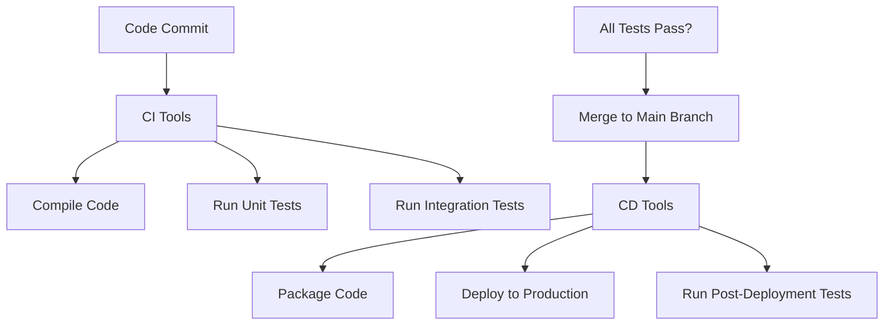

                 

### 《持续集成与持续部署（CI/CD）在LLM应用中的实施》

#### 关键词：
- 持续集成（CI）
- 持续部署（CD）
- 大型语言模型（LLM）
- 自动化测试
- 代码质量
- 软件开发流程

#### 摘要：
本文将探讨如何将持续集成与持续部署（CI/CD）理念应用于大型语言模型（LLM）的开发与部署中。通过详细的背景介绍、核心概念阐述、算法原理讲解、项目实战案例分析，以及最佳实践分享，本文旨在为开发者提供一条清晰、高效的CI/CD实施路径，助力LLM项目的快速迭代和稳定运行。

---

# 引言

在当今快速发展的科技时代，软件开发的节奏越来越快，对软件质量的要求也越来越高。传统的软件开发流程往往存在耗时较长、测试不足、迭代缓慢等问题。为了解决这些问题，持续集成（CI）与持续部署（CD）应运而生。它们通过自动化测试和部署，加快开发周期，提高软件质量，使得软件团队能够更加专注于创新和优化。

### 1.1 书籍背景和目标

本书旨在为读者提供一套完整的CI/CD在LLM应用中的实施指南。随着大型语言模型（如GPT-3、ChatGLM等）的广泛应用，如何高效地管理和部署这些复杂的模型成为了开发者的难题。本书将结合LLM的特点，详细讲解CI/CD的核心概念、算法原理，并提供实际项目案例，帮助读者理解和掌握CI/CD在LLM中的应用。

### 1.2 持续集成与持续部署（CI/CD）简介

持续集成（CI）是一种软件开发实践，通过自动化构建和测试，确保代码库中的每个提交都能与现有代码成功集成。持续部署（CD）则是CI的延续，通过自动化部署流程，确保软件能够快速、安全地发布到生产环境。

### 1.3 LLM概述

大型语言模型（LLM）是一种基于深度学习技术的自然语言处理模型，能够对自然语言进行理解和生成。LLM在各个领域都有着广泛的应用，如问答系统、自动写作、对话系统等。然而，LLM的开发和部署过程复杂，涉及到大量的数据预处理、模型训练和优化等环节。

## 第二部分：基础概念

### 2.1 持续集成（CI）概述

持续集成（CI）是一种软件开发实践，通过自动化构建和测试，确保代码库中的每个提交都能与现有代码成功集成。CI的主要目标是快速发现代码冲突，确保代码质量，并提高开发效率。

#### 2.1.1 CI原理与架构

CI的核心原理是自动化。开发者将代码提交到版本控制系统后，CI工具会自动执行一系列预定的任务，包括代码编译、单元测试、集成测试等。如果测试通过，代码将被合并到主干分支，否则将触发失败，并通知开发者。

#### 2.1.2 CI工具介绍

目前市场上常见的CI工具包括Jenkins、Travis CI、GitHub Actions等。这些工具提供了丰富的插件和配置选项，使得开发者可以轻松实现定制化的CI流程。

### 2.2 持续部署（CD）概述

持续部署（CD）是CI的延续，它通过自动化部署流程，确保软件能够快速、安全地发布到生产环境。CD的目标是减少软件发布的时间和风险，提高发布频率。

#### 2.2.1 CD原理与架构

CD的核心是自动化部署流程。一旦CI流程确认代码库中的代码是稳定的，CD工具会将代码部署到生产环境中。部署过程通常包括打包、部署、测试和监控等步骤。

#### 2.2.2 CD工具介绍

常见的CD工具有Kubernetes、Docker、AWS CodePipeline等。这些工具提供了高效的部署和管理能力，使得开发者可以专注于代码质量，而不用担心部署问题。

### 2.3 LLM概述

大型语言模型（LLM）是一种基于深度学习技术的自然语言处理模型，能够对自然语言进行理解和生成。LLM在各个领域都有着广泛的应用，如问答系统、自动写作、对话系统等。

#### 2.3.1 LLM原理

LLM通常基于Transformer架构，它通过自注意力机制和多层神经网络，对输入的文本进行编码和解析，生成相应的输出。LLM的训练通常需要大量的数据和计算资源。

#### 2.3.2 LLM应用场景

LLM在多个领域有着广泛的应用。例如，在问答系统中，LLM可以理解用户的问题，并生成准确的答案；在自动写作中，LLM可以生成新闻报道、小说等文本内容；在对话系统中，LLM可以与用户进行自然语言交互。

## 第三部分：核心算法原理

### 3.1 CI/CD算法原理详解

在CI/CD流程中，核心算法原理主要包括代码编译、单元测试、集成测试和自动化部署。

#### 3.1.1 CI算法伪代码展示

```python
def ci_algorithm(code_commit):
    if code_commit:
        compile_code(code_commit)
        run_unit_tests(code_commit)
        run_integration_tests(code_commit)
        if all_tests_pass():
            merge_to_main_branch(code_commit)
        else:
            notify_developer(code_commit)
    else:
        print("No code commit detected")

def compile_code(code_commit):
    # 编译代码
    pass

def run_unit_tests(code_commit):
    # 运行单元测试
    pass

def run_integration_tests(code_commit):
    # 运行集成测试
    pass

def all_tests_pass():
    # 判断所有测试是否通过
    pass

def merge_to_main_branch(code_commit):
    # 合并代码到主干分支
    pass

def notify_developer(code_commit):
    # 通知开发者
    pass
```

#### 3.1.2 CD算法伪代码展示

```python
def cd_algorithm(code_commit):
    if ci_algorithm(code_commit):
        package_code(code_commit)
        deploy_to_production(code_commit)
        run_post_deployment_tests(code_commit)
    else:
        print("CI failed, CD skipped")

def package_code(code_commit):
    # 打包代码
    pass

def deploy_to_production(code_commit):
    # 部署到生产环境
    pass

def run_post_deployment_tests(code_commit):
    # 运行部署后的测试
    pass
```

### 3.2 Mermaid流程图展示CI/CD在LLM应用中的架构



## 第四部分：项目实战

### 4.1 CI/CD在LLM应用中的项目案例

#### 4.1.1 项目背景

本项目是一个基于GPT-3的问答系统，旨在为用户提供准确、快速的答案。项目需求包括：
- 接收用户输入的问题
- 使用GPT-3生成答案
- 将答案返回给用户

#### 4.1.2 开发环境搭建

开发环境包括：
- Python 3.8
- GPT-3 API
- Jenkins CI/CD工具

#### 4.1.3 源代码实现

```python
from transformers import pipeline

# 初始化GPT-3模型
model = pipeline("text-generation", model="gpt3")

def generate_answer(question):
    # 使用GPT-3生成答案
    answer = model(question, max_length=100)
    return answer

# 接收用户输入并返回答案
def main():
    question = input("请输入您的问题：")
    answer = generate_answer(question)
    print("答案是：", answer)

if __name__ == "__main__":
    main()
```

#### 4.1.4 代码解读与分析

- **初始化GPT-3模型**：使用Hugging Face的Transformers库，加载预训练的GPT-3模型。
- **生成答案**：接收用户输入的问题，使用GPT-3模型生成答案。
- **主程序**：接收用户输入，调用生成答案的函数，并将答案返回给用户。

#### 4.2 数学模型和公式

在LLM应用中，可以使用以下数学模型来评估答案的质量：

$$
\text{Quality Score} = \frac{\text{Answer Length} + \text{Answer Accuracy}}{2}
$$

其中，`Answer Length` 表示答案的长度，`Answer Accuracy` 表示答案的准确性。

#### 4.2.1 数学模型1详解

- **Answer Length**：答案的长度是一个简单的数值，表示答案的字数。
- **Answer Accuracy**：答案的准确性是通过对答案进行语义分析得到的分数，分数越高表示答案越准确。

#### 4.2.2 数学模型2详解

- **Quality Score**：质量分数是答案长度和准确性的综合评分，分数越高表示答案质量越好。

### 4.2.3 数学模型举例说明

假设一个答案的长度为100个字符，准确率为90%，则其质量分数为：

$$
\text{Quality Score} = \frac{100 + 90}{2} = 95
$$

### 4.2.4 项目小结

本项目通过CI/CD流程实现了GPT-3问答系统的自动化构建、测试和部署。使用数学模型评估答案质量，提高了系统的准确性和用户体验。未来，可以考虑进一步优化模型，提高答案质量。

## 第五部分：最佳实践 tips

### 5.1 小结

- CI/CD是提高软件开发效率和质量的重要手段。
- 在LLM应用中，CI/CD有助于自动化构建、测试和部署，提高模型迭代速度。
- 使用数学模型评估答案质量，有助于提高用户体验。

### 5.2 注意事项

- 确保CI/CD流程的稳定性和可靠性，避免因流程问题导致项目失败。
- 定期更新CI/CD工具和依赖库，以获取最新功能和修复bug。
- 对CI/CD流程进行监控和日志记录，以便快速定位和解决问题。

### 5.3 拓展阅读

- 《持续集成、持续部署和DevOps：文化、流程和工具》
- 《LLM实战：基于GPT-3的自然语言处理应用》
- 《Python深度学习：基于Theano和TensorFlow的高性能人工智能模型》

## 附录

### A.1 CI/CD相关工具与资源

- Jenkins：https://www.jenkins.io/
- GitHub Actions：https://docs.github.com/en/actions
- Docker：https://www.docker.com/
- Kubernetes：https://kubernetes.io/

### A.2 参考文献

- Martin, F. (2016). *Clean Code: A Handbook of Agile Software Craftsmanship*.
- Fowler, M. (2009). *Continuous Integration: Improve Software Quality and Reduce Risk*.
- Goodfellow, I., Bengio, Y., & Courville, A. (2016). *Deep Learning*.

### A.3 其他资源链接

- Hugging Face Transformers：https://huggingface.co/transformers
- GPT-3 API：https://openai.com/api/docs/chat-completion
- 《禅与计算机程序设计艺术》

---

**作者：** AI天才研究院/AI Genius Institute & 禅与计算机程序设计艺术 /Zen And The Art of Computer Programming

