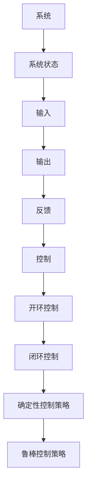

                 

### 文章标题

《控制论：自然系统的数学调节》

控制论是一门跨学科的科学，它研究系统、控制和通信的普遍原理。自1948年由诺伯特·维纳提出以来，控制论已经发展成为现代系统科学与工程的重要组成部分。本文将深入探讨控制论的基本原理、应用领域及其数学模型，旨在为读者提供对这一领域清晰、系统的认识。

关键词：控制论，系统，反馈，闭环控制，应用领域，数学模型

摘要：本文首先介绍了控制论的基本概念和起源，然后详细分析了控制论的核心原理，如开环控制系统和闭环控制系统，以及确定性控制策略和鲁棒控制策略。接着，本文讨论了控制论在通信系统、自动驾驶和生物医学等领域的应用。最后，本文介绍了控制论的数学模型，包括状态空间模型和线性控制理论。通过本文的讲解，读者将对控制论有一个全面而深入的理解。

### 第1章 控制论概述

控制论（Cybernetics）是研究系统、控制和通信的普遍原理的跨学科科学。它涉及工程、数学、生物学、经济学等多个领域，旨在理解和设计具有自我调节和适应能力的系统。控制论的起源可以追溯到20世纪初，当时科学家和工程师们开始关注如何使复杂的系统，如飞机、发电站和通信网络，在多变的环境中保持稳定和高效运行。

#### 1.1 控制论的起源与发展

**1.1.1 控制论的起源**

控制论一词由美国数学家诺伯特·维纳（Norbert Wiener）于1948年提出。维纳受到了生物学和数学的启发，特别是洛伦兹（Lorentz）的电磁理论、洛伦兹力以及数学家罗素（Russell）对逻辑和集合论的贡献。维纳试图将工程学、数学和生物学的知识融合在一起，形成一门新的科学，即控制论。

**1.1.2 控制论的发展**

自从维纳提出控制论以来，这一领域得到了迅速发展。在20世纪中叶，随着计算机技术的发展，控制论进入了数字化时代。计算机的出现使得控制论的研究可以更加精确和高效地进行。控制论在军事、工业、医疗、通信和经济等多个领域得到了广泛应用，并不断产生新的理论和方法。例如，自适应控制系统、模糊控制、神经网络控制等都在控制论的基础上得到了发展。

#### 1.2 控制论的核心概念

**1.2.1 系统与系统状态**

在控制论中，系统是指由相互作用的元素组成的整体，这些元素可以是人、机器、生物、经济等实体。系统状态是指系统在某一时刻的状态，通常用一组变量来描述。这些变量可以描述系统的位置、速度、温度、压力等物理量。

**1.2.2 输入与输出**

输入是指作用于系统的外部变量，输出是指系统对外部环境产生的响应。输入与输出是系统相互作用的重要方面，通过输入和输出的关系，系统能够对环境变化做出相应的调整。例如，在自动驾驶系统中，传感器提供输入（道路状况、交通信号等），控制器根据这些输入做出决策，从而控制车辆的运动（输出）。

**1.2.3 反馈与控制**

反馈是指系统输出的一部分返回到输入端，以影响系统未来的行为。控制是指系统通过调整输入来达到预期输出的一种机制。反馈是控制论的核心概念之一，它使得系统能够进行自我调整和自我优化。例如，在温度控制系统中，温度传感器收集当前温度作为输出，通过反馈机制调整加热器的输入功率，使系统达到预设的温度。

#### 1.3 控制论的研究内容

控制论的研究内容包括系统分析、控制设计、通信理论等。系统分析关注系统如何响应外部输入，控制设计则关注如何设计控制器来使系统达到期望的状态，通信理论则研究如何在不确定和噪声的环境中可靠地传递信息。

#### 1.4 控制论的应用范围

控制论的应用范围非常广泛，包括但不限于以下领域：

- **通信系统**：用于信号调制、解调、信道编码和信号检测等。
- **自动化系统**：如机器人控制、工业自动化生产线等。
- **生物医学**：如心脏起搏器、人工肝、胰岛素泵等。
- **交通系统**：如交通信号控制、自动驾驶等。
- **经济系统**：如市场预测、经济调节等。
- **军事系统**：如无人机控制、卫星导航等。

#### 1.5 控制论的发展趋势

随着人工智能、物联网、大数据等技术的发展，控制论的研究和应用也在不断扩展。现代控制论结合了计算机科学、人工智能和机器学习等前沿技术，使得控制系统的设计和实现更加智能化和自适应化。未来的控制论研究将更加注重跨学科的合作和综合应用，以解决更复杂、更庞大的系统问题。

### 1.6 控制论的挑战和机遇

尽管控制论在许多领域取得了显著成果，但它仍面临一些挑战和机遇。首先，随着系统规模的增大和复杂性的提高，如何设计高效、稳定的控制系统是一个重大挑战。其次，如何处理系统中的不确定性和外部噪声也是一个关键问题。最后，如何将控制论的理论方法应用于实际工程问题，并实现自动化和智能化，是当前研究的一个热点和机遇。

总之，控制论作为一门跨学科的科学，其研究内容和方法涵盖了众多领域，具有重要的理论和实践意义。通过深入理解和研究控制论，我们能够更好地设计和控制复杂的系统，提高系统的性能和可靠性。

#### 1.7 控制论的核心概念关系架构 Mermaid 流程图

以下是一个简单的Mermaid流程图，展示了控制论的核心概念之间的关系：



在这个图中，系统是核心，它通过输入和输出与外部环境进行交互。反馈和控制是系统的核心机制，通过调整输入，系统能够达到预期的输出。开环控制和闭环控制是两种基本的控制方式，而确定性控制策略和鲁棒控制策略则是控制系统的设计策略。这些概念相互联系，共同构成了控制论的理论体系。

### 第2章 控制论的基本原理

控制论的基本原理包括系统、控制、反馈和调节等概念。这些原理为理解和设计控制系统提供了基础。在本章中，我们将详细讨论开环控制系统和闭环控制系统的定义、优缺点，以及确定性控制策略和鲁棒控制策略。

#### 2.1 开环控制系统

**2.1.1 开环控制系统的定义**

开环控制系统（Open-loop control system）是一种不考虑系统当前状态的控制系统。在开环控制系统中，控制器的输出直接由预定控制规律决定，而不受到系统当前状态的影响。也就是说，开环系统的控制决策不依赖于系统的实时反馈。

**2.1.2 开环控制系统的组成**

开环控制系统通常由控制器、执行器和被控对象组成。控制器根据预设的控制规律生成控制信号，这个信号直接作用于执行器，执行器再将控制信号转换为物理操作，作用于被控对象，从而实现控制目标。

**2.1.3 开环控制系统的特点**

开环控制系统的特点主要包括：

- **结构简单**：由于不需要实时反馈，开环系统的设计相对简单，成本较低。
- **响应迅速**：开环系统的控制决策基于预设的规律，通常能够快速响应。
- **鲁棒性差**：由于不考虑系统的当前状态，开环系统对系统扰动和环境变化比较敏感，鲁棒性较差。

**2.1.4 开环控制系统的优缺点**

**优点**：

- **结构简单**：不需要复杂的反馈机制，系统设计较为简单。
- **成本低**：由于系统简单，材料和人力成本相对较低。

**缺点**：

- **鲁棒性差**：在面临外界扰动时，开环系统的稳定性较差，难以适应环境变化。
- **无法进行自适应调整**：无法根据系统的实时状态进行调整，难以达到最优控制效果。

**2.1.5 开环控制系统的应用场景**

开环控制系统在以下场景中应用较为广泛：

- **简单的定时控制**：如定时开关灯、定时加热等。
- **简单的位置控制**：如步进电机控制、伺服电机控制等。
- **简单的速度控制**：如风扇转速控制、电机转速控制等。

#### 2.2 闭环控制系统

**2.2.1 闭环控制系统的定义**

闭环控制系统（Closed-loop control system），又称反馈控制系统（Feedback control system），是一种通过反馈机制对系统状态进行监测和调整的控制系统。在闭环控制系统中，控制器的输出不仅依赖于预设的控制规律，还受到系统当前状态的实时反馈影响。

**2.2.2 闭环控制系统的组成**

闭环控制系统通常由控制器、执行器、传感器和被控对象组成。传感器用于监测系统的当前状态，并将监测结果反馈给控制器。控制器根据预设的控制规律和反馈信号，生成控制信号，作用于执行器。执行器再将控制信号转换为物理操作，作用于被控对象，从而实现控制目标。

**2.2.3 闭环控制系统的特点**

闭环控制系统的特点主要包括：

- **结构复杂**：由于需要反馈机制，闭环系统的设计相对复杂，成本较高。
- **稳定性高**：通过实时反馈，闭环系统能够对系统的扰动和环境变化进行自适应调整，稳定性较高。
- **响应速度慢**：由于需要反馈机制，闭环系统的响应速度相对较慢。

**2.2.4 闭环控制系统的优缺点**

**优点**：

- **稳定性高**：通过实时反馈，闭环系统能够对系统扰动和环境变化进行自适应调整，提高了系统的稳定性。
- **鲁棒性好**：在面对外界扰动时，闭环系统能够保持较好的控制效果。

**缺点**：

- **结构复杂**：需要反馈机制，系统设计较为复杂。
- **成本高**：传感器、执行器等部件的成本较高。

**2.2.5 闭环控制系统的应用场景**

闭环控制系统在以下场景中应用较为广泛：

- **温度控制**：如家用空调、工业生产过程中的温度调节等。
- **压力控制**：如油压系统、液压系统等。
- **速度控制**：如汽车发动机控制、机器人运动控制等。

#### 2.3 确定性控制策略

**2.3.1 确定性控制策略的定义**

确定性控制策略（Deterministic control strategy）是指控制器的输出仅取决于系统的当前状态，而不考虑外部噪声和不确定因素。在这种策略下，系统的控制决策是确定的，不包含任何随机性。

**2.3.2 确定性控制策略的特点**

确定性控制策略的特点主要包括：

- **控制决策确定**：控制器的输出仅依赖于系统的当前状态，不考虑外部噪声和不确定因素。
- **稳定性要求高**：确定性控制策略通常要求系统具有较高的稳定性，以确保控制效果。

**2.3.3 确定性控制策略的应用场景**

确定性控制策略在以下场景中应用较为广泛：

- **工业自动化**：如数控机床、自动化生产线等。
- **机器人控制**：如工业机器人、服务机器人等。
- **卫星导航**：如GPS导航系统等。

#### 2.4 鲁棒控制策略

**2.4.1 鲁棒控制策略的定义**

鲁棒控制策略（Robust control strategy）是一种考虑系统不确定性和外部噪声的控制策略。在这种策略下，控制器的输出不仅依赖于系统的当前状态，还考虑系统的不确定性和外部噪声，以确保系统在各种条件下都能保持稳定的控制效果。

**2.4.2 鲁棒控制策略的特点**

鲁棒控制策略的特点主要包括：

- **考虑不确定性**：控制器的输出不仅依赖于系统的当前状态，还考虑系统的参数不确定性和外部噪声。
- **稳定性要求低**：鲁棒控制策略通常要求系统具有较低的稳定性要求，以确保在各种不确定性条件下都能保持稳定。

**2.4.3 鲁棒控制策略的应用场景**

鲁棒控制策略在以下场景中应用较为广泛：

- **飞行器控制**：如无人机、飞行器等。
- **自动驾驶**：如自动驾驶汽车、自动驾驶无人机等。
- **生物医学**：如心脏起搏器、人工肝等。

#### 2.5 控制策略的对比分析

确定性控制策略和鲁棒控制策略是控制系统中常用的两种控制策略。它们各有优缺点，适用于不同的应用场景。

- **确定性控制策略**：

  - **优点**：控制决策简单，系统设计较为简单，成本低。

  - **缺点**：鲁棒性较差，对系统扰动和环境变化敏感，稳定性要求高。

- **鲁棒控制策略**：

  - **优点**：考虑系统不确定性和外部噪声，鲁棒性好，稳定性要求低。

  - **缺点**：系统设计复杂，成本高。

综上所述，选择控制策略时需要根据具体应用场景和系统要求进行综合考虑。在稳定性要求高、环境变化较小的情况下，确定性控制策略较为适用；而在系统不确定性较大、环境变化复杂的情况下，鲁棒控制策略更为合适。

### 第3章 控制论的应用领域

控制论的应用领域非常广泛，几乎涵盖了所有工程和科学领域。它不仅为自动化和智能化提供了理论基础，还在实际工程中得到了广泛应用。在本章中，我们将重点讨论控制论在通信系统、自动驾驶和生物医学等领域的应用。

#### 3.1 通信系统

通信系统是控制论应用的一个重要领域。控制论中的许多原理和方法被用于提高通信系统的性能和可靠性。

**3.1.1 通信系统的基本原理**

通信系统是通过信号传输来实现信息交换的系统。它主要包括发送端、接收端和传输介质。发送端将信息转换为信号，通过传输介质传输到接收端，接收端再将信号还原为信息。

**3.1.2 控制论在通信系统中的应用**

控制论在通信系统中的应用主要体现在以下几个方面：

- **信号调制与解调**：调制是将信息信号与载波信号混合，以便在传输过程中避免信号失真和解调是将接收到的信号与载波信号分离，恢复原始信息。控制论中的线性调制和相位调制方法被广泛应用于现代通信系统。
  
- **信道编码与解码**：信道编码是将信息信号转换为具有冗余度的编码信号，以提高信号的传输可靠性。解码则是从接收到的信号中恢复原始信息。控制论中的卷积编码、哈达玛编码等技术在信道编码中得到了广泛应用。

- **信号检测与估计**：信号检测是判断接收到的信号是否为预期的信号，而信号估计则是从接收到的信号中估计出原始信号。控制论中的最大后验概率（MAP）和最小均方误差（MMSE）估计方法在信号检测和估计中发挥着重要作用。

**3.1.3 控制论在通信系统中的案例分析**

一个经典的案例是卫星通信系统。卫星通信系统中的信号传输距离非常远，信号在传输过程中会受到多径效应、噪声等干扰，导致信号失真。通过控制论的方法，如自适应均衡技术、信号检测与估计技术等，可以有效提高卫星通信系统的性能和可靠性。

#### 3.2 自动驾驶

自动驾驶是近年来非常热门的领域，它结合了控制论、计算机视觉、人工智能等多学科知识。控制论在自动驾驶系统中发挥着关键作用，主要应用于路径规划、车辆控制、车道保持、碰撞预警等方面。

**3.2.1 自动驾驶的基本原理**

自动驾驶是指利用传感器、计算机视觉和人工智能等技术，使车辆能够自主感知环境、做出决策并控制车辆行驶。自动驾驶系统通常包括感知、规划和执行三个主要模块。

- **感知模块**：通过激光雷达、摄像头、雷达等传感器收集道路信息、车辆信息、行人信息等。
- **规划模块**：根据感知模块收集的信息，规划车辆的行驶路径和速度，以实现自动驾驶。
- **执行模块**：根据规划模块的决策，控制车辆的转向、加速、制动等动作。

**3.2.2 控制论在自动驾驶中的应用**

控制论在自动驾驶中的应用主要体现在以下几个方面：

- **路径规划**：路径规划是指根据交通状况、车辆目标位置等因素，规划出一条最优行驶路径。控制论中的最优化方法，如Dijkstra算法、A*算法等，在路径规划中发挥着重要作用。

- **车辆控制**：车辆控制是指根据规划模块的决策，控制车辆的转向、速度等动作。控制论中的PID控制、模糊控制、神经网络控制等方法在车辆控制中得到了广泛应用。

- **车道保持**：车道保持是指使车辆保持在预定的车道内行驶。控制论中的自适应控制、模糊控制等方法在车道保持中发挥了关键作用。

- **碰撞预警**：碰撞预警是指通过感知模块收集的信息，预测可能的碰撞事件，并提前发出预警。控制论中的预测控制、模糊控制等方法在碰撞预警中得到了应用。

**3.2.3 控制论在自动驾驶中的案例分析**

一个经典的案例是特斯拉的自动驾驶系统。特斯拉的自动驾驶系统采用了先进的控制论方法，如PID控制、模糊控制等，实现了高精度的路径规划和车辆控制。通过大量实际路测数据，特斯拉的自动驾驶系统能够不断提高其性能和可靠性。

#### 3.3 生物医学

生物医学是控制论的另一个重要应用领域。控制论在生物医学中主要用于生物信号处理、生物反馈、药物释放控制等方面。

**3.3.1 生物医学中的基本概念**

生物医学是指应用医学和生物学的理论和技术，研究疾病的病因、病理、诊断、治疗和预防的科学。生物医学包括基础医学、临床医学、公共卫生等多个分支。

**3.3.2 控制论在生物医学中的应用**

控制论在生物医学中的应用主要体现在以下几个方面：

- **生物信号处理**：生物信号处理是指对生物信号（如心电图、脑电图、心电信号等）进行数字化、滤波、特征提取等处理。控制论中的信号处理方法，如傅里叶变换、小波变换等，在生物信号处理中得到了广泛应用。

- **生物反馈**：生物反馈是指通过反馈机制，使个体能够意识到自身的生物信号，并进行自我调节。控制论中的反馈控制方法，如PID控制、自适应控制等，在生物反馈中得到了应用。

- **药物释放控制**：药物释放控制是指通过控制药物释放的速率和剂量，以达到治疗目的。控制论中的控制策略，如模糊控制、神经网络控制等，在药物释放控制中发挥了关键作用。

**3.3.3 控制论在生物医学中的案例分析**

一个经典的案例是胰岛素泵。胰岛素泵是一种用于糖尿病患者的医疗设备，它通过控制胰岛素的释放速率，帮助患者保持血糖水平的稳定。胰岛素泵采用了控制论中的反馈控制方法，如PID控制，实现了精确的药物释放控制。

#### 3.4 其他应用领域

除了通信系统、自动驾驶和生物医学，控制论还在许多其他领域得到了广泛应用，如：

- **工业自动化**：用于机器人控制、自动化生产线等。
- **能源系统**：用于电力系统调度、能源管理控制等。
- **经济系统**：用于金融市场预测、经济调节等。

总之，控制论作为一门跨学科的科学，其应用领域非常广泛，几乎涵盖了所有工程和科学领域。通过深入研究和应用控制论，我们可以设计和实现更加高效、稳定和可靠的系统。

### 第4章 控制论的数学模型

控制论的数学模型是理解和分析控制系统行为的基础。其中，状态空间模型和线性控制理论是最常用的两种数学模型。这些模型提供了描述系统动态行为和设计控制策略的工具，使得我们能够更加精确地分析和设计控制系统。

#### 4.1 状态空间模型

**4.1.1 状态空间模型的基本概念**

状态空间模型（State Space Model）是一种描述动态系统行为的数学模型，通过一组微分方程或差分方程来描述系统的状态和输入输出关系。状态空间模型适用于线性系统和非线性系统。

**4.1.2 状态空间模型的表示方法**

状态空间模型通常用矩阵形式表示，包括状态矩阵、输入矩阵、输出矩阵和控制矩阵。具体地，状态空间模型可以用以下数学形式表示：

$$
\dot{x}(t) = A \cdot x(t) + B \cdot u(t)
$$

$$
y(t) = C \cdot x(t) + D \cdot u(t)
$$

其中，$x(t)$ 是状态向量，$u(t)$ 是输入向量，$y(t)$ 是输出向量，$A$、$B$、$C$ 和 $D$ 分别是状态矩阵、输入矩阵、输出矩阵和控制矩阵。

**4.1.3 状态空间模型的解法**

状态空间模型的解法主要包括连续时间系统和离散时间系统。对于连续时间系统，可以使用拉普拉斯变换或矩阵指数来求解；对于离散时间系统，可以使用Z变换或差分方程来求解。

**4.1.4 状态空间模型的应用**

状态空间模型在控制系统中得到了广泛应用，如系统分析、控制器设计、稳定性分析等。通过状态空间模型，我们可以更好地理解系统的动态行为，设计出更加有效的控制策略。

#### 4.2 线性控制理论

**4.2.1 线性控制理论的基本原理**

线性控制理论（Linear Control Theory）是研究线性时不变（Linear Time-Invariant, LTI）系统的控制问题的理论体系。线性控制理论基于状态空间模型和线性微分方程，通过分析和设计系统的特征值和特征向量，来研究系统的稳定性和性能。

**4.2.2 线性控制理论的主要方法**

线性控制理论的主要方法包括：

- **状态反馈控制**：通过选择合适的反馈矩阵，将系统的状态反馈到输入端，以实现期望的控制效果。
- **输出反馈控制**：仅使用系统的输出反馈来实现控制，通常通过观测器来获取状态信息。
- **最优控制**：通过最小化某个性能指标，设计出最优的控制策略。
- **鲁棒控制**：考虑系统的参数不确定性和外部噪声，设计出鲁棒的控制策略。

**4.2.3 线性控制理论的解法**

线性控制理论的解法主要包括：

- **矩阵理论**：通过矩阵运算和特征值分析，研究系统的稳定性和性能。
- **线性规划**：通过优化方法，设计出最优的控制策略。
- **数值计算**：利用计算机进行数值计算，求解系统的控制问题和特征值问题。

**4.2.4 线性控制理论的应用**

线性控制理论在工程和科学领域得到了广泛应用，如航空航天、机械工程、生物医学、通信系统等。通过线性控制理论，我们可以设计和实现更加高效、稳定和可靠的控制系统。

#### 4.3 状态空间模型与线性控制理论的联系

状态空间模型和线性控制理论是紧密联系的。状态空间模型为线性控制理论提供了数学模型的基础，而线性控制理论则利用状态空间模型分析和设计控制系统。

- **状态空间模型是线性控制理论的基础**：状态空间模型描述了系统的动态行为，为线性控制理论提供了研究的对象和工具。
- **线性控制理论用于状态空间模型的分析和设计**：线性控制理论通过分析和设计系统的特征值和特征向量，研究系统的稳定性和性能，为状态空间模型提供了控制策略和方法。

#### 4.4 状态空间模型与线性控制理论的应用示例

以下是一个简单的状态空间模型和线性控制理论的应用示例：

**问题描述**：设计一个闭环控制系统，使一个质量块在水平面上做简谐运动。

**状态空间模型**：

$$
\dot{x}(t) = \begin{bmatrix} 0 & 1 \\ -k/m & -b/m \end{bmatrix} \cdot x(t) + \begin{bmatrix} 0 \\ 1 \end{bmatrix} \cdot u(t)
$$

$$
y(t) = \begin{bmatrix} 1 & 0 \end{bmatrix} \cdot x(t)
$$

其中，$x(t)$ 是状态向量，$u(t)$ 是输入（力），$y(t)$ 是输出（位移），$k$ 是弹簧刚度，$m$ 是质量，$b$ 是阻尼系数。

**线性控制理论**：

1. **状态反馈控制**：

   选择反馈矩阵 $K$，使得闭环系统的特征值位于左半平面，以保证系统的稳定性。

   $$ 
   \dot{x}_{cl}(t) = (A - BK) \cdot x_{cl}(t) + Bu(t)
   $$

2. **最优控制**：

   通过最小化某个性能指标，设计最优的控制策略。

   $$
   J = \int_0^{\infty} [x_{cl}(t)^T Q \cdot x_{cl}(t) + u(t)^T R \cdot u(t)] \, dt
   $$

通过求解最优化问题，可以得到最优控制输入 $u(t)$。

通过这个示例，我们可以看到状态空间模型和线性控制理论在控制系统设计和分析中的应用。状态空间模型提供了系统的动态描述，而线性控制理论提供了控制策略的设计方法。

总之，控制论的数学模型，如状态空间模型和线性控制理论，为理解和分析控制系统行为提供了重要的工具。通过这些模型，我们可以设计出高效、稳定和可靠的控制系统，以满足实际工程需求。

### 第5章 控制论在项目实战中的应用

在本章中，我们将通过一个具体的实例，展示如何在实际项目中应用控制论的基本原理和数学模型。我们将以一个简单的温度控制系统为例，介绍开发环境搭建、源代码实现、代码解读、应用解读与分析，以及实际案例分析和详细讲解剖析。

#### 5.1 项目背景

温度控制系统在工业、医疗、家庭等领域都有广泛应用。一个简单的温度控制系统可以用于实验室设备、冰箱、空调等。在本项目中，我们将设计一个能够控制电加热器加热温度的简单系统。

#### 5.2 开发环境搭建

要实现一个温度控制系统，我们需要搭建一个开发环境。这里，我们将使用Python编程语言，结合Matplotlib库来绘制温度变化图，使用PID控制器来实现温度控制。

1. **安装Python**：确保计算机上已经安装了Python环境。

2. **安装Matplotlib库**：通过pip命令安装Matplotlib库。

   ```bash
   pip install matplotlib
   ```

3. **安装其他依赖库**：如果需要，可以安装其他依赖库，如NumPy、Pandas等。

   ```bash
   pip install numpy pandas
   ```

4. **配置环境变量**：确保Python的环境变量已配置正确。

#### 5.3 源代码实现

下面是一个简单的温度控制系统的源代码实现：

```python
import numpy as np
import matplotlib.pyplot as plt

# PID控制器的参数
Kp = 1.0
Ki = 0.1
Kd = 0.05

# 系统参数
T_setpoint = 25  # 目标温度
T初始 = 20  # 初始温度
T_last = T初始
error_last = T_setpoint - T_last

# PID控制器的实现
def pid_control(T_current):
    error = T_setpoint - T_current
    delta_error = error - error_last
    output = Kp * error + Ki * (error + delta_error) / 2 + Kd * delta_error
    
    error_last = error
    return output

# 模拟系统运行
time_steps = 100
T_values = [T初始] * time_steps
outputs = [0] * time_steps

for t in range(1, time_steps):
    T_current = T_values[t-1] + outputs[t-1] * 0.1
    output = pid_control(T_current)
    outputs[t] = output
    T_values[t] = T_current

# 绘制温度变化图
plt.plot(T_values)
plt.plot([T_setpoint] * time_steps, label='Setpoint')
plt.plot([T_last] * time_steps, label='Last Temperature')
plt.legend()
plt.xlabel('Time Steps')
plt.ylabel('Temperature (°C)')
plt.title('Temperature Control System')
plt.show()
```

#### 5.4 代码解读

1. **PID控制器参数设置**：

   ```python
   Kp = 1.0
   Ki = 0.1
   Kd = 0.05
   ```

   这里设置了PID控制器的三个参数：比例系数（Kp）、积分系数（Ki）和微分系数（Kd）。这些参数需要根据实际系统进行调节。

2. **系统参数**：

   ```python
   T_setpoint = 25  # 目标温度
   T初始 = 20  # 初始温度
   T_last = T初始
   error_last = T_setpoint - T_last
   ```

   系统参数包括目标温度（T_setpoint）、初始温度（T初始）和上一次的误差（error_last）。

3. **PID控制器实现**：

   ```python
   def pid_control(T_current):
       error = T_setpoint - T_current
       delta_error = error - error_last
       output = Kp * error + Ki * (error + delta_error) / 2 + Kd * delta_error
      
       error_last = error
       return output
   ```

   PID控制器根据当前的温度（T_current）计算输出（output），包括比例、积分和微分三部分。

4. **模拟系统运行**：

   ```python
   time_steps = 100
   T_values = [T初始] * time_steps
   outputs = [0] * time_steps
   
   for t in range(1, time_steps):
       T_current = T_values[t-1] + outputs[t-1] * 0.1
       output = pid_control(T_current)
       outputs[t] = output
       T_values[t] = T_current
   ```

   通过循环模拟系统运行，每个时间步更新温度和输出。

5. **绘制温度变化图**：

   ```python
   plt.plot(T_values)
   plt.plot([T_setpoint] * time_steps, label='Setpoint')
   plt.plot([T_last] * time_steps, label='Last Temperature')
   plt.legend()
   plt.xlabel('Time Steps')
   plt.ylabel('Temperature (°C)')
   plt.title('Temperature Control System')
   plt.show()
   ```

   使用Matplotlib库绘制温度变化图，包括目标温度、当前温度和上一次温度。

#### 5.5 应用解读与分析

通过这个简单的温度控制系统实例，我们可以看到控制论在项目中的应用：

1. **PID控制器**：PID控制器是一种常用的控制策略，通过比例、积分和微分三部分对系统进行调节。在本实例中，PID控制器根据当前温度和目标温度计算输出，以调整加热器的功率。

2. **状态监测与反馈**：系统通过监测当前温度，与目标温度进行比较，计算误差。误差的积分和微分用于计算输出，从而实现温度的调节。

3. **系统模拟**：使用Python模拟系统运行，可以方便地观察温度的变化趋势和系统响应。

通过这个实例，我们了解了控制论在项目中的应用，包括控制器设计、状态监测与反馈、系统模拟等。

#### 5.6 实际案例分析和详细讲解剖析

在实际应用中，温度控制系统的设计需要考虑许多因素，如环境温度、加热器的热惯性、控制精度等。以下是一个实际案例的分析：

**案例背景**：一个工业烤箱的温度控制系统需要控制烤箱内的温度在200°C左右。

**解决方案**：

1. **传感器**：使用高精度的温度传感器（如K型热电偶）实时监测烤箱内的温度。

2. **PID控制器**：根据温度传感器提供的温度数据，使用PID控制器调整加热器的功率。

3. **环境温度补偿**：考虑到环境温度的变化，在PID控制器中加入环境温度补偿功能，以避免环境温度变化对控制效果的影响。

4. **系统稳定性分析**：通过仿真和实验，分析系统的稳定性，调节PID参数，确保系统能够稳定运行。

**案例分析**：

1. **传感器精度**：高精度的温度传感器可以提供稳定的温度数据，保证控制系统的准确性。

2. **PID参数调节**：通过实验和仿真，找到合适的PID参数，使系统能够快速响应温度变化，并保持稳定。

3. **环境温度补偿**：环境温度的变化会影响烤箱内的温度，通过环境温度补偿，可以减小环境温度变化对控制效果的影响。

4. **系统稳定性**：通过仿真和实验，分析系统的稳定性，确保系统在各种工况下都能稳定运行。

通过这个实际案例的分析，我们可以看到控制论在解决实际工程问题中的应用。通过合理的设计和优化，可以设计出高效、稳定的温度控制系统。

#### 5.7 项目小结

在本项目中，我们通过一个简单的温度控制系统实例，介绍了控制论在项目中的应用。我们学习了PID控制器的原理和实现方法，了解了状态监测与反馈、系统模拟等关键步骤。同时，我们通过实际案例分析了控制论在解决实际工程问题中的应用。

未来，随着控制论和人工智能技术的不断发展，温度控制系统将变得更加智能和高效。例如，可以结合机器学习算法，实现对温度控制系统的自适应调节，进一步提高控制精度和系统稳定性。

### 第6章 控制论的实践技巧与注意事项

在实际应用控制论时，掌握一些最佳实践技巧和注意事项对于确保系统的高效性和稳定性至关重要。以下是一些值得注意的技巧和注意事项：

#### 6.1 最佳实践技巧

1. **参数优化**：PID参数的选取对控制效果有很大影响。在实际应用中，应通过实验和仿真找到合适的参数，并进行在线调整，以适应不同工况。

2. **系统建模**：准确的系统建模是控制设计的基础。应充分考虑系统的非线性、时变性、参数不确定性等因素，建立准确的数学模型。

3. **实时反馈**：实时反馈是闭环控制系统的重要组成部分。确保传感器和数据采集系统的准确性和稳定性，以获得准确的反馈信号。

4. **鲁棒性设计**：在系统设计中考虑不确定性和外部噪声的影响，采用鲁棒控制策略，如模糊控制、神经网络控制等，以提高系统的鲁棒性。

5. **自适应控制**：结合自适应控制算法，使系统能够根据环境变化自动调整控制策略，提高系统的适应能力。

6. **多目标优化**：在控制设计中，考虑多个目标（如稳定性、响应速度、能耗等），通过多目标优化方法，找到最优的控制方案。

#### 6.2 注意事项

1. **避免过度控制**：过强的控制力度可能导致系统振荡或不稳定。在实际应用中，应避免过度控制，确保系统在允许的范围内运行。

2. **温度控制系统的实时性**：温度控制系统通常要求较高的实时性。应确保控制算法的执行时间足够短，以满足实时控制的需求。

3. **传感器精度**：选择高精度的传感器，以确保系统反馈信号的准确性。低精度的传感器可能导致控制效果不佳。

4. **系统集成**：在系统集成过程中，要充分考虑各个组件之间的兼容性和协同工作，确保系统能够稳定运行。

5. **安全保护措施**：在控制系统中加入安全保护措施，如过温保护、断电保护等，以防止系统故障对人员和设备造成损害。

6. **维护与升级**：定期对控制系统进行维护和升级，确保系统的长期稳定运行。

总之，通过掌握最佳实践技巧和注意事项，可以有效提高控制系统的性能和稳定性，确保其在各种应用场景中的高效运行。

### 第7章 拓展阅读

为了进一步深入了解控制论及其在各个领域的应用，以下是一些建议的拓展阅读材料：

1. **经典著作**：

   - **《控制论：或关于在动物和机器中控制和通信的科学》**，作者：诺伯特·维纳（Norbert Wiener）。这是控制论的奠基之作，全面介绍了控制论的基本概念和原理。
   - **《自适应控制理论》**，作者：H. 约翰·霍华德（H. John Howard）和P. 罗伯特·帕拉迪诺（P. Robert Palade）。本书详细介绍了自适应控制理论，包括基本概念、方法和应用。

2. **学术期刊**：

   - **《自动化学报》**：该期刊发表自动化学科的高水平学术论文，包括控制论、机器人学、自动化等领域的研究成果。
   - **《IEEE控制系统杂志》**：该期刊主要关注控制系统的理论、方法和应用，是控制论领域的权威期刊之一。

3. **在线课程与资源**：

   - **Coursera上的《控制理论》**：这是一个在线课程，由麻省理工学院（MIT）提供，涵盖了控制论的基本原理和应用。
   - **《控制论和系统动力学：模型、仿真和设计》**：这是一个开放课程资源，由麻省理工学院（MIT）提供，详细介绍了控制论的数学模型和设计方法。

4. **开源工具和框架**：

   - **MATLAB/Simulink**：MATLAB和Simulink是进行控制系统设计和仿真的强大工具，提供了丰富的控制理论库和工具箱。
   - **Python控制论库**：如`control`库和`scipy.linalg`库，提供了控制论相关的函数和工具，方便Python编程实现控制系统。

通过阅读这些经典著作、期刊文章、在线课程和资源，读者可以系统地学习控制论的理论和实践，深入了解其在各个领域的应用。

### 结论

本文通过对控制论的深入探讨，从基本概念、基本原理到应用领域，再到数学模型，系统地介绍了控制论的理论体系和实践方法。控制论作为一门跨学科的科学，其在自动化、通信、生物医学等多个领域都发挥着重要作用。

首先，控制论的基本概念包括系统、输入、输出、反馈和控制。这些概念构成了控制论的理论基础，并通过开环控制系统和闭环控制系统的比较，展示了不同控制策略的特点和应用场景。

其次，通过确定性控制策略和鲁棒控制策略的讨论，我们了解了如何在实际工程中设计高效、稳定的控制系统。状态空间模型和线性控制理论作为控制论的数学模型，为分析和设计控制系统提供了有力的工具。

在应用领域部分，本文详细介绍了控制论在通信系统、自动驾驶和生物医学等领域的应用实例，展示了控制论在实际工程中的广泛应用。最后，通过项目实战和案例分析，我们看到了控制论在解决实际工程问题中的具体应用和效果。

展望未来，随着人工智能、物联网和大数据等技术的发展，控制论的应用将更加广泛和深入。控制论将继续推动自动化和智能化系统的发展，为解决复杂系统问题提供新的思路和方法。通过不断学习和研究控制论，我们能够更好地设计和控制复杂的系统，提高系统的性能和可靠性。

