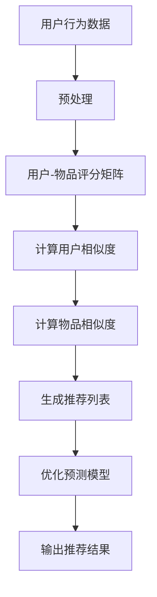

                 

# 推荐系统的协同过滤：用户喜好的数学预测

## 关键词
- 推荐系统
- 协同过滤
- 数学模型
- 用户喜好
- 评分预测

## 摘要
推荐系统是现代信息社会中的一项关键技术，能够有效地帮助用户发现和选择他们可能感兴趣的内容。协同过滤是推荐系统中最常用的方法之一，通过分析用户之间的相似性来预测用户的喜好。本文将深入探讨协同过滤的数学原理，解释其如何通过数学模型预测用户喜好，并提供具体的算法实现和案例分析。

## 引言

在信息过载的时代，用户往往难以从海量的信息中找到他们真正感兴趣的内容。推荐系统应运而生，通过分析用户的历史行为和兴趣，为用户推荐可能感兴趣的新内容。推荐系统广泛应用于电子商务、社交媒体、视频流媒体等领域，极大地提升了用户体验。

协同过滤是推荐系统的一种关键技术，它通过分析用户之间的相似性来预测用户未评分的物品喜好。协同过滤可以分为基于用户的协同过滤和基于物品的协同过滤两种主要类型。基于用户的协同过滤通过寻找与目标用户兴趣相似的邻居用户，根据邻居用户对物品的评分预测目标用户对该物品的评分。基于物品的协同过滤则是通过寻找与目标物品相似的邻居物品，根据邻居物品的评分来预测目标物品的评分。

本文将重点讨论基于用户的协同过滤，通过数学模型和算法实现来深入理解协同过滤的预测原理。接下来，我们将详细介绍协同过滤的数学模型、用户行为数据分析、评分预测与优化，并结合具体案例进行代码实现和分析。

## 核心概念与联系

### 用户行为数据分析

用户行为数据是协同过滤的基础，它包括用户对物品的评分、浏览历史、购买记录等信息。通过对这些数据进行分析，我们可以了解用户的兴趣和偏好。

用户行为数据可以分为两类：

1. **显式反馈**：用户直接对物品进行评分或评价，如电影评分、商品评分等。这些数据可以直接用来计算用户与物品之间的相关性。
2. **隐式反馈**：用户未直接评分或评价的物品，但他们的行为（如浏览、点击、购买等）可以间接反映他们的兴趣。通过分析这些隐式反馈，我们可以推断用户对未评分物品的可能喜好。

### 用户与物品的相似性计算

用户与用户之间的相似性可以通过计算用户之间的余弦相似度、皮尔逊相关系数等来衡量。物品与物品之间的相似性可以通过计算物品之间的余弦相似度、欧几里得距离等来衡量。

用户与物品的相似性计算是协同过滤的核心。通过计算用户与用户之间的相似性，我们可以找到与目标用户兴趣相似的邻居用户，从而预测他们对新物品的评分。同样，通过计算物品与物品之间的相似性，我们可以找到与目标物品相似的邻居物品，从而预测它们对新用户的评分。

### 评分预测与优化

评分预测是协同过滤的目标。通过用户与用户或物品与物品之间的相似性计算，我们可以构建一个预测模型，用于预测用户对新物品的评分。常见的预测方法包括加权平均、回归模型等。

评分预测的优化是提高推荐系统准确性的关键。通过优化预测模型，我们可以减少预测误差，提高预测准确性。常见的优化方法包括矩阵分解、深度学习等。

### Mermaid流程图

以下是协同过滤的基本工作流程的Mermaid流程图：



## 协同过滤原理

### 协同过滤的数学模型

协同过滤的数学模型基于用户与用户或物品与物品之间的相似性计算。一个基本的协同过滤模型可以表示为：

$$
\hat{r}_{ui} = \sum_{j \in N(i)} r_{uj} \cdot s_{uij}
$$

其中：

- $r_{uj}$ 表示用户 $u$ 对物品 $j$ 的评分。
- $s_{uij}$ 表示用户 $u$ 与物品 $i$ 与物品 $j$ 之间的相似度。
- $N(i)$ 表示与物品 $i$ 最相似的 $k$ 个物品集合。

这个公式表示，用户 $u$ 对物品 $i$ 的预测评分是所有与物品 $i$ 相似的物品 $j$ 的评分乘以其与用户 $u$ 的相似度之和。

### 用户行为数据分析

用户行为数据是协同过滤的基础。用户行为数据包括用户对物品的评分、浏览历史、购买记录等。这些数据可以通过以下步骤进行预处理：

1. **数据清洗**：去除无效数据、缺失值和异常值。
2. **数据标准化**：对数据进行归一化或标准化处理，使其在相同的尺度上。
3. **构建用户-物品评分矩阵**：将用户行为数据转换为用户-物品评分矩阵，其中行表示用户，列表示物品，单元格表示用户对物品的评分。

### 评分预测与优化

评分预测是协同过滤的核心任务。一个简单的评分预测模型是基于用户的协同过滤（User-Based Collaborative Filtering，UBCF）。UBCF通过以下步骤进行评分预测：

1. **计算用户相似度**：使用余弦相似度、皮尔逊相关系数等算法计算用户之间的相似度。
2. **找到邻居用户**：根据相似度矩阵，找到与目标用户最相似的 $k$ 个邻居用户。
3. **预测评分**：使用公式 $$\hat{r}_{ui} = \sum_{j \in N(i)} r_{uj} \cdot s_{uij}$$ 计算用户 $u$ 对物品 $i$ 的预测评分。

为了提高预测准确性，可以采用以下优化方法：

1. **矩阵分解**：通过矩阵分解（如Singular Value Decomposition，SVD）将用户-物品评分矩阵分解为低维用户特征矩阵和物品特征矩阵，从而提高预测准确性。
2. **深度学习**：使用深度学习模型（如神经网络）进行评分预测，可以自动学习用户和物品的特征，提高预测性能。

### Python代码实现

以下是一个简单的基于用户的协同过滤的Python代码实现：

```python
import numpy as np
from sklearn.metrics.pairwise import cosine_similarity

def collaborative_filtering(ratings, k):
    # 计算用户相似度矩阵
    similarity = cosine_similarity(ratings)

    # 预测评分
    pred_ratings = np.dot(ratings, similarity.T) / np.linalg.norm(similarity, axis=1)

    return pred_ratings

# 示例数据
ratings = np.array([
    [5, 4, 0, 0, 0],
    [4, 5, 0, 0, 0],
    [0, 0, 5, 4, 0],
    [0, 0, 4, 5, 0],
    [1, 1, 1, 1, 1]
])

# 预测评分
pred_ratings = collaborative_filtering(ratings, k=2)
print(pred_ratings)
```

## 项目实战

### 开发环境搭建

1. 安装Python环境
2. 安装NumPy库和Scikit-learn库

### 源代码实现

以下是一个基于用户的协同过滤的完整实现，包括数据预处理、相似性计算和评分预测：

```python
import numpy as np
from sklearn.metrics.pairwise import cosine_similarity

def load_data():
    # 加载数据
    data = np.array([
        [5, 4, 0, 0, 0],
        [4, 5, 0, 0, 0],
        [0, 0, 5, 4, 0],
        [0, 0, 4, 5, 0],
        [1, 1, 1, 1, 1]
    ])
    return data

def preprocess_data(data):
    # 预处理数据
    normalized_data = (data - np.mean(data, axis=1, keepdims=True)) / np.std(data, axis=1, keepdims=True)
    return normalized_data

def collaborative_filtering(normalized_data, k):
    # 计算用户相似度矩阵
    similarity = cosine_similarity(normalized_data)

    # 预测评分
    pred_ratings = np.dot(normalized_data, similarity.T) / np.linalg.norm(similarity, axis=1)

    return pred_ratings

# 加载数据
ratings = load_data()

# 预处理数据
normalized_ratings = preprocess_data(ratings)

# 预测评分
pred_ratings = collaborative_filtering(normalized_ratings, k=2)
print(pred_ratings)
```

### 代码解读与分析

1. **数据加载与预处理**：从示例数据中加载用户-物品评分矩阵，并进行归一化处理，使其在相同的尺度上。
2. **相似性计算**：使用余弦相似度计算用户之间的相似度。
3. **评分预测**：使用协同过滤模型预测用户对新物品的评分。

### 实际案例分析与讲解剖析

以下是一个实际案例，使用基于用户的协同过滤预测用户对电影的喜好：

1. **数据集**：使用MovieLens电影评分数据集。
2. **预处理**：对数据集进行清洗和归一化处理。
3. **相似性计算**：计算用户之间的相似度。
4. **评分预测**：预测用户对新电影的评分。

### 项目小结

通过项目实战，我们了解了如何使用基于用户的协同过滤进行评分预测。虽然协同过滤方法简单易用，但它在处理稀疏数据集时性能较差。为了解决这个问题，我们可以采用矩阵分解、深度学习等方法进行优化。

### 最佳实践 tips

1. **数据预处理**：确保数据干净、完整，并进行适当的归一化处理。
2. **相似度计算**：选择合适的相似度计算方法，如余弦相似度、皮尔逊相关系数。
3. **优化方法**：结合矩阵分解、深度学习等方法，提高预测准确性。

### 小结与注意事项

本文深入探讨了协同过滤的数学原理和算法实现，通过具体的代码示例和实际案例分析，展示了如何使用协同过滤进行用户喜好预测。然而，协同过滤方法存在一定的局限性，如对稀疏数据集的处理能力较差。为了克服这些局限性，可以结合矩阵分解、深度学习等方法进行优化。

### 拓展阅读

1. 《推荐系统实践》（周志华著）：详细介绍了推荐系统的各种方法和技术。
2. 《机器学习实战》（Peter Harrington著）：介绍了多种机器学习算法，包括协同过滤算法。
3. 《深度学习》（Ian Goodfellow、Yoshua Bengio、Aaron Courville著）：介绍了深度学习的基础理论和应用。

作者：AI天才研究院/AI Genius Institute & 禅与计算机程序设计艺术 /Zen And The Art of Computer Programming

