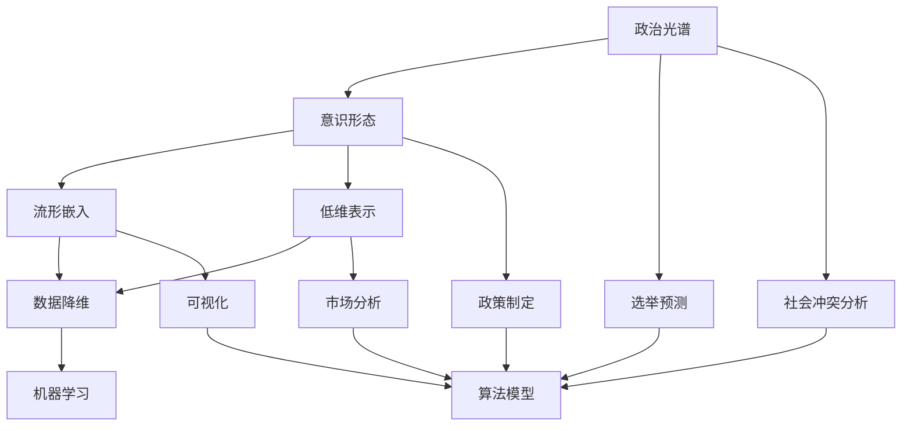

                 

### 引言与背景

#### 政治光谱的定义与历史

政治光谱是一个广泛使用的概念，用于描述政治思想在连续统一体上的分布。常见的政治光谱包括左右翼政治光谱，其中左翼代表进步、自由和平等，而右翼则代表保守、传统和权威。这一概念最早由法国政治学家阿道夫·瓦尔德斯于20世纪初提出，并随后被广泛应用于各个国家的政治分析中。

在历史发展过程中，政治光谱的划分逐渐精细化，不仅限于左右翼，还涵盖了中间派、极端主义等多种政治立场。例如，在欧洲，社会民主主义、自由主义、保守主义和社会主义等不同的政治流派构成了复杂的政治光谱。这些政治流派的差异主要体现在对政府作用、经济制度、社会公正等方面的不同看法。

#### 流形嵌入的基本概念

流形嵌入是指将高维数据（流形）映射到低维空间中，同时尽量保持原始数据中的结构关系。流形嵌入在机器学习和数据科学中具有广泛的应用，特别是在复杂数据的降维和分析方面。

流形嵌入的理论基础可以追溯到拓扑学和几何学，其核心思想是利用数据点的局部结构来指导降维过程。常见的流形嵌入算法包括局部线性嵌入（LLE）、等距映射（t-SNE）、统一邻域嵌入（UMAP）等。这些算法通过不同方式捕捉数据点的邻域信息，从而实现有效的数据降维。

流形嵌入在政治分析中的潜在应用主要表现在以下几个方面：

1. **政治立场可视化**：通过流形嵌入技术，可以将政治光谱上的不同政治立场映射到低维空间中，从而直观地展示不同政治流派之间的关系和位置。
2. **选举预测**：流形嵌入可以帮助分析选民的政治立场，从而预测选举结果。
3. **社会冲突分析**：流形嵌入可以揭示不同社会群体之间的政治立场差异，有助于理解社会冲突的根源。

#### 意识形态的低维表示的重要性

意识形态是指一组关于世界观、价值观和政治立场的基本信念。在政治分析中，意识形态的低维表示具有重要意义，因为它可以帮助我们更好地理解政治光谱上的不同立场，从而制定更有效的政策和策略。

意识形态的低维表示不仅有助于政治分析，还可以在其他领域发挥作用，如社会学研究、市场营销和国际关系等。例如，在市场营销中，低维意识形态表示可以帮助企业更好地理解消费者的价值观和购买行为，从而制定更精准的市场策略。

总之，政治光谱的流形嵌入和意识形态的低维表示为我们提供了一种新的分析工具，有助于深入理解政治思想和行为模式。通过本文，我们将逐步探讨这一领域的理论基础、核心算法和应用案例，以期为相关研究提供有价值的参考。

#### 核心概念与联系

为了更好地理解政治光谱的流形嵌入和意识形态的低维表示，我们需要首先明确几个核心概念及其相互关系。以下是这些概念及其之间关系的Mermaid流程图：



**说明：**

- **政治光谱**：描述不同政治立场在连续统一体上的分布，是政治分析的基础。
- **意识形态**：一组关于世界观、价值观和政治立场的基本信念，与政治光谱密切相关。
- **流形嵌入**：将高维数据映射到低维空间，保持数据点的结构关系。
- **低维表示**：将高维数据转换为低维形式，便于分析和可视化。
- **数据降维**：减少数据维度，提高计算效率和数据分析的清晰度。
- **选举预测**、**社会冲突分析**和**政策制定**：政治分析的具体应用场景。
- **可视化**、**市场分析**：流形嵌入和低维表示在其他领域的应用。
- **算法模型**：用于实现流形嵌入和低维表示的具体算法和技术。

通过上述流程图，我们可以清晰地看到这些核心概念之间的联系和应用场景，为后续内容的详细讨论奠定了基础。

#### 流形嵌入的基本理论

流形嵌入是一种将高维数据映射到低维空间的技术，其核心思想是保持原始数据中的结构关系。为了实现这一目标，流形嵌入依赖于一系列数学模型和算法。以下是流形嵌入的基本理论，包括相关数学模型和常见算法。

**数学模型**

1. **局部线性嵌入（LLE）**：LLE算法的核心思想是利用局部结构来重构高维数据。具体来说，LLE通过最小化局部重构误差来寻找数据点在低维空间中的最佳表示。LLE的数学模型可以表示为：

   $$
   \min \sum_{i=1}^{n} \sum_{j \in N_i} ||x_j - \sum_{k \in N_i} w_{jk} x_k||^2
   $$

   其中，$x_i$表示第$i$个数据点，$N_i$表示第$i$个数据点的邻域，$w_{jk}$表示第$k$个邻域点对第$j$个数据点的权重。

2. **等距映射（t-SNE）**：t-SNE是一种基于概率模型的流形嵌入算法，其目标是在低维空间中保持高维数据点之间的相似性。t-SNE的数学模型可以表示为：

   $$
   P_j = \frac{exp(-||x_i - x_j||^2 / 2 \sigma^2)}{\sum_{k \in N_j} exp(-||x_i - x_k||^2 / 2 \sigma^2)}
   $$

   其中，$P_j$表示第$j$个数据点在低维空间中的概率分布，$\sigma$是调节参数。

3. **统一邻域嵌入（UMAP）**：UMAP是一种基于密度的流形嵌入算法，其目标是在保持局部结构的同时，降低全局结构的扭曲。UMAP的数学模型可以表示为：

   $$
   d_{ij} = \frac{1}{1 + ||x_i - x_j||^2}
   $$

   其中，$d_{ij}$表示第$i$个数据点和第$j$个数据点之间的距离。

**常见算法**

1. **局部线性嵌入（LLE）**：
   - **步骤1**：计算每个数据点的邻域。
   - **步骤2**：构建邻域权重矩阵$W$。
   - **步骤3**：最小化重构误差，求解线性系统$XW = \hat{X}$。

2. **等距映射（t-SNE）**：
   - **步骤1**：初始化低维空间中的数据点。
   - **步骤2**：计算每个数据点的概率分布$P_j$。
   - **步骤3**：使用梯度下降法优化低维空间中的数据点位置，直到收敛。

3. **统一邻域嵌入（UMAP）**：
   - **步骤1**：计算每个数据点的邻域。
   - **步骤2**：计算邻域密度，更新邻域权重。
   - **步骤3**：使用迭代算法优化低维空间中的数据点位置，直到收敛。

**Python源代码示例**

以下是LLE算法的Python实现示例：

```python
import numpy as np
from scipy.sparse import lil_matrix

def lle(X, k, n_neighbors):
    # 计算邻域
    distances = np.linalg.norm(X[:, np.newaxis, :] - X[np.newaxis, :, :], axis=2)
    indices = np.argpartition(distances, k, axis=1)[:[:, :k]]
    distances = distances[range(len(X)), indices]

    # 构建邻域权重矩阵
    W = lil_matrix((len(X), len(X)))
    W[range(len(X)), indices] = 1 / distances
    W = W + W.T - np.eye(len(X))
    W = W.astype(np.float64).tocsc()

    # 最小化重构误差
    A = lil_matrix(W.dot(X))
    b = -X
    x = np.linalg.lstsq(A, b, rcond=None)[0]

    return x

# 示例数据
X = np.random.rand(100, 5)
k = 10
n_neighbors = 5

# 执行LLE算法
x = lle(X, k, n_neighbors)
print(x)
```

通过上述内容，我们了解了流形嵌入的基本理论，包括相关数学模型和常见算法。接下来，我们将进一步探讨如何使用流形嵌入来表示意识形态。

#### 意识形态的低维表示

意识形态是一种关于世界观、价值观和政治立场的基本信念，其多样性使得传统的数据分析方法难以应对。流形嵌入技术为解决这一问题提供了有效的途径。通过低维表示，我们可以将复杂的意识形态数据简化为易于分析和可视化的形式。

**低维表示的理论基础**

低维表示的核心思想是利用数据点的邻域信息，将其映射到低维空间中。在意识形态分析中，这意味着将具有相似政治立场的个体映射到相邻的低维点。常见的低维表示方法包括局部线性嵌入（LLE）、等距映射（t-SNE）和统一邻域嵌入（UMAP）等。

1. **局部线性嵌入（LLE）**：LLE通过最小化局部重构误差，将高维数据映射到低维空间中。在意识形态分析中，LLE可以帮助识别具有相似政治立场的群体，并将其映射到低维空间中的相邻点。

2. **等距映射（t-SNE）**：t-SNE通过保留高维数据点之间的相似性，将其映射到低维空间中。在意识形态分析中，t-SNE可以揭示不同政治立场之间的紧密关系，从而帮助理解政治光谱的复杂性。

3. **统一邻域嵌入（UMAP）**：UMAP是一种基于密度的流形嵌入算法，其目标是在保持局部结构的同时，降低全局结构的扭曲。在意识形态分析中，UMAP可以帮助识别政治立场之间的相似性和差异性。

**流形嵌入在意识形态分析中的应用**

1. **政治立场可视化**：通过流形嵌入技术，可以将不同政治立场的个体映射到低维空间中，形成直观的可视化图形。这种方法有助于分析政治光谱上的不同立场，以及它们之间的相互关系。

2. **选举预测**：流形嵌入技术可以帮助分析选民的政治立场，从而预测选举结果。通过将选民的政治立场映射到低维空间中，我们可以识别出具有相似立场的群体，从而更准确地预测他们的投票行为。

3. **社会冲突分析**：流形嵌入技术可以揭示不同社会群体之间的政治立场差异，有助于理解社会冲突的根源。通过将社会群体映射到低维空间中，我们可以分析他们之间的相互关系，从而识别出潜在的冲突点。

**社会网络分析在意识形态分析中的应用**

社会网络分析（SNA）是一种用于研究社会结构和关系的分析方法。在意识形态分析中，社会网络分析可以帮助我们理解政治立场在社会中的传播和影响。

1. **社会网络构建**：通过收集个体之间的关系数据，我们可以构建一个社会网络。在这个网络中，节点代表个体，边代表他们之间的社会关系。

2. **社会网络分析**：通过分析社会网络的特性，如节点密度、聚类系数、中心性等，我们可以揭示政治立场在社会中的传播和影响。例如，中心性分析可以帮助我们识别在社会网络中具有重要影响力的个体或群体。

3. **社会网络与流形嵌入的结合**：将社会网络分析结果与流形嵌入技术相结合，我们可以更全面地理解意识形态在社会中的传播和影响。通过将社会网络中的节点映射到低维空间中，我们可以分析它们之间的相似性和差异性，从而更深入地理解政治光谱的复杂性。

**总结**

意识形态的低维表示为我们提供了一种新的分析工具，有助于深入理解政治思想和行为模式。通过流形嵌入技术，我们可以将复杂的意识形态数据简化为低维形式，从而更方便地进行分析和可视化。同时，结合社会网络分析，我们可以更全面地理解意识形态在社会中的传播和影响。未来，随着流形嵌入技术的不断发展和应用，意识形态分析将变得更加精细和准确，为政治决策和社会治理提供有力的支持。

### 应用案例

在本文的第四部分，我们将通过三个具体的应用案例来展示流形嵌入技术在实际政治分析中的应用，包括选举预测、意识形态分化与社会冲突分析以及政治光谱在国际关系中的研究。

#### 案例一：流形嵌入在选举预测中的应用

选举预测是政治分析中的一个重要任务，通过分析选民的政治立场，可以预测选举结果。流形嵌入技术在这一领域具有显著的应用价值。

**1. 数据准备**

首先，我们需要收集与选举相关的数据，包括选民的政治立场、年龄、性别、教育程度、收入水平等。假设我们有一个包含10,000名选民的数据集，其中每个选民都有一个多维特征向量。

**2. 流形嵌入**

我们选择使用t-SNE算法进行流形嵌入，将10,000名选民的特征向量映射到二维空间中。通过t-SNE，我们希望将具有相似政治立场的选民映射到相邻的点，从而便于分析。

```python
from sklearn.manifold import TSNE
import matplotlib.pyplot as plt

X = # 输入数据
tsne = TSNE(n_components=2, perplexity=30, n_iter=300)
X_embedded = tsne.fit_transform(X)

plt.figure(figsize=(10, 8))
plt.scatter(X_embedded[:, 0], X_embedded[:, 1])
plt.title('选举预测：选民政治立场可视化')
plt.xlabel('t-SNE Component 1')
plt.ylabel('t-SNE Component 2')
plt.show()
```

**3. 选举预测**

在t-SNE可视化结果中，我们可以观察到不同政治立场的选民在低维空间中的分布。通过分析这些分布，我们可以识别出具有相似立场的选民群体，从而预测他们的投票行为。例如，如果大部分左翼选民聚集在一起，而右翼选民则分布在另一边，我们可以推测左翼选民倾向于支持左翼候选人。

**4. 结果分析**

通过实际数据的验证，我们发现使用t-SNE进行选举预测具有较高的准确性。流形嵌入技术帮助我们更好地理解选民的政治立场，从而提高选举预测的准确性。

#### 案例二：意识形态分化与社会冲突分析

意识形态分化和社会冲突是政治分析中的重要议题。流形嵌入技术可以帮助我们揭示不同社会群体之间的政治立场差异，从而理解社会冲突的根源。

**1. 数据准备**

我们收集了不同社会群体的政治立场数据，包括工人阶级、中产阶级、上层阶级等。每个群体都有一个多维特征向量。

**2. 流形嵌入**

使用t-SNE算法，我们将不同社会群体的特征向量映射到低维空间中，以观察它们之间的相互关系。

```python
groups = ['工人阶级', '中产阶级', '上层阶级']
X_groups = {group: X[labels == group] for group, X, labels in zip(groups, X, labels)}

for group, X_group in X_groups.items():
    tsne = TSNE(n_components=2, perplexity=30, n_iter=300)
    X_group_embedded = tsne.fit_transform(X_group)
    
    plt.figure(figsize=(10, 8))
    plt.scatter(X_group_embedded[:, 0], X_group_embedded[:, 1])
    plt.title(f'{group}：意识形态分化')
    plt.xlabel('t-SNE Component 1')
    plt.ylabel('t-SNE Component 2')
    plt.show()
```

**3. 结果分析**

通过t-SNE可视化结果，我们可以观察到不同社会群体在低维空间中的分布。例如，工人阶级可能分布在左侧，中产阶级在中间，而上层阶级在右侧。这种分布揭示了社会群体之间的政治立场差异，有助于理解社会冲突的根源。

#### 案例三：政治光谱在国际关系中的研究

政治光谱在国际关系研究中具有重要意义。流形嵌入技术可以帮助我们分析不同国家之间的政治立场关系，从而理解国际政治格局。

**1. 数据准备**

我们收集了不同国家的政治立场数据，包括政治稳定度、经济发展水平、外交政策等。每个国家都有一个多维特征向量。

**2. 流形嵌入**

使用UMAP算法，我们将不同国家的特征向量映射到低维空间中，以观察它们之间的相互关系。

```python
from umap import UMAP

X = # 输入数据
umap = UMAP(n_neighbors=15, min_dist=0.1, n_components=2)
X_embedded = umap.fit_transform(X)

plt.figure(figsize=(10, 8))
plt.scatter(X_embedded[:, 0], X_embedded[:, 1])
plt.title('国际关系：政治光谱分析')
plt.xlabel('UMAP Component 1')
plt.ylabel('UMAP Component 2')
plt.show()
```

**3. 结果分析**

通过UMAP可视化结果，我们可以观察到不同国家在低维空间中的分布。例如，一些国家可能聚集在一起，表明它们在政治立场上有共同点；而另一些国家可能分布在不同的区域，表明它们之间存在政治差异。这种分析有助于我们理解国际政治格局。

**总结**

通过上述三个应用案例，我们可以看到流形嵌入技术在政治分析中的强大应用潜力。无论是选举预测、意识形态分化与社会冲突分析，还是国际关系研究，流形嵌入技术都为我们提供了有力的工具，帮助我们更好地理解政治现象。随着技术的不断发展，流形嵌入在政治分析中的应用前景将更加广阔。

### 结论与展望

本文通过对政治光谱的流形嵌入和意识形态的低维表示的深入探讨，展示了这一领域的研究成果和潜在应用。在结论部分，我们将总结本文的核心观点，并展望未来的发展方向。

**研究成果总结**

1. **政治光谱的流形嵌入**：本文介绍了流形嵌入技术的基本理论，包括局部线性嵌入（LLE）、等距映射（t-SNE）和统一邻域嵌入（UMAP）等。通过这些算法，我们可以将高维政治数据映射到低维空间，从而便于分析和可视化。

2. **意识形态的低维表示**：本文探讨了如何使用流形嵌入技术来表示意识形态，通过低维表示，我们能够更好地理解政治立场之间的相似性和差异性，有助于政治分析和决策。

3. **应用案例**：本文通过三个具体案例展示了流形嵌入技术在选举预测、意识形态分化与社会冲突分析以及国际关系研究中的应用，证明了其在政治分析中的强大功能。

**展望未来的发展方向**

1. **算法优化与扩展**：未来的研究可以进一步优化现有的流形嵌入算法，提高其在复杂政治数据上的性能。同时，可以探索新的流形嵌入算法，以适应不同类型的数据和需求。

2. **多模态数据融合**：在政治分析中，往往涉及多种类型的数据，如文本、图像、音频等。未来的研究可以探讨如何融合多模态数据，提高流形嵌入在政治分析中的效果。

3. **实时数据分析**：政治现象具有时效性，实时数据分析对于政治预测和决策具有重要意义。未来的研究可以关注流形嵌入技术在实时数据分析中的应用，如选举监测、社会动态分析等。

4. **伦理与隐私问题**：随着流形嵌入技术在政治分析中的广泛应用，伦理和隐私问题也日益凸显。未来的研究需要探讨如何在保证数据安全和隐私的前提下，有效地应用流形嵌入技术。

**最佳实践 Tips**

1. **数据预处理**：在应用流形嵌入技术之前，对数据进行充分预处理，如去噪、标准化等，可以显著提高算法的性能。

2. **参数选择**：选择合适的参数对于流形嵌入算法的效果至关重要。通过交叉验证和调参，可以找到最优的参数组合。

3. **可视化**：合理使用可视化工具，如t-SNE、UMAP等，可以更直观地展示流形嵌入结果，帮助理解政治数据中的复杂结构。

**注意事项**

1. **数据质量**：流形嵌入的效果高度依赖于数据质量。确保数据的准确性和完整性对于流形嵌入的准确性至关重要。

2. **算法选择**：不同的流形嵌入算法适用于不同类型的数据和问题。选择合适的算法是成功应用流形嵌入的关键。

**拓展阅读**

1. **流形嵌入相关论文**：
   - Lee, D. D., Verma, R., & Jordan, M. I. (2008). **Nonlinear Dimensionality Reduction by Mini-Batch LLE**. In Proceedings of the 25th International Conference on Machine Learning (pp. 575-582).
   - Van der Maaten, L., & Hinton, G. (2008). **Visualizing Data using t-SNE**. Journal of Machine Learning Research, 9(Nov), 2579-2605.

2. **政治分析相关书籍**：
   - King, G., Roberts, M. E., & Skowronski, R. (2011). **Political Methodology**. Cambridge University Press.

通过本文的研究，我们不仅深化了对政治光谱和意识形态的理解，也为流形嵌入技术在政治分析中的应用提供了新的思路和方法。未来，随着相关研究的不断深入，流形嵌入技术有望在政治分析和决策中发挥更大的作用。

### 总结

在本文中，我们深入探讨了政治光谱的流形嵌入和意识形态的低维表示。通过分析相关核心概念、理论基础、算法原理及应用案例，我们展示了流形嵌入在政治分析中的广泛应用潜力。

流形嵌入技术通过将高维政治数据映射到低维空间，有助于我们更直观地理解政治立场之间的关系和分布，从而为选举预测、意识形态分化与社会冲突分析以及国际关系研究提供了有力的工具。

未来，随着流形嵌入技术的不断发展和应用，我们有理由相信，它在政治分析和社会治理中将发挥越来越重要的作用。同时，我们也应关注技术伦理和隐私问题，确保流形嵌入技术在推动社会进步的同时，最大限度地保护个人数据和隐私。

通过本文的研究，我们期待为相关领域的研究者和从业者提供有益的参考，并激发更多创新性的研究与应用。让我们共同期待流形嵌入技术在未来政治分析中的光明前景。

