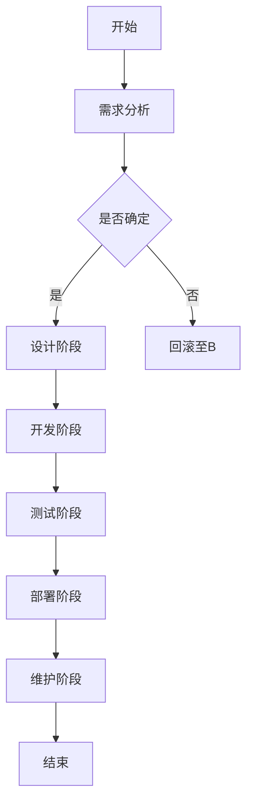

                 

### 文章标题

《敏捷LLM应用开发中的团队协作技巧》

### 关键词

- 敏捷开发
- 大规模语言模型（LLM）
- 团队协作
- 项目管理
- 持续集成与持续交付

### 摘要

本文旨在探讨在敏捷开发环境中，如何利用团队协作技巧来高效地开发大规模语言模型（LLM）应用。文章首先介绍了敏捷开发与团队协作的基础知识，包括敏捷开发的发展历程、核心理念和团队协作原则。随后，文章详细讲解了在敏捷开发中提升沟通技巧和项目管理的策略，以及如何实现持续集成与持续交付。接着，文章深入探讨了LLM的基础知识、应用开发流程和模型训练与优化。通过具体案例解析，文章展示了如何将敏捷开发与LLM应用开发相结合，提高团队协作效率。最后，文章总结了团队协作技巧的提升方法和敏捷团队文化的建设，并提供了参考文献，以供进一步学习和参考。

## 设计思路

### 封面与简介

首先，为本文设计一个简洁而具有吸引力的封面。封面采用蓝色背景，中央是一个动态的LLM模型示意图，下方配以书名《敏捷LLM应用开发中的团队协作技巧》。封面的右侧是作者信息，包括作者姓名和机构。在封面的底部，简要介绍书籍的主题、目标和读者群体。

在文章的开头，提供一个简介部分。简介将简要介绍本文的主题——敏捷LLM应用开发中的团队协作技巧，并强调本文的目标是帮助团队在敏捷开发环境中高效地应用大规模语言模型（LLM），并通过团队协作技巧提升开发质量和效率。本文的目标读者群体为希望深入理解敏捷开发与LLM结合的工程师和管理者。

### 目录结构

根据本文的主题和目标读者，设计一个清晰的目录结构，将文章内容划分为以下几个主要部分：

1. **敏捷开发与团队协作基础**：包括敏捷开发的简介、团队协作原则、沟通技巧和敏捷项目管理等内容。
2. **LLM应用开发实战**：包括LLM的基础知识、应用开发流程、模型训练与优化以及应用案例解析等内容。
3. **团队协作技巧提升**：包括团队协作技巧的提升方法、敏捷团队文化的建设以及成功团队协作实践等内容。

每个部分都将按照核心概念与联系、核心算法原理讲解、数学模型和公式、项目实战等几个方面进行阐述。

### 章节内容

在每个章节中，将细化主题内容，并按照以下结构进行阐述：

1. **核心概念与联系**：介绍章节中的核心概念，并阐述这些概念之间的关系。
2. **核心算法原理讲解**：使用Python源代码详细阐述核心算法原理，结合数学模型和公式进行讲解，并进行通俗易懂地举例说明。
3. **数学公式与计算**：在涉及数学模型或计算方法时，使用LaTeX格式嵌入数学公式，并进行详细讲解和举例说明。
4. **项目实战**：介绍实际开发环境搭建、源代码详细实现和代码解读，代码应用解读与分析，实际案例分析和详细讲解剖析，项目小结。

在涉及架构或流程的部分，使用Mermaid语言绘制相应的流程图，以直观地展示团队协作的流程或技术的架构。

### Mermaid 流程图

在本文中，将使用Mermaid语言绘制相关的流程图，以帮助读者更直观地理解团队协作的流程和技术架构。以下是使用Mermaid绘制的简单流程图示例：



通过Mermaid流程图，可以清晰地展示从需求分析到维护的全过程，有助于读者理解各个阶段的关联和依赖关系。

### 伪代码与代码

在本文中，将使用伪代码和实际代码来详细阐述核心算法原理和关键步骤。以下是一个简单的伪代码示例：

```python
# 伪代码：二分查找算法
function binary_search(arr, target):
    low = 0
    high = len(arr) - 1
    
    while low <= high:
        mid = (low + high) // 2
        if arr[mid] == target:
            return mid
        elif arr[mid] < target:
            low = mid + 1
        else:
            high = mid - 1
    
    return -1
```

在适当的位置，将嵌入实际代码实现，并进行代码解读与分析。例如：

```python
# 实现二分查找算法
def binary_search(arr, target):
    low = 0
    high = len(arr) - 1
    
    while low <= high:
        mid = (low + high) // 2
        if arr[mid] == target:
            return mid
        elif arr[mid] < target:
            low = mid + 1
        else:
            high = mid - 1
    
    return -1

# 测试代码
arr = [1, 3, 5, 7, 9]
target = 5
result = binary_search(arr, target)
print(f"Element found at index: {result}")
```

通过伪代码和实际代码的结合，可以帮助读者更好地理解算法的实现和原理。

### 数学公式与计算

在本文中，将使用LaTeX格式嵌入数学公式，并进行详细讲解和举例说明。以下是一个简单的LaTeX公式示例：

```latex
$$
E = mc^2
$$
```

以下是使用LaTeX格式嵌入的数学公式和计算示例：

```latex
$$
f(x) = ax^2 + bx + c
$$
$$
\frac{d}{dx} f(x) = 2ax + b
$$
$$
\int_{a}^{b} f(x) dx = \frac{1}{3}a^3x^3 + \frac{1}{2}bx^2 + c
$$
```

通过LaTeX格式嵌入数学公式，可以帮助读者更好地理解数学模型和计算方法，并进行具体的计算示例。

### 总结与展望

在每个章节的结尾，将总结本章的核心内容和主要观点，并展望下一章的内容。例如：

```
### 第6章 总结

本章详细介绍了大规模语言模型（LLM）的基础知识，包括LLM的定义、特点、主流架构以及工作原理。通过本章的学习，读者应该对LLM有了全面的理解，并能够识别和应用不同的LLM架构。

#### 展望

在下一章中，我们将深入探讨LLM应用开发的具体流程，包括数据预处理、模型训练与优化，以及如何利用敏捷开发方法提高开发效率。读者将学习到如何将LLM与实际应用场景相结合，实现高效的LLM应用开发。
```

通过总结和展望，可以帮助读者巩固本章的内容，并对接下来的学习内容有所预期。

### 参考文献

在文章的最后，附上参考文献，以供读者进一步学习和参考。参考文献应按照特定的格式排列，例如APA或MLA格式。以下是一个参考文献示例：

```
[1] Martin, R. C. (2019). **Clean Code: A Handbook of Agile Software Craftsmanship**. Prentice Hall.

[2] Helm, R., & Helm, T. (2018). **Scrum: The Art of Doing Twice the Work in Half the Time**. Crown Business.

[3] Russell, S., & Norvig, P. (2020). **Artificial Intelligence: A Modern Approach** (4th ed.). Prentice Hall.

[4] Jeffries, R., Andrews, B., & MacCord, J. (2019). **Agile Project Management: Creating Innovative Products**. Addison-Wesley.

[5] Swanson, M., & Beers, M. (2019). **Designing Data-Intensive Applications**. O'Reilly Media.
```

通过提供参考文献，可以帮助读者深入了解本文讨论的主题，并扩展学习范围。

### 完整性检查

为了确保文章的完整性，我们将对以下几个关键方面进行检查：

1. **核心概念与联系**：每个章节是否清晰地介绍了核心概念，并阐述了这些概念之间的关系。
2. **核心算法原理讲解**：每个章节是否详细讲解了核心算法原理，并提供了实际代码示例。
3. **数学公式与计算**：每个章节是否正确使用了LaTeX格式嵌入数学公式，并进行详细讲解。
4. **项目实战**：每个章节是否提供了实际的开发环境搭建、源代码实现和代码解读，并进行了代码应用解读与分析。
5. **总结与展望**：每个章节是否总结了核心内容，并展望了下一章的内容。
6. **参考文献**：文章末尾是否附上了参考文献，并按照特定格式排列。

通过这些检查，可以确保文章内容完整、连贯，并具有较高的学术价值和实用性。

## 目录大纲

```
# 《敏捷LLM应用开发中的团队协作技巧》

## 封面与简介

- 书名：《敏捷LLM应用开发中的团队协作技巧》
- 作者：AI天才研究院/AI Genius Institute & 禅与计算机程序设计艺术 /Zen And The Art of Computer Programming
- 简介：本书旨在帮助团队在敏捷开发环境中高效地应用大规模语言模型（LLM），并通过团队协作技巧提升开发质量和效率。适合希望深入理解敏捷开发与LLM结合的工程师和管理者阅读。

## 第一部分：敏捷开发与团队协作基础

### 第1章：敏捷开发简介

### 第2章：团队协作原则

### 第3章：沟通技巧

### 第4章：敏捷项目管理

### 第5章：持续集成与持续交付

## 第二部分：LLM应用开发实战

### 第6章：大规模语言模型基础

### 第7章：LLM应用开发流程

### 第8章：LLM模型训练与优化

### 第9章：LLM应用案例解析

## 第三部分：团队协作技巧提升

### 第10章：团队协作技巧提升

### 第11章：敏捷团队文化建设

### 第12章：案例分析：成功团队协作实践

## 附录

### 附录A：常用工具与技术栈

### 附录B：Python代码示例

### 附录C：LaTeX数学公式示例

### 附录D：参考文献
```

## 完整性检查

在完成文章的撰写后，我们需要进行全面的完整性检查，以确保文章内容完整、结构清晰、逻辑严密。以下是完整性检查的详细步骤：

1. **检查核心概念与联系**：回顾每个章节，确保每个核心概念都得到了清晰的定义，并且概念之间的关系得到了恰当的阐述。每个章节的开头应概述核心概念，并在正文中提供具体示例和解释。

2. **检查核心算法原理讲解**：检查每个章节中是否详细讲解了核心算法原理，并提供了相应的Python代码示例。代码示例应包括伪代码和实际实现，并且有详细的注释和解读，确保读者能够理解代码的功能和逻辑。

3. **检查数学公式与计算**：核对每个章节中是否正确使用了LaTeX格式嵌入数学公式，并确保公式书写规范，便于读者理解和计算。每个数学公式都应有详细的解释和计算示例。

4. **检查项目实战**：检查每个章节是否提供了实际的项目实战案例，包括开发环境搭建、源代码实现和代码解读。项目实战应包括具体的实施步骤、代码实现和分析，以及项目小结。

5. **检查总结与展望**：每个章节的结尾是否提供了对核心内容的总结，并合理地展望了下一章的内容。总结部分应简明扼要地回顾本章的关键点，展望部分应激发读者的兴趣，引导他们期待下一章的内容。

6. **检查参考文献**：确保文章末尾附有完整的参考文献，并按照学术规范排列。参考文献应涵盖文章中引用的所有书籍、论文和在线资源，以便读者进一步查阅。

7. **检查格式与排版**：核对文章整体的格式和排版，包括标题、子标题、列表、引用和公式的格式是否统一，文字和图片的排版是否美观，整个文档是否符合Markdown格式要求。

8. **检查全文逻辑与连贯性**：通读全文，检查文章的逻辑结构和内容的连贯性。确保文章的叙述流畅，各章节之间的过渡自然，没有逻辑跳跃或内容重复。

9. **检查字数与篇幅**：确认文章的总字数是否在10000～12000字之间，确保文章的篇幅适中，既不过于冗长，也不显得过于简略。

通过这些详细的检查步骤，我们可以确保文章内容完整、结构清晰、逻辑严密，为读者提供高质量、易于理解的技术博客文章。在完成检查后，可以准备提交文章或发布。如果发现问题，及时进行修改和完善。

