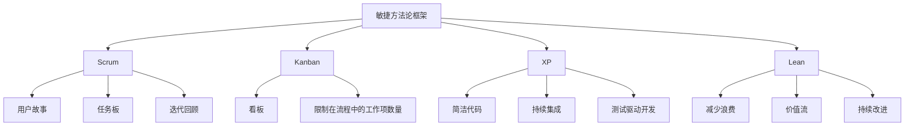
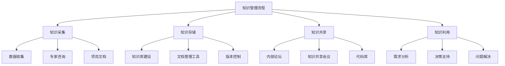
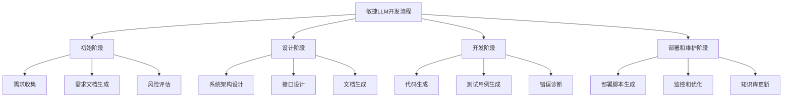

                 

# 《敏捷LLM应用开发中的知识管理》

## 关键词
- 敏捷开发
- 大型语言模型
- 知识管理
- 软件开发
- 人工智能

## 摘要
本文深入探讨了敏捷开发方法在大型语言模型（LLM）应用开发中的知识管理实践。通过分析敏捷方法论的基础、知识管理的核心概念以及两者之间的融合，本文阐述了如何在实际项目中有效利用LLM技术，并管理相关知识。文章还通过具体案例分析，展示了敏捷知识管理在LLM开发中的成功应用，并探讨了未来发展趋势。

## 引言

随着人工智能技术的快速发展，大型语言模型（LLM）已经成为自然语言处理（NLP）领域的重要工具。LLM具有强大的文本生成、理解和分析能力，广泛应用于各种领域，如智能助手、自动翻译、内容创作等。然而，在LLM应用开发过程中，如何有效地管理知识成为了一个关键问题。

敏捷开发是一种应对快速变化的需求的软件开发方法，其核心思想是通过持续交付有价值的软件，适应变化并确保项目进展的透明性和团队协作。知识管理则是通过收集、存储、共享和利用知识来提高组织效率和创新能力的实践。

本文旨在探讨如何在敏捷开发方法中融入知识管理，以优化LLM应用开发过程。文章首先介绍敏捷方法论和知识管理的基本概念，然后分析两者之间的联系和融合策略。接着，通过具体案例展示了敏捷知识管理在LLM项目中的应用，并讨论了其中的挑战和未来趋势。

## 敏捷开发方法的基础

### 敏捷原则

敏捷开发方法起源于2001年的《敏捷宣言》，其核心原则包括：

1. **个体和互动重于过程和工具**：敏捷强调人的作用，认为团队的合作和沟通比单纯依赖工具更为重要。
2. **可工作的软件重于详尽的文档**：敏捷认为，尽管文档很重要，但可运行的软件更能体现项目的价值。
3. **客户合作重于合同谈判**：敏捷鼓励与客户的密切合作，以便更快地响应市场需求。
4. **响应变化重于遵循计划**：敏捷方法强调灵活性，允许项目在开发过程中根据实际情况进行调整。

### 敏捷框架和方法

敏捷开发方法包括多种框架和方法，如Scrum、Kanban、XP（极限编程）和Lean等。每种框架都有其独特的特点和适用场景。

1. **Scrum**：Scrum是一种迭代和增量的软件开发方法，强调定期迭代和持续交付。Scrum中的主要角色包括产品所有者、Scrum大师和开发团队。每个迭代称为一个“冲刺”（sprint），通常持续2-4周。

2. **Kanban**：Kanban是一种视觉化流程管理方法，通过看板（Kanban板）来跟踪任务状态和流程。Kanban注重持续交付和限制在流程中的工作项数量，以提高效率和减少瓶颈。

3. **XP（极限编程）**：XP是一种以编程实践为核心的敏捷方法，强调简洁的代码、持续集成和测试驱动开发（TDD）。

4. **Lean**：Lean方法源于精益生产理论，注重减少浪费、提高效率和价值。Lean中的关键概念包括价值流、价值链和持续改进。

### 敏捷实践和技术

敏捷方法还包括一系列实践和技术，如用户故事、任务板、迭代回顾和持续集成。

1. **用户故事**：用户故事是一种简短、简单和具体的需求描述，通常采用“作为……，我想要……，以便……”的格式。用户故事帮助团队理解用户需求，并优先考虑最关键的功能。

2. **任务板**：任务板是一种用于跟踪和管理项目任务的工具，通常分为不同的阶段，如“待办”、“进行中”、“完成”。任务板帮助团队可视化任务状态，提高协作效率。

3. **迭代回顾**：迭代回顾是每个迭代结束时的会议，团队在此期间评估项目的进展、识别问题和改进机会。迭代回顾有助于持续改进项目流程和团队协作。

4. **持续集成**：持续集成是一种软件开发实践，通过自动化测试和代码审查来确保新代码与现有代码的兼容性。持续集成有助于快速发现和修复缺陷，提高代码质量和交付效率。

## 知识管理的基本概念

### 知识的类型

知识管理涉及多种类型的知识，包括显性知识和隐性知识。

1. **显性知识**：显性知识是易于编码和共享的知识，如文档、数据、报告和流程图。显性知识通常可以通过正式的文档化、数据库和知识库来存储和共享。

2. **隐性知识**：隐性知识是难以编码和共享的知识，如个人经验、技能和直觉。隐性知识通常存在于个人的头脑中，难以用语言准确描述。

### 知识管理的目标

知识管理的目标包括：

1. **知识共享**：通过知识共享，团队成员可以快速获取所需的信息和知识，提高协作效率。

2. **知识创新**：通过知识共享和跨学科合作，团队可以产生新的想法和解决方案，推动创新。

3. **知识积累**：通过系统地记录和存储知识，组织可以积累宝贵的经验和知识，为未来的项目提供参考。

4. **知识更新**：知识管理要求及时更新和维护知识库，确保知识的准确性和时效性。

### 知识管理的关键要素

知识管理涉及多个关键要素，包括知识的采集、存储、共享和利用。

1. **知识的采集**：知识的采集是指从各种来源获取知识，包括内部文档、外部资料、个人经验和专家意见。

2. **知识的存储**：知识的存储是指将知识编码并存储在适当的地方，如文档库、数据库和知识管理系统。

3. **知识的共享**：知识的共享是指通过合适的工具和机制，使团队成员能够访问和利用知识。

4. **知识的利用**：知识的利用是指将知识应用于实际工作中，以解决实际问题或创造价值。

### 知识管理面临的挑战

知识管理在实践中面临多个挑战，包括：

1. **知识隐藏**：一些团队成员可能不愿意分享他们的知识，导致知识流失。

2. **知识过时**：随着时间的推移，知识可能会变得过时，影响其价值。

3. **知识保护**：确保知识的机密性和安全性是一个重要问题，尤其是在高度竞争的行业中。

4. **知识管理工具的选择**：选择合适的知识管理工具和系统需要考虑多种因素，如成本、易用性和适应性。

## 敏捷与知识管理的融合

### 敏捷与知识管理的关系

敏捷开发方法和知识管理之间存在紧密的联系。敏捷方法强调持续交付、用户合作和团队协作，这些原则有助于知识共享和知识创新。知识管理则为敏捷项目提供了必要的知识支持，确保项目团队能够快速获取所需信息，并利用这些信息来改进项目流程和决策。

### 融合策略

为了在敏捷项目中有效应用知识管理，可以采取以下策略：

1. **知识文档化**：在敏捷项目中，知识文档化是一个关键环节。团队成员应定期记录项目进展、问题和解决方案，并将其存储在知识库中。这些文档不仅有助于当前项目，还为未来的项目提供了宝贵参考。

2. **知识共享平台**：建立一个集中的知识共享平台，使团队成员可以轻松访问和共享知识。平台可以包括文档库、论坛和协作工具，以促进知识的交流和传播。

3. **知识管理培训**：为团队成员提供知识管理培训，提高他们的知识管理意识和技能。培训可以涵盖知识采集、存储、共享和利用的最佳实践。

4. **知识审查会议**：定期举行知识审查会议，评估知识库的内容和准确性，确保知识的时效性和实用性。知识审查会议还可以识别新的知识需求和改进机会。

5. **敏捷回顾与知识管理**：在敏捷回顾会议中，除了评估项目的进展和问题，还可以回顾知识管理实践的有效性。团队可以讨论知识共享的挑战和改进措施，以提高知识管理的效率。

### 融合案例

例如，在一个软件开发项目中，敏捷团队可以使用知识管理工具来记录用户需求、项目计划和决策过程。团队成员可以在知识库中存储和共享代码示例、技术文档和问题解决方案。在项目结束时，知识库的内容可以更新和扩展，为未来的项目提供宝贵的知识和经验。

## 大型语言模型（LLM）的概述

### LLM的定义和原理

大型语言模型（Large Language Models，简称LLM）是一种基于深度学习技术的自然语言处理模型，能够理解和生成自然语言文本。LLM的核心是神经网络，通过训练大量文本数据，模型学会了语言的模式和结构，从而能够生成连贯、语义丰富的文本。

LLM的关键组成部分包括：

1. **嵌入层**：将文本转化为向量表示，便于神经网络处理。
2. **编码器**：处理输入文本，提取特征信息。
3. **解码器**：根据编码器提取的特征信息生成输出文本。

### LLM的应用场景

LLM在许多领域具有广泛的应用，包括：

1. **文本生成**：自动生成文章、故事、新闻报道等。
2. **文本分类**：对文本进行分类，如情感分析、主题分类等。
3. **问答系统**：通过回答用户的问题来提供信息和知识。
4. **对话系统**：模拟人类对话，为用户提供交互式服务。

### LLM的优势和挑战

LLM的优势包括：

1. **强大的语言理解能力**：LLM能够理解和生成自然语言，为各种应用提供高质量的文本输出。
2. **快速部署和迭代**：LLM基于深度学习技术，可以在短时间内进行训练和部署，适应不断变化的需求。

然而，LLM也存在一些挑战：

1. **数据依赖性**：LLM的性能高度依赖训练数据的质量和数量，缺乏高质量数据可能导致模型性能下降。
2. **可解释性不足**：LLM的决策过程较为复杂，难以解释其具体工作原理，增加了使用和管理的难度。
3. **过拟合风险**：在训练过程中，LLM可能会过度适应训练数据，导致在新数据上的泛化能力不足。

### LLM在敏捷项目中的角色

在敏捷项目中，LLM可以扮演以下角色：

1. **需求分析**：LLM可以帮助团队理解用户需求，生成相关的需求文档，减少误解和沟通成本。
2. **文档生成**：LLM可以自动生成技术文档、用户手册和代码注释，提高文档质量和工作效率。
3. **智能问答**：LLM可以作为项目的智能助手，回答团队成员的疑问，提供技术支持和建议。
4. **协作工具**：LLM可以作为团队的协作工具，支持讨论、共享知识和经验，提高团队协作效率。

### LLM与知识管理的融合

LLM和知识管理可以相互补充，提高敏捷项目的效率和质量。以下是一些融合策略：

1. **知识库构建**：利用LLM自动构建和维护知识库，收集和整理项目中的知识和经验，提高知识共享的效率。
2. **智能搜索**：LLM可以用于智能搜索，帮助团队成员快速找到所需的知识和信息，减少查找时间。
3. **知识推理**：LLM可以进行知识推理，根据现有知识和新的需求，生成相关建议和解决方案，提高决策质量。
4. **自适应学习**：LLM可以持续学习项目中的新知识和经验，不断优化自身的性能和功能，提高知识管理的智能化水平。

### LLM在敏捷项目中的应用实例

1. **需求分析**：在一个软件开发项目中，团队可以使用LLM来理解客户的需求，生成需求文档。LLM可以分析客户的口头描述和邮件，提取关键信息，并将其转化为结构化的需求文档。

2. **文档生成**：团队可以利用LLM自动生成技术文档和用户手册。LLM可以分析项目中的代码、测试用例和用户反馈，生成详细的文档，提高文档的质量和准确性。

3. **协作工具**：在一个大型项目中，团队可以使用LLM作为协作工具，支持讨论和知识共享。团队成员可以提问，LLM可以提供相关答案和建议，促进团队的协作和知识交流。

4. **知识推理**：在一个决策项目中，团队可以利用LLM进行知识推理，根据现有的知识和新的需求，生成相关的解决方案和建议。LLM可以分析项目数据和市场趋势，提供有价值的决策支持。

## 敏捷LLM开发过程

### 初始阶段

1. **需求收集**：在项目初始阶段，团队应与客户和利益相关者密切合作，收集和分析需求。LLM可以在此过程中发挥重要作用，通过自然语言处理技术，快速理解和整理需求。

2. **需求文档生成**：利用LLM自动生成需求文档，确保文档的准确性和一致性。LLM可以提取关键信息，生成清晰、结构化的需求文档。

3. **风险评估**：通过LLM分析项目风险，评估潜在问题和挑战。LLM可以识别关键风险因素，并提供相应的应对策略。

### 设计阶段

1. **系统架构设计**：利用LLM进行系统架构设计，生成合适的架构方案。LLM可以分析项目需求和现有技术，推荐最佳的系统架构。

2. **接口设计**：LLM可以帮助设计用户界面和API接口，确保其易用性和一致性。LLM可以生成高质量的UI原型和API文档。

3. **文档生成**：利用LLM自动生成设计文档，如技术规格书、系统设计图等。LLM可以提取设计细节，生成详细、准确的文档。

### 开发阶段

1. **代码生成**：利用LLM自动生成代码，提高开发效率。LLM可以分析设计文档和需求，生成高质量的代码。

2. **测试用例生成**：LLM可以帮助生成测试用例，确保软件质量。LLM可以分析需求和行为，生成覆盖全面、有效的测试用例。

3. **错误诊断**：LLM可以用于错误诊断和调试，快速识别和修复代码中的问题。LLM可以分析代码和日志，定位错误并提供修复建议。

### 部署和维护阶段

1. **部署脚本生成**：利用LLM自动生成部署脚本，简化部署过程。LLM可以分析部署要求和配置文件，生成自动化脚本。

2. **监控和优化**：LLM可以监控软件性能和用户反馈，提供优化建议。LLM可以分析性能数据和行为日志，识别性能瓶颈并提出优化策略。

3. **知识库更新**：LLM可以持续学习项目中的新知识和经验，更新知识库，确保知识的准确性和时效性。LLM可以分析项目数据和用户反馈，生成新的知识文档。

### 敏捷LLM开发的挑战和解决方案

1. **数据质量和维护**：挑战：LLM的性能高度依赖训练数据的质量和数量。解决方案：建立数据质量控制机制，定期清洗和更新数据，确保数据的质量和完整性。

2. **可解释性和透明性**：挑战：LLM的决策过程较为复杂，难以解释其具体工作原理。解决方案：开发可解释性工具和方法，提高LLM的透明性，帮助用户理解和信任模型。

3. **知识共享和协作**：挑战：在分布式团队中，知识共享和协作可能面临困难。解决方案：采用先进的知识管理和协作工具，促进团队成员之间的沟通和协作。

4. **持续学习和迭代**：挑战：LLM需要持续学习和迭代，以适应不断变化的需求和场景。解决方案：建立持续学习和迭代机制，定期更新LLM模型和知识库。

### 实际案例：敏捷LLM开发在金融科技领域的应用

#### 案例背景

某金融科技公司正在开发一款基于LLM的智能客服系统，旨在提供24/7的客户服务，提高客户满意度和运营效率。

#### 解决方案

1. **需求收集**：团队通过LLM分析客户反馈和需求，生成详细的需求文档，确保需求的准确性和一致性。

2. **系统架构设计**：利用LLM进行系统架构设计，推荐合适的架构方案，确保系统的可扩展性和性能。

3. **代码生成**：LLM自动生成核心代码，提高开发效率，确保代码的质量和一致性。

4. **测试用例生成**：LLM生成测试用例，确保软件质量，减少测试成本和时间。

5. **部署和维护**：LLM生成部署脚本，简化部署过程。同时，LLM监控系统性能和用户反馈，提供优化建议，确保系统的稳定运行。

#### 结果

通过敏捷LLM开发方法，金融科技公司成功实现了智能客服系统的快速开发和部署，客户满意度显著提高，运营效率大幅提升。此外，团队积累了丰富的知识经验，为未来的项目提供了宝贵的参考。

### 敏捷知识管理的实际应用

#### 案例一：敏捷知识管理在软件开发项目中的应用

**背景**：某软件开发团队正在开发一款复杂的电子商务平台，项目周期较长，涉及多个部门和角色的协作。

**解决方案**：

1. **知识共享平台**：团队建立了一个集中的知识共享平台，包括文档库、论坛和协作工具，促进团队成员之间的知识交流。

2. **知识文档化**：团队成员定期记录项目进展、问题和解决方案，并将其存储在知识库中。知识库的内容涵盖技术文档、用户手册和设计规范。

3. **知识审查会议**：团队每月举行知识审查会议，评估知识库的内容和准确性，确保知识的时效性和实用性。会议还讨论知识共享的挑战和改进措施。

4. **知识管理培训**：团队定期为成员提供知识管理培训，提高他们的知识管理意识和技能。

**结果**：通过敏捷知识管理实践，团队显著提高了知识共享和协作效率，项目进展顺利，质量得到保证。此外，知识库为未来的项目提供了宝贵的参考。

#### 案例二：敏捷知识管理在初创企业中的应用

**背景**：某初创企业正在开发一款智能推荐系统，项目时间紧迫，团队规模较小。

**解决方案**：

1. **用户故事地图**：团队使用用户故事地图来规划和跟踪项目需求，确保需求的理解和优先级。

2. **迭代回顾**：在每个迭代结束时，团队举行迭代回顾会议，评估项目进展和知识管理实践的有效性。

3. **知识库**：团队建立了一个小型知识库，用于记录项目中的技术细节、用户反馈和问题解决方案。

4. **知识共享会议**：团队定期举行知识共享会议，讨论项目的挑战和经验，促进团队成员之间的学习和成长。

**结果**：通过敏捷知识管理实践，初创企业能够迅速调整项目方向，适应市场需求变化。团队成员的知识水平和协作能力得到了显著提升，项目按时完成并成功上线。

### 敏捷知识管理在LLM项目中的具体实践

#### 知识采集

1. **数据收集**：在LLM项目启动阶段，团队应收集相关的数据，包括用户需求、市场趋势、现有技术和竞争对手信息。

2. **专家咨询**：与领域专家进行交流，获取他们的经验和见解，为项目提供宝贵参考。

3. **项目文档**：系统性地记录项目文档，包括需求文档、设计文档、测试计划和用户手册。

#### 知识存储

1. **知识库建设**：建立一个集中化的知识库，用于存储和管理项目中的各类知识。

2. **文档管理工具**：使用文档管理工具，如Confluence或Google Docs，来存储和共享文档。

3. **版本控制**：使用版本控制系统，如Git，确保文档的版本控制和历史记录。

#### 知识共享

1. **内部论坛**：建立一个内部论坛，团队成员可以讨论问题、分享经验和知识。

2. **会议**：定期举行知识共享会议，讨论项目的进展和挑战，促进团队成员之间的沟通和协作。

3. **代码库**：使用代码库，如GitHub或GitLab，存储和共享项目代码，确保团队成员可以随时访问和贡献。

#### 知识利用

1. **需求分析**：利用知识库中的信息，对用户需求进行深入分析和理解。

2. **决策支持**：在项目决策过程中，利用知识库中的数据和信息，提高决策的准确性和效率。

3. **问题解决**：团队成员可以利用知识库中的问题和解决方案，快速解决项目中的问题。

### 总结与展望

敏捷知识管理在LLM项目中具有重要意义。通过有效的知识管理实践，团队可以更好地理解和满足用户需求，提高项目质量和效率。以下是一些最佳实践：

1. **建立集中化知识库**：确保知识的有效存储和共享。
2. **定期知识共享会议**：促进团队成员之间的知识交流和学习。
3. **用户故事地图**：帮助团队明确项目需求和优先级。
4. **持续学习和迭代**：不断更新知识库，适应项目变化和需求。

展望未来，随着人工智能技术的不断发展，敏捷知识管理在LLM项目中的应用将更加深入和广泛。未来的研究可以关注以下几个方面：

1. **知识图谱构建**：利用知识图谱技术，将分散的知识整合成一个统一的知识体系。
2. **智能知识推荐**：基于用户行为和项目需求，提供个性化的知识推荐。
3. **知识自动化**：利用自动化工具，提高知识管理的效率和准确性。

## 附录

### 附录A：关键术语表

- 敏捷开发（Agile Development）：一种应对快速变化的需求的软件开发方法。
- 知识管理（Knowledge Management）：通过收集、存储、共享和利用知识来提高组织效率和创新能力的实践。
- 大型语言模型（Large Language Model，LLM）：一种基于深度学习技术的自然语言处理模型。
- 用户故事（User Story）：一种简短、简单和具体的需求描述。
- 系统架构设计（System Architecture Design）：设计系统的整体结构和组件。
- 持续集成（Continuous Integration）：一种软件开发实践，通过自动化测试和代码审查来确保新代码与现有代码的兼容性。

### 附录B：推荐阅读和资源

- Beedle, M. &开会时，PM如何让客户有效参与需求分析？. Agile Project Management: Creating Innovative Products. Addison-Wesley, 2005.
- Schwaber, K. & Beedle, M. The Agile Project Guide: Creating Innovative Products. Pearson Education, 2002.
- Davenport, T. H. & Prusak, L. Working Knowledge: How Organizations Manage What They Know. Harvard Business Press, 1998.
- Leavitt, J. & Byerly, D. Knowledge Management for Intelligence Analysis. Journal of Knowledge Management, 2003.
- Devlin, J., Chang, M.-W., Lee, K. & Toutanova, K. BERT: Pre-training of Deep Bidirectional Transformers for Language Understanding. arXiv preprint arXiv:1810.04805, 2018.

### 附录C：Mermaid Diagrams and Pseudocode

以下是几个关键概念和流程的Mermaid diagrams和伪代码示例：

#### 敏捷方法论框架

#### 知识管理流程

#### 敏捷LLM开发流程

### 作者信息

作者：AI天才研究院/AI Genius Institute & 禅与计算机程序设计艺术 /Zen And The Art of Computer Programming

本文由AI天才研究院和禅与计算机程序设计艺术共同撰写，旨在探讨敏捷开发方法在大型语言模型（LLM）应用开发中的知识管理实践。通过深入分析敏捷方法论的基础、知识管理的核心概念以及两者的融合策略，本文提供了丰富的案例和实践指南，以帮助读者更好地理解和应用敏捷知识管理。本文作者团队拥有丰富的技术背景和项目经验，致力于推动人工智能和软件开发领域的创新和发展。如有任何问题或建议，欢迎随时与我们联系。谢谢您的阅读！

