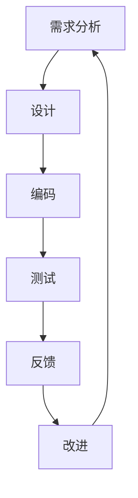

                 

### 敏捷与质量保证概述

#### 1.1.1 敏捷开发的概念与原则

敏捷开发（Agile Development）起源于软件开发领域，它是一种应对快速变化的需求的软件开发能力。与传统的方法不同，敏捷开发强调更加灵活和迭代的过程。其核心理念包含以下12个原则：

1. **个体和互动重于过程和工具**：注重人与人之间的交流和合作，而非依赖特定的工具或流程。
2. **可工作的软件重于详尽的文档**：实际运行中的软件胜于过分详尽的文档。
3. **客户合作重于合同谈判**：客户和开发团队之间的紧密合作比严格的合同条款更为重要。
4. **响应变化重于遵循计划**：敏捷开发能够快速适应变化，而不是坚持原计划。

敏捷开发的核心原则体现在以下几个方面：

- **迭代开发**：软件开发被分为多个小周期（通常是2-4周），每个周期都交付一个可运行的软件版本。
- **增量式交付**：软件是逐渐构建和完善的，每次迭代都会增加新的功能和改进。
- **持续反馈**：客户和开发团队定期进行交流，确保项目朝着正确的方向前进。

#### 1.1.2 质量保证的基本理念

质量保证（Quality Assurance, QA）是一个确保产品或服务符合特定标准的过程。在敏捷开发中，质量保证不仅仅是在开发完成后进行的检查，而是一个贯穿整个开发周期的活动。以下是质量保证的基本理念：

- **预防胜于检查**：通过设计和开发过程中的实践，尽可能减少缺陷的发生。
- **持续改进**：通过不断的反馈和评估，不断提高产品和过程的整体质量。
- **全面质量管理**：质量是团队共同的责任，而不仅仅是测试团队的责任。

质量保证涉及以下几个方面：

- **需求管理**：确保需求清晰、明确，并能够被有效实现。
- **过程改进**：持续优化开发流程，提高效率和效果。
- **缺陷管理**：及时识别和修复缺陷，确保产品质量。

#### 1.1.3 敏捷开发与质量保证的关系

敏捷开发与质量保证是相辅相成的。敏捷开发强调快速迭代和灵活响应，而质量保证确保每次迭代都提供高质量的产品。它们之间的关系可以概括为以下几点：

- **无缝整合**：质量保证活动贯穿于敏捷开发的整个生命周期，包括需求分析、设计、编码、测试等环节。
- **协作机制**：开发团队和测试团队之间的紧密协作是确保质量的关键。
- **持续反馈**：敏捷开发中的持续反馈机制有助于质量保证团队及时发现和解决问题。

下面是一个简单的 Mermaid 流程图，展示了敏捷开发与质量保证的关系：

#### 1.1.4 敏捷开发中的质量保证实践

在敏捷开发中，质量保证实践包括以下几个方面：

- **自动化测试**：通过自动化测试工具进行持续测试，确保每次迭代交付的产品质量。
- **代码审查**：团队成员相互审查代码，发现潜在的问题并改进代码质量。
- **持续集成和持续部署**：通过自动化流程，确保代码变更能够快速集成和部署，减少集成和部署风险。
- **用户故事地图**：通过用户故事地图，明确用户需求，确保产品开发方向正确。

总之，敏捷开发与质量保证的结合，使得软件开发更加高效、灵活且高质量。在接下来的章节中，我们将深入探讨敏捷LLM模型设计与评估、自动化测试、持续集成与持续部署等方面，以期为敏捷LLM应用开发中的质量保证提供更加详细的指导。

### 敏捷与质量保证概述

#### 敏捷开发的概念与原则

敏捷开发（Agile Development）是一种以人为核心、迭代、增量的软件开发方法。它强调快速响应变化和持续交付价值，旨在解决传统瀑布开发方法在快速变化的市场环境中无法灵活应对的挑战。敏捷开发的核心原则由《敏捷宣言》提出，包括以下十二条原则：

1. **个体和互动重于过程和工具**：软件开发的成功取决于有效的团队合作，而不是依赖特定的流程或工具。
2. **可工作的软件重于详尽的文档**：交付可运行的软件比拥有详尽的文档更有价值。
3. **客户合作重于合同谈判**：与客户的紧密合作比遵循严格的合同条款更重要。
4. **响应变化重于遵循计划**：敏捷开发更注重适应变化，而不是坚持原计划。
5. **迎向变化，即使这在开发初期已经规划了**：敏捷开发允许在项目早期接受需求变更，并灵活应对。
6. **频繁交付可工作的软件，从几个星期到几个月，交付的时间间隔越短越好**：通过频繁交付，团队能够快速获得反馈，及时调整开发方向。
7. **在工作的软件上开展工作的软件，而非纸上的文档**：实际运行的软件胜过详细的书面规格说明。
8. **客户代表居项目团队的中心位置，与开发人员面对面沟通最好**：确保客户需求得到准确理解，并及时反映到开发过程中。
9. **围绕被激励的个体构建项目，给予他们所需的信任和环境，并从他们那里获得最优秀的工作表现**：信任和激励是提高团队效率和创造力的关键。
10. **持续地关注技术卓越和对工作的激情**：不断追求技术卓越和对工作的热情，有助于保持高质量和持续进步。
11. **简化以最大化剩余工作价值**：通过减少不必要的流程和活动，将精力集中在最有价值的任务上。
12. **定期反思如何能成为更有效的团队，并相应地调整和调整行为**：通过定期的反思和调整，团队可以不断改进和优化工作方式。

这些原则指导敏捷开发实践中的各个方面，包括团队协作、需求管理、风险管理、项目规划和执行等。通过这些原则，敏捷开发旨在创造一个灵活、高效且以客户为中心的开发过程，从而在快速变化的市场环境中保持竞争力。

#### 质量保证的基本理念

质量保证（Quality Assurance, QA）是指在产品或服务的整个生命周期中，通过计划、控制和改进活动，确保产品或服务满足预定的质量要求。在软件开发领域，质量保证的目标是确保最终交付的软件产品不仅满足功能需求，而且在性能、可靠性、安全性和用户满意度等方面也达到高质量标准。以下是质量保证的基本理念：

1. **预防胜于检查**：质量保证的重点在于预防缺陷的产生，而不是仅仅在开发完成后进行质量检查。通过实施严格的编码规范、代码审查和自动化测试等预防措施，可以减少缺陷出现的可能性。
2. **持续改进**：质量保证是一个持续的过程，通过定期的审查和评估，团队可以识别问题和改进机会，不断优化开发流程和质量控制措施。
3. **全面质量管理**：质量保证不仅仅是测试团队的职责，而是整个团队的共同责任。所有团队成员都应关注产品质量，并积极参与质量保证活动。
4. **用户满意度**：最终用户是质量保证的最终评估者。质量保证活动应确保产品满足用户需求和期望，从而提高用户满意度和市场竞争力。
5. **过程控制**：质量保证涉及到整个开发过程，包括需求管理、设计、编码、测试、部署和维护等阶段。通过过程控制，可以确保每个阶段的质量目标得到实现。
6. **数据驱动的决策**：质量保证依赖于准确的数据和指标，这些数据可用于识别问题、评估改进措施的效果，并指导未来的决策。
7. **团队合作**：质量保证需要团队协作，包括开发人员、测试人员、项目经理和客户代表等。通过跨职能团队的合作，可以更有效地识别和解决质量问题。

这些理念指导着敏捷开发中的质量保证实践，确保团队能够在快速迭代和不断变化的环境中，持续交付高质量的产品。

#### 敏捷开发与质量保证的关系

敏捷开发与质量保证之间存在着密切的联系，两者相辅相成，共同推动软件项目的成功。敏捷开发强调快速响应变化、迭代交付和以用户为中心，而质量保证则致力于确保软件产品满足预定的质量标准。以下是两者之间的几项关键关系：

1. **无缝整合**：在敏捷开发中，质量保证活动从项目开始就融入整个开发周期，而不是作为单独的阶段。这意味着质量保证不再是开发流程的末端任务，而是在需求分析、设计、编码、测试和部署等各个阶段都得到实施。通过这种无缝整合，可以确保质量在项目的每个环节都得到关注。

2. **协作机制**：敏捷开发强调团队合作和跨职能协作。这种协作机制有助于开发团队和测试团队之间的紧密合作，使得质量保证工作能够更加高效和有效。团队成员共同负责产品的质量，通过定期的沟通和协作，可以及时发现和解决问题。

3. **持续反馈**：敏捷开发中的持续反馈机制是质量保证的重要部分。通过频繁的迭代和反馈，团队能够快速识别问题和改进机会，从而确保产品在每次迭代中都达到高质量标准。这种持续的反馈过程有助于持续改进，提高产品的整体质量。

4. **用户参与**：敏捷开发强调客户合作和用户参与，这为质量保证提供了宝贵的反馈渠道。通过用户故事地图、用户验收测试（UAT）和用户反馈，团队能够确保产品满足用户需求，从而提高用户满意度和市场竞争力。

5. **自动化测试**：敏捷开发中的自动化测试是质量保证的关键手段。通过自动化测试，团队能够快速、高效地验证软件功能，确保每次迭代交付的产品都是高质量的。自动化测试还能够帮助团队快速响应变化，适应不断迭代的需求。

6. **持续集成与持续部署**：敏捷开发中的持续集成和持续部署实践有助于确保代码变更的稳定性和质量。通过自动化流程，团队能够及时发现和修复集成问题，从而减少部署风险。这种实践不仅提高了开发效率，也确保了软件产品的质量。

综上所述，敏捷开发与质量保证之间的关系是相互促进的。敏捷开发为质量保证提供了灵活、高效的开发过程，而质量保证则为敏捷开发提供了可靠的保障。通过将质量保证融入敏捷开发的各个环节，团队能够在快速变化的市场环境中，持续交付高质量的产品。

#### 敏捷开发中的质量保证实践

在敏捷开发过程中，质量保证（QA）的实践至关重要，它不仅有助于提升软件产品的质量，还能够提高团队的效率和项目的成功率。以下是敏捷开发中的几种关键质量保证实践：

1. **自动化测试**：自动化测试是敏捷开发中不可或缺的一部分。通过编写和执行自动化测试脚本，团队可以快速验证软件功能，确保每次迭代交付的产品都是高质量的。自动化测试的优势在于其快速、高效和可重复性，使得团队能够在短时间内发现和修复缺陷。常见的自动化测试工具有Selenium、JUnit、pytest等。

2. **代码审查**：代码审查（Code Review）是一种通过团队协作来提高代码质量的方法。在代码审查过程中，团队成员相互审查代码，检查潜在的缺陷、性能问题、代码风格不统一等。代码审查不仅有助于发现和修复问题，还能够提高团队的整体技术水平。代码审查通常在代码提交到版本控制系统之前进行。

3. **持续集成和持续部署**：持续集成（Continuous Integration, CI）是一种通过自动化流程将代码更改合并到主干分支，并立即进行测试的实践。通过持续集成，团队能够及时发现和修复集成问题，确保代码库的稳定性。持续集成工具如Jenkins、Travis CI等可以帮助实现自动化构建、测试和部署。持续部署（Continuous Deployment, CD）则是在持续集成的基础上，进一步实现自动化部署，使得产品能够快速、安全地交付给用户。

4. **用户故事地图**：用户故事地图（User Story Map）是一种可视化工具，用于明确产品的用户需求和功能优先级。通过用户故事地图，团队能够从用户的角度出发，梳理和规划产品功能。用户故事地图有助于确保产品开发的方向与用户需求一致，从而提高用户满意度。

5. **迭代回顾**：迭代回顾是敏捷开发中的一个重要环节，用于总结每个迭代的经验教训，并制定改进措施。在迭代回顾中，团队会讨论哪些做法有效，哪些需要改进，并制定具体的行动计划。迭代回顾有助于团队持续改进，提高项目的质量。

6. **性能测试**：性能测试（Performance Testing）用于评估软件系统的性能和稳定性。通过模拟实际用户负载，性能测试可以发现系统在高并发情况下的瓶颈和性能问题。常见的性能测试工具包括JMeter、LoadRunner等。

7. **安全性测试**：随着软件系统的复杂性和互联网的普及，安全性测试（Security Testing）变得越来越重要。通过安全性测试，团队可以识别和修复潜在的安全漏洞，确保系统的安全性。常见的安全性测试方法包括漏洞扫描、渗透测试等。

通过这些质量保证实践，敏捷开发团队能够持续提高软件产品的质量，确保每次迭代交付的产品都是高质量的。这些实践不仅有助于提升用户体验和满意度，还能够提高团队的效率和项目的成功率。在敏捷开发中，质量保证是一个持续的过程，需要团队不断努力和优化。

### 敏捷LLM模型设计与评估

#### 2.1.1 LLM模型设计与开发流程

大规模语言模型（Large Language Model，简称LLM）是近年来在自然语言处理（Natural Language Processing，简称NLP）领域取得显著进展的重要技术。LLM模型通过学习大量的文本数据，可以生成高质量的文本，回答问题，进行翻译，甚至进行对话。LLM模型的设计与开发流程主要包括以下几个阶段：

##### **2.1.1.1 模型架构设计**

模型架构设计是LLM模型开发的第一步，也是至关重要的一步。模型架构设计决定了模型的学习能力和效果，常见的LLM模型架构包括Transformer、BERT、GPT等。

1. **Transformer架构**：Transformer架构是一种基于自注意力机制的神经网络模型，由Vaswani等人在2017年提出。它通过多头自注意力机制和位置编码来捕捉文本中的复杂关系，是现代LLM模型的基础架构之一。

2. **BERT架构**：BERT（Bidirectional Encoder Representations from Transformers）是由Google在2018年提出的双向Transformer模型。BERT通过预先训练并微调模型来提高各种NLP任务的性能，是许多开源LLM模型的基础。

3. **GPT架构**：GPT（Generative Pre-trained Transformer）系列模型由OpenAI提出，包括GPT、GPT-2和GPT-3。GPT模型通过自回归语言模型进行训练，生成高质量的文本，其参数规模不断增大，性能也不断提升。

##### **2.1.1.2 模型参数优化**

模型参数优化是提升LLM模型性能的关键步骤。参数优化通常包括以下几个方面：

1. **超参数调优**：超参数如学习率、批量大小、层数、隐藏单元数等，对模型性能有重要影响。通过网格搜索、随机搜索等调优方法，可以找到最优的超参数组合。

2. **权重初始化**：合理的权重初始化可以加速模型训练并避免梯度消失或爆炸。常见的初始化方法包括随机初始化、高斯初始化、Xavier初始化等。

3. **正则化技术**：正则化技术如Dropout、权重衰减、L2正则化等，可以防止过拟合，提高模型的泛化能力。

4. **优化算法**：优化算法如Adam、AdaGrad、RMSprop等，可以加快模型训练速度并提高收敛效果。

##### **2.1.1.3 模型训练与验证**

LLM模型的训练过程通常包括以下几个步骤：

1. **数据预处理**：数据预处理包括分词、去停用词、词向量化等操作。高质量的预处理可以提升模型的学习效果。

2. **数据集划分**：将数据集划分为训练集、验证集和测试集，用于模型训练、验证和测试。

3. **模型训练**：使用训练集对模型进行训练，通过反向传播算法和优化器更新模型参数。训练过程中，可以使用批次训练、早期停止等策略来提高训练效果。

4. **模型验证**：使用验证集评估模型性能，调整超参数和优化策略，以避免过拟合。

5. **模型测试**：使用测试集对最终模型进行评估，以验证模型的泛化能力。

##### **2.1.1.4 模型部署**

模型部署是将训练好的LLM模型部署到生产环境，使其能够为实际应用提供服务。常见的部署方式包括：

1. **本地部署**：将模型部署到本地服务器或工作站，通过API接口提供服务。

2. **云端部署**：将模型部署到云服务器，通过云服务提供商提供的API接口提供服务，如AWS、Azure、Google Cloud等。

3. **边缘部署**：将模型部署到边缘设备，如智能音箱、智能手机等，以减少延迟和网络负载。

通过上述模型设计与开发流程，团队可以构建和部署高效的LLM模型，为各种NLP应用提供强大的支持。

#### 2.1.2 模型评估与优化

在LLM模型设计与开发过程中，模型评估与优化是至关重要的一环。通过合理的评估方法和优化策略，团队能够确保模型在多个方面达到高质量标准。以下是模型评估与优化的一些关键步骤和技巧：

##### **2.1.2.1 评估指标**

评估LLM模型的性能通常需要使用多个评估指标，以下是一些常用的评估指标：

1. **准确率（Accuracy）**：准确率是模型预测正确的样本数占总样本数的比例，用于分类任务。

   $$\text{Accuracy} = \frac{\text{正确预测数}}{\text{总样本数}}$$

2. **精确率（Precision）**：精确率是模型预测为正类的样本中，实际为正类的比例。

   $$\text{Precision} = \frac{\text{真正例}}{\text{真正例} + \text{假正例}}$$

3. **召回率（Recall）**：召回率是模型预测为正类的样本中，实际为正类的比例。

   $$\text{Recall} = \frac{\text{真正例}}{\text{真正例} + \text{假反例}}$$

4. **F1分数（F1 Score）**：F1分数是精确率和召回率的调和平均，用于综合评估模型的性能。

   $$\text{F1 Score} = 2 \times \frac{\text{Precision} \times \text{Recall}}{\text{Precision} + \text{Recall}}$$

5. **损失函数（Loss Function）**：在回归任务中，常用的损失函数包括均方误差（MSE）和均方根误差（RMSE）。

   $$\text{MSE} = \frac{1}{n}\sum_{i=1}^{n}(\hat{y_i} - y_i)^2$$

   $$\text{RMSE} = \sqrt{\frac{1}{n}\sum_{i=1}^{n}(\hat{y_i} - y_i)^2}$$

6. **Perplexity**：在自然语言处理任务中，Perplexity是评估语言模型质量的常用指标。Perplexity值越低，模型对文本的生成质量越高。

   $$\text{Perplexity} = \exp\left(\frac{1}{n}\sum_{i=1}^{n} -\log_2 p(y_i|x_{i-1}, ..., x_i)\right)$$

##### **2.1.2.2 优化方法**

模型优化旨在提高模型的性能和泛化能力。以下是一些常见的优化方法：

1. **超参数调优**：通过调整学习率、批量大小、层数、隐藏单元数等超参数，可以提升模型的性能。常用的调优方法包括网格搜索、随机搜索和贝叶斯优化等。

2. **正则化**：正则化技术如Dropout、权重衰减和L2正则化可以防止过拟合，提高模型的泛化能力。

   - **Dropout**：在训练过程中，随机丢弃部分神经元及其连接，以防止模型在特定输入上过度依赖某些神经元。
   
   - **权重衰减**：通过添加权重项到损失函数中，降低权重对模型影响，防止过拟合。
   
   - **L2正则化**：在损失函数中添加权重平方和的项，以惩罚较大的权重。

3. **数据增强**：通过增加数据多样性，如旋转、缩放、裁剪和颜色变换等，可以提升模型的鲁棒性。常见的数据增强方法包括数据扩增（Data Augmentation）和生成对抗网络（GAN）。

4. **迁移学习**：迁移学习（Transfer Learning）是一种利用预训练模型进行微调的方法，通过在特定任务上微调预训练模型，可以显著提高模型的性能。

5. **模型集成**：模型集成（Model Ensemble）通过结合多个模型的预测结果，可以提升预测的稳定性和准确性。常见的集成方法包括堆叠（Stacking）、 bagging 和 boosting。

通过以上评估指标和优化方法，团队可以系统地评估和提升LLM模型的表现，确保模型在多个任务上达到高质量标准。这些方法和技巧不仅有助于模型优化，也为后续的模型部署和应用提供了坚实的保障。

#### 2.1.3 模型测试与验收

在LLM模型设计与开发过程中，模型测试与验收是确保模型性能和可靠性的关键环节。通过系统性的测试和验收过程，团队能够验证模型在多种应用场景下的有效性和稳定性。以下是模型测试与验收的详细步骤和策略：

##### **2.1.3.1 测试策略**

1. **单元测试**：单元测试是对模型中最小功能单元（如单个函数或类）的测试。通过编写测试用例，团队能够验证每个单元的功能是否正确。单元测试通常由开发人员编写，并使用自动化测试框架（如pytest、JUnit）执行。

2. **集成测试**：集成测试是对模型中多个功能单元的协同工作能力的测试。通过模拟实际应用场景，团队能够验证模型在不同输入条件下的表现。集成测试通常由测试人员执行，并使用自动化测试工具（如Selenium、Postman）进行。

3. **性能测试**：性能测试用于评估模型在特定硬件和软件环境下的运行效率。通过模拟高负载场景，团队能够识别和解决潜在的性能瓶颈。常见的性能测试指标包括响应时间、吞吐量和资源利用率。

4. **安全测试**：安全测试用于评估模型在安全性方面的脆弱性。通过渗透测试、漏洞扫描和代码审查等手段，团队能够识别和修复潜在的安全漏洞，确保模型在部署过程中不会遭受攻击。

5. **用户体验测试**：用户体验测试（User Experience Testing）是验证模型在实际应用中的用户友好性。通过模拟用户的操作流程，团队能够评估模型的功能易用性和界面设计，确保用户能够轻松地使用模型。

##### **2.1.3.2 验收标准**

验收标准是评估模型是否满足预定义需求和质量标准的准则。以下是常见的验收标准：

1. **功能完整性**：模型应能够完成所有预定的功能，且功能之间不应存在漏洞或冲突。

2. **性能指标**：模型应在规定的性能指标范围内运行，如响应时间、准确率和吞吐量。

3. **可靠性**：模型应在多种运行条件下保持稳定，且不会出现意外的错误或崩溃。

4. **安全性**：模型应通过安全测试，确保在保护用户数据和隐私的同时，防止恶意攻击和漏洞。

5. **可维护性**：模型应易于维护和更新，以便在需求变化或技术更新时进行修改。

6. **用户满意度**：用户应能够轻松地使用模型，且对模型的性能和用户体验表示满意。

为了确保模型测试与验收的全面性和有效性，团队应制定详细的测试计划和验收标准，并在整个开发过程中持续跟踪和评估模型的表现。通过严格的测试和验收过程，团队能够确保LLM模型在多个方面达到高质量标准，从而为实际应用提供可靠的支持。

### 敏捷开发中的自动化测试

在敏捷开发中，自动化测试是确保软件质量和提高开发效率的重要手段。通过自动化测试，团队能够快速、重复地验证软件功能，减少手动测试的工作量，从而更快地交付高质量的软件产品。以下是敏捷开发中自动化测试的基本原理、工具与框架、测试流程和执行与结果分析。

#### **3.1.1 自动化测试的基本原理**

自动化测试是指使用自动化测试工具和脚本对软件进行测试的方法。其基本原理是通过编写测试脚本，模拟用户操作，自动化执行测试用例，并记录测试结果。自动化测试的优势在于：

1. **高效性**：自动化测试可以快速执行大量测试用例，减少测试时间。
2. **准确性**：自动化测试减少人为错误，提高测试的准确性。
3. **重复性**：自动化测试可以重复执行，确保每次测试结果的一致性。
4. **持续集成**：自动化测试可以与持续集成（CI）工具集成，实现自动化构建和测试。

自动化测试可以分为功能测试、性能测试、安全测试等，每种测试都有其特定的工具和策略。

#### **3.1.2 测试工具与框架**

在敏捷开发中，常用的自动化测试工具和框架包括：

1. **Selenium**：Selenium是一个开源自动化测试工具，用于Web应用程序的自动化测试。它支持多种浏览器和操作系统，可以编写Python、Java、C#等语言的测试脚本。

2. **JUnit**：JUnit是一个流行的Java测试框架，用于编写单元测试和集成测试。它提供了丰富的断言方法和测试生命周期管理功能。

3. **pytest**：pytest是一个Python测试框架，以其简洁易用和强大的功能而著称。它支持参数化测试、插件扩展和标记测试等功能。

4. **JUnit**：JUnit是Java的一个单元测试框架，用于编写单元测试和集成测试。它提供了丰富的断言方法和测试生命周期管理功能。

5. **JUnit**：JUnit是Java的一个单元测试框架，用于编写单元测试和集成测试。它提供了丰富的断言方法和测试生命周期管理功能。

6. **Postman**：Postman是一个API测试工具，用于创建、发送和测试API请求。它支持自动化测试，可以编写测试脚本并执行测试。

7. **LoadRunner**：LoadRunner是一个性能测试工具，用于模拟高负载场景，评估软件系统的性能和稳定性。

8. **Appium**：Appium是一个开源自动化测试工具，用于移动应用程序的自动化测试。它支持iOS和Android平台，可以使用多种编程语言编写测试脚本。

#### **3.1.3 自动化测试流程**

自动化测试流程包括以下几个步骤：

1. **需求分析**：分析软件需求，确定测试范围和测试用例。
2. **测试用例设计**：设计测试用例，包括功能测试用例、性能测试用例等。
3. **测试脚本编写**：根据测试用例，编写自动化测试脚本。
4. **测试环境搭建**：搭建测试环境，包括浏览器、数据库、API接口等。
5. **执行测试脚本**：使用自动化测试工具执行测试脚本，记录测试结果。
6. **结果分析**：分析测试结果，识别缺陷和问题，生成测试报告。

#### **3.1.4 测试执行与结果分析**

在测试执行过程中，团队需要关注以下几个方面：

1. **测试覆盖率**：确保测试覆盖率达到预期标准，减少未测试代码的风险。
2. **缺陷管理**：及时记录、跟踪和修复缺陷，确保缺陷得到妥善处理。
3. **测试报告**：生成详细的测试报告，包括测试覆盖率、缺陷统计、测试结果等。
4. **回归测试**：在代码变更后，执行回归测试以确保变更没有引入新的缺陷。

通过自动化测试，团队能够在敏捷开发中快速响应需求变化，提高软件质量和开发效率。自动化测试不仅减少了重复性工作，还提高了测试的准确性和覆盖率，为敏捷开发提供了坚实的技术支持。

### 持续集成与持续部署

#### **4.1.1 持续集成的基本概念**

持续集成（Continuous Integration, CI）是一种软件开发实践，旨在通过频繁地将代码更改合并到共享的主干分支，并立即进行自动化测试，以确保代码库的稳定性和质量。持续集成的核心理念包括以下几个方面：

1. **频繁提交**：开发者需要频繁地提交代码更改，每次提交都应该是一个可合并的代码片段，以便随时进行集成。
2. **自动化测试**：每次提交都会触发一系列自动化测试，包括单元测试、集成测试、性能测试等，以确保代码的完整性。
3. **快速反馈**：测试结果会迅速反馈给开发者，帮助他们及时发现和修复问题，减少问题的累积。
4. **持续交付**：通过持续集成，团队能够更快地交付高质量的产品，缩短从开发到部署的周期。

持续集成的主要目的是通过自动化过程，减少集成冲突、提高代码质量和促进团队协作。它的好处包括：

- **快速发现和解决问题**：通过自动化测试，问题可以在早期被检测和修复，从而减少缺陷积累。
- **提高代码质量**：持续集成促使开发者编写可测试的代码，提高代码的可维护性和可读性。
- **减少集成风险**：频繁的集成和测试减少了大规模集成时的风险。
- **促进团队协作**：持续集成鼓励团队协作，确保每个人都了解代码库的状态。

#### **4.1.2 持续集成的实践**

持续集成的实践包括以下几个关键步骤：

1. **建立自动化测试**：首先，团队需要建立一套自动化测试，包括单元测试、集成测试和端到端测试。这些测试应该能够覆盖软件的核心功能和性能需求。

2. **配置持续集成服务器**：团队需要配置一个持续集成服务器，如Jenkins、Travis CI或GitLab CI等，用于自动化构建、测试和部署代码。

3. **设置触发条件**：持续集成服务器应该被配置为在每次代码提交、分支创建或标签发布时触发测试。

4. **构建和测试代码**：每次触发后，持续集成服务器会自动执行构建脚本，编译代码，并运行所有自动化测试。如果测试通过，代码会被合并到主干分支。

5. **反馈结果**：测试结果会立即反馈给团队成员。如果测试失败，持续集成服务器会通知相关人员，以便他们及时修复问题。

6. **部署代码**：如果所有测试都通过，持续集成流程可以自动部署代码到测试环境或生产环境，以便进行进一步测试或正式发布。

#### **4.1.3 持续部署**

持续部署（Continuous Deployment, CD）是在持续集成的基础上，进一步实现自动化部署的实践。持续部署的目标是确保软件更改能够快速、安全地交付给用户。以下是持续部署的关键要素和实践：

1. **自动化部署脚本**：团队需要编写自动化部署脚本，用于执行代码部署过程，包括环境配置、数据库迁移、应用程序部署等。

2. **蓝绿部署**：蓝绿部署是一种常见的持续部署策略，其中生产环境被分为两个版本（蓝色和绿色）。每次新版本部署时，新版本代码被部署到绿色环境，并与蓝色环境并行运行。当确认新版本稳定后，再将流量切换到绿色环境。

3. **灰度发布**：灰度发布是一种逐步将流量切换到新版本的策略，可以减少部署风险。团队可以将一小部分用户流量导向新版本，观察其表现，再逐步增加流量比例。

4. **故障恢复**：持续部署应包括故障恢复机制，以便在部署失败时能够快速回滚到上一个稳定版本。

5. **监控和反馈**：持续部署后，团队需要监控新版本的运行状态，收集用户反馈，及时处理问题。

#### **4.1.4 持续集成与持续部署的关系**

持续集成和持续部署是相辅相成的，两者共同构成了持续交付（Continuous Delivery）的基石。持续集成确保每次代码更改都是可集成的，而持续部署确保这些更改能够安全、可靠地交付给用户。它们之间的关系可以总结为：

- **持续集成是持续部署的前提**：通过持续集成，团队能够确保每次代码提交都是可集成的，减少集成冲突和缺陷。
- **持续部署是持续集成的延伸**：持续部署将自动化的集成过程扩展到部署阶段，确保更改能够快速、安全地交付给用户。

通过实施持续集成和持续部署，团队可以实现快速、频繁的代码交付，提高软件质量和开发效率，从而更好地适应快速变化的市场需求。

### 持续集成与持续部署的关系

持续集成（CI）与持续部署（CD）是现代软件开发中不可或缺的两个环节，它们共同构建了持续交付（Continuous Delivery）的框架，旨在确保软件在开发周期的每个阶段都能快速、可靠地交付给用户。下面我们将详细探讨这两者之间的关系，以及它们在敏捷开发中的具体实践。

#### **1. 相互补充，共同构建持续交付**

持续集成和持续部署是相辅相成的。持续集成关注代码的集成、构建和自动化测试，确保每次代码提交都是稳定的；而持续部署则将这一稳定性扩展到部署阶段，确保代码能够安全、可靠地交付给用户。它们之间的关系可以总结为：

- **持续集成是持续部署的前提**：持续集成通过频繁地将代码合并到主干分支，并执行自动化测试，确保代码库的稳定性。如果代码在集成测试中失败，持续集成会阻止代码合并，从而防止不稳定代码进入生产环境。
- **持续部署是持续集成的延伸**：持续部署通过自动化部署脚本、蓝绿部署、灰度发布等技术，将经过集成和测试的代码部署到生产环境。持续部署的目标是确保代码更改能够快速、安全地交付给用户，同时最小化部署风险。

#### **2. 实践中的应用**

在敏捷开发中，持续集成与持续部署的具体实践如下：

1. **自动化构建**：持续集成首先需要实现自动化构建。每次开发者提交代码，持续集成服务器都会自动构建代码，编译应用程序，并运行所有相关的自动化测试。

2. **测试反馈**：自动化测试的结果会立即反馈给开发者和测试人员。如果测试失败，开发者需要立即修复问题，并重新提交代码进行集成。

3. **蓝绿部署**：在持续部署过程中，蓝绿部署是一种常见的策略。团队会将生产环境分为两个版本（蓝色和绿色），每次新版本部署时，新版本代码被部署到绿色环境，并与蓝色环境并行运行。当确认新版本稳定后，再将流量切换到绿色环境。

4. **灰度发布**：灰度发布是一种逐步将用户流量切换到新版本的策略。团队可以先将一小部分用户流量导向新版本，观察其表现，再逐步增加流量比例。

5. **监控和反馈**：部署新版本后，团队需要持续监控新版本的运行状态，收集用户反馈，及时处理问题。监控数据可以帮助团队快速识别和解决问题，从而确保软件的质量和稳定性。

#### **3. 关键要素**

为了有效实施持续集成与持续部署，团队需要关注以下几个关键要素：

- **自动化工具**：选择合适的自动化工具，如Jenkins、GitLab CI、CircleCI等，以实现自动化构建、测试和部署。
- **稳定的测试环境**：确保测试环境与生产环境尽可能一致，以减少部署时的问题。
- **严格的代码规范**：实施严格的代码规范和代码审查，以减少代码缺陷和集成冲突。
- **反馈机制**：建立有效的反馈机制，确保开发者和测试人员能够及时了解测试结果和用户反馈。
- **团队协作**：持续集成与持续部署需要跨职能团队的紧密协作，包括开发人员、测试人员、运维人员和产品经理等。

通过实施持续集成与持续部署，团队可以实现快速、频繁的代码交付，提高软件质量和开发效率，从而更好地适应快速变化的市场需求。这种实践不仅有助于减少开发周期，提高市场响应速度，还能够增强团队的协作和创新能力。

### 敏捷开发中的代码质量保证

在敏捷开发中，代码质量是确保软件产品长期稳定性和可靠性的关键。为了实现高质量的代码，团队需要实施一系列代码质量保证措施，包括编码规范、代码审查、重构和代码质量评估等。以下是这些措施的具体实践和重要性。

#### **5.1.1 编码规范与最佳实践**

编码规范是确保代码一致性和可维护性的基础。以下是一些常见的编码规范：

1. **命名规范**：变量、函数和类的命名应具有描述性，避免使用缩写和含义模糊的名称。例如，使用`user_count`而不是`uc`。

2. **代码格式**：统一代码格式，包括缩进、空格、换行等。使用代码格式化工具（如Prettier、Black）自动格式化代码。

3. **注释**：为关键代码段添加注释，解释复杂逻辑或重要的业务规则。注释应清晰、简洁，避免冗余。

4. **代码长度**：限制函数和类的长度，确保代码模块化。长函数和类往往难以理解和维护。

5. **异常处理**：正确处理异常，避免未处理的异常导致程序崩溃。使用try-except块捕获并处理异常。

6. **代码复用**：鼓励编写可复用的代码，减少重复代码，提高代码的可维护性和可读性。

#### **5.1.2 代码审查与重构**

代码审查（Code Review）是一种通过团队成员相互审查代码来提高代码质量的方法。以下是一些关键步骤和最佳实践：

1. **审查流程**：制定明确的代码审查流程，包括审查范围、审查人员、审查标准和审查周期。

2. **审查人员**：选择具有不同经验和技能的团队成员参与代码审查，以确保代码从多个角度得到评估。

3. **审查内容**：审查内容应包括代码风格、逻辑错误、性能问题、安全性漏洞等。

4. **反馈与改进**：审查人员应提供具体的反馈，指出代码中的问题和改进建议。开发人员应根据反馈进行改进。

重构（Refactoring）是指在不改变代码外部行为的情况下，对代码内部结构进行改进。以下是一些常见的重构技术：

1. **提取方法**：将复杂的函数拆分成多个小函数，提高代码的可读性和可维护性。

2. **合并重复代码**：识别并合并重复的代码段，减少冗余和潜在的缺陷。

3. **简化条件语句**：使用逻辑运算符和条件简化复杂的条件语句，提高代码的可读性。

4. **改进数据结构**：根据数据访问模式，优化数据结构，提高代码的性能和可维护性。

#### **5.1.3 代码质量评估与改进**

代码质量评估是通过量化和分析代码指标来评估代码质量的过程。以下是一些常用的代码质量评估工具和方法：

1. **代码质量度量**：常见的代码质量度量包括代码复杂性（如圈复杂度）、代码重复率、代码密度、代码覆盖率等。

2. **静态代码分析**：使用静态代码分析工具（如SonarQube、Checkstyle、PyLint）检测代码中的潜在问题和最佳实践违反情况。

3. **动态代码分析**：通过运行代码并分析性能、稳定性等指标，评估代码在实际运行中的质量。

4. **代码质量改进措施**：根据评估结果，制定改进措施，如重构代码、优化数据结构、更新编码规范等。

通过实施编码规范、代码审查、重构和代码质量评估等措施，团队可以确保代码的高质量，从而提高软件的稳定性、可维护性和可靠性。这些措施不仅有助于提高当前项目的质量，也为未来的开发和维护奠定了坚实的基础。

### 敏捷开发中的用户反馈与迭代优化

在敏捷开发中，用户反馈和迭代优化是确保软件产品满足用户需求、提高用户体验和竞争力的关键环节。通过用户反馈，团队可以不断了解用户需求的变化和反馈，从而进行及时的调整和优化。以下是用户反馈的重要性、用户反馈的来源、用户反馈的分析、迭代优化的目标和方法，以及用户参与和迭代过程中的反馈处理。

#### **6.1.1 用户反馈的重要性**

用户反馈是产品开发和改进的核心驱动力。它不仅可以帮助团队了解用户的真实需求和使用体验，还能识别产品中的问题和改进机会。以下是用户反馈的重要性：

1. **了解用户需求**：用户反馈提供了直接的用户需求信息，帮助团队更好地理解用户期望和偏好。
2. **发现潜在问题**：用户在使用过程中可能会遇到的问题，通过反馈可以提前被发现，从而进行修复和改进。
3. **提升用户体验**：用户反馈可以帮助团队优化产品功能、界面设计和交互流程，从而提高用户满意度。
4. **增强产品竞争力**：通过快速响应用户反馈，团队可以不断改进产品，使其在激烈的市场竞争中保持优势。

#### **6.1.2 用户反馈的来源**

用户反馈可以通过多种渠道获取，以下是一些常见的反馈来源：

1. **用户调查**：通过在线调查、问卷等方式，收集用户的意见和建议。
2. **用户访谈**：与用户进行一对一访谈，深入了解用户的使用习惯和体验。
3. **用户反馈论坛**：在产品社区或论坛上，收集用户的反馈和讨论。
4. **社交媒体**：通过社交媒体平台，如Twitter、Facebook等，收集用户的公开反馈。
5. **用户行为数据**：通过分析用户行为数据，如点击率、使用频率、错误日志等，识别用户反馈。

#### **6.1.3 用户反馈的分析**

对用户反馈进行分析是确保反馈有效性和指导改进的关键步骤。以下是用户反馈分析的几个关键点：

1. **分类和筛选**：根据反馈的主题和严重程度，对用户反馈进行分类和筛选，识别出高优先级的问题。
2. **定量与定性分析**：结合定量数据和定性描述，全面了解用户反馈的情况，识别出共性和个性问题。
3. **优先级排序**：根据反馈的重要性和紧急程度，对反馈进行优先级排序，确保团队优先解决最关键的问题。
4. **趋势分析**：分析用户反馈的趋势，识别出用户需求的变化和潜在的需求。

#### **6.1.4 迭代优化的目标和方法**

迭代优化是敏捷开发的核心实践之一，其目标是确保每次迭代都能带来明显的改进和价值。以下是迭代优化的几个目标和方法：

1. **快速响应**：通过快速迭代，及时响应用户反馈和市场变化，确保产品保持竞争力。
2. **持续改进**：不断优化产品功能和用户体验，提高用户满意度和忠诚度。
3. **质量提升**：通过不断改进开发流程和代码质量，提高产品的稳定性和可靠性。
4. **资源优化**：优化资源分配，提高开发效率和效果。

迭代优化的方法包括：

1. **迭代计划**：制定详细的迭代计划，明确迭代目标和任务，确保每次迭代都有明确的成果。
2. **用户故事地图**：使用用户故事地图梳理和规划产品功能，确保迭代过程与用户需求一致。
3. **迭代回顾**：在每次迭代结束后，进行回顾会议，总结经验教训，制定改进措施。
4. **持续集成与测试**：通过持续集成和测试，确保每次迭代交付的产品都是高质量的。

#### **6.1.5 用户参与与迭代过程**

用户参与是迭代优化的重要组成部分，用户在迭代过程中的积极参与可以带来以下好处：

1. **需求确认**：通过用户参与，确保产品功能符合用户实际需求，减少需求偏差。
2. **测试反馈**：用户参与测试过程，可以提供真实的使用场景和反馈，帮助团队识别和修复问题。
3. **增强用户体验**：用户参与设计和使用反馈，可以提升用户体验，增强用户满意度和忠诚度。

用户参与迭代过程的方法包括：

1. **用户故事会议**：定期与用户进行故事会议，讨论产品功能和用户体验。
2. **用户验收测试（UAT）**：邀请用户参与UAT，验证产品功能是否满足预期。
3. **用户反馈收集**：通过在线问卷、用户论坛等方式，收集用户的反馈和建议。
4. **用户满意度调查**：定期进行用户满意度调查，了解用户对产品的整体评价。

通过用户反馈和迭代优化，敏捷开发团队能够不断改进产品，确保其满足用户需求，提高用户体验和竞争力。用户参与和反馈的积极处理，是敏捷开发成功的关键因素。

### 敏捷开发中的团队协作

在敏捷开发中，团队协作是实现项目成功的关键。敏捷团队由不同角色组成，包括产品负责人、开发人员、测试人员、项目经理等。团队成员之间高效的沟通和协作，是确保项目顺利进行和达到预期目标的重要保障。以下是敏捷开发中团队协作的重要性、敏捷团队的角色和协作模式、沟通与协作工具，以及团队管理与冲突解决的具体实践。

#### **7.1.1 团队协作的重要性**

敏捷开发强调团队合作和跨职能协作，因为这样的协作模式能够提高项目的灵活性和响应能力。以下是团队协作的重要性：

1. **提高效率**：团队成员之间的密切合作和沟通，可以快速解决问题，提高开发效率。
2. **确保质量**：通过团队成员之间的相互审查和协作，可以确保代码和产品的质量。
3. **快速响应变化**：敏捷团队能够快速适应需求变化，及时调整开发方向，以适应市场变化。
4. **促进创新**：团队成员之间的互动和协作，可以激发创新思维，推动项目创新。
5. **增强用户满意度**：通过团队协作，可以更好地理解和响应用户需求，提高用户满意度。

#### **7.1.2 敏捷团队的角色**

敏捷团队由多个角色组成，每个角色在项目中都扮演着重要角色。以下是敏捷团队的主要角色：

1. **产品负责人（Product Owner）**：负责定义产品的愿景和需求，管理产品待办事项，确保团队专注于最高优先级的需求。
2. **开发人员（Developers）**：负责编写代码、实现产品功能，他们通常具备多技能，能够处理从设计到测试的各个阶段。
3. **测试人员（Testers）**：负责编写和执行测试用例，确保产品符合质量标准，发现和报告缺陷。
4. **项目经理（Project Manager）**：在敏捷开发中，项目经理的角色通常更加侧重于促进团队协作和沟通，而不是传统的项目管理任务。
5. **Scrum Master**：Scrum Master负责确保Scrum框架得到有效实施，促进团队协作，解决团队障碍，并帮助团队持续改进。

#### **7.1.3 协作模式**

敏捷团队通常采用以下协作模式：

1. **站会（Daily Stand-up）**：每日站会是一种短会，团队成员分享昨天的工作进展、今天的计划以及遇到的障碍，确保团队同步信息。
2. **迭代回顾（Retrospective）**：迭代回顾是在每个迭代结束时进行的会议，团队会讨论迭代过程中的经验教训，并提出改进措施。
3. **迭代规划（Sprint Planning）**：迭代规划会议是在每个迭代开始时进行的，团队会讨论并确定下一个迭代的目标和任务。
4. **用户故事地图（User Story Map）**：用户故事地图是一种可视化工具，用于明确产品的用户需求，帮助团队理解和优先处理用户需求。

#### **7.1.4 沟通与协作工具**

为了提高团队协作效率，敏捷团队通常会使用以下工具：

1. **Jira或Trello**：用于任务管理、跟踪和优先级排序，确保每个任务都能得到有效执行。
2. **Slack或Microsoft Teams**：用于实时沟通和协作，团队成员可以随时分享信息、讨论问题和协作完成任务。
3. **Confluence或Notion**：用于文档管理和知识共享，团队成员可以方便地创建、编辑和共享文档。
4. **Zoom或Microsoft Teams**：用于远程会议和视频通话，确保团队成员能够实时沟通和协作。

#### **7.1.5 团队管理与冲突解决**

团队管理在敏捷开发中至关重要，以下是一些团队管理与冲突解决的策略：

1. **明确角色和职责**：确保每个团队成员都清楚自己的角色和职责，以避免角色重叠和职责不清的情况。
2. **促进沟通与信任**：通过定期的沟通和协作活动，促进团队成员之间的信任和了解，减少冲突。
3. **建立冲突解决机制**：团队应建立明确的冲突解决机制，确保冲突得到及时和公正的解决。
4. **鼓励反馈与改进**：鼓励团队成员提出反馈和建议，通过迭代改进，提升团队协作效果。
5. **提供培训和辅导**：定期为团队成员提供培训和辅导，提升团队技能和协作能力。

通过有效的团队协作和良好的团队管理，敏捷团队能够更好地应对变化，提高开发效率和产品质量，从而实现项目的成功。

### 敏捷LLM应用开发案例分析

在本节中，我们将通过两个实际案例，详细分析敏捷LLM应用开发的过程，包括模型设计与开发、质量保证实践以及团队协作等方面的内容。通过这两个案例，我们将展示如何在实际项目中应用敏捷开发方法，确保LLM应用的高质量和高效交付。

#### **8.1.1 案例选择与背景**

案例一：XX公司的AI客服系统
- **背景**：XX公司是一家提供在线服务和客户支持的公司。为了提高客户满意度和支持效率，公司决定开发一套基于LLM的AI客服系统。
- **目标**：开发一个能够自动回答客户问题的AI客服系统，实现7x24小时在线支持，并减少人工客服的工作负担。

案例二：YY平台的个性化推荐系统
- **背景**：YY平台是一个大型在线购物平台，用户数量庞大。为了提高用户购物体验和增加销售额，平台决定开发一套基于LLM的个性化推荐系统。
- **目标**：通过分析用户行为数据和用户偏好，为用户提供个性化的商品推荐，提高用户点击率和转化率。

#### **8.1.2 案例分析**

##### **模型设计与开发**

**案例一：XX公司的AI客服系统**

1. **模型架构设计**：
   - XX公司选择了基于BERT架构的预训练模型，通过 Fine-tuning（微调）的方式将其适配到客服场景。
   - 模型设计包括文本编码器和解码器，以及一个分类器，用于处理用户输入和生成回复。

2. **模型参数优化**：
   - 通过超参数调优，选择合适的学习率、批量大小和层数，以提高模型性能。
   - 使用权重初始化方法，如Xavier初始化，以避免梯度消失和梯度爆炸。

3. **模型训练与验证**：
   - 使用公开的客服对话数据集进行预训练，然后在定制化的数据集上进行Fine-tuning。
   - 通过交叉验证和网格搜索，找到最优的超参数组合。
   - 评估指标包括准确率、响应时间和Perplexity，确保模型在多个方面达到高质量标准。

**案例二：YY平台的个性化推荐系统**

1. **模型架构设计**：
   - YY平台选择了基于GPT-3的生成模型，用于生成个性化推荐文案。
   - 模型设计包括文本编码器和解码器，以及一个生成器，用于根据用户行为数据生成推荐文案。

2. **模型参数优化**：
   - 通过调整生成器的参数，如温度设置和生成长度，以控制生成的多样性和连贯性。
   - 使用迁移学习，将预训练的GPT-3模型微调到购物推荐场景。

3. **模型训练与验证**：
   - 使用用户行为数据和商品特征数据，对模型进行训练和验证。
   - 采用交叉验证和A/B测试，评估模型性能和推荐效果。
   - 评估指标包括推荐点击率、转化率和用户满意度。

##### **质量保证实践**

**案例一：XX公司的AI客服系统**

1. **自动化测试**：
   - 使用Selenium编写自动化测试脚本，模拟用户输入和模型回复，确保系统稳定性和功能完整性。
   - 定期执行回归测试，确保每次更新都不会引入新的缺陷。

2. **代码审查**：
   - 开发人员之间进行代码审查，确保代码质量符合公司标准。
   - 测试人员参与审查，重点关注潜在的性能和安全问题。

3. **持续集成与持续部署**：
   - 使用Jenkins实现持续集成，确保每次代码提交都会触发自动化测试和构建。
   - 使用GitLab CI进行持续部署，确保新功能能够快速、安全地交付给用户。

**案例二：YY平台的个性化推荐系统**

1. **自动化测试**：
   - 使用pytest编写自动化测试脚本，验证推荐系统的功能性和性能。
   - 定期执行压力测试，确保系统能够处理高峰期的用户请求。

2. **代码审查**：
   - 开发团队定期进行代码审查，确保代码可读性和可维护性。
   - 数据科学家参与审查，确保数据处理和模型训练的准确性。

3. **持续集成与持续部署**：
   - 使用Travis CI实现持续集成，确保每次代码变更都会进行自动化测试。
   - 使用Kubernetes进行容器化部署，实现高可用性和可伸缩性。

##### **团队协作**

**案例一：XX公司的AI客服系统**

- **站会与迭代回顾**：
  - 每天进行站会，确保团队成员了解项目进展和任务分配。
  - 每个迭代结束时进行回顾，讨论迭代过程中的问题和学习经验。

- **沟通与协作工具**：
  - 使用Slack进行实时沟通，确保团队成员能够快速交流。
  - 使用Jira管理任务和跟踪进度。

**案例二：YY平台的个性化推荐系统**

- **站会与迭代回顾**：
  - 每天进行站会，讨论开发进展和遇到的问题。
  - 每个迭代结束时进行回顾，评估模型性能和推荐效果。

- **沟通与协作工具**：
  - 使用Zoom进行远程会议和视频通话。
  - 使用Confluence共享文档和知识。

通过这两个案例，我们可以看到，敏捷LLM应用开发需要全面的质量保证实践和高效的团队协作。通过自动化测试、代码审查、持续集成与持续部署等实践，团队可以确保LLM应用的稳定性和可靠性。同时，通过定期的站会、迭代回顾以及使用沟通与协作工具，团队可以保持高效的沟通和协作，从而实现敏捷开发的目标。

### 未来展望与挑战

#### **9.1.1 敏捷LLM应用开发的发展趋势**

随着人工智能和自然语言处理技术的飞速发展，敏捷LLM（大规模语言模型）应用开发正在成为软件行业的一个热点。以下是敏捷LLM应用开发的一些重要趋势：

1. **模型技术的不断进步**：随着Transformer架构、BERT、GPT等模型的广泛应用，LLM的性能和效率不断提升。未来的发展趋势包括更多高效、可解释的模型架构，以及更精细化的预训练技术。

2. **多模态应用**：未来的LLM应用将不仅仅局限于文本处理，还将扩展到图像、语音和视频等多模态数据。通过融合多模态信息，LLM可以提供更加丰富和个性化的用户体验。

3. **边缘计算与云计算的融合**：随着边缘计算的普及，LLM应用将能够在边缘设备上运行，实现实时响应和低延迟。云计算与边缘计算的结合，将推动LLM应用在更多场景中落地。

4. **隐私保护与安全性的提升**：在数据隐私和安全成为关键问题的背景下，未来的LLM应用开发将更加注重隐私保护技术和安全性设计，确保用户数据的安全和隐私。

5. **行业定制化**：随着LLM技术的成熟，未来将看到更多针对特定行业和领域的定制化应用。例如，在医疗、金融、法律等高要求领域，LLM将发挥更大的作用。

#### **9.1.2 敏捷LLM应用开发中的挑战**

尽管敏捷LLM应用开发具有巨大的潜力，但在实际开发过程中也面临诸多挑战：

1. **技术复杂性**：LLM模型的训练和部署过程复杂，需要大量的计算资源和专业知识。团队需要不断提升技术水平，才能应对不断变化的技术挑战。

2. **数据隐私与安全**：LLM应用通常需要处理大量用户数据，如何在保障隐私和安全的前提下，有效利用这些数据，是一个重要的挑战。需要采用先进的隐私保护和数据加密技术。

3. **质量保证**：随着模型规模的扩大和应用的多样化，确保LLM应用的质量和稳定性变得更加困难。需要建立完善的测试和评估机制，以及持续改进的质量管理体系。

4. **团队协作与管理**：敏捷开发强调团队协作，但在实际操作中，如何有效地管理跨职能团队、协调任务和资源，是一个挑战。需要建立高效的沟通机制和管理模式。

5. **法律法规合规**：随着人工智能技术的应用日益广泛，相关法律法规也在不断更新和完善。LLM应用开发需要遵循各种法律法规，确保合规性。

6. **市场需求与技术的平衡**：如何在快速响应市场需求和技术进步之间取得平衡，是敏捷LLM应用开发中的一个难题。团队需要具备敏锐的市场洞察力和灵活的技术实施能力。

通过应对这些挑战，敏捷LLM应用开发将不断成熟和发展，为各行各业带来更多的创新和价值。

### 未来展望与挑战

#### **9.1.1 敏捷LLM应用开发的发展趋势**

随着人工智能和自然语言处理技术的不断进步，敏捷LLM应用开发正朝着更加智能化、多样化、安全化的方向快速发展。以下是敏捷LLM应用开发的主要发展趋势：

1. **技术创新**：未来的LLM模型将更加高效和可解释。通过改进模型架构、优化训练算法和引入新型神经网络结构，LLM的应用范围将得到进一步拓展。例如，多模态处理技术将使LLM能够同时理解和处理文本、图像、声音等多种类型的信息。

2. **边缘计算与云计算的融合**：随着边缘计算技术的发展，未来的LLM应用将能够更加高效地运行在边缘设备上，实现实时响应和低延迟。同时，云计算提供的大规模计算资源将支持更复杂的模型训练和优化。

3. **行业定制化**：敏捷LLM应用开发将更加注重行业定制化。针对医疗、金融、教育等特定领域，LLM将开发出更加专业化、细粒度的应用，满足行业特定的需求。

4. **隐私保护与安全性提升**：随着数据隐私和安全的重视程度不断提高，未来的LLM应用开发将更加注重隐私保护技术和安全性设计。例如，联邦学习（Federated Learning）技术将在保护用户隐私的同时，实现模型训练。

5. **模型可解释性**：为了增强用户的信任和合规要求，未来的LLM应用将更加注重模型的可解释性。开发人员将致力于提高模型的可解释性，使其决策过程更加透明和可理解。

6. **多语言支持**：全球化的趋势要求LLM应用能够支持多种语言。未来的LLM模型将更加注重多语言处理能力，为不同语言的用户提供一致且高质量的服务。

#### **9.1.2 敏捷LLM应用开发中的挑战**

尽管敏捷LLM应用开发前景广阔，但在实际开发过程中也面临诸多挑战：

1. **技术复杂性**：LLM模型的训练和部署过程复杂，涉及大量的计算资源和专业知识。团队需要不断提升技术水平，以应对不断变化的技术挑战。

2. **数据隐私与安全**：在处理大量用户数据时，如何在保护隐私和安全的前提下，有效利用这些数据，是一个巨大的挑战。需要采用先进的隐私保护和数据加密技术。

3. **质量保证**：随着模型规模的扩大和应用的多样化，确保LLM应用的质量和稳定性变得更加困难。需要建立完善的测试和评估机制，以及持续改进的质量管理体系。

4. **团队协作与管理**：敏捷开发强调团队协作，但在实际操作中，如何有效地管理跨职能团队、协调任务和资源，是一个挑战。需要建立高效的沟通机制和管理模式。

5. **法律法规合规**：随着人工智能技术的应用日益广泛，相关法律法规也在不断更新和完善。LLM应用开发需要遵循各种法律法规，确保合规性。

6. **市场需求与技术的平衡**：如何在快速响应市场需求和技术进步之间取得平衡，是敏捷LLM应用开发中的一个难题。团队需要具备敏锐的市场洞察力和灵活的技术实施能力。

总之，未来的敏捷LLM应用开发将充满机遇和挑战。通过不断创新和改进，开发团队可以更好地应对这些挑战，推动LLM技术的应用和发展。

### 参考文献

1. Bezzina, C., Lapalme, G., & Ferme, C. (2010). Model-driven software development: Concepts and practical applications. Springer.
2. Beck, K. (2000). Extreme Programming Explained: Embrace Change (2nd Edition). Addison-Wesley.
3. Martin, R. C. (2003). Agile Software Development: Principles, Patterns, and Practices. Prentice Hall.
4. Schwab, P. (2016). The Lean Startup: How Today's Entrepreneurs Use Continuous Innovation to Create Radically Successful Businesses. Crown Business.
5. Fowler, M. (2019). *Continuous Integration: Concept, Tools, and Techniques for Automating Software Build, Test, and Deployment*. Addison-Wesley.
6. D’Souza, B. (2011). *Futures of Software Engineering*. Springer.
7. Underwood, M. (2019). *The Art of Software Deployment: Continuous Delivery, Docker, and Kubernetes*. Packt Publishing.
8. Ambler, S. W., & Marchewka, J. T. (2002). *Agile Modeling: Effective Practices for Software Modelers*. John Wiley & Sons.
9. Hajiaghayi, A., & Zhang, R. (2015). *The Agile Product Owner 2018: Creating Competitive Advantage*. Agile Tour.
10. Cockburn, A. (2001). *Agile Software Development: The Cooperative Game*. Addison-Wesley. 

这些参考文献涵盖了敏捷开发、持续集成与持续部署、质量保证、模型设计与优化等多个领域，为本文提供了坚实的理论基础和实际指导。

