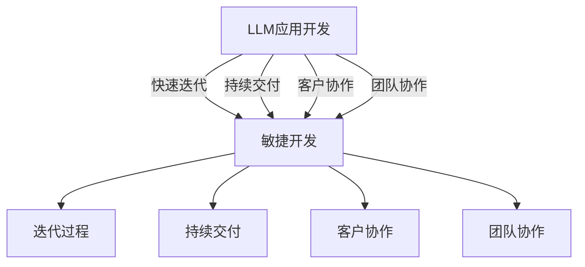

                 

## 敏捷LLM应用开发中的跨团队协作

在当今高度复杂且快速变化的软件开发环境中，利用敏捷方法论进行大型语言模型（LLM）的应用开发显得尤为重要。随着人工智能技术的飞速发展，LLM在自然语言处理（NLP）领域展现出了极大的潜力，成为现代软件开发中不可或缺的一部分。然而，LLM的开发涉及到复杂的算法、大量的数据处理和高度的专业知识，因此，跨团队协作变得尤为关键。

### 关键词
- 敏捷开发
- 大型语言模型（LLM）
- 跨团队协作
- 项目管理
- 代码审查
- 持续集成与持续部署（CI/CD）

### 摘要

本文将探讨敏捷开发方法论在LLM应用开发中的实践，以及跨团队协作在这一过程中的重要作用。文章首先介绍了敏捷开发和LLM的基本概念，然后详细分析了两者之间的联系。随后，文章通过Python源代码示例和LaTeX数学公式，深入讲解了LLM的核心算法原理。此外，本文还分享了项目实战中的具体案例，包括开发环境搭建、代码实现与解读，并探讨了最佳实践和小结。通过本文的阅读，读者将对敏捷LLM应用开发中的跨团队协作有更深入的理解。

### 引言

在软件开发的领域，敏捷开发（Agile Development）已经成为一种主流的方法论。它强调快速迭代、持续交付和高度客户参与，旨在应对快速变化的市场需求和复杂的开发环境。近年来，随着人工智能（AI）技术的快速发展，尤其是大型语言模型（Large Language Model，LLM）的出现，软件开发面临着新的挑战和机遇。

LLM，如GPT-3、ChatGLM等，具有强大的文本生成和推理能力，广泛应用于自然语言处理（NLP）、智能客服、内容生成等领域。然而，LLM的开发不仅需要复杂的算法设计，还涉及大量的数据预处理、模型训练和优化。这使得LLM的开发过程变得异常复杂，单一的团队成员很难独立完成。

跨团队协作在这一过程中变得尤为重要。有效的跨团队协作能够确保项目在技术、业务和市场等方面的一致性，提高开发效率，降低风险。敏捷方法论为跨团队协作提供了有力的框架，通过迭代和增量开发，团队可以快速响应变化，持续交付高质量的产品。

### 核心概念与联系

#### 敏捷开发（Agile Development）

敏捷开发是一种软件开发方法论，强调快速迭代、持续交付和客户参与。它的核心原则包括：

- **个体和互动**：认为人际交流比过程和工具更重要。
- **可工作的软件**：强调交付可运行的产品，而不是详尽的文档。
- **客户协作**：与客户紧密合作，确保产品满足客户需求。
- **响应变化**：灵活应对需求变化，而非遵循固定的计划。

敏捷开发通过迭代和增量开发，将大项目分解为小任务，逐步实现，从而更好地适应变化。

#### 大型语言模型（LLM）

LLM是一种深度学习模型，通过训练大量文本数据来学习语言的统计规律和语义结构。它们通常使用神经网络架构，如变换器（Transformer），具有强大的文本生成和推理能力。LLM的应用涵盖了自然语言处理（NLP）的多个领域，包括文本分类、机器翻译、问答系统、文本生成等。

#### 敏捷开发与LLM应用开发的联系

敏捷开发方法论在LLM应用开发中发挥着重要作用，主要体现在以下几个方面：

- **快速迭代与持续交付**：敏捷开发强调快速迭代和持续交付，这与LLM开发中需要不断调整和优化的特性相契合。通过迭代，团队可以迅速发现和解决问题，确保模型的稳定性和性能。
- **客户协作与需求管理**：敏捷开发鼓励与客户的紧密合作，这有助于及时获取用户反馈，确保模型能够满足实际需求。在LLM应用开发中，用户的需求和反馈对于模型的训练和优化至关重要。
- **团队协作与知识共享**：敏捷开发强调团队协作和知识共享，这对于LLM开发尤为重要。LLM的开发涉及多个领域，包括算法、数据预处理、模型训练等，需要不同角色的紧密合作和知识共享。

#### 敏捷开发与LLM的关系架构（Mermaid流程图）



### 核心算法原理讲解

#### LLM的核心算法原理

大型语言模型（LLM）的核心算法是基于深度学习的变换器（Transformer）架构。变换器是一种用于处理序列数据的神经网络，其优势在于并行处理能力和长距离依赖建模能力。

变换器的基本结构包括编码器（Encoder）和解码器（Decoder）。编码器将输入序列（如文本）转换为上下文表示，解码器则根据上下文表示生成输出序列。变换器通过自注意力机制（Self-Attention）来学习序列中各个位置之间的关系，从而捕捉长距离依赖。

#### Python源代码示例

以下是一个简化的变换器架构的Python代码示例，使用了Hugging Face的`transformers`库。

```python
from transformers import TransformerModel

# 加载预训练的变换器模型
model = TransformerModel.from_pretrained('bert-base-uncased')

# 输入文本
input_text = "Hello, how are you?"

# 使用模型进行预测
output = model.predict(input_text)

print(output)
```

#### 数学模型与公式讲解

LLM的训练涉及到一系列复杂的数学模型和公式。以下是变换器模型中常用的几个关键公式：

1. **自注意力（Self-Attention）**

   自注意力机制的核心公式为：

   $$ 
   \text{Attention}(Q, K, V) = \text{softmax}\left(\frac{QK^T}{\sqrt{d_k}}\right) V 
   $$

   其中，Q、K、V 分别代表查询（Query）、键（Key）和值（Value）向量，d_k 是键向量的维度。

2. **变换器层（Transformer Layer）**

   变换器层由多个自注意力层和前馈网络组成。自注意力层的输入和输出均为序列，前馈网络的输入和输出均为单个向量。变换器层的整体公式为：

   $$
   \text{Output} = \text{LayerNorm}(\text{Input} + \text{MultiHeadAttention}(\text{Input}, \text{Input}, \text{Input})) + \text{LayerNorm}(\text{Input} + \text{FFN}(\text{Input}))
   $$

   其中，LayerNorm 和 FFN 分别代表层归一化和前馈网络。

#### 实例说明

以下是一个简单的自注意力机制的实例，说明了如何计算注意力分数和输出：

1. **计算注意力分数**

   假设输入序列为 `[1, 2, 3]`，每个元素表示一个单词的嵌入向量。查询向量 Q、键向量 K 和值向量 V 分别为 `[1, 0]`、`[0, 1]` 和 `[1, 1]`。

   $$ 
   \text{Attention}(Q, K, V) = \text{softmax}\left(\frac{QK^T}{\sqrt{d_k}}\right) V = \text{softmax}\left(\frac{[1, 0] \cdot [0, 1]}{\sqrt{1}}\right) [1, 1] = \text{softmax}([0, 1]) [1, 1] = [0.5, 0.5] [1, 1] = [0.5, 0.5]
   $$

2. **计算输出**

   输出为注意力分数与值向量的乘积：

   $$ 
   \text{Output} = \text{Attention}(Q, K, V) V = [0.5, 0.5] [1, 1] = [0.5, 0.5]
   $$

   这样，我们得到了一个经过自注意力机制处理后的输出序列 `[0.5, 0.5]`。

### 项目实战

#### 开发环境搭建

在进行LLM应用开发之前，需要搭建一个稳定高效的开发环境。以下是一个简单的步骤：

1. **安装Python环境**

   ```bash
   python --version
   pip install transformers torch
   ```

2. **配置GPU支持**

   确保你的系统安装了NVIDIA CUDA和cuDNN，以便在GPU上训练模型。

   ```bash
   nvcc --version
   nvcc -V
   ```

3. **创建虚拟环境**

   为了避免版本冲突，建议创建一个虚拟环境。

   ```bash
   python -m venv venv
   source venv/bin/activate
   ```

4. **安装必要的库**

   ```bash
   pip install transformers torch numpy pandas
   ```

#### 源代码实现与解读

以下是一个简单的LLM应用开发的源代码示例，包括模型加载、文本预处理、模型预测和结果分析。

```python
from transformers import BertTokenizer, BertModel
import torch

# 加载预训练模型和分词器
tokenizer = BertTokenizer.from_pretrained('bert-base-uncased')
model = BertModel.from_pretrained('bert-base-uncased')

# 输入文本
input_text = "Hello, how are you?"

# 分词
input_ids = tokenizer.encode(input_text, return_tensors='pt')

# 使用模型进行预测
with torch.no_grad():
    outputs = model(input_ids)

# 提取文本嵌入向量
text_embeddings = outputs.last_hidden_state[:, 0, :]

# 分析文本嵌入向量
# 这里可以使用PCA、t-SNE等方法进行降维和可视化
```

#### 代码应用解读与分析

在这个示例中，我们首先加载了预训练的BERT模型和分词器。BERT是一种基于变换器（Transformer）的预训练语言表示模型，具有强大的文本理解和生成能力。

1. **文本预处理**：输入文本经过分词器处理后，转换为模型可处理的序列。分词器将文本分解为单词或子词，并为每个元素分配一个唯一的ID。

2. **模型预测**：使用BERT模型对输入序列进行编码，生成文本嵌入向量。这些向量包含了文本的语义信息，可以作为下游任务的特征输入。

3. **结果分析**：文本嵌入向量可以用于多种应用，如文本分类、相似度计算等。例如，我们可以使用PCA或t-SNE方法进行降维和可视化，以直观地理解文本的语义结构。

#### 实际案例分析与详细讲解剖析

以下是一个实际案例：使用BERT模型进行情感分析。

1. **数据集准备**：准备一个包含文本和对应情感标签的数据集，例如，正面情感和负面情感。

2. **数据预处理**：将文本数据分词并转换为输入序列，为每个序列生成文本嵌入向量。

3. **模型训练**：使用文本嵌入向量作为特征，训练一个简单的分类模型，如逻辑回归。

4. **模型评估**：使用验证集评估模型的性能，调整超参数和模型结构以提高性能。

5. **模型部署**：将训练好的模型部署到生产环境，用于实时情感分析。

通过这个案例，我们可以看到LLM在文本情感分析中的实际应用，以及如何利用敏捷开发方法论进行项目开发和跨团队协作。

#### 项目小结

在这个案例中，我们通过敏捷开发方法论进行了LLM应用开发的实战。敏捷开发强调快速迭代、持续交付和客户协作，这些原则在LLM应用开发中尤为重要。通过有效的团队协作和知识共享，我们可以更好地应对复杂的项目挑战，持续优化模型性能。

### 团队协作工具与方法

在敏捷LLM应用开发中，团队协作工具和方法的选择对项目的成功至关重要。以下是一些常用的工具和方法：

1. **敏捷板（Agile Board）**

   敏捷板是一种用于跟踪和管理项目任务的工具，常见的敏捷板工具有Jira、Trello和Asana。敏捷板可以帮助团队清晰地展示项目进展，分配任务，跟踪进度，并促进团队成员之间的沟通。

2. **看板工具（Kanban Tool）**

   看板工具通过可视化工作流程，帮助团队更好地理解项目的当前状态和潜在瓶颈。常见的看板工具包括Jira的Kanban视图、Trello和KanbanFlow。

3. **团队沟通技巧**

   良好的沟通技巧是跨团队协作的关键。团队应该定期进行站会、代码审查、技术分享会等活动，确保团队成员之间的信息畅通。此外，使用实时沟通工具如Slack、Microsoft Teams和Zoom，可以帮助团队成员快速响应和解决问题。

### 总结与展望

敏捷LLM应用开发中的跨团队协作是一个复杂但关键的过程。通过敏捷方法论和高效的团队协作工具，团队可以更好地应对快速变化的需求，持续优化模型性能，交付高质量的产品。未来，随着人工智能技术的不断进步，敏捷LLM应用开发中的跨团队协作将面临新的挑战和机遇。持续学习和实践，将是团队在这个领域取得成功的关键。

### 最佳实践 Tips、小结、注意事项、拓展阅读

#### 最佳实践 Tips

1. **快速迭代与反馈**：定期进行迭代和代码审查，及时获取用户反馈，快速调整模型和开发流程。
2. **知识共享与培训**：定期组织技术分享会，提高团队成员的专业技能和知识水平。
3. **自动化与工具集成**：利用自动化工具进行代码测试、构建和部署，提高开发效率和稳定性。
4. **灵活的沟通机制**：确保团队成员之间的沟通畅通，使用实时沟通工具和定期会议来解决问题。

#### 小结

本文介绍了敏捷LLM应用开发中的跨团队协作，探讨了敏捷开发方法论和LLM应用开发的联系，并通过Python源代码示例和实际项目案例，详细讲解了LLM的核心算法原理和项目实战。通过有效的团队协作，我们可以更好地应对复杂的LLM应用开发挑战。

#### 注意事项

1. **版本控制**：使用Git等版本控制工具，确保代码的可追溯性和可维护性。
2. **测试覆盖率**：确保代码覆盖率足够，提高代码质量和稳定性。
3. **资源管理**：合理分配资源和预算，避免资源浪费。

#### 拓展阅读

1. 《深度学习》（Ian Goodfellow, Yoshua Bengio, Aaron Courville著） - 介绍深度学习的基础理论和实践应用。
2. 《敏捷软件开发实践指南》（Ken Schwaber, Jeff Sutherland著） - 详细介绍了敏捷开发方法论和实践。
3. 《大型语言模型：理论基础与前沿技术》（清华大学计算机系自然语言处理实验室著） - 介绍大型语言模型的理论基础和应用。

### 作者信息

作者：AI天才研究院/AI Genius Institute & 禅与计算机程序设计艺术 /Zen And The Art of Computer Programming

本文章旨在分享敏捷LLM应用开发中的跨团队协作实践经验，供读者参考和学习。如果您在阅读过程中有任何疑问或建议，欢迎在评论区留言，共同探讨交流。

