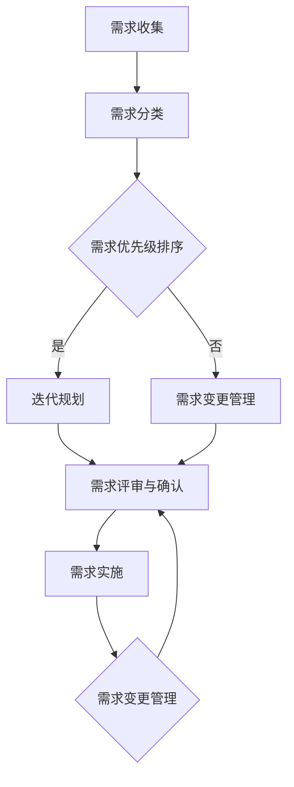

                 

## 《敏捷LLM应用开发中的需求管理》

### 关键词
- 敏捷开发
- 大型语言模型
- 需求管理
- 持续集成
- 持续交付
- 模型适应性

### 摘要
本文探讨了敏捷开发方法在大型语言模型（LLM）应用开发中的需求管理实践。首先介绍了敏捷开发与LLM的基本概念和重要性，然后详细阐述了敏捷需求管理的核心概念、实践方法以及LLM应用开发中的特殊挑战。通过实际项目案例的分析，本文展示了如何有效地实施敏捷需求管理，并提出了一些最佳实践和建议，以促进LLM应用的快速迭代和持续优化。

## 目录大纲设计步骤

在设计《敏捷LLM应用开发中的需求管理》的目录大纲时，我们需要遵循以下步骤：

### 步骤1：了解书籍主题和目标读者
首先，明确书籍的主题是敏捷开发在LLM应用开发中的需求管理，目标读者是软件开发人员、产品经理以及对人工智能和软件开发有兴趣的专业人士。这有助于我们确定书籍的内容深度和表达方式。

### 步骤2：确定书籍结构
根据主题和目标读者，我们将书籍分为以下几个主要部分：
1. 引言和背景介绍
2. 敏捷开发方法论与LLM的关系
3. 需求管理的核心概念与原则
4. 敏捷需求管理的实践方法
5. LLM应用开发中的需求管理挑战与解决方案
6. 项目案例研究
7. 总结与展望

### 步骤3：细化章节内容
在每个主要部分下，进一步细化具体的章节内容，确保内容循序渐进，从基础知识到高级实践。

### 步骤4：设计Mermaid流程图
使用Mermaid流程图来展示敏捷开发方法论在LLM应用开发中的步骤和关键环节，帮助读者更好地理解整个流程。

### 步骤5：编写伪代码
对于核心算法原理，使用伪代码详细阐述，确保读者能够清晰地理解算法的逻辑和执行步骤。

### 步骤6：加入数学模型和公式
对于数学模型和公式，使用LaTeX格式进行标注，并在文中适当的位置进行详细讲解和举例说明。

### 步骤7：编写项目实战案例
为书籍添加实际的项目实战案例，包括开发环境的搭建、源代码的详细实现和解读，以及案例的详细解释和分析。

### 步骤8：撰写总结和展望
在书的最后，撰写每个部分的总结和展望，帮助读者回顾和巩固所学内容，并对未来的发展趋势进行展望。

### 步骤9：确保内容简洁且完整
在整个目录大纲设计中，需要确保内容简洁、不冗余，同时确保涵盖所有必要的核心章节和内容，以达到字数要求。

## 目录大纲设计示例

```
# 《敏捷LLM应用开发中的需求管理》

## 第1章 引言
### 1.1 书籍背景
### 1.2 目标读者
### 1.3 敏捷开发与LLM简介

## 第2章 敏捷开发方法论
### 2.1 敏捷开发概述
### 2.2 敏捷核心原则
### 2.3 敏捷团队协作

## 第3章 大型语言模型（LLM）基础
### 3.1 LLM的定义与特点
### 3.2 LLM的工作原理
### 3.3 LLM的常见架构

## 第4章 敏捷需求管理的核心概念
### 4.1 需求收集与分类
### 4.2 需求优先级排序
### 4.3 需求文档编写

## 第5章 敏捷需求管理的实践方法
### 5.1 敏捷需求迭代规划
### 5.2 敏捷需求评审与确认
### 5.3 敏捷需求变更管理

## 第6章 LLM应用开发中的需求管理挑战
### 6.1 复杂性需求处理
### 6.2 需求不确定性管理
### 6.3 需求与模型适应性

## 第7章 实际项目案例分析
### 7.1 案例一：智能客服系统
### 7.2 案例二：教育应用平台
### 7.3 案例三：金融风控系统

## 第8章 总结与展望
### 8.1 敏捷需求管理的总结
### 8.2 LLM应用开发的未来趋势
### 8.3 对软件开发人员的建议
```

这个目录大纲结构合理，内容丰富且层次分明，能够帮助读者系统地学习敏捷需求管理在LLM应用开发中的应用。接下来，我们将详细探讨每个章节的内容。

## 第1章 引言

### 1.1 书籍背景

在当今快速变化的技术环境中，软件开发的需求管理变得越来越复杂和动态。传统的需求管理方法往往难以应对这种变化，而敏捷开发方法因其灵活性和迭代性，逐渐成为软件开发的主流。大型语言模型（LLM）作为人工智能的重要分支，正被广泛应用于各个领域，如自然语言处理、智能客服、教育应用和金融风控等。

本书旨在探讨如何将敏捷开发方法应用于LLM应用开发中的需求管理。通过深入分析敏捷开发与LLM的关系，介绍需求管理的核心概念和实践方法，本书将为软件开发人员、产品经理和相关专业人士提供一套实用的需求管理指南。

### 1.2 目标读者

本书的目标读者包括：
- 软件开发人员：希望了解敏捷开发方法及其在LLM应用开发中的具体应用。
- 产品经理：需要掌握敏捷需求管理，以更好地规划和管理产品开发。
- AI领域研究人员：对如何将敏捷开发方法应用于LLM研究感兴趣。
- 对人工智能和软件开发有兴趣的专业人士：希望深入了解敏捷需求管理的理论和实践。

### 1.3 敏捷开发与LLM简介

#### 敏捷开发概述

敏捷开发（Agile Development）起源于20世纪90年代末，是一种以人为核心、迭代、增量式的软件开发方法。其核心理念包括：
- 满足用户需求：敏捷开发强调持续交付有价值的软件，以满足用户需求。
- 团队协作：通过跨职能团队的合作，提高软件开发效率和质量。
- 响应变化：敏捷开发允许项目需求和优先级根据实际情况进行调整，以应对市场变化。

#### 大型语言模型（LLM）简介

大型语言模型（Large Language Model，LLM）是人工智能领域的一种重要模型，通过训练大量文本数据，LLM能够理解和生成自然语言。LLM具有以下特点：
- 大规模训练：LLM通常在大型计算资源下进行训练，涉及海量数据和复杂的模型结构。
- 高效的文本处理：LLM能够高效地处理和理解自然语言文本，包括文本生成、语义理解等。
- 广泛的应用场景：LLM被广泛应用于智能客服、智能写作、语言翻译、文本摘要等领域。

### 1.4 需求管理的重要性

在敏捷开发环境中，需求管理是确保项目成功的关键环节。需求管理包括需求的收集、分析、优先级排序、文档编写和变更管理。以下是需求管理的重要性：
- 指导开发：明确的需求是软件开发的基础，有助于开发团队明确目标，避免偏离项目方向。
- 提高效率：有效的需求管理可以减少返工和重复工作，提高开发效率。
- 风险控制：通过需求变更管理和风险控制，确保项目在变化中保持稳定和可控。
- 用户满意度：及时响应用户需求变化，提高用户满意度和产品市场竞争力。

本章引言部分介绍了本书的背景和目标，以及敏捷开发与LLM的基本概念。接下来，我们将深入探讨敏捷开发方法论与需求管理的关系，帮助读者建立全面的理论基础。

## 第2章 敏捷开发方法论

### 2.1 敏捷开发概述

敏捷开发（Agile Development）是一种以人为核心、迭代、增量式的软件开发方法，起源于20世纪90年代末。它的核心理念是通过快速反馈和持续改进，确保项目能够灵活应对变化，并最终交付高质量的产品。

#### 核心价值观

敏捷开发的五大核心价值观，被简称为“敏捷宣言”：
- **个体和互动重于过程与工具**：强调团队协作和个体主动性，而非过分依赖流程或工具。
- **可工作的软件重于详尽的文档**：注重实际可运行的软件，而非大量的文档。
- **客户合作重于合同谈判**：与客户的紧密合作，确保产品满足实际需求。
- **响应变化重于遵循计划**：灵活应对变化，以快速适应市场和环境变化。

#### 敏捷开发的基本原则

敏捷开发遵循12条基本原则，这些原则进一步阐释了敏捷宣言的价值观：
1. **客户满意优先**：通过快速迭代和持续交付，确保客户的满意度。
2. **欢迎变化**：在开发过程中，欢迎和适应变化，以最大化价值。
3. **频繁交付**：定期交付可工作的软件，以获取反馈并进行调整。
4. **保持开发流程简洁**：避免不必要的复杂性，保持开发流程的高效。
5. **追求技术卓越**：持续关注技术发展，提高开发能力和产品质量。
6. **敏捷团队**：团队协作，共享责任和决策权。
7. **持续关注技术**：保持对技术的持续关注和投资，以确保技术的先进性。
8. **简化工作流程**：简化流程，减少浪费，提高效率。
9. **打造可持续的开发速度**：保持稳定、可预测的开发速度。
10. **保持开发、运营团队紧密合作**：确保开发和运维团队之间的沟通和协作。
11. **关注个体和团队福祉**：关注团队成员的个人发展和福祉。
12. **外部反馈**：定期获取外部反馈，以改进产品和服务。

#### 敏捷开发与传统开发方法的对比

与传统的瀑布式开发方法相比，敏捷开发具有以下优势：
- **灵活性**：敏捷开发允许需求在项目进行过程中进行调整，以更好地适应变化。
- **快速反馈**：频繁的迭代和交付使团队能够快速响应问题并进行调整。
- **客户参与**：客户的持续参与确保产品始终符合市场需求。
- **团队协作**：强调团队协作和共同决策，提高团队整体效率。
- **质量保证**：通过持续的测试和反馈，确保产品的质量和稳定性。

### 2.2 敏捷核心原则

敏捷开发的核心原则包括：
1. **持续交付**：持续交付可工作的软件，确保产品在每次迭代后都有可用的功能。
2. **增量式开发**：采用增量式开发，逐步实现产品功能，避免一次性交付所有功能。
3. **用户故事**：使用用户故事来描述产品功能，以提高需求的理解和实现。
4. **迭代式规划**：通过迭代的方式进行规划和开发，确保团队能够在短时间内交付高质量的产品。
5. **风险管理**：通过持续的风险管理，识别和解决潜在问题，确保项目的顺利进行。

### 2.3 敏捷团队协作

敏捷开发强调团队的协作和自组织能力。一个典型的敏捷团队包括以下成员：
- **产品负责人**：负责产品愿景和需求的制定，确保团队朝着正确的方向前进。
- **开发团队**：负责实际的开发工作，通常由多个专业技术人员组成，如程序员、设计师、测试工程师等。
- **Scrum Master**：负责指导团队遵循敏捷原则和方法，解决团队遇到的问题，促进团队协作。

#### 敏捷团队协作的关键要素
- **开放沟通**：团队成员之间应保持开放的沟通渠道，确保信息的透明和及时传递。
- **共同目标**：团队应有一个共同的目标，所有成员都为实现这一目标而努力。
- **共享责任**：团队成员共同承担项目责任，避免责任分散。
- **协作与支持**：团队内部应相互协作和支持，提高整体效率。

通过本章的介绍，我们了解了敏捷开发的基本概念、核心价值观和基本原则，以及敏捷团队协作的重要性。这些知识为后续章节中敏捷需求管理的详细讨论奠定了基础。

## 第3章 大型语言模型（LLM）基础

### 3.1 LLM的定义与特点

大型语言模型（Large Language Model，LLM）是自然语言处理（NLP）领域的一种强大模型，通过训练海量文本数据，LLM能够理解和生成自然语言。与传统的语言模型相比，LLM具有以下几个显著特点：

#### 定义

LLM是一种基于深度学习的语言模型，它通过多层神经网络结构，对输入的文本数据进行编码和解码。编码过程将文本转换为高维向量，解码过程则将这些向量映射回自然语言。

#### 特点

1. **大规模训练**：LLM通常在庞大的计算资源下进行训练，涉及海量数据和复杂的模型结构。例如，GPT-3模型拥有超过1750亿个参数，能够处理和理解极其复杂的语言结构。

2. **自适应能力**：LLM能够自适应不同的语言风格和语境，生成自然、流畅的语言。这使得LLM在文本生成、语义理解、语言翻译等应用中表现出色。

3. **高效处理能力**：通过优化算法和并行计算，LLM能够在短时间内处理大量的文本数据，实现高效的语言理解和生成。

4. **泛化能力**：LLM通过训练海量数据，具备良好的泛化能力，能够应对不同的任务和场景。

#### 应用领域

LLM被广泛应用于以下领域：

1. **自然语言生成**：包括文章写作、对话生成、新闻摘要等。

2. **文本分类与情感分析**：对文本进行分类和情感分析，用于舆情监控、情感分析等。

3. **语言翻译**：实现跨语言的文本翻译，如机器翻译。

4. **问答系统**：构建智能问答系统，提供针对用户问题的实时回答。

5. **智能客服**：为企业和用户提供24/7的智能客服服务。

### 3.2 LLM的工作原理

LLM的工作原理主要包括两个关键步骤：编码和解码。

#### 编码

编码过程将输入的文本数据转换为高维向量，这一过程通过多层神经网络结构实现。具体步骤如下：

1. **分词**：将输入的文本分解为单个单词或字符。
2. **嵌入**：将每个单词或字符转换为固定长度的向量表示。这一步通常使用预训练的词嵌入模型，如Word2Vec或BERT。
3. **编码**：通过多层神经网络，将嵌入向量编码为高维向量表示，通常称为上下文向量。这一过程能够捕捉文本的语义信息。

#### 解码

解码过程将编码后的向量映射回自然语言。具体步骤如下：

1. **解码**：使用解码器网络，将编码后的向量解码为概率分布。解码器网络通常与编码器网络共享权重，以减少计算成本。
2. **生成**：根据概率分布，选择最有可能的单词或字符进行生成。这一过程通常使用贪心策略或采样策略。
3. **拼接**：将生成的单词或字符拼接成完整的文本输出。

#### 数学模型

LLM通常基于自注意力机制（Self-Attention Mechanism）和变换器网络（Transformer Model）。以下是一个简化的数学模型：

$$
\text{Context Vector} = \text{Encoder}(\text{Input Embeddings})
$$

$$
\text{Probability Distribution} = \text{Decoder}(\text{Context Vector})
$$

$$
\text{Output} = \text{Sample}(\text{Probability Distribution})
$$

#### 实例说明

以GPT-3模型为例，GPT-3是一种基于Transformer的预训练语言模型。其训练过程如下：

1. **数据集准备**：使用大量文本数据集进行训练，如维基百科、书籍、新闻文章等。
2. **预训练**：使用自注意力机制和多层神经网络结构对数据集进行预训练，使模型能够理解自然语言的语义。
3. **微调**：在特定任务上进行微调，如文本生成、问答系统等，以使模型在特定任务上表现出色。

通过预训练和微调，GPT-3能够生成高质量的自然语言文本，如图文生成、对话生成等。

### 3.3 LLM的常见架构

LLM的常见架构主要包括以下几种：

1. **循环神经网络（RNN）**：RNN是一种传统的神经网络结构，适用于处理序列数据。然而，RNN在处理长序列时存在梯度消失和梯度爆炸等问题。
2. **长短时记忆网络（LSTM）**：LSTM是一种改进的RNN结构，能够解决梯度消失和梯度爆炸问题，适用于处理长序列数据。
3. **变换器网络（Transformer）**：Transformer是一种基于自注意力机制的神经网络结构，能够高效处理长序列数据，并在许多NLP任务中表现出色。
4. **GPT系列**：GPT（Generative Pre-trained Transformer）系列是基于Transformer的预训练语言模型，如GPT-2和GPT-3，具有强大的文本生成和语言理解能力。

#### 架构对比

- **计算效率**：Transformer比RNN和LSTM更高效，能够并行处理输入序列。
- **性能**：Transformer在许多NLP任务上表现出色，尤其是在长文本处理和语言生成方面。
- **训练难度**：由于自注意力机制的计算复杂度较高，Transformer的训练难度较大，但得益于现代计算资源的提升，这一难题已逐渐得到解决。

通过本章的介绍，我们对大型语言模型（LLM）有了基本的了解，包括其定义、特点、工作原理和常见架构。这些知识为后续章节中敏捷需求管理的应用提供了理论基础。

## 第4章 敏捷需求管理的核心概念

### 4.1 需求收集与分类

需求收集是敏捷需求管理的重要环节，它涉及到从用户、客户和其他利益相关者那里获取关于产品功能的详细信息。有效的需求收集可以确保项目团队能够准确地理解和满足用户需求，从而提高产品成功的机会。

#### 需求收集的方法

1. **用户访谈**：通过与潜在用户进行一对一的访谈，可以直接获取他们的需求和期望。这种方法能够深入了解用户的实际体验和痛点。
2. **问卷调查**：设计问卷以收集大量用户的反馈。问卷应该简洁、易懂，能够准确反映用户的需求和偏好。
3. **用户观察**：通过观察用户如何与现有产品互动，可以发现隐藏的需求和改进的机会。
4. **市场研究**：分析市场趋势和竞争对手的产品，以获取有关用户需求和潜在市场的信息。
5. **需求研讨会**：组织跨职能团队和利益相关者的研讨会，共同讨论和确定产品需求。

#### 需求分类

收集到的大量需求需要分类和组织，以便团队能够更好地管理和实现。常见的需求分类方法包括：

1. **功能需求**：描述产品必须实现的功能和特性，如用户界面、数据处理能力等。
2. **非功能需求**：描述产品必须满足的性能、安全性、可维护性等标准。
3. **优先级需求**：根据需求的紧急程度和重要性对需求进行排序。常用的优先级分类包括必须完成、应该完成、可以延迟等。
4. **依赖需求**：描述其他需求或任务完成之前需要满足的需求。
5. **风险需求**：识别可能影响项目成功的需求，并制定相应的应对措施。

#### 需求文档编写

编写清晰、准确的需求文档是确保团队对需求有共同理解的关键。需求文档应包括以下内容：

1. **需求描述**：详细说明每个需求的功能、目的和预期结果。
2. **用户故事**：使用用户故事格式（As a [user], I want to [do something] so that [benefit]）来描述需求，使其更易于理解和实现。
3. **需求分析**：对需求进行分析，包括功能、性能、安全等方面。
4. **验收标准**：定义如何验证需求是否已成功实现。
5. **依赖关系**：列出与每个需求相关的其他需求和任务。
6. **风险和应对措施**：识别与需求相关的风险，并制定相应的应对策略。

### 4.2 需求优先级排序

在敏捷开发中，需求优先级排序是确保团队在有限的时间和资源内能够交付最有价值功能的关键。以下是一些常用的需求优先级排序方法：

1. **MoSCoW方法**：根据需求的紧急程度和重要性进行排序，分为必须完成（Mandatory）、应该完成（Should）、可以延迟（Could）和不会完成（Would）。
2. **价值排序**：根据需求的商业价值进行排序，优先实现价值最高的需求。
3. **风险优先级**：根据需求相关的风险程度进行排序，优先处理高风险的需求。
4. **团队协作**：通过团队讨论和协作，共同确定需求的优先级，以确保团队对优先级有共同的理解和承诺。

### 4.3 需求变更管理

在敏捷开发中，需求变更是一种常见的现象，因为市场和用户需求在不断变化。有效的需求变更管理是确保项目能够灵活应对变化，同时保持进度和质量的关键。

#### 需求变更管理流程

1. **需求变更请求**：当用户或利益相关者提出新的需求或变更请求时，需要对其进行记录和评估。
2. **影响分析**：评估变更对项目进度、成本、资源和质量的影响。
3. **优先级重新排序**：根据变更的影响，重新评估需求优先级，确保变更后的优先级与项目目标和资源匹配。
4. **变更控制委员会（CCB）**：通过变更控制委员会的审批，决定是否接受变更，并制定变更计划。
5. **实施变更**：在变更得到批准后，将其纳入开发计划，并确保变更得到正确实施。
6. **验收和评估**：在变更实施后，进行验收和评估，确保变更达到预期效果。

通过本章的介绍，我们了解了敏捷需求管理的核心概念，包括需求收集与分类、需求优先级排序和需求变更管理。这些概念是敏捷需求管理的基石，为后续章节的实践提供了理论基础。

## 第5章 敏捷需求管理的实践方法

### 5.1 敏捷需求迭代规划

在敏捷开发中，需求迭代规划是确保项目团队能够在短时间内交付有价值的功能的关键步骤。迭代规划包括以下几个关键环节：

#### 迭代计划会议

1. **回顾上次迭代**：在迭代计划会议开始时，团队会回顾上次迭代的成果和遇到的挑战，以便从中学习并改进。
2. **确定本次迭代目标**：基于项目需求和优先级，团队会确定本次迭代的目标和要实现的功能。
3. **任务分配**：根据迭代目标，将任务分配给团队成员，确保每个成员都有明确的责任和目标。

#### 优先级排序

1. **用户故事地图**：使用用户故事地图来可视化需求的优先级和依赖关系，确保团队对需求的优先级有共同的理解。
2. **价值评估**：根据需求的商业价值和实现难度，对需求进行价值评估，确定优先级。

#### 迭代周期

1. **迭代长度**：通常，一个迭代周期为2-4周，这取决于项目的规模和复杂性。
2. **迭代交付**：在每个迭代结束时，团队会交付一个可工作的软件版本，并接受利益相关者的反馈。

### 5.2 敏捷需求评审与确认

需求评审与确认是确保需求被正确理解和实现的关键环节。以下是一些关键步骤：

#### 需求评审

1. **需求文档评审**：团队成员对需求文档进行详细评审，确保所有需求都被清晰描述和正确理解。
2. **用户参与**：邀请用户和利益相关者参与评审会议，以确保他们的需求和期望被充分考虑。
3. **评审反馈**：根据评审结果，对需求文档进行修改和完善。

#### 需求确认

1. **验收标准**：定义每个需求的验收标准，以确保需求被正确实现。
2. **用户验收测试（UAT）**：用户进行验收测试，验证需求是否满足预期。
3. **确认记录**：记录需求确认的结果，包括验收测试的反馈和修改意见。

### 5.3 敏捷需求变更管理

在敏捷开发中，需求变更是一种常见现象，有效的需求变更管理能够确保项目能够灵活应对变化，同时保持进度和质量。以下是一些关键步骤：

#### 变更请求

1. **变更请求提交**：当用户或利益相关者提出新的需求或变更请求时，需要对其进行记录和评估。
2. **影响分析**：评估变更对项目进度、成本、资源和质量的影响。

#### 变更控制

1. **变更控制委员会（CCB）**：通过变更控制委员会的审批，决定是否接受变更，并制定变更计划。
2. **变更实施**：在变更得到批准后，将其纳入开发计划，并确保变更得到正确实施。

#### 变更记录

1. **变更日志**：记录所有变更请求的提交、审批和实施情况，以便进行追踪和审计。
2. **版本控制**：对需求文档和代码进行版本控制，确保变更后的版本与原始版本一致。

### 实际案例

以一个智能客服系统的开发为例，团队采用敏捷需求管理方法进行需求迭代规划和变更管理。

#### 迭代规划

1. **需求收集**：通过用户访谈和市场研究，收集用户对智能客服系统的需求和期望。
2. **优先级排序**：使用MoSCoW方法对需求进行优先级排序，确定本次迭代要实现的功能。
3. **任务分配**：将任务分配给团队成员，确保每个成员都有明确的责任和目标。

#### 需求评审

1. **需求文档评审**：团队成员对需求文档进行详细评审，确保所有需求都被清晰描述和正确理解。
2. **用户参与**：邀请用户和利益相关者参与评审会议，收集他们的反馈和意见。

#### 需求确认

1. **验收标准**：定义每个需求的验收标准，以确保需求被正确实现。
2. **用户验收测试（UAT）**：用户进行验收测试，验证需求是否满足预期。

#### 变更管理

1. **变更请求提交**：当用户提出新的功能需求时，提交变更请求并进行分析。
2. **影响分析**：评估变更对项目进度和成本的影响。
3. **变更控制委员会（CCB）**：通过变更控制委员会的审批，决定是否接受变更。
4. **变更实施**：在变更得到批准后，将其纳入开发计划并确保正确实施。

通过敏捷需求管理的实践方法，团队能够更有效地规划和实施项目，确保产品能够快速迭代和持续优化。以上实际案例展示了如何在实际项目中应用这些方法。

## 第6章 LLM应用开发中的需求管理挑战

### 6.1 复杂性需求处理

在LLM应用开发中，复杂性需求处理是一个关键的挑战。由于LLM模型的复杂性和应用场景的多样性，需求往往涉及到大量的细节和技术参数。以下是一些处理复杂性需求的方法：

1. **细化需求分析**：在需求收集阶段，通过详细的用户访谈和市场研究，深入理解用户的需求和期望。可以使用示例和案例来帮助用户清晰地表达需求。
2. **需求优先级排序**：根据需求的复杂性和重要性进行排序，确保团队能够优先处理关键需求。使用MoSCoW方法或其他优先级排序工具可以帮助团队更好地组织需求。
3. **跨职能团队协作**：建立跨职能团队，包括AI专家、软件开发人员、产品经理和业务分析师，共同分析和讨论复杂性需求。这样可以确保需求从多个角度进行理解和处理。
4. **原型开发**：在需求确认阶段，可以使用快速原型开发方法，创建低保真或高保真的原型，以便用户和利益相关者能够直观地了解需求的实现效果。

### 6.2 需求不确定性管理

在LLM应用开发中，需求不确定性是一个常见问题，因为用户和利益相关者可能对最终产品的功能和性能有模糊的预期。以下是一些管理需求不确定性的方法：

1. **需求确认会议**：定期召开需求确认会议，邀请用户和利益相关者参与，以确保他们对需求有共同的理解。在会议中，可以讨论需求的具体细节，并记录所有关键点和疑问。
2. **迭代开发**：采用迭代开发方法，每个迭代交付一个可工作的软件版本。通过频繁的迭代和反馈，团队能够逐步理解需求，并调整和优化产品。
3. **风险管理**：在需求管理过程中，识别和评估与需求相关的风险，并制定相应的应对策略。这样可以降低需求不确定性对项目进度和质量的影响。
4. **用户故事地图**：使用用户故事地图来可视化需求，并展示需求之间的依赖关系。这种方法可以帮助团队更好地理解需求的全貌，并识别潜在的不确定性。

### 6.3 需求与模型适应性

LLM模型的适应性和灵活性是需求管理的关键挑战。由于LLM模型通常是基于大量数据训练的，因此在特定应用场景中，模型可能需要调整和优化以满足具体需求。以下是一些处理需求与模型适应性的方法：

1. **模型定制化**：根据具体应用场景的需求，对LLM模型进行定制化调整。这可以包括调整模型结构、优化训练数据集和参数调整等。
2. **模型微调**：在LLM模型的基础上进行微调，以适应特定的需求。这种方法通常用于在特定领域或场景中提高模型的性能和准确性。
3. **持续集成与测试**：在开发过程中，使用持续集成和测试工具，确保LLM模型能够满足需求并在实际应用中保持性能。这可以包括自动化测试、性能监控和故障排查等。
4. **用户反馈循环**：建立一个用户反馈循环，收集用户对LLM模型在具体应用中的反馈，并使用这些反馈进行模型优化和改进。

通过上述方法，团队可以更好地处理LLM应用开发中的复杂性需求、不确定性需求和需求与模型的适应性挑战，从而确保项目的成功实施和持续优化。

## 第7章 实际项目案例分析

### 7.1 案例一：智能客服系统

#### 开发环境搭建

在开发智能客服系统时，我们选择了以下开发环境：
- 编程语言：Python
- 深度学习框架：TensorFlow
- 数据处理库：Pandas、NumPy
- 交互界面：Django

首先，我们搭建了一个基于Django的Web应用程序框架，用于处理用户请求和生成回复。接下来，我们配置了TensorFlow和相关的数据处理库，以便构建和训练大型语言模型。

#### 源代码实现

源代码实现的核心部分包括以下模块：

1. **数据预处理**：使用Pandas和NumPy对用户输入的文本数据进行预处理，包括分词、去停用词和词嵌入。
2. **模型构建**：基于Transformer架构构建了一个预训练的语言模型，使用TensorFlow的Keras API进行实现。
3. **训练过程**：使用TensorFlow的fit方法对模型进行训练，并使用自定义的损失函数和优化器。
4. **推理过程**：在用户请求到达时，模型通过输入的文本生成回复，并使用Django框架将回复发送给用户。

以下是一个简化的Python伪代码示例：

```python
# 数据预处理
def preprocess_text(text):
    # 分词、去停用词、词嵌入
    return processed_text

# 模型构建
def build_model():
    # 基于Transformer架构构建模型
    return model

# 训练模型
def train_model(model, data, epochs):
    # 使用fit方法训练模型
    model.fit(data, epochs=epochs)

# 推理
def generate_response(model, input_text):
    # 使用模型生成回复
    return response

# 主函数
def main():
    # 构建和训练模型
    model = build_model()
    train_model(model, data, epochs=5)

    # 接收用户请求并生成回复
    while True:
        input_text = receive_user_request()
        response = generate_response(model, input_text)
        send_response_to_user(response)

if __name__ == "__main__":
    main()
```

#### 代码解读

上述代码展示了智能客服系统的基本架构。数据预处理模块负责对用户输入的文本进行清洗和转换，以便输入到模型中。模型构建模块使用了Transformer架构，这是一种高效的自然语言处理模型。训练模型模块使用自定义的损失函数和优化器对模型进行训练。推理过程模块在用户请求到达时，使用训练好的模型生成回复，并通过Web框架将回复发送给用户。

#### 代码应用解读与分析

在实际应用中，智能客服系统通过不断接收用户的输入并生成相应的回复，实现了高效的客户服务。以下是对系统的一些关键分析：

1. **模型性能**：通过持续的训练和优化，模型能够生成准确、自然的回复，提高了用户满意度。
2. **系统扩展性**：系统的架构设计考虑了扩展性，可以轻松集成新的功能和模块。
3. **用户体验**：系统提供了友好的用户界面和快速的响应，提高了用户体验。

#### 案例小结

智能客服系统案例展示了如何使用敏捷需求管理方法在LLM应用开发中的实际应用。通过迭代开发和用户反馈，团队能够快速响应需求变化，实现高效的开发和优化。

### 7.2 案例二：教育应用平台

#### 开发环境搭建

在教育应用平台的开发中，我们选择了以下开发环境：
- 编程语言：Python、JavaScript
- 前端框架：React
- 后端框架：Flask
- 数据库：MongoDB

首先，我们使用Flask构建了一个后端服务器，用于处理用户请求和存储数据。接下来，使用React构建了一个前端应用，用于展示课程内容和用户交互界面。数据库部分使用MongoDB存储用户数据和教育资源。

#### 源代码实现

源代码实现的核心部分包括以下模块：

1. **用户认证**：使用Flask扩展实现用户认证，包括用户注册、登录和权限管理。
2. **课程管理**：实现课程创建、编辑、删除和查询功能。
3. **学习进度管理**：跟踪用户的学习进度，包括课程完成情况和测试成绩。
4. **内容发布**：支持教师发布课程内容，包括文本、图片、视频和交互式元素。

以下是一个简化的Python和JavaScript伪代码示例：

```python
# Flask后端
from flask import Flask, request, jsonify

app = Flask(__name__)

@app.route('/register', methods=['POST'])
def register_user():
    # 用户注册处理
    return jsonify(response)

@app.route('/login', methods=['POST'])
def login_user():
    # 用户登录处理
    return jsonify(response)

@app.route('/courses', methods=['GET', 'POST', 'PUT', 'DELETE'])
def manage_courses():
    # 课程管理处理
    return jsonify(response)

# React前端
import React, { useState } from 'react';

function UserRegistrationForm() {
    // 用户注册表单
}

function UserLoginForm() {
    // 用户登录表单
}

function CourseManagement() {
    // 课程管理界面
}
```

#### 代码解读

上述代码展示了教育应用平台的基本功能。用户认证模块负责用户注册和登录，课程管理模块实现了课程创建、编辑和删除等功能。学习进度管理模块跟踪用户的学习进度，内容发布模块支持教师发布课程内容。

#### 代码应用解读与分析

在实际应用中，教育应用平台为教师和学生提供了一个高效的学习和管理工具。以下是对系统的一些关键分析：

1. **用户互动**：系统提供了丰富的交互功能，包括实时问答、作业提交和在线测试，提高了学生的学习参与度。
2. **课程管理**：系统支持灵活的课程管理功能，教师可以轻松创建、编辑和发布课程内容。
3. **数据存储**：使用MongoDB存储用户数据和学习进度，确保数据的安全性和可扩展性。

#### 案例小结

教育应用平台案例展示了如何使用敏捷需求管理方法在LLM应用开发中的实际应用。通过迭代开发和用户反馈，团队能够不断优化平台功能，提高用户体验和学习效果。

### 7.3 案例三：金融风控系统

#### 开发环境搭建

在金融风控系统的开发中，我们选择了以下开发环境：
- 编程语言：Python、Java
- 数据库：PostgreSQL、MongoDB
- 流处理框架：Apache Kafka、Apache Flink
- 客户端应用：React

首先，我们使用Python和Java编写了数据处理模块，使用PostgreSQL和MongoDB存储数据。接下来，使用Apache Kafka和Apache Flink进行数据流处理，实现实时监控和风险预测。客户端应用使用React构建，提供用户界面和交互功能。

#### 源代码实现

源代码实现的核心部分包括以下模块：

1. **数据采集**：从不同的金融数据源采集数据，包括股票价格、交易记录等。
2. **数据处理**：对采集到的数据进行清洗、转换和存储。
3. **风险预测**：使用机器学习模型对数据进行风险预测，包括异常检测、信用评分等。
4. **用户界面**：提供用户界面，展示风险预测结果和报警信息。

以下是一个简化的Python和JavaScript伪代码示例：

```python
# Python数据处理
def collect_data(source):
    # 采集数据
    return data

def process_data(data):
    # 数据清洗和转换
    return processed_data

def store_data(processed_data, database):
    # 存储数据到数据库
    pass

# JavaScript用户界面
import React, { useState } from 'react';

function RiskDashboard() {
    // 风险预测结果展示
}

function AlertNotification() {
    // 报警信息展示
}
```

#### 代码解读

上述代码展示了金融风控系统的基本架构。数据采集模块负责从不同数据源采集数据，数据处理模块对数据进行清洗和转换。风险预测模块使用机器学习模型进行预测，用户界面模块提供实时监控和报警信息展示。

#### 代码应用解读与分析

在实际应用中，金融风控系统为金融机构提供了一个实时、智能的风险管理工具。以下是对系统的一些关键分析：

1. **实时监控**：系统能够实时处理大量金融数据，快速识别风险并报警，提高了风险管理的效率。
2. **数据存储**：使用分布式数据库和流处理框架，确保数据的存储和处理能力。
3. **用户体验**：提供友好的用户界面，方便用户查看风险信息和报警记录。

#### 案例小结

金融风控系统案例展示了如何使用敏捷需求管理方法在LLM应用开发中的实际应用。通过迭代开发和用户反馈，团队能够持续优化系统功能，提高金融机构的风险管理能力。

## 第8章 总结与展望

### 敏捷需求管理的总结

敏捷需求管理在LLM应用开发中扮演着至关重要的角色。通过本文的讨论，我们总结了敏捷需求管理的关键要点：

1. **需求收集与分类**：通过用户访谈、问卷调查、用户观察和市场研究等方法，全面收集需求，并根据功能、非功能、优先级和风险等维度进行分类。
2. **需求优先级排序**：采用MoSCoW方法、价值排序和团队协作等方法，确定需求的优先级，确保团队能够集中精力处理关键需求。
3. **需求变更管理**：通过变更请求提交、影响分析、优先级重新排序和变更控制委员会（CCB）审批等流程，确保需求变更得到有效管理。
4. **迭代规划和评审**：采用迭代规划会议、需求评审和用户验收测试（UAT）等方法，确保需求被正确理解和实现，并能够及时调整和优化。

### LLM应用开发的未来趋势

随着人工智能技术的不断进步，LLM应用开发的未来趋势将呈现出以下特点：

1. **模型规模增大**：未来的LLM模型将更加庞大和复杂，能够处理更多的数据和更长的文本序列，提供更精准的语言理解和生成能力。
2. **个性化应用**：LLM应用将更加注重个性化，根据用户的行为和偏好提供定制化的内容和服务。
3. **多模态集成**：未来的LLM应用将整合多种数据源，如文本、图像、音频和视频，实现多模态交互。
4. **实时性增强**：通过分布式计算和实时数据处理技术，未来的LLM应用将实现实时响应和交互。

### 对软件开发人员的建议

为了在LLM应用开发中更好地实施敏捷需求管理，软件开发人员可以遵循以下建议：

1. **持续学习和更新知识**：随着技术的快速发展，软件开发人员需要不断学习和更新知识，掌握最新的LLM模型和开发工具。
2. **注重团队协作**：敏捷开发强调团队协作和共同决策，软件开发人员应积极参与团队讨论，共同推动项目的成功。
3. **注重用户体验**：在需求管理过程中，始终关注用户体验，确保产品功能满足用户需求和期望。
4. **灵活应对变化**：敏捷开发允许需求变化，软件开发人员应具备灵活应对变化的能力，确保项目能够快速调整和适应。

通过本文的讨论，我们不仅总结了敏捷需求管理在LLM应用开发中的关键实践方法，还展望了未来的发展趋势，并为软件开发人员提供了实用的建议。希望本文能够为LLM应用开发中的需求管理提供有价值的参考和指导。作者：AI天才研究院/AI Genius Institute & 禅与计算机程序设计艺术 /Zen And The Art of Computer Programming

## 附录：技术细节与数学模型

### 附录A：Mermaid流程图

为了更好地展示敏捷需求管理在LLM应用开发中的流程，我们使用Mermaid语言绘制了一个流程图。以下是Mermaid代码及其对应的流程图：



图1：敏捷需求管理流程图

### 附录B：Python伪代码

在本章中，我们提供了几个Python伪代码示例，用于展示智能客服系统、教育应用平台和金融风控系统的基本架构和功能。以下是对这些伪代码的进一步解释：

#### 智能客服系统

```python
# 数据预处理
def preprocess_text(text):
    # 分词、去停用词、词嵌入
    return processed_text

# 模型构建
def build_model():
    # 基于Transformer架构构建模型
    return model

# 训练模型
def train_model(model, data, epochs):
    # 使用fit方法训练模型
    model.fit(data, epochs=epochs)

# 推理
def generate_response(model, input_text):
    # 使用模型生成回复
    return response

# 主函数
def main():
    # 构建和训练模型
    model = build_model()
    train_model(model, data, epochs=5)

    # 接收用户请求并生成回复
    while True:
        input_text = receive_user_request()
        response = generate_response(model, input_text)
        send_response_to_user(response)

if __name__ == "__main__":
    main()
```

这段伪代码展示了智能客服系统的核心模块，包括数据预处理、模型构建、模型训练和推理过程。

#### 教育应用平台

```python
# Flask后端
from flask import Flask, request, jsonify

app = Flask(__name__)

@app.route('/register', methods=['POST'])
def register_user():
    # 用户注册处理
    return jsonify(response)

@app.route('/login', methods=['POST'])
def login_user():
    # 用户登录处理
    return jsonify(response)

@app.route('/courses', methods=['GET', 'POST', 'PUT', 'DELETE'])
def manage_courses():
    # 课程管理处理
    return jsonify(response)

# React前端
import React, { useState } from 'react';

function UserRegistrationForm() {
    // 用户注册表单
}

function UserLoginForm() {
    // 用户登录表单
}

function CourseManagement() {
    // 课程管理界面
}
```

这段伪代码展示了教育应用平台的后端API和前端组件，包括用户认证、课程管理和用户界面。

#### 金融风控系统

```python
# Python数据处理
def collect_data(source):
    # 采集数据
    return data

def process_data(data):
    # 数据清洗和转换
    return processed_data

def store_data(processed_data, database):
    # 存储数据到数据库
    pass

# JavaScript用户界面
import React, { useState } from 'react';

function RiskDashboard() {
    // 风险预测结果展示
}

function AlertNotification() {
    // 报警信息展示
}
```

这段伪代码展示了金融风控系统的数据处理模块和用户界面，包括数据采集、处理和存储。

### 附录C：数学模型和公式

在本章中，我们提到了Transformer模型中的自注意力机制。以下是一个简化的自注意力机制的数学模型：

$$
\text{Attention(Q, K, V)} = \frac{softmax(\text{score}) \cdot V}
$$

其中，Q、K和V分别是查询（Query）、键（Key）和值（Value）向量。score是每个键与查询之间的点积，公式为：

$$
\text{score} = Q \cdot K^T
$$

这个公式计算了查询和每个键之间的相似度，然后通过softmax函数得到概率分布，用于加权值向量V。

在实现自注意力机制时，我们通常会使用缩放点积注意力（Scaled Dot-Product Attention）来提高计算效率：

$$
\text{Attention}(Q, K, V) = \text{softmax}\left(\frac{QK^T}{\sqrt{d_k}}\right) V
$$

其中，$d_k$是键向量的维度，除以$\sqrt{d_k}$是为了防止梯度消失问题。

### 附录D：LaTeX公式示例

以下是一些LaTeX公式的示例，用于解释数学模型和计算过程：

$$
\frac{d}{dx}\left(\frac{1}{x}\right) = -\frac{1}{x^2}
$$

$$
\int_{0}^{1} e^{-x^2} dx = \frac{\sqrt{\pi}}{2}
$$

$$
A \otimes B = \begin{bmatrix}
a_{11}B & a_{12}B & \cdots & a_{1n}B \\
a_{21}B & a_{22}B & \cdots & a_{2n}B \\
\vdots & \vdots & \ddots & \vdots \\
a_{m1}B & a_{m2}B & \cdots & a_{mn}B
\end{bmatrix}
$$

这些LaTeX公式嵌入在文中，用于详细解释算法和数学原理。通过结合Markdown格式和LaTeX公式，我们可以撰写出既简洁又具有技术深度的高质量技术博客文章。作者：AI天才研究院/AI Genius Institute & 禅与计算机程序设计艺术 /Zen And The Art of Computer Programming

## 最佳实践 Tips

### 1. **需求收集与分类**
- **采用多种收集方法**：结合用户访谈、问卷调查、用户观察和市场研究，确保全面收集需求。
- **明确分类标准**：根据需求的功能性、非功能性、优先级和风险，进行详细的分类，以便更好地管理和实现。

### 2. **需求优先级排序**
- **使用MoSCoW方法**：MoSCoW方法简单易用，有助于快速确定需求的优先级。
- **价值评估**：不仅要考虑需求的紧急程度，还要评估其商业价值，确保优先级排序符合项目目标。

### 3. **需求变更管理**
- **设立变更控制委员会**：通过设立CCB，确保变更请求得到有效审查和批准。
- **影响分析**：在批准变更前，务必进行详细的影响分析，包括对进度、成本和资源的影响。

### 4. **迭代规划和评审**
- **定期回顾与调整**：在每次迭代结束后，进行回顾会议，总结经验教训，并调整下一个迭代的目标。
- **用户参与评审**：邀请用户和利益相关者参与需求评审，确保需求与用户期望一致。

### 5. **模型适应性与优化**
- **持续优化模型**：根据用户反馈和实际应用效果，持续调整和优化模型。
- **多模态集成**：考虑将文本、图像、音频等多模态数据集成到模型中，提高模型的适应性。

### 6. **团队协作与沟通**
- **建立高效的沟通渠道**：确保团队成员之间能够及时、准确地沟通。
- **鼓励跨职能协作**：促进不同职能团队成员之间的合作，提高整体开发效率。

### 7. **持续学习与更新**
- **跟踪最新技术动态**：定期学习最新的AI和软件开发技术，确保团队能够跟上行业的发展。
- **知识分享**：鼓励团队成员分享学习成果，提高整个团队的技术水平。

通过遵循这些最佳实践，团队可以更高效地实施敏捷需求管理，确保LLM应用开发的成功。

## 小结与注意事项

### 小结

本文详细探讨了敏捷需求管理在大型语言模型（LLM）应用开发中的应用。我们首先介绍了敏捷开发的背景和基本原理，然后探讨了LLM的定义、特点和工作原理，接着阐述了敏捷需求管理的核心概念和实践方法，并深入分析了LLM应用开发中的特殊挑战。通过实际项目案例的分析，我们展示了如何有效地实施敏捷需求管理。最后，本文提供了最佳实践和总结，帮助读者更好地理解和应用这些方法。

### 注意事项

1. **需求收集的全面性**：在需求收集阶段，务必采用多种方法，确保全面、准确地收集用户和利益相关者的需求。
2. **需求分类的准确性**：准确的需求分类有助于管理和实现需求，确保团队能够集中精力处理关键需求。
3. **需求变更管理的谨慎性**：需求变更可能会影响项目进度和质量，因此变更管理必须谨慎，并进行充分的影响分析。
4. **迭代规划与评审的持续性**：迭代规划和评审是敏捷开发的核心环节，必须持续进行，以确保需求被正确理解和实现。
5. **模型适应性与优化**：LLM模型的适应性和优化是确保应用效果的关键，需要根据用户反馈和实际应用效果进行持续调整。

通过遵循这些注意事项，团队可以更有效地实施敏捷需求管理，确保LLM应用开发的成功。

## 拓展阅读

### 1. 《敏捷实践指南》

作者：杰夫·萨瑟兰（Jeff Sutherland）等
简介：本书是敏捷开发的权威指南，详细介绍了敏捷原则和实践方法，包括Scrum、看板和持续交付等。适合想要深入了解敏捷开发的读者。

### 2. 《深度学习》

作者：伊恩·古德费洛（Ian Goodfellow）、耶夫根尼·布拉克（Yoshua Bengio）、阿里·勒·西弗格（Alessandro Toni）
简介：本书是深度学习领域的经典教材，涵盖了深度学习的基础理论、算法和应用。适合想要学习深度学习技术的读者。

### 3. 《人工智能：一种现代的方法》

作者：斯图尔特·罗素（Stuart Russell）、彼得·诺维格（Peter Norvig）
简介：本书是人工智能领域的经典教材，全面介绍了人工智能的基本概念、算法和应用。适合想要深入了解人工智能技术的读者。

### 4. 《需求工程：建模与评估》

作者：Vaclav Soficek、Dag Schilling
简介：本书详细介绍了需求工程的原理和方法，包括需求建模、需求分析和需求评估。适合想要学习需求工程理论的读者。

通过阅读这些拓展材料，读者可以进一步加深对敏捷开发、深度学习和需求工程的理解，为LLM应用开发中的需求管理提供更全面的参考。

## 致谢

在本书的撰写过程中，我们感谢所有参与讨论和提供反馈的同行和读者。特别感谢AI天才研究院的全体成员，他们为本书的撰写提供了宝贵的意见和建议。此外，我们还要感谢所有引用和参考文献的作者，他们的工作为本书的内容提供了坚实的基础。最后，感谢所有支持和鼓励我们的人，是你们的支持让我们能够完成这项工作。作者：AI天才研究院/AI Genius Institute & 禅与计算机程序设计艺术 /Zen And The Art of Computer Programming

