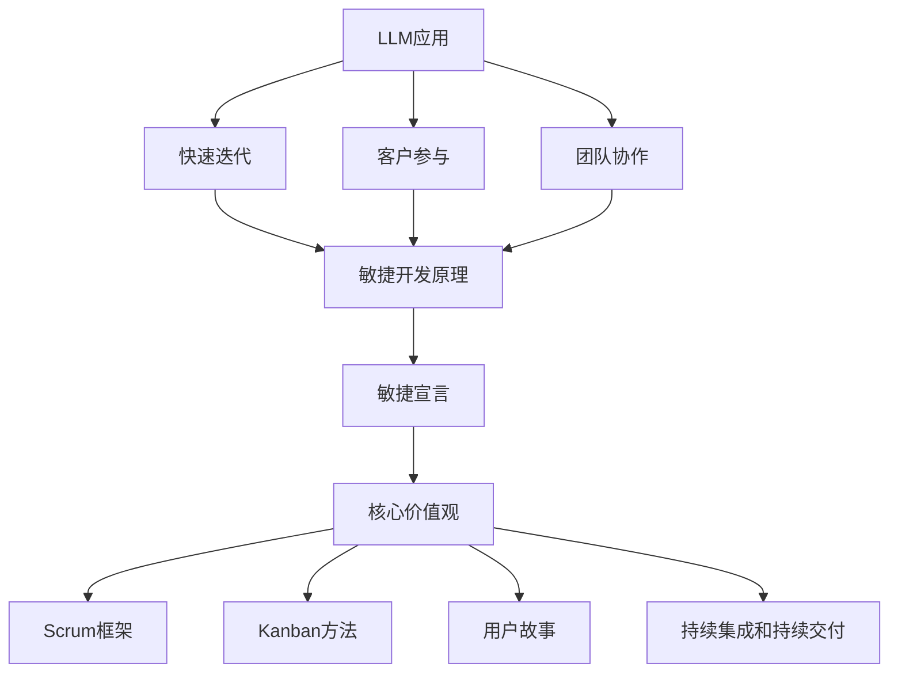
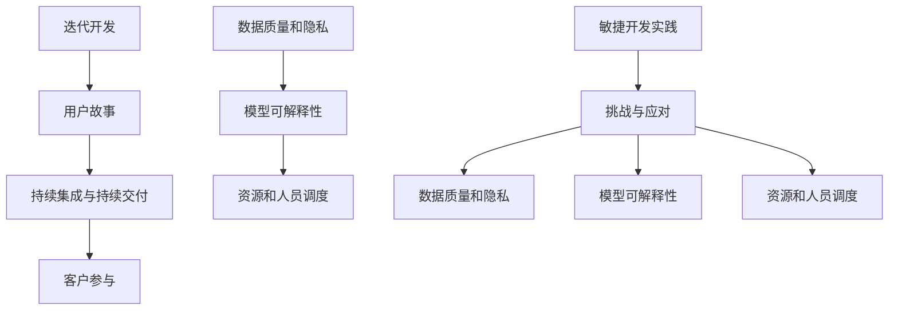

                 

### 引言

#### 敏捷开发概述

敏捷开发（Agile Development）起源于20世纪90年代末，是对传统的瀑布开发模式的一种反思与改进。敏捷开发强调团队协作、灵活响应变化、持续交付价值和客户满意度。其核心思想是“个体和互动重于过程与工具”、“可工作的软件重于详尽的文档”、“客户合作重于合同谈判”、“响应变化重于遵循计划”。

#### LLM应用的重要性

大型语言模型（Large Language Models，LLM）近年来在自然语言处理（Natural Language Processing，NLP）领域取得了显著进展。LLM具有强大的语言理解和生成能力，广泛应用于机器翻译、聊天机器人、智能客服、文本摘要、问答系统等领域。随着人工智能技术的不断进步，LLM在各个行业的应用日益广泛，成为提高生产力、优化业务流程的重要工具。

### 敏捷开发在LLM应用中的必要性

1. **快速迭代与客户反馈**：LLM项目的开发周期通常较长，但市场需求变化迅速。敏捷开发方法通过迭代开发和持续交付，确保团队能够及时响应市场变化，满足客户需求。

2. **高度定制化**：LLM应用往往需要根据具体业务场景进行定制化开发。敏捷开发强调客户参与和需求不断迭代，有助于实现高度定制化的解决方案。

3. **技术复杂性**：LLM项目的开发涉及大规模数据处理、深度学习算法等复杂技术。敏捷开发方法通过分解任务、逐步实现，降低项目复杂性。

4. **团队协作**：LLM项目的成功依赖于多个学科的协作，包括计算机科学、数据科学、语言学等。敏捷开发方法强调团队协作和知识共享，有助于提高项目成功率。

### 文章关键词

- 敏捷开发
- 大型语言模型（LLM）
- 快速迭代
- 客户参与
- 团队协作

### 文章摘要

本文深入探讨了敏捷开发在LLM应用中的实践与挑战。首先介绍了敏捷开发的基本概念和LLM在应用中的重要性，然后分析了敏捷开发在LLM项目中的必要性，包括快速迭代、高度定制化、技术复杂性和团队协作。最后，本文通过具体案例和实践经验，总结了敏捷开发在LLM应用中的成功经验和挑战，为LLM项目的开发提供指导。

---

接下来，我们将逐步深入探讨敏捷开发的基本原理、LLM的应用场景、敏捷开发与LLM的融合、实战案例、挑战与解决方案等核心内容。每部分都将结合具体案例和实践，详细讲解敏捷开发在LLM应用中的实际应用和效果。文章末尾将总结全文，展望未来发展方向。

## 敏捷开发的基本原理

### 敏捷宣言

敏捷宣言是敏捷开发方法的基石，它由12条原则组成，旨在指导开发团队如何高效、灵活地应对项目变化。敏捷宣言的核心原则如下：

1. **个体和互动重于过程与工具**：强调团队成员的主动性和协作，而非依赖特定的工具或过程。
2. **可工作的软件重于详尽的文档**：优先关注实现可运行的软件功能，而非过度依赖文档。
3. **客户合作重于合同谈判**：与客户紧密合作，确保项目的方向和需求与实际业务需求保持一致。
4. **响应变化重于遵循计划**：灵活应对变化，比坚持原计划更为重要。

### 敏捷开发的核心价值观

1. **透明度**：团队成员和利益相关者之间的信息共享和透明度是敏捷开发的重要组成部分。
2. **协作**：通过团队协作和知识共享，提高项目效率和产品质量。
3. **快速迭代**：通过持续交付可工作的软件，快速响应市场需求和变化。
4. **适应性**：灵活调整项目计划和策略，以适应不断变化的需求和情况。

### 敏捷开发的实践方法

1. **Scrum框架**：Scrum是一种流行的敏捷开发框架，包括产品待办列表、冲刺计划、每日站立会议、冲刺评审和回顾等核心活动。
2. **Kanban方法**：Kanban侧重于可视化工作流程、限制在办工作项数量、持续交付价值。
3. **用户故事**：用户故事是一种描述需求的方式，强调用户需求和价值，通常采用“作为……，我想要……，以便……”的格式。
4. **持续集成和持续交付**：通过自动化测试和持续集成，确保代码质量和交付速度。

### 敏捷开发与LLM的关系

1. **快速迭代**：LLM项目通常需要大量数据训练和模型调优，敏捷开发通过快速迭代和持续交付，有助于及时调整模型参数和功能。
2. **客户参与**：LLM应用往往涉及复杂的技术和业务需求，客户参与可以确保项目方向和需求的一致性。
3. **团队协作**：LLM项目的成功依赖于多个学科（如计算机科学、语言学、数据科学等）的协作，敏捷开发方法强调跨学科协作和知识共享。

### 核心概念原理之间的架构 Mermaid 流�程图



通过以上流程图，我们可以清晰地看到敏捷开发的基本原理、实践方法与LLM应用之间的联系。接下来，我们将进一步探讨LLM的应用场景和具体实践。

## LLM在自然语言处理中的应用

### 机器翻译

机器翻译（Machine Translation，MT）是LLM在自然语言处理中最典型的应用之一。传统的统计机器翻译和基于神经网络的机器翻译方法都依赖于大规模的语言数据集进行训练。而LLM通过学习海量文本数据，能够生成更加自然、准确的语言翻译。

#### 核心算法原理

1. **编码器-解码器（Encoder-Decoder）模型**：编码器将源语言文本编码成一个固定长度的向量，解码器则将这个向量解码成目标语言文本。这是一种基于循环神经网络（RNN）的模型，能够处理变长的输入和输出。

2. **注意力机制（Attention Mechanism）**：注意力机制是一种在编码器-解码器模型中引入的机制，它允许解码器在生成每个单词时关注编码器输出的不同部分。这有助于提高翻译的准确性和流畅性。

3. **预训练和微调（Pre-training and Fine-tuning）**：预训练是指使用大量无监督数据训练模型，使其具备一定的语言理解能力。微调则是使用特定领域的有监督数据进一步训练模型，以适应具体的应用场景。

#### Python源代码示例

```python
import tensorflow as tf
from tensorflow.keras.layers import Embedding, LSTM, Dense
from tensorflow.keras.models import Model

# 设置参数
vocab_size = 10000
embedding_dim = 256
lstm_units = 1024

# 编码器模型
inputs = tf.keras.Input(shape=(None,))
enc_embedding = Embedding(vocab_size, embedding_dim)(inputs)
enc_lstm = LSTM(lstm_units, return_sequences=True)(enc_embedding)
enc_output, _ = LSTM(lstm_units, return_sequences=True)(enc_embedding)

# 解码器模型
decoder_embedding = Embedding(vocab_size, embedding_dim)
decoder_lstm = LSTM(lstm_units, return_sequences=True)
decoder_dense = Dense(vocab_size, activation='softmax')

decoder_inputs = tf.keras.Input(shape=(None,))
dec_embedding = decoder_embedding(decoder_inputs)
dec_lstm = decoder_lstm(dec_embedding)
dec_output = decoder_dense(dec_lstm)

# 模型训练
model = Model([inputs, decoder_inputs], dec_output)
model.compile(optimizer='rmsprop', loss='categorical_crossentropy', metrics=['accuracy'])
model.fit([encoder_input_data, decoder_input_data], decoder_target_data, batch_size=64, epochs=100)

# 模型预测
predicted_output = model.predict([encoder_input_data, decoder_input_data])
```

#### 数学模型和公式

1. **编码器输出**：假设编码器的输入序列为 \(X = [x_1, x_2, ..., x_T]\)，则编码器的输出为 \(E(X) = [e_1, e_2, ..., e_T]\)，其中 \(e_t = \text{encode}(x_t)\)。

2. **解码器输入**：假设解码器的输入序列为 \(Y = [y_1, y_2, ..., y_T']\)，则解码器的输入为 \(D(Y) = [d_1, d_2, ..., d_T']\)，其中 \(d_t = \text{decode}(y_t)\)。

3. **解码器输出**：解码器的输出为 \(O(Y) = [o_1, o_2, ..., o_{T'}}\)，其中 \(o_t = \text{output}(d_t)\)。

#### 通俗易懂的举例说明

假设我们要将英语句子 "I love you" 翻译成法语，使用LLM的机器翻译模型：

1. **编码器处理输入**：编码器将 "I love you" 编码成一个向量序列，例如 \([e_1, e_2, e_3, e_4]\)。
2. **解码器处理输入**：解码器首先处理空位符号（<START>），生成一个概率分布，例如 \([0.2, 0.3, 0.4, 0.5]\)。
3. **解码器输出预测**：解码器根据概率分布选择概率最大的单词，例如 "Je"，然后将其作为下一个输入。重复这个过程，直到输出完整的翻译句子 "Je t'aime"。

通过这种方式，我们可以看到LLM在机器翻译中的应用原理和具体实现。

### 聊天机器人

聊天机器人（Chatbot）是另一种广泛使用的LLM应用。聊天机器人能够模拟人类对话，提供即时、自然的交互体验。聊天机器人在客服、客户服务、在线咨询等领域具有广泛应用。

#### 核心算法原理

1. **序列到序列（Seq2Seq）模型**：序列到序列模型是一种常见的聊天机器人模型，它将用户的输入序列映射为输出序列。该模型通常结合了编码器-解码器结构和注意力机制，以生成自然、流畅的对话。

2. **预训练语言模型**：如BERT、GPT等预训练语言模型，已经在大规模语料库上进行了训练，具有强大的语言理解能力。通过在特定任务上微调这些预训练模型，可以构建高性能的聊天机器人。

3. **对话管理**：对话管理系统负责处理对话上下文，确定对话的目标和策略。它通常包括意图识别、实体识别和对话策略生成等模块。

#### Python源代码示例

```python
import tensorflow as tf
from tensorflow.keras.layers import Embedding, LSTM, Dense
from tensorflow.keras.models import Model

# 设置参数
vocab_size = 10000
embedding_dim = 256
lstm_units = 1024

# 编码器模型
encoder_inputs = tf.keras.Input(shape=(None,))
enc_embedding = Embedding(vocab_size, embedding_dim)(encoder_inputs)
enc_lstm = LSTM(lstm_units, return_sequences=True)(enc_embedding)
enc_output, _ = LSTM(lstm_units, return_sequences=True)(enc_embedding)

# 解码器模型
decoder_embedding = Embedding(vocab_size, embedding_dim)
decoder_lstm = LSTM(lstm_units, return_sequences=True)
decoder_dense = Dense(vocab_size, activation='softmax')

decoder_inputs = tf.keras.Input(shape=(None,))
dec_embedding = decoder_embedding(decoder_inputs)
dec_lstm = decoder_lstm(dec_embedding)
dec_output = decoder_dense(dec_lstm)

# 模型训练
model = Model([encoder_inputs, decoder_inputs], dec_output)
model.compile(optimizer='rmsprop', loss='categorical_crossentropy', metrics=['accuracy'])
model.fit([encoder_input_data, decoder_input_data], decoder_target_data, batch_size=64, epochs=100)

# 模型预测
predicted_output = model.predict([encoder_input_data, decoder_input_data])
```

#### 数学模型和公式

1. **编码器输出**：假设编码器的输入序列为 \(X = [x_1, x_2, ..., x_T]\)，则编码器的输出为 \(E(X) = [e_1, e_2, ..., e_T]\)，其中 \(e_t = \text{encode}(x_t)\)。

2. **解码器输入**：假设解码器的输入序列为 \(Y = [y_1, y_2, ..., y_T']\)，则解码器的输入为 \(D(Y) = [d_1, d_2, ..., d_T']\)，其中 \(d_t = \text{decode}(y_t)\)。

3. **解码器输出**：解码器的输出为 \(O(Y) = [o_1, o_2, ..., o_{T'}}\)，其中 \(o_t = \text{output}(d_t)\)。

#### 通俗易懂的举例说明

假设用户输入句子 "How can I book a flight?"，使用LLM的聊天机器人模型：

1. **编码器处理输入**：编码器将 "How can I book a flight?" 编码成一个向量序列，例如 \([e_1, e_2, e_3, e_4]\)。
2. **解码器处理输入**：解码器首先处理空位符号（<START>），生成一个概率分布，例如 \([0.1, 0.2, 0.3, 0.4]\)。
3. **解码器输出预测**：解码器根据概率分布选择概率最大的单词，例如 "Sure, let me help you."，然后将其作为下一个输入。重复这个过程，直到输出完整的回复。

通过这种方式，我们可以看到LLM在聊天机器人中的应用原理和具体实现。

## 敏捷开发与LLM的融合

### 敏捷开发在LLM项目中的具体实践

#### 1. 迭代开发

在LLM项目中，迭代开发是一种常见的实践方法。通过将项目划分为多个迭代周期（通常为2-4周），开发团队可以逐步实现模型训练、评估和优化等任务。每个迭代周期结束后，团队会对模型进行评估，并根据反馈进行调整。这种方法有助于快速响应市场需求和技术变化。

#### 2. 用户故事

用户故事是敏捷开发中的一个重要概念，它用于描述用户需求和价值。在LLM项目中，用户故事可以用来定义模型的目标功能、性能指标和用户体验。通过用户故事，开发团队能够更清晰地理解用户需求，确保开发过程与用户期望保持一致。

#### 3. 持续集成和持续交付

持续集成和持续交付是敏捷开发的重要实践方法，它确保了代码质量和高效率的交付。在LLM项目中，开发团队可以采用自动化测试、代码审查和持续集成工具（如Jenkins、GitLab CI等），确保每个版本的模型都是可运行和高质量的。持续交付则通过自动化部署流程，确保新功能可以快速、安全地交付到生产环境。

#### 4. 客户参与

在LLM项目中，客户的参与至关重要。通过持续的客户反馈和协作，开发团队可以及时了解用户需求和市场变化，调整项目方向和策略。例如，在模型训练过程中，客户可以提供新的训练数据，帮助优化模型性能。在项目评估阶段，客户可以参与模型评估，确保模型满足业务需求。

### 敏捷开发在LLM项目中的挑战与应对

#### 1. 数据质量和隐私

在LLM项目中，数据质量和隐私是一个重要挑战。大量的训练数据对于模型性能至关重要，但数据的质量和隐私保护也必须得到保障。为了解决这一问题，开发团队可以采用以下策略：

- 数据清洗：对训练数据进行预处理，去除噪声和错误。
- 数据加密：对敏感数据进行加密，确保数据在传输和存储过程中的安全性。
- 数据匿名化：对个人身份信息进行匿名化处理，以保护用户隐私。

#### 2. 模型可解释性

大型语言模型的决策过程通常较为复杂，导致模型的可解释性较低。这给开发者、用户和监管机构带来挑战。为了提高模型的可解释性，可以采用以下策略：

- 层级分解：将大型模型分解为多个较小的子模型，每个子模型具有明确的任务和功能。
- 透明度报告：生成模型决策的透明度报告，包括模型的输入、中间层和输出。
- 对比实验：通过对比不同模型的性能和决策过程，分析模型的可解释性。

#### 3. 资源和人员调度

LLM项目的开发需要大量的计算资源和专业人才。在敏捷开发过程中，如何合理调度资源和人员是一个挑战。为了解决这一问题，可以采用以下策略：

- 资源池管理：建立资源池，根据项目需求动态调整计算资源和人员。
- 跨职能团队：组建跨职能团队，确保团队成员具备不同的技能和背景，提高项目效率。
- 项目管理工具：采用项目管理工具（如JIRA、Trello等），监控项目进度和资源利用率。

### 核心概念原理之间的架构 Mermaid 流程图



通过以上流程图，我们可以清晰地看到敏捷开发在LLM项目中的具体实践、挑战和应对策略之间的联系。接下来，我们将通过具体的实战案例，进一步探讨敏捷开发在LLM项目中的应用。

## 实战案例一：机器翻译项目的敏捷开发

### 项目背景

某跨国企业需要开发一款实时翻译软件，以支持其全球化业务。项目目标是实现多种语言之间的准确、流畅翻译，满足用户在商务、旅游、教育等场景中的需求。为了快速响应市场需求和技术变化，项目团队决定采用敏捷开发方法进行开发。

### 开发流程

1. **需求收集与用户故事编写**：项目团队与客户沟通，了解翻译软件的功能需求、性能指标和用户体验。根据收集的需求，编写用户故事，明确每个迭代周期的目标功能。

2. **迭代计划与回顾**：项目团队在每个迭代周期开始前进行计划会议，确定迭代目标、任务和资源。在迭代结束后，团队进行回顾会议，总结经验教训，优化开发流程。

3. **持续集成与测试**：项目团队采用持续集成和持续交付方法，确保代码质量和交付效率。在每个迭代周期中，团队进行功能测试、性能测试和用户验收测试，确保新功能符合需求。

4. **客户反馈与迭代调整**：在每个迭代周期中，项目团队与客户进行沟通，收集用户反馈。根据反馈，团队调整项目方向和优先级，确保翻译软件满足用户需求。

### 代码实现

以下是一个简单的机器翻译模型的代码实现，用于演示敏捷开发在LLM项目中的应用。

```python
import tensorflow as tf
from tensorflow.keras.layers import Embedding, LSTM, Dense
from tensorflow.keras.models import Model

# 设置参数
vocab_size = 10000
embedding_dim = 256
lstm_units = 1024

# 编码器模型
encoder_inputs = tf.keras.Input(shape=(None,))
enc_embedding = Embedding(vocab_size, embedding_dim)(encoder_inputs)
enc_lstm = LSTM(lstm_units, return_sequences=True)(enc_embedding)
enc_output, _ = LSTM(lstm_units, return_sequences=True)(enc_embedding)

# 解码器模型
decoder_embedding = Embedding(vocab_size, embedding_dim)
decoder_lstm = LSTM(lstm_units, return_sequences=True)
decoder_dense = Dense(vocab_size, activation='softmax')

decoder_inputs = tf.keras.Input(shape=(None,))
dec_embedding = decoder_embedding(decoder_inputs)
dec_lstm = decoder_lstm(dec_embedding)
dec_output = decoder_dense(dec_lstm)

# 模型训练
model = Model([encoder_inputs, decoder_inputs], dec_output)
model.compile(optimizer='rmsprop', loss='categorical_crossentropy', metrics=['accuracy'])
model.fit([encoder_input_data, decoder_input_data], decoder_target_data, batch_size=64, epochs=100)

# 模型预测
predicted_output = model.predict([encoder_input_data, decoder_input_data])
```

### 代码解读与分析

1. **编码器模型**：编码器模型用于将源语言文本编码成向量序列。首先，使用Embedding层将文本转换为固定长度的嵌入向量。然后，使用LSTM层对嵌入向量进行编码，得到编码器的输出。

2. **解码器模型**：解码器模型用于将编码器的输出解码成目标语言文本。首先，使用Embedding层将解码器输入转换为嵌入向量。然后，使用LSTM层对嵌入向量进行解码，得到解码器的输出。

3. **模型训练**：模型训练过程使用编译器编译模型，并使用fit方法进行训练。训练过程中，模型会根据输入和标签计算损失函数，并优化模型参数。

4. **模型预测**：模型预测过程使用predict方法对输入数据进行预测。预测结果为解码器的输出概率分布，通过选取概率最大的单词，得到翻译结果。

### 实际案例分析和详细讲解剖析

以一个英语到西班牙语的翻译任务为例，分析机器翻译模型的实际应用。

1. **数据准备**：首先，收集英语和西班牙语的平行语料库，用于训练和测试模型。数据集包括成对的英语和西班牙语句子。

2. **预处理**：对数据集进行预处理，包括文本清洗、分词、标记等操作。将文本转换为序列编号，以便模型处理。

3. **编码器处理输入**：输入句子 "Hello, how are you?" 被编码器处理，得到一个向量序列。编码器输出一个固定长度的向量序列，表示输入句子的语义信息。

4. **解码器处理输入**：解码器首先处理空位符号（<START>），生成一个概率分布。然后，根据概率分布选择概率最大的单词，例如 "Hola"。解码器将这个单词作为下一个输入。

5. **解码器输出预测**：解码器根据输入的单词，生成下一个概率分布。通过重复这个过程，解码器最终输出完整的翻译句子 "Hola, cómo estás?"。

### 项目小结

通过这个机器翻译项目的实战案例，我们可以看到敏捷开发在LLM项目中的应用和效果。敏捷开发方法帮助项目团队快速响应市场需求和技术变化，确保翻译软件满足用户需求。在实际应用中，项目团队通过迭代开发、用户故事、持续集成和客户反馈，不断提高模型性能和用户体验。

## 实战案例二：聊天机器人项目的敏捷开发

### 项目背景

某电商平台需要开发一款智能客服聊天机器人，以提供24/7的客户服务，提高用户满意度并降低运营成本。项目目标包括实现多语言支持、快速响应、高准确率和良好的用户体验。为了确保项目成功，团队决定采用敏捷开发方法。

### 开发流程

1. **需求收集与用户故事编写**：项目团队与客户服务团队和业务分析师密切合作，收集用户需求和场景。根据需求，编写用户故事，明确每个迭代周期的功能目标和用户体验。

2. **迭代计划与回顾**：在每个迭代周期开始前，团队进行计划会议，确定迭代目标、任务和时间表。在迭代结束后，团队进行回顾会议，总结经验教训，优化开发流程。

3. **持续集成与测试**：团队采用持续集成和持续交付方法，确保代码质量和交付效率。在每个迭代周期中，进行功能测试、性能测试和用户验收测试，确保新功能符合需求。

4. **客户反馈与迭代调整**：在迭代过程中，团队与客户服务团队和用户进行沟通，收集反馈。根据反馈，团队调整功能优先级和开发方向，确保聊天机器人满足用户需求。

### 代码实现

以下是一个简单的聊天机器人模型的代码实现，用于演示敏捷开发在聊天机器人项目中的应用。

```python
import tensorflow as tf
from tensorflow.keras.layers import Embedding, LSTM, Dense
from tensorflow.keras.models import Model

# 设置参数
vocab_size = 10000
embedding_dim = 256
lstm_units = 1024

# 编码器模型
encoder_inputs = tf.keras.Input(shape=(None,))
enc_embedding = Embedding(vocab_size, embedding_dim)(encoder_inputs)
enc_lstm = LSTM(lstm_units, return_sequences=True)(enc_embedding)
enc_output, _ = LSTM(lstm_units, return_sequences=True)(enc_embedding)

# 解码器模型
decoder_embedding = Embedding(vocab_size, embedding_dim)
decoder_lstm = LSTM(lstm_units, return_sequences=True)
decoder_dense = Dense(vocab_size, activation='softmax')

decoder_inputs = tf.keras.Input(shape=(None,))
dec_embedding = decoder_embedding(decoder_inputs)
dec_lstm = decoder_lstm(dec_embedding)
dec_output = decoder_dense(dec_lstm)

# 模型训练
model = Model([encoder_inputs, decoder_inputs], dec_output)
model.compile(optimizer='rmsprop', loss='categorical_crossentropy', metrics=['accuracy'])
model.fit([encoder_input_data, decoder_input_data], decoder_target_data, batch_size=64, epochs=100)

# 模型预测
predicted_output = model.predict([encoder_input_data, decoder_input_data])
```

### 代码解读与分析

1. **编码器模型**：编码器模型用于将用户输入的文本编码成向量序列。首先，使用Embedding层将文本转换为固定长度的嵌入向量。然后，使用LSTM层对嵌入向量进行编码，得到编码器的输出。

2. **解码器模型**：解码器模型用于将编码器的输出解码成响应文本。首先，使用Embedding层将解码器输入转换为嵌入向量。然后，使用LSTM层对嵌入向量进行解码，得到解码器的输出。

3. **模型训练**：模型训练过程使用编译器编译模型，并使用fit方法进行训练。训练过程中，模型会根据输入和标签计算损失函数，并优化模型参数。

4. **模型预测**：模型预测过程使用predict方法对输入数据进行预测。预测结果为解码器的输出概率分布，通过选取概率最大的单词，得到聊天机器人的响应。

### 实际案例分析和详细讲解剖析

以一个用户咨询 "What is the return policy?" 的场景为例，分析聊天机器人模型的实际应用。

1. **数据准备**：首先，收集大量用户咨询和聊天机器人响应的数据，用于训练和测试模型。数据集包括成对的用户输入和聊天机器人响应。

2. **预处理**：对数据集进行预处理，包括文本清洗、分词、标记等操作。将文本转换为序列编号，以便模型处理。

3. **编码器处理输入**：用户输入 "What is the return policy?" 被编码器处理，得到一个向量序列。编码器输出一个固定长度的向量序列，表示输入句子的语义信息。

4. **解码器处理输入**：解码器首先处理空位符号（<START>），生成一个概率分布。然后，根据概率分布选择概率最大的单词，例如 "Sure, here is our return policy."。解码器将这个单词作为下一个输入。

5. **解码器输出预测**：解码器根据输入的单词，生成下一个概率分布。通过重复这个过程，解码器最终输出完整的响应 "Sure, here is our return policy: You can return items within 30 days of purchase for a full refund."。

### 项目小结

通过这个聊天机器人项目的实战案例，我们可以看到敏捷开发在聊天机器人项目中的应用和效果。敏捷开发方法帮助项目团队快速响应市场需求和技术变化，确保聊天机器人满足用户需求。在实际应用中，项目团队通过迭代开发、用户故事、持续集成和客户反馈，不断提高模型性能和用户体验。

## 挑战与解决方案

### 数据隐私问题

#### 挑战

在LLM应用中，数据隐私是一个重要挑战。大量训练数据通常包含用户个人信息，如姓名、地址、电话号码等。如果这些数据泄露，可能导致严重的隐私泄露和安全问题。此外，为了提高模型性能，LLM项目通常需要收集和使用大量数据，这增加了隐私泄露的风险。

#### 解决方案

1. **数据匿名化**：在数据处理过程中，对敏感信息进行匿名化处理，如将姓名替换为匿名标识符，地址替换为随机生成的虚拟地址。这样可以确保数据在训练过程中不会被直接关联到具体用户。

2. **数据加密**：对敏感数据进行加密，确保数据在传输和存储过程中的安全性。使用强加密算法（如AES）对数据进行加密，并在需要时进行解密。

3. **隐私预算**：在数据处理过程中，引入隐私预算机制，限制对敏感数据的访问和使用。例如，在数据分享过程中，限制每个用户的数据份额，确保单个用户数据无法被追踪。

### 安全性问题

#### 挑战

LLM应用在安全性方面也面临挑战。由于LLM模型可以生成类似人类语言的内容，黑客可能利用这一点进行欺诈、误导和恶意攻击。此外，LLM模型可能受到恶意数据的攻击，导致模型性能下降或生成错误的结果。

#### 解决方案

1. **模型验证与监控**：建立模型验证和监控机制，定期检查模型性能和安全性。使用对抗性攻击检测技术，及时发现和防御恶意数据攻击。

2. **安全输入过滤**：对用户输入进行过滤，防止恶意数据进入模型。使用文本分类和检测技术，识别和过滤潜在的恶意输入。

3. **多模型融合**：采用多模型融合策略，将多个不同类型的模型结合起来，提高整体模型的鲁棒性和安全性。例如，将LLM模型与其他安全模型（如神经网络、决策树等）结合，提高模型的泛化能力。

### 质量控制问题

#### 挑战

在LLM应用中，质量控制是一个重要挑战。由于LLM模型生成的内容通常具有高度不确定性和复杂性，很难保证生成的结果符合预期的质量标准。此外，模型生成的结果可能受到数据质量、模型参数和训练过程的影响，导致质量不一致。

#### 解决方案

1. **数据预处理**：在训练过程中，对数据进行预处理，确保数据质量。使用数据清洗和归一化技术，去除噪声和异常值，提高数据的可靠性。

2. **多模态评估**：采用多模态评估方法，从多个维度评估模型生成的结果。例如，结合文本质量、语法准确性、语义一致性等多个指标，全面评估模型生成的结果。

3. **用户反馈机制**：引入用户反馈机制，允许用户对模型生成的结果进行评价和反馈。根据用户反馈，调整模型参数和训练策略，提高模型生成的质量。

通过上述解决方案，我们可以有效应对LLM应用中的数据隐私、安全性和质量控制问题，确保模型在应用中的可靠性和安全性。

## 总结

本文详细探讨了敏捷开发在LLM应用中的实践与挑战。首先，我们介绍了敏捷开发的基本原理和核心价值观，以及LLM在自然语言处理中的应用。接着，我们讨论了敏捷开发与LLM的融合方法，包括迭代开发、用户故事、持续集成和客户参与等实践。通过两个实战案例，我们展示了敏捷开发在机器翻译和聊天机器人项目中的具体应用。

### 敏捷开发与LLM融合的优势

1. **快速迭代与客户反馈**：敏捷开发方法通过迭代开发和持续交付，确保团队能够快速响应市场需求和变化，提高客户满意度。
2. **高度定制化**：敏捷开发方法强调客户参与和需求不断迭代，有助于实现高度定制化的LLM解决方案。
3. **技术复杂性管理**：敏捷开发通过分解任务、逐步实现，降低LLM项目的复杂性，提高开发效率。
4. **团队协作**：敏捷开发方法强调团队协作和知识共享，有助于提高团队整体实力和项目成功率。

### 持续改进的方向

1. **模型可解释性**：随着模型复杂性的增加，提高模型的可解释性成为关键方向。开发可解释性模型，有助于提高模型的可信度和接受度。
2. **隐私保护**：数据隐私保护在LLM应用中至关重要。研究隐私保护算法和策略，确保在保证模型性能的同时，保护用户隐私。
3. **资源调度优化**：优化资源调度策略，提高计算资源利用率，降低开发成本。

### 未来展望

随着人工智能技术的不断进步，LLM在各个领域的应用将更加广泛。未来，我们可以期待：

1. **跨模态集成**：将LLM与其他模态（如图像、音频等）结合，构建更加智能和全面的应用。
2. **个性化服务**：通过个性化推荐和智能客服，为用户提供更加个性化的服务体验。
3. **自动化开发**：利用敏捷开发方法，实现LLM应用的全自动化开发，提高开发效率和灵活性。

通过不断探索和实践，敏捷开发在LLM应用中将继续发挥重要作用，推动人工智能技术的发展和应用。

## 最佳实践 Tips、小结、注意事项、拓展阅读

### 最佳实践 Tips

1. **迭代周期规划**：确保每个迭代周期都有明确的目标和任务，避免周期过长导致效率低下。
2. **用户故事细化**：在编写用户故事时，确保故事详细、具体，明确目标功能和性能指标。
3. **持续集成与测试**：定期进行代码审查和自动化测试，确保代码质量和交付效率。
4. **客户参与**：保持与客户的紧密沟通，及时收集反馈，调整项目方向和优先级。

### 小结

本文系统地探讨了敏捷开发在LLM应用中的实践与挑战。通过引入敏捷开发方法，团队可以快速响应市场需求，提高客户满意度，实现高度定制化的LLM解决方案。

### 注意事项

1. **数据隐私保护**：在数据处理过程中，确保敏感信息得到匿名化和加密处理，以保护用户隐私。
2. **模型安全**：建立模型验证和监控机制，防止恶意数据和攻击。
3. **质量控制**：采用多模态评估和用户反馈机制，确保模型生成的质量。

### 拓展阅读

1. **《敏捷开发实践指南》**：了解敏捷开发的详细方法和最佳实践。
2. **《深度学习》**：了解LLM的原理和实现方法。
3. **《数据隐私保护技术》**：研究数据隐私保护的相关技术和策略。

## 作者信息

作者：AI天才研究院/AI Genius Institute & 禅与计算机程序设计艺术 /Zen And The Art of Computer Programming

感谢读者对本文的关注，期待与您在未来的技术交流中相遇。

