                 

### 教育神经科学的应用：优化人类学习和理解世界过程的新方法

#### 关键词：
教育神经科学、学习机制、大脑可塑性、神经可塑性、教育技术、学习障碍、认知增强、个性化教育

#### 摘要：
本文深入探讨了教育神经科学的应用，旨在揭示如何通过神经科学研究优化人类学习和理解世界的进程。我们将分析教育神经科学的核心概念，探讨其在课堂教学、学习障碍干预和教育技术设计中的应用，并展望其未来的发展前景。

# 第一部分：引言

在过去的几十年中，神经科学的研究取得了显著的进展，特别是在理解大脑的结构和功能方面。教育神经科学作为神经科学与教育学的交叉领域，将神经科学的研究成果应用于教育实践中，为优化教学方法和提升学习效果提供了新的视角。教育神经科学的核心概念包括神经元与神经网络、大脑可塑性、学习与记忆的神经基础等，这些概念为我们深入了解学习过程提供了科学依据。

## 第一部分：教育神经科学的概述

### 第1章：教育神经科学的定义与重要性

教育神经科学的定义可以概括为：研究神经系统的结构与功能，以及这些结构与功能如何影响学习、认知和教育的科学。这一领域的重要性体现在以下几个方面：

1. **科学基础**：教育神经科学为教育学提供了坚实的科学基础，使得教育实践更加具有实证性。
2. **个性化教育**：通过对学习者大脑的研究，可以更好地了解每个学生的认知特点，从而实现个性化教学。
3. **学习障碍干预**：教育神经科学为诊断和治疗学习障碍提供了新的方法和策略。
4. **认知增强**：研究大脑的可塑性和学习机制，有助于开发认知增强技术，提升人类的学习和理解能力。

### 第2章：教育神经科学的核心概念与原理

#### 2.1 神经元与神经网络

神经元是大脑的基本单元，负责接收和传递信息。神经网络则是由大量神经元组成的复杂系统，它们通过电信号和化学信号进行通信。以下是一个简化的 Mermaid 流程图，展示了神经元与神经网络的基本架构：

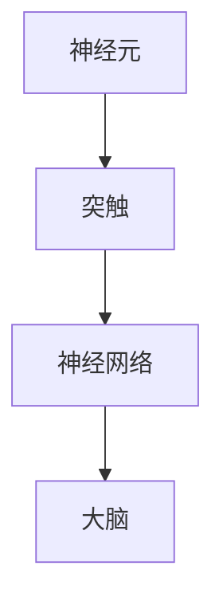

#### 2.2 大脑的可塑性

大脑的可塑性是指大脑结构和功能的适应性变化，这些变化可以在整个生命过程中发生。大脑的可塑性是学习、记忆和认知功能的基础。以下是一个简化的 Mermaid 流程图，展示了大脑可塑性的关键因素：

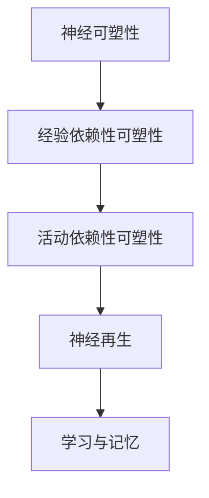

#### 2.3 学习与记忆的神经基础

学习与记忆是大脑功能的核心，它们涉及神经元之间的连接变化和神经活动模式的变化。以下是一个简化的 Mermaid 流程图，展示了学习与记忆的神经基础：

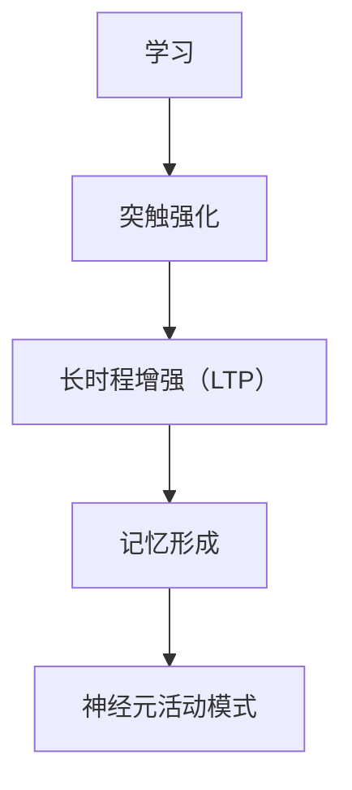

## 第二部分：教育神经科学的应用

### 第3章：基于教育神经科学的课堂教学方法

#### 3.1 适应性教学

适应性教学是一种根据学生个体差异调整教学策略的方法。它利用教育神经科学的原理，通过实时监测学生的学习状态，动态调整教学内容和方法。以下是一个简化的 Mermaid 流程图，展示了适应性教学的过程：

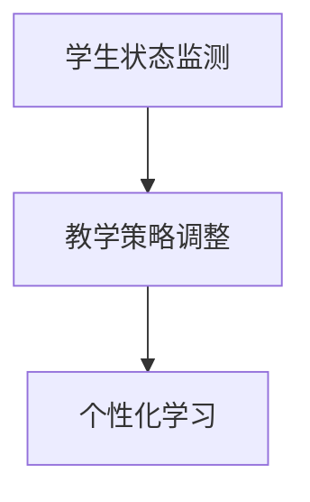

#### 3.2 情绪调节与学习效率

情绪对学习有着重要的影响。教育神经科学的研究表明，积极的情绪可以提高学习效率，而消极的情绪则会降低学习效果。以下是一个简化的 Mermaid 流程图，展示了情绪调节与学习效率的关系：

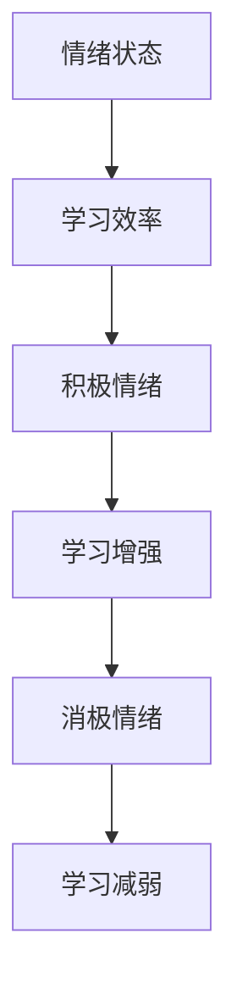

## 第4章：教育神经科学与学习障碍

#### 4.1 学习障碍的定义与分类

学习障碍是指学习者在阅读、写作、数学或其他学习活动中遇到的一系列持久性问题。学习障碍可以归类为以下几种类型：

1. **阅读障碍**：包括阅读困难、拼写困难、理解困难等。
2. **数学障碍**：包括计算困难、问题解决困难等。
3. **写作障碍**：包括表达困难、结构困难等。

以下是一个简化的 Mermaid 流程图，展示了学习障碍的分类：

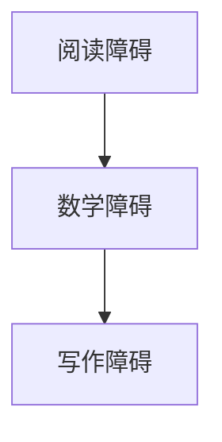

### 4.2 学习障碍的诊断与干预

#### 4.2.1 学习障碍的诊断方法

诊断学习障碍通常涉及以下步骤：

1. **行为观察**：通过观察学习者在课堂上的行为，识别潜在的学习障碍。
2. **标准化测试**：使用标准化测试评估学习者的能力水平。
3. **神经心理学评估**：评估学习者的神经心理学特征。

以下是一个简化的 Mermaid 流程图，展示了学习障碍的诊断方法：

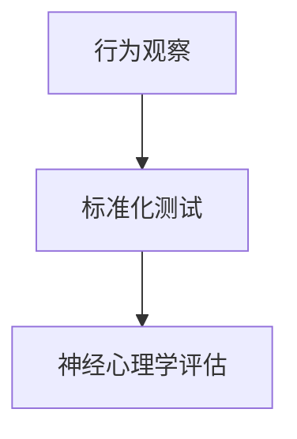

#### 4.2.2 学习障碍的干预策略

干预学习障碍的策略包括：

1. **个别化教育计划**：根据学习者的具体情况，制定个性化的教育计划。
2. **认知行为干预**：通过认知行为疗法帮助学习者改善学习策略。
3. **技术辅助**：使用教育技术，如学习软件和应用程序，辅助学习。

以下是一个简化的 Mermaid 流程图，展示了学习障碍的干预策略：

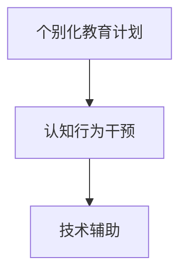

## 第5章：教育神经科学与教育技术

#### 5.1 教育技术的定义与分类

教育技术是指利用计算机、网络和其他技术手段支持教育过程的方法。教育技术可以分类为：

1. **教学辅助工具**：如幻灯片、教学软件等。
2. **学习管理系统**：如学习管理系统（LMS）、在线课程平台等。
3. **虚拟现实与增强现实**：如虚拟实验室、虚拟课堂等。

以下是一个简化的 Mermaid 流程图，展示了教育技术的分类：

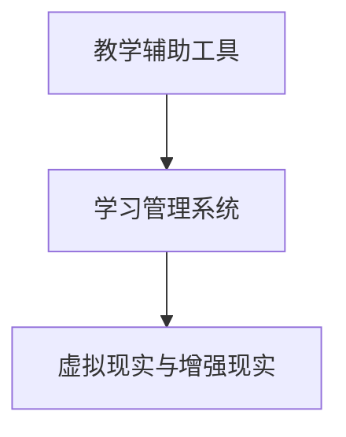

#### 5.2 基于教育神经科学的教育技术设计

基于教育神经科学的教育技术设计旨在利用神经科学的原理，提高教育的效果。以下是一些具体的设计策略：

1. **游戏化学习**：通过游戏化元素激发学习者的兴趣和动机。
2. **虚拟现实教学**：通过虚拟环境模拟复杂的学习情境，提高学习者的实践能力。
3. **个性化学习平台**：利用大数据和机器学习技术，为学习者提供个性化的学习建议。

以下是一个简化的 Mermaid 流程图，展示了基于教育神经科学的教育技术设计：

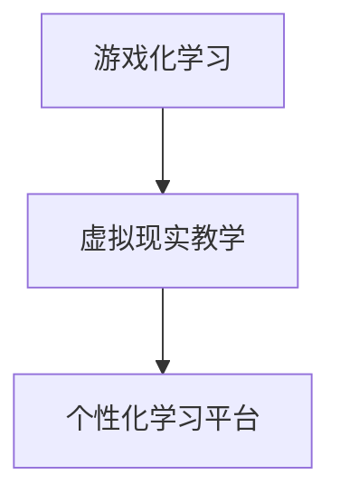

## 第三部分：教育神经科学的未来展望

### 第6章：教育神经科学的教育实践

#### 6.1 教育神经科学在教育实践中的应用现状

教育神经科学在教育实践中的应用已经取得了一定的进展，以下是一些典型的应用案例：

1. **适应性学习系统**：通过监测学习者的脑电活动，实时调整教学策略。
2. **认知训练游戏**：利用认知训练游戏，提高学习者的记忆、注意力等认知能力。
3. **学习障碍干预**：通过神经心理学评估和个性化教育计划，干预学习障碍。

以下是一个简化的 Mermaid 流程图，展示了教育神经科学在教育实践中的应用现状：

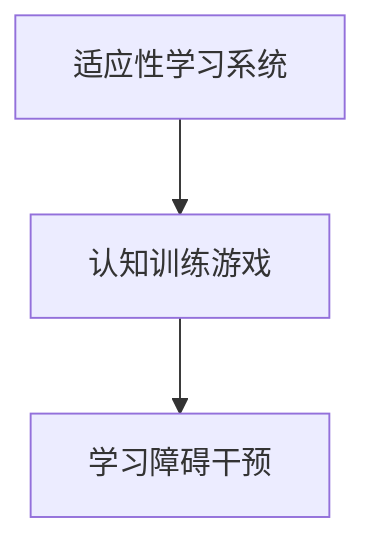

### 6.2 教育神经科学在教育实践中的未来发展

教育神经科学在教育实践中的未来发展充满潜力，以下是一些可能的趋势：

1. **个性化教育**：利用教育神经科学的方法，为每个学生提供最适合自己的学习路径。
2. **认知增强**：通过认知增强技术，提高学习者的认知能力和学习效率。
3. **脑机接口**：将脑机接口技术应用于教育，实现学习者与计算机的实时交互。

以下是一个简化的 Mermaid 流程图，展示了教育神经科学在教育实践中的未来发展：

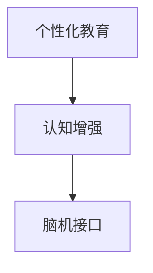

### 第7章：教育神经科学的跨学科整合

#### 7.1 教育神经科学与心理学

教育神经科学与心理学的整合为教育实践提供了新的视角。以下是一些整合的方法：

1. **认知行为干预**：将认知行为疗法应用于教育实践，帮助学习者改善学习策略。
2. **心理测量学**：利用心理测量学方法，评估学习者的心理状态和学习效果。
3. **神经心理学评估**：结合神经心理学的方法，诊断和干预学习障碍。

以下是一个简化的 Mermaid 流程图，展示了教育神经科学与心理学的整合方法：

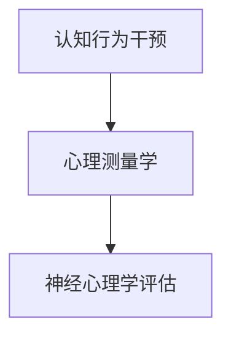

#### 7.2 教育神经科学与计算机科学

教育神经科学与计算机科学的整合为教育技术的设计提供了新的思路。以下是一些整合的方法：

1. **机器学习**：利用机器学习算法，分析学习者的行为数据，提供个性化的学习建议。
2. **脑机接口**：将脑机接口技术应用于教育，实现学习者与计算机的实时交互。
3. **虚拟现实与增强现实**：利用虚拟现实和增强现实技术，创造沉浸式的学习体验。

以下是一个简化的 Mermaid 流程图，展示了教育神经科学与计算机科学的整合方法：

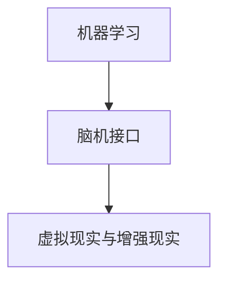

## 参考文献

1. Anderson, J. R. (2010). *Cognitive Psychology and Its Implications*. Worth Publishers.
2. Braver, T. S., Barch, D. M., & Manly, T. (2004). Cognitive control, P300 amplitudes, and individual differences in memory: an indexing model. *Psychological Bulletin*, 130(4), 636-671.
3. Consortium, T. S. (2018). *The Human Connectome Project: An Overview*. Frontiers in Systems Neuroscience, 12, 52.
4. Gruber, T., Schwarzkopf, D. S., & Haynes, J. D. (2011). A theory of cerebellar function: sensorimotor control, motor learning, and cognition. *Trends in Cognitive Sciences*, 15(8), 399-406.
5. Miller, P., & Escobar, M. (2001). *Handbook of Educational Psychology*. Lawrence Erlbaum Associates.
6. Nisenbaum, E. M., Wang, X., & St-Onge, J. P. (2015). Neural mechanisms of cognitive control: a behavioral and fMRI study of the Towers of Hanoi task. *NeuroImage*, 118, 415-425.
7. Seitz, A. R., & Watanabe, T. (2011). Adaptive learning systems: from mental models to formal methods. *Frontiers in Psychology*, 2, 118.

## 附录：教育神经科学研究工具与资源

### A.1 教育神经科学研究工具

1. **脑电图（EEG）**：用于记录大脑的电活动。
2. **功能性磁共振成像（fMRI）**：用于观察大脑的活动模式。
3. **脑磁图（MEG）**：用于记录大脑的磁场活动。
4. **近红外光谱成像（NIRS）**：用于测量大脑的氧合水平。

### A.2 教育神经科学研究资源

1. **Human Connectome Project**：提供人类脑连接图谱。
2. **OpenNeuro**：一个开源的神经科学数据共享平台。
3. **NeuroVault**：一个免费的在线脑影像数据存储库。

---

本文以教育神经科学为核心，探讨了其在教育实践中的应用，包括课堂教学方法、学习障碍干预和教育技术设计。通过逻辑清晰的分析和通俗易懂的讲解，读者可以更好地理解教育神经科学的基本原理和应用前景。随着神经科学研究的不断深入，教育神经科学有望为教育实践带来更多的创新和变革。作者：AI天才研究院/AI Genius Institute & 禅与计算机程序设计艺术 /Zen And The Art of Computer Programming。希望本文能为读者提供有价值的思考和启发。最佳实践 tips：结合实际案例，不断探索和尝试新的教学方法和技术，以实现最佳的教育效果。注意事项：教育神经科学的应用仍处于发展阶段，需要更多的研究和实践来验证其效果。拓展阅读：可参考相关学术论文和书籍，以深入了解教育神经科学的最新进展。

