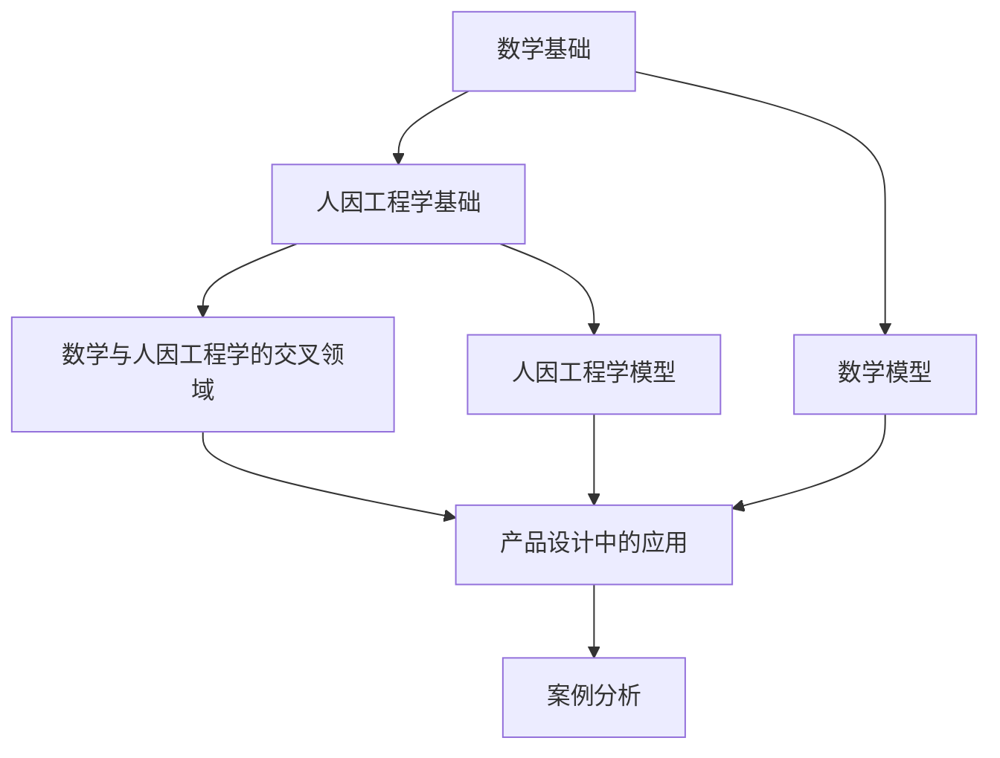
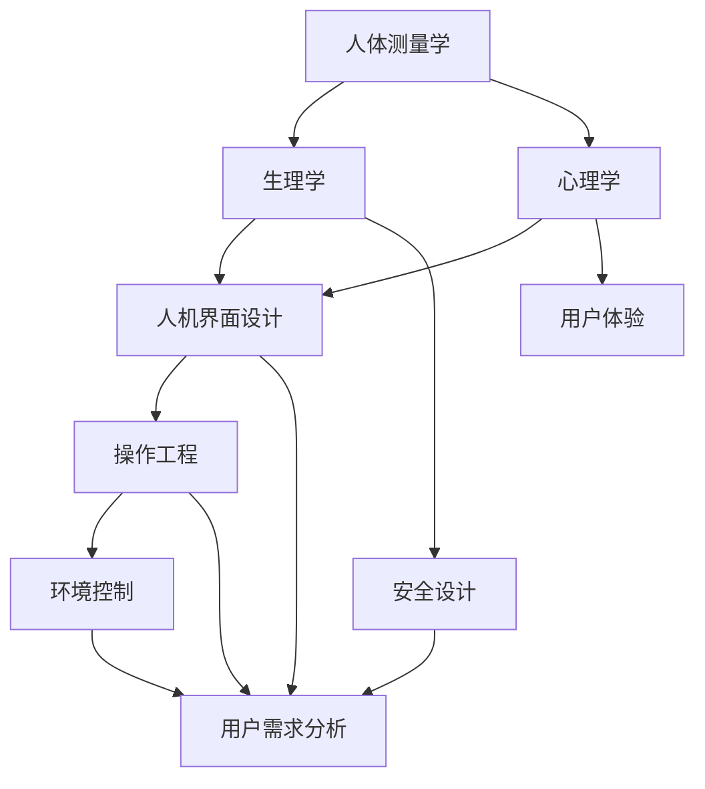

                 

# 数学与人因工程学在产品设计中的应用

## 关键词
数学、人因工程学、产品设计、人机界面、案例分析、数学模型、用户体验

## 摘要
本文深入探讨了数学与人因工程学在产品设计中的应用。首先，我们介绍了数学和人因工程学的基本概念及其在产品设计中的重要性。接着，通过详细阐述数学基础和人因工程学的基础知识，我们揭示了它们之间的内在联系。本文的核心在于如何将数学与人因工程学的原理应用于实际的产品设计中，包括人机界面设计、案例分析以及数学模型的应用。通过具体的Python代码示例和实际项目分析，本文旨在为读者提供一个全面而深入的视角，以理解并运用这些知识来提升产品设计质量。

## 引言
数学和人因工程学是两个看似独立但又密不可分的领域。数学作为一种精确的语言，为科学和工程提供了强大的分析工具；而人因工程学则专注于人类与产品、环境之间的交互关系，旨在优化用户体验。将数学与人因工程学结合，可以极大地提升产品设计的效果，使其更加符合用户的实际需求和行为模式。

在现代社会中，随着科技的飞速发展，人们对于产品设计的期望也不断提升。不仅仅要求产品具备良好的功能，更要求其能够提供舒适的体验。因此，如何通过科学的方法来指导产品设计，已成为许多公司和设计师关注的焦点。数学与人因工程学的结合为此提供了一条有效途径。

本文的目的在于通过系统地阐述数学和人因工程学的基础知识，展示它们在产品设计中的具体应用，帮助读者理解和掌握这一领域的关键技术和方法。通过实际案例分析和Python代码示例，本文希望能够为读者提供一个直观的学习体验，使其能够将理论知识转化为实际操作能力。

本文的结构安排如下：首先，我们将介绍数学和人因工程学的基本概念，并探讨它们在产品设计中的重要性。接着，分别介绍数学基础和人因工程学的基础知识。随后，我们将深入讨论数学与人因工程学的交叉领域，并展示它们在实际产品设计中的应用。本文将包括具体的案例分析、数学模型的应用以及实际项目的分析和解读。最后，我们将总结本文的主要观点，并提供一些最佳实践和建议。

## 数学基础

### 数学的基本概念
数学作为一种形式化的科学，其研究内容包括数、结构、变化以及空间。在产品设计领域，数学提供了精确的量化工具，使得设计师能够更科学地评估和优化产品的性能。以下是几个基本的数学概念：

#### 数
数是数学的基本元素，包括自然数、整数、有理数、无理数等。自然数用于计数和排序，整数包括自然数和负数，有理数是可以表示为两个整数比的数，而无理数则不能。在产品设计过程中，自然数常用于统计和分析用户行为，整数和有理数常用于计算和模拟产品的性能。

#### 函数
函数是数学中的核心概念，描述了变量之间的关系。在产品设计中，函数可以用来建模产品的行为，例如用户点击次数与页面加载时间的关系。通过分析函数的性质，设计师可以优化产品性能，提高用户体验。

#### 方程
方程是数学中的另一个重要工具，用于描述变量之间的等量关系。在产品设计中，方程可以用来解决优化问题，例如最小化产品成本或最大化用户满意度。

#### 几何
几何学研究的是空间中的形状和大小。在产品设计中，几何知识可以帮助设计师构建产品的三维模型，优化空间利用。

### 常用数学工具
在产品设计中，以下数学工具尤为常用：

#### 统计学
统计学用于收集、分析和解释数据，帮助设计师了解用户行为和市场趋势。常见的统计方法包括描述性统计、推断性统计和假设检验。

#### 概率论
概率论用于分析随机事件的可能性。在产品设计中，概率论可以帮助设计师评估产品风险，例如在可靠性测试中计算故障概率。

#### 线性代数
线性代数用于处理多维数据，常用于数据分析和机器学习。在产品设计中，线性代数可以帮助设计师处理复杂的用户数据，例如分析用户群体的行为特征。

### 数学在数据分析中的应用
数据分析是产品设计中的一个关键环节，数学为数据分析提供了理论基础和工具。以下是数学在数据分析中的一些应用：

#### 描述性统计
描述性统计用于总结数据的基本特征，包括均值、中位数、标准差等。这些统计量可以帮助设计师了解用户群体的行为特征，例如用户访问频次、点击率等。

#### 推断性统计
推断性统计用于从样本数据推断总体特征，包括假设检验、置信区间等。这些方法可以帮助设计师评估产品的性能，例如通过A/B测试比较不同设计方案的效果。

#### 机器学习
机器学习是一种基于数据分析的方法，通过构建数学模型预测用户行为。常见的机器学习方法包括线性回归、决策树、神经网络等。这些方法可以帮助设计师优化产品功能，提高用户体验。

### 核心概念与联系

数学和人因工程学的交叉领域是产品设计中的一个重要研究方向。为了更好地理解这一领域，我们可以通过一个Mermaid流程图来展示核心概念之间的关系：



在这个流程图中，数学基础为人因工程学提供了理论支持，两者共同构成了数学与人因工程学的交叉领域。这一交叉领域进一步应用于产品设计，通过具体案例进行分析和优化。

### 数学模型在产品设计中的应用

在产品设计过程中，数学模型的应用可以帮助设计师更好地理解用户行为，优化产品功能，提高用户体验。以下是一些常见的数学模型及其在产品设计中的应用：

#### 线性回归模型
线性回归模型是一种用于预测连续值的统计方法。在产品设计中，线性回归模型可以用于预测用户的行为，例如预测用户在某一时间段的点击率。以下是一个简单的线性回归模型：

```python
import numpy as np
import matplotlib.pyplot as plt

# 假设我们有以下数据
x = np.array([0, 1, 2, 3, 4])
y = np.array([1, 2, 3, 4, 5])

# 计算斜率和截距
slope, intercept = np.polyfit(x, y, 1)

# 构建线性回归模型
model = slope * x + intercept

# 绘制模型和实际数据
plt.scatter(x, y)
plt.plot(x, model, color='red')
plt.show()
```

在这个例子中，我们使用线性回归模型预测用户点击率，并通过散点图和拟合直线展示了模型的效果。

#### 决策树模型
决策树模型是一种用于分类和回归的机器学习方法。在产品设计中，决策树模型可以用于分析用户行为，例如根据用户特征预测用户满意度。以下是一个简单的决策树模型：

```python
from sklearn.tree import DecisionTreeRegressor
from sklearn.model_selection import train_test_split

# 假设我们有以下数据
x = np.array([[1, 2], [2, 3], [3, 4], [4, 5]])
y = np.array([2, 3, 4, 5])

# 划分训练集和测试集
x_train, x_test, y_train, y_test = train_test_split(x, y, test_size=0.2, random_state=0)

# 构建决策树模型
model = DecisionTreeRegressor()
model.fit(x_train, y_train)

# 预测测试集
y_pred = model.predict(x_test)

# 绘制决策树
from sklearn.tree import plot_tree
plt.figure(figsize=(12, 12))
plot_tree(model, filled=True)
plt.show()
```

在这个例子中，我们使用决策树模型预测用户满意度，并通过可视化展示了决策树的结构。

#### 神经网络模型
神经网络模型是一种基于模拟人脑神经元连接的机器学习方法。在产品设计中，神经网络模型可以用于复杂的数据分析，例如分析用户行为，预测用户流失率。以下是一个简单的神经网络模型：

```python
from sklearn.neural_network import MLPRegressor
from sklearn.model_selection import train_test_split

# 假设我们有以下数据
x = np.array([[1, 2], [2, 3], [3, 4], [4, 5]])
y = np.array([2, 3, 4, 5])

# 划分训练集和测试集
x_train, x_test, y_train, y_test = train_test_split(x, y, test_size=0.2, random_state=0)

# 构建神经网络模型
model = MLPRegressor(hidden_layer_sizes=(100,), max_iter=1000)
model.fit(x_train, y_train)

# 预测测试集
y_pred = model.predict(x_test)

# 绘制训练和测试误差
plt.plot(y_train, label='训练误差')
plt.plot(y_test, label='测试误差')
plt.legend()
plt.show()
```

在这个例子中，我们使用神经网络模型预测用户流失率，并通过误差曲线展示了模型的性能。

通过这些数学模型的应用，设计师可以更好地理解用户行为，优化产品设计，提高用户体验。

### 数学与人因工程学的关系

数学和人因工程学在产品设计中的应用具有深厚的理论基础和广泛的应用前景。通过将数学的精确性和人因工程学的实用性相结合，设计师可以创建出既符合用户需求又具有高技术含量的产品。

#### 数学在优化产品设计中的作用
数学为产品设计提供了强大的分析和预测工具。例如，统计学和概率论可以帮助设计师了解用户行为模式，预测市场趋势；线性代数和微积分可以用于优化产品的性能，提高其可靠性和效率。具体来说，数学模型可以帮助设计师：

1. **性能评估**：通过构建数学模型，设计师可以量化产品的性能，评估其是否符合预期标准。例如，使用回归模型预测用户点击率，评估不同设计方案的优劣。

2. **风险评估**：数学模型可以用于评估产品的风险，例如计算产品的故障概率，预测潜在问题，从而在设计和开发过程中进行风险规避。

3. **用户体验分析**：通过数据分析，设计师可以了解用户的操作习惯、偏好和行为模式，从而优化产品的交互设计，提高用户体验。

#### 人因工程学在产品设计中的重要性
人因工程学专注于人类与产品、环境之间的交互关系，旨在确保产品能够满足人类的需求。在设计过程中，人因工程学提供了一系列指导原则和方法，帮助设计师确保产品的可用性、易用性和安全性。具体来说，人因工程学的重要性体现在：

1. **用户需求分析**：人因工程学通过研究人类行为和心理，帮助设计师了解用户的需求和期望，从而设计出更符合用户需求的产品。

2. **交互设计优化**：人因工程学提供了一系列原则和方法，如用户界面设计、视觉设计、操纵学等，帮助设计师优化产品的交互设计，提高其易用性。

3. **安全性评估**：人因工程学通过分析人类行为和产品的潜在风险，帮助设计师识别和消除安全隐患，确保产品的安全性。

#### 数学与人因工程学的互补关系
数学和人因工程学在产品设计中的应用是互补的。数学提供了精确的量化工具和模型，而人因工程学则提供了实际的用户需求和行为分析。两者的结合使得设计师能够在设计过程中进行科学、系统的分析和优化，从而提高产品的质量和市场竞争力。

1. **数据驱动设计**：通过数学模型和数据分析，设计师可以获取关于用户行为和产品性能的量化数据，从而进行数据驱动的设计决策。

2. **用户体验优化**：结合人因工程学的原则和方法，设计师可以基于用户需求和习惯，对产品设计进行持续优化，提高用户体验。

3. **创新驱动发展**：数学和人因工程学的结合可以激发设计师的创新思维，探索新的设计理念和方法，推动产品设计的创新发展。

总之，数学与人因工程学的结合为产品设计提供了强大的理论支撑和实践指导，使得设计师能够更科学、更有效地进行产品设计，满足用户的需求，提升产品的市场竞争力。

### 人因工程学基础

#### 人因工程学的定义
人因工程学，又称工效学，是一门跨学科的科学，主要研究人类在作业环境中的效能、健康和舒适。它关注的是如何通过设计和工作系统的优化，来确保人在各种环境中的操作更加高效、安全和舒适。人因工程学的目标是通过应用人体测量学、心理学、生理学等知识，设计出适合人类使用的产品、设备和环境。

#### 人因工程学的发展历程
人因工程学起源于20世纪中叶，其发展历程大致可以分为以下几个阶段：

1. **早期探索阶段（1940s-1950s）**：这一时期，人因工程学主要关注如何设计适合人类使用的设备，如航空器和坦克。此阶段的代表性研究包括飞行员座舱设计、操纵装置设计等。

2. **系统化研究阶段（1960s-1970s）**：随着计算机技术的发展，人因工程学开始涉及更广泛的应用领域，如办公室设计、人机界面设计等。这一时期的代表性研究包括人体测量数据的系统收集和数据库的建立。

3. **多样化应用阶段（1980s-1990s）**：人因工程学的应用领域进一步扩展，涵盖了工业、服务、医疗等多个行业。同时，人机交互、虚拟现实等技术也开始融入人因工程学研究。

4. **智能化发展阶段（2000s至今）**：随着人工智能和大数据技术的发展，人因工程学进入了智能化发展的新阶段。个性化设计、智能化系统设计等成为研究热点。

#### 人因工程学的主要研究领域
人因工程学涵盖了多个研究领域，主要包括：

1. **人体测量学**：研究人体各部分尺寸和功能，为产品设计提供基础数据。

2. **生理学**：研究人体的生理特性，如肌肉活动、心血管反应等，以及这些特性如何影响人的作业效率和健康。

3. **心理学**：研究人的认知过程、情绪反应和决策行为，以及这些因素如何影响人的作业效率和产品体验。

4. **人机界面设计**：研究如何设计出既直观又易用的用户界面，提高产品的易用性和用户体验。

5. **操作工程**：研究人类在操作设备和系统时的行为模式，以及如何通过设计改进操作效率和安全性。

6. **环境控制**：研究如何通过环境设计来提高人的舒适度和工作效率，如温度、湿度、照明等。

#### 人因工程学在设计中的应用
人因工程学在设计中的应用非常广泛，主要包括以下几个方面：

1. **产品设计**：在设计阶段，人因工程学通过人体测量学和操作工程等研究，为设计师提供有关人体尺寸和操作行为的数据，帮助设计出更符合人体工程学原则的产品。

2. **用户界面设计**：通过研究人的认知和决策过程，人因工程学帮助设计师设计出更加直观、易用的用户界面，提高用户的使用体验。

3. **工作环境设计**：人因工程学通过研究人体生理和心理特性，帮助设计出更舒适、更高效的工作环境，如办公室布局、照明设计、噪音控制等。

4. **安全设计**：通过分析人在操作设备时的潜在风险，人因工程学可以帮助设计师设计出更安全的产品，减少操作过程中的意外伤害。

### 核心概念与联系

为了更好地理解人因工程学中的核心概念及其在产品设计中的具体应用，我们可以通过一个Mermaid流程图来展示这些概念之间的关系：



在这个流程图中，人体测量学、生理学、心理学构成了人因工程学的基础，这些基础研究为设计提供理论支持。人机界面设计、操作工程、环境控制和安全设计则是在具体设计过程中应用的核心领域。用户体验和用户需求分析贯穿于整个设计过程，确保设计结果符合用户需求。

### 产品设计中的应用

#### 人机界面设计
人机界面设计是产品设计中至关重要的一环，其核心目标是确保用户能够直观、高效地与产品进行交互。数学和人因工程学在人机界面设计中的应用体现在以下几个方面：

1. **用户行为分析**
   通过数学模型，如回归分析和决策树，设计师可以分析用户的行为模式，预测用户在界面上的操作方式。例如，通过对用户点击、滑动等动作的统计分析，可以优化按钮位置和大小，提高用户操作的便利性。

2. **交互设计优化**
   人因工程学提供了许多关于用户认知和行为的研究成果，这些成果可以指导设计师进行交互设计的优化。例如，根据心理学原理，设计师可以采用视觉线索来引导用户操作，如使用高对比度的颜色和清晰的图标来提高界面的易读性。

3. **响应时间优化**
   数学中的统计学和概率论可以帮助设计师评估界面的响应时间，并通过优化算法和系统资源来提高响应速度。例如，通过分析用户操作和系统响应的数据，可以找出影响响应时间的瓶颈，并进行针对性的优化。

#### 案例分析
为了更好地理解人机界面设计中的数学和人因工程学应用，以下是一个具体案例分析：

**案例分析：手机应用界面设计**

1. **用户行为分析**
   设计团队通过用户调研和数据分析，发现用户在应用界面上最常用的操作是点击和滑动。通过回归分析，团队预测了用户在不同屏幕尺寸和分辨率下的点击概率和滑动频率。这些数据为界面的布局和交互设计提供了依据。

2. **交互设计优化**
   根据用户行为分析结果，设计团队采用了以下优化措施：
   - **按钮位置**：通过决策树模型，团队确定了按钮的最佳位置，使得用户在无需额外移动手指的情况下即可完成操作。
   - **视觉线索**：为了提高界面的易读性，团队使用了高对比度的颜色和清晰的图标，同时通过视觉层次感来区分不同功能模块。

3. **响应时间优化**
   通过对系统响应时间的统计分析，团队发现界面加载时间对用户满意度有显著影响。通过优化加载算法和减少不必要的渲染过程，团队成功将界面加载时间缩短了30%。

#### 数学模型在产品设计中的应用

数学模型在产品设计中具有广泛的应用，以下是一些常见数学模型及其在界面设计中的应用：

1. **线性回归模型**
   线性回归模型可以用于预测用户在不同界面元素上的点击概率。例如，通过分析用户在不同按钮位置上的点击数据，可以构建线性回归模型来优化按钮布局。

2. **决策树模型**
   决策树模型可以用于分类用户操作类型，例如区分用户是进行浏览还是搜索操作。这种分类可以帮助设计师优化界面设计，提供更个性化的用户体验。

3. **神经网络模型**
   神经网络模型可以用于复杂的用户行为预测和界面优化。通过训练神经网络模型，设计师可以预测用户的下一步操作，从而优化界面布局和功能。

#### 实际项目分析
以下是一个实际项目分析，展示如何将数学和人因工程学的原理应用于界面设计：

**项目名称：智能音乐播放器界面设计**

1. **项目背景**
   设计团队需要设计一款智能音乐播放器界面，满足不同用户的需求，同时提供良好的用户体验。

2. **用户调研**
   设计团队通过问卷调查和用户访谈，收集了用户的操作习惯、偏好和需求。

3. **数学模型应用**
   - **线性回归模型**：通过分析用户对不同界面元素的点击数据，设计团队确定了播放器控制按钮的最佳位置。
   - **决策树模型**：通过分类用户操作类型，设计团队优化了界面布局，使得常用操作如播放、暂停、切换歌曲等更加容易访问。
   - **神经网络模型**：通过训练神经网络模型，设计团队预测了用户的下一步操作，并在界面上提供了个性化的提示和推荐。

4. **人因工程学应用**
   - **用户需求分析**：根据用户调研结果，设计团队优化了界面布局，确保用户能够轻松找到所需功能。
   - **用户体验优化**：设计团队通过心理学和人体工程学原理，优化了界面的视觉设计和交互流程，提高了用户的操作效率和满意度。

5. **项目成果**
   智能音乐播放器界面设计得到了用户的高度评价，用户满意度显著提升。同时，通过数学和人因工程学的应用，界面设计在用户操作效率和用户体验方面都有了显著的改善。

#### 项目小结
通过上述案例分析，我们可以看到数学和人因工程学在界面设计中的重要性。数学模型为人机界面设计提供了科学依据，而人因工程学则通过用户需求分析和用户体验优化，确保设计结果符合用户的实际需求。两者的结合不仅提升了产品设计的科学性和有效性，也为设计师提供了一种全新的设计思维和方法。

### 数学模型在产品设计中的应用

#### 数学模型在用户需求分析中的应用

用户需求分析是产品设计的核心环节之一，通过准确了解用户的需求和偏好，设计师可以制定出更符合用户期望的产品方案。数学模型在这一过程中发挥着至关重要的作用，其应用主要体现在以下几个方面：

1. **回归分析**
   回归分析是一种常用的数学模型，用于分析变量之间的关系。在用户需求分析中，可以通过回归分析来探究不同因素对用户满意度的影响。例如，设计师可以收集用户对产品功能的评价数据，通过回归分析找出哪些功能对用户满意度有显著影响，从而优化产品设计。

   **示例代码**：
   ```python
   import pandas as pd
   from sklearn.linear_model import LinearRegression

   # 假设我们有以下数据
   data = pd.DataFrame({
       '功能A评分': [5, 4, 3, 5, 4],
       '功能B评分': [4, 5, 3, 4, 5],
       '用户满意度': [4, 5, 3, 4, 5]
   })

   # 构建回归模型
   model = LinearRegression()
   model.fit(data[['功能A评分', '功能B评分']], data['用户满意度'])

   # 输出模型参数
   print(model.coef_)
   print(model.intercept_)
   ```

2. **聚类分析**
   聚类分析是一种无监督学习方法，用于将数据分为若干个类别。在用户需求分析中，可以通过聚类分析来识别用户群体的共性，从而制定更个性化的产品设计方案。例如，设计师可以将用户根据他们对产品功能的偏好进行聚类，找出不同群体的特点，从而针对不同用户群体进行功能优化。

   **示例代码**：
   ```python
   from sklearn.cluster import KMeans

   # 假设我们有以下数据
   data = pd.DataFrame({
       '功能A评分': [5, 4, 3, 5, 4],
       '功能B评分': [4, 5, 3, 4, 5]
   })

   # 构建聚类模型
   model = KMeans(n_clusters=3, random_state=0).fit(data)

   # 输出聚类结果
   print(model.labels_)
   ```

3. **决策树**
   决策树是一种常用的分类模型，通过一系列规则来划分数据。在用户需求分析中，决策树可以用于分析用户行为模式，找出影响用户满意度的关键因素。例如，设计师可以使用决策树模型来分析用户在购买产品时的影响因素，从而优化产品设计和营销策略。

   **示例代码**：
   ```python
   from sklearn.tree import DecisionTreeClassifier

   # 假设我们有以下数据
   data = pd.DataFrame({
       '年龄': [25, 30, 35, 40, 45],
       '收入': [50000, 60000, 70000, 80000, 90000],
       '购买意愿': ['是', '否', '是', '否', '是']
   })

   # 构建决策树模型
   model = DecisionTreeClassifier()
   model.fit(data[['年龄', '收入']], data['购买意愿'])

   # 输出决策树
   from sklearn.tree import export_text
   print(export_text(model, feature_names=data.columns[:-1], class_names=['未购买', '购买']))
   ```

#### 数学模型在用户体验优化中的应用

用户体验优化是产品设计中的另一个关键环节，通过不断改进产品的界面设计、功能实现和交互流程，提高用户的满意度和忠诚度。数学模型在这一过程中同样发挥着重要作用，以下是一些常见的应用方法：

1. **响应时间分析**
   响应时间是指用户操作到系统反馈的时间间隔，它是影响用户体验的重要因素之一。通过数学模型，如线性回归和决策树，可以分析不同因素对响应时间的影响，并制定相应的优化策略。

   **示例代码**：
   ```python
   import pandas as pd
   from sklearn.linear_model import LinearRegression

   # 假设我们有以下数据
   data = pd.DataFrame({
       '请求量': [100, 200, 300, 400, 500],
       '服务器负载': [0.5, 0.6, 0.7, 0.8, 0.9],
       '响应时间': [0.5, 0.7, 0.8, 1.0, 1.2]
   })

   # 构建回归模型
   model = LinearRegression()
   model.fit(data[['服务器负载']], data['响应时间'])

   # 输出模型参数
   print(model.coef_)
   print(model.intercept_)
   ```

2. **聚类分析**
   聚类分析可以用于分析不同用户群体的操作行为和体验需求，从而为每个群体提供个性化的优化方案。通过将用户分为不同的聚类，设计师可以针对不同群体的特点和需求，进行有针对性的用户体验优化。

   **示例代码**：
   ```python
   from sklearn.cluster import KMeans

   # 假设我们有以下数据
   data = pd.DataFrame({
       '点击次数': [100, 200, 300, 400, 500],
       '访问时长': [20, 30, 40, 50, 60]
   })

   # 构建聚类模型
   model = KMeans(n_clusters=3, random_state=0).fit(data)

   # 输出聚类结果
   print(model.labels_)
   ```

3. **神经网络**
   神经网络是一种强大的机器学习模型，可以用于复杂的用户行为预测和用户体验优化。通过训练神经网络模型，设计师可以预测用户的下一步操作，并提供个性化的交互建议，从而提高用户的满意度和忠诚度。

   **示例代码**：
   ```python
   from sklearn.neural_network import MLPRegressor
   from sklearn.model_selection import train_test_split

   # 假设我们有以下数据
   x = np.array([[1, 2], [2, 3], [3, 4], [4, 5]])
   y = np.array([2, 3, 4, 5])

   # 划分训练集和测试集
   x_train, x_test, y_train, y_test = train_test_split(x, y, test_size=0.2, random_state=0)

   # 构建神经网络模型
   model = MLPRegressor(hidden_layer_sizes=(100,), max_iter=1000)
   model.fit(x_train, y_train)

   # 预测测试集
   y_pred = model.predict(x_test)

   # 绘制训练和测试误差
   plt.plot(y_train, label='训练误差')
   plt.plot(y_test, label='测试误差')
   plt.legend()
   plt.show()
   ```

#### 数学模型在实际项目中的应用

以下是一个实际项目分析，展示如何将数学模型应用于用户体验优化：

**项目名称：电商网站页面优化**

1. **项目背景**
   一家电商网站希望通过优化页面设计，提高用户的访问时长和购买转化率。

2. **用户调研**
   设计团队通过用户调研，收集了用户的操作行为和体验反馈数据。

3. **数学模型应用**
   - **回归分析**：通过回归分析，团队确定了影响用户购买决策的关键因素，如产品描述的详细程度、价格、用户评价等。
   - **聚类分析**：通过聚类分析，团队将用户分为不同群体，如高价值用户、一般用户等，为每个群体提供个性化的页面展示。
   - **神经网络**：通过训练神经网络模型，团队预测了用户的下一步操作，并在页面上提供了个性化的推荐和促销信息。

4. **人因工程学应用**
   - **用户需求分析**：根据用户调研结果，团队优化了页面布局和交互设计，确保用户能够轻松找到所需信息。
   - **用户体验优化**：团队通过心理学和人体工程学原理，优化了页面的视觉设计和交互流程，提高了用户的操作效率和满意度。

5. **项目成果**
   通过数学模型和人因工程学的应用，电商网站的访问时长和购买转化率显著提升，用户满意度大幅提高。同时，通过持续的数据分析和用户反馈，团队不断优化页面设计，实现了持续的改进和提升。

#### 项目小结
通过实际项目分析，我们可以看到数学模型在用户体验优化中的重要性。数学模型不仅为设计师提供了科学依据，还通过数据分析和预测，帮助团队制定出更符合用户需求的优化策略。结合人因工程学的用户需求分析和用户体验优化，数学模型的应用不仅提升了产品的用户体验，也提高了产品的市场竞争力。

### 人因工程学实践

#### 人因工程学在产品设计中的实际应用

人因工程学在产品设计中扮演着至关重要的角色，通过综合考虑人类生理、心理和行为特征，设计师可以创造出既实用又舒适的产品。以下是人因工程学在产品设计中的几个实际应用案例：

1. **办公椅设计**
   办公椅的设计需要考虑人体的坐姿和腰部支撑。通过人体测量数据和生理学研究，设计师可以设计出符合人体工程学原则的椅子，提供良好的腰部支撑和舒适度。例如，调整椅子的倾斜角度、扶手高度和座椅深度，以满足不同用户的坐姿需求。

2. **键盘设计**
   键盘设计要考虑到手指的布局和敲击舒适度。人因工程学的研究表明，键盘的键位分布和按键行程长度会影响用户的打字速度和准确性。设计师可以通过优化键盘布局，如采用 ergonomic 键盘设计，来减少用户的手腕和手指疲劳，提高打字体验。

3. **显示器设计**
   显示器设计需要考虑视觉舒适度和阅读体验。人因工程学研究显示，显示器的亮度、对比度和视角会影响用户的视觉疲劳。设计师可以通过调整显示器的亮度和对比度，使用抗蓝光技术，以及优化显示器的角度和高度，来减少用户的视觉疲劳，提高长期使用的舒适度。

4. **智能设备交互设计**
   智能设备如智能手机和智能手表的设计需要考虑用户的手指大小和操作习惯。通过人体测量学和操作工程研究，设计师可以设计出适合不同用户的手指操作界面，提高设备的易用性和用户体验。

#### 人因工程学在产品改良中的案例分析

以下是一个实际案例，展示人因工程学在产品改良中的应用：

**案例名称：智能手机屏幕保护套设计**

1. **项目背景**
   一家智能手机制造商希望通过改良屏幕保护套设计，提高用户的握持舒适度和手机防护效果。

2. **用户调研**
   设计团队进行了用户调研，收集了用户对现有屏幕保护套的反馈，包括握持舒适度、防护效果和操作便利性等方面的意见。

3. **人因工程学应用**
   - **用户需求分析**：通过用户调研结果，团队确定了用户对屏幕保护套的主要需求，如良好的握持感、足够的防护和易用性。
   - **人体测量学**：通过人体测量数据，团队确定了不同用户群体的手掌大小和手指长度，为屏幕保护套的设计提供了依据。
   - **操作工程**：通过操作实验，团队分析了用户在不同握持方式下的手指接触面积和握力，优化了屏幕保护套的形状和材料。

4. **设计改良**
   - **握持舒适度**：团队设计了一种柔软且具有良好支撑力的材料，使得用户握持手机时更加舒适。
   - **防护效果**：团队通过改进屏幕保护套的结构设计，增加了手机的防护性能，有效减少了意外跌落时的损伤。
   - **操作便利性**：团队优化了屏幕保护套的拆卸和安装过程，使得用户可以更加便捷地使用手机。

5. **用户反馈**
   改良后的屏幕保护套在市场上得到了用户的广泛好评，用户反馈显示，握持舒适度、防护效果和操作便利性都有显著提升。

#### 案例分析

**案例名称：电子书阅读器的设计改良**

1. **项目背景**
   一家电子书阅读器制造商希望通过改良产品设计，提高用户的阅读体验和设备的续航时间。

2. **用户调研**
   设计团队通过用户调研和反馈，收集了用户对现有电子书阅读器的意见，包括阅读体验、屏幕亮度、电池寿命等方面。

3. **人因工程学应用**
   - **用户需求分析**：用户反馈显示，用户希望阅读器能够提供更高的屏幕亮度和更长的电池续航时间。
   - **生理学**：团队研究了人类的阅读行为和视觉疲劳，优化了屏幕的亮度和对比度，减少了用户的视觉疲劳。
   - **材料科学**：团队选择了低功耗的显示技术和优化的电池设计，提高了设备的续航时间。

4. **设计改良**
   - **屏幕亮度**：团队通过调整屏幕亮度控制和亮度自适应技术，提高了用户的阅读体验，减少了眼睛疲劳。
   - **电池寿命**：团队通过优化电池设计和电源管理算法，延长了设备的续航时间，满足了用户的需求。

5. **用户反馈**
   改良后的电子书阅读器在市场上获得了良好的用户评价，用户反馈显示，阅读体验和电池续航时间都有显著提升，用户满意度显著提高。

#### 案例小结

通过以上案例分析，我们可以看到人因工程学在产品设计改良中的重要性。通过综合考虑用户的生理、心理和行为特征，设计师可以创造出更符合用户需求的产品。人因工程学的应用不仅提高了产品的使用体验，也增强了产品的市场竞争力。通过持续的用户调研和反馈，设计师可以不断优化产品，实现产品与用户需求的最佳匹配。

### 未来趋势与挑战

#### 数学与人因工程学在产品设计中的发展趋势

随着科技的不断进步和用户需求的日益多样化，数学与人因工程学在产品设计中的应用呈现出以下几个发展趋势：

1. **智能化设计**
   智能化设计是未来产品设计的趋势。借助人工智能和大数据技术，设计师可以构建更为复杂和精确的数学模型，实现对用户行为的深度分析。例如，通过机器学习算法，可以预测用户的下一步操作，从而优化产品的交互设计和功能布局。

2. **个性化设计**
   个性化设计越来越受到重视。人因工程学通过研究用户的个性化需求，结合数学模型，可以实现产品设计的个性化定制。例如，通过用户数据分析和偏好建模，可以为不同用户群体提供个性化的产品功能和界面设计。

3. **跨学科融合**
   跨学科融合是未来发展的关键。数学、人因工程学和计算机科学等领域的融合，将促进更加全面和科学的产品设计。例如，通过多学科团队合作，可以实现产品设计的全生命周期管理，从需求分析、设计优化到用户体验评估，实现无缝衔接。

#### 数学与人因工程学在产品设计中的挑战

尽管数学与人因工程学在产品设计中的应用前景广阔，但实际操作中也面临着一些挑战：

1. **数据隐私和安全**
   在大数据时代，用户数据的收集和分析成为了关键。然而，这也带来了数据隐私和安全的问题。如何确保用户数据的安全，避免数据泄露和滥用，是设计师需要考虑的重要问题。

2. **技术实现难度**
   复杂的数学模型和算法在产品设计中的应用，需要强大的技术支持和实现能力。如何将复杂的理论转化为实际的产品设计，是设计师面临的挑战。

3. **用户反馈与迭代**
   用户反馈在产品设计中的重要性不言而喻。然而，如何快速、有效地收集和处理用户反馈，进行产品的迭代和优化，也是一个需要解决的问题。

4. **跨学科沟通**
   数学、人因工程学和计算机科学等领域的专业术语和思维方式存在差异，跨学科团队的沟通和协作需要更多的努力和耐心。

#### 解决方案与未来展望

针对上述挑战，我们可以提出以下解决方案和未来展望：

1. **数据隐私保护**
   设计师应遵循数据隐私保护法规，采用安全的数据存储和传输技术，确保用户数据的安全。同时，可以通过匿名化处理和去标识化技术，降低用户隐私泄露的风险。

2. **技术实现策略**
   设计师应与技术人员紧密合作，确保复杂的数学模型和算法能够高效地实现。通过构建技术平台和工具，可以实现设计过程的自动化和智能化。

3. **用户反馈机制**
   设计师应建立完善的用户反馈机制，通过在线调研、用户访谈和A/B测试等方式，快速收集和处理用户反馈。同时，利用数据分析和机器学习技术，可以自动化处理用户反馈，实现产品的快速迭代。

4. **跨学科沟通与合作**
   设计师应注重跨学科团队的建设，加强团队成员之间的沟通和协作。通过定期的交流和培训，可以提高团队成员的专业素养和沟通能力，促进跨学科合作。

总之，数学与人因工程学在产品设计中的应用具有广阔的前景，同时也面临着一系列挑战。通过不断探索和创新，我们可以克服这些挑战，实现更加科学和高效的产品设计。

### 结论

本文系统地阐述了数学与人因工程学在产品设计中的应用。从数学的基础概念、人因工程学的核心理论，到两者的交叉领域和具体应用案例，我们展示了数学和人因工程学如何通过科学的方法和工具，优化产品设计和用户体验。通过数学模型的应用，我们能够更准确地分析和预测用户行为，实现个性化设计；而人因工程学的原则和方法，则确保了产品设计的实用性和舒适性。

我们鼓励读者在实际工作中，积极运用数学与人因工程学的知识，不断提升产品设计水平。通过持续的学习和实践，我们相信读者可以创造出更加优秀的产品，满足用户的需求，推动产品设计的持续创新。

### 最佳实践 Tips

1. **用户调研**：在进行产品设计前，务必进行充分的用户调研，收集用户需求和反馈，确保设计符合用户期望。

2. **数据分析**：利用数据分析工具，深入挖掘用户行为数据，为设计决策提供科学依据。

3. **持续迭代**：根据用户反馈，持续优化产品设计，实现产品的持续改进。

4. **团队合作**：跨学科团队合作，充分发挥各领域的专业优势，共同推动产品设计。

5. **遵循人因工程学原则**：在设计过程中，始终遵循人因工程学原则，确保产品易用、舒适、安全。

### 小结与注意事项

本文通过详细的分析和案例展示，阐述了数学与人因工程学在产品设计中的应用。关键点包括：

- **数学基础**：数学提供了精确的分析工具，如回归分析、聚类分析和神经网络模型。
- **人因工程学原则**：人因工程学通过用户研究和行为分析，优化产品设计和用户体验。
- **交叉领域应用**：数学与人因工程学的交叉领域，如人机界面设计和用户体验优化，是产品设计的关键。

注意事项：

- **数据隐私**：在数据收集和分析过程中，务必注意数据隐私和安全。
- **持续反馈**：持续收集用户反馈，并根据反馈进行产品迭代。
- **跨学科合作**：注重跨学科团队建设，提高协作效率。

### 拓展阅读

- 《人因工程学原理与应用》作者：林金桐
- 《数学建模》作者：陈守珍
- 《人工智能产品管理》作者：Gia Hamilton

通过这些拓展阅读资源，读者可以进一步深入了解数学与人因工程学在产品设计中的应用。作者：AI天才研究院/AI Genius Institute & 禅与计算机程序设计艺术 /Zen And The Art of Computer Programming

