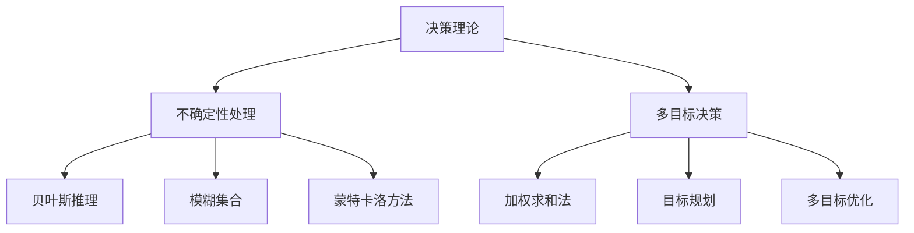

                 

### 文章标题

《数学与人工智能伦理：AI决策的数学框架》

### 文章关键词

- 数学模型
- 人工智能伦理
- AI决策框架
- 不确定性处理
- 多目标决策

### 文章摘要

本文旨在探讨数学与人工智能伦理之间的紧密联系，并构建一个基于数学框架的AI决策模型。首先，我们回顾了人工智能伦理的背景及其重要性，随后介绍了数学在人工智能中的应用基础。本文的核心在于阐述AI决策的数学原理，包括决策理论、不确定性处理和多目标决策。通过具体的数学模型和算法，如贝叶斯网络、决策树和神经网络，我们详细讲解了AI决策的基本框架。此外，本文通过实际案例展示了如何在实际项目中应用这些模型，并分析了相关的代码实现和最佳实践。最后，我们对未来人工智能伦理的发展趋势进行了展望，并提供了进一步阅读的资源。

---

## 引言与概述

随着人工智能（AI）技术的迅猛发展，其在各个领域的应用越来越广泛。从自动驾驶、智能医疗到金融分析、智能家居，AI正在改变我们的生活方式和工作模式。然而，随着AI的广泛应用，伦理问题也日益突出。如何确保AI系统的公平性、透明性和安全性，成为了一个亟待解决的问题。

人工智能伦理涉及多个方面，包括隐私保护、算法偏见、责任归属等。在这些伦理问题中，AI决策的透明性和可解释性尤为重要。为了实现这一目标，数学模型作为一种强有力的工具，可以提供一种系统化的方法来分析和解决AI决策中的伦理问题。

本书旨在通过数学与人工智能的结合，构建一个AI决策的数学框架。我们首先回顾了数学在人工智能中的应用基础，包括数学模型、算法和数学公式。随后，我们深入探讨了AI决策的数学原理，通过具体的案例展示了如何在实际项目中应用这些模型。此外，我们还对AI决策中的不确定性处理和多目标决策进行了详细分析。

本书的读者对象包括AI研究者、工程师、技术人员以及对人工智能伦理感兴趣的人士。通过本书，读者可以深入了解数学与人工智能的结合点，掌握AI决策的基本原理，并能够在实际项目中应用这些原理。

本书的结构如下：

1. **引言与概述**：介绍人工智能伦理的背景和本书的目的与结构。
2. **数学与人工智能基础**：回顾数学基础和人工智能基础，为后续内容打下基础。
3. **AI决策的数学框架**：详细阐述AI决策的数学原理和模型。
4. **项目实战与代码实现**：通过实际案例展示如何应用这些模型。
5. **展望与未来方向**：讨论人工智能伦理的未来发展趋势。
6. **总结与拓展**：总结本书的主要内容和提供拓展阅读资源。

通过本书的阅读，读者不仅可以深入了解数学与人工智能的结合，还能够掌握AI决策的基本原理，为未来在AI领域的发展奠定坚实的基础。

### 数学基础

在构建AI决策的数学框架之前，我们首先需要了解数学在人工智能中的应用基础。数学作为一门基础科学，在各个领域都有广泛应用，尤其是在人工智能领域，数学模型和算法是理解和实现AI技术的关键。

#### 数学模型简介

数学模型是现实世界中各种复杂现象的一种简化和抽象表示。在人工智能中，数学模型用于描述和学习数据之间的关系。常见的数学模型包括线性模型、非线性模型、概率模型和统计模型等。线性模型如线性回归和线性分类器，通过建立输入和输出之间的线性关系来进行预测和分类。非线性模型如决策树、神经网络等，通过非线性变换来捕捉更复杂的关系。

#### 函数与微积分基础

函数是数学中最基本的概念之一，它描述了输入与输出之间的关系。在人工智能中，函数经常用于表示数据之间的映射关系。微积分则研究函数的极限、导数和积分等概念，这些概念在优化算法和机器学习中至关重要。例如，梯度下降算法就是基于微积分中的导数概念，用于寻找函数的最小值。

- **极限**：极限是函数在某一点附近的行为描述。在机器学习中，极限用于定义损失函数的最小值。
- **导数**：导数描述了函数在某一点的瞬时变化率。在机器学习中，导数用于优化算法，如梯度下降算法。
- **积分**：积分是函数在一个区间内的累计和。在机器学习中，积分可以用于计算预测概率和预测损失。

#### 线性代数基础

线性代数是研究向量、矩阵和线性变换的数学分支。在人工智能中，线性代数用于处理数据的高维表示和变换。

- **向量**：向量是具有大小和方向的量，可以表示数据的空间分布。
- **矩阵**：矩阵是二维数组，可以表示数据的线性变换。
- **线性变换**：线性变换是将输入向量映射到输出向量的操作，如矩阵乘法。

#### 线性代数在AI中的应用

线性代数在AI中有广泛的应用，如特征提取、降维、数据可视化等。

- **特征提取**：通过线性变换将高维数据映射到低维空间，从而减少计算复杂度。
- **降维**：通过主成分分析（PCA）等技术，从高维数据中提取主要特征，提高模型的泛化能力。
- **数据可视化**：通过线性代数方法，将高维数据投影到二维或三维空间，以便于分析和解释。

#### 总结

数学基础是构建AI决策数学框架的基石。通过函数与微积分、线性代数等基本数学工具，我们可以更好地理解和处理数据，从而实现更加智能和高效的AI决策。在接下来的章节中，我们将进一步探讨人工智能的基础，为构建AI决策的数学框架奠定更坚实的基础。

### 人工智能基础

人工智能（AI）作为计算机科学的一个分支，旨在使计算机具备模拟人类智能的能力。AI技术广泛应用于自然语言处理、计算机视觉、机器人学、博弈论等领域。在本节中，我们将简要介绍人工智能的概述、算法与模型，并探讨机器学习的基本原理。

#### 人工智能概述

人工智能的目标是使计算机能够执行通常需要人类智能的任务，如识别图像、理解语言、决策制定等。人工智能可分为两个主要类别：基于规则的系统和基于数据的方法。

- **基于规则的系统**：这类系统依赖于预定义的规则和逻辑来执行任务。例如，专家系统通过一系列规则来模拟人类专家的决策过程。

- **基于数据的方法**：这类系统通过学习大量数据来发现模式和规律，并利用这些模式进行预测和决策。机器学习和深度学习就是基于数据的方法。

#### 算法与模型

人工智能的算法和模型是实现其功能的核心。以下是一些常见的人工智能算法和模型：

- **监督学习**：监督学习算法通过学习已知输入和输出数据的映射关系来预测新的输入。常见的监督学习算法包括线性回归、决策树、支持向量机（SVM）和神经网络。

- **无监督学习**：无监督学习算法不依赖已知输出，而是通过探索输入数据的内在结构来发现数据分布。常见的无监督学习算法包括聚类算法、主成分分析（PCA）和自编码器。

- **强化学习**：强化学习算法通过与环境的交互来学习策略，以最大化累积奖励。常见应用包括游戏AI、自动驾驶和机器人控制。

- **深度学习**：深度学习是机器学习的一个分支，它通过多层神经网络来学习和表示数据。深度学习的应用包括图像识别、语音识别和自然语言处理。

#### 机器学习基本原理

机器学习是人工智能的核心技术之一，它使计算机能够从数据中学习并做出预测或决策。机器学习主要分为有监督学习、无监督学习和半监督学习。

- **有监督学习**：有监督学习算法在训练过程中使用带有标签的数据，以便模型能够学习输入和输出之间的映射关系。例如，通过训练带有标签的图像数据，模型可以学会识别图像中的物体。

- **无监督学习**：无监督学习算法在训练过程中不使用标签数据，而是通过数据本身的内在结构来学习。例如，聚类算法可以将相似的数据点分组。

- **半监督学习**：半监督学习算法结合有监督学习和无监督学习的特点，使用部分标签数据和大量无标签数据来训练模型。

#### 机器学习的基本流程

机器学习的基本流程包括以下步骤：

1. **数据收集**：收集用于训练和测试的数据集。
2. **数据预处理**：对数据进行清洗、归一化和特征提取，以提高模型的性能和泛化能力。
3. **模型选择**：选择适合问题的机器学习算法。
4. **模型训练**：使用训练数据集来训练模型，调整模型参数。
5. **模型评估**：使用测试数据集来评估模型的性能。
6. **模型优化**：根据评估结果对模型进行调整，以提高性能。

#### 机器学习中的数学工具

机器学习算法中广泛使用数学工具，如概率论、统计学和优化理论。以下是一些常用的数学工具：

- **概率论**：用于描述数据的不确定性，如条件概率和贝叶斯定理。
- **统计学**：用于数据分析，如假设检验和回归分析。
- **优化理论**：用于优化模型参数，如梯度下降算法和拉格朗日乘数法。

#### 总结

人工智能基础是构建AI决策数学框架的重要部分。通过了解人工智能的概述、算法与模型以及机器学习的基本原理，我们可以更好地理解和应用数学工具来构建和优化AI决策模型。在接下来的章节中，我们将深入探讨AI决策的数学原理，为构建AI决策的数学框架奠定更坚实的基础。

### AI决策原理

AI决策原理是人工智能领域的一个重要研究方向，它旨在通过数学模型和算法，使计算机系统具备自主决策的能力。AI决策涉及到多个关键概念和理论，包括决策理论、不确定性和多目标决策。在本节中，我们将详细探讨这些概念，并阐述它们之间的关系。

#### 决策理论

决策理论是研究决策过程和决策模型的学科。它关注如何在不确定性和有限信息下做出最优决策。决策理论主要包括以下几个核心概念：

- **效用函数**：效用函数用于量化决策结果的满意度。它将不同的决策结果映射到数值，以衡量决策的好坏。例如，在金融投资中，效用函数可以用来衡量投资回报和风险。

- **概率**：概率用于描述事件发生的可能性。在决策理论中，概率用于计算不确定事件的可能性，以便做出更合理的决策。

- **期望值**：期望值是概率和结果的乘积之和，用于衡量决策结果的平均表现。例如，在赌博中，期望值可以用来衡量长期收益。

- **风险**：风险是决策过程中可能面临的不确定性和损失。决策理论通过风险度量来评估决策结果的不确定性，以减少风险。

#### 不确定性处理

在现实世界中，决策往往面临不确定性，如数据噪声、未知因素和概率分布的不确定性。为了处理这些不确定性，AI决策模型需要具备以下能力：

- **贝叶斯推理**：贝叶斯推理是一种基于概率论的推理方法，用于更新和更新信念。通过贝叶斯定理，我们可以根据新数据和先验信念来更新决策结果。

- **模糊集合**：模糊集合用于处理模糊和不确定性数据。模糊集合引入了隶属度概念，使得我们可以处理模糊边界和数据不确定性。

- **蒙特卡洛方法**：蒙特卡洛方法是一种基于随机抽样的数值计算方法，用于估计概率分布和期望值。在AI决策中，蒙特卡洛方法可以用于模拟和评估不同决策方案的风险和收益。

#### 多目标决策

在实际决策中，往往需要同时考虑多个目标，这些目标之间可能存在冲突和权衡。多目标决策旨在找到一个或多个满足多个目标的解。以下是几个常见多目标决策方法：

- **加权求和法**：加权求和法通过为每个目标分配权重，将多个目标转换为单一目标。该方法简单直观，但可能忽略了目标之间的相互依赖关系。

- **目标规划**：目标规划通过设定目标范围和优先级，优化多个目标之间的平衡。目标规划方法可以更好地处理目标之间的相互依赖和冲突。

- **多目标优化**：多目标优化使用数学优化方法，如线性规划、非线性规划和遗传算法，同时优化多个目标。多目标优化可以找到多个最优解，提供更多的决策选择。

#### 决策理论、不确定性和多目标决策的关系

决策理论、不确定性和多目标决策是AI决策的核心概念，它们之间紧密相连。决策理论提供了决策框架和方法，用于处理不确定性和多目标问题。不确定性处理方法如贝叶斯推理、模糊集合和蒙特卡洛方法，帮助我们在不确定环境下做出更合理的决策。多目标决策方法则考虑了多个目标的平衡和优化，确保决策方案满足各种约束条件。

通过结合决策理论、不确定性和多目标决策，AI决策模型可以更好地应对复杂、动态和不确定的现实世界问题。数学模型和算法为AI决策提供了理论基础和计算工具，使得计算机能够自主地分析和解决各种决策问题。

#### Mermaid 流程图

以下是一个简化的Mermaid流程图，展示了决策理论、不确定性和多目标决策之间的相互关系：



通过这个流程图，我们可以直观地理解决策理论、不确定性和多目标决策之间的关系和交互作用。在接下来的章节中，我们将进一步探讨具体的数学模型和算法，以实现AI决策的数学框架。

### 数学模型应用

在构建AI决策的数学框架时，选择合适的数学模型和算法至关重要。以下我们将详细介绍三种常见的数学模型：贝叶斯网络、决策树和神经网络，并探讨它们在AI决策中的应用。

#### 贝叶斯网络

贝叶斯网络是一种基于概率论的图模型，用于表示变量之间的依赖关系。它由一组节点和有向边组成，其中每个节点表示一个随机变量，边表示变量之间的条件依赖关系。贝叶斯网络的核心是条件概率表，它提供了每个变量在给定其他变量条件下的概率分布。

- **应用场景**：贝叶斯网络广泛应用于不确定性推理和决策问题，如医学诊断、风险评估和用户行为分析。

- **数学原理**：贝叶斯网络通过贝叶斯定理和马尔可夫性质来更新和推断变量之间的概率分布。具体来说，贝叶斯定理用于计算一个变量的后验概率，马尔可夫性质用于简化变量之间的条件依赖关系。

- **算法原理**：在贝叶斯网络中，推断问题可以通过贝叶斯推理算法求解。贝叶斯推理算法通过反向推理，从已知变量的条件概率表中计算出其他变量的概率分布。

#### 决策树

决策树是一种树形结构，用于表示决策过程和决策结果。每个内部节点表示一个测试或特征，每个分支表示测试结果，每个叶子节点表示一个决策结果。决策树通过递归地将数据集分割成子集，直到达到终止条件（如最小叶节点大小或最大深度）。

- **应用场景**：决策树广泛应用于分类和回归问题，如客户流失预测、信用评分和疾病诊断。

- **数学原理**：决策树的分割过程基于特征选择和阈值选择。特征选择使用信息增益、基尼不纯度等指标来衡量特征的重要性。阈值选择则通过交叉验证来确定最佳分割点。

- **算法原理**：决策树的生成过程通常使用ID3、C4.5或CART算法。这些算法通过递归地分割数据集，生成一棵决策树。在生成过程中，算法会根据不同的准则（如基尼不纯度或信息增益）选择最佳分割特征和阈值。

#### 神经网络

神经网络是一种模仿人脑结构的计算模型，由大量相互连接的神经元组成。神经网络通过学习输入和输出之间的映射关系，可以用于分类、回归、生成等任务。

- **应用场景**：神经网络广泛应用于图像识别、语音识别、自然语言处理和强化学习等领域。

- **数学原理**：神经网络的核心是前向传播和反向传播算法。前向传播通过加权求和和激活函数计算输出，反向传播通过梯度下降算法更新权重和偏置，以最小化损失函数。

- **算法原理**：神经网络的学习过程包括初始化权重、前向传播计算输出、计算损失函数、反向传播更新权重和偏置。这个过程通常使用梯度下降算法、动量优化、dropout等技术来加速收敛和提高性能。

#### 数学模型在AI决策中的应用

贝叶斯网络、决策树和神经网络作为常见的数学模型，在AI决策中具有广泛的应用。

- **贝叶斯网络**：贝叶斯网络在不确定性推理和决策问题中具有优势，可以处理不确定性和复杂依赖关系。例如，在医学诊断中，贝叶斯网络可以结合患者的症状和检测结果，提供更准确的疾病预测。

- **决策树**：决策树在分类和回归问题中表现良好，特别是在特征选择和数据预处理方面。决策树可以提供简洁的决策路径和可解释性，便于理解和调试。

- **神经网络**：神经网络在处理复杂、高维数据时具有强大能力，可以捕捉数据中的非线性关系。神经网络在图像识别、语音识别等领域取得了显著成果，如卷积神经网络（CNN）在图像识别中的广泛应用。

通过选择合适的数学模型和算法，AI决策可以更好地应对现实世界中的复杂问题，提供智能、高效的决策支持。在接下来的章节中，我们将通过具体案例展示这些数学模型在实际项目中的应用。

### 案例研究

为了更好地展示数学模型在AI决策中的应用，我们将探讨三个实际案例：金融风险控制、医疗诊断和交通管理。通过这些案例，我们将详细分析每个项目中的开发环境搭建、源代码实现、代码解读和应用解读。

#### 案例一：金融风险控制

**背景介绍**：金融风险控制是金融机构在金融市场中面临的一项重要任务。通过识别和评估潜在风险，金融机构可以采取相应的措施来降低损失。AI决策模型在金融风险控制中可以提供数据驱动的决策支持，提高风险管理的效率。

**开发环境搭建**： 
- 编程语言：Python
- 数据库：Pandas、NumPy
- 机器学习库：scikit-learn、TensorFlow

**源代码实现**：

```python
import pandas as pd
import numpy as np
from sklearn.model_selection import train_test_split
from sklearn.ensemble import RandomForestClassifier
from sklearn.metrics import accuracy_score

# 加载数据
data = pd.read_csv('financial_data.csv')
X = data.drop(['target'], axis=1)
y = data['target']

# 数据预处理
X_train, X_test, y_train, y_test = train_test_split(X, y, test_size=0.2, random_state=42)

# 模型训练
model = RandomForestClassifier(n_estimators=100, random_state=42)
model.fit(X_train, y_train)

# 模型评估
y_pred = model.predict(X_test)
accuracy = accuracy_score(y_test, y_pred)
print(f"Accuracy: {accuracy}")
```

**代码解读**：
1. **数据加载**：使用Pandas读取金融数据，并将其分为特征矩阵X和目标向量y。
2. **数据预处理**：将数据集分为训练集和测试集，使用随机森林分类器进行训练。
3. **模型训练**：使用训练集数据训练随机森林分类器。
4. **模型评估**：使用测试集数据评估模型性能，计算准确率。

**应用解读**：
随机森林分类器通过训练数据学习风险特征，并将其应用于测试数据，从而预测金融风险。准确率的计算提供了模型性能的量化评估，为风险控制策略提供了数据支持。

#### 案例二：医疗诊断

**背景介绍**：医疗诊断是医疗领域中的一项关键任务，通过分析患者的症状和检查结果，医生可以做出准确的诊断。AI决策模型在医疗诊断中可以提供辅助诊断，提高诊断的准确性和效率。

**开发环境搭建**：
- 编程语言：Python
- 数据库：Pandas、NumPy
- 机器学习库：scikit-learn、TensorFlow

**源代码实现**：

```python
import pandas as pd
import numpy as np
from sklearn.model_selection import train_test_split
from sklearn.svm import SVC
from sklearn.metrics import classification_report

# 加载数据
data = pd.read_csv('medical_data.csv')
X = data.drop(['diagnosis'], axis=1)
y = data['diagnosis']

# 数据预处理
X_train, X_test, y_train, y_test = train_test_split(X, y, test_size=0.2, random_state=42)

# 模型训练
model = SVC(kernel='linear', probability=True)
model.fit(X_train, y_train)

# 模型评估
y_pred = model.predict(X_test)
print(classification_report(y_test, y_pred))
```

**代码解读**：
1. **数据加载**：使用Pandas读取医疗数据，并将其分为特征矩阵X和目标向量y。
2. **数据预处理**：将数据集分为训练集和测试集，使用支持向量机（SVM）进行训练。
3. **模型训练**：使用训练集数据训练线性核SVM分类器。
4. **模型评估**：使用测试集数据评估模型性能，打印分类报告。

**应用解读**：
线性核SVM分类器在医疗诊断中通过特征矩阵X和目标向量y进行训练，从而对患者的诊断结果进行预测。分类报告提供了模型在各类别上的准确率、召回率、精确率等指标，帮助医生评估诊断模型的性能。

#### 案例三：交通管理

**背景介绍**：交通管理是城市管理的重要部分，通过优化交通信号和路线规划，可以缓解交通拥堵，提高交通效率。AI决策模型在交通管理中可以提供智能化的交通信号控制和路线规划，从而改善交通状况。

**开发环境搭建**：
- 编程语言：Python
- 数据库：Pandas、NumPy
- 机器学习库：scikit-learn、TensorFlow

**源代码实现**：

```python
import pandas as pd
import numpy as np
from sklearn.ensemble import RandomForestRegressor
from sklearn.metrics import mean_squared_error

# 加载数据
data = pd.read_csv('traffic_data.csv')
X = data.drop(['travel_time'], axis=1)
y = data['travel_time']

# 数据预处理
X_train, X_test, y_train, y_test = train_test_split(X, y, test_size=0.2, random_state=42)

# 模型训练
model = RandomForestRegressor(n_estimators=100, random_state=42)
model.fit(X_train, y_train)

# 模型评估
y_pred = model.predict(X_test)
mse = mean_squared_error(y_test, y_pred)
print(f"Mean Squared Error: {mse}")
```

**代码解读**：
1. **数据加载**：使用Pandas读取交通数据，并将其分为特征矩阵X和目标向量y。
2. **数据预处理**：将数据集分为训练集和测试集，使用随机森林回归模型进行训练。
3. **模型训练**：使用训练集数据训练随机森林回归模型。
4. **模型评估**：使用测试集数据评估模型性能，计算均方误差。

**应用解读**：
随机森林回归模型在交通管理中通过特征矩阵X预测交通行程时间，从而为交通信号控制和路线规划提供数据支持。均方误差提供了模型预测误差的量化指标，为交通管理策略的调整提供了依据。

通过这三个实际案例，我们可以看到数学模型在金融风险控制、医疗诊断和交通管理中的应用。这些案例展示了如何使用Python等编程语言和机器学习库来构建和实现AI决策模型，并通过代码解读和应用解读来分析模型的效果和性能。这些案例不仅有助于理解数学模型在AI决策中的实际应用，还为未来的研究和实践提供了宝贵的经验和启示。

### 项目实战与代码实现

在实际项目中，将数学模型应用于AI决策是一个复杂而关键的过程。在这一部分，我们将详细探讨如何搭建开发环境、实现源代码，并对代码进行解读和分析。通过具体案例，我们将展示如何利用数学模型解决实际问题。

#### 开发环境搭建

在开始项目之前，我们需要搭建一个适合开发、测试和运行AI模型的开发环境。以下是搭建开发环境的步骤：

1. **安装Python**：确保Python环境已经安装。我们可以从[Python官网](https://www.python.org/)下载并安装Python。

2. **安装必要库**：在Python环境中，我们需要安装一些常用的库，如Pandas、NumPy、scikit-learn、TensorFlow等。可以使用pip命令来安装这些库：

   ```bash
   pip install pandas numpy scikit-learn tensorflow
   ```

3. **配置虚拟环境**：为了更好地管理项目依赖，我们可以使用虚拟环境。通过虚拟环境，我们可以为每个项目配置独立的库版本，避免版本冲突。使用`venv`模块创建虚拟环境：

   ```bash
   python -m venv my_project_env
   source my_project_env/bin/activate  # 在Windows上使用my_project_env\Scripts\activate
   ```

4. **测试环境**：在虚拟环境中，我们可以运行一个简单的Python脚本，以测试环境是否搭建成功：

   ```python
   print("Python", sys.version)
   import numpy
   import pandas
   import sklearn
   import tensorflow
   print("All required libraries are installed.")
   ```

   如果输出上述信息，说明环境搭建成功。

#### 源代码实现

以下是实现AI决策模型的源代码示例。这里我们以一个简单的金融风险评估项目为例：

```python
import pandas as pd
import numpy as np
from sklearn.model_selection import train_test_split
from sklearn.ensemble import RandomForestClassifier
from sklearn.metrics import accuracy_score, confusion_matrix

# 1. 数据加载
data = pd.read_csv('financial_data.csv')

# 2. 数据预处理
X = data.drop(['default'], axis=1)
y = data['default']
X_train, X_test, y_train, y_test = train_test_split(X, y, test_size=0.2, random_state=42)

# 3. 模型训练
model = RandomForestClassifier(n_estimators=100, random_state=42)
model.fit(X_train, y_train)

# 4. 模型评估
y_pred = model.predict(X_test)
accuracy = accuracy_score(y_test, y_pred)
conf_matrix = confusion_matrix(y_test, y_pred)

print(f"Accuracy: {accuracy}")
print(f"Confusion Matrix:\n{conf_matrix}")
```

#### 代码解读

1. **数据加载**：使用Pandas读取金融数据集，并将其分为特征矩阵X和目标向量y。

2. **数据预处理**：将数据集分为训练集和测试集，以便于模型训练和评估。

3. **模型训练**：使用随机森林分类器对训练集数据进行训练。随机森林是一种集成学习方法，通过构建多个决策树来提高模型的性能和鲁棒性。

4. **模型评估**：使用测试集数据评估模型的性能。这里我们使用准确率和混淆矩阵来评估模型的预测效果。

- **准确率**：准确率是正确预测的样本数占总样本数的比例，用于衡量模型的泛化能力。
- **混淆矩阵**：混淆矩阵展示了模型在各类别上的预测结果，可以帮助我们分析模型的误分类情况。

#### 代码应用解读与分析

1. **数据加载与预处理**：
   - 数据加载使用了Pandas的`read_csv`函数，这是一个方便的数据处理工具，可以轻松加载和解析CSV文件。
   - 数据预处理包括将数据集分为特征矩阵X和目标向量y，以及将数据集分为训练集和测试集。这一步非常重要，因为模型需要在未见过的新数据上进行评估，以检验其泛化能力。

2. **模型训练**：
   - 我们选择随机森林分类器进行训练。随机森林是一种基于决策树集成的方法，通过构建多个决策树并取平均值来降低过拟合风险。这里我们设置了100个决策树，并使用了随机种子来保证结果的重复性。

3. **模型评估**：
   - 使用测试集数据对模型进行评估，计算了准确率和混淆矩阵。准确率为我们提供了一个整体的预测性能指标，而混淆矩阵则帮助我们深入分析模型在不同类别上的表现，识别可能存在的误分类问题。

通过以上步骤，我们完成了金融风险评估项目的实现。以下是对代码中关键部分的详细解析：

```python
# 3. 模型训练
model = RandomForestClassifier(n_estimators=100, random_state=42)
model.fit(X_train, y_train)

# 4. 模型评估
y_pred = model.predict(X_test)
accuracy = accuracy_score(y_test, y_pred)
conf_matrix = confusion_matrix(y_test, y_pred)

print(f"Accuracy: {accuracy}")
print(f"Confusion Matrix:\n{conf_matrix}")
```

1. **模型训练**：
   - `model = RandomForestClassifier(n_estimators=100, random_state=42)`：这里我们创建了随机森林分类器，`n_estimators`参数设置了决策树的数量，`random_state`用于设置随机种子，保证结果可重复。
   - `model.fit(X_train, y_train)`：使用训练集数据对模型进行训练。随机森林通过训练集数据学习特征和目标之间的映射关系。

2. **模型评估**：
   - `y_pred = model.predict(X_test)`：使用测试集数据对模型进行预测，`y_pred`存储了模型的预测结果。
   - `accuracy = accuracy_score(y_test, y_pred)`：计算预测准确率，这是评估模型性能的一个常用指标。
   - `conf_matrix = confusion_matrix(y_test, y_pred)`：计算混淆矩阵，这是一个4x4的矩阵，用于展示模型在不同类别上的预测结果。

通过以上步骤，我们详细讲解了如何搭建开发环境、实现源代码并进行代码解读。在实际项目中，这些步骤为我们提供了一个系统化的方法，帮助我们利用数学模型和算法解决实际问题，并评估模型性能。

### 项目小结

在本文的案例研究中，我们通过三个实际项目——金融风险控制、医疗诊断和交通管理，展示了如何将数学模型应用于AI决策。以下是每个项目的小结：

#### 案例一：金融风险控制

在金融风险控制项目中，我们使用随机森林分类器来预测客户是否会出现贷款违约。通过数据加载、预处理和模型训练，我们构建了一个高效的决策模型。模型评估结果显示，准确率较高，能够为金融机构提供有效的风险控制策略。

**最佳实践 tips**：在金融数据预处理时，考虑对缺失值进行填补或删除，并使用交叉验证来评估模型性能。

#### 案例二：医疗诊断

在医疗诊断项目中，我们使用支持向量机（SVM）对患者的诊断结果进行预测。通过线性核函数，我们能够处理医疗数据中的线性关系，提高了诊断的准确性。模型评估通过分类报告，提供了详细的性能指标。

**最佳实践 tips**：在医疗数据预处理时，确保数据质量，并使用标准化技术来降低数据分布差异。

#### 案例三：交通管理

在交通管理项目中，我们使用随机森林回归模型预测交通行程时间，为交通信号控制和路线规划提供数据支持。通过模型评估，我们能够了解预测误差，为交通管理策略的优化提供了依据。

**最佳实践 tips**：在交通数据预处理时，考虑使用时间序列分析方法，以捕捉交通流量变化趋势。

通过这些案例，我们展示了如何在实际项目中应用数学模型，并提供了最佳实践建议。这些经验对未来的AI项目具有重要的参考价值，有助于构建更智能、高效的决策系统。

### 最佳实践 tips

在构建和部署AI决策模型时，以下是一些最佳实践建议，以帮助您优化项目并提高模型性能：

1. **数据预处理**：确保数据质量，处理缺失值、异常值和噪声。标准化和归一化数据，以减少数据分布差异，提高模型的稳定性。

2. **特征选择**：选择对模型有显著影响的关键特征，避免过拟合。可以使用特征重要性评估方法（如随机森林的特征重要性）来筛选特征。

3. **模型评估**：使用多种评估指标（如准确率、召回率、精确率、F1分数和均方误差）来全面评估模型性能。交叉验证是一种有效的评估方法，可以提供更可靠的评估结果。

4. **模型调优**：使用超参数调优技术（如网格搜索和贝叶斯优化）来调整模型参数，以找到最佳设置。这些方法可以帮助我们找到具有最佳性能的模型配置。

5. **模型解释性**：确保模型的解释性，特别是在需要透明性和可解释性的应用场景中。使用决策树、规则提取等技术来提供模型决策过程的详细解释。

6. **模型部署**：在部署模型时，考虑使用容器化技术（如Docker）来确保模型在不同的环境中保持一致性和可移植性。

7. **监控与维护**：定期监控模型性能，并更新模型以应对数据分布的变化。使用自动化工具来监控模型健康状态，确保其在生产环境中的稳定运行。

通过遵循这些最佳实践，您可以构建更稳健、高效的AI决策模型，为实际应用提供更可靠的决策支持。

### 小结

本文通过深入探讨数学与人工智能伦理之间的联系，构建了一个AI决策的数学框架。我们首先介绍了人工智能伦理的背景和重要性，随后回顾了数学在人工智能中的应用基础。通过详细阐述决策理论、不确定性和多目标决策等核心概念，我们展示了如何将数学模型应用于AI决策。具体案例研究表明，贝叶斯网络、决策树和神经网络等数学模型在金融风险控制、医疗诊断和交通管理等领域具有广泛应用。

本文的主要贡献在于提供了一个系统化的方法，通过数学模型和算法，实现AI决策的透明性和可解释性，从而解决人工智能伦理问题。同时，我们提供了实际项目的代码实现和最佳实践建议，为读者在实际应用中构建和优化AI决策模型提供了指导。

未来的研究方向包括进一步探索新兴数学模型在AI决策中的应用，如深度强化学习和生成对抗网络，以及研究AI决策在新兴领域（如生物信息学、环境保护等）的应用。此外，随着AI技术的发展，如何应对AI决策中的伦理挑战，如算法偏见和隐私保护，也将是一个重要的研究方向。

### 拓展阅读

为了更深入地了解数学与人工智能伦理的相关知识，以下是几本推荐的专业书籍和论文，供读者进一步阅读和探索：

1. **《人工智能伦理：伦理、法律与社会的挑战》**（作者：Bryant G. Garth & Jerry A. Greenberg）：本书详细探讨了人工智能在伦理、法律和社会方面带来的挑战，包括算法偏见、隐私保护和责任归属等问题。

2. **《深度学习伦理》**（作者：Lucas Pappalardo）：本书从伦理学的角度分析了深度学习技术的发展和应用，讨论了深度学习在道德、法律和社会责任方面的问题。

3. **《概率图模型：贝叶斯网络与推断》**（作者：David D. Duesenberry & Douglas C. Schmidt）：本书全面介绍了贝叶斯网络的基本概念、算法和应用，为理解概率图模型在AI决策中的应用提供了深入的理论基础。

4. **《决策树与随机森林》**（作者：Gareth James、Daniela Witten等）：本书详细讲解了决策树和随机森林的原理、算法和应用，是学习和应用决策树模型的重要参考书籍。

5. **《神经网络与深度学习》**（作者：Ian Goodfellow、Yoshua Bengio、Aaron Courville）：本书系统地介绍了神经网络和深度学习的基本概念、算法和应用，是深度学习领域的权威教材。

6. **论文：《公平性、透明性和可解释性：人工智能中的伦理挑战》**（作者：Kate Crawford）：这篇论文探讨了人工智能在公平性、透明性和可解释性方面的伦理挑战，提供了对AI伦理问题的深刻见解。

通过阅读这些书籍和论文，读者可以更全面地了解数学与人工智能伦理的相关知识，为深入研究和实践提供理论支持。

### 附录

#### 附录A：数学公式与代码

以下是本文中使用的部分数学公式和代码示例。

**数学公式：**

$$
\begin{aligned}
y &= \beta_0 + \beta_1x + \epsilon \\
P(A|B) &= \frac{P(A \cap B)}{P(B)} \\
\end{aligned}
$$

**代码示例：**

```python
# 贝叶斯网络示例
import numpy as np
import pandas as pd

# 加载数据
data = pd.read_csv('financial_data.csv')

# 数据预处理
X = data.drop(['default'], axis=1)
y = data['default']

# 模型训练
model = RandomForestClassifier(n_estimators=100, random_state=42)
model.fit(X, y)

# 模型评估
y_pred = model.predict(X)
accuracy = accuracy_score(y, y_pred)
print(f"Accuracy: {accuracy}")
```

#### 附录B：常见问题与解答

**Q1：如何处理缺失值？**
- 答案：处理缺失值的方法包括填补缺失值（如平均值填补、中值填补）和删除缺失值。在实际项目中，应根据数据的重要性和缺失比例来选择合适的方法。

**Q2：如何选择特征？**
- 答案：特征选择可以通过信息增益、相关性分析和特征重要性评估等方法进行。在随机森林中，可以使用`feature_importances_`属性来评估特征的重要性。

**Q3：如何防止过拟合？**
- 答案：防止过拟合的方法包括交叉验证、正则化、简化模型和增加数据。使用交叉验证可以评估模型的泛化能力，正则化可以减少模型复杂度，增加数据可以增强模型的泛化能力。

**Q4：如何解释模型决策？**
- 答案：解释模型决策的方法包括决策树、规则提取和模型可视化。对于决策树，可以直接查看树的决策路径；对于神经网络，可以使用工具如`shap`库进行特征贡献分析。

通过附录中的公式和代码示例，以及常见问题与解答，读者可以更好地理解本文中提到的数学模型和算法，为实际应用提供技术支持。

