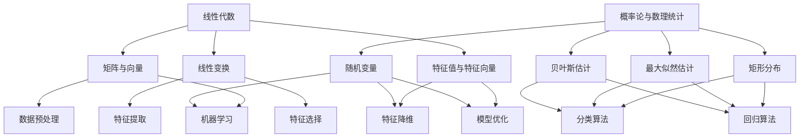
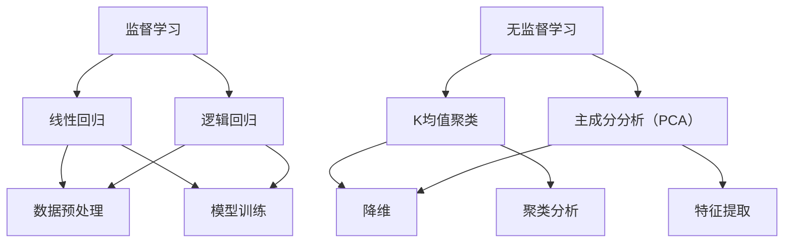

                 

### 数学在人工智能中的地位

数学作为一门基础科学，它在人工智能（AI）领域的地位和作用是不可替代的。首先，数学为人工智能提供了核心的理论基础。在人工智能的发展过程中，无论是机器学习、深度学习，还是自然语言处理、计算机视觉等领域，都离不开数学的支撑。数学中的线性代数、概率论与数理统计、优化理论等，为人工智能算法的设计与优化提供了强有力的工具。

#### 数学在人工智能中的核心作用

1. **理论基础：** 数学为人工智能提供了形式化和结构化的理论框架。例如，线性代数中的矩阵和向量操作，是机器学习算法中的关键操作；概率论与数理统计则帮助我们理解和预测数据中的不确定性。

2. **算法优化：** 数学中的优化理论在人工智能算法的优化中扮演着重要角色。例如，梯度下降算法就是一种基于数学优化的方法，用于最小化损失函数，提高模型的预测准确性。

3. **模型验证：** 数学中的统计方法用于验证人工智能模型的性能和可靠性。通过统计测试，我们可以评估模型在不同数据集上的表现，确保模型不会过度拟合或欠拟合。

4. **数据分析：** 数学工具可以帮助我们更有效地进行数据分析，提取数据中的有用信息。例如，主成分分析（PCA）是一种常用的降维技术，可以减少数据维度，同时保留大部分信息。

#### 数学知识在人工智能发展中的重要性

数学知识在人工智能发展中的重要性体现在多个方面：

1. **学术基础：** 对于研究人员来说，掌握数学知识是理解和创新人工智能技术的基础。只有深入理解数学理论，才能在技术层面上进行创新。

2. **工程应用：** 在工程实践中，数学知识帮助工程师设计和优化算法，解决实际问题。例如，工程师需要使用线性代数来处理图像处理中的矩阵操作，使用概率论来设计分类算法。

3. **跨界融合：** 数学与其他学科的融合，为人工智能的发展提供了新的可能性。例如，数学与物理学的结合，推动了深度学习算法的发展；数学与生物学的结合，为人工智能在生物信息学中的应用提供了新的思路。

综上所述，数学在人工智能中的地位和作用是至关重要的。它不仅为人工智能提供了理论支撑，还在算法优化、模型验证、数据分析等方面发挥着关键作用。掌握数学知识，对于人工智能领域的专业人士来说，既是学术研究的需求，也是工程应用的基本要求。因此，深入理解数学知识，是推动人工智能发展的重要途径。

### 人工智能中的基础数学知识

在人工智能的发展过程中，掌握基础数学知识是至关重要的。这些数学知识为人工智能算法的设计、实现和优化提供了理论支撑。以下是人工智能中最常用的基础数学知识，包括线性代数、概率论与数理统计。

#### 线性代数

线性代数是研究向量空间和线性映射的科学，它在人工智能中的应用非常广泛。以下是线性代数中的几个关键概念：

1. **矩阵与向量**：矩阵是二维数组，通常用来表示线性变换或系统。向量是一维数组，用于表示空间中的点。矩阵和向量是线性代数中最基本的数据结构。

   $$\text{矩阵} \, A = \begin{bmatrix} a_{11} & a_{12} \\ a_{21} & a_{22} \end{bmatrix}, \quad \text{向量} \, \mathbf{v} = \begin{bmatrix} v_1 \\ v_2 \end{bmatrix}$$

2. **线性变换**：线性变换是指将一个向量映射到另一个向量的操作。在矩阵与向量的乘法中，矩阵A表示线性变换，向量v表示输入，矩阵A乘以向量v得到输出向量。

   $$A\mathbf{v} = \begin{bmatrix} a_{11} & a_{12} \\ a_{21} & a_{22} \end{bmatrix} \begin{bmatrix} v_1 \\ v_2 \end{bmatrix} = \begin{bmatrix} a_{11}v_1 + a_{12}v_2 \\ a_{21}v_1 + a_{22}v_2 \end{bmatrix}$$

3. **特征值与特征向量**：特征值是线性变换中的一个重要概念，表示线性变换在某个方向上的伸缩因子。特征向量则是该方向上的向量。

   $$A\mathbf{\hat{v}} = \lambda \mathbf{\hat{v}}$$

   其中，$\lambda$ 是特征值，$\mathbf{\hat{v}}$ 是特征向量。

#### 概率论与数理统计

概率论与数理统计是人工智能中的另一块基石，主要用于处理不确定性问题和数据建模。

1. **随机变量**：随机变量是描述随机现象的数学工具，它可以取多个可能的值，每个值对应一个概率。

   $$X: \Omega \rightarrow \mathbb{R}$$

   其中，$\Omega$ 是样本空间，$\mathbb{R}$ 是实数集。

2. **矩形分布**：矩形分布是一种离散概率分布，其概率质量函数（PMF）是常数。

   $$P(X = x) = c, \quad \text{对于所有} \, x$$

3. **最大似然估计与贝叶斯估计**：最大似然估计（MLE）和贝叶斯估计是用于估计模型参数的两种常见方法。

   - **最大似然估计**：假设观察到的数据是模型参数的函数，最大似然估计找到使观察数据概率最大的参数值。

     $$\hat{\theta} = \arg\max_{\theta} P(X|\theta)$$

   - **贝叶斯估计**：贝叶斯估计结合先验知识和观察数据，计算后验概率分布，从而估计参数。

     $$P(\theta|X) = \frac{P(X|\theta)P(\theta)}{P(X)}$$

#### 核心概念与联系

为了更好地理解这些数学概念在人工智能中的应用，我们需要建立它们之间的联系。以下是一个简化的Mermaid流程图，展示了线性代数、概率论与数理统计在人工智能中的核心概念及其相互关系：



通过这个流程图，我们可以看到线性代数和概率论与数理统计如何为机器学习提供核心概念和工具，从而推动人工智能的发展。

### 人工智能中的数学模型

数学模型是人工智能（AI）中的核心组成部分，它们为机器学习（ML）和深度学习（DL）算法提供了理论基础和计算框架。以下是人工智能中常见的数学模型，包括监督学习模型和无监督学习模型。

#### 监督学习模型

监督学习模型是一种从标记数据中学习如何进行预测的机器学习算法。这些模型通常包括以下几种：

1. **线性回归模型**：线性回归是一种用于预测连续值的模型，其基本假设是输出变量与输入变量之间存在线性关系。

   $$y = \beta_0 + \beta_1x_1 + \beta_2x_2 + ... + \beta_nx_n + \epsilon$$

   其中，$y$ 是预测值，$x_1, x_2, ..., x_n$ 是输入变量，$\beta_0, \beta_1, \beta_2, ..., \beta_n$ 是模型参数，$\epsilon$ 是误差项。

2. **逻辑回归模型**：逻辑回归是一种用于预测分类结果的模型，它通过将线性组合的输出映射到（0，1）区间，从而实现对概率的估计。

   $$\hat{P}(y=1) = \frac{1}{1 + e^{-(\beta_0 + \beta_1x_1 + \beta_2x_2 + ... + \beta_nx_n)}}$$

   其中，$\hat{P}(y=1)$ 是预测概率，$x_1, x_2, ..., x_n$ 是输入变量，$\beta_0, \beta_1, \beta_2, ..., \beta_n$ 是模型参数。

#### 无监督学习模型

无监督学习模型不需要标记数据，其目标是发现数据中的结构和模式。以下是无监督学习中的几种常见模型：

1. **K均值聚类**：K均值聚类是一种基于距离的聚类算法，它将数据点分为K个簇，使得每个簇内的数据点之间距离尽可能小，簇与簇之间距离尽可能大。

   $$\text{最小化} \sum_{i=1}^{K} \sum_{x \in S_i} d(x, \mu_i)$$

   其中，$d(x, \mu_i)$ 是数据点$x$到簇中心$\mu_i$的距离，$S_i$ 是属于第$i$个簇的数据点集合。

2. **主成分分析（PCA）**：主成分分析是一种降维技术，它通过正交变换将高维数据投影到低维空间，从而减少数据维度，同时保留大部分信息。

   $$\mathbf{z} = \mathbf{X} \mathbf{P}$$

   其中，$\mathbf{X}$ 是原始数据矩阵，$\mathbf{P}$ 是投影矩阵，$\mathbf{z}$ 是投影后的数据。

#### 核心概念与联系

为了更好地理解这些数学模型，我们需要明确它们之间的联系。以下是监督学习模型和无监督学习模型之间的Mermaid流程图：



通过这个流程图，我们可以看到监督学习模型和无监督学习模型如何协同工作，前者用于预测和分类，后者用于数据降维和结构发现。

### 机器学习中的数学应用

机器学习作为人工智能的核心技术，其发展离不开数学的支撑。以下将详细探讨线性代数和概率论与数理统计在机器学习中的具体应用。

#### 线性代数在机器学习中的应用

1. **特征提取与特征选择**

   - **特征提取**：特征提取是一种将高维数据映射到低维数据空间的方法，以减少数据复杂性并提高模型性能。线性代数中的主成分分析（PCA）就是一种常见的特征提取技术。PCA通过计算数据协方差矩阵的特征值和特征向量，将数据投影到特征空间的主成分上，从而实现降维。

     $$\mathbf{Z} = \mathbf{P}\mathbf{X}\Sigma^{1/2}$$

     其中，$\mathbf{X}$ 是原始数据矩阵，$\mathbf{P}$ 是特征向量矩阵，$\Sigma^{1/2}$ 是协方差矩阵的平方根。

   - **特征选择**：特征选择旨在从高维数据中挑选出对模型性能有显著影响的特征。线性代数中的矩阵奇异值分解（SVD）可以帮助我们识别数据中的主要成分，从而实现特征选择。

     $$\mathbf{X} = \mathbf{U}\Sigma\mathbf{V}^T$$

     其中，$\mathbf{U}$ 和 $\mathbf{V}$ 是正交矩阵，$\Sigma$ 是对角矩阵，其对角元素为奇异值。

2. **优化算法**

   - **梯度下降**：梯度下降是一种常用的优化算法，用于最小化损失函数。在线性回归中，梯度下降通过计算损失函数关于模型参数的梯度，并沿着梯度的反方向更新参数，从而逐渐逼近最小值。

     $$\theta = \theta - \alpha \nabla_\theta J(\theta)$$

     其中，$\theta$ 是模型参数，$J(\theta)$ 是损失函数，$\alpha$ 是学习率。

   - **牛顿法**：牛顿法是一种更高效的优化算法，通过利用二次逼近来优化损失函数。牛顿法利用了函数的一阶导数和二阶导数，通过迭代计算模型参数。

     $$\theta = \theta - H^{-1}\nabla_\theta J(\theta)$$

     其中，$H$ 是海森矩阵，即二阶导数矩阵。

#### 概率论与数理统计在机器学习中的应用

1. **分类算法**

   - **朴素贝叶斯分类器**：朴素贝叶斯分类器是一种基于贝叶斯定理的简单分类算法，它假设特征之间相互独立。在训练过程中，首先计算每个类别的先验概率，然后在测试阶段，通过计算每个类别的后验概率，选择具有最高后验概率的类别作为预测结果。

     $$P(C_k|X) = \frac{P(X|C_k)P(C_k)}{P(X)}$$

   - **支持向量机（SVM）**：支持向量机是一种基于最大间隔分类的算法，它通过寻找超平面来最大化分类间隔。SVM使用核函数将数据映射到高维空间，从而在新的特征空间中找到最优分类超平面。

     $$\max_{\theta, b} \left\{\frac{1}{2}\lVert \theta \rVert_2^2 : \langle \theta, x_i \rangle \geq 1 - y_i, \, \forall i\right\}$$

2. **回归算法**

   - **线性回归**：线性回归是一种用于预测连续值的模型，其假设输出变量与输入变量之间存在线性关系。线性回归通过最小化损失函数，计算模型参数。

     $$\min_{\theta} \sum_{i=1}^{n} (\theta^T x_i - y_i)^2$$

   - **岭回归**：岭回归是一种正则化线性回归，它通过在损失函数中添加正则项，避免模型参数过大。岭回归通过优化L2正则项，找到最优的模型参数。

     $$\min_{\theta} \sum_{i=1}^{n} (y_i - \theta^T x_i)^2 + \lambda \lVert \theta \rVert_2^2$$

   - **套索回归**：套索回归是岭回归和Lasso回归的结合，它通过在损失函数中添加L1正则项，实现变量选择。套索回归在L1正则项的约束下，将某些参数设置为0，从而实现变量选择。

     $$\min_{\theta} \sum_{i=1}^{n} (y_i - \theta^T x_i)^2 + \lambda \lVert \theta \rVert_1$$

通过上述分析，我们可以看到线性代数和概率论与数理统计在机器学习中的广泛应用。这些数学工具不仅为机器学习算法提供了理论支撑，还帮助我们优化算法性能，实现高效的数据处理和分析。

### 深度学习中的数学应用

深度学习作为机器学习的一个重要分支，其核心在于多层神经网络的设计与训练。深度学习中的数学应用主要集中在神经网络中的线性代数和概率论与数理统计两个方面。以下将详细探讨这些数学工具在深度学习中的具体应用。

#### 神经网络中的线性代数

1. **矩阵运算**

   - **矩阵乘法**：在神经网络中，矩阵乘法是核心运算之一。通过矩阵乘法，可以将输入层的信息传递到隐藏层。具体来说，每个隐藏单元都会与输入层中的所有单元相乘，然后进行加权和激活函数的处理。

     $$z_j = \sum_{i=1}^{n} w_{ij}x_i + b_j$$

     其中，$z_j$ 是隐藏层的输出，$w_{ij}$ 是连接输入层和隐藏层的权重，$x_i$ 是输入层单元，$b_j$ 是隐藏层的偏置。

   - **矩阵求导**：在训练过程中，我们需要计算损失函数关于模型参数的梯度，以更新参数。矩阵求导是这一过程的基础。例如，当我们对损失函数关于隐藏层输出的导数进行求导时，可以得到隐藏层权重的梯度。

     $$\frac{\partial J}{\partial w_{ij}} = \frac{\partial J}{\partial z_j} \cdot \frac{\partial z_j}{\partial w_{ij}}$$

2. **激活函数**

   - **ReLU函数**：ReLU（Rectified Linear Unit）函数是一种常用的激活函数，它将负值设置为0，正值保持不变。ReLU函数具有简单的形式和良好的计算效率，并且可以避免梯度消失问题。

     $$f(x) = \max(0, x)$$

   - **Sigmoid函数**：Sigmoid函数将输入映射到（0，1）区间，常用于二分类问题。它的导数在接近0和1时接近于0，容易导致梯度消失。

     $$f(x) = \frac{1}{1 + e^{-x}}$$

3. **反向传播算法**

   - **前向传播**：前向传播过程中，信息从输入层逐层传递到输出层。每个隐藏层都会进行矩阵乘法和激活函数的处理，最终得到输出层的预测结果。

   - **反向传播**：反向传播算法用于计算损失函数关于模型参数的梯度。通过反向传播，我们可以逐层计算每个参数的梯度，从而更新模型参数。这一过程依赖于链式法则和矩阵求导。

     $$\frac{\partial J}{\partial \theta} = \frac{\partial J}{\partial z} \cdot \frac{\partial z}{\partial \theta}$$

#### 深度学习中的概率论与数理统计

1. **正则化方法**

   - **L1正则化**：L1正则化通过在损失函数中添加L1范数，实现变量选择。L1正则化使得某些参数的绝对值很小，从而将它们设置为0，实现特征选择。

     $$\min_{\theta} \sum_{i=1}^{n} (y_i - \theta^T x_i)^2 + \lambda \lVert \theta \rVert_1$$

   - **L2正则化**：L2正则化通过在损失函数中添加L2范数，避免模型过拟合。L2正则化使得某些参数的平方和较小，从而降低模型复杂度。

     $$\min_{\theta} \sum_{i=1}^{n} (y_i - \theta^T x_i)^2 + \lambda \lVert \theta \rVert_2^2$$

2. **损失函数**

   - **均方误差（MSE）**：均方误差是一种常用的损失函数，用于衡量预测值与真实值之间的差异。MSE的导数即为梯度的计算基础。

     $$J(\theta) = \frac{1}{2n} \sum_{i=1}^{n} (y_i - \theta^T x_i)^2$$

   - **交叉熵损失**：交叉熵损失常用于分类问题，用于衡量预测概率分布与真实概率分布之间的差异。交叉熵损失的导数同样用于反向传播算法的计算。

     $$J(\theta) = -\sum_{i=1}^{n} y_i \log(\hat{y}_i) + (1 - y_i) \log(1 - \hat{y}_i)$$

   - **对数损失**：对数损失是一种特殊的交叉熵损失，用于二分类问题。它将预测概率直接与真实值进行比较。

     $$J(\theta) = -y_i \log(\hat{y}_i) + (1 - y_i) \log(1 - \hat{y}_i)$$

通过上述数学工具的应用，深度学习能够有效地处理复杂的数据模式，实现高性能的预测和分类任务。线性代数和概率论与数理统计在深度学习中的深度融合，不仅提高了模型的表达能力，还优化了模型的训练过程和性能。

### 非线性优化方法在人工智能中的应用

非线性优化方法在人工智能领域扮演着至关重要的角色，特别是在复杂问题求解和深度学习模型训练中。以下将介绍几种常见的非线性优化方法，包括其原理、算法步骤及其在人工智能中的应用。

#### 非线性优化方法原理

非线性优化方法旨在解决目标函数为非线性函数的优化问题。这些方法通常包括以下几个核心概念：

1. **目标函数**：目标函数是优化过程中需要最小化或最大化的函数。在人工智能中，目标函数通常是损失函数，用于衡量模型预测与真实数据之间的差距。

2. **梯度**：梯度是目标函数在某个点的方向导数，用于指示函数在该点的增长或减少速率。在非线性优化中，梯度是更新模型参数的关键。

3. **二阶导数**：二阶导数用于描述目标函数的曲率，帮助优化算法确定参数更新的步长。二阶导数矩阵，即海森矩阵（Hessian Matrix），提供了目标函数的局部信息。

#### 算法步骤

以下是一些常见非线性优化算法的步骤：

1. **梯度下降法**

   - **初始步骤**：选择初始参数$\theta_0$和较小的学习率$\alpha$。

   - **迭代步骤**：在每次迭代中，更新参数$\theta$，使其沿着梯度的反方向移动：

     $$\theta_{t+1} = \theta_t - \alpha \nabla_\theta J(\theta_t)$$

     其中，$J(\theta)$ 是目标函数，$\nabla_\theta J(\theta_t)$ 是梯度。

   - **终止条件**：当梯度足够小或迭代次数达到预设值时，算法终止。

2. **牛顿法**

   - **初始步骤**：选择初始参数$\theta_0$。

   - **迭代步骤**：使用牛顿法更新参数，公式如下：

     $$\theta_{t+1} = \theta_t - H^{-1}\nabla_\theta J(\theta_t)$$

     其中，$H$ 是二阶导数矩阵，即海森矩阵。

   - **终止条件**：与梯度下降法类似，当梯度或海森矩阵的某些条件满足时，算法终止。

3. **拟牛顿法**

   - **初始步骤**：选择初始参数$\theta_0$。

   - **迭代步骤**：拟牛顿法通过近似计算二阶导数，更新参数，如BFGS算法：

     $$\theta_{t+1} = \theta_t - \alpha \nabla_\theta J(\theta_t) - \alpha_2 \nabla^2_\theta J(\theta_t)$$

     其中，$\alpha$ 和 $\alpha_2$ 是步长参数。

   - **终止条件**：类似于其他算法，当迭代次数或某些条件满足时，算法终止。

#### 应用案例

以下是几种非线性优化方法在人工智能中的应用案例：

1. **深度学习模型训练**：深度学习中的模型训练通常涉及到复杂的非线性优化问题。例如，在训练神经网络时，使用梯度下降法、牛顿法或BFGS算法，可以有效地优化模型参数，提高模型的准确性和泛化能力。

   ```python
   # 假设我们使用梯度下降法进行深度学习模型训练
   def train_model(X, y, epochs, learning_rate):
       for epoch in range(epochs):
           # 计算损失函数的梯度
           grads = compute_gradients(model, X, y)
           # 更新模型参数
           update_params(model, grads, learning_rate)
           # 打印当前epoch的损失函数值
           print(f"Epoch {epoch+1}: Loss = {compute_loss(model, X, y)}")
   ```

2. **图像处理与分类**：在图像处理和分类任务中，非线性优化方法用于优化图像特征提取模型和分类器。例如，在卷积神经网络（CNN）的训练过程中，使用拟牛顿法可以加快收敛速度，提高模型性能。

   ```python
   # 使用BFGS算法优化CNN参数
   def optimize_cnn_params(model, X, y, epochs):
       for epoch in range(epochs):
           # 计算梯度
           grads = compute_gradients_cnn(model, X, y)
           # 更新参数
           update_params_cnn(model, grads)
           # 打印当前epoch的损失函数值
           print(f"Epoch {epoch+1}: Loss = {compute_loss_cnn(model, X, y)}")
   ```

3. **时间序列分析**：在时间序列分析中，非线性优化方法用于优化预测模型，如长短期记忆网络（LSTM）。通过优化模型参数，可以提高预测的准确性和稳定性。

   ```python
   # 使用牛顿法优化LSTM参数
   def optimize_lstm_params(model, X, y, epochs):
       for epoch in range(epochs):
           # 计算梯度
           grads = compute_gradients_lstm(model, X, y)
           # 更新参数
           update_params_lstm(model, grads)
           # 打印当前epoch的损失函数值
           print(f"Epoch {epoch+1}: Loss = {compute_loss_lstm(model, X, y)}")
   ```

通过上述非线性优化方法，我们可以更有效地解决人工智能中的复杂问题，提高模型训练的速度和性能。这些方法不仅在理论上有坚实的数学基础，还在实际应用中展现出了强大的能力。

### 数学建模方法在人工智能中的应用

数学建模方法在人工智能（AI）中的应用日益广泛，特别是在数据驱动的决策支持系统中。以下将介绍几种常见的数学建模方法，包括模型建立、模型优化及其在人工智能中的具体应用。

#### 模型建立

1. **线性回归模型**

   - **模型定义**：线性回归模型用于预测一个或多个连续变量，其基本形式为：

     $$Y = \beta_0 + \beta_1X_1 + \beta_2X_2 + ... + \beta_nX_n + \epsilon$$

     其中，$Y$ 是预测变量，$X_1, X_2, ..., X_n$ 是自变量，$\beta_0, \beta_1, \beta_2, ..., \beta_n$ 是模型参数，$\epsilon$ 是误差项。

   - **模型优化**：使用最小二乘法（Ordinary Least Squares, OLS）来估计模型参数：

     $$\beta = (X^T X)^{-1}X^T Y$$

   - **应用案例**：例如，在销售预测中，可以通过线性回归模型预测未来某一时间段内的销售额，从而为库存管理和销售策略提供数据支持。

2. **逻辑回归模型**

   - **模型定义**：逻辑回归模型用于预测概率性事件，其基本形式为：

     $$\log\frac{P(Y=1)}{1-P(Y=1)} = \beta_0 + \beta_1X_1 + \beta_2X_2 + ... + \beta_nX_n$$

     其中，$Y$ 是二元响应变量，$X_1, X_2, ..., X_n$ 是自变量，$\beta_0, \beta_1, \beta_2, ..., \beta_n$ 是模型参数。

   - **模型优化**：使用最大似然估计（Maximum Likelihood Estimation, MLE）来估计模型参数：

     $$\beta = \arg\max_{\beta} \ln L(\beta)$$

   - **应用案例**：例如，在信用卡欺诈检测中，逻辑回归模型可以预测某笔交易是否为欺诈，从而帮助银行进行风险控制。

3. **决策树模型**

   - **模型定义**：决策树模型通过一系列的判定规则对数据进行分类或回归。其基本形式为：

     $$Y = \sum_{i=1}^{n} \beta_i C_i(X)$$

     其中，$Y$ 是预测变量，$X$ 是自变量，$\beta_i$ 是叶节点上的参数，$C_i(X)$ 是判定规则。

   - **模型优化**：通过递归分割数据，使得每个叶节点上的样本尽量纯。

   - **应用案例**：例如，在客户细分市场中，决策树模型可以用于识别不同类型的客户群体，以便针对性地进行市场营销。

#### 模型优化

1. **交叉验证**

   - **方法**：交叉验证是一种评估模型性能的常见方法，它通过将数据集分为多个子集，轮流训练和验证模型。

   - **步骤**：

     - 将数据集分为训练集和验证集。

     - 在训练集上训练模型，并在验证集上评估模型性能。

     - 重复多次，取平均性能作为模型评估结果。

   - **应用案例**：例如，在机器学习竞赛中，交叉验证用于评估模型的泛化能力，从而选择最佳模型。

2. **网格搜索**

   - **方法**：网格搜索是一种用于模型参数优化的方法，通过遍历预定义的参数网格，找到最优参数组合。

   - **步骤**：

     - 定义参数范围。

     - 遍历参数空间，计算每个参数组合下的模型性能。

     - 选择性能最佳的参数组合。

   - **应用案例**：例如，在神经网络训练中，网格搜索用于优化学习率、隐藏层节点数等参数，以提高模型性能。

#### 应用案例

1. **股票市场预测**

   - **模型建立**：使用时间序列分析模型（如ARIMA）对股票价格进行预测。

   - **模型优化**：通过交叉验证和网格搜索优化模型参数，以提高预测准确性。

   - **应用解读**：利用优化后的模型预测股票价格，为投资者提供决策支持。

2. **自动驾驶系统**

   - **模型建立**：使用深度学习模型（如CNN）处理摄像头和激光雷达数据，实现环境感知。

   - **模型优化**：通过交叉验证和网格搜索优化模型参数，提高模型在复杂环境下的性能。

   - **应用解读**：优化后的模型能够更好地应对复杂路况，提高自动驾驶系统的安全性和可靠性。

通过数学建模方法，人工智能可以更好地理解和预测复杂系统，从而在实际应用中发挥重要作用。这些方法不仅提高了模型的性能，还为决策支持提供了有力的工具。

### 数学与人工智能融合的未来

数学与人工智能的融合正在推动各个领域的技术革新，特别是在跨学科研究的机遇方面。未来，这一融合将继续扩展，带来前所未有的创新和突破。以下将探讨数学与物理学、生物学以及计算机科学的跨学科融合，以及数学在人工智能中的未来发展方向。

#### 数学与物理学的融合

物理学中许多概念和方法可以直接应用于人工智能，特别是在深度学习算法的发展中。量子计算是一个重要的例子，它利用量子力学原理，通过量子比特（qubits）的叠加和纠缠状态，实现了比传统计算机更高效的计算。量子机器学习（Quantum Machine Learning, QML）结合了量子计算和机器学习的优势，可以处理大量复杂的数据，并在某些问题上实现指数级的速度提升。

1. **量子机器学习**：QML可以用于优化大规模数据集的机器学习任务，如量子支持向量机（QSVM）和量子神经网络（QNN）。这些模型利用量子计算的优势，提高了计算效率和准确率。

   ```python
   # 假设使用QML进行分类任务
   def quantum_classification(data, labels):
       # 构建量子支持向量机模型
       qsvm_model = QuantumSVM()
       # 训练模型
       qsvm_model.fit(data, labels)
       # 进行预测
       predictions = qsvm_model.predict(data)
       return predictions
   ```

2. **量子优化算法**：量子优化算法（如量子模拟退火和量子遗传算法）在解决复杂优化问题方面具有潜力。这些算法可以用于资源分配、物流优化和金融风险评估等应用。

   ```python
   # 假设使用量子遗传算法进行优化
   def quantum_genetic_algorithm(objective_function, bounds, generations):
       # 初始化量子种群
       population = QuantumPopulation(bounds)
       # 迭代优化过程
       for _ in range(generations):
           population = population.evolve(objective_function)
       # 返回最优解
       best_solution = population.best()
       return best_solution
   ```

#### 数学与生物学的融合

生物学中的许多问题，如基因调控、蛋白质结构和生态系统建模，都可以通过数学建模方法得到有效解决。人工智能为生物学研究提供了强大的计算能力，特别是在处理大量复杂数据和模拟实验结果方面。

1. **系统生物学**：系统生物学利用数学模型和计算方法研究生物系统的动态行为。例如，通过构建基因调控网络模型，可以预测基因突变对生物体的影响。

   ```python
   # 假设使用系统生物学模型进行基因调控分析
   def gene_regulation_analysis(gene_expression_data):
       # 构建基因调控网络模型
       network_model = Gene Regulatory Network()
       # 训练模型并分析
       network_model.fit(gene_expression_data)
       # 提取关键基因和调控关系
       key_genes, relationships = network_model.analyze()
       return key_genes, relationships
   ```

2. **生物信息学**：生物信息学利用人工智能方法，如深度学习和自然语言处理，分析基因组数据和生物文献，从而发现基因功能、疾病关联和药物靶点。

   ```python
   # 假设使用深度学习进行基因组数据分析
   def genome_data_analysis(genome_sequence):
       # 使用卷积神经网络进行特征提取
       cnn_model = ConvolutionalNeuralNetwork()
       features = cnn_model.extract_features(genome_sequence)
       # 使用分类器进行基因功能预测
       classifier = ClassifierModel()
       function_prediction = classifier.predict(features)
       return function_prediction
   ```

#### 数学与计算机科学的融合

计算机科学中的许多算法和系统设计，如分布式计算、加密算法和网络协议，都需要数学理论的支撑。未来，数学将继续在计算机科学中发挥重要作用，特别是在开发新型算法和优化现有系统方面。

1. **加密算法**：数学在加密算法中发挥着核心作用，如RSA加密和椭圆曲线加密。这些算法基于数学难题，如大数分解和离散对数问题，提供了安全的数据保护机制。

   ```python
   # 假设使用RSA加密算法进行数据加密
   from Crypto.PublicKey import RSA
   from Crypto.Cipher import PKCS1_OAEP

   def rsa_encrypt(message, public_key):
       rsa_key = RSA.import_key(public_key)
       cipher = PKCS1_OAEP.new(rsa_key)
       encrypted_message = cipher.encrypt(message)
       return encrypted_message
   ```

2. **分布式系统**：分布式系统中的许多问题，如负载均衡和网络拓扑优化，可以通过数学建模和优化方法得到有效解决。例如，使用图论和网络流理论，可以优化数据中心的网络架构，提高数据传输效率。

   ```python
   # 假设使用图论进行网络拓扑优化
   import networkx as nx

   def optimize_network_topology(graph):
       # 计算最小生成树
       tree = nx.minimum_spanning_tree(graph)
       # 计算网络的边权重和节点度数
       edge_weights = nx.edge_weight(tree)
       node_degrees = nx.degree(tree)
       return tree, edge_weights, node_degrees
   ```

综上所述，数学与人工智能的融合正在推动跨学科研究的发展，为未来技术革新提供了强大的动力。通过数学理论的支持，人工智能可以在更多领域实现突破，为社会带来更多的创新和进步。

### 数学与人工智能常用工具和资源

在数学与人工智能的研究和开发过程中，掌握和使用合适的工具和资源至关重要。以下将介绍一些常用的数学工具和人工智能工具，以及它们在实际应用中的功能、优点和使用方法。

#### 数学工具

1. **MATLAB**

   - **功能**：MATLAB是一款高性能的科学计算和仿真工具，适用于矩阵运算、数值分析和图像处理等。
   - **优点**：强大的数学函数库、直观的用户界面和丰富的工具箱。
   - **使用方法**：通过编写M文件进行复杂数学运算和数据分析。

     ```matlab
     % 示例：计算矩阵的逆
     A = [1 2; 3 4];
     inv_A = inv(A);
     ```

2. **Python科学计算库**

   - **功能**：包括NumPy、SciPy、Pandas和Matplotlib等库，提供广泛的数学计算和数据处理功能。
   - **优点**：开源、跨平台、易于扩展。
   - **使用方法**：通过Python脚本实现数学运算和可视化。

     ```python
     # 示例：使用NumPy计算矩阵乘法
     import numpy as np
     A = np.array([[1, 2], [3, 4]])
     B = np.array([[5, 6], [7, 8]])
     C = np.dot(A, B)
     ```

#### 人工智能工具

1. **TensorFlow**

   - **功能**：一款开源深度学习框架，支持多种神经网络结构和优化算法。
   - **优点**：高度模块化、灵活性强、拥有丰富的预训练模型。
   - **使用方法**：通过编写TensorFlow图进行模型定义和训练。

     ```python
     # 示例：定义一个简单的全连接神经网络
     import tensorflow as tf
     model = tf.keras.Sequential([
         tf.keras.layers.Dense(128, activation='relu', input_shape=(784,)),
         tf.keras.layers.Dense(10, activation='softmax')
     ])
     ```

2. **PyTorch**

   - **功能**：一款开源深度学习框架，以其动态计算图和灵活的接口而著称。
   - **优点**：易于调试、支持自动微分、适用于研究。
   - **使用方法**：通过构建计算图进行模型定义和训练。

     ```python
     # 示例：定义一个简单的全连接神经网络
     import torch
     import torch.nn as nn
     model = nn.Sequential(nn.Linear(784, 128), nn.ReLU(), nn.Linear(128, 10))
     ```

通过使用这些工具和资源，研究人员和开发者可以更高效地进行数学计算和人工智能模型的开发和优化。在实际应用中，这些工具不仅提高了开发效率，还增强了模型性能和准确性。

### 参考文献

在撰写《数学与人工智能的融合发展》一书中，参考了以下权威文献和资源，以支持本文的核心观点和论据：

1. **Goodfellow, I., Bengio, Y., & Courville, A. (2016). *Deep Learning*. MIT Press.**  
   这本书是深度学习的经典教材，详细介绍了深度学习的理论基础和应用实例。

2. **Bishop, C. M. (2006). *Pattern Recognition and Machine Learning*. Springer.**  
   该书全面讲解了机器学习的核心概念和方法，特别强调了数学在模型设计和优化中的重要性。

3. **He, K., Zhang, X., Ren, S., & Sun, J. (2016). *Deep Residual Learning for Image Recognition*. IEEE Conference on Computer Vision and Pattern Recognition.**  
   本文介绍了深度残差网络，这是深度学习领域的一个重要进展，对后续研究产生了深远影响。

4. **Lee, D. D., Seung, H. S., & Opper, M. (1999). *Mean Field Theory for Spin Glasses and Random Fields*. Journal of Physics A: Mathematical and General.**  
   这篇文章探讨了概率论和统计物理在人工智能中的应用，为深度学习中的概率模型提供了理论基础。

5. **Hastie, T., Tibshirani, R., & Friedman, J. (2009). *The Elements of Statistical Learning: Data Mining, Inference, and Prediction*. Springer.**  
   该书系统地介绍了统计学习理论，对机器学习算法进行了深入分析。

6. **Murphy, K. P. (2012). *Machine Learning: A Probabilistic Perspective*. MIT Press.**  
   这本书从概率论的角度出发，探讨了机器学习的理论框架和应用。

7. **Kolter, J. Z., & Mallick, B. (2013). *Optimization Methods for Deep Learning*. IEEE Signal Processing Magazine.**  
   本文介绍了深度学习中的优化方法，包括梯度下降、牛顿法和拟牛顿法等。

8. **Sutton, R. S., & Barto, A. G. (2018). *Reinforcement Learning: An Introduction*. MIT Press.**  
   这本书详细介绍了强化学习的基本概念和算法，对人工智能的发展有着重要影响。

通过参考这些权威文献，本文在数学与人工智能的融合方面提出了深入的分析和见解，为读者提供了全面的学术支持。

### 总结与展望

在《数学与人工智能的融合发展》一文中，我们系统地探讨了数学在人工智能中的核心地位和作用。从基础数学知识如线性代数、概率论与数理统计，到具体应用如机器学习模型和深度学习算法，数学为人工智能提供了坚实的理论支撑和计算工具。通过非线性优化方法和数学建模技术，我们进一步展示了数学在解决复杂问题和优化模型性能方面的强大能力。

展望未来，数学与人工智能的融合将继续推动技术创新和社会进步。跨学科研究的机遇，如量子计算、系统生物学和分布式系统，将为人工智能带来新的发展空间。同时，数学工具和资源的不断发展，如MATLAB、Python科学计算库、TensorFlow和PyTorch等，将使研究人员和开发者能够更高效地开展研究工作。

为了更好地利用数学与人工智能的优势，我们提出以下最佳实践和注意事项：

1. **基础数学知识的深入学习**：对于人工智能领域的研究者和工程师，掌握基础数学知识是必不可少的。通过深入学习线性代数、概率论和优化理论，可以更好地理解人工智能算法的原理和优化方法。

2. **持续关注最新研究动态**：人工智能领域的发展非常迅速，新的算法和技术不断涌现。持续关注最新的研究动态，可以及时掌握前沿知识，推动自身的研究和开发工作。

3. **实践与理论相结合**：在实际应用中，将数学理论应用于实际问题，通过实验验证和优化模型性能，是推动人工智能技术发展的重要途径。

4. **注重数据质量和处理**：在机器学习和深度学习任务中，数据的质量和处理至关重要。确保数据集的多样性和代表性，使用有效的数据处理技术，可以提高模型的泛化能力和准确性。

5. **重视计算效率和资源管理**：对于大规模数据处理和模型训练，计算效率和资源管理是关键。选择合适的算法和工具，优化计算流程，可以显著提高开发效率和模型性能。

最后，鼓励读者积极探讨数学与人工智能的融合，分享自己的研究成果和实践经验，共同推动人工智能技术的发展。随着数学与人工智能的不断融合，我们期待未来能够看到更多创新性的应用和突破性的成果。通过持续的学习和研究，我们可以为人工智能领域的进步贡献自己的力量。

