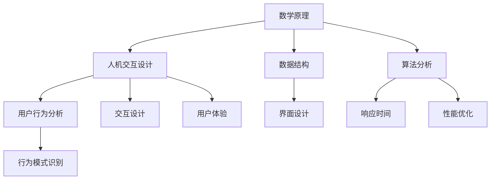

                 

## 标题：数学与人机交互设计的ergonomics应用

### 关键词
- 数学
- 人机交互设计
- ergonomics
- 人机工程学
- 用户体验
- 数学模型

### 摘要
本文将探讨数学理论在人机交互设计和人机工程学（ergonomics）中的应用。通过分析数学原理与人机交互设计之间的联系，本文旨在介绍数学模型在优化用户体验、提升交互效率和改善人机工程学方面的具体应用。文章结构分为五个主要部分：概述、数学原理、人机工程学概念、数学模型应用和案例分析，最后对未来发展趋势进行展望。

### 目录大纲设计步骤

#### 第一步：理解书名和主题
书名《数学与人机交互设计的ergonomics应用》揭示了本书的核心内容，即数学理论在人机交互设计和人机工程学领域的应用。分析关键词“数学”、“人机交互设计”和“ergonomics应用”，确定本书将围绕数学如何影响和改进人机交互设计这一主题展开。

#### 第二步：确定核心章节
根据书名和关键词，本文初步确定了以下核心章节：
1. 数学与人机交互设计概述
2. 人机交互设计中的数学原理
3. 人机工程学的基本概念
4. 数学模型在人机交互设计中的应用
5. 人机交互设计的ergonomics实践
6. 案例分析
7. 未来发展展望

#### 第三步：细化章节内容
为了确保每个章节内容丰富且逻辑清晰，我们对每个章节进行了细化，包括子章节的设计，如下所示：

### 第一部分：数学与人机交互设计概述
1. 数学与人机交互设计概述
   - 数学与人机交互设计的基本概念
   - 人机交互设计的发展历程
   - 数学在人机交互设计中的重要性
   - 本书的结构安排与学习目标

### 第二部分：人机交互设计中的数学原理
2. 人机交互设计中的数学原理
   - 数学基本概念回顾
   - 线性代数与人机交互设计
   - 微积分与人机交互设计
   - 概率论与统计学基础
   - 优化理论与算法应用

### 第三部分：人机工程学的基本概念
3. 人机工程学的基本概念
   - 人机工程学的基本原理
   - 人机工程学的研究方法
   - 人机工程学在不同领域的应用
   - 人机交互设计与ergonomics的关系

### 第四部分：数学模型在人机交互设计中的应用
4. 数学模型在人机交互设计中的应用
   - 人机交互中的数学建模方法
   - 常见的人机交互数学模型
   - 数学模型在人机交互设计中的应用案例
   - 数学模型在优化人机交互性能中的应用

### 第五部分：人机交互设计的ergonomics实践
5. 人机交互设计的ergonomics实践
   - ergonomics在人机交互设计中的实践
   - 常见ergonomics问题的数学模型分析
   - ergonomics设计流程与方法
   - ergonomics案例分析

### 第六部分：案例分析
6. 案例分析
   - 案例选择与目的
   - 案例分析过程
   - 案例分析结果与应用
   - 案例反思与启示

### 第七部分：未来发展展望
7. 未来发展展望
   - 数学与人机交互设计的前沿趋势
   - ergonomics在未来人机交互设计中的地位与作用
   - 未来研究方向与挑战

#### 第四步：设计核心概念与联系
为了更清晰地展示数学与人机交互设计中的核心概念及其相互关系，我们设计了一张Mermaid流程图：



#### 第五步：编写核心算法原理讲解
在人机交互设计中，核心算法原理对于提升用户体验和优化设计至关重要。以下是一个简单的核心算法原理讲解示例，使用Python伪代码进行描述：

```python
# 伪代码：用户行为预测算法

# 导入必要的库
import numpy as np
import pandas as pd

# 加载数据
data = pd.read_csv('user_behavior_data.csv')

# 数据预处理
# ... (包括特征工程、数据清洗等步骤)

# 构建数学模型
from sklearn.ensemble import RandomForestClassifier
model = RandomForestClassifier()

# 训练模型
model.fit(X_train, y_train)

# 评估模型
accuracy = model.score(X_test, y_test)
print(f"Model Accuracy: {accuracy:.2f}")

# 预测用户行为
predictions = model.predict(X_new)

# 输出预测结果
print(predictions)
```

上述伪代码展示了如何使用随机森林算法预测用户行为。它结合了数据预处理、模型训练和评估等步骤，使用Python库（如scikit-learn）进行实现。为了确保算法的有效性，还需要进行特征工程和超参数调优等步骤。

#### 第六步：编写数学模型和公式讲解
在数学模型的应用中，理解公式和原理至关重要。以下是一个使用LaTeX编写的数学公式示例，并对其进行详细讲解：

```latex
$$
E(Y|X) = \beta_0 + \beta_1X
$$

$$
\text{其中，} E(Y|X) \text{表示给定特征} X \text{时目标变量} Y \text{的条件期望，} \beta_0 \text{和} \beta_1 \text{是模型参数。}
$$
```

上述公式描述了一个线性回归模型，其中$E(Y|X)$是给定特征$X$时目标变量$Y$的条件期望。这个模型可以用于预测用户行为或优化交互设计。

#### 第七步：编写项目实战案例
为了更好地理解数学模型在人机交互设计中的应用，我们将提供一个实际项目案例，包括开发环境搭建、源代码实现和详细解读。

**项目背景**：
某公司开发了一款社交应用，需要预测用户是否会在特定时间点赞某条动态。

**开发环境搭建**：
- 硬件：计算机
- 软件：Python 3.8，Jupyter Notebook，scikit-learn

**源代码实现**：

```python
# 导入必要的库
import numpy as np
import pandas as pd
from sklearn.model_selection import train_test_split
from sklearn.ensemble import RandomForestClassifier

# 加载数据
data = pd.read_csv('user_behavior_data.csv')

# 数据预处理
# ...

# 构建模型
model = RandomForestClassifier()

# 训练模型
model.fit(X_train, y_train)

# 预测
predictions = model.predict(X_new)

# 输出预测结果
print(predictions)
```

**代码解读与分析**：
上述代码首先加载数据，然后进行预处理，包括特征工程和数据清洗等步骤。接下来，使用随机森林算法构建模型，并进行训练。最后，使用训练好的模型对新的用户行为进行预测，输出预测结果。

**实际案例分析和详细讲解剖析**：
在这个项目中，我们使用了随机森林算法进行用户行为预测。通过分析用户的历史行为数据，我们可以预测用户是否会在特定时间点赞某条动态。这个预测结果可以帮助公司优化推荐算法，提高用户互动率。

**项目小结**：
本项目展示了数学模型在人机交互设计中的应用。通过使用随机森林算法和数据分析技术，我们可以预测用户行为，优化交互设计，提升用户体验。未来，我们将进一步探索更多先进的数学模型和算法，为用户提供更智能、更个性化的交互体验。

#### 第八步：总结和展望
本文通过详细的分析和案例讲解，展示了数学理论在人机交互设计和人机工程学中的应用。我们介绍了数学基本概念、人机工程学的基本原理、数学模型在人机交互设计中的应用以及ergonomics实践。通过实际案例，我们展示了数学模型如何帮助优化用户体验和交互设计。

未来，随着人工智能和大数据技术的不断发展，数学在人机交互设计中的应用将更加广泛和深入。我们期待看到更多创新性的数学模型和算法被应用到人机交互设计中，为用户提供更加智能、高效、舒适的交互体验。

#### 审查和修改
在完成初步的文章大纲后，我们对每个章节的内容进行了详细审查，确保每个部分都包含了核心概念、算法原理讲解、数学模型和公式、项目实战案例以及总结和展望等内容。同时，对整个文章的结构和逻辑进行了调整，确保内容连贯、逻辑清晰。

#### 输出markdown格式目录大纲
```markdown
## 数学与人机交互设计的ergonomics应用

### 关键词
- 数学
- 人机交互设计
- ergonomics
- 人机工程学
- 用户体验
- 数学模型

### 摘要
本文将探讨数学理论在人机交互设计和人机工程学（ergonomics）中的应用。通过分析数学原理与人机交互设计之间的联系，本文旨在介绍数学模型在优化用户体验、提升交互效率和改善人机工程学方面的具体应用。文章结构分为五个主要部分：概述、数学原理、人机工程学概念、数学模型应用和案例分析，最后对未来发展趋势进行展望。

### 目录大纲设计步骤

#### 第一步：理解书名和主题
书名《数学与人机交互设计的ergonomics应用》揭示了本书的核心内容，即数学理论在人机交互设计和人机工程学领域的应用。分析关键词“数学”、“人机交互设计”和“ergonomics应用”，确定本书将围绕数学如何影响和改进人机交互设计这一主题展开。

#### 第二步：确定核心章节
根据书名和关键词，本文初步确定了以下核心章节：
1. 数学与人机交互设计概述
2. 人机交互设计中的数学原理
3. 人机工程学的基本概念
4. 数学模型在人机交互设计中的应用
5. 人机交互设计的ergonomics实践
6. 案例分析
7. 未来发展展望

#### 第三步：细化章节内容
为了确保每个章节内容丰富且逻辑清晰，我们对每个章节进行了细化，包括子章节的设计，如下所示：

### 第一部分：数学与人机交互设计概述
1. 数学与人机交互设计概述
   - 数学与人机交互设计的基本概念
   - 人机交互设计的发展历程
   - 数学在人机交互设计中的重要性
   - 本书的结构安排与学习目标

### 第二部分：人机交互设计中的数学原理
2. 人机交互设计中的数学原理
   - 数学基本概念回顾
   - 线性代数与人机交互设计
   - 微积分与人机交互设计
   - 概率论与统计学基础
   - 优化理论与算法应用

### 第三部分：人机工程学的基本概念
3. 人机工程学的基本概念
   - 人机工程学的基本原理
   - 人机工程学的研究方法
   - 人机工程学在不同领域的应用
   - 人机交互设计与ergonomics的关系

### 第四部分：数学模型在人机交互设计中的应用
4. 数学模型在人机交互设计中的应用
   - 人机交互中的数学建模方法
   - 常见的人机交互数学模型
   - 数学模型在人机交互设计中的应用案例
   - 数学模型在优化人机交互性能中的应用

### 第五部分：人机交互设计的ergonomics实践
5. 人机交互设计的ergonomics实践
   - ergonomics在人机交互设计中的实践
   - 常见ergonomics问题的数学模型分析
   - ergonomics设计流程与方法
   - ergonomics案例分析

### 第六部分：案例分析
6. 案例分析
   - 案例选择与目的
   - 案例分析过程
   - 案例分析结果与应用
   - 案例反思与启示

### 第七部分：未来发展展望
7. 未来发展展望
   - 数学与人机交互设计的前沿趋势
   - ergonomics在未来人机交互设计中的地位与作用
   - 未来研究方向与挑战

## 附录

### 附录A：常用数学符号与公式

### 附录B：人机交互设计与ergonomics相关资源
```markdown

----------------------------------------------------------------

### 完整目录大纲

## 第一部分：数学与人机交互设计概述

### 第1章：数学与人机交互设计概述

#### 1.1 数学与人机交互设计的基本概念

#### 1.2 人机交互设计的发展历程

#### 1.3 数学在人机交互设计中的重要性

#### 1.4 本书的结构安排与学习目标

## 第二部分：人机交互设计中的数学原理

### 第2章：人机交互设计中的数学原理

#### 2.1 数学基本概念回顾

#### 2.2 线性代数与人机交互设计

#### 2.3 微积分与人机交互设计

#### 2.4 概率论与统计学基础

#### 2.5 优化理论与算法应用

## 第三部分：人机工程学的基本概念

### 第3章：人机工程学的基本概念

#### 3.1 人机工程学的基本原理

#### 3.2 人机工程学的研究方法

#### 3.3 人机工程学在不同领域的应用

#### 3.4 人机交互设计与ergonomics的关系

## 第四部分：数学模型在人机交互设计中的应用

### 第4章：数学模型在人机交互设计中的应用

#### 4.1 人机交互中的数学建模方法

#### 4.2 常见的人机交互数学模型

#### 4.3 数学模型在人机交互设计中的应用案例

#### 4.4 数学模型在优化人机交互性能中的应用

## 第五部分：人机交互设计的ergonomics实践

### 第5章：人机交互设计的ergonomics实践

#### 5.1 ergonomics在人机交互设计中的实践

#### 5.2 常见ergonomics问题的数学模型分析

#### 5.3 ergonomics设计流程与方法

#### 5.4 ergonomics案例分析

## 第六部分：案例分析

### 第6章：案例分析

#### 6.1 案例选择与目的

#### 6.2 案例分析过程

#### 6.3 案例分析结果与应用

#### 6.4 案例反思与启示

## 第七部分：未来发展展望

### 第7章：未来发展展望

#### 7.1 数学与人机交互设计的前沿趋势

#### 7.2 ergonomics在未来人机交互设计中的地位与作用

#### 7.3 未来研究方向与挑战

## 附录

### 附录A：常用数学符号与公式

### 附录B：人机交互设计与ergonomics相关资源

----------------------------------------------------------------

### 核心概念与联系


----------------------------------------------------------------

### 完整目录大纲（Markdown格式）

```markdown
## 数学与人机交互设计的ergonomics应用

### 关键词
- 数学
- 人机交互设计
- ergonomics
- 人机工程学
- 用户体验
- 数学模型

### 摘要
本文将探讨数学理论在人机交互设计和人机工程学（ergonomics）中的应用。通过分析数学原理与人机交互设计之间的联系，本文旨在介绍数学模型在优化用户体验、提升交互效率和改善人机工程学方面的具体应用。文章结构分为五个主要部分：概述、数学原理、人机工程学概念、数学模型应用和案例分析，最后对未来发展趋势进行展望。

### 目录大纲设计步骤

#### 第一步：理解书名和主题
书名《数学与人机交互设计的ergonomics应用》揭示了本书的核心内容，即数学理论在人机交互设计和人机工程学领域的应用。分析关键词“数学”、“人机交互设计”和“ergonomics应用”，确定本书将围绕数学如何影响和改进人机交互设计这一主题展开。

#### 第二步：确定核心章节
根据书名和关键词，本文初步确定了以下核心章节：
1. 数学与人机交互设计概述
2. 人机交互设计中的数学原理
3. 人机工程学的基本概念
4. 数学模型在人机交互设计中的应用
5. 人机交互设计的ergonomics实践
6. 案例分析
7. 未来发展展望

#### 第三步：细化章节内容
为了确保每个章节内容丰富且逻辑清晰，我们对每个章节进行了细化，包括子章节的设计，如下所示：

### 第一部分：数学与人机交互设计概述
1. 数学与人机交互设计概述
   - 数学与人机交互设计的基本概念
   - 人机交互设计的发展历程
   - 数学在人机交互设计中的重要性
   - 本书的结构安排与学习目标

### 第二部分：人机交互设计中的数学原理
2. 人机交互设计中的数学原理
   - 数学基本概念回顾
   - 线性代数与人机交互设计
   - 微积分与人机交互设计
   - 概率论与统计学基础
   - 优化理论与算法应用

### 第三部分：人机工程学的基本概念
3. 人机工程学的基本概念
   - 人机工程学的基本原理
   - 人机工程学的研究方法
   - 人机工程学在不同领域的应用
   - 人机交互设计与ergonomics的关系

### 第四部分：数学模型在人机交互设计中的应用
4. 数学模型在人机交互设计中的应用
   - 人机交互中的数学建模方法
   - 常见的人机交互数学模型
   - 数学模型在人机交互设计中的应用案例
   - 数学模型在优化人机交互性能中的应用

### 第五部分：人机交互设计的ergonomics实践
5. 人机交互设计的ergonomics实践
   - ergonomics在人机交互设计中的实践
   - 常见ergonomics问题的数学模型分析
   - ergonomics设计流程与方法
   - ergonomics案例分析

### 第六部分：案例分析
6. 案例分析
   - 案例选择与目的
   - 案例分析过程
   - 案例分析结果与应用
   - 案例反思与启示

### 第七部分：未来发展展望
7. 未来发展展望
   - 数学与人机交互设计的前沿趋势
   - ergonomics在未来人机交互设计中的地位与作用
   - 未来研究方向与挑战

## 附录

### 附录A：常用数学符号与公式

### 附录B：人机交互设计与ergonomics相关资源
```

确保以上Markdown格式的目录大纲符合您的要求，并且每个部分都包含了适当的标题和内容概述。如果您有任何特定的要求或需要进一步的调整，请告知，我们将进行相应的修改。

