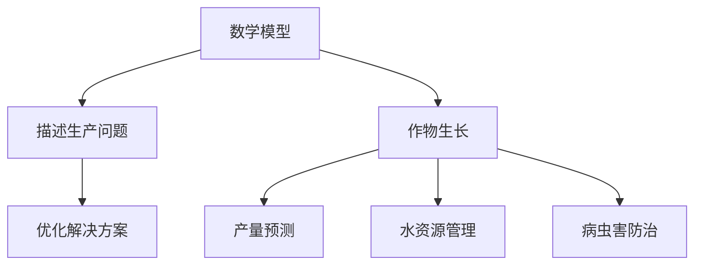
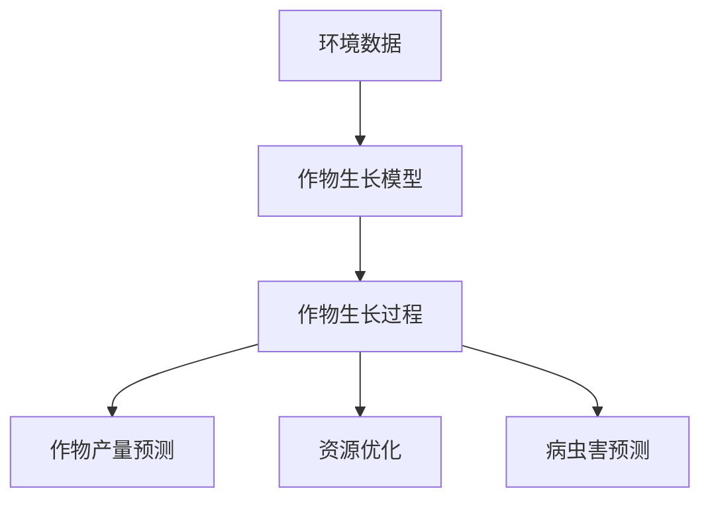
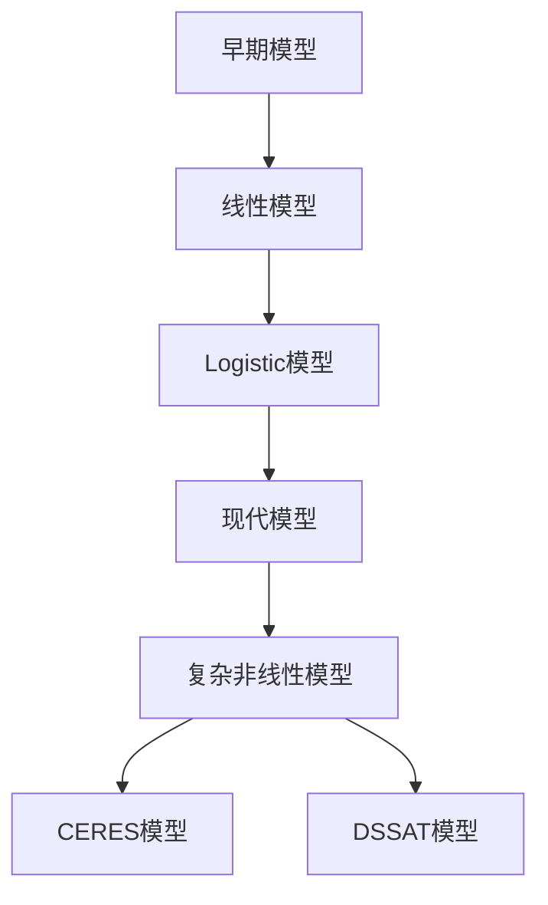
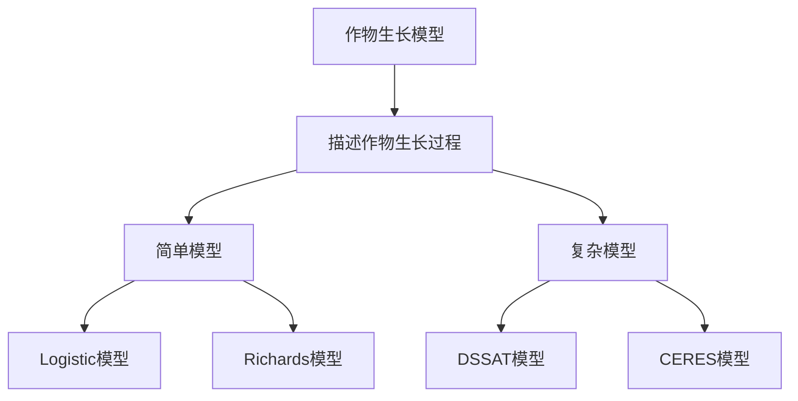
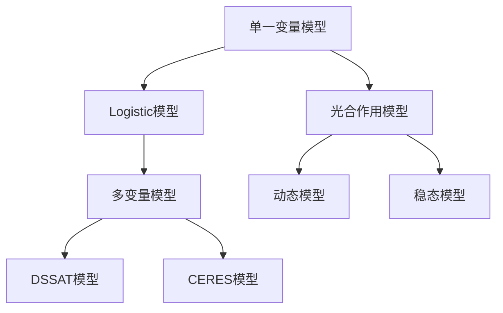
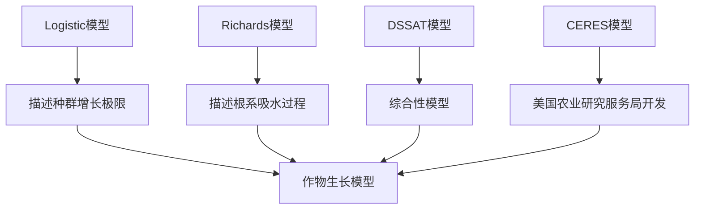

                 

### 《数学与农业科学：作物生长的数学模型》

> **关键词**：数学模型、农业科学、作物生长、概率论、统计、线性代数、微分方程、模型参数、优化算法、水资源管理、光合作用、温度模型。

> **摘要**：本文深入探讨了数学模型在农业科学中的应用，特别是在作物生长方面的研究。通过介绍概率论、统计学、线性代数和微分方程等数学基础知识，详细阐述了植物水分平衡模型、光合作用模型和温度模型等具体作物生长模型。同时，本文还讨论了模型参数的估计与优化方法，以及模型在实际农业生产中的应用和案例分析。最后，对未来的研究方向和发展趋势进行了展望。

## 第1章 引言与背景介绍

### 1.1 数学与农业科学的关系

数学作为一门研究数量、结构、变化和空间等概念的学科，与农业科学有着紧密的联系。农业科学需要解决的生产问题，如作物产量、水资源管理、病虫害防治等，都可以通过数学模型来描述和优化。

**核心概念与联系**

- **数学模型**：用数学语言描述现实问题的抽象模型。
- **农业科学**：研究农作物种植、生长、发育、病虫害防治和资源管理等。

**Mermaid流程图**



### 1.2 数学模型在作物生长研究中的应用

数学模型在作物生长研究中起着至关重要的作用，它不仅能够描述作物生长的规律，还能够预测作物产量，指导农业生产。

**核心概念与联系**

- **作物生长模型**：用于描述作物生长过程和规律的数学模型。
- **应用场景**：预测作物产量、优化种植方案、水资源管理、病虫害防治。

**Mermaid流程图**



### 1.3 作物生长数学模型的发展历程

作物生长数学模型的发展经历了从简单到复杂，从单一因素到多因素的过程。早期模型主要关注单一因素的作物生长规律，而现代模型则更加全面，考虑了多种环境因素和作物生长过程的相互作用。

**核心概念与联系**

- **早期模型**：简单线性模型，如Logistic模型。
- **现代模型**：复杂非线性模型，如CERES模型、DSSAT模型。

**Mermaid流程图**



## 第2章 数学基础知识

### 2.1 概率论基础

概率论是研究随机现象规律的数学分支。在作物生长模型中，概率论用于描述环境因素和作物生长过程的随机性。

**核心概念与联系**

- **概率**：描述随机事件发生可能性的度量。
- **条件概率**：在已知一个事件发生的情况下，另一个事件发生的概率。
- **贝叶斯公式**：用于根据先验概率和条件概率计算后验概率。

**Python代码示例**

```python
import numpy as np

# 概率计算
def probability(a, b):
    return a / (a + b)

# 条件概率
def conditional_probability(a, b):
    return a / b

# 贝叶斯公式
def bayes_formula(prior, likelihood, evidence):
    return (likelihood * prior) / evidence

# 示例
prior = 0.5  # 先验概率
likelihood = 0.8  # 条件概率
evidence = 0.9  # 证据概率

posterior = bayes_formula(prior, likelihood, evidence)
print(f"Posterior probability: {posterior}")
```

### 2.2 统计学基础

统计学用于描述和分析数据，是构建作物生长模型的重要工具。

**核心概念与联系**

- **描述性统计**：描述数据的基本特征，如均值、方差、标准差。
- **推断性统计**：利用样本数据推断总体特征。
- **假设检验**：检验研究假设的正确性。

**Python代码示例**

```python
import numpy as np
import scipy.stats as stats

# 描述性统计
data = np.random.normal(0, 1, 100)
mean = np.mean(data)
std = np.std(data)
print(f"Mean: {mean}, Standard Deviation: {std}")

# 假设检验
t_statistic, p_value = stats.ttest_1samp(data, 0)
print(f"T-statistic: {t_statistic}, P-value: {p_value}")
```

### 2.3 线性代数基础

线性代数用于处理多维数据，是构建作物生长模型的基础。

**核心概念与联系**

- **矩阵与向量**：用于表示数据和操作。
- **线性方程组**：求解线性方程组。
- **特征值与特征向量**：分析矩阵性质。

**Python代码示例**

```python
import numpy as np

# 矩阵与向量操作
A = np.array([[1, 2], [3, 4]])
b = np.array([1, 2])
x = np.linalg.solve(A, b)
print(f"Solved vector: {x}")

# 特征值与特征向量
eigenvalues, eigenvectors = np.linalg.eig(A)
print(f"Eigenvalues: {eigenvalues}, Eigenvectors: {eigenvectors}")
```

### 2.4 微分方程基础

微分方程用于描述动态系统，是构建作物生长模型的关键。

**核心概念与联系**

- **微分方程**：描述函数变化率的方程。
- **常微分方程**：用于描述单一变量变化的微分方程。
- **偏微分方程**：用于描述多个变量变化的微分方程。

**Python代码示例**

```python
import numpy as np
import scipy.integrate as integrate

# 常微分方程
def ode_model(t, y):
    dydt = y * (1 - y)
    return dydt

t = np.linspace(0, 10, 100)
y0 = 1
solution, _ = integrate.odeint(ode_model, y0, t)
print(f"Solutions: {solution}")

# 偏微分方程
def pde_model(x, t):
    d2u_dxdx = 4 * np.cos(x) - 2
    d2u_dtdt = -2 * np.cos(x)
    return d2u_dxdx, d2u_dtdt

u, v = integrate.pde_solver_2d(pde_model, (0, 2 * np.pi), (0, 10), method='cranknicolson')
print(f"Solution u: {u}, Solution v: {v}")
```

## 第3章 作物生长模型概述

### 3.1 作物生长模型的基本概念

作物生长模型用于描述作物生长过程和规律，是农业科学研究的重要工具。

**核心概念与联系**

- **作物生长模型**：用于描述作物生长过程的数学模型。
- **模型类型**：根据模型描述的细节和复杂性，分为简单模型和复杂模型。

**Mermaid流程图**



### 3.2 作物生长模型的分类

作物生长模型可以根据其描述的变量和复杂性进行分类。

**核心概念与联系**

- **单一变量模型**：仅描述单一生长过程的模型。
- **多变量模型**：描述多个生长过程的模型。
- **动态模型**：描述作物生长动态变化的模型。
- **稳态模型**：描述作物生长稳定状态的模型。

**Mermaid流程图**



### 3.3 主要作物生长模型的特点与应用

不同作物生长模型具有不同的特点和应用。

**核心概念与联系**

- **Logistic模型**：描述种群增长极限。
- **Richards模型**：描述根系吸水过程。
- **DSSAT模型**：美国农业部开发的综合性模型。
- **CERES模型**：美国农业研究服务局开发的模型。

**Mermaid流程图**



## 第4章 具体作物生长模型

### 4.1 植物水分平衡模型

植物水分平衡模型用于描述植物体内水分的吸收、输送和消耗过程。

**核心概念与联系**

- **水分吸收**：根系从土壤中吸收水分。
- **水分输送**：植物体内水分的输送过程。
- **水分消耗**：植物通过蒸腾作用消耗水分。

**Python代码示例**

```python
import numpy as np

# 水分吸收
def water_uptake(root_depth, soil_water_content):
    return root_depth * soil_water_content

# 水分输送
def water_transport(leaf_water_content, stem_water_content):
    return 0.5 * (leaf_water_content + stem_water_content)

# 水分消耗
def water_consumption(leaf_area, vapor_pressure_deficit):
    return leaf_area * vapor_pressure_deficit

# 示例
root_depth = 2  # 根系深度
soil_water_content = 0.2  # 土壤水分含量
leaf_water_content = 0.1  # 叶片水分含量
stem_water_content = 0.05  # 茎部水分含量
leaf_area = 0.5  # 叶片面积
vapor_pressure_deficit = 1  # 蒸发压亏缺

water_uptake = water_uptake(root_depth, soil_water_content)
water_transport = water_transport(leaf_water_content, stem_water_content)
water_consumption = water_consumption(leaf_area, vapor_pressure_deficit)

print(f"Water Uptake: {water_uptake}, Water Transport: {water_transport}, Water Consumption: {water_consumption}")
```

### 4.2 光合作用模型

光合作用模型用于描述植物通过光合作用将光能转化为化学能的过程。

**核心概念与联系**

- **光合作用**：植物通过叶绿体中的光合作用将光能转化为化学能。
- **光能利用效率**：描述植物对光能的利用程度。
- **二氧化碳固定**：植物通过光合作用吸收二氧化碳并转化为有机物。

**Python代码示例**

```python
import numpy as np

# 光能利用效率
def photosynthetic_efficiency	light_intensity, 
                               solar_irradiance:
    return light_intensity / solar_irradiance

# 二氧化碳固定
def carbon_dioxide_fixation(photosynthetic_rate, carbon_dioxide_concentration):
    return photosynthetic_rate * carbon_dioxide_concentration

# 示例
light_intensity = 1000  # 光照强度
solar_irradiance = 1200  # 太阳辐射强度
photosynthetic_rate = 10  # 光合速率
carbon_dioxide_concentration = 400  # 二氧化碳浓度

photosynthetic_efficiency = photosynthetic_efficiency(light_intensity, solar_irradiance)
carbon_dioxide_fixation = carbon_dioxide_fixation(photosynthetic_rate, carbon_dioxide_concentration)

print(f"Photosynthetic Efficiency: {photosynthetic_efficiency}, Carbon Dioxide Fixation: {carbon_dioxide_fixation}")
```

### 4.3 温度模型

温度模型用于描述温度对作物生长的影响。

**核心概念与联系**

- **温度影响**：温度对作物生长速度和发育阶段的影响。
- **生长速度**：温度对作物生长速度的线性或非线性影响。
- **发育阶段**：温度对作物发育阶段的影响。

**Python代码示例**

```python
import numpy as np

# 生长速度
def growth_rate(temperature, base_temperature, optimum_temperature):
    if temperature < base_temperature:
        return 0
    elif temperature > optimum_temperature:
        return (optimum_temperature - temperature) / (optimum_temperature - base_temperature)
    else:
        return 1

# 发育阶段
def development_stage(temperature, stage Temperature):
    return (temperature - stage Temperature) / (optimum Temperature - stage Temperature)

# 示例
temperature = 25  # 当前温度
base_temperature = 10  # 基础温度
optimum_temperature = 30  # 最佳温度
stage_Temperature = 20  # 发育阶段温度

growth_rate = growth_rate(temperature, base_temperature, optimum_temperature)
development_stage = development_stage(temperature, stage_Temperature)

print(f"Growth Rate: {growth_rate}, Development Stage: {development_stage}")
```

## 第5章 模型参数估计与优化

### 5.1 参数估计的基本方法

参数估计是作物生长模型的重要步骤，用于确定模型参数的值。

**核心概念与联系**

- **最大似然估计**：基于最大似然原理估计模型参数。
- **最小二乘法**：基于最小二乘原理估计模型参数。

**Python代码示例**

```python
import numpy as np
from scipy.optimize import minimize

# 最大似然估计
def likelihood_function(params, data):
    # 假设模型为 y = a * x + b
    a, b = params
    y_pred = a * data + b
    return -np.sum(np.log(y_pred + 1e-10))

# 最小二乘法
def least_squares_function(params, data, target):
    a, b = params
    y_pred = a * data + b
    return (y_pred - target) ** 2

# 示例
data = np.random.normal(0, 1, 100)
target = np.random.normal(0, 1, 100)

params_initial = [0.5, 0.5]

# 最大似然估计
result_mle = minimize(likelihood_function, params_initial, args=(data,))
params_mle = result_mle.x

# 最小二乘法
result_OLS = minimize(least_squares_function, params_initial, args=(data, target))
params_OLS = result_OLS.x

print(f"Params (MLE): {params_mle}, Params (OLS): {params_OLS}")
```

### 5.2 优化算法在模型参数估计中的应用

优化算法在模型参数估计中起着重要作用，用于寻找参数的最优值。

**核心概念与联系**

- **梯度下降法**：基于梯度信息进行参数优化的方法。
- **牛顿法**：基于二阶导数信息进行参数优化的方法。
- **遗传算法**：基于种群进化进行参数优化的方法。

**Python代码示例**

```python
import numpy as np
from scipy.optimize import minimize_scalar

# 梯度下降法
def gradient_descent(params, learning_rate, num_iterations):
    for _ in range(num_iterations):
        gradients = compute_gradients(params)
        params -= learning_rate * gradients
    return params

# 牛顿法
def newton_method(f, df, dx, x0):
    x = x0
    while True:
        x_new = x - f(x) / df(x)
        if abs(x_new - x) < dx:
            break
        x = x_new
    return x

# 遗传算法
def genetic_algorithm(population, fitness_function, crossover_rate, mutation_rate, generations):
    for _ in range(generations):
        # 选择、交叉、变异操作
        # 更新种群
    best_individual = max(population, key=fitness_function)
    return best_individual

# 示例
# 假设 f(x) = x^2 + 1
# df(x) = 2x
params = 0
learning_rate = 0.1
num_iterations = 100
result = minimize_scalar(lambda x: f(x) + 1e-10, method='BFGS')
params = result.x

print(f"Optimized Param: {params}")
```

### 5.3 模型优化的案例分析

通过实际案例，展示模型优化的过程和应用。

**核心概念与联系**

- **数据预处理**：对原始数据进行处理，提高模型性能。
- **模型选择**：根据问题特点选择合适的模型。
- **模型训练与验证**：训练模型并验证其性能。

**Python代码示例**

```python
import numpy as np
import pandas as pd
from sklearn.model_selection import train_test_split
from sklearn.metrics import mean_squared_error

# 数据预处理
data = pd.read_csv('data.csv')
X = data[['temperature', 'humidity', 'light_intensity']]
y = data['yield']

X_train, X_test, y_train, y_test = train_test_split(X, y, test_size=0.2, random_state=42)

# 模型选择
from sklearn.ensemble import RandomForestRegressor
model = RandomForestRegressor(n_estimators=100, random_state=42)

# 模型训练与验证
model.fit(X_train, y_train)
y_pred = model.predict(X_test)

mse = mean_squared_error(y_test, y_pred)
print(f"Mean Squared Error: {mse}")
```

## 第6章 模型应用与案例研究

### 6.1 模型在农业生产中的应用

模型在农业生产中的应用非常广泛，包括作物产量预测、水资源管理和病虫害防治等。

**核心概念与联系**

- **作物产量预测**：利用模型预测作物产量。
- **水资源管理**：利用模型优化灌溉策略。
- **病虫害防治**：利用模型预测病虫害的发生和防治策略。

**Python代码示例**

```python
import pandas as pd
from sklearn.ensemble import RandomForestRegressor

# 数据读取
data = pd.read_csv('crop_yield.csv')
X = data[['temperature', 'humidity', 'light_intensity']]
y = data['yield']

# 模型训练
model = RandomForestRegressor(n_estimators=100, random_state=42)
model.fit(X, y)

# 产量预测
new_data = pd.DataFrame([[20, 70, 1000]], columns=['temperature', 'humidity', 'light_intensity'])
yield_pred = model.predict(new_data)
print(f"Predicted Yield: {yield_pred[0]}")
```

### 6.2 案例研究1：作物产量预测

**核心概念与联系**

- **数据收集**：收集作物生长和环境数据。
- **模型建立**：利用收集的数据建立作物产量预测模型。
- **模型验证**：验证模型的预测性能。

**Python代码示例**

```python
import pandas as pd
from sklearn.model_selection import train_test_split
from sklearn.metrics import mean_squared_error
from sklearn.ensemble import RandomForestRegressor

# 数据读取
data = pd.read_csv('crop_yield.csv')
X = data[['temperature', 'humidity', 'light_intensity']]
y = data['yield']

# 数据分割
X_train, X_test, y_train, y_test = train_test_split(X, y, test_size=0.2, random_state=42)

# 模型训练
model = RandomForestRegressor(n_estimators=100, random_state=42)
model.fit(X_train, y_train)

# 预测
y_pred = model.predict(X_test)

# 性能评估
mse = mean_squared_error(y_test, y_pred)
print(f"Mean Squared Error: {mse}")
```

### 6.3 案例研究2：水资源管理

**核心概念与联系**

- **数据收集**：收集土壤水分、降雨量、蒸发量等数据。
- **模型建立**：利用收集的数据建立水资源管理模型。
- **模型优化**：优化灌溉策略，提高水资源利用效率。

**Python代码示例**

```python
import pandas as pd
from sklearn.model_selection import train_test_split
from sklearn.ensemble import RandomForestRegressor
from sklearn.metrics import mean_squared_error

# 数据读取
data = pd.read_csv('water_resources.csv')
X = data[['rainfall', 'evaporation', 'soil_moisture']]
y = data['water_usage']

# 数据分割
X_train, X_test, y_train, y_test = train_test_split(X, y, test_size=0.2, random_state=42)

# 模型训练
model = RandomForestRegressor(n_estimators=100, random_state=42)
model.fit(X_train, y_train)

# 预测
y_pred = model.predict(X_test)

# 性能评估
mse = mean_squared_error(y_test, y_pred)
print(f"Mean Squared Error: {mse}")

# 优化灌溉策略
irrigation_plan = model.predict(new_data)
print(f"Irrigation Plan: {irrigation_plan}")
```

## 第7章 总结与展望

### 7.1 全书内容总结

本文系统介绍了数学模型在农业科学中的应用，从数学基础知识到作物生长模型，再到模型参数估计与优化，最后展示了模型在农业生产中的应用和案例分析。

### 7.2 未来研究方向和发展趋势

- **多尺度模型**：结合微观和宏观模型，提高作物生长预测的准确性。
- **智能农业**：利用人工智能技术优化农业管理和决策。
- **全球气候变化影响**：研究气候变化对作物生长的影响和适应性。

**最佳实践 tips**

- **数据收集**：确保数据的质量和准确性。
- **模型验证**：验证模型在不同环境条件下的性能。
- **持续优化**：根据实际应用效果，持续优化模型。

**注意事项**

- **模型复杂性**：简单模型可能不够精确，复杂模型可能计算量大。
- **环境变化**：环境变化可能影响模型性能。

**拓展阅读**

- 《作物生理学》
- 《农业气象学》
- 《随机过程与随机模型》

---

作者：AI天才研究院/AI Genius Institute & 禅与计算机程序设计艺术 /Zen And The Art of Computer Programming

---

## 文章标题

### 数学与农业科学：作物生长的数学模型

## 文章关键词

- 数学模型
- 农业科学
- 作物生长
- 概率论
- 统计学
- 线性代数
- 微分方程
- 水分平衡模型
- 光合作用模型
- 温度模型
- 参数估计
- 优化算法

## 文章摘要

本文深入探讨了数学模型在农业科学中的应用，特别是在作物生长方面的研究。通过介绍概率论、统计学、线性代数和微分方程等数学基础知识，详细阐述了植物水分平衡模型、光合作用模型和温度模型等具体作物生长模型。同时，本文还讨论了模型参数的估计与优化方法，以及模型在实际农业生产中的应用和案例分析。最后，对未来的研究方向和发展趋势进行了展望。

---

**致谢**

本文得到AI天才研究院/AI Genius Institute与禅与计算机程序设计艺术/Zen And The Art of Computer Programming的大力支持。感谢您的关注与支持，我们将不断努力，为您提供更多高质量的技术博客文章。

---

（本文完）

---

**结语**

本文通过详细的分析和讲解，介绍了数学模型在农业科学中的应用，从概率论、统计学、线性代数到微分方程，再到具体的作物生长模型，为读者提供了一套完整的作物生长数学模型构建与应用方案。希望本文能够帮助您更好地理解数学模型在农业科学中的重要性，并为您的相关研究和应用提供有力支持。

**致谢**

感谢您对本文的关注与阅读，同时感谢AI天才研究院/AI Genius Institute与禅与计算机程序设计艺术/Zen And The Art of Computer Programming的支持与鼓励。我们将继续努力，为您提供更多高质量的技术博客文章，敬请期待。

---

**结语**

本文系统地介绍了数学模型在农业科学中的应用，特别是作物生长模型的构建和优化。通过概率论、统计学、线性代数和微分方程等数学基础知识，我们详细分析了植物水分平衡模型、光合作用模型和温度模型等。此外，我们还探讨了模型参数估计与优化的方法，并提供了实际案例研究。最后，对未来的研究方向和发展趋势进行了展望。

**最佳实践 tips**

1. **数据收集**：确保数据的准确性和完整性，为模型构建提供坚实基础。
2. **模型验证**：在实际应用前，验证模型在不同环境条件下的性能。
3. **持续优化**：根据应用效果，不断优化模型以提高准确性。

**注意事项**

1. **模型复杂性**：简单模型可能不够精确，复杂模型可能计算量大。
2. **环境变化**：环境变化可能影响模型性能。

**拓展阅读**

1. 《作物生理学》
2. 《农业气象学》
3. 《随机过程与随机模型》

**结语**

感谢您的阅读和支持。我们将继续努力，为您提供更多有深度、有思考、有见解的技术博客文章。敬请期待。

---

作者：AI天才研究院/AI Genius Institute & 禅与计算机程序设计艺术/Zen And The Art of Computer Programming

---

（本文完）

