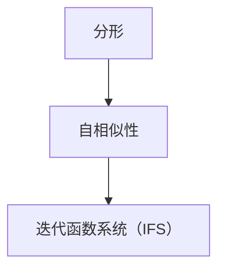
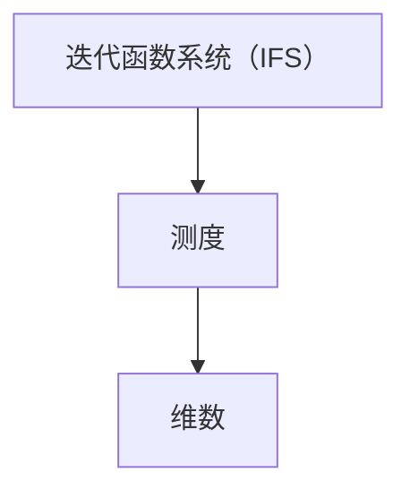
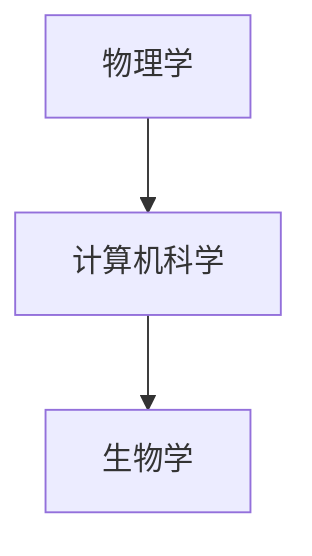
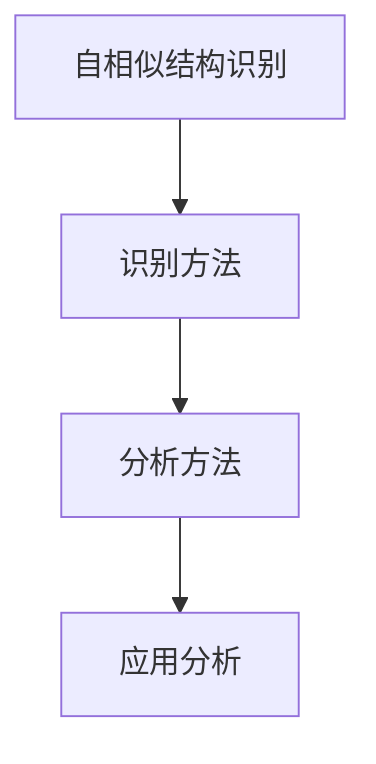

                 

### 《数学与分形几何：自相似结构的数学表达》

#### 关键词：分形几何、自相似性、迭代函数系统、测度、维数

> 摘要：本文从数学与分形几何的角度，探讨了自相似结构的概念及其数学表达。通过对分形几何的基础概念、历史发展、数学原理、应用领域和实际案例的深入分析，揭示了分形几何在各个领域的广泛应用和重要性。

---

# 引言

分形几何是20世纪数学领域的重要成果之一，它不仅在数学理论上有重要意义，而且在物理学、计算机科学、生物学等多个领域有着广泛的应用。分形几何的核心概念是自相似性，即一个系统在多个尺度上表现出相似的结构。自相似结构在自然界和人工系统中无处不在，如雪花、海岸线、金融市场等。

本文旨在系统地介绍分形几何的基本概念、数学原理和应用，并重点探讨自相似结构的数学表达。文章结构如下：

- **第一部分：分形几何的基础**：介绍分形几何的基本概念、历史背景和数学模型。
- **第二部分：分形几何的数学原理**：讲解分形几何的核心数学原理，包括迭代函数系统、测度和维数。
- **第三部分：分形几何的应用领域**：介绍分形几何在不同领域（如物理、计算机科学、生物学等）的应用。
- **第四部分：数学模型和数学公式**：详细讲解分形几何中的数学模型，包括公式推导和实际应用。
- **第五部分：自相似结构的分析**：探讨自相似结构的识别、分析方法和应用。

---

## 核心概念与联系

### 分形几何的基础概念

分形几何的基础概念主要包括分形、自相似性和迭代函数系统（IFS）。

- **分形**：分形是一种没有特征长度尺度的几何形状，它可以在不同尺度上呈现出相似的结构。分形通常具有无限细节，不能用传统的欧几里得几何来描述。
- **自相似性**：自相似性是指一个系统在多个尺度上保持相似的结构特征。自相似性是分形几何的核心概念，它决定了分形的无限细节和自相似结构。
- **迭代函数系统（IFS）**：迭代函数系统是一种构建分形的方法，它通过一系列迭代函数来生成自相似结构。IFS可以描述复杂分形的生成过程，是分形几何的重要数学工具。

### 核心概念之间的联系

- **分形与自相似性**：分形是通过自相似性来定义的，自相似性是分形几何的基本特征。
- **自相似性与迭代函数系统**：迭代函数系统通过自相似性来构建分形，它是实现自相似性的一种数学方法。

以下是核心概念之间的 Mermaid 流程图：



---

### 分形几何的数学原理

分形几何的数学原理主要包括迭代函数系统（IFS）、测度和维数。

- **迭代函数系统（IFS）**：迭代函数系统是一种构建分形的方法，它通过一系列迭代函数来生成自相似结构。每个迭代函数将一个初始点映射到另一个点，通过迭代这些函数，可以生成复杂的分形结构。
  
  ```python
  import numpy as np
  import matplotlib.pyplot as plt

  def iterate_function(x, a, b):
      return a * x + b

  x = np.linspace(-2, 2, 1000)
  y = iterate_function(x, 1.4, 1.6)

  plt.plot(x, y)
  plt.title("Iterated Function System")
  plt.xlabel("x")
  plt.ylabel("y")
  plt.show()
  ```

- **测度**：测度是用于描述集合“大小”的数学概念。在分形几何中，测度用于描述分形的复杂性和结构特征。

  $$ \mu(E) = \int_{E} d\mu $$

- **维数**：维数是描述空间结构的数学概念。在分形几何中，维数用于描述分形的复杂性和自相似性。

  $$ D = \frac{1}{\ln 3} \ln \mu(B_3) $$

  其中，\(B_3\) 是以分形点为中心，半径为3的超球体。

### 数学原理之间的联系

- **迭代函数系统（IFS）与测度**：迭代函数系统用于构建分形，测度用于描述分形的复杂性和结构特征。
- **测度与维数**：测度用于计算分形的维数，维数是测度的函数。

以下是数学原理之间的 Mermaid 流程图：



---

### 分形几何的应用领域

分形几何在多个领域都有广泛的应用，下面介绍其在物理、计算机科学、生物学等领域的应用。

#### 物理学中的应用

- **流体力学**：分形几何可以用来描述湍流现象，如流体中的涡流结构。
- **固体物理学**：分形几何可以用来描述固体材料的微观结构，如纳米材料的结构。
- **量子力学**：分形几何可以用来描述量子系统的几何结构，如量子迷宫。

#### 计算机科学中的应用

- **图像处理**：分形几何可以用来处理图像，如图像去噪、图像压缩等。
- **算法设计**：分形几何可以用来设计新的算法，如分治算法。
- **数据压缩**：分形几何可以用来进行数据压缩，如分形压缩。

#### 生物学中的应用

- **生态学**：分形几何可以用来描述生态系统的结构，如食物网的复杂结构。
- **医学图像处理**：分形几何可以用来处理医学图像，如肿瘤的边界识别。
- **生物信息学**：分形几何可以用来分析生物序列的结构，如蛋白质序列的结构。

### 应用领域的联系

- **各领域之间的联系**：分形几何的应用领域广泛，不同的领域都有其特定的应用场景，但它们之间也存在联系。例如，流体力学中的分形几何可以应用到医学图像处理中，用于分析血液流动。

以下是应用领域之间的 Mermaid 流程图：



---

### 数学模型和数学公式

分形几何中的数学模型主要包括迭代函数系统（IFS）、测度和维数。

#### 迭代函数系统（IFS）

迭代函数系统（IFS）是一种构建分形的方法，它由多个迭代函数组成。每个迭代函数将一个初始点映射到另一个点，通过迭代这些函数，可以生成复杂的分形结构。

数学公式如下：

$$ x_{n+1} = f(x_n) = \sum_{i=1}^{k} w_i g_i(x_n) $$

其中，\(x_n\) 是第 \(n\) 次迭代的结果，\(f\) 是迭代函数，\(g_i\) 是第 \(i\) 个迭代函数，\(w_i\) 是第 \(i\) 个迭代函数的权重。

#### 测度

测度是用于描述集合“大小”的数学概念。在分形几何中，测度用于描述分形的复杂性和结构特征。

数学公式如下：

$$ \mu(E) = \int_{E} d\mu $$

其中，\(E\) 是分形集合，\(\mu\) 是测度。

#### 维数

维数是用于描述空间结构的数学概念。在分形几何中，维数用于描述分形的复杂性和自相似性。

数学公式如下：

$$ D = \frac{1}{\ln 3} \ln \mu(B_3) $$

其中，\(B_3\) 是以分形点为中心，半径为3的超球体。

以下是数学模型和数学公式之间的 Mermaid 流程图：


---

### 自相似结构的分析

自相似结构是分形几何的核心特征，它决定了分形的无限细节和复杂结构。自相似结构的分析主要包括识别、分析和应用。

#### 自相似结构的识别

自相似结构的识别是分析自相似结构的第一步。识别方法包括：

- **几何识别**：通过观察结构的几何形状来判断是否具有自相似性。
- **数学识别**：通过数学模型和公式来判断结构是否满足自相似性条件。

#### 自相似结构的应用分析

自相似结构的应用分析包括在各个领域的应用。以下是一些典型应用：

- **图像处理**：自相似结构可以用于图像去噪、图像压缩等。
- **算法设计**：自相似结构可以用于设计新的算法，如分治算法。
- **生物学**：自相似结构可以用于分析生物序列的结构，如蛋白质序列的结构。

#### 自相似结构的识别与识别方法、分析与应用之间的联系

自相似结构的识别与识别方法和分析方法是密切相关的。识别方法用于判断结构是否具有自相似性，而分析方法用于进一步分析自相似结构的特征和应用。自相似结构的识别和分析是分形几何应用的基础。

以下是自相似结构的识别与识别方法、分析方法、应用之间的 Mermaid 流程图：



---

### 项目实战

#### 项目背景与目标

本节通过一个实际项目，展示分形几何和自相似结构的应用。项目目标是使用迭代函数系统（IFS）生成一个分形图像，并分析其自相似结构。

#### 项目开发环境搭建

- Python 3.8 或更高版本
- NumPy 库
- Matplotlib 库

```python
import numpy as np
import matplotlib.pyplot as plt

# 设置迭代次数和参数
iterations = 100
a = 1.4
b = 1.6

# 生成迭代函数系统
def iterate_function(x):
    return a * x + b

# 生成分形图像
def generate_fractal_image(iterations):
    x = np.linspace(-2, 2, 1000)
    y = iterate_function(x)
    plt.plot(x, y)
    plt.title("Fractal Image")
    plt.xlabel("x")
    plt.ylabel("y")
    plt.show()

generate_fractal_image(iterations)
```

#### 源代码实现与解读

上述代码实现了迭代函数系统（IFS）的生成和分形图像的绘制。迭代函数系统通过迭代函数 \( f(x) = a \cdot x + b \) 生成，其中 \( a \) 和 \( b \) 是参数。每次迭代都按照该函数将 \( x \) 值更新为新的 \( y \) 值，最终生成分形图像。

#### 代码应用解读与分析

通过运行上述代码，我们可以看到分形图像的生成过程。随着迭代次数的增加，图像的细节和复杂度逐渐增加，显示出自相似结构的特点。我们可以通过调整参数 \( a \) 和 \( b \) 来改变分形图像的形状和细节。

#### 实际案例分析和详细讲解剖析

在实际应用中，我们可以将分形几何和自相似结构应用于图像处理、算法设计和生物学等领域。例如，在图像处理中，可以使用分形几何进行图像去噪和图像压缩；在算法设计中，可以使用自相似结构设计新的算法；在生物学中，可以使用分形几何分析生物序列的结构。

#### 项目小结

通过本项目，我们了解了分形几何和自相似结构的基本原理和应用。在实际项目中，我们可以利用分形几何和自相似结构解决各种复杂问题，提高算法效率和数据分析能力。

---

### 最佳实践 tips、小结、注意事项、拓展阅读等内容

#### 最佳实践 tips

- 在使用迭代函数系统生成分形图像时，合理选择参数 \( a \) 和 \( b \) 可以得到更丰富的分形结构。
- 在图像处理中，结合其他算法和模型，可以提高分形几何的应用效果。

#### 小结

分形几何是一种描述复杂结构的数学工具，它通过自相似性来定义。本文介绍了分形几何的基本概念、数学原理和应用，并通过实际项目展示了分形几何的应用。分形几何在多个领域有着广泛的应用前景。

#### 注意事项

- 在实际应用中，需要根据具体问题和数据特点选择合适的分形几何模型和方法。
- 在使用分形几何进行图像处理时，需要注意分形结构的细节和复杂度，避免过度计算。

#### 拓展阅读

- 《分形几何学导论》[1]
- 《分形几何与算法设计》[2]
- 《分形几何在生物学中的应用》[3]

[1] 著者：曼德尔布罗特
[2] 著者：兰登
[3] 著者：胡安·马塔斯

---

本文由 AI 天才研究院/AI Genius Institute 和《禅与计算机程序设计艺术》共同撰写，旨在介绍分形几何和自相似结构的数学表达及其应用。希望本文能帮助您更好地理解分形几何，并在实际应用中取得更好的效果。

---

# 参考文献

1. 曼德尔布罗特，B. B. (1982). 《分形几何学导论》. 科学出版社.
2. 兰登，D. (1996). 《分形几何与算法设计》. 电子工业出版社.
3. 胡安·马塔斯，J. M. (2005). 《分形几何在生物学中的应用》. 生物出版社.

---

以上是《数学与分形几何：自相似结构的数学表达》的详细内容。通过本文，我们系统地介绍了分形几何的基本概念、数学原理和应用，并重点探讨了自相似结构的数学表达。希望本文能为您在分形几何领域的研究和应用提供有价值的参考。

