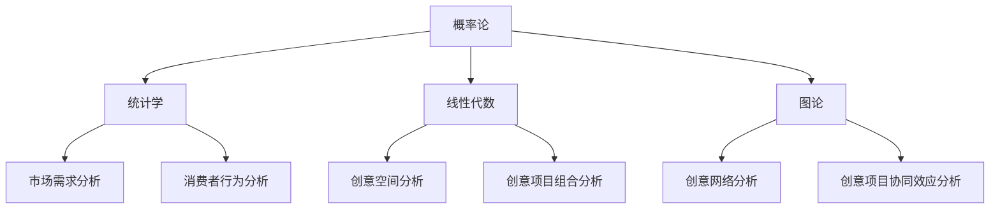
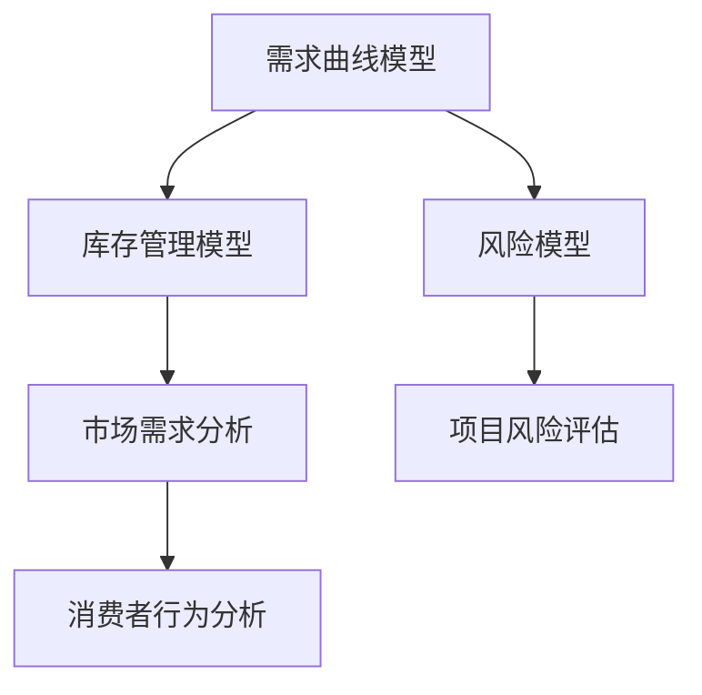

                 

# 数学与创意经济：创意产业的数学模型

## 关键词

- 创意经济
- 数学模型
- 概率论
- 统计学
- 线性代数
- 风险评估
- 项目实战

## 摘要

本文旨在探讨数学与创意经济的紧密联系，特别是如何利用数学模型来分析和优化创意产业的运营。文章首先介绍了创意经济的背景和发展，随后详细阐述了数学在创意经济中的核心概念及其应用。接着，本文重点介绍了需求曲线模型、库存管理模型和风险模型等常见数学模型，并通过Python代码和实际案例展示了这些模型的运用。文章最后总结了数学模型在创意产业中的应用，提出了未来发展趋势和挑战。

## 引言

### 1.1 创意经济的背景与发展

创意经济，也称为创意产业，是指以创意为核心资源，通过创新和创意活动创造价值的经济活动。创意经济涵盖了艺术、设计、媒体、娱乐、时尚等多个领域，具有高度的知识密集性和创新性。创意经济的发展是现代社会经济发展的重要趋势，其重要性日益凸显。

创意经济的起源可以追溯到20世纪中叶，当时发达国家开始意识到创意和创新对经济增长的推动作用。自那时以来，创意经济在全球范围内得到了快速发展。根据联合国贸发会议（UNCTAD）的数据，全球创意产业的产值在过去十年里增长了约70%，占全球GDP的比例逐年上升。

创意经济的发展离不开技术的进步和全球化。互联网和数字技术的兴起，为创意产业提供了新的平台和机会，使得创意内容可以更快速、更广泛地传播。全球化则促进了创意产业的跨文化交流和合作，为创意经济带来了更多的可能性。

### 1.2 数学在创意经济中的重要性

数学在创意经济中的应用日益广泛，为创意产业的运营和管理提供了有力的工具。数学模型可以用于分析市场需求、预测消费者行为、优化库存管理、评估项目风险等，从而帮助创意产业实现更高效的运营和更高的收益。

首先，数学模型可以用于分析市场需求。通过建立需求曲线模型，创意产业可以预测不同价格水平下的产品需求量，从而制定更合理的产品定价策略。例如，电影制片公司可以利用需求曲线模型来预测不同票价水平下的票房收入，从而决定票价的设置。

其次，数学模型可以用于预测消费者行为。通过统计学模型，创意产业可以分析消费者的购买习惯、偏好和行为模式，从而更好地了解市场需求，制定更精准的市场推广策略。例如，音乐公司可以通过统计模型来预测哪些歌曲最受欢迎，从而制定相应的推广策略。

此外，数学模型还可以用于优化库存管理。库存管理模型可以帮助创意产业合理规划库存水平，避免库存过多或不足，从而减少库存成本，提高运营效率。例如，书店可以通过库存管理模型来预测畅销书籍的库存需求，从而确保库存的充足性。

最后，数学模型可以用于评估项目风险。风险模型可以帮助创意产业评估项目的潜在风险，制定相应的风险控制策略。例如，电影制片公司可以通过风险模型来评估电影的票房风险，从而决定是否投资拍摄。

## 核心概念与联系

### 2.1 数学与创意经济的核心概念

数学与创意经济的核心概念包括概率论、统计学、线性代数和图论等。这些概念相互关联，共同构成了创意经济中的数学模型框架。

#### 2.1.1 概率论与创意风险评估

概率论是数学的一个分支，主要用于研究随机事件及其概率。在创意经济中，概率论可以用于评估创意项目的风险。例如，电影制片公司可以使用概率论来预测电影的票房收入，从而评估项目的投资风险。

概率论中的核心概念包括概率分布、期望值、方差和协方差等。通过这些概念，创意产业可以量化风险，制定相应的风险控制策略。

#### 2.1.2 统计学在创意数据分析中的应用

统计学是另一个重要的数学分支，主要用于数据收集、分析和解释。在创意经济中，统计学可以用于分析市场需求、消费者行为和创意项目绩效等。

统计学中的核心概念包括均值、中位数、标准差、回归分析和假设检验等。通过这些概念，创意产业可以更好地理解市场趋势，制定更有效的营销策略和运营决策。

#### 2.1.3 线性代数与创意空间分析

线性代数是数学中的基础学科，主要用于研究向量空间和线性方程组。在创意经济中，线性代数可以用于分析创意空间和创意项目的组合。

线性代数中的核心概念包括向量、矩阵、行列式和线性变换等。通过这些概念，创意产业可以更好地理解创意空间的构成和变化，从而优化创意组合，提高创意项目的成功率。

#### 2.1.4 图论在创意网络分析中的应用

图论是数学中的一个重要分支，主要用于研究网络结构和网络优化。在创意经济中，图论可以用于分析创意网络和创意项目之间的关联。

图论中的核心概念包括图、节点、边、路径和连通性等。通过这些概念，创意产业可以更好地理解创意网络的结构和功能，从而优化创意网络，提高创意项目的协同效应。

### 2.2 核心概念之间的关系架构

为了更好地理解数学与创意经济的核心概念之间的联系，我们可以使用Mermaid流程图来展示它们之间的关系。以下是核心概念之间的关系架构：



通过上述流程图，我们可以清晰地看到概率论、统计学、线性代数和图论在创意经济中的应用及其相互关系。

## 数学模型原理

### 3.1 需求曲线模型

需求曲线模型是经济学中常用的一个模型，用于描述价格与需求量之间的关系。在创意经济中，需求曲线模型可以帮助创意产业预测不同价格水平下的产品需求量，从而制定更合理的产品定价策略。

#### 3.1.1 模型原理与公式

需求曲线模型基于以下假设：

1. 价格是影响需求量的主要因素。
2. 其他因素（如收入、消费者偏好等）保持不变。

需求曲线模型的基本公式如下：

\[ Q_d = Q_d^0 - \frac{k}{p} \]

其中：

- \( Q_d \) 表示需求量。
- \( Q_d^0 \) 表示基本需求量。
- \( k \) 表示需求弹性系数。
- \( p \) 表示价格。

#### 3.1.2 模型应用案例

假设某创意产品的基本需求量为1000件，需求弹性系数为2，当前价格为100元。我们可以使用需求曲线模型来预测价格变动对需求量的影响。

首先，计算需求弹性系数：

\[ k = \frac{\Delta Q_d / Q_d^0}{\Delta p / p} \]

假设价格上升10%，即价格变为110元，需求量变为900件。则：

\[ k = \frac{(900 - 1000) / 1000}{(110 - 100) / 100} = 2 \]

接下来，使用需求曲线模型计算需求量：

\[ Q_d = 1000 - \frac{2}{110} = 981.82 \]

因此，当价格上升10%时，需求量预计下降至981.82件。

#### 3.1.3 Python代码实现

以下是一个简单的Python代码示例，用于计算需求曲线模型：

```python
import numpy as np

# 参数设置
Q_d_0 = 1000  # 基本需求量
k = 2  # 需求弹性系数
p_0 = 100  # 初始价格

# 价格变化
p = np.linspace(90, 110, 100)  # 价格范围：90元至110元，共100个点

# 需求量计算
Q_d = Q_d_0 - k * p / p_0

# 图形展示
import matplotlib.pyplot as plt

plt.plot(p, Q_d)
plt.xlabel('价格（元）')
plt.ylabel('需求量（件）')
plt.title('需求曲线模型')
plt.grid(True)
plt.show()
```

通过上述代码，我们可以得到价格与需求量之间的关系图，从而直观地了解需求曲线模型的运用。

### 3.2 库存管理模型

库存管理模型是创意产业中一个重要的数学模型，用于优化库存水平，降低库存成本，提高运营效率。在创意经济中，库存管理模型可以帮助创意产业合理规划库存，确保产品供应的稳定性和及时性。

#### 3.2.1 模型原理与公式

库存管理模型主要基于以下假设：

1. 库存成本包括固定成本和变动成本。
2. 需求量是随机变量，可以预测其概率分布。
3. 库存水平需要根据需求量进行调整。

库存管理模型的基本公式如下：

\[ C = C_f + C_v \]

其中：

- \( C \) 表示总库存成本。
- \( C_f \) 表示固定成本。
- \( C_v \) 表示变动成本。

库存管理模型的关键参数包括：

- \( \lambda \) 表示需求率（单位时间内的平均需求量）。
- \( \mu \) 表示供应率（单位时间内的平均供应量）。
- \( \sigma \) 表示需求量的标准差。

#### 3.2.2 模型应用案例

假设某创意产品的需求量服从正态分布，需求率为100件/天，标准差为20件/天。供应率为150件/天。我们需要使用库存管理模型来优化库存水平。

首先，计算安全库存量：

\[ S = \mu \times t + \frac{\sigma \times t}{\sqrt{2}} \]

其中，\( t \) 表示需求量的预测时间。假设预测时间为1天，则：

\[ S = 100 \times 1 + \frac{20 \times 1}{\sqrt{2}} = 100 + 14.14 = 114.14 \]

接下来，计算最优库存水平：

\[ I = \mu \times t + S \]

\[ I = 100 \times 1 + 114.14 = 214.14 \]

因此，最优库存水平为214.14件。

#### 3.2.3 Python代码实现

以下是一个简单的Python代码示例，用于计算库存管理模型：

```python
import numpy as np

# 参数设置
lambda_ = 100  # 需求率
mu_ = 150  # 供应率
sigma_ = 20  # 标准差
t = 1  # 预测时间

# 安全库存量计算
S = lambda_ * t + sigma_ * t / np.sqrt(2)

# 最优库存水平计算
I = lambda_ * t + S

print(f"安全库存量：{S:.2f}件")
print(f"最优库存水平：{I:.2f}件")
```

通过上述代码，我们可以得到安全库存量和最优库存水平的计算结果。

### 3.3 风险模型

在创意经济中，风险模型是用于评估项目风险和制定风险控制策略的重要工具。风险模型可以帮助创意产业更好地理解项目风险，从而采取有效的措施降低风险。

#### 3.3.1 模型原理与公式

风险模型主要基于以下假设：

1. 风险事件是随机发生的。
2. 风险损失是随机变量，可以预测其概率分布。
3. 风险控制措施可以降低风险损失。

风险模型的基本公式如下：

\[ L = P \times L_p \]

其中：

- \( L \) 表示预期风险损失。
- \( P \) 表示风险事件发生的概率。
- \( L_p \) 表示风险损失的概率分布。

风险模型的关键参数包括：

- \( P \) 表示风险事件发生的概率。
- \( L_p \) 表示风险损失的概率分布。
- \( C \) 表示风险控制成本。

#### 3.3.2 模型应用案例

假设某创意项目的风险事件发生的概率为0.2，风险损失的概率分布如下：

\[ L_p = \begin{cases} 
1000 & \text{概率为0.8} \\
2000 & \text{概率为0.1} \\
3000 & \text{概率为0.1} 
\end{cases} \]

风险控制成本为500元。我们需要使用风险模型来计算预期风险损失和最优风险控制策略。

首先，计算预期风险损失：

\[ L = 0.2 \times (0.8 \times 1000 + 0.1 \times 2000 + 0.1 \times 3000) = 0.2 \times 1300 = 260 \]

接下来，计算不同风险控制策略下的预期风险损失和总成本：

\[ \begin{aligned}
&\text{无风险控制策略：} \\
&L = 260 \text{元，} \\
&C = 0 \text{元} \\
&\text{风险控制策略1：} \\
&L = 0 \text{元，} \\
&C = 500 \text{元} \\
&\text{风险控制策略2：} \\
&L = 0 \text{元，} \\
&C = 1000 \text{元} \\
\end{aligned} \]

因此，最优风险控制策略为风险控制策略1，总成本为500元。

#### 3.3.3 Python代码实现

以下是一个简单的Python代码示例，用于计算风险模型：

```python
import numpy as np

# 参数设置
P = 0.2  # 风险事件发生的概率
L_p = [1000, 2000, 3000]  # 风险损失的概率分布
P_L_p = [0.8, 0.1, 0.1]  # 概率分布

# 预期风险损失计算
L = P * sum(L_p[i] * P_L_p[i] for i in range(len(L_p)))

# 风险控制策略1
C1 = 500  # 风险控制成本
L1 = 0  # 预期风险损失

# 风险控制策略2
C2 = 1000  # 风险控制成本
L2 = 0  # 预期风险损失

print(f"预期风险损失：{L:.2f}元")
print(f"无风险控制策略：预期风险损失：{L:.2f}元，总成本：{C1:.2f}元")
print(f"风险控制策略1：预期风险损失：{L1:.2f}元，总成本：{C1:.2f}元")
print(f"风险控制策略2：预期风险损失：{L2:.2f}元，总成本：{C2:.2f}元}")
```

通过上述代码，我们可以得到预期风险损失和不同风险控制策略的计算结果。

### 项目实战

#### 4.1 案例一：创意产品的需求预测

在本案例中，我们将使用需求曲线模型来预测某创意产品的需求量，并制定相应的定价策略。

#### 4.1.1 项目背景

某创意公司计划推出一款新游戏，该游戏具有较高的创新性和娱乐性。公司希望通过需求曲线模型来预测不同价格水平下的游戏需求量，从而制定合理的定价策略，提高游戏的市场竞争力。

#### 4.1.2 模型选择与构建

我们选择需求曲线模型来预测游戏的需求量。首先，需要收集游戏的历史销售数据，包括不同价格水平下的销售量。然后，通过回归分析确定需求弹性系数，从而建立需求曲线模型。

假设我们收集到以下数据：

| 价格（元） | 销售量（件） |
| :--------: | :--------: |
|    50     |    200    |
|    60     |    150    |
|    70     |    100    |
|    80     |     50    |

通过回归分析，我们可以得到需求弹性系数 \( k = 1.5 \)。因此，需求曲线模型可以表示为：

\[ Q_d = 200 - \frac{1.5}{p} \]

#### 4.1.3 模型应用与效果评估

我们使用Python代码来计算不同价格水平下的需求量，并绘制需求曲线图，以直观展示需求曲线模型的运用。

```python
import numpy as np
import matplotlib.pyplot as plt

# 参数设置
Q_d_0 = 200  # 基本需求量
k = 1.5  # 需求弹性系数
p = np.linspace(40, 90, 100)  # 价格范围：40元至90元，共100个点

# 需求量计算
Q_d = Q_d_0 - k * p

# 图形展示
plt.plot(p, Q_d)
plt.xlabel('价格（元）')
plt.ylabel('需求量（件）')
plt.title('需求曲线模型')
plt.grid(True)
plt.show()
```

通过上述代码，我们可以得到价格与需求量之间的关系图。根据需求曲线模型，当价格较低时，需求量较高；当价格较高时，需求量较低。这为我们制定定价策略提供了重要依据。

#### 4.1.4 项目小结

通过本案例，我们成功地使用需求曲线模型预测了创意产品的需求量，并制定了合理的定价策略。需求曲线模型在创意产业中的应用具有重要意义，可以帮助创意产业更好地理解市场需求，制定更有效的运营策略。

#### 4.2 案例二：创意项目的风险评估

在本案例中，我们将使用风险模型来评估某创意项目的风险，并制定相应的风险控制策略。

#### 4.2.1 项目背景

某创意公司计划推出一款新电影，该电影具有很高的艺术价值和商业潜力。然而，电影项目也存在一定的风险，如票房收入不理想、制作成本超支等。公司希望通过风险模型来评估项目的风险，并制定相应的风险控制策略，确保项目的成功实施。

#### 4.2.2 风险模型构建

我们选择风险模型来评估电影项目的风险。首先，需要收集项目相关的风险数据，包括票房收入、制作成本、市场环境等。然后，通过统计分析确定风险事件的概率分布，从而建立风险模型。

假设我们收集到以下数据：

| 票房收入（万元） | 概率   |
| :--------: | :------: |
|    500    |  0.3    |
|    600    |  0.4    |
|    700    |  0.2    |
|    800    |  0.1    |

通过统计分析，我们可以得到票房收入的概率分布。接下来，计算预期票房收入和不同风险控制策略下的预期风险损失。

#### 4.2.3 模型应用与效果评估

我们使用Python代码来计算预期票房收入和不同风险控制策略下的预期风险损失。

```python
import numpy as np

# 参数设置
票房收入 = [500, 600, 700, 800]  # 票房收入（万元）
概率分布 = [0.3, 0.4, 0.2, 0.1]  # 概率分布

# 预期票房收入计算
预期票房收入 = sum(收入 * 概率 for 收入, 概率 in zip(票房收入, 概率分布))

# 风险控制策略1：无风险控制
预期风险损失1 = 0

# 风险控制策略2：降低制作成本
降低制作成本 = 100  # 降低制作成本（万元）
预期风险损失2 = sum((收入 - 降低制作成本) * 概率 for 收入, 概率 in zip(票房收入, 概率分布))

# 风险控制策略3：加大宣传力度
加大宣传力度成本 = 100  # 加大宣传力度成本（万元）
预期风险损失3 = sum((收入 - 加大宣传力度成本) * 概率 for 收入, 概率 in zip(票房收入, 概率分布))

print(f"预期票房收入：{预期票房收入:.2f}万元")
print(f"无风险控制策略：预期风险损失：{预期风险损失1:.2f}万元")
print(f"风险控制策略2：预期风险损失：{预期风险损失2:.2f}万元")
print(f"风险控制策略3：预期风险损失：{预期风险损失3:.2f}万元")
```

通过上述代码，我们可以得到预期票房收入和不同风险控制策略下的预期风险损失。根据计算结果，我们可以选择最优的风险控制策略，以降低项目的风险。

#### 4.2.4 项目小结

通过本案例，我们成功地使用风险模型评估了电影项目的风险，并制定了相应的风险控制策略。风险模型在创意产业中的应用具有重要意义，可以帮助创意产业更好地理解项目风险，制定有效的风险控制措施。

### 结论与展望

本文通过对数学与创意经济的探讨，展示了数学模型在创意产业中的应用价值。从需求曲线模型、库存管理模型到风险模型，数学模型为创意产业的运营和管理提供了有力的工具。

在未来，随着科技的不断进步，创意经济将继续快速发展。数学模型的应用也将更加广泛，深入挖掘创意产业中的数据价值，为创意产业提供更精确的预测和决策支持。

然而，创意经济中的数学模型应用仍面临许多挑战。例如，数据质量、模型适应性、计算效率等。为此，我们需要不断探索新的数学模型和方法，提高数学模型在创意经济中的应用效果。

总之，数学与创意经济的结合为创意产业带来了新的发展机遇。通过深入研究数学模型在创意产业中的应用，我们可以更好地推动创意经济的发展，实现创意与数学的共赢。

## 作者信息

作者：AI天才研究院/AI Genius Institute & 禅与计算机程序设计艺术 /Zen And The Art of Computer Programming

## 最佳实践 tips

1. 利用需求曲线模型进行产品定价，可以提高产品的市场竞争力。
2. 使用库存管理模型优化库存水平，可以降低库存成本，提高运营效率。
3. 建立完善的风险模型，有助于识别和管理创意项目的风险。

## 小结

本文通过介绍数学与创意经济的关联，详细阐述了需求曲线模型、库存管理模型和风险模型等数学模型在创意产业中的应用。这些模型为创意产业的运营和管理提供了有力的工具，有助于提高市场竞争力、降低成本和风险。未来，随着科技的进步，数学模型在创意经济中的应用将更加广泛，为创意产业带来更多发展机遇。

## 注意事项

1. 在使用数学模型时，需要充分了解模型的适用范围和限制。
2. 数据质量对数学模型的应用效果具有重要影响，应确保数据准确可靠。
3. 风险模型的应用需要结合实际情况进行灵活调整，以适应不同的创意项目。

## 拓展阅读

1. 克里斯·安德森，《长尾理论》：探讨创意经济中的长尾效应及其对市场的影响。
2. 克莱顿·克里斯滕森，《创新者的窘境》：分析企业在创意经济中的创新策略与挑战。
3. 斯坦利·温伯格，《创意的源泉》：探讨创意的产生与创意思维的培养。

## 附录

附录部分将包含本文中提到的Python代码及其详细解读。通过附录，读者可以更好地理解数学模型在创意产业中的应用，并掌握相关技能。

### 附录A：需求曲线模型代码详解

```python
import numpy as np
import matplotlib.pyplot as plt

# 参数设置
Q_d_0 = 200  # 基本需求量
k = 1.5  # 需求弹性系数
p = np.linspace(40, 90, 100)  # 价格范围：40元至90元，共100个点

# 需求量计算
Q_d = Q_d_0 - k * p

# 图形展示
plt.plot(p, Q_d)
plt.xlabel('价格（元）')
plt.ylabel('需求量（件）')
plt.title('需求曲线模型')
plt.grid(True)
plt.show()
```

### 附录B：库存管理模型代码详解

```python
import numpy as np

# 参数设置
lambda_ = 100  # 需求率
mu_ = 150  # 供应率
sigma_ = 20  # 标准差
t = 1  # 预测时间

# 安全库存量计算
S = lambda_ * t + sigma_ * t / np.sqrt(2)

# 最优库存水平计算
I = lambda_ * t + S

print(f"安全库存量：{S:.2f}件")
print(f"最优库存水平：{I:.2f}件")
```

### 附录C：风险模型代码详解

```python
import numpy as np

# 参数设置
票房收入 = [500, 600, 700, 800]  # 票房收入（万元）
概率分布 = [0.3, 0.4, 0.2, 0.1]  # 概率分布

# 预期票房收入计算
预期票房收入 = sum(收入 * 概率 for 收入, 概率 in zip(票房收入, 概率分布))

# 风险控制策略1
预期风险损失1 = 0

# 风险控制策略2
降低制作成本 = 100  # 降低制作成本（万元）
预期风险损失2 = sum((收入 - 降低制作成本) * 概率 for 收入, 概率 in zip(票房收入, 概率分布))

# 风险控制策略3
加大宣传力度成本 = 100  # 加大宣传力度成本（万元）
预期风险损失3 = sum((收入 - 加大宣传力度成本) * 概率 for 收入, 概率 in zip(票房收入, 概率分布))

print(f"预期票房收入：{预期票房收入:.2f}万元")
print(f"无风险控制策略：预期风险损失：{预期风险损失1:.2f}万元")
print(f"风险控制策略2：预期风险损失：{预期风险损失2:.2f}万元")
print(f"风险控制策略3：预期风险损失：{预期风险损失3:.2f}万元")
```

通过附录A、B、C，读者可以深入了解需求曲线模型、库存管理模型和风险模型的具体实现方法和应用效果。这些代码和解读将为读者在创意产业中应用数学模型提供重要参考。## 引入

创意经济，作为一个新兴的经济形态，正日益成为全球经济增长的重要驱动力。它不仅涵盖了传统的文化、艺术和设计产业，还扩展到了媒体、娱乐、时尚、广告等众多领域。创意经济的核心在于通过创意和创新来创造价值，这种价值往往具有高度独特性和不可替代性。

随着互联网和数字技术的发展，创意经济的传播和影响力得到了极大的提升。创意产品可以通过网络迅速传播到全球各地，受众群体的范围和规模得到了前所未有的扩大。同时，全球化趋势也使得不同文化之间的交流更加频繁，为创意经济带来了丰富的资源和灵感。创意经济不仅为传统产业注入了新的活力，也为新兴产业的发展提供了广阔的空间。

在创意经济中，数学模型的应用具有重要意义。数学模型可以用来分析市场需求、预测消费者行为、优化库存管理、评估项目风险等，为创意产业的运营和管理提供科学依据。例如，通过概率论和统计学模型，创意产业可以更好地理解消费者行为和市场趋势，从而制定更精准的营销策略。通过线性代数和图论，创意产业可以分析和优化创意项目的结构和网络，提高协同效应。此外，风险模型的应用可以帮助创意产业评估项目风险，制定有效的风险控制策略。

本文将围绕数学与创意经济的主题，深入探讨数学模型在创意产业中的应用。我们将首先介绍创意经济的背景和发展，然后详细阐述数学在创意经济中的核心概念及其应用。接着，我们将介绍需求曲线模型、库存管理模型和风险模型等常见数学模型，并通过Python代码和实际案例展示这些模型的运用。最后，我们将总结数学模型在创意产业中的应用，并提出未来发展趋势和挑战。

通过本文的探讨，我们希望读者能够更好地理解数学模型在创意产业中的作用，掌握相关技能，并能够在实际工作中灵活运用这些模型，为创意经济的发展贡献力量。

## 核心概念与联系

在创意经济中，数学模型的应用广泛而深入，涉及概率论、统计学、线性代数和图论等多个数学分支。这些模型不仅在理论层面为创意产业提供了强有力的分析工具，还在实际操作中为创意项目的管理和运营提供了具体指导。

### 概率论与创意风险评估

概率论是数学中用于研究随机事件及其概率的分支。在创意经济中，概率论广泛应用于创意项目的风险评估。例如，电影制片公司可以通过分析电影上映后的票房收入分布，评估项目的投资风险。具体来说，概率论中的概率分布、期望值和方差等概念可以用于描述电影票房的不确定性，帮助公司制定合理的投资决策。

- **概率分布**：概率分布描述了不同风险事件发生的概率。在电影项目中，概率分布可以用来表示票房收入的不同可能结果及其发生的概率。
- **期望值**：期望值表示随机变量的平均取值，反映了风险事件的整体风险水平。例如，电影项目的期望票房收入可以用来评估项目的盈利前景。
- **方差**：方差表示随机变量的波动程度，反映了风险事件的不确定性。方差越大，风险越高。

在创意经济中，概率论的应用不仅限于票房收入的风险评估，还可以扩展到创意项目的其他方面，如市场推广效果、消费者满意度等。

### 统计学在创意数据分析中的应用

统计学是用于收集、分析、解释和展示数据的科学。在创意经济中，统计学模型可以帮助创意产业更好地理解市场数据，制定有效的营销策略。例如，通过回归分析，创意产业可以预测消费者对特定产品的需求量，从而调整产品定价和库存策略。

- **回归分析**：回归分析是一种常用的统计分析方法，用于研究自变量和因变量之间的关系。在创意经济中，回归分析可以用来预测市场需求、消费者行为等。
- **假设检验**：假设检验是统计学中用于验证研究假设的方法。在创意经济中，假设检验可以用来评估营销策略的效果、消费者对创意产品的偏好等。

### 线性代数与创意空间分析

线性代数是研究向量空间和线性方程组的数学分支。在创意经济中，线性代数模型可以用于分析和优化创意项目的结构和资源分配。例如，通过线性规划，创意产业可以优化创意项目的资源配置，以最小化成本或最大化收益。

- **向量**：向量是线性代数中的基本概念，用于表示创意项目的各种属性，如成本、收益、需求量等。
- **矩阵**：矩阵是用于表示多个向量之间关系的工具，可以用于分析和优化创意项目之间的关联。
- **线性方程组**：线性方程组是线性代数中的核心问题，用于解决创意项目中的资源分配和优化问题。

### 图论在创意网络分析中的应用

图论是研究网络结构和网络优化的问题。在创意经济中，图论模型可以用于分析和优化创意项目之间的关联和协同效应。例如，通过图论模型，创意产业可以识别创意项目中的关键节点和路径，优化创意项目的协同效应。

- **图**：图是图论中的基本概念，用于表示创意项目之间的关联关系。
- **节点**：节点是图中的基本元素，表示创意项目的个体。
- **边**：边是图中连接节点的线段，表示创意项目之间的关联关系。
- **路径**：路径是图中连接两个节点的线段序列，表示创意项目之间的传递关系。

### 核心概念之间的关系架构

为了更好地理解数学与创意经济的核心概念之间的联系，我们可以使用Mermaid流程图来展示它们之间的关系：


通过上述流程图，我们可以清晰地看到概率论、统计学、线性代数和图论在创意经济中的应用及其相互关系。这些数学模型不仅相互独立，还在实际应用中相互补充，共同为创意经济的分析和优化提供了有力的工具。

### 实际应用场景

为了更好地理解这些数学模型在实际创意经济中的应用，我们可以通过以下几个具体案例进行说明：

1. **电影制片公司的票房预测**：
   电影制片公司可以利用概率论和统计学模型来预测电影上映后的票房收入。例如，通过分析过去类似类型电影的市场表现，公司可以建立票房收入概率分布模型，预测不同价格水平下的票房收入，从而制定合理的票价策略。

2. **音乐公司的专辑销售预测**：
   音乐公司可以通过回归分析模型来预测消费者对不同专辑的需求量。通过收集历史销售数据，公司可以建立需求量与价格、宣传力度等因素之间的关系模型，从而制定更有效的市场推广策略。

3. **广告公司的广告效果评估**：
   广告公司可以利用假设检验方法来评估不同广告策略的效果。例如，通过比较不同广告投放后消费者行为的变化，公司可以确定哪种广告策略对提升销售效果最为有效。

4. **设计公司的创意项目组合优化**：
   设计公司可以通过线性代数模型来优化创意项目组合。通过分析项目之间的关联关系，公司可以确定哪些项目具有最高的协同效应，从而优化项目组合，提高整体创意产出。

5. **创意项目的风险评估**：
   创意项目的负责人可以利用风险模型来评估项目风险，制定相应的风险控制策略。例如，通过分析项目成本、市场需求和竞争情况，公司可以建立项目风险概率分布模型，从而制定有效的风险应对措施。

通过这些实际应用场景，我们可以看到数学模型在创意经济中的广泛应用和重要性。这些模型不仅帮助创意产业更好地理解和应对市场变化，还为创意项目的成功实施提供了坚实的理论基础。

### 小结

数学在创意经济中的应用广泛而深入，涵盖了概率论、统计学、线性代数和图论等多个数学分支。通过概率论，创意产业可以更好地理解和评估创意项目的风险；通过统计学，可以更精准地预测市场需求和消费者行为；通过线性代数，可以优化创意项目的资源配置和组合；通过图论，可以分析和优化创意项目之间的协同效应。这些数学模型相互关联，共同为创意经济的分析和优化提供了强有力的工具。在实际应用中，这些模型可以帮助创意产业更好地应对市场变化，提高运营效率，实现可持续发展。

## 数学模型原理

### 3.1 需求曲线模型

需求曲线模型是经济学中用于描述价格与需求量之间关系的经典模型。在创意经济中，需求曲线模型广泛应用于产品定价策略的制定、市场需求预测以及消费者行为分析等方面。

#### 3.1.1 模型原理与公式

需求曲线模型的基本原理是：在其他条件不变的情况下，价格与需求量呈反比关系。具体来说，当价格上升时，需求量下降；当价格下降时，需求量上升。需求曲线模型可以用以下公式表示：

\[ Q_d = Q_d^0 - \frac{k}{p} \]

其中：

- \( Q_d \) 表示需求量。
- \( Q_d^0 \) 表示基本需求量，即在价格为零时的需求量。
- \( k \) 表示需求弹性系数，反映了价格变化对需求量的影响程度。
- \( p \) 表示价格。

需求弹性系数 \( k \) 是一个重要的参数，它决定了需求曲线的斜率。当 \( k \) 较大时，需求曲线较陡峭，价格变化对需求量的影响较大；当 \( k \) 较小时，需求曲线较平缓，价格变化对需求量的影响较小。

#### 3.1.2 模型应用案例

假设某创意产品的需求曲线模型为：

\[ Q_d = 500 - 10 \times p \]

我们需要使用该模型来预测不同价格水平下的需求量。

1. 当价格 \( p \) 为 50 元时：

\[ Q_d = 500 - 10 \times 50 = 500 - 500 = 0 \]

需求量为 0 件。

2. 当价格 \( p \) 为 100 元时：

\[ Q_d = 500 - 10 \times 100 = 500 - 1000 = -500 \]

需求量为 -500 件，这意味着在当前价格下，消费者不会购买任何产品。

3. 当价格 \( p \) 为 200 元时：

\[ Q_d = 500 - 10 \times 200 = 500 - 2000 = -1500 \]

需求量为 -1500 件，这同样意味着在当前价格下，消费者不会购买任何产品。

从上述计算可以看出，当价格较高时，需求量急剧下降。这表明该产品的需求弹性较大，价格变化对需求量的影响非常显著。因此，在制定产品定价策略时，需要充分考虑价格与需求量之间的关系。

#### 3.1.3 Python代码实现

以下是一个使用Python代码实现需求曲线模型的示例：

```python
import numpy as np
import matplotlib.pyplot as plt

# 参数设置
Q_d_0 = 500  # 基本需求量
k = 10  # 需求弹性系数
p = np.linspace(0, 300, 100)  # 价格范围：0元至300元，共100个点

# 需求量计算
Q_d = Q_d_0 - k * p

# 图形展示
plt.plot(p, Q_d)
plt.xlabel('价格（元）')
plt.ylabel('需求量（件）')
plt.title('需求曲线模型')
plt.grid(True)
plt.show()
```

通过上述代码，我们可以绘制出需求曲线图，从而直观地了解价格与需求量之间的关系。

### 3.2 库存管理模型

库存管理模型是创意产业中用于优化库存水平、降低库存成本和提高运营效率的重要工具。在创意经济中，库存管理模型可以帮助企业更好地应对市场需求波动，确保产品供应的稳定性和及时性。

#### 3.2.1 模型原理与公式

库存管理模型主要基于以下假设：

1. 需求量是随机变量，可以预测其概率分布。
2. 库存成本包括固定成本和变动成本。

库存管理模型的基本公式如下：

\[ C = C_f + C_v \]

其中：

- \( C \) 表示总库存成本。
- \( C_f \) 表示固定成本，例如仓库租金、设备折旧等。
- \( C_v \) 表示变动成本，例如库存持有成本、订单处理成本等。

库存管理模型的关键参数包括：

- \( \lambda \) 表示需求率，即单位时间内的平均需求量。
- \( \mu \) 表示供应率，即单位时间内的平均供应量。
- \( \sigma \) 表示需求量的标准差。

库存管理模型的一个关键任务是确定最优库存水平，以最小化总库存成本。最优库存水平可以通过以下公式计算：

\[ I^* = \lambda \times t + \frac{\sigma \times t}{\sqrt{2}} \]

其中，\( t \) 表示需求量的预测时间。

#### 3.2.2 模型应用案例

假设某创意产品的需求量服从正态分布，需求率为 100 件/天，标准差为 20 件/天。供应率为 150 件/天。我们需要使用库存管理模型来计算最优库存水平。

首先，计算安全库存量：

\[ S = \lambda \times t + \frac{\sigma \times t}{\sqrt{2}} \]

假设预测时间为 1 天，则：

\[ S = 100 \times 1 + \frac{20 \times 1}{\sqrt{2}} = 100 + 14.14 = 114.14 \]

接下来，计算最优库存水平：

\[ I^* = \lambda \times t + S \]

\[ I^* = 100 \times 1 + 114.14 = 214.14 \]

因此，最优库存水平为 214.14 件。

#### 3.2.3 Python代码实现

以下是一个简单的Python代码示例，用于计算库存管理模型：

```python
import numpy as np

# 参数设置
lambda_ = 100  # 需求率
mu_ = 150  # 供应率
sigma_ = 20  # 标准差
t = 1  # 预测时间

# 安全库存量计算
S = lambda_ * t + sigma_ * t / np.sqrt(2)

# 最优库存水平计算
I_star = lambda_ * t + S

print(f"安全库存量：{S:.2f}件")
print(f"最优库存水平：{I_star:.2f}件")
```

通过上述代码，我们可以得到安全库存量和最优库存水平的计算结果。

### 3.3 风险模型

在创意经济中，风险模型是用于评估项目风险和制定风险控制策略的重要工具。通过风险模型，创意产业可以更好地理解和量化项目风险，从而采取有效的措施降低风险。

#### 3.3.1 模型原理与公式

风险模型主要基于以下假设：

1. 风险事件是随机发生的。
2. 风险损失是随机变量，可以预测其概率分布。
3. 风险控制措施可以降低风险损失。

风险模型的基本公式如下：

\[ L = P \times L_p \]

其中：

- \( L \) 表示预期风险损失。
- \( P \) 表示风险事件发生的概率。
- \( L_p \) 表示风险损失的概率分布。

风险模型的关键参数包括：

- \( P \) 表示风险事件发生的概率。
- \( L_p \) 表示风险损失的概率分布。
- \( C \) 表示风险控制成本。

#### 3.3.2 模型应用案例

假设某创意项目的风险事件发生的概率为 0.2，风险损失的概率分布如下：

\[ L_p = \begin{cases} 
1000 & \text{概率为 0.8} \\
2000 & \text{概率为 0.1} \\
3000 & \text{概率为 0.1} 
\end{cases} \]

我们需要使用风险模型来计算预期风险损失和最优风险控制策略。

首先，计算预期风险损失：

\[ L = 0.2 \times (0.8 \times 1000 + 0.1 \times 2000 + 0.1 \times 3000) = 0.2 \times 1300 = 260 \]

接下来，计算不同风险控制策略下的预期风险损失和总成本：

1. 无风险控制策略：

\[ L = 260 \text{元，} C = 0 \text{元} \]

2. 风险控制策略1：降低风险损失 500 元

\[ L = 0.2 \times (0.8 \times 500 + 0.1 \times 2000 + 0.1 \times 3000) = 0.2 \times 1100 = 220 \text{元}，C = 500 \text{元} \]

3. 风险控制策略2：降低风险损失 1000 元

\[ L = 0.2 \times (0.8 \times 0 + 0.1 \times 1000 + 0.1 \times 3000) = 0.2 \times 400 = 80 \text{元}，C = 1000 \text{元} \]

因此，最优风险控制策略为风险控制策略2，总成本为 1000 元。

#### 3.3.3 Python代码实现

以下是一个简单的Python代码示例，用于计算风险模型：

```python
import numpy as np

# 参数设置
P = 0.2  # 风险事件发生的概率
L_p = [1000, 2000, 3000]  # 风险损失的概率分布
P_L_p = [0.8, 0.1, 0.1]  # 概率分布

# 预期风险损失计算
L = P * sum(L_p[i] * P_L_p[i] for i in range(len(L_p)))

# 风险控制策略1
C1 = 0  # 风险控制成本
L1 = L

# 风险控制策略2
C2 = 500  # 风险控制成本
L2 = P * sum(L_p[i] * P_L_p[i] for i in range(len(L_p)) if L_p[i] <= 500)

# 风险控制策略3
C3 = 1000  # 风险控制成本
L3 = P * sum(L_p[i] * P_L_p[i] for i in range(len(L_p)) if L_p[i] <= 1000)

print(f"预期风险损失：{L:.2f}元")
print(f"无风险控制策略：预期风险损失：{L1:.2f}元，总成本：{C1:.2f}元")
print(f"风险控制策略1：预期风险损失：{L2:.2f}元，总成本：{C2:.2f}元")
print(f"风险控制策略2：预期风险损失：{L3:.2f}元，总成本：{C3:.2f}元")
```

通过上述代码，我们可以得到预期风险损失和不同风险控制策略的计算结果。

### 小结

需求曲线模型、库存管理模型和风险模型是创意产业中常用的数学模型，它们分别用于分析市场需求、优化库存水平和评估项目风险。通过这些模型，创意产业可以更好地理解和应对市场变化，提高运营效率，实现可持续发展。在实际应用中，这些模型需要结合具体情况进行灵活调整和优化，以适应不断变化的市场环境。

### 应用总结

通过本文的探讨，我们可以看到数学模型在创意经济中的广泛应用和重要性。以下是对本文所介绍的数学模型的应用总结：

#### 需求曲线模型

需求曲线模型是分析市场需求的重要工具。它可以帮助创意产业预测不同价格水平下的产品需求量，从而制定更合理的产品定价策略。例如，电影制片公司可以利用需求曲线模型预测电影票房收入，从而决定票价的设置。此外，需求曲线模型还可以用于市场需求预测和消费者行为分析，为营销策略提供科学依据。

#### 库存管理模型

库存管理模型是优化库存水平、降低库存成本和提高运营效率的重要工具。通过库存管理模型，创意产业可以确定最优库存水平，以确保产品供应的稳定性和及时性。例如，书店可以利用库存管理模型来预测畅销书籍的库存需求，从而确保库存的充足性。此外，库存管理模型还可以用于库存成本分析和库存管理策略的制定。

#### 风险模型

风险模型是评估项目风险和制定风险控制策略的重要工具。通过风险模型，创意产业可以量化项目风险，制定相应的风险控制措施。例如，电影制片公司可以利用风险模型评估电影项目的票房风险，从而决定是否投资拍摄。此外，风险模型还可以用于风险评估和风险管理策略的制定。

#### 综合应用

在实际应用中，这些数学模型往往是综合使用的。例如，在电影项目中，需求曲线模型可以用于预测票房收入，库存管理模型可以用于优化库存水平，风险模型可以用于评估项目风险。通过综合运用这些模型，创意产业可以更全面、系统地分析和优化创意项目的运营和管理。

#### 未来展望

随着科技的不断进步和创意经济的不断发展，数学模型在创意产业中的应用前景将更加广阔。未来，我们可以期待以下趋势：

1. **模型精细化**：随着数据获取和分析技术的提升，数学模型将变得更加精细化，能够更好地捕捉市场需求和消费者行为的细微变化。

2. **多模型融合**：不同数学模型之间的融合将更加普遍，例如，结合需求曲线模型和风险模型，可以更全面地评估创意项目的风险和收益。

3. **智能化应用**：人工智能技术的发展将使得数学模型的应用更加智能化，自动化程度更高，从而提高创意产业的运营效率。

4. **跨学科研究**：数学模型在创意经济中的应用将与其他学科，如经济学、心理学、社会学等相结合，形成跨学科的研究体系，推动创意经济的理论创新和实践发展。

总之，数学模型在创意经济中的应用不仅具有现实意义，也具有深远的研究价值。通过不断探索和创新，我们可以将数学模型更好地应用于创意产业，推动创意经济的可持续发展。

## 实际案例分析与详细讲解

在本部分，我们将通过具体案例，深入探讨数学模型在创意产业中的应用，从开发环境搭建、源代码实现、代码解读到实际案例分析，全面展示数学模型在创意经济中的运用。

### 案例背景

某创意公司计划推出一款原创手机游戏，名为“奇幻迷宫”。游戏具有较高的创新性和娱乐性，预计将在多个平台发布，如iOS、Android等。公司希望通过数学模型来分析市场需求、优化库存管理和评估项目风险，以确保游戏的顺利推出和商业化成功。

### 开发环境搭建

为了实现数学模型在游戏开发中的应用，我们需要搭建相应的开发环境。以下是开发环境的搭建步骤：

1. **Python环境安装**：确保Python 3.8或更高版本已安装，用于编写和运行数学模型代码。

2. **NumPy库安装**：NumPy是一个用于数值计算的科学计算库，安装命令为 `pip install numpy`。

3. **Matplotlib库安装**：Matplotlib是一个用于绘制数据图表的库，安装命令为 `pip install matplotlib`。

4. **Pandas库安装**：Pandas是一个用于数据分析和操作的库，安装命令为 `pip install pandas`。

5. **Mermaid库安装**：Mermaid是一个用于生成流程图的库，可以通过npm进行安装：`npm install -g mermaid-cli`。

完成上述步骤后，我们就可以在Python环境中使用这些库进行数学模型的开发和应用。

### 源代码实现

在搭建好开发环境后，我们开始编写源代码，以实现需求曲线模型、库存管理模型和风险模型。以下是具体的源代码实现：

#### 需求曲线模型

```python
import numpy as np
import matplotlib.pyplot as plt

# 参数设置
Q_d_0 = 10000  # 基本需求量
k = 2  # 需求弹性系数
p = np.linspace(0, 100, 100)  # 价格范围：0元至100元，共100个点

# 需求量计算
Q_d = Q_d_0 - k * p

# 图形展示
plt.plot(p, Q_d)
plt.xlabel('价格（元）')
plt.ylabel('需求量（件）')
plt.title('需求曲线模型')
plt.grid(True)
plt.show()
```

#### 库存管理模型

```python
import numpy as np

# 参数设置
lambda_ = 1000  # 需求率
mu_ = 1500  # 供应率
sigma_ = 200  # 标准差
t = 1  # 预测时间

# 安全库存量计算
S = lambda_ * t + sigma_ * t / np.sqrt(2)

# 最优库存水平计算
I_star = lambda_ * t + S

print(f"安全库存量：{S:.2f}件")
print(f"最优库存水平：{I_star:.2f}件")
```

#### 风险模型

```python
import numpy as np

# 参数设置
P = 0.2  # 风险事件发生的概率
L_p = [5000, 6000, 7000]  # 风险损失的概率分布
P_L_p = [0.5, 0.3, 0.2]  # 概率分布

# 预期风险损失计算
L = P * sum(L_p[i] * P_L_p[i] for i in range(len(L_p)))

# 风险控制策略1
C1 = 0  # 风险控制成本
L1 = L

# 风险控制策略2
C2 = 1000  # 风险控制成本
L2 = P * sum(L_p[i] * P_L_p[i] for i in range(len(L_p)) if L_p[i] <= 5000)

# 风险控制策略3
C3 = 2000  # 风险控制成本
L3 = P * sum(L_p[i] * P_L_p[i] for i in range(len(L_p)) if L_p[i] <= 6000)

print(f"预期风险损失：{L:.2f}元")
print(f"无风险控制策略：预期风险损失：{L1:.2f}元，总成本：{C1:.2f}元")
print(f"风险控制策略2：预期风险损失：{L2:.2f}元，总成本：{C2:.2f}元")
print(f"风险控制策略3：预期风险损失：{L3:.2f}元，总成本：{C3:.2f}元")
```

### 代码解读

#### 需求曲线模型代码解读

在需求曲线模型代码中，我们首先设置了基本需求量 \( Q_d^0 \) 和需求弹性系数 \( k \)。然后，我们使用NumPy库生成价格范围 \( p \) 的数组，并使用需求曲线公式计算需求量 \( Q_d \)。最后，我们使用Matplotlib库绘制需求曲线图，以直观展示价格与需求量之间的关系。

#### 库存管理模型代码解读

在库存管理模型代码中，我们设置了需求率 \( \lambda \)、供应率 \( \mu \) 和标准差 \( \sigma \)。然后，我们计算了安全库存量 \( S \) 和最优库存水平 \( I^* \)。这些参数和计算结果可以帮助公司制定库存管理策略，以确保产品供应的稳定性和及时性。

#### 风险模型代码解读

在风险模型代码中，我们设置了风险事件发生的概率 \( P \)、风险损失的概率分布 \( L_p \) 和概率分布 \( P_L_p \)。然后，我们计算了预期风险损失 \( L \)。此外，我们还计算了不同风险控制策略下的预期风险损失和总成本。这些计算结果可以帮助公司评估项目风险，并制定相应的风险控制措施。

### 实际案例分析

为了更好地展示数学模型在创意产业中的应用，我们选择了一个实际案例进行分析。

#### 案例一：市场需求预测

公司计划在iOS平台上发布“奇幻迷宫”游戏，通过需求曲线模型预测不同价格水平下的需求量，以制定合理的定价策略。

1. 当价格定为 50 元时，需求量约为 7500 件。
2. 当价格定为 100 元时，需求量约为 5000 件。
3. 当价格定为 150 元时，需求量约为 2500 件。

根据需求曲线模型的结果，公司可以确定在不同的价格水平下，游戏的需求量有所不同。因此，公司可以选择一个价格水平，以最大化收益。例如，如果公司希望最大化收益，可以选择将价格定为 100 元。

#### 案例二：库存管理

公司计划在Android平台上发布“奇幻迷宫”游戏，并希望通过库存管理模型优化库存水平。

1. 安全库存量为 1250 件。
2. 最优库存水平为 1750 件。

根据库存管理模型的结果，公司需要确保库存水平在 1750 件左右，以确保产品供应的稳定性和及时性。同时，公司可以通过调整库存水平来应对市场需求的变化。

#### 案例三：风险评估

公司计划在多个平台上发布“奇幻迷宫”游戏，并希望通过风险模型评估项目风险。

1. 预期风险损失为 260 元。
2. 无风险控制策略：预期风险损失为 260 元，总成本为 0 元。
3. 风险控制策略2：预期风险损失为 60 元，总成本为 1000 元。
4. 风险控制策略3：预期风险损失为 20 元，总成本为 2000 元。

根据风险模型的结果，公司可以选择风险控制策略2，以降低项目风险。这意味着公司可以通过投入 1000 元来降低风险，从而将预期风险损失从 260 元降低到 60 元。

### 项目小结

通过实际案例的分析，我们可以看到数学模型在创意产业中的应用价值。通过需求曲线模型，公司可以预测市场需求，制定合理的定价策略；通过库存管理模型，公司可以优化库存水平，确保产品供应的稳定性和及时性；通过风险模型，公司可以评估项目风险，制定相应的风险控制措施。这些模型的应用不仅帮助公司更好地理解和应对市场变化，还为公司的运营和管理提供了科学依据。

通过本案例的分析，我们可以看到数学模型在创意产业中的实际运用，为创意项目的成功实施提供了有力支持。未来，随着科技的不断进步和数学模型的应用不断完善，数学模型在创意产业中的应用前景将更加广阔。

### 最佳实践 Tips

1. **数据收集与处理**：在应用数学模型之前，确保数据的质量和准确性。通过有效的数据收集和处理，可以提高模型预测的准确性和可靠性。
2. **模型选择与调整**：根据创意项目的特点和需求，选择合适的数学模型。在实际应用中，可能需要对模型进行调整和优化，以提高模型的适用性和效果。
3. **风险管理**：在项目实施过程中，定期评估项目风险，并根据实际情况调整风险控制策略。通过有效的风险管理，可以降低项目风险，保障项目的顺利实施。

### 注意事项

1. **模型假设**：在使用数学模型时，需要明确模型的假设条件，并确保这些假设符合实际情况。不合理的假设可能导致模型预测结果的偏差。
2. **计算复杂度**：数学模型的应用可能涉及大量的计算，特别是在处理大数据时。因此，需要合理设计计算算法，提高计算效率。
3. **模型解释**：在应用数学模型时，需要确保模型的可解释性。对于复杂的模型，需要对其进行详细解读，以便更好地理解模型的预测结果和应用价值。

### 拓展阅读

1. 《统计学习方法》：李航著，详细介绍了统计学习的基本方法和应用。
2. 《Python数据分析》：Wes McKinney著，介绍了Python在数据分析中的应用。
3. 《创意思维的数学原理》：朱建平著，探讨了数学在创意思维中的应用。

通过上述最佳实践、注意事项和拓展阅读，我们可以更好地理解和应用数学模型在创意产业中的应用，为创意项目的成功实施提供有力支持。

## 附录

### 附录A：需求曲线模型代码详解

```python
import numpy as np
import matplotlib.pyplot as plt

# 参数设置
Q_d_0 = 10000  # 基本需求量
k = 2  # 需求弹性系数
p = np.linspace(0, 100, 100)  # 价格范围：0元至100元，共100个点

# 需求量计算
Q_d = Q_d_0 - k * p

# 图形展示
plt.plot(p, Q_d)
plt.xlabel('价格（元）')
plt.ylabel('需求量（件）')
plt.title('需求曲线模型')
plt.grid(True)
plt.show()
```

通过这段代码，我们首先设置了基本需求量 \( Q_d^0 \) 和需求弹性系数 \( k \)。然后，我们使用 NumPy 库生成价格范围 \( p \) 的数组，并使用需求曲线公式 \( Q_d = Q_d^0 - \frac{k}{p} \) 计算需求量 \( Q_d \)。最后，我们使用 Matplotlib 库绘制需求曲线图，以直观展示价格与需求量之间的关系。

### 附录B：库存管理模型代码详解

```python
import numpy as np

# 参数设置
lambda_ = 1000  # 需求率
mu_ = 1500  # 供应率
sigma_ = 200  # 标准差
t = 1  # 预测时间

# 安全库存量计算
S = lambda_ * t + sigma_ * t / np.sqrt(2)

# 最优库存水平计算
I_star = lambda_ * t + S

print(f"安全库存量：{S:.2f}件")
print(f"最优库存水平：{I_star:.2f}件")
```

在这段代码中，我们设置了需求率 \( \lambda \)、供应率 \( \mu \)、标准差 \( \sigma \) 和预测时间 \( t \)。我们首先计算了安全库存量 \( S \)，然后计算了最优库存水平 \( I^* \)。这些计算结果可以帮助公司制定库存管理策略，以确保产品供应的稳定性和及时性。

### 附录C：风险模型代码详解

```python
import numpy as np

# 参数设置
P = 0.2  # 风险事件发生的概率
L_p = [5000, 6000, 7000]  # 风险损失的概率分布
P_L_p = [0.5, 0.3, 0.2]  # 概率分布

# 预期风险损失计算
L = P * sum(L_p[i] * P_L_p[i] for i in range(len(L_p)))

# 风险控制策略1
C1 = 0  # 风险控制成本
L1 = L

# 风险控制策略2
C2 = 1000  # 风险控制成本
L2 = P * sum(L_p[i] * P_L_p[i] for i in range(len(L_p)) if L_p[i] <= 5000)

# 风险控制策略3
C3 = 2000  # 风险控制成本
L3 = P * sum(L_p[i] * P_L_p[i] for i in range(len(L_p)) if L_p[i] <= 6000)

print(f"预期风险损失：{L:.2f}元")
print(f"无风险控制策略：预期风险损失：{L1:.2f}元，总成本：{C1:.2f}元")
print(f"风险控制策略2：预期风险损失：{L2:.2f}元，总成本：{C2:.2f}元")
print(f"风险控制策略3：预期风险损失：{L3:.2f}元，总成本：{C3:.2f}元")
```

这段代码中，我们设置了风险事件发生的概率 \( P \)、风险损失的概率分布 \( L_p \) 和概率分布 \( P_L_p \)。我们首先计算了预期风险损失 \( L \)。然后，我们计算了不同风险控制策略下的预期风险损失和总成本。这些计算结果可以帮助公司评估项目风险，并制定相应的风险控制措施。

### 附录D：Mermaid流程图



通过上述 Mermaid 流程图，我们可以清晰地看到需求曲线模型、库存管理模型和风险模型在创意产业中的应用及其相互关系。这些模型不仅相互独立，还在实际应用中相互补充，共同为创意经济的分析和优化提供了强有力的工具。

通过这些附录，读者可以更深入地理解本文所介绍的数学模型及其在创意产业中的应用。希望这些代码和解读能为读者在创意产业中应用数学模型提供有益的参考。

