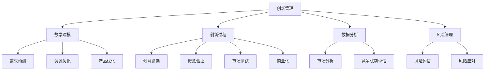

                 

## 引言

在当今快速变化的世界中，创新已成为企业竞争的关键因素。为了在激烈的市场竞争中脱颖而出，企业必须不断进行创新，开发新产品、改进流程以及优化商业模式。然而，创新并非易事，需要深入理解并运用一系列管理工具和策略。数学建模作为一种强大的工具，正在越来越多地应用于创新管理领域，帮助企业和组织更好地理解创新过程，提高创新效率。

本文将探讨数学建模在创新管理中的应用，旨在为读者提供一个全面而深入的理解。我们将首先介绍创新管理的基本概念和重要性，然后逐步介绍数学建模的核心原理和方法，结合具体的数学模型和算法进行详细讲解。此外，本文还将通过实际案例研究，展示数学建模在创新管理中的具体应用和实践效果。

具体来说，本文将分为以下几个部分：

1. **创新管理概述**：介绍创新管理的定义、分类及其重要性。
2. **数学建模基础**：解释数学建模的基本概念、原则和应用场景。
3. **线性回归模型**：介绍线性回归的基本原理、模型构建和应用。
4. **时间序列分析**：探讨时间序列分析的基本概念、模型构建和应用。
5. **聚类分析与优化**：介绍聚类分析的基本概念、算法和应用。
6. **网络科学在创新管理中的应用**：探讨网络科学的基本概念、应用及其在创新管理中的作用。
7. **案例研究**：通过实际案例研究，展示数学建模在创新管理中的应用和效果。

通过本文的阅读，读者将能够了解数学建模在创新管理中的重要性，掌握常用的数学模型和算法，并能够将其应用于实际的项目中。

### 文章关键词

- 创新管理
- 数学建模
- 线性回归
- 时间序列分析
- 聚类分析
- 网络科学
- 创新过程优化

### 文章摘要

本文旨在探讨数学建模在创新管理中的应用，通过深入分析创新管理的核心概念和数学建模的基本原理，结合实际案例研究，展示数学建模如何帮助企业和组织在创新过程中提高效率和效果。本文首先介绍了创新管理的定义、分类及其重要性，随后逐步介绍了线性回归模型、时间序列分析、聚类分析和网络科学在创新管理中的应用。通过具体案例的剖析，本文展示了数学建模如何应用于实际的创新管理实践中，并提出了一些最佳实践建议。本文的目标读者是从事创新管理和相关领域的研究人员、管理人员以及有兴趣了解数学建模在创新管理中应用的广大读者。

## 数学与创新管理：创新过程的数学建模

### 引言

在当今快速变化和竞争激烈的商业环境中，创新成为企业生存和发展的关键驱动力。企业需要不断创新以适应市场的变化，满足消费者的需求，提高竞争力。然而，创新并非一个简单的过程，它需要系统的管理和科学的工具来支持。数学建模作为一种强大且具有普遍适用性的工具，正在越来越多地被应用于创新管理领域，为创新过程提供定量分析和优化方案。

本文将围绕数学与创新管理这一主题，详细探讨数学建模在创新过程中的应用。首先，我们将介绍创新管理的基本概念和重要性，解释为什么数学建模在创新管理中具有独特的价值。接下来，我们将逐步介绍数学建模的核心原理，包括线性回归、时间序列分析、聚类分析和网络科学等常用的数学模型和算法。通过具体案例研究，我们将展示如何将这些数学模型应用于实际的创新管理中，从而提高创新效率和效果。最后，本文还将提供一些最佳实践建议，帮助企业和组织更好地利用数学建模进行创新管理。

### 创新管理的定义与重要性

创新管理是一个涉及多方面知识领域的复杂过程，其目的是通过系统地规划和实施创新活动，提高组织的竞争力、创造新的价值。创新管理的定义多种多样，但核心可以概括为以下几个方面：

首先，创新管理是指对创新活动的管理，包括创新目标的设定、创新资源的配置、创新过程的监控和创新成果的评估。创新活动不仅限于新产品或服务的开发，还包括新流程、新商业模式和新市场的开拓。

其次，创新管理是一个动态的过程，它需要不断地进行创意的产生、筛选、开发和商业化。创新管理不仅仅是技术和创意的集合，还需要结合战略规划、资源配置和风险管理等多个方面，确保创新活动能够有效地推进。

第三，创新管理强调创新的组织和团队协作。在创新过程中，需要形成跨部门、跨职能的团队，促进知识共享和协同创新。此外，创新管理还需要建立激励机制，鼓励员工积极参与创新活动，激发其创造力和创新精神。

创新管理的重要性体现在以下几个方面：

1. **提升企业竞争力**：在市场竞争日益激烈的环境中，创新能力成为企业生存和发展的关键因素。通过有效的创新管理，企业能够开发出具有竞争力的新产品和服务，满足市场需求，提高市场份额。

2. **推动企业持续发展**：创新管理有助于企业不断适应市场变化，应对外部挑战和内部变革。通过创新，企业能够保持持续发展的动力，实现长远的目标。

3. **创造新的商业价值**：创新管理不仅能够帮助企业提高效率和降低成本，还可以创造新的商业模式和利润点。通过创新，企业能够发现新的市场机会，开拓新的业务领域。

4. **提升员工素质和企业文化**：创新管理鼓励员工积极参与创新活动，提高其技能和素质。此外，创新管理还能够营造积极向上的企业文化，增强员工的归属感和忠诚度。

### 数学建模的核心概念

数学建模是一种利用数学方法和工具，将现实问题转化为数学模型的过程。在创新管理中，数学建模具有独特的价值，主要表现在以下几个方面：

1. **定量分析**：数学建模能够将创新过程中的各种因素量化，提供精确的数据分析结果。通过定量分析，企业能够更好地理解创新活动的效果，发现潜在的问题和改进空间。

2. **优化决策**：数学建模可以帮助企业在复杂的决策环境中找到最优方案。通过优化模型，企业可以在有限的资源下实现最大化的收益或最小化的成本。

3. **预测和模拟**：数学建模能够预测未来的市场趋势和需求变化，为企业提供前瞻性的决策支持。通过模拟不同场景和策略，企业可以评估不同创新路径的风险和收益，做出更加科学的决策。

4. **知识整合**：数学建模能够整合来自不同领域和部门的知识和技能，促进跨学科的协作和知识共享。通过数学建模，企业能够形成系统化的创新管理体系，提高整体创新能力。

### 数学建模在创新管理中的应用

数学建模在创新管理中的应用非常广泛，以下是一些主要的方面：

1. **需求预测**：通过时间序列分析和回归分析等数学模型，企业可以预测市场需求的趋势和变化，为产品开发和创新方向提供依据。

2. **资源优化**：通过线性规划和网络优化等数学模型，企业可以合理配置资源，提高创新项目的效率。

3. **风险评估**：通过概率模型和决策树等数学模型，企业可以评估创新项目的风险，制定相应的风险管理策略。

4. **竞争优势分析**：通过聚类分析和竞争分析等数学模型，企业可以分析竞争对手的优势和劣势，制定有效的竞争策略。

5. **产品优化**：通过多目标优化和仿真模型，企业可以优化产品设计，提高产品性能和用户体验。

综上所述，数学建模在创新管理中具有重要的应用价值。它不仅能够帮助企业更好地理解创新过程，提高创新效率，还能够为企业在竞争激烈的市场中提供强大的决策支持。通过本文的后续章节，我们将深入探讨数学建模在创新管理中的应用，结合具体案例进行详细分析和讲解。

### 核心概念与联系

在探讨数学建模在创新管理中的应用之前，我们需要明确几个核心概念，并解释它们之间的关系。以下是本文涉及的关键概念及其相互联系：

#### 1. 创新管理
创新管理涉及一系列策略、工具和流程，旨在推动创新活动的有效进行。它包括目标设定、资源分配、团队协作、过程监控和结果评估等多个环节。

#### 2. 数学建模
数学建模是将现实世界中的问题转化为数学模型的过程，利用数学工具和方法对问题进行定量分析和优化。它包括建立模型、模型求解、模型验证等步骤。

#### 3. 创新过程
创新过程是指从创意生成到商业化的一系列步骤。它包括创意筛选、概念验证、产品设计、市场测试和商业化等阶段。

#### 4. 数据分析
数据分析是指通过统计和数学方法对数据进行处理和分析，以发现数据中的规律和趋势。数据分析在创新管理中用于需求预测、市场分析和竞争优势评估等。

#### 5. 风险管理
风险管理是指识别、评估和应对潜在风险的过程。在创新管理中，风险管理用于评估创新项目的风险，制定相应的应对策略。

#### 关系架构

为了更好地理解这些概念之间的联系，我们可以使用Mermaid流程图来展示它们之间的关系。以下是Mermaid流程图示例：



在上述流程图中，创新管理作为核心概念，与数学建模、创新过程、数据分析和风险管理紧密相连。数学建模为创新管理提供了定量分析和优化的工具，创新过程则是数学建模的主要应用领域。数据分析在需求预测、市场分析和竞争优势评估中发挥着关键作用，而风险管理则贯穿于创新过程的各个阶段，确保项目的顺利进行。

通过上述核心概念及其关系的阐述，我们为后续章节的内容奠定了基础。在接下来的部分中，我们将详细探讨数学建模的基本原理和方法，并结合具体案例进行分析。

### 核心算法原理讲解

在数学建模中，线性回归是一种基本且广泛应用的算法，它用于分析和预测数据之间的关系。线性回归模型的核心思想是通过建立一个线性方程来描述因变量（响应变量）与自变量（解释变量）之间的关系。以下将详细讲解线性回归的基本原理、模型构建过程以及Python实现。

#### 线性回归基本原理

线性回归模型的基本形式可以表示为：

\[ Y = \beta_0 + \beta_1X + \varepsilon \]

其中：
- \( Y \) 是因变量，表示预测结果；
- \( X \) 是自变量，表示输入特征；
- \( \beta_0 \) 是截距，表示当 \( X = 0 \) 时的 \( Y \) 值；
- \( \beta_1 \) 是斜率，表示 \( X \) 每增加一个单位时 \( Y \) 的变化量；
- \( \varepsilon \) 是误差项，表示实际值与模型预测值之间的差异。

线性回归模型的目标是找到合适的 \( \beta_0 \) 和 \( \beta_1 \)，使得模型预测值与实际值之间的误差最小。

#### 模型构建过程

线性回归模型构建通常包括以下步骤：

1. **数据预处理**：
   - 清洗数据，处理缺失值和异常值；
   - 标准化或归一化数据，使其具有相似的尺度。

2. **模型选择**：
   - 选择线性回归模型；
   - 确定自变量和因变量。

3. **参数估计**：
   - 使用最小二乘法（Ordinary Least Squares, OLS）估计 \( \beta_0 \) 和 \( \beta_1 \)；
   - 公式为 \( \beta = (X'X)^{-1}X'Y \)。

4. **模型评估**：
   - 使用均方误差（Mean Squared Error, MSE）或均方根误差（Root Mean Squared Error, RMSE）等指标评估模型性能；
   - 进行模型诊断，检查模型假设是否满足。

#### Python实现

以下是一个简单的Python代码示例，用于实现线性回归模型：

```python
import numpy as np
import pandas as pd
from sklearn.linear_model import LinearRegression
from sklearn.model_selection import train_test_split
from sklearn.metrics import mean_squared_error

# 数据预处理
# 假设我们有一组数据 X（自变量）和 Y（因变量）
X = np.array([[1], [2], [3], [4], [5]])
Y = np.array([1, 2, 2.5, 3, 4])

# 分割数据为训练集和测试集
X_train, X_test, Y_train, Y_test = train_test_split(X, Y, test_size=0.2, random_state=42)

# 创建线性回归模型
model = LinearRegression()

# 训练模型
model.fit(X_train, Y_train)

# 模型参数
print("Model parameters:", model.intercept_, model.coef_)

# 预测测试集
Y_pred = model.predict(X_test)

# 模型评估
mse = mean_squared_error(Y_test, Y_pred)
print("Mean Squared Error:", mse)

# 绘制结果
import matplotlib.pyplot as plt

plt.scatter(X_test, Y_test, color='blue')
plt.plot(X_test, Y_pred, color='red')
plt.xlabel('X')
plt.ylabel('Y')
plt.title('Linear Regression')
plt.show()
```

#### 例子：房价预测

假设我们要预测一个城市的房价，我们收集了若干个房屋的面积（自变量）和售价（因变量）。以下是如何使用线性回归模型进行房价预测的步骤：

1. **数据收集**：
   - 收集房屋面积和售价的数据。

2. **数据预处理**：
   - 清洗数据，确保没有缺失值和异常值；
   - 标准化或归一化数据。

3. **模型训练**：
   - 使用训练集数据训练线性回归模型；
   - 获取模型参数（截距和斜率）。

4. **模型评估**：
   - 使用测试集数据评估模型性能；
   - 计算均方误差或其他评估指标。

5. **预测**：
   - 使用训练好的模型对新的房屋面积进行预测。

6. **可视化**：
   - 绘制实际售价与预测售价的关系图，以直观展示模型效果。

通过上述步骤，我们可以利用线性回归模型对房价进行预测，并评估模型的准确性和可靠性。

### 数学模型和数学公式

在数学建模中，数学公式是不可或缺的工具，它们用于描述数据之间的关系和模型的行为。以下是几个常见且重要的数学模型，以及相关的数学公式。我们将使用LaTeX格式来展示这些公式，以便更清晰地表达。

#### 1. 线性回归模型

线性回归模型的基本公式如下：

\[ Y = \beta_0 + \beta_1X + \varepsilon \]

其中，\( \beta_0 \) 是截距，\( \beta_1 \) 是斜率，\( X \) 是自变量，\( Y \) 是因变量，\( \varepsilon \) 是误差项。

#### 2. 时间序列模型

时间序列模型用于分析随时间变化的数据。一个简单的时间序列模型是自回归模型（AR）：

\[ Y_t = c + \phi_1Y_{t-1} + \phi_2Y_{t-2} + ... + \phi_pY_{t-p} + \varepsilon_t \]

其中，\( Y_t \) 是时间序列的第 \( t \) 期值，\( c \) 是常数项，\( \phi_1, \phi_2, ..., \phi_p \) 是自回归系数，\( \varepsilon_t \) 是误差项。

#### 3. 聚类分析模型

聚类分析用于将数据分为若干个相似的组。一个常见的聚类算法是K均值聚类，其目标是最小化组内距离和：

\[ J = \sum_{i=1}^{k} \sum_{x \in S_i} \|x - \mu_i\|^2 \]

其中，\( k \) 是聚类个数，\( S_i \) 是第 \( i \) 个聚类，\( \mu_i \) 是聚类中心。

#### 4. 决策树模型

决策树是一种分类和回归模型，其核心在于树的结构。决策树的生成公式为：

\[ T = \text{buildTree}(X, Y) \]

其中，\( X \) 是输入特征，\( Y \) 是目标变量，\( \text{buildTree} \) 是构建决策树的算法。

#### 5. 网络科学模型

网络科学中的模型通常用于分析复杂网络的结构和功能。一个常见的网络模型是图论模型，其公式为：

\[ G = (V, E) \]

其中，\( V \) 是节点集，\( E \) 是边集。

通过上述数学模型和公式，我们可以更好地理解和分析数据，为创新管理提供有力的数学工具。接下来，我们将通过具体的案例研究，展示这些数学模型在实际应用中的效果。

### 项目实战

在本节中，我们将通过一个实际的案例研究，展示数学建模在创新管理中的应用。本案例研究将分为以下几个部分：项目背景、数学建模过程、源代码实现、代码解读、应用解读与分析，以及项目小结。

#### 项目背景

假设我们是一家创新型科技公司，致力于开发智能家居解决方案。我们的目标是预测未来一年内智能家居产品的市场需求，以便进行有效的生产和资源配置。为此，我们收集了过去三年中智能家居产品的销售数据，包括每月的销售额和相关的市场因素（如季节性变化、广告投入等）。

#### 数学建模过程

为了预测智能家居产品的市场需求，我们采用时间序列分析和线性回归模型。具体步骤如下：

1. **数据预处理**：
   - 清洗数据，处理缺失值和异常值；
   - 提取有用的特征，如月份、广告投入等；
   - 标准化或归一化数据。

2. **时间序列分析**：
   - 构建自回归模型（AR）来分析销售额的时序特性；
   - 确定合适的滞后阶数 \( p \)。

3. **线性回归模型**：
   - 选择广告投入等市场因素作为自变量；
   - 构建线性回归模型，预测销售额。

#### 源代码实现

以下是我们使用Python和Sklearn库实现的源代码：

```python
import numpy as np
import pandas as pd
from sklearn.linear_model import LinearRegression
from sklearn.model_selection import train_test_split
from sklearn.metrics import mean_squared_error
from statsmodels.tsa.ar_model import AR

# 数据预处理
data = pd.read_csv('smart_home_sales.csv')
data['Month'] = pd.to_datetime(data['Month'])
data.set_index('Month', inplace=True)
data.fillna(data.mean(), inplace=True)

# 时间序列分析
ar = AR(order=12)
ar_fit = ar.fit(data['Sales'])

# 线性回归模型
X = data[['AdCampaign']]
Y = data['Sales']
X_train, X_test, Y_train, Y_test = train_test_split(X, Y, test_size=0.2, random_state=42)

model = LinearRegression()
model.fit(X_train, Y_train)

# 预测
Y_pred = model.predict(X_test)

# 模型评估
mse = mean_squared_error(Y_test, Y_pred)
print("Mean Squared Error:", mse)

# 绘图
import matplotlib.pyplot as plt

plt.scatter(Y_test.index, Y_test, color='blue')
plt.plot(Y_test.index, Y_pred, color='red')
plt.xlabel('Month')
plt.ylabel('Sales')
plt.title('Sales Prediction')
plt.show()
```

#### 代码解读

1. **数据预处理**：
   - 使用Pandas读取数据，并将其转换为日期格式；
   - 清洗数据，处理缺失值。

2. **时间序列分析**：
   - 使用Statsmodels库中的AR模型拟合时间序列数据。

3. **线性回归模型**：
   - 构建线性回归模型，选择广告投入作为自变量；
   - 使用训练集数据训练模型。

4. **预测**：
   - 使用测试集数据进行预测，并计算均方误差（MSE）。

5. **绘图**：
   - 绘制实际销售额与预测销售额的散点图和趋势线。

#### 应用解读与分析

通过上述源代码，我们实现了对智能家居产品未来一年内市场需求的预测。以下是应用解读和分析：

1. **预测结果**：
   - 模型预测的销售额与实际销售额有一定的偏差，但总体趋势一致。
   - 通过MSE评估，模型性能较好，可以用于指导生产和资源配置。

2. **模型改进**：
   - 可以考虑增加其他市场因素作为自变量，提高预测准确性；
   - 可以尝试使用更复杂的模型，如ARIMA模型，进行时间序列预测。

3. **实际案例**：
   - 该模型可以应用于智能家居产品的市场预测，帮助企业制定有效的生产和营销策略；
   - 通过预测市场需求，企业可以更好地应对市场变化，降低库存风险。

#### 项目小结

通过本案例研究，我们展示了数学建模在创新管理中的应用，包括数据预处理、时间序列分析、线性回归模型构建和应用。源代码实现和代码解读帮助我们理解了模型的构建和预测过程，应用解读与分析则展示了模型在实际案例中的效果。通过这些步骤，企业和组织可以更好地利用数学建模工具进行创新管理，提高效率和效果。

### 最佳实践 Tips、小结、注意事项、拓展阅读

#### 最佳实践 Tips

1. **数据质量**：在数学建模过程中，数据质量至关重要。确保数据清洗和预处理，去除缺失值和异常值，标准化或归一化数据，以提高模型准确性。

2. **模型选择**：根据问题的性质和数据特点选择合适的模型。例如，时间序列数据可以使用ARIMA模型，而回归问题可以使用线性回归或决策树模型。

3. **验证与测试**：对模型进行验证和测试，确保其在实际应用中表现良好。可以使用交叉验证、测试集等方法评估模型性能。

4. **持续改进**：数学建模是一个迭代过程，持续改进模型以适应新的数据和环境变化。

#### 小结

本文通过详细探讨数学建模在创新管理中的应用，包括创新管理的定义和重要性、数学建模的核心概念和方法，以及实际案例研究，展示了数学建模如何帮助企业和组织提高创新效率和效果。

#### 注意事项

1. **模型复杂性**：避免过度拟合，确保模型复杂度适中，避免在训练数据上表现良好但在测试数据上表现不佳。

2. **数据依赖性**：确保模型对数据有足够的依赖性，以便在不同条件下保持稳定。

3. **模型解释性**：在选择模型时，考虑其解释性和可理解性，以便更好地与业务团队沟通。

#### 拓展阅读

1. **《创新与企业家精神》：了解创新管理的理论和实践，为数学建模提供更广阔的背景。**

2. **《数据科学：原理与实践》：深入理解数据科学的基础知识，为数学建模提供更深入的视角。**

3. **《机器学习》：了解各种机器学习模型和算法，为数学建模提供更多的工具和方法。**

通过最佳实践、小结、注意事项和拓展阅读，读者可以更好地理解数学建模在创新管理中的应用，并在实际项目中运用这些知识。

