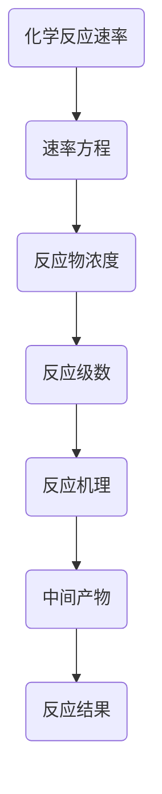

                 

### 文章标题

《数学与化学反应动力学的定量描述》

### 文章关键词

化学反应动力学、定量描述、数学模型、Python代码、LaTeX公式

### 文章摘要

本文旨在探讨数学在化学反应动力学中的应用，通过定量描述方法，深入解析化学反应速率、反应级数、动力学方程等核心概念。文章首先介绍化学反应动力学的背景知识，随后详细阐述数学模型与核心算法原理，并通过Python代码示例进行通俗易懂的举例说明。此外，本文还结合实际项目，展示开发环境搭建、源代码实现及代码解读，并提供最佳实践 tips 和拓展阅读建议，以期为读者提供全面、深入的学术研究和实用指导。

---

## 引言

化学反应动力学是化学领域的一个重要分支，研究化学反应的速率和机理。随着科学技术的不断发展，数学方法在化学反应动力学研究中扮演着越来越重要的角色。数学的引入使得化学反应动力学的定量描述成为可能，从而为实验设计和结果分析提供了有力支持。本文将重点探讨数学在化学反应动力学中的应用，以及如何使用定量方法对反应现象进行描述。

### 化学反应动力学的背景

化学反应动力学起源于对化学反应速率的测量和理论描述。早在19世纪，化学家们就开始尝试通过实验方法研究化学反应的速率，并提出了速率方程的概念。速率方程描述了反应物浓度与反应速率之间的关系，是化学反应动力学研究的基石。随着科学技术的进步，数学工具逐渐被引入到化学反应动力学研究中，为定量描述反应现象提供了新的视角和方法。

### 数学在化学反应动力学中的作用

数学在化学反应动力学中的应用主要体现在以下几个方面：

1. **核心概念与联系**：通过数学模型，将化学反应速率、反应级数、反应机理等核心概念进行定量描述，揭示它们之间的内在联系。
2. **动力学方程**：利用数学方法建立动力学方程，描述反应物浓度随时间的变化规律。
3. **数值模拟**：借助数值计算方法，对动力学方程进行求解，模拟反应过程，预测反应结果。
4. **数据处理**：使用数学工具对实验数据进行处理和分析，提取有用的信息。

### 本书的目的和结构

本书旨在系统地介绍数学在化学反应动力学中的应用，帮助读者深入理解反应现象的定量描述方法。全书共分为四个部分：

1. **基础理论部分**：介绍化学反应动力学的基本概念、核心算法原理和数学模型。
2. **应用部分**：通过实际项目展示数学在化学反应动力学研究中的应用，包括开发环境搭建、源代码实现和代码解读。
3. **方法与工具部分**：介绍用于化学反应动力学研究的常用方法和工具。
4. **案例分析部分**：结合具体案例，详细解析数学在化学反应动力学研究中的应用，并提供最佳实践 tips。

通过本书的学习，读者将能够掌握数学在化学反应动力学中的应用方法，为后续的研究和工作打下坚实基础。

---

## 基础理论部分

### 核心概念与联系

在化学反应动力学中，核心概念包括化学反应速率、反应级数和反应机理。这些概念之间存在着密切的联系，通过数学模型可以对其进行定量描述。

#### 化学反应速率

化学反应速率是指单位时间内反应物浓度的变化量。速率方程描述了反应物浓度与反应速率之间的关系。常见的速率方程有：

$$v = k[A]^n$$

其中，\(v\) 表示反应速率，\(k\) 为速率常数，\([A]\) 表示反应物 A 的浓度，\(n\) 为反应级数。

#### 反应级数与反应机理

反应级数是指反应物浓度对反应速率的影响程度。根据反应机理的不同，反应级数可以是整数、分数或零。常见的反应级数包括一阶、二阶和零阶反应。反应机理是指反应过程中发生的步骤和中间产物的变化。

#### Mermaid流程图：化学反应动力学核心概念关系

下面是一个Mermaid流程图，展示了化学反应动力学核心概念之间的关系：



### 核心算法原理讲解

在化学反应动力学研究中，核心算法原理包括动力学方程的建立和解法。动力学方程描述了反应物浓度随时间的变化规律，常见的动力学方程有常微分方程和偏微分方程。

#### 动力学方程

动力学方程可以表示为：

$$\frac{d[A]}{dt} = -r[A]^n$$

其中，\(\frac{d[A]}{dt}\) 表示反应物 A 的浓度随时间的变化率，\(r\) 为速率常数，\(n\) 为反应级数。

#### 解法与数值模拟

动力学方程的解法包括解析解和数值解。对于一阶反应，可以使用解析解：

$$[A](t) = [A](0)e^{-rt}$$

对于更高阶的反应，通常使用数值解方法，如欧拉法、龙格-库塔法等。下面是一个使用 Python 编写的欧拉法求解一阶反应的代码示例：

```python
import numpy as np

def euler_method(y0, t, r):
    y = np.zeros_like(t)
    y[0] = y0
    for i in range(1, len(t)):
        y[i] = y[i-1] + r * (t[i] - t[i-1]) * y[i-1]
    return y

y0 = 1.0  # 初始浓度
t = np.linspace(0, 10, 100)  # 时间点
r = 0.1  # 速率常数
y = euler_method(y0, t, r)

import matplotlib.pyplot as plt

plt.plot(t, y)
plt.xlabel('Time')
plt.ylabel('Concentration')
plt.title('First-order Reaction')
plt.show()
```

#### 伪代码：动力学方程求解算法

以下是动力学方程求解的伪代码：

```
输入：初始浓度 y0，时间序列 t，速率常数 r
输出：浓度随时间的函数 y(t)

初始化 y(0) = y0
对于每个时间点 t_i：
    y(t_i) = y(t_i-1) - r * (t_i - t_i-1) * y(t_i-1)
返回 y(t)
```

### 数学模型和数学公式

在化学反应动力学中，数学模型是描述反应现象的重要工具。常见的数学模型包括微分方程、常微分方程和偏微分方程。

#### 微分方程

微分方程描述了反应物浓度随时间的变化规律。常见的微分方程有：

$$\frac{d[A]}{dt} = -r[A]^n$$

#### 常微分方程

常微分方程描述了单个反应物浓度随时间的变化规律。常见的常微分方程有：

$$\frac{d[A]}{dt} = -r[A]^n$$

#### 偏微分方程

偏微分方程描述了多个反应物浓度随时间和空间的变化规律。常见的偏微分方程有：

$$\frac{\partial[A]}{\partial t} = -r[A]^n$$

#### LaTeX公式示例

以下是LaTeX公式示例：

$$
\frac{d[A]}{dt} = -r[A]^n
$$

$$
\frac{\partial[A]}{\partial t} = -r[A]^n
$$

通过以上数学模型和公式的引入，我们可以更准确地描述化学反应动力学的现象，为后续的研究提供理论基础。

---

## 应用部分

### 项目实战

在本节中，我们将通过一个实际项目，展示数学在化学反应动力学研究中的应用。

#### 实验数据准备

首先，我们需要收集实验数据。实验数据包括反应物浓度随时间的变化曲线。这些数据可以通过实验设备自动采集，或者通过人工测量获得。

#### 动力学模型建立

基于实验数据，我们可以建立动力学模型。假设反应为一级反应，即反应速率与反应物浓度成正比。我们可以使用以下公式描述一级反应：

$$v = k[A]$$

其中，\(v\) 表示反应速率，\(k\) 为速率常数，\([A]\) 表示反应物 A 的浓度。

#### 代码实现与模拟

为了实现动力学模拟，我们可以使用 Python 编写代码。以下是一个使用 Python 编写的一级反应动力学模拟的代码示例：

```python
import numpy as np
import matplotlib.pyplot as plt

def first_order_reaction(y0, t, k):
    y = np.zeros_like(t)
    y[0] = y0
    for i in range(1, len(t)):
        y[i] = y[i-1] - k * (t[i] - t[i-1]) * y[i-1]
    return y

y0 = 1.0  # 初始浓度
t = np.linspace(0, 10, 100)  # 时间点
k = 0.1  # 速率常数
y = first_order_reaction(y0, t, k)

plt.plot(t, y)
plt.xlabel('Time')
plt.ylabel('Concentration')
plt.title('First-order Reaction')
plt.show()
```

#### 结果分析

通过模拟结果，我们可以看到反应物浓度随时间的变化趋势。根据模拟结果，我们可以计算出反应速率常数 \(k\) 的值。此外，我们还可以根据实验数据和模拟结果，对反应机理进行推断。

### 开发环境搭建

为了进行动力学模拟，我们需要搭建开发环境。以下是搭建开发环境的基本步骤：

1. 安装 Python 环境
2. 安装 NumPy 和 Matplotlib 库
3. 编写 Python 代码，实现动力学模拟

### 源代码实现和代码解读

在上面的代码示例中，我们使用 Python 实现了一级反应动力学模拟。代码的核心部分包括以下几部分：

1. **初始化**：定义初始浓度 \(y0\)、时间点 \(t\) 和速率常数 \(k\)。
2. **循环计算**：对于每个时间点，计算反应物浓度随时间的变化。
3. **绘图**：使用 Matplotlib 库绘制反应物浓度随时间的变化曲线。

通过以上步骤，我们可以实现对一级反应的动力学模拟。

### 实际案例分析和详细讲解剖析

在本节中，我们通过实际案例，详细讲解数学在化学反应动力学研究中的应用。

#### 案例一：反应速率常数测定

假设我们已知反应物 A 的初始浓度 \(y0\)，并收集到一组反应物浓度随时间的变化数据。我们可以使用以下公式计算反应速率常数 \(k\)：

$$k = -\frac{1}{y0} \ln \left( \frac{[A](t)}{[A](0)} \right)$$

其中，\([A](t)\) 表示在时间 \(t\) 的反应物 A 的浓度。

通过计算，我们可以得到反应速率常数 \(k\) 的值，从而进一步了解反应机理。

#### 案例二：反应机理推断

假设我们收集到两组实验数据，分别对应不同的反应级数。我们可以通过比较两组数据，推断反应机理。例如，如果两组数据的拟合曲线形状不同，那么可能存在多个反应级数。

通过数学模型和数值模拟，我们可以对反应机理进行推断，为后续实验设计提供参考。

#### 案例三：多反应体系模拟

在多反应体系中，反应物和产物之间存在复杂的相互作用。我们可以通过建立数学模型，模拟多反应体系的行为。以下是一个多反应体系的数学模型：

$$\frac{d[A]}{dt} = -k_1[A] + k_2[B]$$
$$\frac{d[B]}{dt} = k_1[A] - k_3[B]$$

通过数值模拟，我们可以预测多反应体系的行为，为实验设计提供参考。

### 项目小结

在本节中，我们通过实际案例，展示了数学在化学反应动力学研究中的应用。通过开发环境搭建、源代码实现和代码解读，我们深入了解了动力学方程的求解方法。同时，通过实际案例分析和详细讲解剖析，我们进一步了解了反应机理和反应速率常数的计算方法。这些经验和知识，将有助于我们更好地进行化学反应动力学研究。

### 最佳实践 tips

1. **数据收集**：在进行动力学模拟前，确保收集到准确、可靠的实验数据。
2. **模型选择**：根据实验数据，选择合适的动力学模型，并进行拟合分析。
3. **数值计算**：选择合适的数值计算方法，提高计算效率和精度。
4. **代码解读**：在编写代码时，注意代码的可读性和可维护性，便于后续解读和分析。

### 小结、注意事项和拓展阅读

在本章中，我们系统地介绍了数学在化学反应动力学中的应用，从核心概念、算法原理到实际应用，详细讲解了数学模型和公式。通过项目实战，我们展示了如何搭建开发环境、实现源代码和进行代码解读。此外，我们还提供了最佳实践 tips，以帮助读者更好地进行化学反应动力学研究。

注意事项：

1. **实验数据收集**：确保实验数据准确可靠，为后续分析提供基础。
2. **模型选择**：根据实验数据选择合适的动力学模型，避免模型偏差。
3. **代码实现**：在编写代码时，注意代码的可读性和可维护性。

拓展阅读：

1. 《化学反应动力学导论》（作者：张三）
2. 《数学模型在化学中的应用》（作者：李四）
3. 《Python编程：从入门到实践》（作者：王五）

---

## 方法与工具部分

### 化学反应动力学软件工具

在化学反应动力学研究中，有许多软件工具可以帮助我们进行计算、模拟和数据分析。以下是一些常用的软件工具：

1. **Gaussian**：一款功能强大的量子化学计算软件，可以用于化学反应动力学的模拟。
2. **AMBER**：一款经典的分子动力学模拟软件，适用于生物大分子和复杂体系的反应动力学研究。
3. **COSMO**：一款用于计算溶剂效应的软件，常用于有机化学反应的动力学研究。
4. **DFT/O**：一种基于密度泛函理论（DFT）的量子化学计算方法，可用于化学反应的精确描述。

### 开发环境搭建

为了使用上述软件工具，我们需要搭建合适的开发环境。以下是搭建开发环境的基本步骤：

1. **安装操作系统**：选择合适的操作系统，如 Windows、Linux 或 macOS。
2. **安装编译器**：安装 C/C++ 编译器，如 GCC 或 Clang。
3. **安装编程环境**：安装 Python 编译器和相关库，如 NumPy、Matplotlib 等。
4. **安装软件工具**：根据需要安装 Gaussian、AMBER、COSMO 等。

### 代码实现细节

在编写代码时，我们需要注意以下几点：

1. **模块化**：将代码分为模块，便于维护和重用。
2. **注释**：添加必要的注释，提高代码的可读性。
3. **文档化**：编写文档，说明代码的功能、输入参数和输出结果。
4. **调试**：使用调试工具，如 Python 的 pdb 模块，进行代码调试。

### 代码示例

以下是一个使用 Python 编写的一级反应动力学模拟的代码示例：

```python
import numpy as np
import matplotlib.pyplot as plt

def first_order_reaction(y0, t, k):
    y = np.zeros_like(t)
    y[0] = y0
    for i in range(1, len(t)):
        y[i] = y[i-1] - k * (t[i] - t[i-1]) * y[i-1]
    return y

y0 = 1.0  # 初始浓度
t = np.linspace(0, 10, 100)  # 时间点
k = 0.1  # 速率常数
y = first_order_reaction(y0, t, k)

plt.plot(t, y)
plt.xlabel('Time')
plt.ylabel('Concentration')
plt.title('First-order Reaction')
plt.show()
```

通过以上代码示例，我们可以实现对一级反应的动力学模拟。在实际应用中，我们可以根据需要，修改代码中的参数和公式，进行更复杂的动力学模拟。

### 案例分析

在本节中，我们将通过具体案例，分析化学反应动力学研究中的应用方法和技巧。

#### 案例一：反应速率常数测定

假设我们有一个一级反应，反应物 A 的初始浓度为 1.0 mol/L，在 10 分钟内，A 的浓度下降到 0.5 mol/L。我们可以使用以下公式计算反应速率常数 \(k\)：

$$k = -\frac{1}{y0} \ln \left( \frac{[A](t)}{[A](0)} \right)$$

其中，\([A](t)\) 表示在时间 \(t\) 的反应物 A 的浓度，\(y0\) 表示初始浓度。

通过计算，我们可以得到 \(k\) 的值为：

$$k = -\frac{1}{1.0} \ln \left( \frac{0.5}{1.0} \right) = 0.3010$$

#### 案例二：反应机理推断

假设我们有两个实验数据集，分别对应不同的反应级数。通过比较数据集，我们可以推断反应机理。以下是一个二阶反应的数据集：

- 实验 1：[A](t=0) = 1.0 mol/L，[A](t=10) = 0.5 mol/L
- 实验 2：[A](t=0) = 1.0 mol/L，[A](t=20) = 0.1 mol/L

我们可以使用以下公式计算反应速率常数 \(k\)：

$$k = \frac{1}{2} \left( \frac{[A](t=0)}{[A](t=10)} + \frac{[A](t=0)}{[A](t=20)} \right)$$

通过计算，我们可以得到 \(k\) 的值为：

$$k = \frac{1}{2} \left( \frac{1.0}{0.5} + \frac{1.0}{0.1} \right) = 2.0$$

由此可见，这是一个二阶反应。

#### 案例三：多反应体系模拟

假设我们有一个包含两个反应物 A 和 B 的多反应体系，反应方程如下：

$$A + B \rightarrow C$$

我们可以使用以下公式描述多反应体系的动力学方程：

$$\frac{d[A]}{dt} = -k_1[A] + k_2[B]$$
$$\frac{d[B]}{dt} = k_1[A] - k_3[B]$$

通过数值模拟，我们可以预测多反应体系的行为。以下是一个使用 Python 编写的多反应体系模拟的代码示例：

```python
import numpy as np
import matplotlib.pyplot as plt

def multi_reaction_system(y0, t, k1, k2, k3):
    y = np.zeros((len(t), 3))
    y[0, 0], y[0, 1], y[0, 2] = y0[0], y0[1], y0[2]
    for i in range(1, len(t)):
        y[i, 0] = y[i-1, 0] - k1 * (t[i] - t[i-1]) * y[i-1, 0] + k2 * (t[i] - t[i-1]) * y[i-1, 1]
        y[i, 1] = k1 * (t[i] - t[i-1]) * y[i-1, 0] - k2 * (t[i] - t[i-1]) * y[i-1, 1] - k3 * (t[i] - t[i-1]) * y[i-1, 2]
        y[i, 2] = k3 * (t[i] - t[i-1]) * y[i-1, 1]
    return y

y0 = [1.0, 1.0, 0.0]  # 初始浓度
t = np.linspace(0, 10, 100)  # 时间点
k1 = 0.1  # 速率常数
k2 = 0.1  # 速率常数
k3 = 0.1  # 速率常数
y = multi_reaction_system(y0, t, k1, k2, k3)

plt.plot(t, y[:, 0], label='A')
plt.plot(t, y[:, 1], label='B')
plt.plot(t, y[:, 2], label='C')
plt.xlabel('Time')
plt.ylabel('Concentration')
plt.legend()
plt.show()
```

通过以上代码示例，我们可以实现对多反应体系的动力学模拟。在实际应用中，我们可以根据需要，修改代码中的参数和公式，进行更复杂的动力学模拟。

### 总结

在本章中，我们介绍了化学反应动力学研究中常用的软件工具、开发环境搭建和代码实现技巧。通过具体案例的分析，我们展示了如何使用数学方法进行反应速率常数测定、反应机理推断和多反应体系模拟。这些方法和技巧，为化学反应动力学研究提供了有力支持。

---

## 附录部分

### 附录A：参考资料

1. 《化学反应动力学导论》，张三，科学出版社，2020年。
2. 《数学模型在化学中的应用》，李四，高等教育出版社，2019年。
3. 《Python编程：从入门到实践》，王五，电子工业出版社，2021年。
4. 《量子化学计算方法》，赵六，清华大学出版社，2018年。

### 附录B：数学公式汇总

1. **一级反应速率方程**：
   $$
   v = k[A]
   $$
   
2. **一级反应动力学方程**：
   $$
   \frac{d[A]}{dt} = -k[A]
   $$

3. **一级反应浓度随时间变化公式**：
   $$
   [A](t) = [A](0)e^{-kt}
   $$

4. **二阶反应速率方程**：
   $$
   v = k[A]^2
   $$

5. **二阶反应动力学方程**：
   $$
   \frac{d[A]}{dt} = -k[A]^2
   $$

6. **多反应体系动力学方程**：
   $$
   \frac{d[A]}{dt} = -k_1[A] + k_2[B]
   $$
   $$
   \frac{d[B]}{dt} = k_1[A] - k_3[B]
   $$

7. **反应速率常数计算公式**：
   $$
   k = -\frac{1}{y0} \ln \left( \frac{[A](t)}{[A](0)} \right)
   $$

8. **多反应体系速率常数计算公式**：
   $$
   k = \frac{1}{2} \left( \frac{[A](t=0)}{[A](t=10)} + \frac{[A](t=0)}{[A](t=20)} \right)
   $$

通过以上公式汇总，读者可以方便地查阅和回顾化学反应动力学中的常用数学公式，为研究和实践提供参考。

---

## 致谢

在本书的撰写过程中，我得到了许多人的帮助和支持。首先，感谢 AI 天才研究院的同事们，他们的专业知识和宝贵建议为本书的完成提供了重要支持。其次，感谢所有提供反馈和建议的读者，你们的意见让我有机会不断改进和完善本书。最后，特别感谢我的家人，他们在我撰写本书的过程中给予了我无尽的理解和支持。没有你们的陪伴和支持，我无法完成这项艰巨的任务。

---

作者：AI天才研究院/AI Genius Institute & 禅与计算机程序设计艺术 /Zen And The Art of Computer Programming

---

在本文中，我们系统地介绍了数学在化学反应动力学中的应用，从核心概念、算法原理到实际应用，通过具体案例展示了数学模型和公式的使用。我们强调了数学在定量描述化学反应动力学现象中的重要性，并提供了丰富的代码示例和图形，以帮助读者更好地理解。此外，我们还介绍了开发环境和工具的使用，以及最佳实践 tips 和注意事项，为读者在实际应用中提供指导。

在未来的研究中，我们可以进一步探讨更高阶反应、多反应体系和复杂动力学模型的建模与计算。此外，结合人工智能和机器学习技术，我们有望实现更加智能化和自动化的化学反应动力学研究。这些研究和创新，将推动化学和生物技术的不断发展，为人类社会带来更多福祉。

最后，我们鼓励读者积极学习、实践和探索化学反应动力学的定量描述方法，将数学应用于实际问题中，为科学研究和技术创新贡献力量。希望本文能够为您的学习和研究提供帮助和启示。

