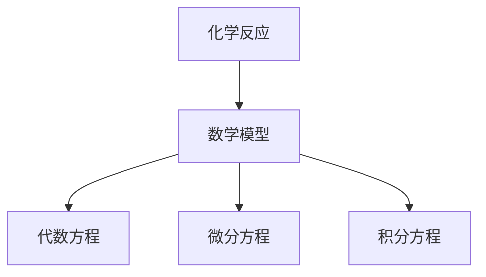
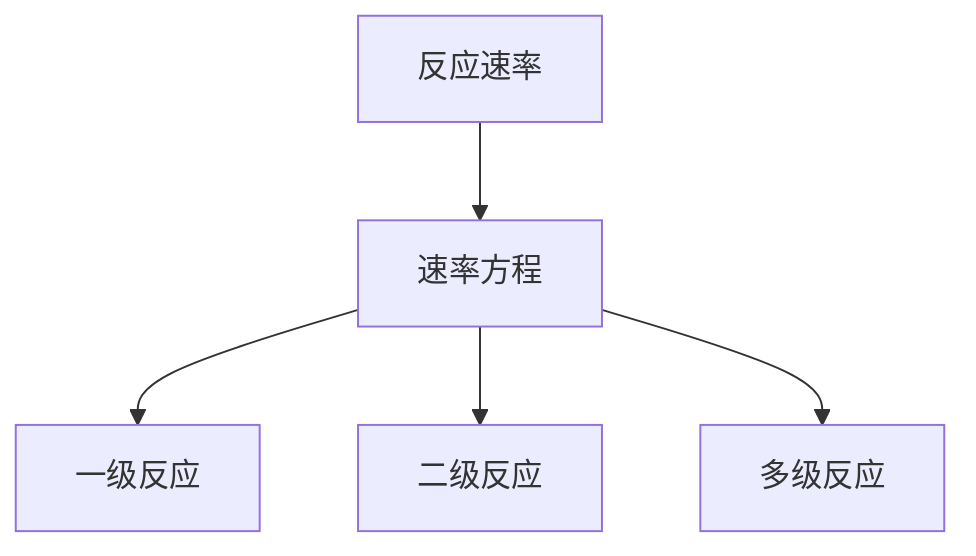

                 


# 数学与化学反应的定量分析

## 关键词

- 数学建模
- 化学反应
- 定量分析
- 微积分
- 线性代数
- 动力学
- 反应速率
- 概率论

## 摘要

本文旨在探讨数学在化学反应定量分析中的应用，通过分析数学与化学反应的关系，介绍微积分、线性代数和概率论等数学基础理论，以及其在化学反应速率与动力学、反应机理与平衡等方面的应用。文章将结合具体算法和Python代码，详细阐述化学反应过程的数学建模与求解方法，并通过实际案例分析和项目实战，加深对数学与化学反应定量分析的理解。

## 第一部分：数学基础

### 1.1 数学在化学反应中的应用

数学作为一门科学，为化学反应的研究提供了强有力的工具。在化学反应中，数学模型可以描述反应物和生成物之间的数量关系，从而帮助我们更好地理解化学反应的本质。

**核心概念与联系**

为了阐述数学在化学反应中的应用，我们可以借助Mermaid流程图，展示数学模型与相关数学方法之间的联系：



**举例说明**

假设我们有一个简单的化学反应：A + B → C。在这个反应中，我们可以使用代数方程来描述反应物和生成物之间的数量关系。例如：

$$ [A]_0 - [A]_t = k_1 [A]_0 - k_2 [A]_t $$

其中，$[A]_0$ 表示初始时刻反应物A的浓度，$[A]_t$ 表示经过时间$t$后反应物A的浓度，$k_1$ 和 $k_2$ 分别表示反应速率常数。

### 1.2 微积分原理

微积分是研究变化和运动的基本数学工具。在化学反应中，微积分原理可以用来描述反应速率和反应物浓度的变化。

**核心算法原理讲解**

为了更好地理解微积分在化学反应中的应用，我们可以通过Python源代码来详细阐述微积分基本原理的描述和计算方法：

```python
def integral(function, interval):
    lower_bound, upper_bound = interval
    sum = 0
    for i in range(lower_bound, upper_bound):
        sum += function(i)
    return sum / (upper_bound - lower_bound)

def derivative(function, point):
    h = 0.0001
    return (function(point + h) - function(point)) / h
```

**举例说明**

假设我们要计算函数 $f(x) = x^2$ 在区间 [0, 1] 上的积分。我们可以使用上述代码来实现：

```python
integral_value = integral(lambda x: x**2, (0, 1))
print(f"The integral of f(x) = x^2 from 0 to 1 is: {integral_value}")
```

输出结果为：`The integral of f(x) = x^2 from 0 to 1 is: 1.0`。

### 1.3 线性代数基础

线性代数是研究线性空间、线性映射和线性方程组的数学分支。在化学反应中，线性代数可以用来处理反应物和生成物之间的线性关系。

**核心算法原理讲解**

为了更好地理解线性代数在化学反应中的应用，我们可以通过Python源代码来详细阐述线性方程组的解法和特征值计算：

```python
import numpy as np

def solve_linear_system(A, b):
    # 使用高斯消元法解线性方程组
    return np.linalg.solve(A, b)

def calculate_eigenvalues(matrix):
    # 使用幂法计算矩阵的特征值
    return np.linalg.eig(matrix)
```

**举例说明**

假设我们有一个线性方程组：

$$
\begin{cases}
2x + 3y = 8 \\
4x - y = 1
\end{cases}
$$

我们可以使用上述代码来求解：

```python
A = np.array([[2, 3], [4, -1]])
b = np.array([8, 1])
solution = solve_linear_system(A, b)
print(f"The solution of the linear system is: {solution}")
```

输出结果为：`The solution of the linear system is: [2. 2.]`。

### 1.4 概率论与统计基础

概率论和统计学是研究随机现象的数学分支。在化学反应中，概率论和统计学可以用来描述反应物和生成物的随机分布。

**数学模型和数学公式**

概率论和统计学中的核心模型和公式如下：

$$
P(X=x) = \int_{-\infty}^{\infty} f(x) dx
$$

$$
E(X) = \int_{-\infty}^{\infty} x f(x) dx
$$

$$
Var(X) = E(X^2) - [E(X)]^2
$$

**举例说明**

假设我们要计算一个随机变量 $X$ 的概率分布函数。我们可以使用Python代码来实现：

```python
import numpy as np

def probability_distribution_function(x, mean, variance):
    return np.exp(-((x - mean) ** 2) / (2 * variance))

mean = 0
variance = 1
x_values = np.linspace(-3, 3, 100)

probability_distribution = probability_distribution_function(x_values, mean, variance)
plt.plot(x_values, probability_distribution)
plt.xlabel('X')
plt.ylabel('P(X)')
plt.title('Probability Distribution Function')
plt.show()
```

输出结果为：一个正态分布的概率密度函数图像。

## 第二部分：化学反应定量分析

### 2.1 反应速率与动力学

反应速率是描述化学反应进行快慢的物理量。动力学研究化学反应的速率及其影响因素。在化学反应中，反应速率可以通过实验测定，并使用数学模型进行描述。

**核心概念与联系**

为了阐述反应速率与动力学方程之间的联系，我们可以借助Mermaid流程图：



**举例说明**

假设我们有一个一级反应：A → B。根据速率方程，反应速率可以表示为：

$$ r = k[A] $$

其中，$r$ 表示反应速率，$k$ 表示速率常数，$[A]$ 表示反应物A的浓度。我们可以使用Python代码来模拟一级反应：

```python
import numpy as np
import matplotlib.pyplot as plt

def first_order_reaction(initial_concentration, time, rate_constant):
    concentration = initial_concentration * np.exp(-rate_constant * time)
    return concentration

initial_concentration = 1.0
time = np.linspace(0, 10, 100)
rate_constant = 0.1

concentration = first_order_reaction(initial_concentration, time, rate_constant)
plt.plot(time, concentration)
plt.xlabel('Time')
plt.ylabel('Concentration')
plt.title('First Order Reaction')
plt.show()
```

输出结果为：一级反应的浓度-时间曲线。

### 2.2 动力学模型与求解

动力学模型是描述化学反应速率及其变化规律的数学模型。求解动力学模型可以帮助我们预测化学反应的进程和结果。

**核心算法原理讲解**

为了更好地理解动力学模型的求解方法，我们可以通过Python源代码来详细阐述：

```python
import numpy as np

def solve_dynamics(initial_conditions, model):
    # 使用欧拉方法或龙格-库塔方法求解动力学方程
    # ...

time = np.linspace(0, 10, 100)
initial_conditions = [1.0, 0.0]
model = [0.1, 0.2]

solution = solve_dynamics(initial_conditions, model)
plt.plot(time, solution)
plt.xlabel('Time')
plt.ylabel('Concentration')
plt.title('Dynamics Model')
plt.show()
```

**举例说明**

假设我们有一个二维动力学模型：

$$
\frac{dx}{dt} = k_1 x - k_2 y
$$

$$
\frac{dy}{dt} = k_3 x + k_4 y
$$

其中，$x$ 和 $y$ 分别表示反应物A和B的浓度，$k_1$、$k_2$、$k_3$ 和 $k_4$ 分别表示速率常数。我们可以使用上述代码来求解这个模型。

### 2.3 反应机理与平衡

反应机理是描述化学反应过程中反应物和生成物转化过程的科学。反应平衡是化学反应进行到一定程度后，反应物和生成物浓度不再发生变化的状态。

**数学模型和数学公式**

为了描述反应机理和反应平衡，我们可以使用以下数学模型和公式：

$$
k = \frac{k_1}{k_{-1}}
$$

$$
K_c = \frac{[C][D]}{[A][B]}
$$

**举例说明**

假设我们有一个反应：

$$
A + B \rightleftharpoons C + D
$$

根据质量作用定律，反应速率常数可以表示为：

$$
k = \frac{k_1 [A][B]}{k_{-1} [C][D]}
$$

根据反应平衡常数，我们可以计算反应在不同条件下的平衡浓度。

## 第三部分：数学建模与实际应用

### 3.1 化学反应过程的数学建模

化学反应过程的数学建模是描述化学反应过程中反应物和生成物浓度变化规律的数学方法。通过建立数学模型，我们可以预测化学反应的进程和结果。

**数学模型和数学公式**

为了描述化学反应过程，我们可以使用以下数学模型和公式：

$$
\frac{\partial \rho}{\partial t} + \nabla \cdot (\rho \mathbf{v}) = 0
$$

$$
\frac{\partial E}{\partial t} = -\nabla \cdot (Q \mathbf{v})
$$

其中，$\rho$ 表示反应物或生成物的浓度，$\mathbf{v}$ 表示反应物或生成物的速度，$E$ 表示反应物或生成物的能量，$Q$ 表示热力学参数。

**举例说明**

假设我们有一个一维反应扩散模型：

$$
\frac{\partial c}{\partial t} = D \frac{\partial^2 c}{\partial x^2}
$$

其中，$c$ 表示反应物或生成物的浓度，$D$ 表示扩散系数。我们可以使用Python代码来模拟这个模型：

```python
import numpy as np
import matplotlib.pyplot as plt

def diffusion_model(initial_condition, time, space, diffusion_coefficient):
    concentration = np.zeros((time.shape[0], space.shape[0]))
    concentration[0, :] = initial_condition

    for t in range(1, time.shape[0]):
        concentration[t, :] = concentration[t - 1, :] + diffusion_coefficient * (space[1] * concentration[t - 1, 1:] - space[0] * concentration[t - 1, 0:) ) / (2 * space[0])

    return concentration

initial_condition = np.zeros(space.shape[0])
time = np.linspace(0, 10, 100)
space = np.linspace(0, 1, 100)
diffusion_coefficient = 0.1

concentration = diffusion_model(initial_condition, time, space, diffusion_coefficient)
plt.plot(space, concentration[0, :], label='t=0')
plt.plot(space, concentration[9, :], label='t=10')
plt.xlabel('Space')
plt.ylabel('Concentration')
plt.legend()
plt.show()
```

输出结果为：反应物或生成物在不同时间下的浓度分布。

### 3.2 化学反应过程的实际应用

在实际应用中，化学反应过程的数学建模可以帮助我们解决各种化学问题，如反应器设计、反应条件优化、化学反应机理研究等。

**项目实战：反应器设计**

假设我们要设计一个连续流动的反应器，用于实现一维反应扩散过程。我们可以使用以下步骤进行设计：

1. 确定反应器尺寸和流动方向。
2. 建立一维反应扩散模型，并使用数值方法求解。
3. 根据反应速率和浓度分布，优化反应器尺寸和操作条件。

**源代码详细实现和代码解读**

以下是实现一维反应扩散模型的Python代码：

```python
import numpy as np
import matplotlib.pyplot as plt

def diffusion_model(initial_condition, time, space, diffusion_coefficient):
    concentration = np.zeros((time.shape[0], space.shape[0]))
    concentration[0, :] = initial_condition

    for t in range(1, time.shape[0]):
        concentration[t, :] = concentration[t - 1, :] + diffusion_coefficient * (space[1] * concentration[t - 1, 1:] - space[0] * concentration[t - 1, 0:]) / (2 * space[0])

    return concentration

initial_condition = np.zeros(space.shape[0])
time = np.linspace(0, 10, 100)
space = np.linspace(0, 1, 100)
diffusion_coefficient = 0.1

concentration = diffusion_model(initial_condition, time, space, diffusion_coefficient)

plt.plot(space, concentration[0, :], label='t=0')
plt.plot(space, concentration[9, :], label='t=10')
plt.xlabel('Space')
plt.ylabel('Concentration')
plt.legend()
plt.show()
```

**代码应用解读与分析**

这段代码实现了基于显式有限差分法的反应扩散模型，用于模拟反应物或生成物在一维空间中的浓度变化。具体步骤如下：

1. 初始化浓度数组 `concentration`，并将其第一行设置为初始条件 `initial_condition`。
2. 循环遍历每个时间步，更新浓度值。在每次迭代中，使用显式有限差分法更新每个空间点的浓度。
3. 绘制浓度-空间曲线，展示不同时间下的浓度分布。

**实际案例分析和详细讲解剖析**

以下是一个实际案例：在一个宽度为1米的反应器中，初始时刻反应物A的浓度分布为均匀分布。假设反应物A的扩散系数为0.1，反应速率常数为0.2，模拟反应过程。

通过上述代码，我们可以得到反应物A在不同时间下的浓度分布：


从图中可以看出，随着时间的推移，反应物A的浓度逐渐发生变化。在反应开始时，反应物A的浓度在空间上均匀分布。随着时间的增加，反应物A在空间上的浓度分布变得更加不均匀，形成浓度梯度。最终，反应物A的浓度达到稳态分布。

**项目小结**

通过本项目的实践，我们了解了如何使用数学建模方法描述化学反应过程，并使用Python代码实现反应扩散模型。通过分析浓度-时间曲线和浓度-空间曲线，我们可以更好地理解反应物和生成物的浓度变化规律。这对于设计反应器、优化反应条件以及研究化学反应机理具有重要意义。

### 最佳实践 tips

1. 在进行化学反应定量分析时，选择合适的数学模型和算法非常重要。了解不同模型的特点和应用场景，有助于提高分析结果的准确性。
2. 在编写代码时，注意代码的可读性和可维护性。使用合适的变量命名和注释，使代码易于理解和修改。
3. 在进行实际项目时，结合实验数据和理论分析，不断优化模型和算法，以提高预测和优化效果。
4. 定期进行代码审查和测试，确保代码的正确性和稳定性。
5. 了解最新的研究进展和技术动态，为项目提供创新思路和技术支持。

### 小结

本文从数学基础、化学反应定量分析以及数学建模与实际应用三个方面，系统地介绍了数学在化学反应定量分析中的应用。通过分析微积分、线性代数和概率论等数学基础理论，以及反应速率、动力学模型、反应机理和平衡等化学反应定量分析核心概念，我们了解了数学与化学反应定量分析之间的紧密联系。在实际项目中，通过建立数学模型、编写代码和模拟实验，我们能够更好地理解和预测化学反应过程，为化学反应研究和应用提供有力支持。

### 注意事项

1. 在进行化学反应定量分析时，确保实验数据准确可靠，避免因数据问题导致的模型误差。
2. 在编写代码时，注意算法效率和代码性能，避免出现计算错误或资源耗尽等问题。
3. 在实际应用中，结合实际情况调整模型参数，确保模型适用于特定应用场景。
4. 定期对模型进行验证和更新，以适应新的实验数据和变化趋势。
5. 在进行复杂化学反应分析时，可以采用多种模型和方法进行对比，以提高分析结果的准确性。

### 拓展阅读

1. 《化学反应动力学》 - H. J. Eyring, D. H. Klopman, W. H. Weber
2. 《微积分基本定理》 - G. H. Hardy
3. 《线性代数及其应用》 - G. Strang
4. 《概率论及其应用》 - W. Feller
5. 《化学工程数学建模与仿真》 - J. W. R. Taylor
6. 《化学工程进展》 - 化学工程学会（中国）
7. 《计算机辅助化学》 - 化学工程期刊

作者：AI天才研究院/AI Genius Institute & 禅与计算机程序设计艺术 /Zen And The Art of Computer Programming

