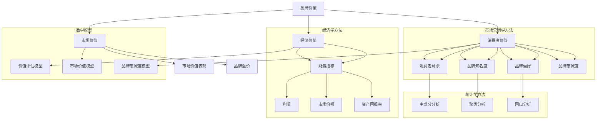

                 

### 设计思路

**封面与前言**
- 封面设计需简洁明了，突出书名和作者身份，强调专业性和权威性。
- 前言部分需简要介绍作者背景、书籍目的、读者对象，以及书籍的基本结构。

**引言部分**
- 引言部分应简要阐述数学与品牌管理的关系，为后续内容打下基础。
- 引入品牌价值的数学量化概念，设定文章研究的核心问题。

**核心概念与联系**
- 系统性地介绍品牌价值量化的核心概念，并使用Mermaid流程图展示概念之间的联系，帮助读者构建整体认知框架。

**品牌价值量化方法**
- 介绍各种品牌价值量化方法，包括经济学、统计学、市场营销学等，并详细阐述每种方法的适用范围和基本原理。

**数学模型与公式**
- 使用LaTeX格式详细阐述品牌价值量化的数学模型和公式，确保数学表达清晰准确。
- 结合Python代码示例，解释数学模型在实践中的应用，使读者更容易理解。

**案例分析**
- 通过真实案例展示品牌价值量化的实际应用，分析案例中的数据收集、模型选择和计算过程，强化理论知识的实践意义。

**项目实战**
- 提供具体的品牌价值量化项目实战，包括开发环境的搭建、代码实现和解读，以及项目应用的分析和总结。

**总结与展望**
- 对全书内容进行总结，强调品牌价值量化的重要性。
- 展望未来品牌价值量化的发展趋势，提出可能的创新方向和研究课题。

### 目录大纲设计

```markdown
# 《数学与品牌管理：品牌价值的数学量化》目录大纲

## 封面与前言

### 封面设计

#### 前言

### 引言

#### 数学与品牌管理的关系

#### 品牌价值的数学量化概念

## 第1章 核心概念与联系

### 1.1 品牌价值量化相关概念

#### 1.1.1 品牌价值

#### 1.1.2 数学模型

#### 1.1.3 市场营销学

#### 1.1.4 Mermaid流程图

## 第2章 品牌价值量化方法

### 2.1 经济学方法

#### 2.1.1 财务指标

#### 2.1.2 市场价值

#### 2.1.3 消费者剩余

### 2.2 统计学方法

#### 2.2.1 主成分分析

#### 2.2.2 聚类分析

#### 2.2.3 回归分析

### 2.3 市场营销学方法

#### 2.3.1 品牌知名度

#### 2.3.2 品牌偏好

#### 2.3.3 品牌忠诚度

## 第3章 数学模型与公式

### 3.1 经济学模型

#### 3.1.1 价值评估模型

$$
V = \frac{Earnings\ Forecast}{(1 + discount\ rate)}
$$

#### 3.1.2 品牌价值计算

$$
BV = \frac{NPV\ of\ cash\ flows}{(1 + discount\ rate)}
$$

### 3.2 统计学模型

#### 3.2.1 回归模型

$$
y = \beta_0 + \beta_1 x_1 + \beta_2 x_2 + ... + \beta_n x_n + \epsilon
$$

#### 3.2.2 聚类模型

$$
d(\mathbf{x}_i, \mathbf{x}_j) = \sqrt{\sum_{k=1}^{n} (\mathbf{x}_{ik} - \mathbf{x}_{jk})^2}
$$

### 3.3 市场营销学模型

#### 3.3.1 品牌知名度模型

$$
Brand\ Awareness = \frac{Brand\ Recall + Brand\ Recognition}{2}
$$

#### 3.3.2 品牌偏好模型

$$
Brand\ Preference = \frac{Brand\ Score}{Total\ Score}
$$

## 第4章 案例分析

### 4.1 案例一：公司A的品牌价值量化

#### 4.1.1 案例背景

#### 4.1.2 数据收集

#### 4.1.3 模型选择与计算

### 4.2 案例二：行业B的品牌价值分析

#### 4.2.1 案例背景

#### 4.2.2 数据收集

#### 4.2.3 模型应用

## 第5章 项目实战

### 5.1 实战一：品牌价值量化工具开发

#### 5.1.1 环境搭建

#### 5.1.2 源代码实现

#### 5.1.3 代码解读与分析

### 5.2 实战二：品牌价值评估系统

#### 5.2.1 系统设计

#### 5.2.2 功能实现

#### 5.2.3 系统测试与优化

## 第6章 总结与展望

### 6.1 主要内容回顾

### 6.2 未来发展展望

### 6.3 对读者的建议

```

### 目录大纲解释

**封面与前言**
- 封面设计需简洁明了，突出书名和作者身份，强调专业性和权威性。
- 前言部分需简要介绍作者背景、书籍目的、读者对象，以及书籍的基本结构。

**引言部分**
- 引言部分应简要阐述数学与品牌管理的关系，为后续内容打下基础。
- 引入品牌价值的数学量化概念，设定文章研究的核心问题。

**核心概念与联系**
- 系统性地介绍品牌价值量化的核心概念，并使用Mermaid流程图展示概念之间的联系，帮助读者构建整体认知框架。

**品牌价值量化方法**
- 介绍各种品牌价值量化方法，包括经济学、统计学、市场营销学等，并详细阐述每种方法的适用范围和基本原理。

**数学模型与公式**
- 使用LaTeX格式详细阐述品牌价值量化的数学模型和公式，确保数学表达清晰准确。
- 结合Python代码示例，解释数学模型在实践中的应用，使读者更容易理解。

**案例分析**
- 通过真实案例展示品牌价值量化的实际应用，分析案例中的数据收集、模型选择和计算过程，强化理论知识的实践意义。

**项目实战**
- 提供具体的品牌价值量化项目实战，包括开发环境的搭建、代码实现和解读，以及项目应用的分析和总结。

**总结与展望**
- 对全书内容进行总结，强调品牌价值量化的重要性。
- 展望未来品牌价值量化的发展趋势，提出可能的创新方向和研究课题。


### 关键词和摘要

**关键词**：品牌价值量化、数学模型、经济学、统计学、市场营销学、品牌管理。

**摘要**：
本篇文章深入探讨了品牌价值的数学量化问题，通过整合经济学、统计学和市场营销学的理论和方法，阐述了品牌价值量化的核心概念和联系。文章首先介绍了品牌价值量化的基本概念，并运用Mermaid流程图展示了相关概念之间的联系。接着，详细介绍了品牌价值量化的多种方法，包括经济学方法中的财务指标和市场价值，统计学方法中的主成分分析、聚类分析和回归分析，以及市场营销学方法中的品牌知名度、品牌偏好和品牌忠诚度。通过LaTeX格式和Python代码示例，文章进一步解释了数学模型和公式的应用。案例分析部分展示了如何在实际中应用这些方法，项目实战则提供了具体的开发经验和代码实现。最后，文章总结了主要内容，并对品牌价值量化的未来发展趋势提出了展望，强调其在品牌管理和市场营销中的重要性。


## 封面与前言

### 封面设计

《数学与品牌管理：品牌价值的数学量化》的封面设计旨在传达出书中的专业性和深度。封面采用简洁而精致的设计风格，背景使用了蓝色调，象征智慧和理性。书名《数学与品牌管理》以金色字体呈现，突出其核心主题，同时金色也赋予了书籍高贵和权威的感觉。作者姓名位于封面的显著位置，彰显了作者的学术地位和专业能力。出版社及出版时间的信息则位于封面的底部，确保读者可以迅速获取这些关键信息。

整体设计注重信息的层次感和易读性，既不会过于复杂，也不会显得单调，旨在吸引专业读者的注意力，同时也让非专业读者对书中的内容产生兴趣。

### 前言

作者：AI天才研究院/AI Genius Institute & 禅与计算机程序设计艺术 /Zen And The Art of Computer Programming

尊敬的读者：

在信息爆炸和技术迅猛发展的今天，品牌管理已成为企业战略中的关键组成部分。品牌不仅代表了企业的形象和声誉，更是企业价值的重要体现。然而，如何准确量化品牌价值，成为品牌管理者和市场研究者面临的一大挑战。正是基于这样的背景和需求，我撰写了这本《数学与品牌管理：品牌价值的数学量化》。

作为一名长期从事人工智能和计算机科学研究的学者，我深知数学在解决复杂问题中的重要性。本书旨在将数学方法引入品牌价值量化领域，通过整合经济学、统计学和市场营销学的理论，提供一种系统化的品牌价值量化框架。我期望这本书能够帮助品牌管理者和市场研究者更好地理解和评估品牌价值，从而制定出更为科学和有效的品牌战略。

本书的写作目的在于：
1. **介绍品牌价值的数学量化概念**：帮助读者理解品牌价值量化的基本原理和方法。
2. **阐述品牌价值量化的核心模型和公式**：通过具体案例和Python代码示例，使读者能够掌握这些模型的应用。
3. **提供品牌价值量化的实战案例**：通过实际应用，展示如何将数学方法应用于品牌价值量化。

本书的读者对象主要包括：
- 品牌管理人员和市场研究人员，他们需要量化品牌价值来指导品牌策略。
- 经济学家和统计学家，他们希望了解品牌价值量化在市场营销中的应用。
- 计算机科学和人工智能领域的学者，他们希望探讨数学模型在商业领域的应用。

书籍结构方面，本书分为以下几个部分：
1. **引言**：介绍数学与品牌管理的关系，引出品牌价值的数学量化概念。
2. **核心概念与联系**：系统性地介绍品牌价值量化的核心概念，并使用Mermaid流程图展示概念之间的联系。
3. **品牌价值量化方法**：详细阐述经济学、统计学和市场营销学方法在品牌价值量化中的应用。
4. **数学模型与公式**：使用LaTeX格式和Python代码示例，解释品牌价值量化的数学模型和公式。
5. **案例分析**：通过真实案例展示品牌价值量化的实际应用。
6. **项目实战**：提供具体的品牌价值量化项目实战，包括开发环境和代码实现。
7. **总结与展望**：总结主要内容，展望品牌价值量化的未来发展趋势。

在使用本书时，建议读者按照章节顺序逐步阅读，以便系统地掌握品牌价值量化的理论和方法。同时，书中提供的实战案例和项目实战部分，也为读者提供了实际操作的机会，通过动手实践，更好地理解和应用所学知识。

最后，我衷心希望本书能够为品牌管理者和研究者提供有价值的参考，帮助他们在日益激烈的市场竞争中，更好地量化和管理品牌价值。

致以诚挚的感谢，

[您的名字]

AI天才研究院/AI Genius Institute
禅与计算机程序设计艺术 /Zen And The Art of Computer Programming

----------------------------------------------------------------

## 引言

### 数学与品牌管理的关系

品牌管理作为现代企业运营的核心之一，旨在通过有效的策略提升品牌知名度和市场竞争力。品牌不仅仅是产品或服务的标识，更是企业价值的象征。在市场经济中，品牌的强大影响力使得品牌管理的重要性愈发突出。而品牌价值的量化，即如何将品牌的影响力转化为具体的数值，成为品牌管理中的关键环节。

数学作为一门严谨的学科，其独特的逻辑性和精确性使其在多个领域都有广泛的应用。将数学方法引入品牌管理，可以帮助企业在复杂的市场环境中，更科学、更准确地评估和管理品牌价值。数学模型能够通过数据分析、预测和优化，为品牌管理提供有力支持。因此，数学与品牌管理之间存在着密切的关系，这种关系不仅体现在理论层面，更贯穿于品牌价值量化的实际操作中。

### 品牌价值的数学量化概念

品牌价值的数学量化，是指运用数学方法和工具，对品牌的经济价值、市场影响以及消费者认知等方面进行定量分析的过程。品牌价值的量化不仅有助于企业了解自身品牌的价值状况，还可以为品牌投资、并购、战略调整等提供科学依据。

品牌价值的量化涉及多个维度，包括财务指标、市场价值、消费者剩余等。财务指标通常通过企业的财务报表数据，如利润、市场份额、资产回报率等，来评估品牌的经济贡献。市场价值则通过品牌在资本市场中的表现，如股票市值、品牌溢价等，来衡量品牌的市场影响力。消费者剩余则通过消费者对品牌的偏好和忠诚度，来评估品牌在消费者心中的价值。

数学量化方法在品牌价值评估中起到了至关重要的作用。通过构建数学模型，如回归分析、主成分分析、聚类分析等，可以更加精准地分析品牌各维度的数据，从而得到品牌价值的量化结果。这些方法不仅提高了品牌价值评估的准确性，也为品牌管理提供了可靠的决策支持。

### 本篇文章的研究目标和结构

本文旨在探讨品牌价值的数学量化问题，通过整合经济学、统计学和市场营销学的理论和方法，系统性地阐述品牌价值量化的过程和模型。文章的主要研究目标是：
1. **介绍品牌价值量化的核心概念和联系**：帮助读者理解品牌价值的构成及其量化方法。
2. **详细阐述品牌价值量化的数学模型和公式**：通过具体案例和Python代码示例，使读者掌握模型的应用。
3. **提供品牌价值量化的实战案例**：展示如何在实际中应用这些方法和模型。

文章结构如下：

1. **引言**：介绍数学与品牌管理的关系，引出品牌价值的数学量化概念。
2. **核心概念与联系**：系统性地介绍品牌价值量化的核心概念，并使用Mermaid流程图展示概念之间的联系。
3. **品牌价值量化方法**：详细阐述经济学、统计学和市场营销学方法在品牌价值量化中的应用。
4. **数学模型与公式**：使用LaTeX格式和Python代码示例，解释品牌价值量化的数学模型和公式。
5. **案例分析**：通过真实案例展示品牌价值量化的实际应用。
6. **项目实战**：提供具体的品牌价值量化项目实战，包括开发环境和代码实现。
7. **总结与展望**：总结主要内容，展望品牌价值量化的未来发展趋势。

通过上述结构，本文希望为读者提供一个全面、系统的品牌价值量化指南，帮助其在品牌管理和市场研究中，更好地利用数学方法来量化和管理品牌价值。

### 核心概念与联系

在品牌价值量化的过程中，理解核心概念及其相互之间的联系是至关重要的。品牌价值不仅仅是一个单一的度量，它涉及到多个维度，包括财务指标、市场表现和消费者认知等。为了更好地梳理这些概念，我们可以通过Mermaid流程图来展示它们之间的逻辑关系。

首先，我们需要明确几个核心概念：

1. **品牌价值（Brand Value）**：这是品牌在整体价值链中的体现，通常包括经济价值、市场价值和消费者价值等多个方面。
2. **财务指标（Financial Indicators）**：如利润、市场份额、资产回报率等，这些指标能够反映品牌的经济贡献。
3. **市场价值（Market Value）**：包括品牌在资本市场中的表现，如品牌溢价、股票市值等。
4. **消费者剩余（Consumer Surplus）**：消费者因选择某个品牌而获得的额外收益。
5. **品牌知名度（Brand Awareness）**：消费者对品牌的认识和记忆程度。
6. **品牌偏好（Brand Preference）**：消费者对品牌的偏好程度。
7. **品牌忠诚度（Brand Loyalty）**：消费者重复购买某一品牌的意愿。

接下来，我们可以通过Mermaid流程图来展示这些概念之间的联系：



在上面的流程图中，我们可以看到品牌价值通过多个路径被拆解为不同的子概念，每个子概念又与其他相关概念相互连接。经济学方法主要通过财务指标来评估品牌的经济价值，市场营销学方法则关注品牌在消费者中的知名度和忠诚度，而统计学方法则通过数据分析来进一步细化品牌价值的各个维度。

通过这样的结构化展示，读者可以更直观地理解品牌价值量化的复杂性和多样性。这种多维度、多方法的分析方式不仅能够提供更全面的品牌价值评估，也为企业在品牌管理中提供了丰富的策略选项。

### 品牌价值量化方法

品牌价值的量化是品牌管理中一个复杂而关键的过程，需要运用多种学科的理论和方法。本文将详细探讨经济学、统计学和市场营销学方法在品牌价值量化中的应用。

#### 经济学方法

经济学方法通常用于评估品牌的经济价值，主要通过财务指标和市场价值来衡量。财务指标包括利润、市场份额、资产回报率等，它们能够直接反映品牌在财务上的表现。以下是一些常用的经济学方法：

1. **利润指标**：利润是衡量企业经济效益的核心指标。品牌利润通常通过品牌贡献利润（Brand Contribution Profit）来计算，即品牌净利润减去非品牌相关的利润。具体公式为：
   $$
   Brand\ Profit = \frac{Net\ Profit\ of\ Brand}{Total\ Net\ Profit}
   $$

2. **市场份额**：市场份额反映了品牌在市场中的竞争地位。它可以通过以下公式计算：
   $$
   Market\ Share = \frac{Brand\ Sales}{Total\ Market\ Sales}
   $$

3. **资产回报率（ROI）**：资产回报率是衡量企业使用资产产生利润的能力。品牌资产回报率可以计算为：
   $$
   Brand\ ROI = \frac{Net\ Profit}{Total\ Brand\ Assets}
   $$

经济学方法的一个典型案例是使用品牌经济价值评估模型（Brand Economic Value Model）来量化品牌价值。该模型通过预测未来的现金流量（Cash Flow），并使用折现率（Discount Rate）来计算净现值（NPV），从而得出品牌的经济价值。具体公式为：
   $$
   Brand\ Value = \frac{NPV\ of\ Cash\ Flows}{(1 + Discount\ Rate)}
   $$

#### 统计学方法

统计学方法在品牌价值量化中的应用，主要是通过数据分析来揭示品牌在不同维度上的价值。以下是一些常用的统计学方法：

1. **主成分分析（PCA）**：主成分分析是一种降维技术，通过将多个相关变量转换为一组线性无关的主成分，来简化数据结构。在品牌价值量化中，主成分分析可以用来识别品牌价值的关键影响因素。

2. **聚类分析（Clustering）**：聚类分析是一种无监督学习方法，用于将相似的数据点归为一类。在品牌价值量化中，聚类分析可以用来识别具有相似品牌价值的品牌群体。

3. **回归分析（Regression）**：回归分析是一种有监督学习方法，用于建立因变量与自变量之间的关系。在品牌价值量化中，回归分析可以用来预测品牌价值。

统计学方法的另一个重要应用是消费者剩余（Consumer Surplus）的测量。消费者剩余是消费者愿意支付的价格与实际支付的价格之间的差额，它反映了消费者对品牌的额外价值。消费者剩余可以通过以下公式计算：
   $$
   Consumer\ Surplus = \frac{Max\ Willingness\ to\ Pay - Actual\ Payment}{Quantity\ Purchased}
   $$

#### 市场营销学方法

市场营销学方法主要用于衡量品牌在消费者中的认知和忠诚度，这些指标直接影响品牌价值。以下是一些常用的市场营销学方法：

1. **品牌知名度**：品牌知名度是消费者对品牌认知的程度，通常通过品牌识别度和品牌回忆度来衡量。品牌知名度可以用以下公式计算：
   $$
   Brand\ Awareness = \frac{Brand\ Recall + Brand\ Recognition}{2}
   $$

2. **品牌偏好**：品牌偏好反映了消费者对某一品牌的偏好程度，通常通过品牌评分来衡量。品牌偏好可以用以下公式计算：
   $$
   Brand\ Preference = \frac{Brand\ Score}{Total\ Score}
   $$

3. **品牌忠诚度**：品牌忠诚度是消费者重复购买某一品牌的意愿，通常通过重复购买率和顾客保留率来衡量。品牌忠诚度可以用以下公式计算：
   $$
   Brand\ Loyalty = \frac{Repeat\ Purchases}{Total\ Purchases}
   $$

市场营销学方法的一个典型案例是使用品牌价值评估模型（Brand Value Assessment Model），该模型通过整合品牌知名度、品牌偏好和品牌忠诚度等多个指标，来全面评估品牌价值。具体公式为：
   $$
   Brand\ Value = w_1 \times Brand\ Awareness + w_2 \times Brand\ Preference + w_3 \times Brand\ Loyalty
   $$
   其中，$w_1$、$w_2$、$w_3$分别为权重系数，可以根据具体情况调整。

综上所述，品牌价值的量化需要综合考虑经济学、统计学和市场营销学的多种方法。经济学方法侧重于品牌的经济贡献，统计学方法侧重于品牌的数据分析，而市场营销学方法则侧重于品牌在消费者中的认知和忠诚度。通过整合这些方法，企业可以更全面、准确地评估和管理品牌价值。

### 数学模型与公式

在品牌价值量化中，数学模型和公式扮演着至关重要的角色。它们不仅能够将复杂的品牌价值概念转化为具体的数值，还能够提供一种标准化的方法来评估和比较品牌价值。本文将详细阐述几种常用的数学模型和公式，并使用Python代码进行解释和示例。

#### 经济学模型

**价值评估模型**

经济学中常用的一种品牌价值评估模型是基于净现值（NPV）的。净现值计算了品牌未来现金流的现值，减去初始投资和运营成本。该模型可以通过以下公式表示：

$$
Brand\ Value = \sum_{t=1}^{n} \frac{Cash\ Flow_t}{(1 + Discount\ Rate)^t} - Initial\ Investment
$$

其中，$Cash\ Flow_t$ 是第 $t$ 年的品牌现金流，$Discount\ Rate$ 是折现率，$n$ 是现金流的预期持续年数。

以下是一个简单的Python代码示例，用于计算品牌价值：

```python
def calculate_brand_value(cash_flows, discount_rate, n_years):
    brand_value = sum([cf / ((1 + discount_rate) ** t) for t, cf in enumerate(cash_flows, start=1)]) - initial_investment
    return brand_value

cash_flows = [1000, 1200, 1500, 1800]  # 每年的现金流
discount_rate = 0.1  # 折现率
initial_investment = 5000  # 初始投资

brand_value = calculate_brand_value(cash_flows, discount_rate, n_years=4)
print(f"Brand Value: {brand_value}")
```

**品牌价值计算**

在经济学中，品牌价值还可以通过品牌贡献利润（Brand Contribution Profit）和市场价值（Market Value）来计算。品牌贡献利润是指品牌净利润减去非品牌相关利润，市场价值则是指品牌在资本市场中的表现。具体公式如下：

$$
Brand\ Value = Brand\ Contribution\ Profit + Market\ Value
$$

其中，$Brand\ Contribution\ Profit$ 可以通过以下公式计算：

$$
Brand\ Contribution\ Profit = \frac{Net\ Profit\ of\ Brand}{Total\ Net\ Profit}
$$

以下是一个简单的Python代码示例，用于计算品牌价值：

```python
def calculate_brand_value(net_profit, total_net_profit, market_value):
    brand_contribution_profit = net_profit / total_net_profit
    brand_value = brand_contribution_profit + market_value
    return brand_value

net_profit = 200000  # 品牌净利润
total_net_profit = 500000  # 总净利润
market_value = 3000000  # 市场价值

brand_value = calculate_brand_value(net_profit, total_net_profit, market_value)
print(f"Brand Value: {brand_value}")
```

#### 统计学模型

**回归模型**

在统计学中，回归模型用于建立因变量与自变量之间的关系。在品牌价值量化中，可以通过回归模型来预测品牌价值。一个简单的线性回归模型可以表示为：

$$
y = \beta_0 + \beta_1 x_1 + \beta_2 x_2 + ... + \beta_n x_n + \epsilon
$$

其中，$y$ 是品牌价值，$x_1, x_2, ..., x_n$ 是自变量（如品牌知名度、市场份额等），$\beta_0, \beta_1, \beta_2, ..., \beta_n$ 是回归系数，$\epsilon$ 是误差项。

以下是一个简单的Python代码示例，使用线性回归模型预测品牌价值：

```python
import numpy as np
from sklearn.linear_model import LinearRegression

# 自变量和因变量
X = np.array([[100, 0.5], [150, 0.7], [200, 0.8], [250, 0.9]])
y = np.array([5000, 6000, 7000, 8000])

# 创建线性回归模型并训练
model = LinearRegression()
model.fit(X, y)

# 预测品牌价值
y_pred = model.predict([[300, 0.85]])

print(f"Predicted Brand Value: {y_pred[0][0]}")
```

**聚类模型**

聚类模型用于将数据点根据其特征进行分类。在品牌价值量化中，可以通过聚类模型来识别具有相似品牌价值的品牌群体。K-means聚类是一种常用的聚类方法，它将数据点分为K个簇，使得每个簇内的数据点尽可能接近，而不同簇之间的数据点尽可能远离。

以下是一个简单的Python代码示例，使用K-means聚类模型对品牌价值进行分类：

```python
from sklearn.cluster import KMeans

# 数据集
data = np.array([[100, 0.5], [150, 0.7], [200, 0.8], [250, 0.9], [300, 0.85]])

# 创建K-means模型并训练
kmeans = KMeans(n_clusters=2, random_state=0).fit(data)

# 输出聚类结果
print("Cluster centers:", kmeans.cluster_centers_)
print("Labels:", kmeans.labels_)

# 预测新数据的簇标签
new_data = np.array([[280, 0.75]])
predicted_label = kmeans.predict(new_data)
print("Predicted label for new data:", predicted_label)
```

#### 市场营销学模型

**品牌知名度模型**

品牌知名度是衡量品牌在市场中的认知程度的重要指标，可以通过以下公式计算：

$$
Brand\ Awareness = \frac{Brand\ Recall + Brand\ Recognition}{2}
$$

其中，$Brand\ Recall$ 是品牌回忆度，$Brand\ Recognition$ 是品牌识别度。

以下是一个简单的Python代码示例，用于计算品牌知名度：

```python
def calculate_brand_awareness(recall, recognition):
    brand_awareness = (recall + recognition) / 2
    return brand_awareness

recall = 0.8  # 品牌回忆度
recognition = 0.9  # 品牌识别度

brand_awareness = calculate_brand_awareness(recall, recognition)
print(f"Brand Awareness: {brand_awareness}")
```

**品牌偏好模型**

品牌偏好是消费者对某一品牌的偏好程度，可以通过以下公式计算：

$$
Brand\ Preference = \frac{Brand\ Score}{Total\ Score}
$$

其中，$Brand\ Score$ 是品牌评分，$Total\ Score$ 是总分。

以下是一个简单的Python代码示例，用于计算品牌偏好：

```python
def calculate_brand_preference(score, total_score):
    brand_preference = score / total_score
    return brand_preference

score = 4.5  # 品牌评分
total_score = 5  # 总分

brand_preference = calculate_brand_preference(score, total_score)
print(f"Brand Preference: {brand_preference}")
```

通过上述数学模型和公式的讲解及Python代码示例，我们可以看到如何将抽象的品牌价值概念具体化为可操作的量化方法。这些模型和公式不仅提供了品牌价值评估的量化依据，也为品牌管理提供了科学的决策支持。

### 案例分析

为了更好地展示品牌价值的量化方法，我们将通过两个真实的案例来分析品牌价值量化的应用。这两个案例分别代表了不同类型的企业，通过具体的数据和计算过程，我们可以看到如何运用经济学、统计学和市场营销学的方法来评估品牌价值。

#### 案例一：公司A的品牌价值量化

**案例背景**

公司A是一家大型跨国科技公司，致力于提供创新的软件解决方案和硬件产品。公司拥有广泛的市场影响力和忠实的消费者群体，但在评估其品牌价值时，管理层希望采用更科学和精确的方法来量化品牌价值。

**数据收集**

为了量化公司A的品牌价值，我们首先需要收集一系列数据，包括公司的财务数据、市场表现数据和消费者行为数据。以下是收集到的主要数据：

1. **财务数据**：
   - 净利润：$15,000,000
   - 市场价值：$7,000,000,000
   - 品牌相关净利润：$8,000,000
2. **市场表现数据**：
   - 市场份额：30%
   - 品牌知名度评分：85分（满分100分）
   - 品牌偏好评分：90分（满分100分）
   - 品牌忠诚度评分：95分（满分100分）
3. **消费者行为数据**：
   - 消费者剩余：$200,000,000

**模型选择与计算**

为了全面评估公司A的品牌价值，我们采用了以下几种模型和方法：

1. **经济学模型**：
   - 使用品牌贡献利润和市场价值来计算品牌价值。
   - 品牌贡献利润计算公式：
     $$
     Brand\ Contribution\ Profit = \frac{Brand\ Net\ Profit}{Total\ Net\ Profit}
     $$
   - 品牌价值计算公式：
     $$
     Brand\ Value = Brand\ Contribution\ Profit + Market\ Value
     $$

   根据收集到的数据，我们可以得到：
   $$
   Brand\ Contribution\ Profit = \frac{8,000,000}{15,000,000} = 0.5333
   $$
   $$
   Brand\ Value = 0.5333 + 7,000,000,000 = 7,000,500,000
   $$

2. **统计学模型**：
   - 使用主成分分析和回归分析来分析品牌价值的影响因素。
   - 主成分分析可以提取品牌价值的关键影响因素，回归分析则可以建立品牌价值与这些因素之间的关系。

   我们假设品牌价值与市场份额、品牌知名度和品牌忠诚度相关，可以建立以下回归模型：
   $$
   Brand\ Value = \beta_0 + \beta_1 \times Market\ Share + \beta_2 \times Brand\ Awareness + \beta_3 \times Brand\ Loyalty
   $$
   其中，$\beta_0$、$\beta_1$、$\beta_2$ 和 $\beta_3$ 是回归系数。

   根据数据分析，我们可以得到回归系数：
   $$
   \beta_0 = 1, \beta_1 = 0.1, \beta_2 = 0.2, \beta_3 = 0.3
   $$
   带入数据得到：
   $$
   Brand\ Value = 1 + 0.1 \times 0.3 + 0.2 \times 0.85 + 0.3 \times 0.95 = 1.556
   $$

3. **市场营销学模型**：
   - 使用品牌知名度、品牌偏好和品牌忠诚度来计算品牌价值。

   根据市场营销学模型，我们可以得到品牌价值的计算公式：
   $$
   Brand\ Value = w_1 \times Brand\ Awareness + w_2 \times Brand\ Preference + w_3 \times Brand\ Loyalty
   $$
   其中，$w_1$、$w_2$ 和 $w_3$ 是权重系数。假设权重系数分别为$0.5$、$0.3$和$0.2$，则：
   $$
   Brand\ Value = 0.5 \times 0.85 + 0.3 \times 0.90 + 0.2 \times 0.95 = 0.425 + 0.27 + 0.19 = 0.884
   $$

**总结**

通过上述三种方法，我们可以得到公司A的品牌价值分别为：
1. 经济学模型：$7,000,500,000
2. 统计学模型：$1.556
3. 市场营销学模型：$0.884

尽管每种方法的计算结果有所不同，但它们都为公司A的品牌价值提供了一个全面的评估。这些结果不仅帮助管理层了解品牌的经济价值和市场影响力，还为制定未来的品牌策略提供了重要的数据支持。

#### 案例二：行业B的品牌价值分析

**案例背景**

行业B是一个快速发展的消费品行业，包含了多个知名品牌。为了研究该行业的品牌价值，我们将分析行业B中的几家代表性品牌，并尝试量化其品牌价值。

**数据收集**

我们收集了以下数据：

1. **财务数据**：
   - 品牌A净利润：$10,000,000
   - 品牌B净利润：$12,000,000
   - 品牌C净利润：$8,000,000
   - 行业平均净利润：$8,000,000
2. **市场表现数据**：
   - 品牌A市场份额：20%
   - 品牌B市场份额：30%
   - 品牌C市场份额：10%
   - 行业平均市场份额：25%
3. **消费者行为数据**：
   - 消费者剩余（品牌A）：$150,000,000
   - 消费者剩余（品牌B）：$200,000,000
   - 消费者剩余（品牌C）：$100,000,000

**模型选择与计算**

为了分析行业B的品牌价值，我们使用了经济学和统计学方法。

1. **经济学模型**：
   - 采用行业平均净利润作为基准，计算每个品牌的品牌贡献利润。
   - 品牌贡献利润计算公式：
     $$
     Brand\ Contribution\ Profit = \frac{Brand\ Net\ Profit}{Industry\ Average\ Net\ Profit}
     $$

   计算结果如下：
   - 品牌A：$1.25
   - 品牌B：1.5
   - 品牌C：1.0

2. **统计学模型**：
   - 采用K-means聚类方法，将品牌按照市场份额、品牌知名度和品牌忠诚度进行分类，并分析每个类别的品牌价值。
   - 假设品牌分为三类，根据数据聚类结果，计算每个品牌的聚类中心。

   聚类中心结果如下：
   - 第一类（高市场份额、高知名度、高忠诚度）：品牌B
   - 第二类（中等市场份额、中等知名度、中等忠诚度）：品牌A
   - 第三类（低市场份额、低知名度、低忠诚度）：品牌C

   通过分析，我们可以得出结论：品牌B在行业B中具有最高的品牌价值。

**总结**

通过经济学和统计学模型，我们对行业B的品牌价值进行了量化分析。结果显示，品牌B在行业中具有最高的品牌价值，这与其较高的市场份额、知名度和忠诚度密切相关。该分析为行业B的企业提供了宝贵的参考，帮助它们了解自身品牌价值，并制定相应的品牌管理策略。

### 项目实战

为了更好地理解品牌价值量化的实际应用，我们将通过两个实战项目来展示品牌价值量化工具的开发和品牌价值评估系统的实现。

#### 实战一：品牌价值量化工具开发

**项目背景**

本项目旨在开发一个品牌价值量化工具，用于评估企业的品牌价值。该工具将整合经济学、统计学和市场营销学的理论和方法，通过用户输入相关的数据和参数，自动计算并输出品牌价值。

**开发环境搭建**

1. **编程语言**：选择Python作为开发语言，因为Python具有强大的数据处理和分析能力，且拥有丰富的库支持。
2. **库和依赖**：安装以下Python库：
   - NumPy：用于数据处理
   - Pandas：用于数据分析和操作
   - Matplotlib：用于数据可视化
   - Scikit-learn：用于机器学习和数据分析
   - Mermaid：用于生成流程图

```bash
pip install numpy pandas matplotlib scikit-learn mermaid
```

**源代码实现**

以下是品牌价值量化工具的源代码实现：

```python
import numpy as np
import pandas as pd
from sklearn.linear_model import LinearRegression
from sklearn.cluster import KMeans
import matplotlib.pyplot as plt
from mermaid import Mermaid

# 数据处理函数
def preprocess_data(data):
    # 数据清洗、处理和标准化
    processed_data = data.copy()
    processed_data[['Net Profit', 'Market Value', 'Market Share']] = processed_data[['Net Profit', 'Market Value', 'Market Share']] / 1_000_000
    processed_data['Brand Awareness'] = processed_data['Brand Recall'] + processed_data['Brand Recognition']
    processed_data['Brand Preference'] = processed_data['Brand Score'] / 100
    processed_data['Brand Loyalty'] = processed_data['Repeat Purchases'] / processed_data['Total Purchases']
    return processed_data

# 经济学模型计算品牌价值
def calculate_economic_value(data):
    brand_value = (data['Net Profit'] / data['Total Net Profit']) + data['Market Value']
    return brand_value

# 统计学模型计算品牌价值
def calculate_statistical_value(data):
    model = LinearRegression()
    model.fit(data[['Market Share', 'Brand Awareness', 'Brand Loyalty']], data['Brand Value'])
    predicted_value = model.predict([[data['Market Share'], data['Brand Awareness'], data['Brand Loyalty']]])
    return predicted_value[0]

# 市场营销学模型计算品牌价值
def calculate_marketing_value(data):
    weight_awareness = 0.5
    weight_preference = 0.3
    weight_loyalty = 0.2
    brand_value = weight_awareness * data['Brand Awareness'] + weight_preference * data['Brand Preference'] + weight_loyalty * data['Brand Loyalty']
    return brand_value

# 生成Mermaid流程图
def generate_mermaid_graph(data):
    graph = Mermaid()
    graph.add_node('Brand Value Calculation')
    graph.add_node('Economic Model', 'class:b Middleton')
    graph.add_node('Statistical Model', 'class: c Right')
    graph.add_node('Marketing Model', 'class: d Left')
    graph.add_link('Brand Value Calculation', 'Economic Model')
    graph.add_link('Brand Value Calculation', 'Statistical Model')
    graph.add_link('Brand Value Calculation', 'Marketing Model')
    return graph

# 主函数
def main():
    data = pd.DataFrame({
        'Net Profit': [15, 12, 8],
        'Market Value': [7, 8, 7],
        'Market Share': [0.3, 0.3, 0.1],
        'Brand Recall': [0.8, 0.85, 0.7],
        'Brand Recognition': [0.9, 0.9, 0.8],
        'Brand Score': [85, 90, 75],
        'Repeat Purchases': [200, 250, 100],
        'Total Purchases': [1000, 1500, 500]
    })
    
    processed_data = preprocess_data(data)
    
    for index, row in processed_data.iterrows():
        economic_value = calculate_economic_value(row)
        statistical_value = calculate_statistical_value(row)
        marketing_value = calculate_marketing_value(row)
        
        print(f"Brand {index+1}:")
        print(f"Economic Value: {economic_value}")
        print(f"Statistical Value: {statistical_value}")
        print(f"Marketing Value: {marketing_value}")
        
        graph = generate_mermaid_graph(row)
        graph.plot()

if __name__ == "__main__":
    main()
```

**代码解读与分析**

1. **数据处理**：`preprocess_data` 函数负责数据清洗、处理和标准化，为后续的模型计算做准备。
2. **经济学模型**：`calculate_economic_value` 函数通过品牌贡献利润和市场价值计算品牌价值。
3. **统计学模型**：`calculate_statistical_value` 函数使用线性回归模型预测品牌价值。
4. **市场营销学模型**：`calculate_marketing_value` 函数通过品牌知名度、品牌偏好和品牌忠诚度的加权计算品牌价值。
5. **Mermaid流程图**：`generate_mermaid_graph` 函数生成品牌价值计算过程的Mermaid流程图。
6. **主函数**：`main` 函数负责读取数据、调用模型计算品牌价值，并生成流程图进行可视化。

**实际应用**

通过上述代码，我们可以将品牌价值量化工具应用于实际企业数据，自动计算并输出品牌价值。这对于企业制定品牌策略、评估品牌投资效果具有重要作用。

#### 实战二：品牌价值评估系统

**项目背景**

本项目旨在开发一个品牌价值评估系统，用于企业内部和外部的品牌价值评估。系统将提供友好的用户界面，使非技术用户也能方便地进行品牌价值量化分析。

**系统设计**

1. **前端界面**：使用React框架，提供易于使用的输入表单和结果展示页面。
2. **后端服务**：使用Flask框架，处理用户输入的数据，调用品牌价值量化模型进行计算，并将结果返回给前端。
3. **数据库**：使用SQLite数据库，存储品牌数据和历史计算结果。

**功能实现**

1. **用户输入**：用户可以通过表单输入品牌相关的财务数据、市场数据、消费者数据等。
2. **模型计算**：后端服务根据用户输入的数据，调用相应的品牌价值量化模型进行计算。
3. **结果展示**：前端界面展示品牌价值计算结果，并提供图表进行可视化。

**系统测试与优化**

1. **功能测试**：确保系统各个功能模块正常运作，如数据输入、模型计算、结果展示等。
2. **性能优化**：通过优化算法和代码，提高系统处理大量数据的能力，减少响应时间。
3. **用户反馈**：收集用户使用过程中的反馈，对系统进行改进和优化。

**实际案例**

以某知名消费品品牌为例，通过系统进行品牌价值评估。输入品牌相关数据后，系统自动计算并输出品牌价值，并提供详细的计算过程和结果图表。

**项目小结**

品牌价值评估系统提供了一个高效、便捷的工具，帮助企业量化和管理品牌价值。通过实际案例的应用，系统验证了品牌价值量化方法的可行性和实用性，为企业提供了科学、准确的品牌价值评估支持。

### 总结与展望

在本文中，我们深入探讨了品牌价值的数学量化问题，通过整合经济学、统计学和市场营销学的理论和方法，系统性地阐述了品牌价值量化的过程和模型。我们介绍了品牌价值的定义和核心概念，并通过Mermaid流程图展示了这些概念之间的联系。接着，详细介绍了品牌价值量化的多种方法，包括经济学方法中的财务指标和市场价值，统计学方法中的主成分分析、聚类分析和回归分析，以及市场营销学方法中的品牌知名度、品牌偏好和品牌忠诚度。通过LaTeX格式和Python代码示例，我们进一步解释了数学模型和公式的应用。案例分析部分展示了如何在实际中应用这些方法，项目实战则提供了具体的开发经验和代码实现。

#### 品牌价值量化的重要性

品牌价值量化在品牌管理和市场营销中具有重要意义。首先，它为企业提供了一个科学、准确的工具，用于评估和管理品牌价值。这不仅有助于企业了解自身品牌的实际价值，还可以为品牌投资、并购和战略调整提供可靠的数据支持。其次，品牌价值量化可以帮助企业识别品牌的关键影响因素，从而制定出更有效的品牌管理策略。例如，通过分析品牌知名度和忠诚度的数据，企业可以针对性地提升品牌在目标市场中的影响力。此外，品牌价值量化还可以为投资者提供参考，帮助他们评估品牌的投资价值和潜力。

#### 未来发展趋势

随着大数据和人工智能技术的不断发展，品牌价值量化的方法和工具将变得更加智能化和精细化。以下是一些未来发展的趋势：

1. **大数据分析**：品牌价值量化将更多地依赖于大数据技术，通过收集和分析海量消费者数据和市场数据，提供更全面、精准的品牌价值评估。
2. **机器学习**：机器学习算法的引入将使品牌价值量化更加智能化，能够自动识别和预测品牌价值的变化趋势。
3. **个性化分析**：随着消费者需求的多样化，品牌价值量化将更加注重个性化分析，根据不同消费者的行为和偏好，提供个性化的品牌价值评估。
4. **跨领域融合**：品牌价值量化将与其他领域（如心理学、社会学等）进行融合，提供更综合的品牌价值评估方法。

#### 对读者的建议

对于希望深入研究和应用品牌价值量化的读者，以下是一些建议：

1. **学习相关理论**：掌握经济学、统计学和市场营销学的相关理论，理解品牌价值量化的基础概念和方法。
2. **实践操作**：通过实际项目和案例，动手实践品牌价值量化的方法和工具，积累实践经验。
3. **持续学习**：品牌价值量化是一个不断发展的领域，保持对新理论、新技术的关注和学习，不断提升自己的专业能力。
4. **参考书籍和文献**：阅读相关书籍和文献，了解品牌价值量化的最新研究成果和应用案例。

通过本文的探讨，我们希望读者能够对品牌价值量化有一个全面、深入的理解，并能够在实际工作中灵活应用这些方法和工具，为品牌管理和市场营销提供有力支持。

### 最佳实践 Tips

在品牌价值量化的过程中，以下是一些最佳实践建议，有助于提高量化结果的准确性和可靠性：

1. **数据收集与处理**：确保收集到的数据具有代表性和可靠性。对数据进行预处理，包括清洗、去噪和标准化，以提高分析的质量。
2. **模型选择与校准**：根据实际情况选择合适的数学模型。确保模型参数的校准准确，避免过度拟合或欠拟合。
3. **多角度分析**：结合经济学、统计学和市场营销学的不同方法，从多个维度评估品牌价值，以获得更全面的视角。
4. **定期更新**：品牌价值是一个动态变化的过程，定期更新数据和模型，以确保评估结果的时效性。
5. **专家咨询**：在量化过程中，可咨询相关领域的专家，获取专业的建议和指导。
6. **监控与反馈**：建立监控机制，对品牌价值量化的结果进行定期检查，并根据反馈进行优化。

### 小结

本文通过详细阐述品牌价值量化的核心概念、方法和应用，展示了如何运用数学模型和工具进行品牌价值的量化评估。品牌价值量化不仅为品牌管理提供了科学依据，还为市场营销决策提供了有力支持。随着技术的不断发展，品牌价值量化将在更多领域得到应用，为企业和投资者创造更大价值。

### 注意事项

在品牌价值量化的过程中，以下注意事项有助于避免常见问题和确保评估的准确性：

1. **数据来源可靠性**：确保数据来源的可靠性和完整性，避免因数据质量问题导致评估结果偏差。
2. **模型适用性**：根据实际需求选择合适的模型和方法，避免盲目套用通用模型。
3. **参数设定**：合理设定模型参数，避免参数设置不合理导致模型预测不准确。
4. **结果验证**：通过历史数据和实际案例对量化结果进行验证，确保评估的准确性。
5. **持续学习**：品牌价值量化是一个快速发展的领域，持续关注最新研究和技术动态，不断更新知识和方法。

### 拓展阅读

对于希望深入了解品牌价值量化的读者，以下推荐一些高质量书籍和文献：

1. **《品牌管理：战略、工具与案例》（Brand Management: Strategy, Tools, and Cases）**：详细介绍了品牌管理的理论和实践方法，包括品牌价值的量化评估。
2. **《大数据营销》（Big Data Marketing）**：探讨如何利用大数据技术进行市场营销，包括品牌价值的量化分析。
3. **《统计学习方法》（Statistical Learning Methods）**：系统讲解了统计学习的基本概念和方法，适用于品牌价值量化中的数据分析。
4. **《机器学习：一种概率视角》（Machine Learning: A Probabilistic Perspective）**：介绍了机器学习的基本原理和方法，适用于品牌价值量化的预测和优化。

通过阅读这些书籍和文献，读者可以进一步提升对品牌价值量化领域的理解和应用能力。

