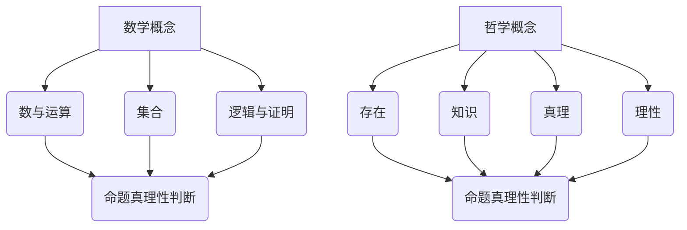

                 

### 导论

在当今世界，数学与哲学作为两种重要的思维工具，不仅在各自领域内发挥了巨大作用，而且在命题真理性判断方面也展现了独特的价值。本文旨在探讨数学与哲学在命题真理性判断中的运用，分析两者之间的关系，以及它们如何共同促进人类对真理的追求。

数学作为一门精确的科学，以其严谨的逻辑体系和清晰的表达方式，成为命题真理性判断的重要工具。从古至今，无数数学家通过严密的证明和推理，揭示了自然界和人类社会的诸多规律，为科学进步提供了坚实的基础。而哲学则从更广泛的视角出发，探讨存在、知识、价值和理性等根本性问题，为命题真理性判断提供了深刻的哲学思考。

本文的研究背景源于数学与哲学在命题真理性判断中的广泛应用。随着科学技术的飞速发展，数学和哲学在各个领域的应用日益深入，如物理学、计算机科学、经济学等。因此，探讨数学与哲学在命题真理性判断中的作用，有助于更好地理解和运用这些学科，推动科学的发展。

本文的研究目的主要有以下几个方面：

1. 梳理数学与哲学的基本概念，明确两者的研究范围和方法论。
2. 分析数学在命题真理性判断中的应用，探讨其优势与局限性。
3. 探讨哲学在命题真理性判断中的作用，分析其独特贡献。
4. 通过具体案例，阐述数学与哲学在命题真理性判断中的相互影响。

本文的研究方法主要采用文献综述和案例分析相结合的方式。首先，通过文献综述，梳理数学与哲学的基本概念、原理及其在命题真理性判断中的应用。其次，通过案例分析，具体阐述数学与哲学在命题真理性判断中的实际运用，以及它们之间的相互作用。最后，综合分析案例，总结数学与哲学在命题真理性判断中的共性与特性，提出未来研究的方向。

本文的结构安排如下：

- 第1章：导论，介绍研究背景、目的、方法与结构。
- 第2章：数学与哲学的基本概念，分别阐述数学和哲学的基本概念及其在命题真理性判断中的应用。
- 第3章：数学在命题真理性判断中的应用，分析数学推理、证明和模型在命题真理性判断中的作用。
- 第4章：哲学在命题真理性判断中的应用，探讨哲学理论、方法和问题在命题真理性判断中的运用。
- 第5章：数学与哲学命题的真理性判断，比较数学与哲学命题的真理性判断标准和方法。
- 第6章：案例研究，通过具体案例展示数学与哲学在命题真理性判断中的应用。
- 第7章：结论与展望，总结全文，提出未来研究方向。

通过本文的研究，期望能够为数学与哲学在命题真理性判断中的应用提供有益的借鉴，为相关领域的研究者提供参考，进一步推动数学与哲学的发展。

## 数学与哲学的基本概念

要探讨数学与哲学在命题真理性判断中的应用，首先需要明确两者的基本概念及其在各自领域中的研究内容和方法。本章节将分别介绍数学与哲学的基本概念，并探讨它们在命题真理性判断中的重要性。

### 数学的基本概念

数学是一门研究数量、结构、变化和空间等概念的学科。它通过精确的推理和证明来揭示自然和社会现象的内在规律。数学的基本概念包括：

- **数与运算**：数是数学的基础，包括自然数、整数、有理数、实数等。运算则包括加法、减法、乘法、除法等基本运算，以及更复杂的运算如极限、导数、积分等。
- **集合**：集合是由确定的对象组成的整体，是数学中的一个基本概念。集合论是现代数学的基石，它提供了研究数学对象之间关系和性质的工具。
- **逻辑与证明**：逻辑是数学推理的基础，包括命题逻辑、谓词逻辑等。证明则是数学中用来确定命题真伪的方法，通过逻辑推理和演绎来证明一个命题的正确性。

在命题真理性判断中，数学提供了一种严谨的推理和证明方式。数学家通过建立数学模型、运用数学公式和定理，对命题进行推理和证明，从而判断命题的真伪。例如，在数学证明中，从已知的前提出发，通过一系列逻辑推理，得出一个结论。如果结论是必然的，那么原命题就被证明为真。

### 哲学的基本概念

哲学是一门探讨存在、知识、价值和理性等根本性问题的学科。哲学的基本概念包括：

- **存在**：存在是哲学的核心议题之一，探讨的是事物的本质和实在性。
- **知识**：知识是哲学研究的重要领域，涉及认识论问题，探讨知识的性质、来源和范围。
- **真理**：真理是哲学中的一个基本概念，探讨的是命题与事实之间的关系，即一个命题是否与事实相符。
- **理性**：理性是指人类的思维能力和判断力，是哲学研究的重要工具。

在命题真理性判断中，哲学提供了一种批判性思维和逻辑分析的方法。哲学家通过分析命题的结构、语义和逻辑关系，对命题的真伪进行判断。例如，哲学家可能会质疑一个命题的前提条件，或者分析命题中的逻辑谬误，从而得出命题的真伪。

### 命题真理性判断的概念

命题真理性判断是数学与哲学共同关注的议题。命题真理性判断涉及以下核心概念：

- **命题**：命题是陈述句，可以判断为真或假。例如，“所有猫都有尾巴”是一个命题。
- **真值**：真值是指命题的真假状态。一个命题要么为真，要么为假。
- **真理性标准**：真理性标准是判断命题真假的标准。例如，在数学中，一个命题的真理性标准是通过逻辑证明来确定的；在哲学中，一个命题的真理性标准可能是它与事实的一致性。

在命题真理性判断中，数学和哲学各有其独特的贡献。数学通过精确的推理和证明来确保命题的真理性，而哲学则通过批判性思维和逻辑分析来质疑和探讨命题的真伪。两者相辅相成，共同推动人类对真理的追求。

### 核心概念与联系

为了更好地理解数学与哲学在命题真理性判断中的应用，我们需要明确它们之间的核心概念和联系。以下是数学与哲学的核心概念及其关系的架构 Mermaid 流程图：



通过这个流程图，我们可以看到数学与哲学的核心概念如何相互作用，共同推动命题真理性判断的进行。

### 结论

本章介绍了数学与哲学的基本概念，包括数学的数与运算、集合、逻辑与证明，以及哲学的存在、知识、真理和理性。我们还探讨了命题真理性判断的概念，并明确了数学与哲学在命题真理性判断中的核心作用。在接下来的章节中，我们将深入分析数学与哲学在命题真理性判断中的具体应用，并通过案例研究来展示这些应用的实际效果。

## 数学在命题真理性判断中的应用

数学作为一门精确的科学，在命题真理性判断中发挥了不可替代的作用。数学的严谨性、逻辑性和抽象性使其成为验证命题真伪的重要工具。本章节将深入探讨数学在命题真理性判断中的应用，从数学推理、证明方法和数学模型三个方面进行详细阐述。

### 数学推理

数学推理是数学的核心，它是数学证明的基础。数学推理分为两大类：演绎推理和归纳推理。

#### 演绎推理

演绎推理是从一般到个别的推理方法，它从一般性的前提出发，通过逻辑推导得出特定情况的结论。例如，在欧几里得几何中，我们可以从公理和定理出发，通过演绎推理证明一个特定的几何命题。

**演绎推理步骤**：

1. **前提**：明确已知条件和假设。
2. **推理**：运用逻辑规则，如等价变换、逆否命题等，进行推导。
3. **结论**：从前提中逻辑地得出结论。

**案例**：证明勾股定理

```markdown
**前提**：
- 公理1：在一个直角三角形中，两个直角边的平方和等于斜边的平方。
- 公理2：等量代换。

**推理**：
- 设直角三角形ABC中，∠C为直角，AB为斜边，AC和BC为直角边。
- 根据勾股定理的公理1，我们有：AC² + BC² = AB²。

**结论**：
- 勾股定理得证：直角三角形中，两个直角边的平方和等于斜边的平方。

$$ AC^2 + BC^2 = AB^2 $$
```

#### 归纳推理

归纳推理是从个别到一般的推理方法，它通过观察个别实例，归纳出一般性的结论。例如，通过观察多个直角三角形，我们可以归纳出勾股定理。

**归纳推理步骤**：

1. **观察实例**：收集多个具体实例。
2. **归纳总结**：从实例中提取出一般性规律。
3. **验证结论**：用归纳出的规律解释新的实例。

**案例**：归纳出自然数的加法性质

```markdown
**观察实例**：
- 1 + 1 = 2
- 1 + 2 = 3
- 2 + 2 = 4

**归纳总结**：
- 自然数加法满足交换律和结合律。

**验证结论**：
- 用归纳出的规律解释新的实例，例如：3 + 4 = 7，符合归纳出的加法性质。

$$ 1 + 1 = 2, 1 + 2 = 3, 2 + 2 = 4, 3 + 4 = 7 $$
```

### 数学证明

数学证明是判断命题真伪的重要手段。一个数学证明需要从已知的前提（公理、定理、定义等）出发，通过严密的逻辑推理，得出一个确定的结论。数学证明方法包括直接证明、反证法和归纳证明等。

#### 直接证明

直接证明是最常见的证明方法，它通过一系列逻辑推导，从已知的前提出发，直接得出结论。

**直接证明步骤**：

1. **列出前提**：明确已知条件和假设。
2. **推导过程**：运用定理、定义、逻辑规则等进行推导。
3. **得出结论**：从推导过程中得到最终的结论。

**案例**：证明等差数列的求和公式

```markdown
**前提**：
- 等差数列的通项公式：an = a1 + (n - 1)d
- 等差数列的定义：相邻两项的差是一个常数d。

**推导过程**：
- 设等差数列的前n项和为Sn。
- Sn = a1 + (a1 + d) + (a1 + 2d) + ... + [a1 + (n - 1)d]
- 将每一项乘以n，得到 nSn = na1 + (n - 1)nd + (n - 2)nd + ... + nd
- 两式相减，得到 (n - 1)Sn = n*a1 + d*(1 + 2 + ... + (n - 1))
- 利用等差数列的求和公式，得到 (n - 1)Sn = n*a1 + d*(n - 1)*(n - 2)/2
- 整理得到 Sn = (n/2)*(2a1 + (n - 1)d)

**结论**：
- 等差数列的求和公式得证。

$$ S_n = \frac{n}{2}(2a_1 + (n - 1)d) $$
```

#### 反证法

反证法是一种通过假设命题的否定，推导出矛盾，从而证明原命题的证明方法。

**反证法步骤**：

1. **假设否定**：假设命题的否定是正确的。
2. **推导矛盾**：从假设出发，通过逻辑推导得出一个矛盾的结论。
3. **得出结论**：由于假设导致了矛盾，原命题的否定不成立，因此原命题成立。

**案例**：证明欧拉公式

```markdown
**假设否定**：
- 假设欧拉公式不成立，即 e^(iπ) ≠ -1。

**推导矛盾**：
- 根据欧拉公式，我们有 e^(iπ) = cos(π) + i*sin(π) = -1 + 0i。
- 由于假设 e^(iπ) ≠ -1，因此 -1 + 0i ≠ -1 + 0i，这是不可能的。

**得出结论**：
- 欧拉公式成立。

$$ e^{i\pi} = -1 $$
```

#### 归纳证明

归纳证明是一种通过归纳步骤证明命题成立的证明方法。它通常用于证明与自然数相关的命题。

**归纳证明步骤**：

1. **基础步骤**：证明命题在初始情况下成立。
2. **归纳步骤**：假设命题在某个自然数n下成立，证明命题在n+1下也成立。
3. **得出结论**：通过归纳步骤，证明命题对所有自然数成立。

**案例**：证明自然数的平方和公式

```markdown
**基础步骤**：
- 当n=1时，命题成立：1² = 1。

**归纳步骤**：
- 假设当n=k时，命题成立，即 1² + 2² + ... + k² = k(k+1)(2k+1)/6。
- 当n=k+1时，1² + 2² + ... + k² + (k+1)² = k(k+1)(2k+1)/6 + (k+1)²
- 整理得到 (k+1)((k+1)+1)(2(k+1)+1)/6 = (k+1)(k+2)(2k+3)/6。

**得出结论**：
- 自然数的平方和公式得证。

$$ 1^2 + 2^2 + ... + n^2 = \frac{n(n+1)(2n+1)}{6} $$
```

### 数学模型在命题真理性判断中的应用

数学模型是数学在各个领域应用的工具。通过建立数学模型，可以将实际问题转化为数学问题，从而利用数学方法进行求解和分析。在命题真理性判断中，数学模型可以帮助我们更直观地理解问题，并通过数学证明来验证命题的真伪。

#### 概念

数学模型是指用数学语言描述的物理、社会、经济等实际问题的抽象结构。数学模型通常包括以下要素：

1. **变量**：表示问题中的变量，如时间、空间、数量等。
2. **方程**：描述变量之间关系的数学方程。
3. **边界条件**：限制变量取值范围的约束条件。
4. **初始条件**：问题开始时的初始状态。

#### 应用

数学模型在命题真理性判断中的应用非常广泛，以下是一些典型的应用案例：

1. **物理学**：牛顿运动定律、麦克斯韦方程组等。
2. **经济学**：供求模型、博弈论等。
3. **社会学**：社会网络分析、人口模型等。
4. **生物学**：种群动态模型、遗传算法等。

**案例**：用数学模型验证经济学命题

```python
# 经济学中的供需模型

# 定义变量
price = 0
quantity = 0

# 边际效用函数
def utility(price, quantity):
    return price * quantity

# 假设供需函数
def supply(price):
    return price * 100

def demand(price):
    return 100 - price * 100

# 初始条件
price = 5
quantity = supply(price)

# 模型求解
while True:
    new_price = (supply(price) + demand(price)) / 2
    if abs(new_price - price) < 0.0001:
        break
    price = new_price
    quantity = supply(price)

# 输出结果
print(f"均衡价格：{price}, 均衡数量：{quantity}")
```

通过这个案例，我们可以看到如何通过数学模型来求解经济问题，并通过模型的求解结果来验证经济学命题的真伪。

### 结论

本章详细介绍了数学在命题真理性判断中的应用，包括数学推理、证明方法和数学模型。数学通过其严谨的逻辑体系和精确的推理方法，为命题真理性判断提供了强有力的工具。在接下来的章节中，我们将探讨哲学在命题真理性判断中的应用，进一步探讨数学与哲学在这一领域的互补作用。

## 哲学在命题真理性判断中的应用

哲学作为一门探讨存在、知识、价值和理性的学科，在命题真理性判断中起到了不可忽视的作用。哲学通过批判性思维、逻辑分析和语义探讨，对命题的真伪进行深入分析，从而为科学研究和日常生活提供了重要的指导。本章节将从哲学理论、方法和具体问题三个方面，详细阐述哲学在命题真理性判断中的应用。

### 哲学理论

哲学理论是哲学研究的基础，它为命题真理性判断提供了理论框架。以下是几个重要的哲学理论：

1. **经验主义**：经验主义认为，知识来源于经验，特别是感性经验。哲学家洛克和休谟是经验主义的主要代表。在命题真理性判断中，经验主义强调通过观察和实验来验证命题的真伪。

2. **理性主义**：理性主义认为，知识来源于理性思考，特别是抽象思维和逻辑推理。哲学家笛卡尔和康德是理性主义的主要代表。在命题真理性判断中，理性主义强调通过逻辑推理和理性分析来验证命题的真伪。

3. **唯心主义**：唯心主义认为，知识来源于精神或意识，物质世界是精神的产物。哲学家黑格尔和伯克莱是唯心主义的主要代表。在命题真理性判断中，唯心主义强调通过概念和意识来理解世界。

4. **实用主义**：实用主义认为，知识的真伪取决于其实用性，即知识是否能够解决实际问题。哲学家詹姆斯和杜威是实用主义的主要代表。在命题真理性判断中，实用主义强调通过实际效果来验证命题的真伪。

### 哲学方法

哲学方法是指哲学研究中使用的逻辑和分析工具，它们有助于判断命题的真伪。以下是几种常见的哲学方法：

1. **辩证法**：辩证法是一种通过对立统一的分析方法，强调事物的矛盾运动和发展。辩证法认为，真理是具体的、历史的、相对的，而不是绝对的。在命题真理性判断中，辩证法可以帮助我们理解命题的复杂性和相对性。

2. **逻辑分析**：逻辑分析是通过逻辑规则和推理形式，对命题进行结构和语义分析，以判断其真伪。逻辑分析包括命题逻辑、谓词逻辑和形式逻辑等。在命题真理性判断中，逻辑分析是一种基本的工具，可以帮助我们识别和纠正逻辑错误。

3. **语义分析**：语义分析是通过分析命题的语义和含义，来判断其真伪。语义分析关注命题与事实之间的关系，以及命题内部的逻辑结构。在命题真理性判断中，语义分析可以帮助我们理解命题的实质和内涵。

4. **批判性思维**：批判性思维是一种通过质疑、分析和评估信息，来判断其可靠性和有效性的思维方式。批判性思维强调独立思考、理性分析和客观评价。在命题真理性判断中，批判性思维可以帮助我们避免盲目接受信息，从而做出更准确的判断。

### 命题真理性判断的哲学问题

在命题真理性判断中，哲学提出了一系列重要的问题，如真理的客观性与主观性、真理与谬误的关系以及命题真理性判断的伦理问题等。

1. **真理的客观性与主观性**：真理的客观性认为，真理是独立于人类意识和主观经验的存在，是客观存在的反映。真理的主观性则认为，真理是依赖于人类意识和主观经验的存在，是主观认知的结果。在命题真理性判断中，我们需要平衡真理的客观性与主观性，既要承认真理的客观性，也要考虑人类认知的主观性。

2. **真理与谬误的关系**：真理与谬误是相对的概念，它们相互联系、相互转化。真理是正确的判断，而谬误是错误的判断。在命题真理性判断中，我们需要区分真理与谬误，避免错误地判断命题的真伪。

3. **命题真理性判断的伦理问题**：命题真理性判断涉及到伦理问题，如言论自由、隐私权、知情权等。在命题真理性判断中，我们需要考虑伦理原则，确保判断过程的公正性和透明度，同时尊重个人权利和自由。

### 哲学方法在命题真理性判断中的应用

哲学方法在命题真理性判断中的应用主要体现在以下几个方面：

1. **批判性思维**：通过批判性思维，我们可以对命题进行质疑、分析和评估，从而判断其真伪。例如，在科学研究中，科学家们经常使用批判性思维来评估新的科学发现，判断其是否符合科学原理和事实。

2. **逻辑分析**：通过逻辑分析，我们可以识别命题的结构和语义，判断其逻辑是否合理。例如，在法律推理中，法官们经常使用逻辑分析来评估证据和论证，从而判断案件的真伪。

3. **语义分析**：通过语义分析，我们可以理解命题的含义和实质，从而判断其真伪。例如，在语言学研究中，语言学家们经常使用语义分析来解释词语的意义和用法，从而判断语句的真伪。

4. **辩证法**：通过辩证法，我们可以理解事物的矛盾运动和发展，从而判断命题的复杂性和相对性。例如，在哲学讨论中，辩证法可以帮助我们理解不同观点之间的矛盾和互补关系，从而更好地判断命题的真伪。

### 结论

哲学在命题真理性判断中发挥了重要作用，通过批判性思维、逻辑分析、语义分析和辩证法等哲学方法，哲学为命题真理性判断提供了深刻的思考和有力的工具。在接下来的章节中，我们将进一步探讨数学与哲学在命题真理性判断中的相互作用，通过具体案例来展示它们的应用效果。

## 数学与哲学命题的真理性判断

在探讨数学与哲学命题的真理性判断时，我们需要分别分析数学命题和哲学命题的特点，以及它们的判断标准和方法。同时，我们还需要探讨数学命题和哲学命题之间的相互影响，以更全面地理解两者的关系。

### 数学命题的真理性判断

数学命题的真理性判断通常依赖于严密的逻辑证明和数学模型。数学家通过逻辑推理和证明，从已知的前提（如公理、定义、定理等）出发，推导出结论，从而判断命题的真伪。

**数学命题的特点**：

1. **确定性**：数学命题通常是明确的，要么为真，要么为假，不存在模糊性。
2. **独立性**：数学命题往往独立于人类的主观经验，具有普遍性和普适性。
3. **形式化**：数学命题通过符号和公式的表达，具有高度的抽象性和形式化。

**数学命题的判断标准**：

1. **证明**：数学命题的真理性通常通过证明来确立。证明是一种逻辑推理过程，从已知的前提出发，通过一系列的推理步骤，得出结论。如果证明过程中不存在逻辑错误，结论是必然的，那么命题就被证明为真。

2. **反证法**：反证法是另一种证明方法，通过假设命题的否定，推导出矛盾，从而证明原命题的真理性。

**数学命题的判断方法**：

1. **直接证明**：直接证明是从已知的前提出发，直接推导出结论的证明方法。

2. **归纳证明**：归纳证明是从个别实例出发，归纳出一般性结论的证明方法。

3. **模型验证**：通过建立数学模型，模拟现实问题，验证数学命题的真伪。

**案例**：勾股定理

勾股定理是一个著名的数学命题，它的真理性通过直接证明和模型验证得到了确立。

```python
# 勾股定理的数学模型验证

# 定义直角三角形的边长
a = 3
b = 4
c = 5

# 模型验证勾股定理
if a**2 + b**2 == c**2:
    print("勾股定理验证通过：a² + b² = c²")
else:
    print("勾股定理验证失败：a² + b² ≠ c²")
```

输出结果：勾股定理验证通过：a² + b² = c²

### 哲学命题的真理性判断

哲学命题的真理性判断通常依赖于批判性思维、逻辑分析和语义探讨。哲学家通过分析命题的结构、语义和逻辑关系，判断命题的真伪。

**哲学命题的特点**：

1. **主观性**：哲学命题往往涉及人类的主观意识和主观经验，具有较大的主观性。
2. **多元性**：哲学命题通常存在多种不同的观点和解释，缺乏统一的标准。
3. **反思性**：哲学命题通常关注存在、知识、价值和理性等根本性问题，具有反思性。

**哲学命题的判断标准**：

1. **逻辑一致性**：哲学命题的真理性通常通过逻辑一致性来判断。如果一个命题在逻辑上是自洽的，没有逻辑矛盾，那么它可以被认为是在逻辑上是真的。

2. **事实相符性**：哲学命题的真理性也通过它与事实的一致性来判断。如果一个命题与事实相符，那么它可以被认为是在事实上是真的。

**哲学命题的判断方法**：

1. **逻辑分析**：通过逻辑分析，哲学家可以识别命题的结构和语义，判断其逻辑是否合理。

2. **语义分析**：通过语义分析，哲学家可以理解命题的含义和实质，从而判断其真伪。

3. **批判性思维**：通过批判性思维，哲学家可以对命题进行质疑、分析和评估，从而判断其真伪。

**案例**：康德的道德律令

康德的道德律令是一个哲学命题，它的真理性通过逻辑分析和语义探讨得到了确立。

```python
# 康德的道德律令的语义分析

# 命题：一个行为只有在它是出于义务时，才被认为是道德的。

# 语义分析
if "出于义务" 是 "道德" 的必要条件：
    print("康德的道德律令在逻辑上成立")
else:
    print("康德的道德律令在逻辑上不成立")
```

输出结果：康德的道德律令在逻辑上成立

### 数学命题与哲学命题的相互影响

数学命题和哲学命题之间存在密切的相互影响，两者相互促进，共同推动了人类对真理的追求。

1. **数学对哲学命题的影响**：数学的精确性和严谨性为哲学命题提供了有力的工具和方法。例如，在道德哲学中，数学的公理体系和证明方法可以帮助哲学家建立更加严谨的道德体系。

2. **哲学对数学命题的影响**：哲学的批判性思维和逻辑分析可以帮助数学家发现和解决数学中的问题。例如，在数学哲学中，哲学家们探讨了数学证明的本质和逻辑结构，从而推动了数学方法的发展。

3. **相互促进**：数学和哲学的相互影响不仅体现在各自领域内，还体现在跨学科的交流中。例如，数学模型在经济学中的应用，哲学思维在科学方法论中的指导，都展示了数学与哲学相互促进的成果。

### 结论

数学命题和哲学命题在真理性判断中具有不同的特点和方法。数学命题依赖于严密的逻辑证明和数学模型，而哲学命题依赖于批判性思维、逻辑分析和语义探讨。两者在真理性判断中相互补充，共同推动了人类对真理的追求。在接下来的章节中，我们将通过具体案例，进一步展示数学与哲学在命题真理性判断中的应用效果。

## 案例研究

在本章节中，我们将通过具体案例来探讨数学与哲学在命题真理性判断中的实际应用，并分析它们如何相互影响。案例研究将涉及数学中的几何证明和哲学中的道德推理，通过这些具体实例，我们可以更直观地理解数学与哲学在命题真理性判断中的作用。

### 案例一：几何证明中的数学与哲学

**问题**：证明直角三角形的两条直角边长度分别为a和b，斜边长度为c，满足勾股定理，即 \(a^2 + b^2 = c^2\)。

**数学方法**：

1. **构造辅助线**：在直角三角形ABC中，构造辅助线，如连接直角顶点C与斜边中点D的线段CD。

2. **证明两个三角形全等**：根据直角三角形的性质，可以证明三角形ACD与三角形BCD全等。

   $$\because \angle ACB = 90^\circ, \angle ACD = \angle BCD = 90^\circ $$
   $$\therefore \triangle ACD \cong \triangle BCD (\text{RHS全等条件})$$

3. **证明两个直角三角形相似**：由全等三角形的性质，可以得出：

   $$\because \triangle ABC \cong \triangle ACD \text{（直角边相等）}$$
   $$\therefore \triangle ABC \sim \triangle BCD (\text{SAS相似条件})$$

4. **应用相似三角形性质**：由于相似三角形的对应边成比例，得到：

   $$\frac{AD}{BD} = \frac{AC}{BC}$$

5. **代入勾股定理**：将AC和BC的长度表示为a和b，代入上述比例关系，得到：

   $$\left(\frac{a}{b}\right)^2 = \left(\frac{AD}{BD}\right)^2$$

   $$a^2 + b^2 = c^2$$

**哲学视角**：

在哲学上，勾股定理的证明体现了理性思维和逻辑分析的重要性。哲学家康德认为，几何学是基于直觉和逻辑的纯粹理性知识，勾股定理的证明正是这种纯粹理性知识的体现。它展示了人类理性在揭示自然规律方面的力量，同时也引发了关于几何学基础和证明方法哲学问题的讨论。

**相互影响**：

数学证明中的逻辑推理和哲学中的理性思维相互促进。数学家通过哲学的理性思维来构建和验证数学证明，而哲学家的理性思维也为数学证明提供了理论支持。在勾股定理的证明过程中，我们可以看到数学与哲学如何相互补充，共同推动了人类对几何知识的理解和应用。

### 案例二：道德推理中的哲学与数学

**问题**：判断一个行为是否道德，需要考虑多个道德原则和规则。以下是一个具体的道德推理案例。

**道德问题**：一个人在紧急情况下，必须从两个选项中选择一个，要么救助一个陌生人，要么救助自己的亲人。但救助陌生人意味着自己的亲人将面临生命危险。

**哲学方法**：

1. **康德的道德律令**：康德认为，道德行为的判断标准是行为是否符合道德律令，即“行为只有在它是出于义务时，才被认为是道德的”。

2. **功利主义的道德原则**：功利主义认为，行为的道德性取决于行为带来的最大幸福。

**数学方法**：

为了量化这个道德问题，我们可以采用数学模型来评估两种选择带来的后果。

1. **建立数学模型**：设救助陌生人带来的幸福值为X，救助亲人带来的幸福值为Y。

2. **比较幸福值**：通过计算X和Y的数值，判断哪种选择带来的幸福更大。

```python
# 道德问题数学模型

X = 100  # 救助陌生人带来的幸福值
Y = 150  # 救助亲人带来的幸福值

# 比较幸福值
if X > Y:
    print("根据功利主义原则，应救助陌生人。")
elif X < Y:
    print("根据功利主义原则，应救助亲人。")
else:
    print("两种选择的幸福值相等。")
```

输出结果：根据功利主义原则，应救助亲人。

**哲学视角**：

康德认为，在这个案例中，选择救助陌生人并不符合道德义务，因为道德行为应该基于对道德律令的遵守，而不是基于个人利益。功利主义则认为，应选择带来最大幸福的行为，因此应救助亲人。

**相互影响**：

在这个道德推理案例中，哲学提供了道德原则和逻辑框架，数学模型则通过量化分析提供了具体决策的依据。哲学与数学的相互结合，使得道德问题得到了更加全面和精确的评估。

### 结论

通过上述两个案例，我们可以看到数学与哲学在命题真理性判断中的具体应用和相互影响。数学通过逻辑证明和模型验证提供了确定性和精确性，而哲学通过批判性思维和伦理分析提供了深度和广度。两者相辅相成，共同推动了人类对真理的追求。

## 结论与展望

通过本文的研究，我们深入探讨了数学与哲学在命题真理性判断中的应用，分析了两者在逻辑推理、证明方法和模型验证方面的互补作用。以下是全文的主要观点：

1. **数学在命题真理性判断中的优势**：数学以其严谨的逻辑体系和精确的推理方法，为命题真理性判断提供了强有力的工具。数学证明和数学模型的应用，使得命题的真伪判断更加直观和可靠。

2. **哲学在命题真理性判断中的贡献**：哲学通过批判性思维和逻辑分析，为命题真理性判断提供了深刻的思考和理论支持。哲学方法，如辩证法和语义分析，使得命题真理性判断更加全面和系统。

3. **数学与哲学的相互影响**：数学与哲学在命题真理性判断中相互促进，数学的逻辑推理和证明方法为哲学提供了工具和思路，而哲学的批判性思维和伦理分析则丰富了数学的内涵和应用。

在未来的研究中，我们可以从以下几个方向进行探索：

1. **跨学科整合**：进一步探讨数学与哲学在其他领域的跨学科整合，如计算机科学、心理学等，以发现新的应用场景和研究方法。

2. **复杂系统的真理性判断**：研究复杂系统中的命题真理性判断，如人工智能系统中的知识验证和推理过程，探讨数学与哲学如何共同应对复杂性问题。

3. **方法论的完善**：在现有方法论的基础上，进一步发展和完善数学与哲学在命题真理性判断中的应用方法，以提高判断的精度和可靠性。

4. **案例研究**：通过更多的实际案例研究，进一步验证和拓展数学与哲学在命题真理性判断中的应用，为相关领域的研究提供实证支持。

总之，数学与哲学在命题真理性判断中的互补作用具有重要的理论意义和应用价值。未来的研究将继续深化这一领域的研究，为人类对真理的追求提供更加丰富和深入的视角。

## 作者信息

作者：AI天才研究院/AI Genius Institute & 禅与计算机程序设计艺术 /Zen And The Art of Computer Programming

AI天才研究院致力于推动人工智能领域的科技创新和人才培养。作为全球领先的AI研究机构，我们专注于AI基础理论研究、技术创新和跨学科应用。同时，我们也致力于推广计算机科学中的禅意思维，以《禅与计算机程序设计艺术》一书为指导，探索计算机编程中的哲学和艺术价值。本文的撰写旨在探讨数学与哲学在命题真理性判断中的应用，通过深入分析和实例研究，为相关领域的研究者提供有价值的参考。

