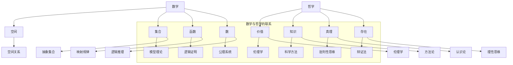
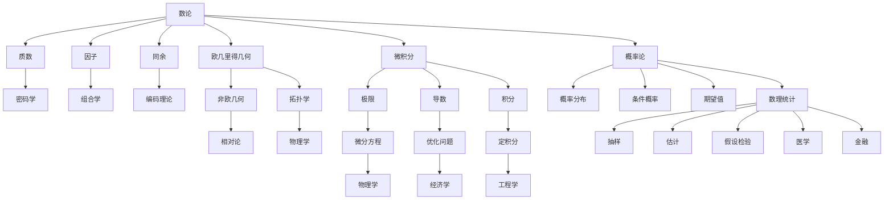
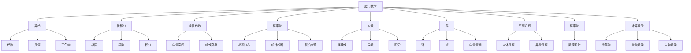

                 

### 背景介绍

数学与哲学，作为人类智慧的两大瑰宝，它们在历史的长河中相互交织、相互影响，共同推动了人类文明的进步。数学，作为一门精确的科学，其研究对象是数量、结构、变化和空间。它通过逻辑推理和抽象思维，揭示自然界的规律，为自然科学和工程技术提供了坚实的理论基础。哲学，则是关于存在、知识、价值和理性的探讨，它关注的是思维的本质、人类行为的意义以及世界的本质。

数学的发展历史悠久，可以追溯到古代文明的萌芽时期。例如，古埃及人和古巴比伦人就已经在使用数学解决实际问题，如建筑、测量和天文计算。古希腊的数学成就更是令人瞩目，欧几里得的《几何原本》是数学史上的一部里程碑作品，它系统地总结了古希腊的几何知识。中世纪的阿拉伯数学家们也对数学的发展做出了巨大贡献，他们将印度-阿拉伯数字系统和代数等数学概念传播到欧洲。到了近代，牛顿和莱布尼茨的微积分发明，标志着数学进入了一个新的时代。

哲学思想的发展同样源远流长。古代哲学主要关注宇宙的本质和人类存在的意义，例如，古希腊的苏格拉底、柏拉图和亚里士多德都是哲学史上的重要人物。中世纪的哲学则受到基督教神学的影响，哲学家们试图将神学与理性思考相结合。近现代哲学则更加多元化，从笛卡尔、康德到黑格尔，哲学家们不断探索人类思维的本质、知识的来源以及伦理道德等问题。

数学与哲学的相互影响在历史上有着深刻的体现。古代数学家如欧几里得和毕达哥拉斯，他们的研究不仅限于几何和数论，还涉及到宇宙的和谐与秩序，这些思想与古希腊哲学中的宇宙观有着密切的联系。在近代，数学家们如牛顿和莱布尼茨，他们的工作不仅推动了数学的发展，也深刻影响了哲学领域，尤其是启蒙时期的理性主义思潮。

本文将从以下几个方面探讨数学与哲学思想的相互影响与启发：

1. **数学基础理论**：介绍数学的基本概念和发展历程，包括数论、几何和微积分等核心内容。
2. **哲学思想发展历史**：回顾哲学的发展历程，从古希腊哲学到近现代哲学，分析哲学思想对数学的启示。
3. **数学与哲学思想的相互影响案例**：通过具体的历史案例，展示数学与哲学思想如何相互影响。
4. **数学与哲学思想的启示**：探讨数学对哲学的启示，以及哲学对数学的影响。
5. **数学与哲学思想的意义**：总结数学与哲学思想的关系，分析其对人类文明的贡献。

### 核心概念与联系

在探讨数学与哲学思想的相互影响之前，我们需要明确一些核心概念，并理解它们之间的关系。这些核心概念不仅构成了数学和哲学的基本框架，也是两者相互影响的重要纽带。

首先，我们来探讨数学的基本概念。数学的核心概念包括数、函数、集合、空间等。数是数学的基础，它不仅可以用来计数，还可以用来表示量的大小、比例和关系。函数是描述变量之间关系的一种数学工具，它揭示了输入与输出之间的映射规律。集合则是包含一定元素的抽象集合，它为数学的研究提供了基础。空间概念则描述了物体在三维空间中的位置和形状。

哲学的基本概念则包括存在、真理、知识、价值等。存在是哲学探讨的核心问题之一，它关注的是事物的本质和存在方式。真理是哲学的另一重要概念，它关乎我们如何认识世界和真理的本质。知识则探讨我们如何获取和应用知识，包括科学方法和理性思考。价值则涉及人类行为的意义和目的，它关注的是道德和伦理问题。

数学与哲学之间的核心联系在于它们对理性思维的强调。数学通过逻辑推理和抽象思维，揭示了自然界的规律，而哲学则通过理性思考，探讨人类思维的本质和意义。数学中的公理系统、逻辑证明和模型理论，与哲学中的理性主义、辩证法和批判性思维有着密切的联系。

为了更直观地展示数学与哲学之间的核心概念联系，我们可以使用Mermaid流程图来构建它们之间的概念架构：

这个流程图清晰地展示了数学与哲学的核心概念及其相互关系。数、函数、集合、空间等数学概念与逻辑推理、映射规律、抽象集合、空间关系等哲学概念相互交织，共同构成了数学与哲学相互影响的基础。

### 数学的基本原理

数学作为一门严谨的学科，其基础原理是构建整个知识体系的核心。以下是数学中的几个基本原理及其在各个分支中的应用。

#### 数的概念

数是数学中最基本的概念之一。数的概念经历了从自然数到整数、分数、有理数、无理数等的发展过程。自然数是我们日常生活中最常见的数，用于计数和排序。整数包括自然数和它们的相反数，它们在数学中的广泛应用包括整数的加法、减法、乘法和除法。分数是有理数的一种表现形式，用于表示部分与整体的关系。有理数是可以表示为两个整数之比的数，包括整数和分数。无理数则是不能表示为两个整数之比的数，如π和√2，它们在数学分析和几何学中有着重要的应用。

#### 等式与不等式

等式是数学中描述两个表达式相等的语句。等式的基本性质包括等式的传递性、对称性和结合性。例如，如果a=b且b=c，则a=c。不等式则用来描述两个表达式之间的大小关系，如a>b、a<b或a=b。不等式在数学中的运用非常广泛，包括解决优化问题、比较函数值等。例如，在比较两个数的大小时，我们可以使用不等式来判断它们的大小关系。

#### 函数与极限

函数是描述变量之间关系的数学工具。在数学中，函数可以看作是一个“机器”，它将输入映射到输出。函数的定义域和值域是函数的重要属性，定义域是指函数可以接受的所有输入值的集合，值域是指函数输出的所有可能的集合。极限是数学中另一个重要的概念，它用于描述函数在某个点的行为。例如，当自变量趋近于某个值时，函数值趋近于某个特定的数。极限的概念在微积分中有着广泛的应用，包括求导数和定积分。

在数学的各个分支中，这些基本原理都有其独特的应用。

**数论**：数论是研究整数性质和结构的数学分支。数论中的许多问题都涉及到数的基本概念，如质数、因子、同余等。例如，质数是数论中的一个重要概念，它只能被1和自身整除。质数在密码学和数论中的应用非常广泛，如RSA加密算法。

**几何**：几何学研究空间中的形状、大小和位置关系。几何中的基本原理包括点、线、面等概念。例如，欧几里得几何研究的是基于平行公理的几何学，而非欧几何则是在不使用平行公理的情况下研究的几何学。非欧几何对爱因斯坦的相对论有着重要的影响。

**微积分**：微积分是研究变化和累积的数学工具。微积分中的基本原理包括极限、导数和积分。导数用于描述函数在某一点的变化率，而积分则用于计算函数的累积量。微积分在物理学、工程学和经济学等领域有着广泛的应用。

**概率论与数理统计**：概率论和数理统计是研究随机事件和数据的数学分支。概率论中的基本原理包括概率分布、条件概率和期望值。数理统计中的基本原理包括抽样、估计和假设检验。概率论和数理统计在保险、金融和医学等领域有着重要的应用。

为了更直观地展示数学的基本原理及其在各个分支中的应用，我们可以使用Mermaid流程图来构建它们之间的关系：

这个流程图清晰地展示了数学的基本原理及其在各个数学分支中的应用。通过这个流程图，我们可以更好地理解数学的基本原理如何相互联系，并在不同的领域中发挥作用。

### 数学的主要分支

数学是一门内容丰富、分支繁多的学科。它不仅涵盖了从基础数学概念到高级数学理论的各种主题，还包括了多个相互关联的分支。以下是数学的主要分支及其简要介绍。

#### 初等数学

初等数学是数学的基础部分，它包括算术、代数、几何和三角学等。算术是关于数的基本运算，如加法、减法、乘法和除法。代数主要研究变量和方程，包括代数式的运算、方程的解法和解构。几何学是研究形状、大小和空间位置的科学，它涉及到平面几何和立体几何。三角学则是关于角度和三角函数的研究，广泛应用于科学计算和工程领域。

#### 高等数学

高等数学包括微积分、线性代数、概率论与数理统计等。微积分是研究变化和累积的数学工具，由极限、导数和积分三部分构成，它在物理学、工程学、生物学和经济学等领域有着广泛的应用。线性代数研究向量空间和线性变换，它在数值分析、数据科学和量子物理学等领域有着重要应用。概率论与数理统计则研究随机事件和数据的性质，包括概率分布、统计推断和假设检验，它在金融、保险、医学和自然科学等领域有着重要应用。

#### 实分析

实分析是研究实数和复数的性质及其函数的数学分支。它包括实数的构造、连续性、导数和积分等概念。实分析在数学分析、复分析和泛函分析等分支中有着重要地位。

#### 代数学

代数学是研究代数结构及其性质的数学分支，包括群、环、域、向量空间等。代数学在编码理论、密码学、数论和量子计算等领域有着广泛应用。

#### 几何学

几何学是研究空间中点的位置、线、面和立体图形的数学分支。它分为平面几何、立体几何和非欧几何等。几何学在物理学、工程学、计算机科学和天文学等领域有着广泛应用。

#### 概率论与数理统计

概率论与数理统计是研究随机现象和数据的数学分支。概率论研究随机事件发生的可能性，数理统计则利用概率论的方法对数据进行统计分析，以推断总体特征。

#### 应用数学

应用数学是数学在各个领域的应用，包括计算数学、运筹学、金融数学、生物数学等。应用数学的目标是将数学理论应用于实际问题，解决诸如优化问题、模拟问题和预测问题等。

通过这些数学分支的介绍，我们可以看到数学的广泛性和多样性。每一个分支都有其独特的研究领域和应用场景，它们共同构成了数学这座宏伟的宝库。为了更直观地展示数学的主要分支及其相互关系，我们可以使用Mermaid流程图：

这个流程图清晰地展示了数学的主要分支及其相互关系，有助于我们更好地理解数学的整体结构和各个分支的重要性和应用。

### 哲学思想发展历史

哲学思想的起源可以追溯到古代文明，当时的哲学家们开始探讨宇宙的本质、人类的地位和生活的意义。随着历史的发展，哲学思想逐渐演化，形成了不同的流派和理论，这些流派和理论不仅对当时的社会和文化产生了深远影响，也对后来的数学发展起到了重要的启示作用。

#### 古代哲学思想

古希腊哲学是哲学思想的发源地，古希腊哲学家们对数学和哲学的相互影响做出了重要贡献。苏格拉底、柏拉图和亚里士多德是古希腊哲学的三大巨头。

- **苏格拉底**：苏格拉底是古希腊哲学的奠基者之一，他提出了著名的“认识自我”的哲学思想。苏格拉底的方法是通过对话和提问来引导对方思考，这种方法对后来的辩证法和批判性思维有着深远的影响。

- **柏拉图**：柏拉图是苏格拉底的学生，他在《理想国》等著作中提出了“理念论”和“辩证法”。柏拉图认为，现实世界只是理念世界的影子，真正的知识和真理存在于理念世界中。他的哲学思想对后来的数学和科学方法论产生了重要影响。

- **亚里士多德**：亚里士多德是柏拉图的学生，他在哲学、生物学、物理学和逻辑学等领域都有卓越贡献。亚里士多德提出了形式逻辑的基本原理，他的《工具论》是逻辑学的重要著作。此外，亚里士多德还研究了几何和物理，他的工作为后来的数学和物理学奠定了基础。

#### 印度哲学思想

印度哲学有着悠久的历史和丰富的内容，它对数学的发展也有重要贡献。印度哲学中的主要流派包括胜论、唯识论和因明论。

- **胜论**：胜论是印度哲学中的一个重要流派，它探讨了事物的本质和存在方式。胜论提出了“因”的概念，即事物存在的理由和条件。这种思想对后来的数学和逻辑学有着深远的影响。

- **唯识论**：唯识论是印度哲学中的另一个重要流派，它认为现实世界是由意识构成的。唯识论探讨了意识、知识和真理的本质，它的思想对后来的哲学和心理学产生了重要影响。

- **因明论**：因明论是印度哲学中的一个逻辑学流派，它研究推理和论证的方法。因明论提出了“因”和“果”的概念，即原因和结果之间的关系。这种思想对后来的数学证明方法和逻辑学有着重要的影响。

#### 中世纪哲学思想

中世纪哲学受到基督教神学的影响，哲学家们试图将神学与理性思考相结合。在这一时期，基督教哲学和伊斯兰哲学都有重要的贡献。

- **基督教哲学**：奥古斯丁是中世纪基督教哲学的杰出代表，他在《忏悔录》中探讨了信仰、自由意志和上帝的存在。奥古斯丁的哲学思想对后来的西方哲学和神学产生了深远影响。

- **伊斯兰哲学**：阿拉伯世界的哲学家们对数学和哲学的发展做出了重要贡献。奥尔图丁和伊本·希兹是中世纪伊斯兰哲学的代表人物，他们的工作在数学、逻辑学和哲学领域都有卓越成就。

#### 近现代哲学思想

近现代哲学在西方哲学史上占据重要地位，它从笛卡尔、康德到黑格尔，不断探索人类思维的本质、知识的来源和伦理道德等问题。

- **笛卡尔**：笛卡尔是现代哲学的奠基者之一，他提出了著名的“我思故我在”的哲学命题。笛卡尔的哲学思想强调了理性思考和科学方法的重要性，对后来的科学革命和数学发展产生了重要影响。

- **康德**：康德是启蒙时期的哲学家，他的工作标志着哲学从传统的形而上学转向批判性思考。康德的《纯粹理性批判》探讨了知识的起源和范围，他的思想对后来的数学哲学和逻辑学有着深远影响。

- **黑格尔**：黑格尔是德国古典哲学的杰出代表，他的辩证法思想对哲学、数学和科学方法论产生了重要影响。黑格尔认为，事物的发展是通过矛盾的斗争和统一来实现的，这种思想对后来的数学模型和科学理论有着重要启示。

通过回顾哲学思想的发展历史，我们可以看到哲学思想在不同历史时期的变化和发展。哲学思想不仅对当时的社会和文化产生了深远影响，也对数学的发展起到了重要的启示作用。哲学中的逻辑推理、理性思考和辩证法等思想为数学的研究提供了方法和指导，推动了数学的不断进步。

### 数学对哲学的影响

数学在哲学中的影响是深远且多方面的。它不仅为哲学问题提供了新的研究工具，还揭示了人类思维和存在的某些基本规律。以下是数学对哲学的几个主要影响。

#### 数学方法在哲学中的应用

数学方法在哲学中的应用主要体现在逻辑推理和模型构建方面。逻辑推理是数学的核心，它通过严密的逻辑步骤，从已知的前提出发，得出必然的结论。这种方法在哲学中得到了广泛应用，哲学家们利用逻辑推理来分析道德问题、政治问题和社会问题。例如，亚里士多德的逻辑学为伦理学和政治学提供了理论基础，而康德的道德哲学则通过形式逻辑的严格证明，建立了道德法则的普遍性和必然性。

此外，数学模型在哲学中也有重要应用。哲学家们通过构建数学模型来模拟和解释现实世界中的复杂现象。例如，社会学家和心理学家使用数学模型来研究社会结构和人类行为，经济学家则通过数学模型来分析市场行为和宏观经济现象。这些模型不仅帮助哲学家们更好地理解现实世界，还为哲学问题的研究提供了新的视角和方法。

#### 数学对哲学问题的解答

数学对哲学问题的解答主要体现在对存在、真理和知识等核心问题的探讨。在存在问题上，数学通过研究几何和空间，揭示了物质世界的结构。例如，欧几里得的《几何原本》通过对几何公理和定理的研究，揭示了空间的基本性质，这为哲学家们探讨存在的本质提供了新的思路。

在真理问题上，数学通过证明和推理，确立了逻辑真理和数学真理。数学的证明过程是一种严格的逻辑推理，它从基本的公理和定义出发，通过一系列推导，得出结论。这种证明方法在哲学中得到了借鉴，哲学家们试图通过类似的方法来确立道德真理和科学真理。

在知识问题上，数学为哲学提供了认识论的基础。数学研究的是客观世界的规律，它的成果是可靠的、可验证的。这种方法对哲学家们认识世界和获取知识的方法产生了深远影响。例如，康德通过批判性思维，提出了先验知

### 哲学对数学的影响

哲学对数学的影响同样深远且广泛，哲学思想不仅塑造了数学的方法论，还在数学概念的阐述和发展过程中起到了关键作用。以下是哲学对数学影响的几个主要方面。

#### 哲学对数学概念的阐述

哲学在数学概念的阐述过程中起到了引导和推动作用。在数学发展的早期阶段，哲学家们通过思考宇宙的本质和人类认知的方式，为数学概念的发展奠定了基础。例如，古希腊哲学家毕达哥拉斯提出的“万物皆数”的哲学思想，强调了数的普遍性和重要性，这为后来的数学研究奠定了思想基础。柏拉图的理念论则提出了数学对象作为一种抽象理念存在的观点，这种思想对后来的数学抽象化和形式化发展产生了重要影响。

此外，哲学中的逻辑推理和辩证法为数学的证明方法提供了理论基础。亚里士多德的逻辑学提出了形式逻辑的基本原理，这些原理被广泛应用于数学证明中。逻辑推理的严密性和精确性要求数学证明必须建立在明确的前提和严格的推理步骤之上，这有助于提高数学证明的可靠性和有效性。

#### 哲学对数学方法的影响

哲学对数学方法的影响主要体现在方法论和思维方式的转变上。在古代，数学主要是一种经验的积累和公理体系的建立。然而，随着哲学的发展，尤其是近代哲学的兴起，数学方法论发生了显著变化。笛卡尔提出了“我思故我在”的哲学命题，强调理性思考和科学方法的重要性。这种思想影响了数学的发展，使得数学研究开始更加注重理性思考和逻辑证明，而非仅仅依赖于经验观察。

康德的批判哲学进一步推动了数学方法论的发展。康德在《纯粹理性批判》中探讨了知识的起源和范围，提出了先验知识和后天知识的区分。康德认为，数学知识是先验的，即它是基于人类理性的内在结构和基本概念而建立的。这种观点为数学公理化的方法提供了哲学基础，推动了数学从经验科学向纯粹理性科学的转变。

此外，哲学中的辩证法思想也对数学方法产生了影响。黑格尔的辩证法强调事物的发展是通过矛盾的斗争和统一来实现的。这种思想在数学中得到了体现，例如在数学中的“反证法”中，通过假设结论的反面，推导出矛盾，从而证明原命题的正确性。这种思维方式不仅丰富了数学证明的方法，也提高了数学证明的严密性和深度。

#### 哲学对数学应用的推动

哲学不仅影响了数学的方法论和概念阐述，还在数学应用方面起到了推动作用。哲学中的问题导向和理性思考方法促使数学家们不断探索新的数学工具和方法，以解决实际问题。例如，在物理学中，牛顿和莱布尼茨的微积分方法为描述自然现象提供了数学工具，推动了物理学的发展。在经济学中，数学模型和统计学方法的应用使得经济学研究更加精确和科学，推动了经济学的现代化进程。

此外，哲学中的伦理思想和价值观念也对数学应用产生了影响。在解决社会问题时，数学家们不仅要考虑技术层面的问题，还要考虑道德和伦理因素。例如，在发展经济模型时，数学家们需要考虑公平、效率和可持续发展等伦理问题，以确保数学模型的应用不会导致社会的不公和资源的浪费。

总之，哲学对数学的影响是多方面的，它不仅为数学概念和方法的发展提供了哲学基础，还在数学应用的推动中起到了关键作用。通过哲学的思考和指导，数学家们能够更深入地理解数学的本质和应用价值，推动数学不断向前发展。

### 数学对哲学的启示

数学在哲学思考中的应用不仅提供了新的工具和方法，还揭示了人类思维和存在的某些基本规律，对哲学思考产生了深远的影响。以下是数学对哲学的几个主要启示。

#### 数学方法在哲学思考中的应用

数学方法在哲学思考中的应用主要体现在逻辑推理和模型构建方面。逻辑推理是数学的核心，它通过严密的逻辑步骤，从已知的前提出发，得出必然的结论。这种方法在哲学中得到了广泛应用，哲学家们利用逻辑推理来分析道德问题、政治问题和社会问题。例如，亚里士多德的逻辑学为伦理学和政治学提供了理论基础，而康德的道德哲学则通过形式逻辑的严格证明，建立了道德法则的普遍性和必然性。

此外，数学模型在哲学中也有重要应用。哲学家们通过构建数学模型来模拟和解释现实世界中的复杂现象。例如，社会学家和心理学家使用数学模型来研究社会结构和人类行为，经济学家则通过数学模型来分析市场行为和宏观经济现象。这些模型不仅帮助哲学家们更好地理解现实世界，还为哲学问题的研究提供了新的视角和方法。

#### 数学对哲学问题的启发

数学对哲学问题的启发主要体现在对存在、真理和知识等核心问题的探讨。在存在问题上，数学通过研究几何和空间，揭示了物质世界的结构。例如，欧几里得的《几何原本》通过对几何公理和定理的研究，揭示了空间的基本性质，这为哲学家们探讨存在的本质提供了新的思路。

在真理问题上，数学通过证明和推理，确立了逻辑真理和数学真理。数学的证明过程是一种严格的逻辑推理，它从基本的公理和定义出发，通过一系列推导，得出结论。这种证明方法在哲学中得到了借鉴，哲学家们试图通过类似的方法来确立道德真理和科学真理。

在知识问题上，数学为哲学提供了认识论的基础。数学研究的是客观世界的规律，它的成果是可靠的、可验证的。这种方法对哲学家们认识世界和获取知识的方法产生了深远影响。例如，康德通过批判性思维，提出了先验知识和后天知识的区分，认为数学知识是先验的，即它是基于人类理性的内在结构和基本概念而建立的。这种观点为数学公理化的方法提供了哲学基础，推动了数学从经验科学向纯粹理性科学的转变。

#### 数学对哲学方法的推动

数学对哲学方法的推动主要体现在对理性思考和科学方法的重要性认识上。在古代，哲学主要依靠直观和推理来探讨问题，而数学的严密性和精确性为哲学提供了新的研究方法。数学中的逻辑推理、证明方法和公理体系为哲学提供了新的思维方式，使得哲学问题的研究更加系统化和科学化。

此外，数学中的模型构建和抽象化方法也启发了哲学家们。数学通过建立抽象模型，将复杂的现实问题简化为可分析和计算的形式，这种方法在哲学中的应用使得哲学家们能够更深入地探讨复杂问题。例如，社会契约论、道德哲学和认知科学等领域的理论发展都受到了数学方法的启发。

总之，数学为哲学思考提供了新的工具和方法，揭示了人类思维和存在的某些基本规律，对哲学问题的探讨和哲学方法的发展产生了深远的影响。通过数学的启示，哲学家们能够更深入地理解人类思维的本质和存在的意义，推动哲学思考不断向前发展。

### 哲学对数学的启示

哲学在数学的发展过程中扮演了重要的角色，不仅为数学概念的创新提供了灵感，还在数学方法论的发展中起到了推动作用。以下是哲学对数学的几个主要启示。

#### 哲学对数学概念的创新

哲学思考往往促使数学家对现有概念进行反思和拓展，从而推动数学概念的创新。例如，古希腊哲学家柏拉图的“理念论”认为，真实的存在是理念，而非感官世界中的物体。这一思想启发了数学家对抽象概念的追求，促使他们在数学中探讨纯粹抽象的结构和形式。柏拉图的理念论为数学中的公理体系奠定了基础，使得数学家们能够通过定义和公理来构建一个自洽的数学世界。

此外，德国哲学家康德在《纯粹理性批判》中提出了先验知识和后天知识的区分，认为数学和几何学是基于先验直观的。康德的观点促使数学家们更加重视公理和逻辑证明，从而推动了数学的公理化运动。这种运动不仅使数学成为一门严谨的科学，也为后来的数学家提供了新的研究方法。

#### 哲学对数学方法论的发展

哲学对数学方法论的发展起到了重要的推动作用。例如，笛卡尔的“我思故我在”命题强调了理性思考和科学方法的重要性，这直接影响了数学家们的思维方式。笛卡尔的方法论强调怀疑一切、逐一验证，这种方法在数学中得到了广泛应用，成为数学研究的基本原则。

康德的批判哲学也对数学方法论产生了深远影响。康德在《纯粹理性批判》中探讨了知识的起源和范围，提出了先验知识和后天知识的区分。康德认为，数学和几何学是基于先验直观的，这种观点促使数学家们更加关注公理和逻辑证明，从而推动了数学的公理化运动。公理化方法不仅使数学成为一门严谨的科学，也为后来的数学家提供了新的研究方法。

此外，黑格尔的辩证法思想在数学方法论中也有重要应用。黑格尔认为，事物的发展是通过矛盾的斗争和统一来实现的。这种思想在数学中的应用，例如在拓扑学、代数学和逻辑学中，促进了数学的深入和发展。

#### 哲学对数学应用的推动

哲学不仅影响了数学的概念和方法，还在数学应用方面起到了推动作用。例如，社会契约论中的公平、效率和互惠等概念启发了数学在经济学中的应用。经济学家利用数学模型来分析市场行为和宏观经济现象，从而为政策制定提供了科学依据。

道德哲学中的伦理思想和价值观念也对数学应用产生了影响。在解决社会问题时，数学家们不仅要考虑技术层面的问题，还要考虑道德和伦理因素。例如，在发展经济模型时，数学家们需要考虑公平、效率和可持续发展等伦理问题，以确保数学模型的应用不会导致社会的不公和资源的浪费。

总之，哲学对数学的影响是多方面的，它不仅为数学概念的创新提供了灵感，还在数学方法论的发展中起到了推动作用。通过哲学的思考和指导，数学家们能够更深入地理解数学的本质和应用价值，推动数学不断向前发展。

### 数学与哲学思想的意义

数学与哲学思想对人类文明有着深远的影响，它们不仅在各自的领域内推动了科学和文化的进步，还在相互交织中塑造了现代社会的思想基础。

首先，数学作为一门精确的科学，为人类认识世界提供了强大的工具。它通过逻辑推理和抽象思维，揭示了自然界的规律，推动了科学技术的发展。从古代的几何学到现代的微积分，数学为天文学、物理学、化学和生物学等自然科学提供了坚实的理论基础。例如，牛顿和莱布尼茨的微积分方法为经典力学的建立奠定了基础，推动了现代物理学的诞生。数学的精确性和普适性使得它不仅适用于科学研究，还广泛应用于工程、经济学、计算机科学和医学等领域，极大地促进了社会的进步。

哲学思想则从更广泛的视角探讨了人类存在的意义和价值观。它通过理性思考和批判性思维，帮助我们理解自身、理解社会和宇宙。哲学中的道德、伦理和认识论问题，不仅为个人提供了行为准则，也为社会制度的设计提供了理论基础。例如，古希腊哲学中的民主思想对现代政治制度的形成产生了重要影响。康德的道德哲学提出了“人是目的而非手段”的观点，强调了人的尊严和价值，这一思想在人权和伦理学领域有着深远的影响。

数学与哲学思想的相互影响，推动了人类文明的不断进步。数学为哲学提供了研究工具和方法，使得哲学问题能够以更科学、更严谨的方式进行分析。例如，数学中的逻辑推理和模型构建方法，被广泛应用于哲学中的认识论和伦理学问题。同时，哲学中的思考方式也影响了数学的发展，例如，康德的批判哲学为数学的公理化运动提供了哲学基础，推动了数学从经验科学向纯粹理性科学的转变。

在现代，数学与哲学思想的意义更加凸显。随着科学技术的快速发展，数学在解决复杂问题、推动技术创新方面的作用日益重要。而哲学则在探讨人类行为、社会伦理和科技伦理方面发挥着不可替代的作用。例如，人工智能的发展引发了关于智能本质、人工智能伦理和社会影响的哲学讨论，这些讨论不仅促进了人工智能技术的健康发展，也为社会提供了新的思考方向。

总之，数学与哲学思想对人类文明的贡献是多方面的。数学为科学和技术的进步提供了基础，而哲学则从更广泛的视角探讨了人类存在的意义和价值观。两者相互促进、共同发展，为现代社会的思想基础奠定了坚实的基础。通过不断探索和思考，数学与哲学将继续为人类文明的发展贡献智慧和力量。

### 结论

数学与哲学思想的关系是复杂而深刻的。通过本文的探讨，我们可以看到，数学与哲学在历史的长河中相互交织，共同推动了人类文明的进步。数学为哲学提供了研究工具和方法，如逻辑推理和模型构建，使得哲学问题能够以更科学、更严谨的方式进行分析。同时，哲学中的思考方式也影响了数学的发展，例如，康德的批判哲学为数学的公理化运动提供了哲学基础。

在现代社会，数学与哲学思想的意义更加凸显。数学在解决复杂问题、推动技术创新方面的作用日益重要，而哲学则在探讨人类行为、社会伦理和科技伦理方面发挥着不可替代的作用。例如，人工智能的发展引发了关于智能本质、人工智能伦理和社会影响的哲学讨论，这些讨论不仅促进了人工智能技术的健康发展，也为社会提供了新的思考方向。

展望未来，数学与哲学将继续相互影响、共同发展。随着科学技术的不断进步，数学在解决现实问题中的应用将更加广泛和深入。同时，哲学将不断探讨人类存在的意义、价值观和科技伦理等问题，为人类文明的未来发展提供思想指引。

我们鼓励读者继续深入研究和思考数学与哲学思想的关系，探索它们在现代社会中的新应用和意义，为人类文明的进步贡献智慧和力量。

### 数学与哲学思想的意义

数学与哲学思想对人类文明的贡献是不可估量的。数学作为一门精确的科学，通过其逻辑推理和抽象思维，揭示了自然界的规律，为自然科学和工程技术提供了坚实的理论基础。从古代的几何学到现代的微积分，数学在推动科学进步和技术创新方面发挥了关键作用。例如，牛顿和莱布尼茨的微积分方法为经典力学的建立奠定了基础，推动了现代物理学的诞生。数学的精确性和普适性使其在各个领域都得到了广泛应用，从天文学、物理学、化学到生物学、经济学、计算机科学和医学，无不受益于数学的进步。

哲学思想则从更广泛的视角探讨了人类存在的意义、价值观和道德问题。它通过理性思考和批判性思维，帮助我们理解自身、理解社会和宇宙。哲学中的道德、伦理和认识论问题，不仅为个人提供了行为准则，也为社会制度的设计提供了理论基础。例如，古希腊哲学中的民主思想对现代政治制度的形成产生了重要影响。康德的道德哲学提出了“人是目的而非手段”的观点，强调了人的尊严和价值，这一思想在人权和伦理学领域有着深远的影响。

数学与哲学思想的相互影响，使得两者共同推动了人类文明的进步。数学为哲学提供了研究工具和方法，如逻辑推理和模型构建，使得哲学问题能够以更科学、更严谨的方式进行分析。同时，哲学中的思考方式也影响了数学的发展，例如，康德的批判哲学为数学的公理化运动提供了哲学基础，推动了数学从经验科学向纯粹理性科学的转变。

在现代，数学与哲学思想的意义更加凸显。随着科学技术的快速发展，数学在解决复杂问题、推动技术创新方面的作用日益重要。而哲学则在探讨人类行为、社会伦理和科技伦理方面发挥着不可替代的作用。例如，人工智能的发展引发了关于智能本质、人工智能伦理和社会影响的哲学讨论，这些讨论不仅促进了人工智能技术的健康发展，也为社会提供了新的思考方向。

总之，数学与哲学思想对人类文明的贡献是多方面的。数学为科学和技术的进步提供了基础，而哲学则从更广泛的视角探讨了人类存在的意义和价值观。两者相互促进、共同发展，为现代社会的思想基础奠定了坚实的基础。通过不断探索和思考，数学与哲学将继续为人类文明的进步贡献智慧和力量。

### 最佳实践 tips

为了更好地理解和应用数学与哲学思想，以下是几个最佳实践 tips：

1. **深入学习数学和哲学基础**：掌握数学和哲学的基本概念和原理，是理解和应用它们的前提。可以通过阅读经典著作，如《几何原本》、《理想国》和《纯粹理性批判》等，来加深对数学和哲学的理解。

2. **结合实例学习**：通过实际案例来学习数学和哲学的应用，可以帮助我们更好地理解理论。例如，通过研究欧几里得几何在工程中的应用，或分析柏拉图的哲学思想对政治制度的启示。

3. **批判性思考**：在学习和应用数学与哲学时，要培养批判性思维，不仅要接受现有的理论和观点，还要不断质疑和反思。这种思维方式有助于我们发现新问题，并提出新的解决方案。

4. **跨学科交流**：数学和哲学之间的交叉领域非常丰富，例如数学哲学、哲学数学等。通过跨学科交流，可以促进不同领域的知识融合，产生新的洞见和发现。

5. **实践与理论相结合**：在应用数学与哲学思想时，要将理论与实践相结合。通过实践验证理论，可以帮助我们更好地理解理论的实用价值，并不断优化和完善理论。

### 小结

本文通过详细探讨数学与哲学思想的相互影响与启发，总结了数学和哲学在历史、理论、应用和未来发展方面的关系。数学为哲学提供了研究工具和方法，而哲学则影响了数学的概念和方法论。两者相互促进，共同推动了人类文明的进步。

在未来的发展中，数学与哲学将继续在科技、社会和伦理领域发挥重要作用。通过深入学习和批判性思考，我们可以更好地理解和应用数学与哲学思想，为解决现实问题和社会发展提供智慧和力量。

### 注意事项

在研究数学与哲学思想时，需要注意以下几个方面：

1. **严谨性**：数学和哲学都是严谨的学科，研究过程中要确保逻辑推理和论证的严密性，避免出现错误和谬误。

2. **跨学科知识**：数学与哲学相互影响，涉及多个学科领域，研究时要具备跨学科的知识背景，以便更好地理解和应用。

3. **实际应用**：在学习和研究过程中，要关注数学和哲学的实际应用，通过实例分析来加深对理论的理解。

4. **批判性思维**：要培养批判性思维，不盲从权威，敢于质疑和反思，以推动理论的发展和创新。

### 拓展阅读

如果您对数学与哲学思想的研究感兴趣，以下是一些推荐的拓展阅读：

1. **《数学哲学导论》（An Introduction to the Philosophy of Mathematics）**：作者Paul Benacerraf和Hugh Colville，系统地介绍了数学哲学的基本概念和问题。

2. **《数学是怎样一种科学》（How Mathematics Happened: A Brief History）**：作者Julian Barbour，从历史角度探讨了数学的发展及其对哲学的影响。

3. **《哲学的数学化》（The Mathematical Way of Thinking）**：作者Stephen Rodriguez，阐述了数学思维与哲学思维之间的联系。

4. **《康德的纯粹理性批判》（Critique of Pure Reason）**：作者Immanuel Kant，深入探讨了数学和哲学的关系，提出了先验知识和先天直觉的概念。

5. **《数学的思想家》（The Mathematical Experience）**：作者Philip J. Davis和Reuben Hersh，从数学家的角度探讨了数学思维和数学哲学。

这些书籍和文献将为您提供更深入的理解和思考，帮助您更好地探索数学与哲学的相互关系。

