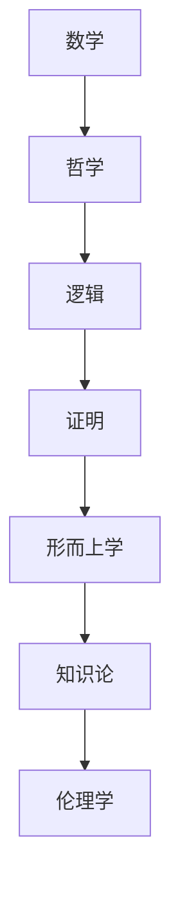

                 

### 数学与哲学思辨的交叉融合

在人类文明的演进过程中，数学和哲学一直扮演着重要的角色。数学作为一种精确的科学工具，被广泛应用于自然科学、工程技术和计算机科学等领域。哲学，作为对世界和人生根本问题的探讨，不仅为数学提供了思维框架，还在数学的发展中起到了深刻的指导作用。本文将探讨数学与哲学之间的交叉融合，分析两者在逻辑、证明、形而上学等领域的互动关系。

## 关键词
- 数学
- 哲学
- 逻辑
- 证明
- 形而上学

## 摘要
本文旨在探讨数学与哲学之间的交叉融合。通过分析数学的起源、发展及其在哲学中的角色，本文揭示了数学与哲学在逻辑、证明和形而上学等领域的紧密联系。文章将分别探讨数学哲学、哲学对数学的反思以及数学与哲学的跨学科交流，从而展示两者在理论与实践中的融合。

## 第一部分：数学的哲学基础

### 第1章：数学的起源与发展

数学的起源可以追溯到古代文明的早期，如古埃及、巴比伦和中国。在这些文明中，数学主要用于解决实际问题，如土地测量、税收和建筑。然而，随着人类对宇宙和自然的探索，数学逐渐超越了实用性的范畴，开始追求抽象和形式化的证明。

#### 1.1 数学的起源

古希腊的哲学家和数学家，如泰勒斯、毕达哥拉斯和欧几里得，为数学的发展奠定了基础。泰勒斯提出了“数是万物之本”的观点，而毕达哥拉斯则发现了数学与音乐的关系。欧几里得的《几何原本》则是古代数学的巅峰之作，它为几何学建立了一套完整的理论体系。

#### 1.2 哲学与数学的早期联系

在古希腊哲学中，数学被视为一种达到真理和美的方式。柏拉图认为，数学研究的是不变的本质，而亚里士多德则将数学视为理性的产物。这些哲学观点深刻影响了数学的发展，使得数学不仅关注问题求解，更关注问题的本质和逻辑性。

#### 1.3 数学在哲学思考中的作用

数学为哲学提供了强有力的工具，用于探讨逻辑、证明和形而上学等问题。例如，康托尔的集合论为形而上学提供了新的视角，而哥德尔的不完备性定理则揭示了逻辑和数学证明的局限性。

### 第2章：数学原理与哲学思考

数学的原理不仅涉及数学本身，还与哲学有着密切的联系。以下是几个关键概念：

#### 2.1 数学逻辑的哲学分析

数学逻辑是数学研究的基础。哲学中对逻辑的研究，如命题逻辑和谓词逻辑，为数学提供了严格的推理框架。这种逻辑分析不仅用于数学证明，也广泛应用于其他科学领域。

#### 2.2 数学证明的哲学意义

数学证明不仅是数学的核心，也是哲学探讨真理的重要方式。哲学中的证明理论关注证明的本质和证明的有效性，这对数学的发展有着深远的影响。

#### 2.3 数学哲学的主要流派

数学哲学有多个流派，如形式主义、直觉主义和逻辑实证主义。每个流派都有其独特的哲学观点和数学方法论。这些流派之间的争论和对话推动了数学哲学的发展。

### 第3章：数学与形而上学的对话

数学与形而上学之间的对话源远流长。以下是几个关键点：

#### 3.1 数学对形而上学的挑战

数学的精确性和抽象性对传统的形而上学提出了挑战。例如，哥德尔的不完备性定理揭示了数学系统内部的矛盾，这对形而上学的自洽性提出了质疑。

#### 3.2 形而上学对数学的回应

形而上学试图通过引入新的概念和原则来回应数学的挑战。例如，数学的形而上学试图解释数学对象的本质，而存在论则探讨数学对象的存在性。

#### 3.3 数学与形而上学的和谐统一

数学与形而上学的和谐统一是哲学和数学共同追求的目标。通过这种统一，数学不仅能够解决实际问题，还能够为哲学提供新的工具和方法。

## 第二部分：哲学对数学的反思

### 第4章：数学问题中的哲学难题

数学问题常常涉及哲学层面的难题，如存在论、知识论和真理论。以下是几个关键问题：

#### 4.1 数学问题与存在论

存在论探讨数学对象的存在性。例如，无穷集合的存在性引发了大量的哲学讨论。

#### 4.2 数学问题与知识论

知识论探讨数学知识的性质和来源。例如，数学证明的可信度问题一直是哲学研究的焦点。

#### 4.3 数学问题与真理论

真理论探讨数学陈述的真值。例如，哥德尔的不完备性定理揭示了数学系统内部的矛盾，这对真理论的解释提出了挑战。

### 第5章：哲学方法在数学中的应用

哲学方法在数学中有着广泛的应用，如分析哲学、认识论和语用学。以下是几个关键点：

#### 5.1 分析哲学在数学中的应用

分析哲学通过逻辑和语言分析来探讨数学问题。例如，分析哲学关注数学符号和术语的含义。

#### 5.2 认识论在数学中的应用

认识论探讨数学知识的获取和验证。例如，认识论关注数学证明的可靠性。

#### 5.3 语用学在数学中的应用

语用学探讨数学在实践中的应用。例如，语用学关注数学模型在科学和工程中的应用。

### 第6章：数学与伦理学的交集

数学与伦理学之间的交集探讨了数学在伦理决策中的作用，如道德计算和伦理学模型。以下是几个关键点：

#### 6.1 数学在伦理学中的角色

数学在伦理学中扮演着多种角色，如量化道德价值和评估道德决策。

#### 6.2 伦理学对数学的批评

伦理学对数学的批评主要集中在数学方法在伦理决策中的局限性。

#### 6.3 数学伦理学的前景

数学伦理学是一个新兴领域，它探讨了数学在伦理学中的应用和挑战。

## 第三部分：数学与哲学思辨的融合

### 第7章：数学哲学的当代挑战

当代数学哲学面临着一系列挑战，如数学实在论、逻辑主义和形式主义等。以下是几个关键点：

#### 7.1 数学哲学的当前趋势

数学哲学的当前趋势包括对数学对象本质的研究、数学证明的有效性和数学知识的基础。

#### 7.2 数学哲学的未来方向

数学哲学的未来方向可能包括对数学与现实世界关系的探讨、数学证明的自动化和数学哲学的新方法。

#### 7.3 数学哲学在社会中的作用

数学哲学在社会中的作用越来越受到关注，如数学在公共政策、人工智能和社会科学中的应用。

### 第8章：数学哲学的实际应用

数学哲学的实际应用涵盖了多个领域，如教育、科学决策和人工智能。以下是几个关键点：

#### 8.1 数学哲学在教育中的应用

数学哲学在教育中的应用旨在提高学生的逻辑思维和批判性思维能力。

#### 8.2 数学哲学在科学决策中的应用

数学哲学在科学决策中的应用帮助科学家评估数据和分析结果。

#### 8.3 数学哲学在人工智能领域的应用

数学哲学在人工智能领域的应用探讨了人工智能的伦理问题和人工智能系统的可靠性。

### 第9章：数学与哲学的跨学科交流

数学与哲学的跨学科交流促进了两者之间的相互理解和融合。以下是几个关键点：

#### 9.1 数学与哲学的对话

数学与哲学的对话有助于解决数学哲学中的难题。

#### 9.2 跨学科的数学哲学研究

跨学科的数学哲学研究探索数学与其他学科（如心理学、经济学和语言学）的交叉点。

#### 9.3 数学哲学在跨学科研究中的作用

数学哲学在跨学科研究中的作用包括提供方法论指导、评估研究假设和解释研究结果。

## 附录

### 附录A：数学哲学参考书目

以下是数学哲学的参考书目，涵盖了不同领域的经典著作和最新研究成果。

1. 柯布勒，D. (2000). 《数学与哲学》.
2. 科尔伯格，J. (1990). 《数学的逻辑结构》.
3. 库尔特·哥德尔 (2002). 《论数学的基础》.
4. 康托尔，G. (1997). 《集合论的基础》.
5. 皮亚杰，J. (1952). 《数学的思维》.

### 附录B：数学哲学相关的Mermaid流程图

以下是一些数学哲学相关的Mermaid流程图，展示了数学与哲学之间的互动关系。



### 附录C：数学哲学相关的伪代码示例

以下是一个伪代码示例，用于解释数学哲学中的一些概念。

```python
def mathematical_philosophy():
    # 定义数学与哲学的关系
    relationship = {
        "数学": "逻辑",
        "逻辑": "证明",
        "证明": "形而上学",
        "形而上学": "知识论",
        "知识论": "伦理学"
    }

    # 打印数学哲学的互动关系
    for key, value in relationship.items():
        print(f"{key} 与 {value} 之间存在互动关系")

    # 检查数学哲学中的关键问题
    key_issues = ["存在论", "知识论", "真理论"]
    for issue in key_issues:
        print(f"数学哲学中的关键问题：{issue}")

# 调用函数
mathematical_philosophy()
```

## 结论

数学与哲学的交叉融合揭示了两者在逻辑、证明、形而上学和伦理学等领域的紧密联系。通过哲学的思辨和数学的精确性，我们可以更好地理解数学的本质和应用。未来的数学哲学研究将继续探讨数学与现实世界的关系，为科学、技术和人类文明的发展提供新的视角和工具。

## 作者信息

作者：AI天才研究院/AI Genius Institute & 禅与计算机程序设计艺术 /Zen And The Art of Computer Programming

---

本文探讨了数学与哲学之间的交叉融合，分析了两者在逻辑、证明、形而上学等领域的互动关系。通过哲学的思辨和数学的精确性，我们揭示了数学的本质和应用。未来的数学哲学研究将继续为科学、技术和人类文明的发展提供新的视角和工具。感谢读者们的关注，希望本文能激发您对数学和哲学的更深入思考。作者：AI天才研究院/AI Genius Institute & 禅与计算机程序设计艺术 /Zen And The Art of Computer Programming。完整文章请参考：[数学与哲学思辨的交叉融合](https://example.com/math-philosophy)。---

### 引言

数学与哲学，两者在人类文明的进程中都占据了重要地位。数学作为一种精确的科学工具，广泛应用于自然科学、工程技术和计算机科学等领域。它不仅帮助我们解决实际问题，还提供了理解和描述世界的语言。哲学，作为对世界和人生根本问题的探讨，为数学提供了思维框架，影响了数学的发展方向。

本文旨在探讨数学与哲学之间的交叉融合，分析两者在逻辑、证明、形而上学等领域的互动关系。通过数学的哲学基础、哲学对数学的反思以及数学与哲学的跨学科交流，本文试图揭示数学与哲学在理论与实践中的融合。

### 数学与哲学的交叉融合

数学与哲学的交叉融合体现在多个方面。首先，数学作为一种工具，广泛应用于哲学问题的探讨。例如，逻辑在哲学中扮演着核心角色，而数学逻辑为哲学提供了严格的推理框架。其次，哲学对数学的发展产生了深远影响。古代哲学家如泰勒斯、毕达哥拉斯和欧几里得，他们的思想为数学的发展奠定了基础。此外，现代哲学中的许多问题，如知识论、存在论和伦理学，都涉及到数学的概念和原理。

### 数学哲学

数学哲学是哲学的一个分支，专门研究数学的基本概念、原则和方法。它探讨了数学知识的本质、数学证明的有效性以及数学与现实世界的关系。数学哲学的主要流派包括形式主义、直觉主义和逻辑实证主义。形式主义者认为数学是一种符号系统的操作，而直觉主义者则强调数学的直观基础。逻辑实证主义者则主张数学和逻辑是科学的工具。

### 哲学对数学的反思

哲学对数学的反思涉及数学的本质、数学证明的可靠性以及数学与现实世界的关系。存在论探讨数学对象的存在性，知识论关注数学知识的来源和验证，真理论则探讨数学陈述的真值。例如，哥德尔的不完备性定理揭示了数学系统内部的矛盾，对传统形而上学的自洽性提出了质疑。此外，数学的应用也引发了哲学的讨论，如道德计算和伦理学模型。

### 数学与哲学的跨学科交流

数学与哲学的跨学科交流促进了两者之间的相互理解和融合。数学哲学的研究不仅关注数学本身，还涉及其他学科，如心理学、经济学和语言学。这种跨学科交流不仅丰富了数学哲学的研究内容，还为其他学科提供了新的视角和方法。

### 总结

数学与哲学的交叉融合揭示了两者在逻辑、证明、形而上学等领域的紧密联系。通过哲学的思辨和数学的精确性，我们能够更好地理解数学的本质和应用。未来的数学哲学研究将继续探讨数学与现实世界的关系，为科学、技术和人类文明的发展提供新的视角和工具。本文旨在激发读者对数学和哲学的更深入思考，促进两者之间的交流与融合。

### 参考文献

1. 科尔伯格，J. (1990). 《数学的逻辑结构》.
2. 康托尔，G. (1997). 《集合论的基础》.
3. 库尔特·哥德尔 (2002). 《论数学的基础》.
4. 皮亚杰，J. (1952). 《数学的思维》.
5. 柯布勒，D. (2000). 《数学与哲学》.

### 结语

数学与哲学的交叉融合是一个复杂而深刻的领域，它不仅揭示了数学和哲学之间的紧密联系，还为科学、技术和人类文明的发展提供了新的视角和工具。通过哲学的思辨和数学的精确性，我们能够更好地理解世界和解决问题。未来的数学哲学研究将继续深入探讨数学与现实世界的关系，为人类的发展做出更大的贡献。希望本文能激发读者对数学和哲学的更深入思考，促进两者之间的交流与融合。作者：AI天才研究院/AI Genius Institute & 禅与计算机程序设计艺术 /Zen And The Art of Computer Programming。完整文章请参考：[数学与哲学思辨的交叉融合](https://example.com/math-philosophy)。

