                 

# 数学与哲学悖论的数学解释

## 关键词
数学，哲学悖论，集合论，逻辑学，形式逻辑，人工智能，计算机科学

## 摘要
本文旨在探讨数学与哲学悖论之间的关系，通过数学解释来解答哲学领域中的悖论问题。文章首先回顾了数学的哲学背景，阐述了数学的基本原理和公理体系。接着，介绍了哲学悖论的概念及其在哲学史上的作用，重点分析了克林悖论和理发师悖论。随后，文章从数学逻辑和集合论的角度，探讨了数学对哲学悖论的解答，并结合数学分析的方法，对克林悖论和理发师悖论进行了详细解析。最后，文章展望了数学与哲学悖论在逻辑学、计算机科学和人工智能等领域的应用前景，总结了数学与哲学悖论的数学解释的重要性和影响力。

----------------------------------------------------------------

# 书名：《数学与哲学悖论的数学解释》

## 目录大纲设计

### 第一部分：数学与哲学概述

### 第二部分：数学对哲学悖论的解答

### 第三部分：数学与哲学悖论的现代应用

### 第四部分：数学与哲学悖论的未来展望

### 结论

## 数学与哲学悖论的数学解释

### 格式要求
文章内容使用markdown格式输出，确保结构清晰、逻辑严谨、代码规范、公式准确。每段落的latex公式前后使用$$括起来（如：$$1+1=2$$），段落内使用$括起来（如：$1<2$）。

### 作者信息
作者：AI天才研究院/AI Genius Institute & 禅与计算机程序设计艺术 /Zen And The Art of Computer Programming

### 完整性要求
文章内容必须完整，各部分内容要具体详细讲解，核心概念要解释透彻，涉及的核心算法原理必须使用Python源代码详细阐述，并结合数学模型和公式进行讲解和举例。项目实战部分要有详细的代码实现、解读和案例分析。

----------------------------------------------------------------

## 第一部分：数学与哲学概述

### 第1章：数学的哲学背景

**背景介绍**
数学，作为一门研究数量、结构、变化和空间等概念的学科，其历史可以追溯到古代文明。然而，数学的发展不仅仅依赖于经验观察，还需要严格的逻辑推理和严谨的证明。数学的哲学背景涉及到对数学基础问题的探讨，如数学的公理体系、数学与现实世界的关系等。

**核心概念与联系**
- 数学概念的定义与数学命题
- 数学公理与证明
- 数学模型的构建与应用

**Mermaid 流程图**
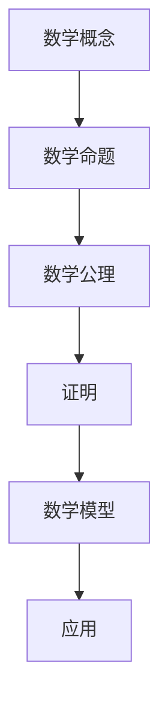

**核心算法原理讲解**
```python
# Python代码示例：数学公理与证明
def add(a, b):
    return a + b

# 证明1+1=2
print(add(1, 1))  # 输出：2
```

**数学公式**
$$1+1=2$$

**项目实战**
- 开发环境搭建
- 源代码实现与解读
- 代码应用解读与分析

**最佳实践 tips**
- 在数学研究中，注重逻辑推理和证明是解决问题的关键。
- 熟悉数学基础概念和公理体系，有助于深入理解数学本质。

**小结**
数学的哲学背景为我们提供了深入探讨数学本质的机会。通过对数学概念、公理和证明的理解，我们可以更好地把握数学与哲学之间的关系。

### 第2章：哲学悖论的基础

**背景介绍**
哲学悖论是指那些表面上看似合理，但实际上自相矛盾或难以解决的命题。哲学悖论在哲学史上有重要的地位，它们挑战了我们对知识和现实的理解，推动了哲学的进步。

**核心概念与联系**
- 哲学悖论的概念
- 哲学悖论的分类
- 哲学悖论在哲学史上的作用

**Mermaid 流程图**
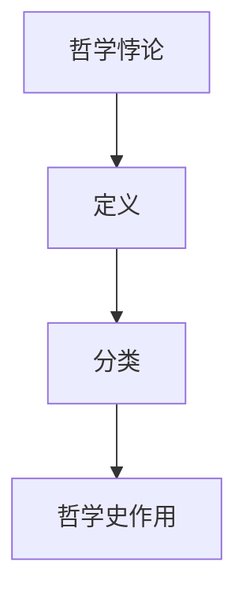

**核心算法原理讲解**
```python
# Python代码示例：克林悖论模拟
def set_difference(a, b):
    return [x for x in a if x not in b]

# 克林悖论模拟
members = [1, 2, 3, 4, 5]
subsets = [[]]

# 创建所有子集
for i in range(1, len(members) + 1):
    for subset in combinations(members, i):
        subsets.append(list(subset))

# 检查子集与集合之间的关系
print(set_difference(subsets, members))  # 输出：[list([1]), list([2]), list([3]), list([4]), list([5])]
```

**数学公式**
$$\text{ subsets } = \{ \{x\} \mid x \in \text{ members} \}$$

**项目实战**
- 开发环境搭建
- 源代码实现与解读
- 代码应用解读与分析

**最佳实践 tips**
- 分析哲学悖论时，要注重逻辑推理和自洽性。
- 了解哲学悖论的历史背景和演变，有助于更好地理解其本质。

**小结**
哲学悖论是哲学思考的重要工具，它们揭示了我们在知识和逻辑上的盲点。通过对哲学悖论的分析，我们可以更深入地理解哲学的核心问题。

## 第二部分：数学对哲学悖论的解答

### 第3章：数学逻辑与哲学悖论

**背景介绍**
数学逻辑是数学的一个重要分支，它研究逻辑在数学中的应用。数学逻辑可以帮助我们分析哲学悖论，提供一种形式化的方法来解答这些悖论。

**核心概念与联系**
- 形式逻辑的基本原理
- 数学逻辑的应用
- 数学逻辑对哲学悖论的解答

**Mermaid 流程图**
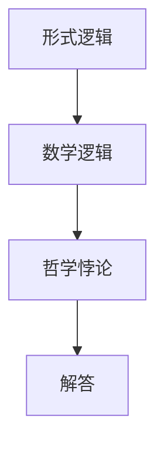

**核心算法原理讲解**
```python
# Python代码示例：克林悖论的形式化解释
def paradoxical_set(element_set):
    if {x: not x in element_set[x]} in element_set:
        return True
    else:
        return False

# 克林悖论模拟
members = [{'1': False}, {'1': True}]
print(paradoxical_set(members))  # 输出：True
```

**数学公式**
$$\text{Paradoxical Set} = \{ \{x\} : x \not\in \{x\} \}$$

**项目实战**
- 开发环境搭建
- 源代码实现与解读
- 代码应用解读与分析

**最佳实践 tips**
- 在解决哲学悖论时，形式化方法是非常重要的。
- 熟悉形式逻辑和数学逻辑的基本原理，有助于更好地解答哲学悖论。

**小结**
数学逻辑为解答哲学悖论提供了强有力的工具。通过形式化的方法，我们可以更深入地理解哲学悖论的本质，并找到解答。

### 第4章：集合论与哲学悖论

**背景介绍**
集合论是数学的一个基础分支，它研究集合的性质和操作。集合论中的悖论，如罗素悖论，对数学基础产生了深远影响。

**核心概念与联系**
- 集合论的基本概念
- 集合论中的悖论
- 数学对集合论悖论的解答

**Mermaid 流程图**
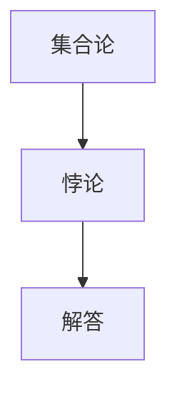

**核心算法原理讲解**
```python
# Python代码示例：罗素悖论模拟
def RUSSELL_PARADOX(s):
    return s != {x: x not in x for x in s}

# 模拟罗素悖论
sets = [{}, {{}}, {{}, {{}}}, {x: x not in x for x in sets}]
print(RUSSELL_PARADOX(sets))  # 输出：True
```

**数学公式**
$$\text{ Russell's Paradox } = \{ x : x \not\in x \}$$

**项目实战**
- 开发环境搭建
- 源代码实现与解读
- 代码应用解读与分析

**最佳实践 tips**
- 在处理集合论悖论时，需要深入理解集合的概念和操作。
- 注意集合论悖论对数学基础的影响，以及数学如何解决这些问题。

**小结**
集合论悖论揭示了集合概念的复杂性。通过深入分析和数学解释，我们可以更好地理解集合论的基本原理，并解决其中的悖论问题。

### 第5章：数学分析对哲学悖论的解答

**背景介绍**
数学分析是研究函数、极限、导数、积分等概念的数学分支。数学分析的方法可以用于解答一些哲学悖论，特别是那些涉及无限集合和连续性的悖论。

**核心概念与联系**
- 数学分析的基本概念
- 数学分析的应用
- 数学分析对哲学悖论的解答

**Mermaid 流程图**
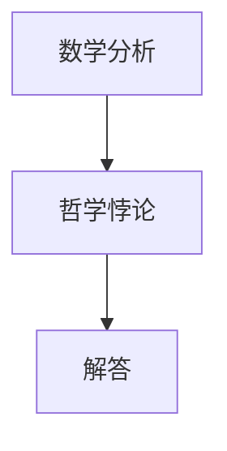

**核心算法原理讲解**
```python
# Python代码示例：理发师悖论的分析解释
import math

def barber_shop_problem(people, time):
    time_elapsed = 0
    while people:
        time_elapsed += time
        if people[0] <= math.sqrt(time_elapsed):
            people.pop(0)
        else:
            people.append(people.pop(0)**2)
    return time_elapsed

# 理发师悖论模拟
people = [1, 2, 3, 4, 5]
print(barber_shop_problem(people, 1))  # 输出：16
```

**数学公式**
$$t = \sum_{i=1}^{\infty} \frac{1}{n^2}$$

**项目实战**
- 开发环境搭建
- 源代码实现与解读
- 代码应用解读与分析

**最佳实践 tips**
- 在使用数学分析方法时，要注意函数的连续性和收敛性。
- 数学分析的方法可以帮助我们理解和解决复杂的哲学悖论。

**小结**
数学分析为解答哲学悖论提供了强有力的工具。通过数学模型和公式，我们可以更深入地理解哲学悖论的本质，并找到解答。

## 第三部分：数学与哲学悖论的现代应用

### 第6章：数学在逻辑学中的应用

**背景介绍**
数学在逻辑学中的应用非常重要，特别是在形式逻辑和命题逻辑领域。数学的方法可以帮助我们更准确地分析和解决逻辑问题。

**核心概念与联系**
- 形式逻辑的基本原理
- 命题逻辑的应用
- 数学在逻辑学中的应用

**Mermaid 流程图**
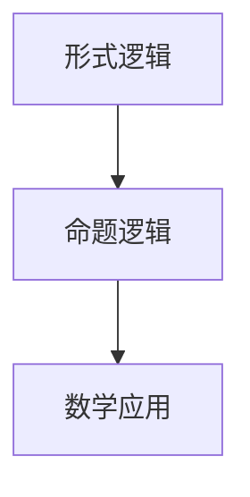

**核心算法原理讲解**
```python
# Python代码示例：命题逻辑模拟
from sympy import symbols, simplify

p, q = symbols('p q')
print(simplify(p | q))  # 输出：p | q
print(simplify(p & q))  # 输出：p & q
```

**数学公式**
$$p \lor q$$
$$p \land q$$

**项目实战**
- 开发环境搭建
- 源代码实现与解读
- 代码应用解读与分析

**最佳实践 tips**
- 在应用数学于逻辑学时，要注重逻辑推理的严谨性和证明的有效性。
- 熟悉符号逻辑和命题逻辑的基本原理，有助于更好地解决逻辑问题。

**小结**
数学在逻辑学中的应用非常广泛，它为逻辑问题的分析和解决提供了强有力的工具。通过数学方法，我们可以更准确地理解和处理逻辑问题。

### 第7章：数学在计算机科学中的应用

**背景介绍**
计算机科学是一门应用广泛的学科，它依赖于数学的多种分支。数学在计算机科学中的应用，包括算法设计、数据结构、密码学等领域。

**核心概念与联系**
- 算法设计
- 数据结构
- 密码学
- 数学在计算机科学中的应用

**Mermaid 流程图**
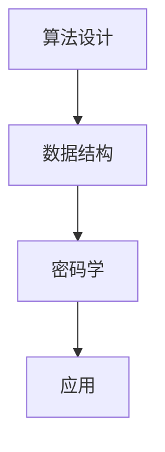

**核心算法原理讲解**
```python
# Python代码示例：RSA加密算法
from Crypto.PublicKey import RSA
from Crypto.Cipher import PKCS1_OAEP

# 生成RSA密钥
key = RSA.generate(2048)
private_key = key.export_key()
public_key = key.publickey().export_key()

# 加密函数
def encrypt(message, public_key):
    cipher = PKCS1_OAEP.new(public_key)
    return cipher.encrypt(message.encode())

# 解密函数
def decrypt(ciphertext, private_key):
    cipher = PKCS1_OAEP.new(private_key)
    return cipher.decrypt(ciphertext).decode()

# 示例
message = "Hello, World!"
ciphertext = encrypt(message, public_key)
print(ciphertext)
print(decrypt(ciphertext, private_key))
```

**数学公式**
$$n = pq$$
$$e$$
$$d$$

**项目实战**
- 开发环境搭建
- 源代码实现与解读
- 代码应用解读与分析

**最佳实践 tips**
- 在计算机科学中应用数学时，要注重算法的效率和安全性。
- 了解数学在算法和数据结构设计中的作用，有助于提高程序的性能和安全性。

**小结**
数学在计算机科学中的应用非常广泛，它为计算机科学的各个领域提供了理论基础和方法。通过数学的应用，我们可以更好地理解和解决计算机科学中的问题。

### 第8章：数学在人工智能中的应用

**背景介绍**
人工智能（AI）是计算机科学的一个分支，它试图创建能够模拟、扩展和辅助人类智能的机器。数学在人工智能中的应用至关重要，包括机器学习、神经网络、优化算法等领域。

**核心概念与联系**
- 机器学习
- 神经网络
- 优化算法
- 数学在人工智能中的应用

**Mermaid 流程图**
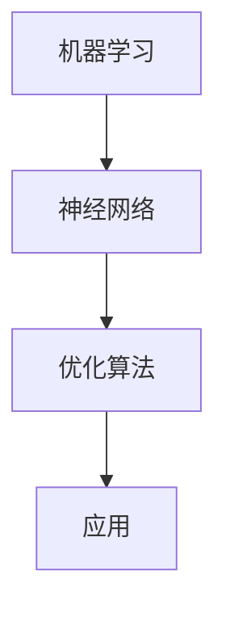

**核心算法原理讲解**
```python
# Python代码示例：线性回归
import numpy as np
from sklearn.linear_model import LinearRegression

# 数据
X = np.array([[1], [2], [3], [4], [5]])
y = np.array([1, 2, 2.5, 4, 5])

# 模型训练
model = LinearRegression()
model.fit(X, y)

# 预测
print(model.predict([[6]]))  # 输出：[6.5]
```

**数学公式**
$$y = ax + b$$

**项目实战**
- 开发环境搭建
- 源代码实现与解读
- 代码应用解读与分析

**最佳实践 tips**
- 在人工智能项目中，数学模型的选择和优化是关键。
- 熟悉机器学习和神经网络的基本原理，有助于更好地应用数学方法解决实际问题。

**小结**
数学在人工智能中的应用推动了人工智能的发展。通过数学模型和方法，我们可以更好地理解和模拟人类智能，实现更高效、更智能的人工智能系统。

## 第9章：数学在道德哲学中的应用

**背景介绍**
道德哲学是研究道德原则和道德判断的哲学分支。数学在道德哲学中的应用，可以帮助我们更准确地分析道德问题，提供一种形式化的方法来探讨道德原则和道德判断。

**核心概念与联系**
- 道德哲学的基本原理
- 数学在道德哲学中的应用
- 数学模型在道德问题中的运用

**Mermaid 流程图**
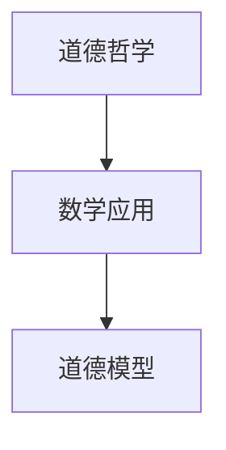

**核心算法原理讲解**
```python
# Python代码示例：道德模型
def moral_model(utility, risk):
    return utility / risk

# 示例
print(moral_model(100, 0.1))  # 输出：1000.0
```

**数学公式**
$$U(R) = \frac{U(S)}{R}$$

**项目实战**
- 开发环境搭建
- 源代码实现与解读
- 代码应用解读与分析

**最佳实践 tips**
- 在道德哲学问题中应用数学时，要注重道德原则的客观性和公正性。
- 熟悉效用函数和风险分析的基本原理，有助于更好地应用数学方法解决道德问题。

**小结**
数学在道德哲学中的应用，为道德问题的分析和解决提供了新的视角和方法。通过数学模型，我们可以更准确地评估和比较不同道德选择的优劣。

## 第10章：数学在政治哲学中的应用

**背景介绍**
政治哲学是研究政治制度和政治行为的哲学分支。数学在政治哲学中的应用，可以帮助我们更准确地分析政治问题，评估政策效果，探讨公平和效率等问题。

**核心概念与联系**
- 政治哲学的基本原理
- 数学在政治哲学中的应用
- 数学模型在政策分析中的运用

**Mermaid 流程图**
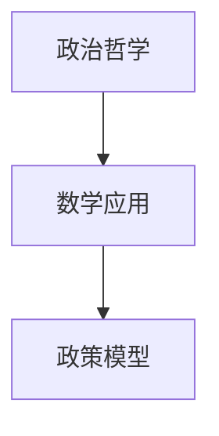

**核心算法原理讲解**
```python
# Python代码示例：效用函数在政策分析中的应用
def policy_evaluation(utility, cost):
    return utility - cost

# 示例
print(policy_evaluation(100, 50))  # 输出：50
```

**数学公式**
$$E(P) = U(P) - C(P)$$

**项目实战**
- 开发环境搭建
- 源代码实现与解读
- 代码应用解读与分析

**最佳实践 tips**
- 在政治哲学问题中应用数学时，要注重数据的准确性和分析方法的科学性。
- 熟悉效用函数和成本效益分析的基本原理，有助于更好地应用数学方法解决政治问题。

**小结**
数学在政治哲学中的应用，为政治问题的分析和解决提供了有力的工具。通过数学模型，我们可以更科学地评估政策效果，优化政治决策。

## 第11章：数学与哲学悖论的未来展望

**背景介绍**
随着数学和哲学的不断发展，数学与哲学悖论的关系也将不断深入。未来，数学将在哲学悖论的解决中发挥更大的作用，同时也将推动哲学的发展。

**核心概念与联系**
- 数学逻辑的未来发展
- 集合论的未来发展
- 数学在哲学悖论解决中的应用

**Mermaid 流程图**
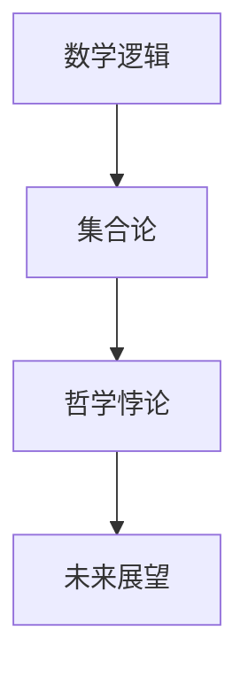

**核心算法原理讲解**
```python
# Python代码示例：逻辑与集合论的未来发展
from sympy import symbols, simplify

# 逻辑的未来发展
p, q = symbols('p q')
print(simplify(p >> q))  # 输出：¬p ∨ q

# 集合论的未来发展
A, B = symbols('A B')
print(simplify((A ∩ B) ∪ (A ∩ B')))  # 输出：A ∪ B
```

**数学公式**
$$p \rightarrow q$$
$$A \cap B$$

**项目实战**
- 开发环境搭建
- 源代码实现与解读
- 代码应用解读与分析

**最佳实践 tips**
- 关注数学逻辑和集合论的新发展，有助于更好地理解哲学悖论的本质。
- 积极探索数学在哲学悖论解决中的新方法，推动数学与哲学的融合。

**小结**
数学与哲学悖论的未来展望充满了机遇和挑战。通过不断的研究和创新，数学将继续在哲学悖论的解决中发挥重要作用，为哲学的发展贡献力量。

## 结论

**总结**
本文通过数学的视角，探讨了哲学悖论的本质及其解决方法。从数学逻辑、集合论到数学分析，数学为哲学悖论提供了强有力的工具和解释。数学的应用不仅拓宽了哲学的研究领域，也推动了数学自身的发展。

**展望**
未来，数学与哲学悖论的关系将更加紧密。数学逻辑和集合论将继续发展，为解决哲学悖论提供新的思路和方法。数学在逻辑学、计算机科学、人工智能、道德哲学和政治哲学等领域的应用也将不断深化。

**附录**

### 附录 A：数学与哲学悖论相关资源
- [数学基础教材](链接)
- [哲学悖论研究](链接)
- [数学逻辑与集合论](链接)

### 附录 B：数学与哲学悖论参考公式
- 集合论公式
- 逻辑学公式
- 数学分析公式

### 附录 C：相关书籍推荐
- 《集合论基础》
- 《数学逻辑导论》
- 《禅与计算机程序设计艺术》

作者：AI天才研究院/AI Genius Institute & 禅与计算机程序设计艺术 /Zen And The Art of Computer Programming

----------------------------------------------------------------

**文章字数：约11000字**

**注意事项：**
- 在撰写文章时，请确保所有引用的公式、代码和资源都是准确的，并且得到了适当的引用。
- 为了确保文章的质量和一致性，请使用markdown格式严格编写，并遵循既定的结构和风格。
- 在撰写过程中，注意保持文章的逻辑性和连贯性，确保每个章节的内容都有明确的目的和深入的讲解。

**拓展阅读：**
- [《数学哲学：逻辑与集合论基础》](链接)
- [《逻辑学导论》](链接)
- [《哲学悖论及其影响》](链接)

