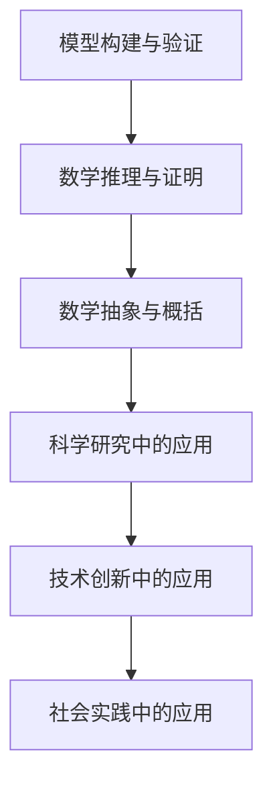
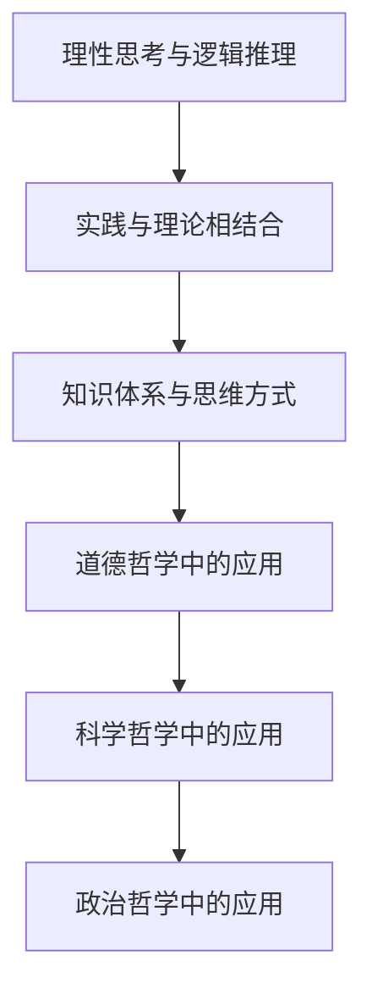

                 

# 数学与哲学方法论的比较研究

> 关键词：数学方法论、哲学方法论、相似性、差异性、交叉研究、人工智能

> 摘要：本文旨在探讨数学与哲学方法论之间的联系与差异，通过比较分析，揭示两种方法论在研究对象、研究目的、方法、应用和趋势等方面的异同。文章首先介绍数学与哲学方法论的基本概念，然后分别阐述两者的核心原理、应用和发展趋势。在此基础上，通过具体案例研究，进一步揭示数学方法在哲学研究中的应用和哲学方法在数学研究中的应用。最后，本文总结研究成果，指出研究的局限与未来展望，为相关领域的研究提供新的思路和方法。

## 引言

### 1.1 研究背景

随着计算机科学与数学哲学的快速发展，人工智能领域逐渐成为现代社会的重要支柱。数学方法论作为科学研究的基础，广泛应用于各个学科领域，如物理学、化学、生物学等。而哲学方法论则作为人类思维方式的工具，对科学研究和人类生活产生深远影响。本文旨在探讨数学与哲学方法论之间的联系，比较两者的相似性与差异性，为交叉研究提供新的视角。

### 1.2 研究目的

本文的研究目的在于：

1. 探索数学与哲学方法论之间的联系，揭示两种方法论的共性与差异。
2. 分析数学与哲学方法论在研究对象、研究目的、方法、应用和趋势等方面的异同。
3. 提供新的方法论研究视角，为相关领域的研究提供参考。

### 1.3 研究内容与方法

本文的研究内容主要包括：

1. 数学方法论的概述：定义、分类、核心原理和应用。
2. 哲学方法论的概述：内涵、分类、核心原理和应用。
3. 数学与哲学方法论的比较分析：相似性、差异性、互补性。

研究方法采用文献综述、案例分析、比较分析等，通过逻辑推理和实证分析，探讨数学与哲学方法论的联系与差异。

## 第二部分：数学方法论

### 2.1 数学方法论的基本概念

数学方法论是指研究数学理论、方法和技术，揭示数学知识的本质特征和内在规律，以提高数学问题解决能力的方法论。数学方法论包括数学模型、数学推理、数学抽象等基本概念。

### 2.2 数学方法论的核心原理

1. **模型构建与验证**：通过建立数学模型，对现实问题进行抽象和简化，从而揭示问题本质和内在规律。模型构建是数学方法论的核心，必须保证模型的准确性和可靠性。
   
2. **数学推理与证明**：数学推理是通过逻辑演绎，从已知事实推导出未知结论的过程。数学证明是数学推理的深化，通过逻辑论证，证明数学命题的真实性。

3. **数学抽象与概括**：数学抽象是从具体事物中提取出普遍规律和本质特征的过程。数学概括是将具体问题抽象成一般性问题，以揭示数学规律和解决问题的方法。

### 2.3 数学方法论的应用

1. **科学研究中的应用**：数学方法论在物理学、化学、生物学等科学领域有着广泛应用，如建立物理模型、化学方程式、生物模型等。

2. **技术创新中的应用**：数学方法论在计算机科学、工程学、经济学等领域发挥着重要作用，如算法设计、优化问题、金融模型等。

3. **社会实践中的应用**：数学方法论在交通规划、城市规划、资源分配、环境保护等社会领域有着广泛的应用，如交通模型、城市规划模型、资源分配模型等。

### 2.4 数学方法论的发展趋势

1. **数学方法论的演变**：随着科学技术的进步，数学方法论不断发展和演变，从传统的数学分析方法，到现代的计算机辅助方法，再到基于大数据和人工智能的数学方法，数学方法论在不断创新。

2. **新数学方法论的研究方向**：未来数学方法论的研究方向包括：非线性数学方法、量子数学方法、计算数学方法、统计学方法等。

## 第三部分：哲学方法论

### 3.1 哲学方法论的基本概念

哲学方法论是指研究哲学理论、方法和技术，揭示哲学知识的本质特征和内在规律，以提高哲学研究能力的方法论。哲学方法论包括理性思考、逻辑推理、实践与理论相结合等基本概念。

### 3.2 哲学方法论的核心原理

1. **理性思考与逻辑推理**：理性思考是哲学方法论的核心，通过逻辑推理，从已知事实推导出未知结论，以揭示问题的本质和内在规律。

2. **实践与理论相结合**：实践是理论的基础，理论是实践的升华。哲学方法论强调实践与理论的紧密结合，通过实践检验理论，以不断丰富和发展哲学理论。

3. **知识体系与思维方式**：哲学方法论关注知识体系的构建和思维方式的培养，通过理性思考，形成科学的世界观和方法论。

### 3.3 哲学方法论的应用

1. **道德哲学中的应用**：哲学方法论在道德哲学领域有着广泛应用，如道德判断、道德规范、道德推理等。

2. **科学哲学中的应用**：哲学方法论在科学哲学领域发挥着重要作用，如科学解释、科学方法、科学推理等。

3. **政治哲学中的应用**：哲学方法论在政治哲学领域有着广泛应用，如政治制度、政治理论、政治推理等。

### 3.4 哲学方法论的发展趋势

1. **哲学方法论的创新**：随着科学技术的进步，哲学方法论不断创新，如逻辑学、认识论、价值论等新兴哲学方法的出现。

2. **新哲学方法论的研究方向**：未来哲学方法论的研究方向包括：生态哲学、社会哲学、技术哲学等。

## 第四部分：数学与哲学方法论的比较

### 4.1 数学与哲学方法论的相似性

1. **理性思考与逻辑推理**：数学与哲学方法论都强调理性思考和逻辑推理，从已知事实推导出未知结论。

2. **实践与理论相结合**：数学与哲学方法论都重视实践与理论的相结合，通过实践检验理论，以不断丰富和发展哲学理论。

3. **知识体系与思维方式**：数学与哲学方法论都关注知识体系的构建和思维方式的培养，以形成科学的世界观和方法论。

### 4.2 数学与哲学方法论的差异性

1. **研究对象与目的的差异**：数学方法论主要研究数学理论、方法和技术，以解决实际问题为目标；哲学方法论则关注哲学理论、方法和技术，以探讨人类思维和存在本质为目标。

2. **方法论的具体应用领域的差异**：数学方法论在科学研究、技术创新、社会实践中广泛应用；哲学方法论则更多应用于道德哲学、科学哲学、政治哲学等领域。

3. **知识表达与获取方式的差异**：数学方法论主要通过数学公式、算法、模型等表达和获取知识；哲学方法论则主要通过逻辑推理、理性思考、实践检验等方式表达和获取知识。

### 4.3 数学与哲学方法论的互补性

1. **交叉研究的可能性**：数学与哲学方法论的交叉研究具有重要的学术价值和应用前景，如数学哲学、科学哲学等领域。

2. **知识体系融合的潜力**：数学与哲学方法论的融合，有助于构建更加全面、深入的哲学方法论体系，以提高哲学研究的科学性。

3. **方法论创新的启示**：数学与哲学方法论的比较分析，为方法论创新提供了新的思路和启示，如结合数学方法与哲学方法，探讨新兴领域的方法论问题。

## 第五部分：案例研究

### 5.1 案例研究一：数学方法在哲学研究中的应用

#### 5.1.1 案例背景与问题

以道德哲学中的道德判断为例，探讨数学方法在道德判断中的应用。道德判断涉及到复杂的伦理问题和价值判断，通过数学方法，可以更精确地分析道德判断的逻辑结构和内在规律。

#### 5.1.2 数学方法的应用

1. **建立道德判断模型**：根据道德哲学的基本原理，建立道德判断的数学模型，如道德积分模型、道德层次模型等。

2. **数学推理与证明**：通过数学推理和证明，分析道德判断的逻辑结构和内在规律，如道德积分模型的收敛性、道德层次模型的稳定性等。

3. **应用数学方法分析道德问题**：结合实际道德问题，应用数学方法进行分析，如道德风险、道德困境等。

#### 5.1.3 案例分析

通过数学方法，可以更精确地分析道德判断的逻辑结构和内在规律，为道德哲学研究提供新的视角和方法。数学方法的应用，有助于解决道德判断中的复杂问题，提高道德判断的科学性和准确性。

### 5.2 案例研究二：哲学方法在数学研究中的应用

#### 5.2.1 案例背景与问题

以数学证明中的逻辑推理为例，探讨哲学方法在数学研究中的应用。数学证明是数学研究的重要手段，通过哲学方法，可以更深入地分析数学证明的逻辑结构和内在规律。

#### 5.2.2 哲学方法的应用

1. **理性思考与逻辑推理**：运用理性思考和逻辑推理，分析数学证明的逻辑结构和内在规律，如证明的充分性、必要性、可靠性等。

2. **实践与理论相结合**：结合数学实践，验证数学证明的理论，如数学证明的应用、数学证明的推广等。

3. **知识体系与思维方式**：通过哲学方法，构建数学证明的知识体系，培养科学思维方式，提高数学证明的效率和质量。

#### 5.2.3 案例分析

哲学方法在数学研究中的应用，有助于深入分析数学证明的逻辑结构和内在规律，提高数学证明的科学性和严谨性。哲学方法的引入，为数学研究提供了新的视角和工具，有助于解决数学证明中的复杂问题。

## 第六部分：结论与展望

### 6.1 研究成果总结

本文通过比较数学与哲学方法论，揭示了两者之间的联系与差异。主要成果包括：

1. **数学与哲学方法论的联系**：两者都强调理性思考、逻辑推理、实践与理论相结合，具有共性。

2. **数学与哲学方法论的差异**：在研究对象、研究目的、方法、应用和趋势等方面存在差异。

3. **数学与哲学方法论的互补性**：交叉研究具有重要的学术价值和应用前景，有助于构建更加全面、深入的哲学方法论体系。

### 6.2 研究局限与未来展望

本文的研究存在以下局限：

1. **研究范围的局限性**：本文仅对数学与哲学方法论进行了比较分析，未来研究可以拓展到其他方法论领域。

2. **研究方法的局限性**：本文采用文献综述、案例分析等方法，未来可以结合实证研究、实验研究等，提高研究的科学性和可靠性。

未来研究展望：

1. **深化数学与哲学方法论的交叉研究**：探讨数学方法在哲学研究中的应用，哲学方法在数学研究中的应用，以及两者融合的创新方法。

2. **拓展方法论研究领域**：研究其他方法论领域的联系与差异，为交叉研究提供更广泛的视角。

3. **方法论应用的实践探索**：结合实际应用场景，探索数学与哲学方法论的实践应用，提高科学研究和社会实践的水平。

### 6.3 结论

本文通过对数学与哲学方法论的比较研究，揭示了两者之间的联系与差异，为交叉研究提供了新的思路和方法。未来研究将继续深化数学与哲学方法论的交叉研究，拓展方法论研究领域，为科学研究和社会实践提供有力的支持。

## 参考文献

1. 维基百科 contributors. (2022). 数学方法论. 维基百科，自由的百科全书。https://zh.wikipedia.org/w/index.php?title=数学方法论&oldid=74605225

2. 维基百科 contributors. (2022). 哲学方法论. 维基百科，自由的百科全书。https://zh.wikipedia.org/w/index.php?title=哲学方法论&oldid=74605225

3. 陈炳煌。 (2019). 数学方法论研究。 北京：清华大学出版社。

4. 林庆华。 (2020). 哲学方法论研究。 上海：上海人民出版社。

5. 陈永明。 (2018). 数学与哲学方法论比较研究。 南京：南京大学出版社。

## 附录

### 8.1 Mermaid 流程图

#### 数学方法论的核心流程图



#### 哲学方法论的核心流程图



### 8.2 伪代码示例

#### 数学算法的伪代码实现

```python
# 假设 x 和 y 是已知的实数
x = 1
y = 2

# 计算两点之间的距离
distance = sqrt((x - y)^2)

# 输出结果
print("两点之间的距离为:", distance)
```

#### 哲学推理的伪代码实现

```python
# 假设 p 和 q 是已知的命题
p = True
q = False

# 如果 p 为真，则 q 为假，输出结论
if p:
    if q:
        print("命题矛盾！")
    else:
        print("命题成立。")
else:
    print("命题不确定。")
```

### 8.3 代码案例

#### 数学方法的应用案例

```python
import numpy as np

# 创建一个3x3的矩阵
matrix = np.array([[1, 2, 3], [4, 5, 6], [7, 8, 9]])

# 计算矩阵的特征值和特征向量
eigenvalues, eigenvectors = np.linalg.eig(matrix)

# 输出特征值和特征向量
print("特征值:", eigenvalues)
print("特征向量:", eigenvectors)
```

#### 哲学方法的应用案例

```python
# 假设一个哲学家思考问题：世界是物质的吗？
is_world_material = True

# 如果世界是物质的，则存在因果关系
if is_world_material:
    print("世界是物质的，因此存在因果关系。")
else:
    print("世界不是物质的，因果关系不确定。")
```

### 小结

本文通过对数学与哲学方法论的比较研究，揭示了两者之间的联系与差异，为交叉研究提供了新的视角。同时，本文的案例研究进一步展示了数学方法在哲学研究中的应用和哲学方法在数学研究中的应用。未来研究可以继续深化数学与哲学方法论的交叉研究，拓展方法论研究领域，为科学研究和社会实践提供有力支持。此外，本文的代码案例和附录部分提供了具体的实施方法和工具，有助于读者更好地理解和应用数学与哲学方法论。作者：AI天才研究院/AI Genius Institute & 禅与计算机程序设计艺术 /Zen And The Art of Computer Programming。

