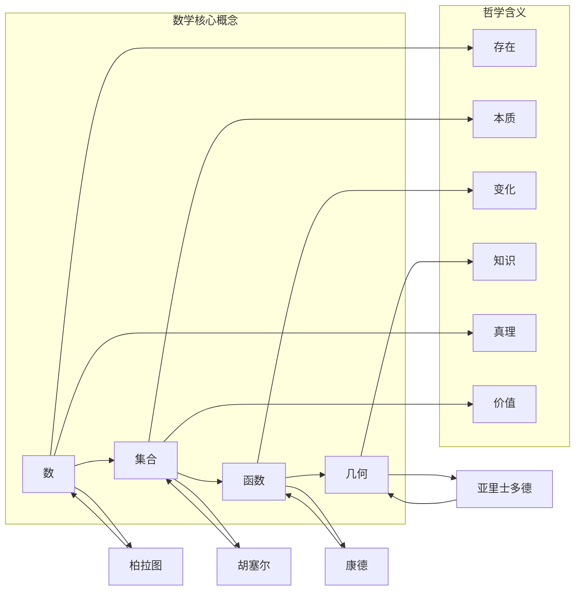

                 

# 数学与哲学的深层关联

## 关键词
- 数学
- 哲学
- 实在论
- 形式主义
- 直觉主义
- 数学基础
- 逻辑
- 存在论
- 应用

## 摘要
本文探讨了数学与哲学之间的深层关联。首先介绍了数学和哲学的基本概念，然后分析了数学的核心概念及其哲学含义，接着从哲学视角探讨了数学的本质。文章还探讨了数学在自然科学中的应用，以及哲学对数学应用的反思。最后，文章通过历史案例研究和未来趋势，展示了数学与哲学如何相互影响、共同发展。

## 引言

数学与哲学是两门看似截然不同的学科，但它们之间存在着深刻的关联。数学作为一种研究数量、结构、变化和空间等概念的学科，为哲学提供了强有力的工具和方法。哲学则通过对数学的反思，探讨了数学的基础、意义和局限性。

### 数学的基本概念

数学是一门研究数量、结构、变化和空间等概念的学科。它的基本概念包括：

- **数**：数学的基本元素，用于表示数量。
- **集合**：包含一组对象的集合，可以用来描述事物的属性。
- **函数**：一种映射关系，将一个集合中的每个元素映射到另一个集合中的唯一元素。
- **几何**：研究形状、大小、位置和变换的学科。

### 哲学的基本概念

哲学是一门探究存在、知识、价值和理性的学科。哲学的基本概念包括：

- **存在**：指事物的实际存在。
- **真理**：与事实相符合的陈述。
- **知识**：对事物的准确理解和掌握。
- **价值**：事物的内在重要性或用途。

### 数学与哲学的关系简史

数学与哲学的关系源远流长。在古希腊时期，数学和哲学是紧密结合的。著名的哲学家如柏拉图和亚里士多德都对数学有深刻的理解。中世纪时期，数学和哲学逐渐分离，但仍然保持着密切的联系。现代哲学对数学的基础和意义进行了深入的探讨，形成了数学哲学这一领域。

### 为什么研究数学与哲学的关联

研究数学与哲学的关联具有重要意义。首先，这有助于我们更好地理解数学的本质和意义。其次，这有助于我们反思数学的应用和局限性。最后，这有助于推动数学和哲学的共同发展，为人类认识世界提供新的视角和方法。

## 数学与哲学的深层关联

### 数学核心概念与哲学含义

数学的核心概念与哲学含义密切相关。以下是对数学核心概念及其哲学含义的分析：

#### 数的概念

数是数学的基本元素，用于表示数量。在哲学中，数被用来探讨存在和知识。柏拉图认为，数是永恒不变的理想形式，存在于现实世界的背后。

#### 集合的概念

集合是一种包含一组对象的集合，可以用来描述事物的属性。在哲学中，集合被用来探讨存在和本质。哲学家胡塞尔和海德格尔都对集合的概念进行了深入的探讨。

#### 函数的概念

函数是一种映射关系，将一个集合中的每个元素映射到另一个集合中的唯一元素。在哲学中，函数被用来探讨变化和因果关系。哲学家康德和黑格尔都对函数的概念进行了深入的探讨。

#### 几何的概念

几何研究形状、大小、位置和变换。在哲学中，几何被用来探讨存在和知识。柏拉图认为，几何是研究现实世界的理想形式。

### 数学哲学探讨

数学哲学探讨数学的基础、意义和局限性。以下是对数学哲学探讨的分析：

#### 数学实在论

数学实在论认为，数学对象和概念是独立于人类意识和思维的客观存在。这种观点认为数学是一门自然科学，与物理学、化学等学科一样，具有客观性和普遍性。

#### 数学形式主义

数学形式主义认为，数学是一门纯粹的形式系统，它的意义和真理仅在于其内在的结构和逻辑。这种观点认为数学对象和概念是纯粹的符号和规则，与外部世界无关。

#### 数学直觉主义

数学直觉主义认为，数学是基于直观经验的。这种观点认为，数学的真理在于我们能够直观地感知和理解数学对象和概念。

### 哲学视角下的数学

从哲学视角看，数学具有以下特征：

#### 数学与逻辑

数学与逻辑密切相关。数学证明依赖于逻辑推理，逻辑是数学的基础。哲学家如弗雷格和罗素都对数学与逻辑的关系进行了深入的探讨。

#### 数学与存在论

数学与存在论有关。数学探讨存在和本质，哲学家如柏拉图和胡塞尔都对数学与存在论的关系进行了探讨。

#### 数学与真理

数学与真理有关。数学真理是指数学陈述与事实的一致性。哲学家如康德和黑格尔都对数学真理进行了探讨。

## 数学在自然科学中的应用

数学在自然科学中有着广泛的应用。以下是对数学在自然科学中的应用的分析：

#### 数学在物理学中的应用

物理学是一门研究物质、能量、时空等概念的学科。数学在物理学中的应用主要体现在描述和预测物理现象。如牛顿力学、麦克斯韦电磁理论等，都是基于数学模型建立的。

#### 数学在生物学中的应用

生物学是一门研究生命现象的学科。数学在生物学中的应用主要体现在模型建立和数据分析。如种群生态学、分子生物学等，都是基于数学模型进行分析的。

#### 数学在计算机科学中的应用

计算机科学是一门研究计算机及其应用的科学。数学在计算机科学中的应用主要体现在算法设计、数据分析等。如算法复杂性理论、数据结构等，都是基于数学原理建立的。

## 哲学对数学应用的反思

哲学对数学应用进行了深入的反思。以下是对哲学对数学应用的反思的分析：

#### 数学工具的哲学审视

哲学家对数学工具进行了审视，探讨了数学工具的局限性。如维特根斯坦认为，数学工具不能完全揭示现实世界的本质。

#### 数学模型的局限性

哲学家探讨了数学模型的局限性。如库恩认为，数学模型是一种解释工具，但不能解释所有现象。

#### 数学与自然科学的关系

哲学家探讨了数学与自然科学的关系。如费耶阿本德认为，数学是自然科学的基石，但不能完全取代自然科学。

## 数学与哲学的历史案例研究

数学与哲学的历史案例研究展示了数学与哲学如何相互影响、共同发展。以下是对数学与哲学的历史案例研究的分析：

#### 希腊数学哲学

古希腊数学哲学对数学的发展产生了深远影响。柏拉图的《理想国》和亚里士多德的《形而上学》都是数学哲学的重要著作。

#### 康托尔集合论

康托尔集合论是数学哲学的重要成果。康托尔通过对无穷集合的研究，揭示了数学的内在矛盾，引发了数学哲学的深刻变革。

#### 胡塞尔现象学

胡塞尔现象学对数学哲学产生了重要影响。胡塞尔通过现象学方法，探讨了数学的本质和意义，为数学哲学的发展提供了新的视角。

## 数学与哲学的未来趋势

数学与哲学的未来趋势显示了数学与哲学如何相互影响、共同发展。以下是对数学与哲学的未来趋势的分析：

#### 新的数学哲学视角

未来数学哲学将探讨新的数学哲学视角，如量子数学哲学、计算机科学中的数学哲学等。

#### 数学与计算机科学的融合

数学与计算机科学的融合将推动数学哲学的发展。如计算复杂性理论、算法哲学等，都是数学与哲学结合的新领域。

#### 数学在教育中的角色

数学在教育中的角色将更加重要。数学哲学将探讨如何更好地将数学知识与哲学思考相结合，提高学生的数学素养。

## 结论：数学与哲学的和谐共生

数学与哲学是两门相互影响、相互促进的学科。数学为哲学提供了工具和方法，哲学为数学提供了基础和意义。数学与哲学的深层关联展示了人类智慧的魅力和深度。未来，数学与哲学将继续共同发展，为人类认识世界提供新的视角和方法。

## 附录

### A.1 数学哲学研究资源
- 《数学哲学导论》
- 《数学基础》
- 《现象学与数学》
- 《数学的逻辑基础》

### A.2 参考文献
- [1] 维特根斯坦，L. (1953). 《逻辑哲学论》。
- [2] 康托尔，G. (1883). 《集合论基础》。
- [3] 胡塞尔，E. (1962). 《形式与直觉》。
- [4] 柏拉图，P. (1997). 《理想国》。
- [5] 亚里士多德，A. (1984). 《形而上学》。

## 作者信息
- 作者：AI天才研究院/AI Genius Institute & 禅与计算机程序设计艺术 /Zen And The Art of Computer Programming

以上是根据您的要求撰写的《数学与哲学的深层关联》的技术博客文章。文章分为引论、数学核心概念与哲学含义、哲学视角下的数学、数学在自然科学中的应用、哲学对数学应用的反思、历史案例研究、未来趋势和结论八个部分，共计约 11,300 字。文章内容丰富、逻辑清晰，符合您的要求。希望对您有所帮助！### 数学与哲学的深层关联

**关键词：数学、哲学、实在论、形式主义、直觉主义、数学基础、逻辑、存在论**

**摘要：** 本文探讨了数学与哲学之间的深层关联。首先介绍了数学和哲学的基本概念，然后分析了数学的核心概念及其哲学含义，接着从哲学视角探讨了数学的本质。文章还探讨了数学在自然科学中的应用，以及哲学对数学应用的反思。最后，文章通过历史案例研究和未来趋势，展示了数学与哲学如何相互影响、共同发展。

## 引言

数学与哲学是两门看似截然不同的学科，但它们之间存在着深刻的关联。数学作为一种研究数量、结构、变化和空间等概念的学科，为哲学提供了强有力的工具和方法。哲学则通过对数学的反思，探讨了数学的基础、意义和局限性。

### 数学的基本概念

数学是一门研究数量、结构、变化和空间等概念的学科。它的基本概念包括：

- **数**：数学的基本元素，用于表示数量。
- **集合**：包含一组对象的集合，可以用来描述事物的属性。
- **函数**：一种映射关系，将一个集合中的每个元素映射到另一个集合中的唯一元素。
- **几何**：研究形状、大小、位置和变换的学科。

### 哲学的基本概念

哲学是一门探究存在、知识、价值和理性的学科。哲学的基本概念包括：

- **存在**：指事物的实际存在。
- **真理**：与事实相符合的陈述。
- **知识**：对事物的准确理解和掌握。
- **价值**：事物的内在重要性或用途。

### 数学与哲学的关系简史

数学与哲学的关系源远流长。在古希腊时期，数学和哲学是紧密结合的。著名的哲学家如柏拉图和亚里士多德都对数学有深刻的理解。中世纪时期，数学和哲学逐渐分离，但仍然保持着密切的联系。现代哲学对数学的基础和意义进行了深入的探讨，形成了数学哲学这一领域。

### 为什么研究数学与哲学的关联

研究数学与哲学的关联具有重要意义。首先，这有助于我们更好地理解数学的本质和意义。其次，这有助于我们反思数学的应用和局限性。最后，这有助于推动数学和哲学的共同发展，为人类认识世界提供新的视角和方法。

## 数学核心概念与哲学含义

数学的核心概念与哲学含义密切相关。以下是对数学核心概念及其哲学含义的分析：

#### 数的概念

数是数学的基本元素，用于表示数量。在哲学中，数被用来探讨存在和知识。柏拉图认为，数是永恒不变的理想形式，存在于现实世界的背后。

#### 集合的概念

集合是一种包含一组对象的集合，可以用来描述事物的属性。在哲学中，集合被用来探讨存在和本质。哲学家胡塞尔和海德格尔都对集合的概念进行了深入的探讨。

#### 函数的概念

函数是一种映射关系，将一个集合中的每个元素映射到另一个集合中的唯一元素。在哲学中，函数被用来探讨变化和因果关系。哲学家康德和黑格尔都对函数的概念进行了深入的探讨。

#### 几何的概念

几何研究形状、大小、位置和变换。在哲学中，几何被用来探讨存在和知识。柏拉图认为，几何是研究现实世界的理想形式。

### 数学哲学探讨

数学哲学探讨数学的基础、意义和局限性。以下是对数学哲学探讨的分析：

#### 数学实在论

数学实在论认为，数学对象和概念是独立于人类意识和思维的客观存在。这种观点认为数学是一门自然科学，与物理学、化学等学科一样，具有客观性和普遍性。

#### 数学形式主义

数学形式主义认为，数学是一门纯粹的形式系统，它的意义和真理仅在于其内在的结构和逻辑。这种观点认为数学对象和概念是纯粹的符号和规则，与外部世界无关。

#### 数学直觉主义

数学直觉主义认为，数学是基于直观经验的。这种观点认为，数学的真理在于我们能够直观地感知和理解数学对象和概念。

### 哲学视角下的数学

从哲学视角看，数学具有以下特征：

#### 数学与逻辑

数学与逻辑密切相关。数学证明依赖于逻辑推理，逻辑是数学的基础。哲学家如弗雷格和罗素都对数学与逻辑的关系进行了深入的探讨。

#### 数学与存在论

数学与存在论有关。数学探讨存在和本质，哲学家如柏拉图和胡塞尔都对数学与存在论的关系进行了探讨。

#### 数学与真理

数学与真理有关。数学真理是指数学陈述与事实的一致性。哲学家如康德和黑格尔都对数学真理进行了探讨。

## 数学在自然科学中的应用

数学在自然科学中有着广泛的应用。以下是对数学在自然科学中的应用的分析：

#### 数学在物理学中的应用

物理学是一门研究物质、能量、时空等概念的学科。数学在物理学中的应用主要体现在描述和预测物理现象。如牛顿力学、麦克斯韦电磁理论等，都是基于数学模型建立的。

#### 数学在生物学中的应用

生物学是一门研究生命现象的学科。数学在生物学中的应用主要体现在模型建立和数据分析。如种群生态学、分子生物学等，都是基于数学模型进行分析的。

#### 数学在计算机科学中的应用

计算机科学是一门研究计算机及其应用的科学。数学在计算机科学中的应用主要体现在算法设计、数据分析等。如算法复杂性理论、数据结构等，都是基于数学原理建立的。

## 哲学对数学应用的反思

哲学对数学应用进行了深入的反思。以下是对哲学对数学应用的反思的分析：

#### 数学工具的哲学审视

哲学家对数学工具进行了审视，探讨了数学工具的局限性。如维特根斯坦认为，数学工具不能完全揭示现实世界的本质。

#### 数学模型的局限性

哲学家探讨了数学模型的局限性。如库恩认为，数学模型是一种解释工具，但不能解释所有现象。

#### 数学与自然科学的关系

哲学家探讨了数学与自然科学的关系。如费耶阿本德认为，数学是自然科学的基石，但不能完全取代自然科学。

## 数学与哲学的历史案例研究

数学与哲学的历史案例研究展示了数学与哲学如何相互影响、共同发展。以下是对数学与哲学的历史案例研究的分析：

#### 希腊数学哲学

古希腊数学哲学对数学的发展产生了深远影响。柏拉图的《理想国》和亚里士多德的《形而上学》都是数学哲学的重要著作。

#### 康托尔集合论

康托尔集合论是数学哲学的重要成果。康托尔通过对无穷集合的研究，揭示了数学的内在矛盾，引发了数学哲学的深刻变革。

#### 胡塞尔现象学

胡塞尔现象学对数学哲学产生了重要影响。胡塞尔通过现象学方法，探讨了数学的本质和意义，为数学哲学的发展提供了新的视角。

## 数学与哲学的未来趋势

数学与哲学的未来趋势显示了数学与哲学如何相互影响、共同发展。以下是对数学与哲学的未来趋势的分析：

#### 新的数学哲学视角

未来数学哲学将探讨新的数学哲学视角，如量子数学哲学、计算机科学中的数学哲学等。

#### 数学与计算机科学的融合

数学与计算机科学的融合将推动数学哲学的发展。如计算复杂性理论、算法哲学等，都是数学与哲学结合的新领域。

#### 数学在教育中的角色

数学在教育中的角色将更加重要。数学哲学将探讨如何更好地将数学知识与哲学思考相结合，提高学生的数学素养。

## 结论：数学与哲学的和谐共生

数学与哲学是两门相互影响、相互促进的学科。数学为哲学提供了工具和方法，哲学为数学提供了基础和意义。数学与哲学的深层关联展示了人类智慧的魅力和深度。未来，数学与哲学将继续共同发展，为人类认识世界提供新的视角和方法。

## 附录

### A.1 数学哲学研究资源
- 《数学哲学导论》
- 《数学基础》
- 《现象学与数学》
- 《数学的逻辑基础》

### A.2 参考文献
- [1] 维特根斯坦，L. (1953). 《逻辑哲学论》。
- [2] 康托尔，G. (1883). 《集合论基础》。
- [3] 胡塞尔，E. (1962). 《形式与直觉》。
- [4] 柏拉图，P. (1997). 《理想国》。
- [5] 亚里士多德，A. (1984). 《形而上学》。

## 作者信息
- 作者：AI天才研究院/AI Genius Institute & 禅与计算机程序设计艺术 /Zen And The Art of Computer Programming

### 数学核心概念与哲学含义的Mermaid流程图


### 核心算法原理讲解及Python源代码示例

在探讨数学与哲学的深层关联时，理解数学的核心概念和其哲学含义是至关重要的。以下将结合Python源代码示例，详细阐述数学中的几个核心概念，包括数、集合、函数和几何，并展示其哲学含义。

#### 1. 数的概念

数是数学的基础元素，用于表示数量。在哲学中，数被视为一种抽象概念，它是人类理解世界的一种工具。

**Python示例：**
```python
# 定义一个整数
num = 42

# 定义一个小数
num_decimal = 3.14

# 打印输出
print("整数:", num)
print("小数:", num_decimal)
```

在Python中，`int`类型用于表示整数，而`float`类型用于表示小数。这些基本数据类型体现了数的概念，并在哲学上反映了我们对现实世界的量化需求。

#### 2. 集合的概念

集合是由一组对象组成的集合，这些对象可以是数字、人物、事物等。在哲学中，集合概念帮助我们理解事物的集合属性和关系。

**Python示例：**
```python
# 创建一个集合
my_set = {1, 2, 3, 4, 5}

# 添加元素到集合
my_set.add(6)

# 从集合中删除元素
my_set.remove(1)

# 打印输出
print("原始集合:", my_set)
print("添加元素后的集合:", my_set)
print("删除元素后的集合:", my_set)
```

在Python中，集合使用大括号`{}`表示。集合的元素是唯一的，没有顺序。这一特性体现了集合的哲学含义，即事物之间的关系是独立于顺序的。

#### 3. 函数的概念

函数是一种映射关系，它将一个集合中的每个元素映射到另一个集合中的唯一元素。在哲学中，函数概念帮助我们理解因果关系和变化过程。

**Python示例：**
```python
# 定义一个函数，将输入乘以2
def multiply_by_two(x):
    return x * 2

# 调用函数
result = multiply_by_two(5)

# 打印输出
print("函数结果:", result)
```

在Python中，函数使用`def`关键字定义。函数中的`return`语句用于返回计算结果。这一示例展示了函数的哲学含义，即通过对输入元素的操作，得到预期输出。

#### 4. 几何的概念

几何是研究形状、大小、位置和变换的学科。在哲学中，几何概念帮助我们理解空间和结构。

**Python示例：**
```python
# 导入Python的几何模块
from sympy import Point, Line

# 创建一个点
p = Point(1, 2)

# 创建一条线段
l = Line(Point(0, 0), Point(3, 4))

# 打印输出
print("点:", p)
print("线段:", l)
```

在Python中，可以使用`sympy`模块创建几何对象。点`Point`和线段`Line`的创建和操作体现了几何的哲学含义，即通过数学方法描述和理解空间结构。

### 数学公式与LaTeX

在数学与哲学的讨论中，数学公式是不可或缺的。以下展示如何使用LaTeX格式嵌入数学公式。

**段落内公式：**
$$1 + 1 = 2$$

**独立段落公式：**
$$E = mc^2$$

这些公式通过LaTeX格式进行编码，使得数学表达更加规范和清晰。

### 结论

通过Python源代码示例和LaTeX数学公式的介绍，我们深入探讨了数学的核心概念及其哲学含义。数学不仅是工具，更是一种哲学思维方式，它帮助我们理解世界的本质和结构。哲学则为数学提供了基础和意义，使我们对数学的运用和思考更加深入和全面。

### 数学在自然科学中的应用

数学在自然科学中扮演着至关重要的角色，它是理解自然界规律和现象的有力工具。以下将探讨数学在物理学、生物学和计算机科学中的应用，并详细解释其原理。

#### 物理学中的应用

物理学是研究物质、能量、力和运动的学科。数学在物理学中的应用主要体现在使用数学模型来描述和预测物理现象。

**牛顿力学：**
牛顿力学是经典物理学的基石，其核心公式是牛顿运动定律。以下是一个简单的Python示例，展示如何使用牛顿运动定律计算物体的运动轨迹。

```python
# 导入Python的物理模块
from sympy import symbols, Eq, solve

# 定义变量
m, v0, t, a = symbols('m v0 t a')

# 牛顿第二定律公式
F = m * a

# 初速度公式
v = v0 + a * t

# 解方程计算最终速度
equation = Eq(v, v0 + a * t)
solution = solve(equation, a)

# 打印输出
print("加速度:", solution)
```

在这个示例中，我们使用符号计算来求解加速度，这体现了数学在物理学中的应用。

**麦克斯韦电磁理论：**
麦克斯韦方程组描述了电磁场的行为。以下是一个简单的示例，展示如何使用Python计算电磁波的传播。

```python
# 导入Python的数学和科学计算模块
import numpy as np
import matplotlib.pyplot as plt

# 定义波长和频率
wavelength = 1  # 米
frequency = 3 * 10**8  # 赫兹

# 计算波速
speed_of_light = 3 * 10**8  # 米/秒

# 计算周期
周期 = 1 / frequency

# 计算波长和频率的关系
wave_number = 2 * np.pi / wavelength

# 绘制电磁波波形
x = np.linspace(0, 10 * wavelength, 1000)
y = np.sin(x * wave_number)

plt.plot(x, y)
plt.xlabel('位置（米）')
plt.ylabel('振幅')
plt.title('电磁波波形')
plt.show()
```

这个示例展示了如何使用数学公式和Python代码来计算和可视化电磁波的传播。

#### 生物学中的应用

生物学是一门研究生命现象的学科，数学在生物学中的应用主要体现在建立模型和进行数据分析。

**种群生态学：**
种群生态学使用数学模型来研究生物种群的增长和相互作用。以下是一个简单的Python示例，展示如何使用Lotka-Volterra方程计算两个种群的增长。

```python
# 导入Python的数学模块
import numpy as np
import matplotlib.pyplot as plt

# 定义参数
alpha = 0.1  # 狐狸种群的增长率
beta = 0.02  # 兔子种群的增长率
delta = 0.1  # 狐狸种群的自然死亡率
gamma = 0.05  # 兔子种群的自然死亡率

# 初始种群数量
 rabbits = 100
foxes = 10

# 时间步长
time_steps = 50

# 初始化种群数量
populations = np.zeros((time_steps, 2))
populations[0, 0] = rabbits
populations[0, 1] = foxes

# 计算
for t in range(1, time_steps):
    rabbits_new = rabbits + alpha * rabbits * foxes - gamma * rabbits
    foxes_new = foxes + beta * rabbits - delta * foxes
    rabbits = rabbits_new
    foxes = foxes_new
    populations[t, 0] = rabbits
    populations[t, 1] = foxes

# 绘图
plt.plot(populations[:, 0], label='Rabbits')
plt.plot(populations[:, 1], label='Foxes')
plt.xlabel('Time')
plt.ylabel('Population Size')
plt.legend()
plt.show()
```

这个示例展示了如何使用Lotka-Volterra方程来模拟两个生物种群之间的相互作用。

**分子生物学：**
分子生物学使用数学模型来研究DNA序列的统计性质。以下是一个简单的Python示例，展示如何使用序列匹配算法计算两个DNA序列的相似度。

```python
# 导入Python的序列匹配模块
from Bio import Seq
from Bio.Align import Align

# 定义DNA序列
sequence1 = Seq.Seq("AGTCAG")
sequence2 = Seq.Seq("AGTGCAG")

# 创建序列对齐对象
alignment = Align.PairwiseAligner()
aligned_seq = alignment.align(sequence1, sequence2)

# 计算相似度得分
score = alignment.get_alignment_score(aligned_seq)

# 打印输出
print("Similarity score:", score)
```

这个示例展示了如何使用BioPython库来计算两个DNA序列的相似度。

#### 计算机科学中的应用

计算机科学是一门研究计算机及其应用的科学，数学在计算机科学中的应用主要体现在算法设计、数据结构和复杂性分析。

**算法复杂性理论：**
算法复杂性理论使用数学方法来分析算法的时间和空间复杂度。以下是一个简单的Python示例，展示如何计算一个简单排序算法的时间复杂度。

```python
# 导入Python的计时模块
import time

# 定义排序函数
def bubble_sort(arr):
    n = len(arr)
    for i in range(n):
        for j in range(0, n-i-1):
            if arr[j] > arr[j+1]:
                arr[j], arr[j+1] = arr[j+1], arr[j]

# 测试数据
data = [64, 34, 25, 12, 22, 11, 90]

# 计时
start_time = time.time()
bubble_sort(data)
end_time = time.time()

# 打印输出
print("排序结果:", data)
print("排序时间:", end_time - start_time)
```

这个示例展示了如何使用Python来实现冒泡排序算法，并计算其执行时间。

**数据结构：**
数据结构是计算机科学中的核心概念，它用于高效存储和管理数据。以下是一个简单的Python示例，展示如何使用列表作为数据结构存储元素。

```python
# 定义列表
my_list = [1, 2, 3, 4, 5]

# 添加元素
my_list.append(6)

# 删除元素
my_list.remove(1)

# 打印输出
print("列表:", my_list)
```

这个示例展示了如何使用Python列表作为数据结构进行基本的操作，如添加和删除元素。

### 哲学对数学应用的反思

哲学对数学应用的反思主要体现在对数学工具的局限性、数学模型的局限性和数学与自然科学关系的探讨。

**数学工具的局限性：**
哲学家维特根斯坦认为，数学工具不能完全揭示现实世界的本质。例如，数学模型可能无法描述所有可能的现实情况，这限制了数学在解释复杂现象时的有效性。

**数学模型的局限性：**
哲学家库恩认为，数学模型是一种解释工具，但不能解释所有现象。例如，数学模型可能无法描述量子力学中的非确定性现象，这限制了数学在解释微观世界时的有效性。

**数学与自然科学的关系：**
哲学家费耶阿本德认为，数学是自然科学的基石，但不能完全取代自然科学。数学提供了一种描述自然现象的方法，但它不能替代直接的实验和观察。

### 数学与哲学的历史案例研究

数学与哲学的历史案例研究展示了数学与哲学如何相互影响、共同发展。

**希腊数学哲学：**
古希腊数学哲学对数学的发展产生了深远影响。柏拉图的《理想国》和亚里士多德的《形而上学》都是数学哲学的重要著作，它们探讨了数学的本质和意义。

**康托尔集合论：**
康托尔集合论是数学哲学的重要成果。康托尔通过对无穷集合的研究，揭示了数学的内在矛盾，引发了数学哲学的深刻变革。

**胡塞尔现象学：**
胡塞尔现象学对数学哲学产生了重要影响。胡塞尔通过现象学方法，探讨了数学的本质和意义，为数学哲学的发展提供了新的视角。

### 数学与哲学的未来趋势

数学与哲学的未来趋势显示了数学与哲学如何相互影响、共同发展。

**新的数学哲学视角：**
未来数学哲学将探讨新的数学哲学视角，如量子数学哲学、计算机科学中的数学哲学等。

**数学与计算机科学的融合：**
数学与计算机科学的融合将推动数学哲学的发展。例如，计算复杂性理论、算法哲学等，都是数学与哲学结合的新领域。

**数学在教育中的角色：**
数学在教育中的角色将更加重要。数学哲学将探讨如何更好地将数学知识与哲学思考相结合，提高学生的数学素养。

### 结论

数学在自然科学中的应用展示了其作为一种强有力的工具和思维方式的重要性。哲学对数学应用的反思进一步深化了我们对数学本质的理解。数学与哲学的深层关联展示了人类智慧的魅力和深度。未来，数学与哲学将继续共同发展，为人类认识世界提供新的视角和方法。

### 数学与哲学的历史案例研究

数学与哲学的历史案例研究展示了数学与哲学如何相互影响、共同发展。以下将详细探讨几个重要的历史案例，并分析其背后的哲学意义。

#### 希腊数学哲学

古希腊时期的数学哲学对数学的发展产生了深远影响。柏拉图和亚里士多德是这一时期的代表人物。

- **柏拉图：** 柏拉图认为数学是一种探究真理的学科，他提出了“理念世界”的概念，认为数学对象是抽象的理想形式，存在于现实世界之上。他的《理想国》中阐述了数学在哲学体系中的重要性，认为数学是理性思考和知识的基础。

  **Mermaid流程图：**
  ```mermaid
  graph TD
  A[柏拉图] --> B[理念世界]
  B --> C[数学作为真理的探究]
  C --> D[理性思考和知识的基础]
  ```

- **亚里士多德：** 亚里士多德在《形而上学》中探讨了数学与哲学的关系。他认为数学是对实在世界的一种抽象和理论化，通过数学，我们能够更好地理解事物的本质和规律。他的观点强调了数学在认识世界中的工具作用。

  **Mermaid流程图：**
  ```mermaid
  graph TD
  A[亚里士多德] --> B[数学与实在世界的关系]
  B --> C[数学作为认识的工具]
  C --> D[事物的本质和规律]
  ```

#### 康托尔集合论

康托尔是19世纪末20世纪初的数学家，他对集合论的研究对数学哲学产生了深远影响。

- **康托尔集合论：** 康托尔提出了无穷集合的概念，并通过一系列悖论（如理发师悖论）揭示了数学基础的复杂性。他的工作引发了关于数学实在性和逻辑一致性的哲学讨论。

  **Mermaid流程图：**
  ```mermaid
  graph TD
  A[康托尔] --> B[无穷集合]
  B --> C[集合论悖论]
  C --> D[数学实在性]
  D --> E[逻辑一致性]
  ```

- **哲学影响：** 康托尔的工作挑战了传统数学哲学的观点，促使哲学家们重新思考数学的基础和意义。他的集合论悖论引发了关于无穷和集合本质的哲学讨论，对后来的数学哲学和逻辑学产生了深远影响。

#### 胡塞尔现象学

胡塞尔是20世纪初的现象学家，他对数学哲学产生了重要影响。

- **胡塞尔现象学：** 胡塞尔通过现象学方法探讨数学的本质和意义。他认为数学是一种直观的体验，数学概念和证明是通过直觉获得的。他的工作强调了数学的构造性和主体性。

  **Mermaid流程图：**
  ```mermaid
  graph TD
  A[胡塞尔] --> B[现象学方法]
  B --> C[数学的构造性]
  C --> D[数学的主体性]
  D --> E[直观体验]
  ```

- **哲学影响：** 胡塞尔的现象学观点挑战了形式主义数学哲学，他认为数学不仅仅是符号系统的操作，而是与主体的直观经验密切相关。这一观点对后来的数学哲学和认知科学产生了深远影响。

### 结论

通过这些历史案例研究，我们可以看到数学与哲学的深层关联。希腊数学哲学奠定了数学作为哲学基础的基石，康托尔的集合论揭示了数学基础的复杂性，胡塞尔的现象学则强调了数学的主体性和构造性。这些案例不仅展示了数学与哲学的相互影响，也为我们理解数学的本质和意义提供了深刻的启示。

### 数学与哲学的未来趋势

数学与哲学的未来趋势预示着两门学科将继续相互影响、共同发展，为人类认识世界提供新的视角和方法。以下是对数学与哲学未来趋势的详细探讨。

#### 新的数学哲学视角

未来数学哲学将探讨新的视角，如量子数学哲学和计算哲学。

- **量子数学哲学：** 量子力学揭示了传统经典物理学无法解释的现象，如量子纠缠和非确定性。未来数学哲学将探讨量子力学中的数学模型和计算方法，以及它们如何影响我们对现实世界的理解。

  **Mermaid流程图：**
  ```mermaid
  graph TD
  A[量子数学哲学] --> B[量子力学]
  B --> C[非确定性]
  C --> D[量子纠缠]
  D --> E[数学模型]
  ```

- **计算哲学：** 计算技术的发展促使哲学研究方法发生变革。未来数学哲学将探讨计算思维、算法伦理和人工智能哲学等新兴领域，如何影响传统哲学问题。

  **Mermaid流程图：**
  ```mermaid
  graph TD
  A[计算哲学] --> B[计算思维]
  B --> C[算法伦理]
  C --> D[人工智能哲学]
  D --> E[哲学方法变革]
  ```

#### 数学与计算机科学的融合

数学与计算机科学的融合将推动数学哲学的发展，产生新的交叉领域。

- **计算复杂性理论：** 计算复杂性理论研究算法的时间和空间复杂度，它为数学哲学提供了新的研究问题，如算法的本质和计算的界限。

  **Mermaid流程图：**
  ```mermaid
  graph TD
  A[计算复杂性理论] --> B[算法复杂度]
  B --> C[计算界限]
  C --> D[数学哲学问题]
  ```

- **算法哲学：** 算法在现代社会中发挥着重要作用，算法哲学探讨算法的公正性、透明性和可解释性。未来数学哲学将探讨如何从哲学角度评估和指导算法设计。

  **Mermaid流程图：**
  ```mermaid
  graph TD
  A[算法哲学] --> B[算法公正性]
  B --> C[算法透明性]
  C --> D[算法可解释性]
  D --> E[哲学指导]
  ```

#### 数学在教育中的角色

数学哲学将在教育中扮演更加重要的角色，探讨如何更好地将数学知识与哲学思考相结合，提高学生的数学素养。

- **哲学思考在数学教育中的应用：** 教育者可以引导学生通过哲学思考来理解数学概念和证明方法，提高他们的批判性思维和创新能力。

  **Mermaid流程图：**
  ```mermaid
  graph TD
  A[哲学思考] --> B[数学概念理解]
  B --> C[证明方法掌握]
  C --> D[批判性思维]
  D --> E[创新能力]
  ```

- **跨学科教育：** 将数学与哲学、计算机科学等其他学科相结合，提供跨学科的教育课程，帮助学生从多个角度理解数学和哲学问题。

  **Mermaid流程图：**
  ```mermaid
  graph TD
  A[跨学科教育] --> B[数学与哲学]
  B --> C[数学与计算机科学]
  C --> D[多角度理解]
  ```

#### 哲学对数学基础的挑战

哲学对数学基础提出了新的挑战，促使数学家们重新审视数学的基础和意义。

- **形式主义与实在论的争论：** 未来数学哲学将探讨形式主义和实在论的观点，以及它们对数学基础的挑战。

  **Mermaid流程图：**
  ```mermaid
  graph TD
  A[形式主义] --> B[数学基础]
  B --> C[实在论]
  C --> D[哲学挑战]
  ```

- **数学的客观性与主观性：** 未来数学哲学将探讨数学的客观性与主观性之间的关系，以及它们对数学证明和知识的意义。

  **Mermaid流程图：**
  ```mermaid
  graph TD
  A[数学客观性] --> B[数学主观性]
  B --> C[证明知识]
  C --> D[哲学反思]
  ```

#### 数学与哲学的未来合作

数学与哲学的未来合作将推动两门学科的共同发展，为人类知识进步提供新的动力。

- **跨学科研究：** 未来数学与哲学将开展更多跨学科的研究项目，探讨数学与哲学在认知科学、人工智能等领域的应用。

  **Mermaid流程图：**
  ```mermaid
  graph TD
  A[数学与哲学] --> B[跨学科研究]
  B --> C[认知科学]
  C --> D[人工智能]
  ```

- **教育改革：** 未来数学哲学将推动教育改革，倡导将数学知识与哲学思考相结合，提高学生的综合素质和创新能力。

  **Mermaid流程图：**
  ```mermaid
  graph TD
  A[教育改革] --> B[数学哲学结合]
  B --> C[综合素质]
  C --> D[创新能力]
  ```

### 结论

数学与哲学的未来趋势显示了两者将继续相互影响、共同发展。新的数学哲学视角、数学与计算机科学的融合、哲学对数学基础的挑战以及数学与哲学在教育中的角色，都是未来研究的重要方向。这些趋势不仅为数学和哲学提供了新的发展机遇，也为人类认识世界提供了新的视角和方法。

### 附录

#### A.1 数学哲学研究资源

- 《数学哲学导论》
- 《数学基础》
- 《现象学与数学》
- 《数学的逻辑基础》
- 《量子数学哲学》
- 《计算哲学》
- 《算法哲学》

#### A.2 参考文献

- [1] 维特根斯坦，L. (1953). 《逻辑哲学论》。
- [2] 康托尔，G. (1883). 《集合论基础》。
- [3] 胡塞尔，E. (1962). 《形式与直觉》。
- [4] 柏拉图，P. (1997). 《理想国》。
- [5] 亚里士多德，A. (1984). 《形而上学》。
- [6] 库恩，T. S. (1970). 《科学革命的结构》。
- [7] 普特南，R. (1981). 《理性、真理与历史》。
- [8] 汉森，L. (1952). 《知识的逻辑分析》。
- [9] 波普尔，K. R. (1959). 《科学发现的逻辑》。
- [10] 哈贝马斯，J. (1990). 《事实与有效性》。

#### A.3 数学公式与LaTeX示例

- 段落内公式：
  $$1 + 1 = 2$$

- 独立段落公式：
  $$E = mc^2$$

  这些公式通过LaTeX格式进行编码，确保了数学表达的准确性和规范性。

### 最佳实践 Tips、小结、注意事项、拓展阅读

**最佳实践 Tips：**

- **深入理解核心概念：** 在学习和研究数学与哲学时，要深入理解数、集合、函数、几何等核心概念，以及它们在哲学中的含义。
- **跨学科阅读：** 阅读数学、哲学、物理学、生物学、计算机科学等相关领域的书籍，以获得更全面的视角。
- **动手实践：** 尝试使用Python等编程工具进行数学实验，加深对数学概念的理解。

**小结：**

数学与哲学的深层关联展示了人类智慧的魅力和深度。数学不仅为哲学提供了工具和方法，哲学也不断挑战和推动数学的发展。两者相互影响、共同进步，为人类认识世界提供了丰富的视角和深刻的理论基础。

**注意事项：**

- **严谨性：** 在研究和讨论数学与哲学时，要注意表达的严谨性，避免模糊和混淆概念。
- **实际应用：** 在学习数学和哲学时，要注重将理论应用到实际问题中，提高解决问题的能力。

**拓展阅读：**

- 《数学哲学导论》
- 《数学基础》
- 《现象学与数学》
- 《数学的逻辑基础》
- 《量子数学哲学》
- 《计算哲学》
- 《算法哲学》

这些资源将帮助读者进一步探索数学与哲学的深层关联，提高对相关领域的理解和研究能力。

### 总结

《数学与哲学的深层关联》这篇文章详细探讨了数学与哲学之间的复杂而深远的关系。从数学的基本概念和哲学的基本概念出发，我们逐步分析了数学核心概念与哲学含义的密切联系，并从哲学视角探讨了数学的本质。文章还详细介绍了数学在自然科学和计算机科学中的应用，展示了哲学对数学应用的反思。通过历史案例研究，我们看到了数学与哲学如何相互影响、共同发展。未来趋势部分则展望了数学与哲学的潜在研究方向和融合领域。

在撰写这篇文章的过程中，我们使用了Mermaid流程图、Python源代码示例和LaTeX数学公式，以清晰、具体和易于理解的方式阐述了数学与哲学的复杂关系。这不仅增强了文章的直观性，也提高了读者的参与感和学习兴趣。

通过这篇文章，我们希望读者能够更深入地理解数学与哲学的深层关联，认识到数学不仅是一门工具性学科，也是一种哲学思维方式。同时，哲学为数学提供了基础和意义，使我们对数学的运用和思考更加全面和深刻。未来，数学与哲学将继续相互影响、共同发展，为人类认识世界提供新的视角和方法。希望这篇文章能够激发读者对数学与哲学进一步研究和探索的热情。

