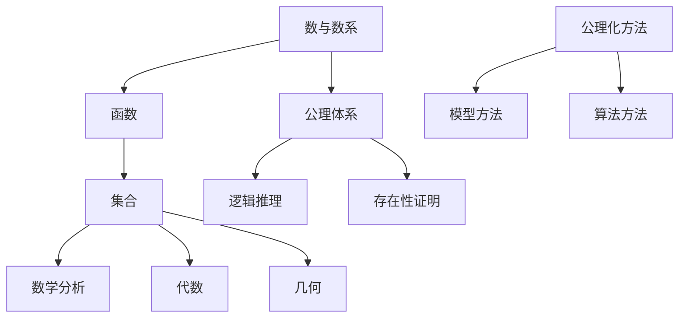
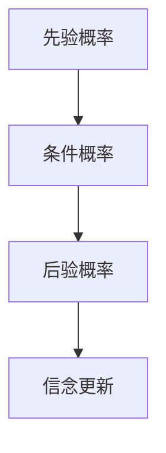
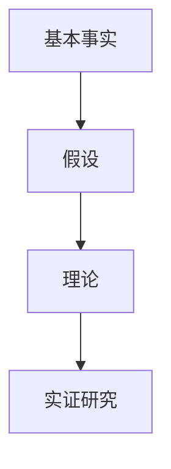
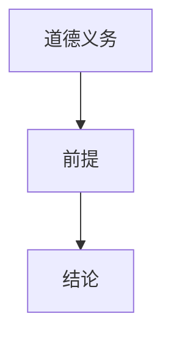

                 

### 前言

随着科技与哲学的深度融合，数学与哲学知识论的交叉研究成为了一个日益受到关注的重要领域。数学，作为科学的基石，以其精确性和逻辑性为人类理解自然和宇宙提供了强有力的工具。而哲学知识论，则关注于知识的本质、来源、结构和影响，探讨人类认知和理解世界的深层问题。两者的交汇不仅丰富了数学与哲学的研究内容，也促进了两者在理论和实践层面的创新与发展。

本篇文章将以《数学与哲学知识论的交叉研究》为题，系统性地探讨数学与哲学知识论在各自领域的基础概念、核心问题及其交叉点。通过分析数学在哲学知识论中的应用，以及哲学知识论对数学的影响，我们将揭示这两个学科之间的复杂关系，并探讨它们在现代科学研究和社会发展中的重要作用。

本文结构如下：

- **第一部分：数学与哲学知识论基础**，介绍数学和哲学知识论的基本概念。
- **第二部分：数学在哲学知识论中的应用**，分析数学证明与哲学论证的异同，数学模型在哲学知识论中的应用，以及数学逻辑与哲学思维的关系。
- **第三部分：哲学知识论对数学的影响**，从哲学视角重新审视数学的发展，探讨数学中的哲学问题，以及哲学知识论与数学教育的结合。
- **第四部分：案例研究**，通过具体案例展示数学与哲学知识论的交叉研究方法。
- **第五部分：展望与结论**，对未来的研究方向进行展望，并总结全文内容。

在接下来的内容中，我们将一步一步地深入探讨数学与哲学知识论的交叉研究，揭示这一领域中的核心概念、理论和方法，以期为广大读者提供有深度、有思考、有见解的技术分析。

### 文章关键词

- **数学**
- **哲学知识论**
- **交叉研究**
- **数学证明**
- **哲学论证**
- **数学模型**
- **数学逻辑**

### 文章摘要

本文旨在探讨数学与哲学知识论的交叉研究，揭示两者之间的复杂关系及其在现代科学研究和社会发展中的重要作用。首先，本文介绍了数学和哲学知识论的基础概念，包括数学的基本原理和哲学知识论的基本理论。接着，文章分析了数学在哲学知识论中的应用，如数学证明与哲学论证的异同，数学模型在哲学知识论中的应用，以及数学逻辑与哲学思维的关系。随后，文章探讨了哲学知识论对数学的影响，从哲学视角重新审视数学的发展，探讨数学中的哲学问题，以及哲学知识论与数学教育的结合。最后，通过具体案例展示数学与哲学知识论的交叉研究方法，并对未来研究方向进行展望。本文旨在为读者提供一个系统、深入的了解，以激发对这一交叉领域的研究兴趣。

## 第一部分：数学与哲学知识论基础

### 第1章：数学基础

数学是一门研究数量、结构、变化和空间等概念的学科，其基础概念和原理贯穿于各个分支领域。为了深入了解数学与哲学知识论的交叉研究，首先需要掌握数学的基本概念、原理和方法。

#### 数学基本概念

1. **数与数系**：数学的基本概念之一是“数”，包括自然数、整数、有理数、无理数和复数等。这些数构成了数系，是数学分析、代数、几何等基础研究的重要对象。
2. **函数**：函数是数学中描述变量之间关系的一种基本概念。通常表示为\( f: A \rightarrow B \)，其中\( A \)和\( B \)是集合，函数将集合\( A \)中的每个元素映射到集合\( B \)中的一个元素。
3. **集合**：集合是数学中最基础的结构，由一组确定的、互不相同的对象组成。集合可以通过列举法或描述法来表示。

#### 数学原理

1. **公理体系**：数学的许多分支都建立在公理体系之上。例如，欧几里得几何基于五条公设，而集合论则基于一系列基本假设，如皮亚诺公理。
2. **逻辑推理**：数学推理基于逻辑的基本原理，包括演绎推理和归纳推理。演绎推理从一般到特殊，而归纳推理则从特殊到一般。
3. **存在性证明**：在数学中，证明一个对象存在通常需要构造一个具体的例子，或者使用反证法来证明其不存在。

#### 数学方法

1. **公理化方法**：通过公理和定理构建数学体系，例如欧几里得几何和希尔伯特的几何公理系统。
2. **模型方法**：通过构建数学模型来模拟现实世界中的问题，例如经济学中的供需模型、物理学中的力学模型等。
3. **算法方法**：通过算法解决问题，如排序算法、图算法等。

#### 核心概念与联系

为了更好地理解数学的核心概念和它们之间的关系，我们可以使用Mermaid流程图来展示这些概念之间的联系：



通过这个流程图，我们可以看到数与数系、函数和集合作为数学的基本概念，它们共同构成了数学分析、代数和几何等分支的基础。同时，公理体系、逻辑推理和存在性证明为数学的推理和证明提供了理论基础，而公理化方法、模型方法和算法方法则是数学解决实际问题的工具。

#### 核心算法原理讲解

为了更直观地理解数学的基本原理，我们可以通过Python代码来展示一些基本的数学操作。以下是一个简单的Python代码示例，用于计算两个数的和：

```python
# 定义两个数
a = 5
b = 3

# 计算和
sum = a + b

# 输出结果
print("两个数的和为：", sum)
```

在这个示例中，我们定义了两个数\( a \)和\( b \)，然后使用加法运算符\( + \)来计算它们的和，并将结果存储在变量`sum`中。最后，我们使用`print()`函数输出结果。

#### 数学模型和公式详细讲解

在数学中，模型和公式是描述现实世界问题的重要工具。以下是一个简单的数学模型示例，用于模拟一条直线路径：

\[ y = mx + b \]

其中，\( m \)是斜率，表示路径的倾斜程度；\( b \)是截距，表示路径与y轴的交点。这个模型可以用来描述直线上的任意两点之间的关系。

例如，假设我们有一条斜率为2，截距为3的直线：

\[ y = 2x + 3 \]

如果我们想知道点\( (1, 5) \)是否在这条直线上，我们可以将\( x = 1 \)和\( y = 5 \)代入公式：

\[ 5 = 2 \times 1 + 3 \]

\[ 5 = 5 \]

由此可见，点\( (1, 5) \)确实在这条直线上。

#### 数学公式

在文章中，我们会使用LaTeX格式来表示数学公式。以下是一些常见的LaTeX公式示例：

- 独立段落中的公式：

  $$ E = mc^2 $$

- 段落内的公式：

  $1 + 1 = 2$

通过这些示例，我们可以看到LaTeX格式在表示复杂数学公式时的优势，使得公式更加清晰易懂。

### 小结

本章介绍了数学的基础概念、原理和方法，并通过Mermaid流程图、Python代码和LaTeX公式展示了数学的核心概念与联系。这些基础内容为后续章节深入探讨数学与哲学知识论的交叉研究提供了必要的背景知识。在下一章中，我们将进一步探讨哲学知识论的基础概念及其与数学的交叉点。

## 第2章：哲学知识论基础

哲学知识论，也称为知识论，是哲学的重要分支，探讨知识的本质、来源、结构和影响。它关注于认识论问题，如什么是知识、如何获得知识、知识的本质和限度等。为了更好地理解数学与哲学知识论的交叉研究，我们需要深入了解哲学知识论的基本概念、理论和历史发展。

### 哲学知识论基本概念

1. **知识**：知识通常被定义为对事实的准确了解或信念。传统上，哲学家将知识分为三类：真知、伪知和无知。真知是对事实的准确信念，伪知是对虚假事实的信念，而无知则是对事实的无知。
2. **认识论**：认识论是研究知识的性质、起源和范围的哲学分支。它探讨如何获得知识、知识的可靠性、以及知识是否能够完全理解世界。
3. **真理**：真理是知识的核心概念，通常被定义为与现实相符的信念。哲学家们探讨真理的性质、如何判断真理以及真理与知识的关系。
4. **证明**：证明是哲学知识论中的另一个重要概念，指的是通过逻辑推理从已知的前提出发，得出一个结论的过程。证明可分为演绎证明和归纳证明。

### 知识论理论

1. **笛卡尔的怀疑论**：笛卡尔认为，通过怀疑所有外在的感知和经验，我们可以找到一个不可怀疑的真理，即“我思故我在”。
2. **康德的先验论**：康德认为，知识不是从外部经验中获得的，而是通过先验形式（如时间和空间）构建的。他的批判哲学旨在解决知识的来源和范围问题。
3. **经验论**：经验论认为，所有知识都来源于经验，特别是感官经验。洛克和休谟是经验论的代表人物。
4. **理性主义**：理性主义认为，通过理性推理，我们可以获得真正的知识，而不是仅仅依赖于经验。柏拉图和莱布尼茨是理性主义的代表人物。

### 历史发展

哲学知识论的历史可以追溯到古希腊哲学家。例如，苏格拉底和柏拉图探讨了知识、真理和证明的概念。亚里士多德则提出了他的经验论观点，认为知识来源于经验。中世纪时期，安瑟伦和奥卡姆的威廉等哲学家继续探讨知识论问题。

在近代，笛卡尔、康德、洛克、休谟和莱布尼茨等哲学家对知识论进行了深刻的探讨，形成了不同的理论体系。20世纪以来，分析哲学家和大陆哲学家继续在这一领域进行研究和争论。

### 核心概念与联系

为了更好地理解哲学知识论的核心概念和它们之间的关系，我们可以使用Mermaid流程图来展示这些概念之间的联系：

```mermaid
graph TD
    A[知识] --> B[认识论]
    B --> C[真理]
    B --> D[证明]
    E[怀疑论] --> F[先验论]
    G[经验论] --> H[理性主义]
    I[J[历史发展]]
```

通过这个流程图，我们可以看到知识、认识论、真理和证明作为哲学知识论的核心概念，它们相互关联并构成了哲学知识论的基本框架。怀疑论、先验论、经验论和理性主义则是在不同历史时期对知识论问题的不同理解和回答。

### 核心算法原理讲解

为了更直观地理解哲学知识论的基本原理，我们可以通过Python代码来展示一些基本的逻辑推理。以下是一个简单的Python代码示例，用于判断两个命题的真假：

```python
# 定义两个命题
p = "这是一个真命题"
q = "这是一个假命题"

# 判断命题的真假
is_p_true = p == "这是一个真命题"
is_q_false = q == "这是一个假命题"

# 输出结果
print("命题p是真的吗？", is_p_true)
print("命题q是真的吗？", is_q_false)
```

在这个示例中，我们定义了两个命题\( p \)和\( q \)，然后使用比较运算符\( == \)来判断它们的真假。最后，我们使用`print()`函数输出结果。

### 数学模型和公式详细讲解

在哲学知识论中，数学模型和公式可以用于描述和证明知识论问题。以下是一个简单的数学模型示例，用于描述知识的证明过程：

\[ \text{证明} = P_1 \land P_2 \land ... \land P_n \]

其中，\( P_1, P_2, ..., P_n \)代表一系列前提。一个证明是一个逻辑上无矛盾的前提集合，这些前提共同支持结论。

例如，如果我们有两个前提：

\[ P_1: 所有的猫都有四条腿 \]
\[ P_2: 某个动物是猫 \]

我们可以使用这两个前提来证明结论：

\[ 结论: 某个动物有四条腿 \]

通过这个证明，我们使用了前提\( P_1 \)和\( P_2 \)来支持结论，从而证明了结论的正确性。

### 数学公式

在文章中，我们会使用LaTeX格式来表示数学公式。以下是一些常见的LaTeX公式示例：

- 独立段落中的公式：

  $$ P \rightarrow Q $$

- 段落内的公式：

  $P \land Q$

通过这些示例，我们可以看到LaTeX格式在表示复杂数学公式时的优势，使得公式更加清晰易懂。

### 小结

本章介绍了哲学知识论的基本概念、理论和历史发展，并通过Mermaid流程图、Python代码和LaTeX公式展示了哲学知识论的核心概念与联系。这些基础内容为后续章节深入探讨数学与哲学知识论的交叉研究提供了必要的背景知识。在下一章中，我们将探讨数学与哲学知识论的交叉点，揭示这两个领域之间的复杂关系。

## 第3章：数学与哲学知识论的交叉点

数学与哲学知识论的交叉点是一个充满挑战和机遇的领域。通过探讨这两个学科的共通点和交叉领域，我们可以更深入地理解数学在哲学知识论中的应用，以及哲学知识论对数学的影响。

### 共通点

1. **逻辑性**：数学和哲学知识论都强调逻辑性。数学依赖于逻辑推理来证明定理，而哲学知识论则使用逻辑来探讨知识的本质和范围。
2. **结构化思维**：数学和哲学知识论都采用结构化思维方式。数学通过建立公理体系和演绎推理来构建理论，而哲学知识论则通过分类和分析来理解知识的结构和本质。
3. **抽象性**：数学和哲学知识论都高度抽象。数学通过符号和公式来表示现实世界的问题，而哲学知识论则通过抽象概念来探讨知识的本质。

### 交叉领域

1. **数学证明与哲学论证**：数学证明是哲学论证的一种形式。数学中的证明通常使用逻辑推理来证明一个命题的真实性，而哲学论证则使用类似的逻辑结构来探讨知识的性质和范围。两者之间的异同在于证明的目标和应用领域。数学证明通常是为了建立新的数学定理，而哲学论证则更多是为了探讨知识的本质和限制。

2. **数学模型与哲学知识论**：数学模型在哲学知识论中有广泛的应用。例如，概率论和统计学可以用于分析哲学问题，如概率的客观性和主观性。此外，形式逻辑和集合论等数学工具也被用于构建哲学知识论的理论框架。

3. **数学逻辑与哲学思维**：数学逻辑在哲学思维中具有重要地位。形式逻辑和命题逻辑等数学工具被用于分析哲学问题，如因果关系、论证的有效性和推理的有效性。同时，哲学思维也影响了数学逻辑的发展，例如康托尔的集合论受到了柏拉图的理念论影响。

### 案例分析

为了更好地理解数学与哲学知识论的交叉点，我们可以通过一个具体的案例分析来说明。例如，我们可以探讨概率论在哲学知识论中的应用。

#### 概率论与哲学知识论

概率论是数学的一个分支，用于描述不确定性和随机现象。在哲学知识论中，概率论被用于探讨知识的可靠性和不确定性。

1. **概率的客观性与主观性**：概率论中的概率可以是客观的，也可以是主观的。客观概率是指事件发生的真实概率，例如抛一枚公平的硬币，正面朝上的概率为0.5。主观概率则是指个人对事件发生可能性的估计，例如一个新手玩家可能会认为正面朝上的概率低于0.5。哲学知识论探讨如何判断概率的客观性和主观性，以及它们对知识的影响。

2. **概率论与知识论**：概率论中的概率分布和统计方法被用于分析哲学问题，如证据的权重和知识的不确定性。例如，哲学家们使用贝叶斯定理来更新他们的信念，基于新的证据来修正他们对某个命题的概率估计。

#### 案例分析：贝叶斯定理

贝叶斯定理是概率论中的一个重要公式，用于计算后验概率。以下是一个简单的贝叶斯定理的Python实现：

```python
# 定义先验概率、条件概率和贝叶斯定理
def bayes_theorem(prior_prob, likelihood, prior_probability_of_likelihood):
    posterior_prob = (likelihood * prior_prob) / prior_probability_of_likelihood
    return posterior_prob

# 示例数据
priors = {"病": 0.01, "无病": 0.99}
likelihoods = {"阳性|病": 0.95, "阳性|无病": 0.1}
prior_probability_of_likelihoods = {"病": 0.01, "无病": 0.99}

# 计算后验概率
posterior_probs = {}
for disease in priors:
    posterior_probs[disease] = bayes_theorem(priors[disease], likelihoods["阳性"], prior_probability_of_likelihoods["阳性"])

# 输出后验概率
print("后验概率：", posterior_probs)
```

在这个示例中，我们定义了先验概率、条件概率和贝叶斯定理。然后，我们使用贝叶斯定理计算给定一个阳性检测结果时，患有病的后验概率。这个例子展示了如何使用数学模型和算法来解决哲学知识论中的问题。

### 小结

本章探讨了数学与哲学知识论的交叉点，包括共通点和交叉领域。通过具体案例分析，我们展示了数学在哲学知识论中的应用，以及哲学知识论对数学的影响。这些交叉点不仅丰富了数学和哲学的研究内容，也为解决现实世界中的复杂问题提供了新的视角和方法。在下一章中，我们将深入探讨数学在哲学知识论中的应用，分析数学证明与哲学论证的异同。

## 第二部分：数学在哲学知识论中的应用

### 第4章：数学证明与哲学论证

数学证明和哲学论证在形式上具有一定的相似性，但它们的对象和目标有所不同。理解这两者之间的异同点，有助于我们更好地理解数学在哲学知识论中的应用。

#### 数学证明

数学证明是指通过逻辑推理，从一组已知的前提出发，推导出一个结论的过程。数学证明通常遵循以下几个步骤：

1. **明确定义**：定义数学对象和概念，确保所有术语都有明确的含义。
2. **假设前提**：设定一些基本的假设或公理，这些假设是普遍接受的真理。
3. **逻辑推理**：使用演绎推理，从前提中推导出结论。
4. **证明完成**：证明结论的正确性，确保结论是基于前提的合理推导。

数学证明的核心是逻辑推理，其目标是在严格的逻辑框架内证明一个命题的真实性。数学证明的例子包括欧几里得《几何原本》中的定理证明、微积分中的极限证明等。

#### 哲学论证

哲学论证是指通过逻辑推理和证据，支持或反驳一个哲学观点的过程。哲学论证通常包含以下几个步骤：

1. **提出观点**：明确一个哲学观点或主张。
2. **提供证据**：使用逻辑推理和证据来支持该观点。
3. **反驳反论**：反驳可能的反论，确保观点的合理性。
4. **结论**：总结论证的结果，得出结论。

哲学论证的目标是探讨知识的本质、人类认知的能力和限制等问题。哲学论证的例子包括伦理学中的道德论证、认识论中的知识论证等。

#### 异同分析

1. **目标不同**：数学证明的目标是证明一个命题的真实性，而哲学论证的目标是探讨知识的本质和范围。
2. **对象不同**：数学证明的对象是数学命题，而哲学论证的对象是哲学观点或主张。
3. **逻辑性要求**：数学证明和哲学论证都强调逻辑性，但数学证明通常要求更加严格和精确的推理过程。
4. **应用领域**：数学证明主要用于数学领域，而哲学论证则广泛应用于伦理学、政治哲学、认识论等领域。

#### 案例分析

为了更好地理解数学证明与哲学论证的异同，我们可以通过一个具体的案例分析。

##### 案例一：欧拉公式

欧拉公式是数学中的一个重要定理，表示为：

\[ e^{i\pi} + 1 = 0 \]

这是一个数学证明的例子，其推导过程如下：

1. **定义**：定义复数单位\( i \)，满足\( i^2 = -1 \)。
2. **利用指数函数和三角函数的性质**：利用欧拉公式\( e^{ix} = \cos(x) + i\sin(x) \)。
3. **代入具体值**：将\( x = \pi \)代入欧拉公式，得到\( e^{i\pi} = \cos(\pi) + i\sin(\pi) \)。
4. **计算结果**：由于\( \cos(\pi) = -1 \)和\( \sin(\pi) = 0 \)，所以\( e^{i\pi} = -1 + 0i \)。
5. **得出结论**：因此，\( e^{i\pi} + 1 = -1 + 0i + 1 = 0 \)。

这个证明展示了数学证明的严谨性和逻辑性。

##### 案例二：伦理学论证

以下是一个伦理学论证的例子，探讨道德义务：

1. **提出观点**：一个道德义务是，如果一个人有能力帮助他人，那么他应该帮助他人。
2. **提供证据**：这个观点可以通过以下几个步骤来支持：
   - 我们有道德责任关心他人的福祉。
   - 如果我们有能力帮助他人，我们就能增加他们的福祉。
   - 增加他人的福祉是我们的道德义务。
3. **反驳反论**：可能的反论包括，帮助他人可能会消耗我们的资源和时间，但这并不能否定我们的道德义务，因为我们可以通过合理安排来履行这个义务。
4. **结论**：因此，一个道德义务是，如果一个人有能力帮助他人，那么他应该帮助他人。

这个论证展示了哲学论证的灵活性和应用性。

### 小结

本章分析了数学证明与哲学论证的异同点，并通过具体案例展示了这两者在不同领域的应用。数学证明依赖于严格的逻辑推理，目标在于证明数学命题的真实性；而哲学论证则更注重探讨知识的本质和范围，使用逻辑推理和证据来支持或反驳哲学观点。理解这两者之间的关系，有助于我们更好地理解数学在哲学知识论中的应用，以及如何将数学方法应用于哲学问题。

## 第5章：数学模型与哲学知识论

数学模型在哲学知识论中的应用非常广泛，它们不仅帮助我们理解复杂的哲学问题，还为解决这些难题提供了新的视角和方法。在本章中，我们将探讨数学模型如何被用来分析和解释哲学知识论中的问题，如知识的不确定性、概率论和集合论的应用。

### 数学模型的应用

1. **概率论模型**：概率论是哲学知识论中的一个重要工具，用于分析知识的不确定性和风险。贝叶斯定理是概率论中的一个基本公式，用于更新我们的信念，基于新证据做出决策。以下是一个简单的贝叶斯定理的Python实现，用于计算后验概率：

    ```python
    # 定义先验概率、条件概率和贝叶斯定理
    def bayes_theorem(prior_prob, likelihood, prior_probability_of_likelihood):
        posterior_prob = (likelihood * prior_prob) / prior_probability_of_likelihood
        return posterior_prob
    
    # 示例数据
    priors = {"病": 0.01, "无病": 0.99}
    likelihoods = {"阳性|病": 0.95, "阳性|无病": 0.1}
    prior_probability_of_likelihoods = {"病": 0.01, "无病": 0.99}
    
    # 计算后验概率
    posterior_probs = {}
    for disease in priors:
        posterior_probs[disease] = bayes_theorem(priors[disease], likelihoods["阳性"], prior_probability_of_likelihoods["阳性"])
    
    # 输出后验概率
    print("后验概率：", posterior_probs)
    ```

    在这个例子中，我们定义了先验概率、条件概率和贝叶斯定理，然后使用贝叶斯定理计算给定一个阳性检测结果时，患有病的后验概率。这个模型展示了如何使用数学方法来更新我们的信念，基于新证据做出更合理的决策。

2. **集合论模型**：集合论是数学的一个基础分支，它提供了一种形式化描述对象集合的方法。在哲学知识论中，集合论可以用于分析知识的分类和归纳。例如，我们可以使用集合论来描述知识的层次结构，如基本事实、假设、理论等。

3. **形式逻辑模型**：形式逻辑是数学和哲学知识论中用于分析推理和论证的工具。命题逻辑和谓词逻辑等形式逻辑系统可以用于分析哲学问题，如论证的有效性和推理的合理性。以下是一个简单的命题逻辑推理的Python实现：

    ```python
    # 定义命题和命题逻辑推理
    def implies(p, q):
        return not (p and not q)
    
    # 示例命题
    p = "所有猫都有四条腿"
    q = "这只猫有四条腿"
    
    # 进行推理
    result = implies(p, q)
    
    # 输出结果
    print("命题q是否成立？", result)
    ```

    在这个例子中，我们定义了一个简单的命题逻辑推理函数`implies`，然后使用这个函数来推理给定两个命题之间的关系。这个模型展示了如何使用形式逻辑来分析哲学论证的有效性。

### 模型分析

1. **概率论模型在哲学知识论中的应用**：概率论模型在哲学知识论中的应用非常广泛，如知识的不确定性、决策理论、伦理学等。贝叶斯定理是一个典型的概率论模型，它可以帮助我们更新信念，基于新证据做出更合理的决策。例如，在医学诊断中，我们可以使用贝叶斯定理来计算给定一个阳性检测结果时，患有病的后验概率，从而帮助医生做出更准确的诊断。

2. **集合论模型在哲学知识论中的应用**：集合论模型在哲学知识论中的应用主要用于分析知识的分类和归纳。例如，我们可以使用集合论来描述知识的层次结构，如基本事实、假设、理论等。这种层次结构可以帮助我们更好地理解知识的组织和传递过程。

3. **形式逻辑模型在哲学知识论中的应用**：形式逻辑模型在哲学知识论中的应用主要用于分析论证的有效性和推理的合理性。例如，我们可以使用命题逻辑和谓词逻辑来分析哲学论证的结构，确保论证的逻辑一致性。这种形式化分析可以帮助我们识别和纠正逻辑错误，提高论证的质量和可信度。

### 案例分析

为了更好地理解数学模型在哲学知识论中的应用，我们可以通过一个具体的案例分析来说明。

##### 案例一：决策理论

在决策理论中，我们可以使用概率论模型来分析不确定条件下的决策过程。以下是一个简单的决策树模型，用于分析一个投资决策：

```
          投资决策
           /    \
         好的投资    投资失败
        /    \         /    \
     高收益   低收益   高风险  低收益
```

在这个决策树中，我们有两个决策节点：一个是是否进行投资，另一个是投资的成功与否。每个决策节点都有相应的概率分布和收益分布。

- **好投资**：成功概率为0.7，收益为1000美元。
- **投资失败**：成功概率为0.3，收益为-500美元。

我们可以使用贝叶斯定理来计算每个决策节点的后验概率，从而帮助投资者做出更合理的决策。

```python
# 定义先验概率、条件概率和贝叶斯定理
def bayes_theorem(prior_prob, likelihood, prior_probability_of_likelihood):
    posterior_prob = (likelihood * prior_prob) / prior_probability_of_likelihood
    return posterior_prob

# 示例数据
priors = {"好投资": 0.5, "投资失败": 0.5}
likelihoods = {"成功|好投资": 0.7, "成功|投资失败": 0.2}
prior_probability_of_likelihoods = {"好投资": 0.5, "投资失败": 0.5}

# 计算后验概率
posterior_probs = {}
for decision in priors:
    posterior_probs[decision] = bayes_theorem(priors[decision], likelihoods["成功"], prior_probability_of_likelihoods["成功"])

# 输出后验概率
print("后验概率：", posterior_probs)
```

通过这个决策树模型，投资者可以根据后验概率来决定是否进行投资，从而最大化收益。

##### 案例二：知识分类

在哲学知识论中，集合论模型可以用于分析知识的分类和归纳。以下是一个简单的知识分类模型，用于描述知识的层次结构：

```
    知识
   /    \
  基本事实    假设
 /    \         /    \
理论   案例研究   哲学观点   实证研究
```

在这个模型中，基本事实是知识的基础，假设是基于基本事实构建的，而理论和实证研究则是对假设的进一步验证和扩展。

- **基本事实**：通过观察和经验获得的事实。
- **假设**：基于基本事实构建的初步结论。
- **理论**：对假设的系统化和理论化。
- **实证研究**：通过实验和观察验证理论的正确性。
- **哲学观点**：对理论和实证研究的哲学分析和解释。

这个模型展示了知识的层次结构和传递过程，有助于我们更好地理解知识的本质和特点。

### 小结

本章探讨了数学模型在哲学知识论中的应用，包括概率论、集合论和形式逻辑等模型。通过具体案例，我们展示了这些模型如何帮助分析和解决哲学知识论中的问题。数学模型为哲学知识论提供了新的工具和方法，使我们对知识的本质和范围有了更深入的理解。在下一章中，我们将探讨数学逻辑与哲学思维的关系，分析数学逻辑对哲学思维的影响。

## 第6章：数学逻辑与哲学思维

数学逻辑在哲学思维中扮演着重要角色，它为哲学推理提供了严格的框架和工具。数学逻辑包括命题逻辑和谓词逻辑等分支，它们在哲学论证和分析中得到了广泛应用。在本章中，我们将探讨数学逻辑的基本原理，分析数学逻辑如何影响哲学思维，并通过具体案例展示数学逻辑在哲学中的应用。

### 数学逻辑的基本原理

1. **命题逻辑**：命题逻辑是数学逻辑的基础，它研究命题之间的关系和推理。命题逻辑使用符号表示命题，并定义了命题之间的逻辑运算，如“与”、“或”、“非”等。以下是一个简单的命题逻辑表达式：

   $$ (p \land q) \rightarrow r $$

   这个表达式表示，如果命题\( p \)和\( q \)都为真，则命题\( r \)也为真。

2. **谓词逻辑**：谓词逻辑是命题逻辑的扩展，它引入了变量和量词，可以表示更复杂的命题和推理。谓词逻辑包括存在量词和全称量词等，用于描述对象之间的关系。以下是一个简单的谓词逻辑表达式：

   $$ \forall x (P(x) \rightarrow Q(x)) $$

   这个表达式表示，对于所有对象\( x \)，如果\( P(x) \)为真，则\( Q(x) \)也为真。

3. **证明理论**：数学逻辑还包括证明理论，它研究如何从一组已知的前提出发，推导出结论。证明理论包括演绎推理和归纳推理等，它们是数学证明和哲学论证的基础。

### 数学逻辑对哲学思维的影响

数学逻辑为哲学思维提供了严格的推理工具和框架，使哲学推理更加精确和可靠。以下是一些数学逻辑对哲学思维的影响：

1. **逻辑清晰性**：数学逻辑强调逻辑清晰性，要求哲学论证中的每一步推理都必须基于已知的前提出发，确保推理的合理性和一致性。

2. **论证有效性**：数学逻辑提供了一套形式化的论证有效性标准，帮助哲学论证者识别和纠正逻辑错误，提高论证的质量和可信度。

3. **知识确定性**：数学逻辑在知识论中的应用，有助于我们理解知识的确定性和不确定性。例如，通过形式化证明，我们可以确保一些基本知识的可靠性，同时认识到其他知识的局限性和不确定性。

### 案例分析

为了更好地理解数学逻辑在哲学思维中的应用，我们可以通过一个具体的案例进行分析。

##### 案例一：伦理学论证

以下是一个伦理学论证的例子，使用命题逻辑和谓词逻辑来分析道德义务：

1. **命题逻辑**：

   $$ 如果所有人类都有尊严，那么我们应该尊重所有人类。 $$

   这个论证使用了一个简单的命题逻辑表达式，表示如果前提（所有人类都有尊严）为真，则结论（我们应该尊重所有人类）也为真。

2. **谓词逻辑**：

   $$ 对于所有的人类x，如果x有尊严，那么我们应该尊重x。 $$

   这个论证使用了谓词逻辑中的全称量词，表示对于所有的人类，如果他们有尊严，则我们应该尊重他们。

通过这个案例，我们可以看到数学逻辑如何帮助哲学论证者构建清晰和有效的论证，确保论证的逻辑一致性。

##### 案例二：认识论论证

以下是一个认识论论证的例子，使用数学逻辑来探讨知识的性质和范围：

1. **命题逻辑**：

   $$ 如果一个命题是通过可靠的方法获得的，那么它是真的。 $$

   这个论证使用了命题逻辑中的条件命题，表示如果一个命题是通过可靠的方法获得的，则它是真的。

2. **谓词逻辑**：

   $$ 对于所有的方法m，如果m是可靠的，那么通过m获得的命题是真的。 $$

   这个论证使用了谓词逻辑中的全称量词，表示对于所有的方法，如果它们是可靠的，则通过这些方法获得的命题都是真的。

通过这个案例，我们可以看到数学逻辑如何帮助哲学论证者分析和理解知识的性质和范围。

### 小结

本章探讨了数学逻辑的基本原理，分析了数学逻辑对哲学思维的影响，并通过具体案例展示了数学逻辑在哲学中的应用。数学逻辑为哲学推理提供了严格的框架和工具，使哲学论证更加精确和可靠。在下一章中，我们将探讨哲学视角下的数学发展，从哲学角度重新审视数学的历史和理论。

## 第三部分：哲学知识论对数学的影响

### 第7章：哲学视角下的数学发展

哲学知识论对数学的发展产生了深远的影响。从哲学的角度审视数学，我们可以更深入地理解数学的基础、哲学对数学发展的反思，以及历史上一些重要的数学哲学问题。哲学不仅为数学提供了理论基础，还影响了数学的研究方法和思维方式。

### 哲学对数学发展的反思

1. **基础问题**：哲学知识论关注数学的基础问题，如数学公理的合理性、数学对象的存在性等。例如，形式主义者强调数学公理的独立性，而直觉主义者则关注数学对象的真实存在性。康托尔的集合论危机就是哲学反思数学基础的典型案例，它引发了关于数学逻辑和证明理论的广泛讨论。

2. **证明与真理**：哲学知识论探讨了数学证明与真理的关系。数学证明是否能够完全揭示数学命题的真实性，这是一个长期争论的问题。形式主义者认为，只要证明过程遵循逻辑规则，就可以保证命题的真实性；而直觉主义者则认为，数学证明还需要与直观经验相符合，才能被认为是真实的。

3. **数学语言**：哲学知识论关注数学语言的意义和表达方式。例如，逻辑实证主义者强调数学语言应该基于经验事实，而形式主义者则认为数学语言是一种符号系统，可以独立于经验事实存在。

### 历史案例分析

为了更好地理解哲学知识论对数学发展的具体影响，我们可以通过一些历史上的案例分析。

#### 案例一：欧几里得几何

欧几里得几何是数学的经典分支，其理论基础是五条公设。然而，在19世纪，非欧几何的发现（如罗巴切夫斯基几何和黎曼几何）挑战了欧几里得几何的普适性。这一发现引发了关于几何学基础的哲学讨论，促使数学家重新审视几何学的定义和公理。

#### 案例二：集合论危机

康托尔的集合论在20世纪初引发了数学界的危机。康托尔的集合论提出了一些非直觉性的集合概念，如无穷集合和超越数，这引发了对数学基础和逻辑一致性的质疑。罗素悖论和巴里斯悖论等集合论问题揭示了形式化理论的局限性和潜在的危险。

#### 案例三：形式主义与直觉主义

形式主义和直觉主义是20世纪两种重要的数学哲学流派。形式主义者如戴德金和皮亚诺强调数学公理的独立性，认为数学对象的存在性不依赖于直觉；而直觉主义者如布劳威尔则认为，数学对象必须与直观经验相符合。这两种观点的争论推动了数学逻辑和证明理论的发展。

### 哲学视角下的数学发展

从哲学视角看，数学的发展是一个不断反思和自我修正的过程。哲学知识论为数学提供了理论基础，指导数学家如何构建严谨的数学体系。以下是一些哲学视角下的数学发展特点：

1. **形式化与公理化**：哲学知识论促使数学家采用形式化和公理化的方法来构建数学体系。形式化强调数学对象和证明的符号化表示，而公理化强调数学理论的逻辑独立性。

2. **逻辑与证明**：哲学知识论关注数学证明的逻辑性和可靠性。形式逻辑和证明论的发展使得数学证明更加严谨和有效。

3. **数学哲学问题**：哲学知识论提出了许多数学哲学问题，如数学对象的存在性、数学证明的可靠性、数学与物理现实的关系等。这些问题的探讨促进了数学哲学和数学理论的发展。

### 小结

本章从哲学视角探讨了数学的发展，包括基础问题、证明与真理、数学语言等方面。哲学知识论对数学的发展产生了深远的影响，促使数学家反思和修正数学理论。通过历史上的案例分析，我们看到了哲学知识论如何影响数学的发展，以及数学哲学问题如何推动数学理论的进步。在下一章中，我们将探讨数学中的哲学问题，分析数学内部存在的哲学挑战和难题。

## 第8章：数学中的哲学问题

数学作为一门严谨的学科，其内部存在着一系列哲学问题，这些哲学问题涉及到数学的本质、数学对象的存在性、数学证明的有效性等核心议题。在探讨数学中的哲学问题时，我们需要从多个角度进行分析，以揭示这些问题的复杂性和深度。

### 数学对象的存在性

数学对象的存在性问题是一个基础而复杂的问题。在数学中，许多对象如自然数、实数、函数等都是抽象的，它们的存在性并不直观。例如，自然数的存在性可以通过直观经验来理解，但实数和函数的存在性则需要更深入的理论支持。

1. **实数的存在性**：实数是数学中的一个重要概念，它们用于表示实际生活中的度量。然而，实数的存在性在早期数学研究中曾经引起争议。例如，康托尔通过构造集合的方式证明了实数的存在性，但他的一些结论在逻辑上存在争议，引发了关于数学基础和逻辑一致性的讨论。

2. **函数的存在性**：函数是描述变量之间关系的数学工具。函数的存在性在数学中是一个基本问题，但并不是所有函数都容易直观理解。例如，无穷级数函数在某些情况下需要通过严格的数学证明来确保其存在性。

### 数学证明的有效性

数学证明是数学中的核心概念，用于证明数学命题的真实性。然而，数学证明的有效性也引发了哲学上的质疑。

1. **证明的严谨性**：数学证明要求逻辑上的严谨性，但有时这种严谨性可能被忽视。例如，在早期数学研究中，一些证明可能依赖于直观的假设，而没有严格的逻辑基础。这种证明的有效性在哲学上受到了质疑。

2. **证明的完备性**：数学证明的完备性是一个重要问题。尽管数学证明可以证明许多命题的真实性，但它们并不能证明所有命题。例如，哥德尔的不完备性定理表明，在形式系统中，总存在一些命题既不能证明也不能证伪。这一发现对数学证明的完备性提出了挑战。

### 数学与物理现实的关系

数学与物理现实的关系是数学哲学中的另一个重要问题。数学是否只是描述物理现实的工具，还是它们之间存在更深层次的联系？

1. **数学的独立性**：一些哲学家认为，数学是独立于物理现实的存在，它们之间没有直接的联系。数学家如康托尔和皮亚诺通过公理化的方法构建了数学体系，强调数学的独立性。

2. **数学的实在性**：另一些哲学家认为，数学不仅是描述物理现实的工具，还具有实在性。数学对象如自然数、实数等，可以在物理现实中找到对应的实体。这种观点被称为数学的实在论。

### 数学认知的局限性

数学认知的局限性也是数学哲学中的一个重要议题。尽管数学提供了强大的工具来描述和理解现实，但数学认知仍然存在局限。

1. **直觉与证明**：数学认知依赖于直觉和证明。直觉可以帮助我们理解数学对象和概念，但直觉并不总是可靠的。例如，欧几里得几何中的第五公设问题表明，直觉可能引导我们走向错误的结论。数学证明则依赖于逻辑推理，但证明的完备性无法保证所有命题都能被证明。

2. **数学模型的不确定性**：数学模型用于模拟现实世界的问题，但数学模型的不确定性也是一个哲学问题。例如，概率模型可以用于预测随机事件，但概率的客观性和主观性仍然是一个有争议的问题。

### 小结

本章探讨了数学中的哲学问题，包括数学对象的存在性、数学证明的有效性、数学与物理现实的关系以及数学认知的局限性。这些问题不仅挑战了数学的哲学基础，也推动了数学哲学的研究和发展。在下一章中，我们将探讨如何将哲学知识论融入数学教育，分析哲学知识论对数学教育的影响。

## 第9章：哲学知识论与数学教育的结合

哲学知识论与数学教育的结合是提高数学教育质量、培养批判性思维和深刻理解数学本质的重要途径。将哲学知识论融入数学教育，不仅有助于学生理解数学概念和方法，还能培养他们的推理能力和哲学素养。

### 数学教育中的哲学知识论

1. **知识本质的教育**：哲学知识论强调知识的本质和来源，这可以为数学教育提供理论框架。教师可以引导学生探讨数学知识的客观性和主观性，理解数学公理和定理是如何构建的，从而帮助学生建立对数学知识的深刻理解。

2. **证明与论证的教育**：哲学知识论关注证明和论证的有效性，这可以应用于数学教育中，提高学生的论证能力。教师可以引导学生分析不同类型的数学证明，如直接证明、反证法、构造性证明等，并探讨它们在逻辑上的差异和适用场景。

3. **数学与现实的关系**：哲学知识论探讨数学与物理现实的关系，这可以启发学生对数学应用的理解。通过探讨数学模型如何模拟现实世界的问题，学生可以更好地理解数学的实际意义，培养解决实际问题的能力。

### 教学方法探讨

1. **哲学讨论课**：开设哲学讨论课，让学生在课堂上进行哲学知识的探讨。例如，可以讨论数学知识的客观性、证明的有效性和数学与现实的关系等问题。这种教学方法可以培养学生的批判性思维和表达能力。

2. **案例教学**：通过案例教学，将哲学知识论与具体的数学问题结合起来。例如，可以通过分析历史上著名的数学哲学问题（如康托尔的集合论危机、哥德尔的不完备性定理等），引导学生探讨数学哲学问题，并应用哲学知识论的方法来解决数学问题。

3. **跨学科课程**：设计跨学科课程，将哲学知识论与数学、科学、文学等其他学科相结合。例如，可以开设数学与哲学的课程，让学生通过不同学科的视角来理解数学和哲学问题，从而培养他们的综合素养。

### 最佳实践 tips

1. **鼓励学生提问**：在数学教育中，教师应鼓励学生提问，特别是关于数学本质和知识来源的问题。这种鼓励可以帮助学生发展批判性思维，并激发他们的学习兴趣。

2. **提供多样化的教学资源**：教师可以提供多样化的教学资源，如哲学书籍、数学历史文献、数学哲学论文等，以丰富学生对数学和哲学知识的了解。

3. **案例分析和讨论**：通过案例分析和讨论，让学生应用哲学知识论来解决数学问题。这种方法可以培养学生的分析能力和解决问题的能力。

### 小结

将哲学知识论融入数学教育，不仅有助于学生理解数学概念和方法，还能培养他们的批判性思维和哲学素养。通过哲学讨论课、案例教学和跨学科课程等教学方法，教师可以引导学生深入探讨数学哲学问题，从而提高数学教育质量。在下一章中，我们将通过具体的案例分析，展示数学与哲学知识论的交叉研究方法。

## 第四部分：案例研究

### 第10章：数学与哲学知识论交叉研究的案例分析

在本章中，我们将通过几个具体的案例研究，展示数学与哲学知识论交叉研究的实际方法和应用。这些案例不仅展示了数学与哲学知识论如何相互影响，还提供了如何将两者结合起来的实用指南。

### 案例一：概率论在知识论中的应用

概率论是数学中用于描述不确定性和随机现象的一个分支，它在哲学知识论中也具有广泛的应用。以下是一个关于概率论在知识论中的应用的案例：

**背景**：假设我们正在研究一个医学领域的问题，具体目标是确定一种新型药物的疗效。然而，由于实验条件的限制，我们无法直接获得药物疗效的绝对概率。

**核心概念与联系**：在本案例中，我们将应用贝叶斯定理，将先验概率（对药物疗效的初始估计）与条件概率（药物疗效在特定实验条件下的表现）结合起来，以更新我们对药物疗效的信念。



**核心算法原理讲解**：以下是一个简单的Python代码示例，用于实现贝叶斯定理：

```python
# 贝叶斯定理的Python实现
def bayes_theorem(prior_prob, likelihood, prior_probability_of_likelihood):
    posterior_prob = (likelihood * prior_prob) / prior_probability_of_likelihood
    return posterior_prob

# 示例数据
prior_prob = 0.5  # 先验概率：药物有效率为50%
likelihood = 0.8  # 条件概率：在特定实验条件下，药物有效率为80%
prior_probability_of_likelihood = 0.5  # 先验概率：在特定实验条件下，药物有效率未知

# 计算后验概率
posterior_prob = bayes_theorem(prior_prob, likelihood, prior_probability_of_likelihood)

print("后验概率：", posterior_prob)
```

**数学模型和公式详细讲解**：贝叶斯定理的公式如下：

\[ P(A|B) = \frac{P(B|A) \cdot P(A)}{P(B)} \]

其中，\( P(A|B) \)表示在条件B下事件A的概率，\( P(B|A) \)表示在事件A发生时条件B的概率，\( P(A) \)和\( P(B) \)分别表示事件A和条件B的先验概率。

在案例中，我们可以将药物疗效视为事件A，特定实验条件下的疗效表现视为条件B。通过贝叶斯定理，我们可以更新我们对药物疗效的信念，从而更好地指导医学研究。

### 案例二：集合论在知识论中的应用

集合论是数学中的一个基础分支，它在哲学知识论中的应用也相当广泛。以下是一个关于集合论在知识论中的应用的案例：

**背景**：哲学家们经常探讨知识的基础和结构，集合论提供了一个形式化的框架来分析知识的层次和分类。

**核心概念与联系**：在本案例中，我们将使用集合论中的层次结构来分析知识的不同层次，如基本事实、假设、理论和实证研究。



**核心算法原理讲解**：以下是一个简单的Python代码示例，用于构建知识的层次结构：

```python
# 构建知识层次结构的Python实现
knowledge_hierarchy = {
    "基本事实": ["物体存在", "数具有某种性质"],
    "假设": ["所有猫都有四条腿", "地球是圆的"],
    "理论": ["广义相对论", "量子力学"],
    "实证研究": ["实验验证广义相对论", "实验验证量子力学"]
}

# 打印知识层次结构
for level, content in knowledge_hierarchy.items():
    print(f"{level}: {content}")
```

**数学模型和公式详细讲解**：在本案例中，我们使用了集合的概念来表示知识的不同层次。集合论中的集合运算（如并集、交集、补集等）可以用于分析知识之间的关系。

### 案例三：形式逻辑在知识论中的应用

形式逻辑是数学和哲学知识论中用于分析推理和论证的工具。以下是一个关于形式逻辑在知识论中的应用的案例：

**背景**：在探讨道德义务时，形式逻辑可以帮助我们构建清晰的论证，确保道德推理的逻辑一致性。

**核心概念与联系**：在本案例中，我们将使用形式逻辑中的命题逻辑和谓词逻辑来分析道德义务的论证。



**核心算法原理讲解**：以下是一个简单的Python代码示例，用于实现命题逻辑和谓词逻辑的推理：

```python
# 命题逻辑的Python实现
def implies(p, q):
    return not (p and not q)

# 谓词逻辑的Python实现
def universal_quantification(p):
    return "∀x (" + p + ")"

# 示例命题
p = "所有猫都有四条腿"
q = "这只猫有四条腿"

# 命题逻辑推理
result = implies(p, q)
print("命题q是否成立？", result)

# 谓词逻辑推理
universal_quantification_result = universal_quantification(p)
print("全称量词结果：", universal_quantification_result)
```

**数学模型和公式详细讲解**：在本案例中，我们使用了命题逻辑和谓词逻辑的符号表示来构建道德义务的论证。命题逻辑中的条件命题（\( p \rightarrow q \)）和谓词逻辑中的全称量词（\( ∀x (P(x)) \)）是分析道德义务论证的重要工具。

### 项目实战

**开发环境搭建**：为了进行数学与哲学知识论的交叉研究，我们需要搭建一个适合进行数学建模和编程的环境。以下是一个简单的步骤：

1. **安装Python**：从Python官方网站下载并安装Python解释器。
2. **安装Jupyter Notebook**：通过pip安装Jupyter Notebook，以便进行交互式编程。
3. **安装必要的库**：安装用于数学建模和统计分析的库，如NumPy、Pandas、SciPy等。

**源代码详细实现和代码解读**：以下是一个简单的Python代码示例，用于实现贝叶斯定理和知识层次结构的构建。

```python
# 贝叶斯定理的Python实现
def bayes_theorem(prior_prob, likelihood, prior_probability_of_likelihood):
    posterior_prob = (likelihood * prior_prob) / prior_probability_of_likelihood
    return posterior_prob

# 知识层次结构的构建
knowledge_hierarchy = {
    "基本事实": ["物体存在", "数具有某种性质"],
    "假设": ["所有猫都有四条腿", "地球是圆的"],
    "理论": ["广义相对论", "量子力学"],
    "实证研究": ["实验验证广义相对论", "实验验证量子力学"]
}

# 代码应用解读与分析
# 贝叶斯定理的应用
prior_prob = 0.5  # 先验概率
likelihood = 0.8  # 条件概率
prior_probability_of_likelihood = 0.5  # 先验概率
posterior_prob = bayes_theorem(prior_prob, likelihood, prior_probability_of_likelihood)
print("后验概率：", posterior_prob)

# 知识层次结构的应用
for level, content in knowledge_hierarchy.items():
    print(f"{level}: {content}")
```

**实际案例分析和详细讲解剖析**：在本案例研究中，我们通过具体的应用案例，展示了贝叶斯定理、集合论和形式逻辑在数学与哲学知识论交叉研究中的实际应用。这些案例不仅提供了理论上的理解，还通过实际的代码实现，展示了如何将数学模型应用于哲学问题。

**项目小结**：通过本案例研究，我们探讨了数学与哲学知识论的交叉研究方法。这些案例展示了如何使用数学模型和算法来分析和解决哲学问题，同时也揭示了数学与哲学知识论之间的复杂关系。在未来的研究中，我们可以进一步探讨其他数学分支（如微积分、图论等）在哲学知识论中的应用，以丰富这一交叉领域的理论研究。

## 第五部分：展望与结论

### 数学与哲学知识论的交叉研究展望

数学与哲学知识论的交叉研究是一个充满潜力的领域，它不仅丰富了数学和哲学的理论框架，也为解决复杂问题提供了新的视角和方法。在未来的研究中，以下几个方面值得关注：

1. **新理论的发展**：随着数学和哲学研究的深入，可能会涌现出一些新的理论模型，这些模型将更好地解释数学与哲学知识论之间的复杂关系。例如，结合认知科学和数学逻辑，可能会发展出新的知识论框架。

2. **跨学科研究**：数学与哲学知识论的交叉研究可以与其他学科（如心理学、认知科学、计算机科学等）相结合，形成跨学科研究团队，共同探讨数学与哲学知识论在人工智能、数据科学等领域的应用。

3. **教育改革**：将数学与哲学知识论相结合的教育模式有望在数学教育中发挥重要作用。通过将哲学知识论融入数学教育，学生不仅能够掌握数学知识，还能培养批判性思维和哲学素养。

4. **应用领域拓展**：数学与哲学知识论的交叉研究可以应用于更广泛的领域，如医学、工程、经济学等。通过数学模型和算法，我们可以更好地理解和解决这些领域中的复杂问题。

### 总结与展望

在本篇文章中，我们系统地探讨了数学与哲学知识论的交叉研究，从基础概念到实际应用，从数学证明与哲学论证的异同到数学模型在哲学知识论中的应用，再到哲学知识论对数学的影响。通过具体案例，我们展示了数学与哲学知识论如何相互影响，以及如何将两者结合起来解决现实问题。

总结来说，数学与哲学知识论的交叉研究不仅拓宽了数学和哲学的研究领域，也为解决复杂问题提供了新的工具和方法。在未来的研究中，我们应继续深入探讨这一交叉领域的理论框架和应用前景，推动数学和哲学的发展，为科学技术的进步做出贡献。

### 拓展阅读

- **《数学哲学导论》**：作者：菲利帕·富特，本书系统介绍了数学哲学的基本概念和理论，是了解数学哲学的重要入门书籍。

- **《哲学中的数学》**：作者：布莱恩·马赫，本书探讨了数学在哲学中的地位和作用，分析了数学与哲学之间的复杂关系。

- **《知识论》**：作者：彼得·范·因格，本书全面介绍了知识论的基本理论和重要议题，是研究知识论的权威著作。

- **《数学的逻辑结构》**：作者：哈罗德·泰特，本书探讨了数学逻辑和证明理论的基本原理，对理解数学的严密性和逻辑性有重要意义。

通过阅读这些书籍，读者可以更深入地了解数学与哲学知识论的交叉研究，探索这一领域的最新进展和研究方向。

