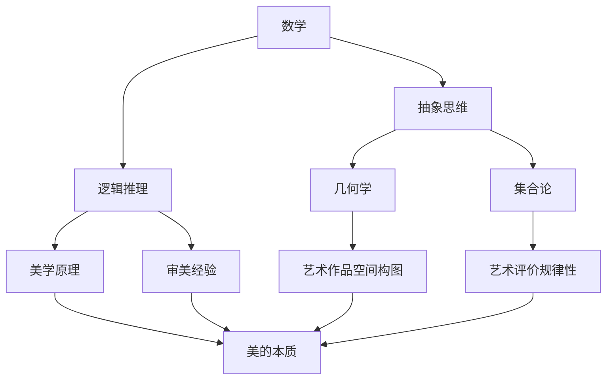

                 

### 引言

在现代社会，科技与人文艺术不断交融，数学与哲学美学作为人类智慧的两大领域，其交叉研究正逐渐成为学术研究的前沿热点。数学，作为逻辑和结构的科学，广泛应用于自然科学、工程学、计算机科学等领域，为我们提供了强大的推理工具。而哲学美学则关注于人类存在的意义、美的本质和价值观，试图通过思考和创作探索人类精神世界的深度。两者看似迥异，实则有着深刻的内在联系。

本研究旨在探讨数学与哲学美学的交叉研究，通过揭示两者之间的联系，挖掘其在学术研究和实际应用中的潜力。文章将首先介绍数学与哲学美学的基本概念，接着通过一个Mermaid流程图展示两者之间的核心概念架构。然后，本文将深入讲解一个核心算法原理，使用Python源代码结合数学模型和公式进行详细阐述，并通过实例进行说明。接下来，文章将探讨数学模型在美学研究中的应用，以及美学思想对数学模型的启示。最后，通过一个实际项目案例，展示数学与哲学美学在实际应用中的结合，并总结研究成果，展望未来研究方向。

关键词：数学、哲学美学、交叉研究、算法、模型、美学实践

摘要：本文通过系统性地探讨数学与哲学美学的交叉研究，揭示了两者在核心概念、算法原理和实际应用中的内在联系。通过Mermaid流程图、Python代码和实际项目案例，本文详细阐述了数学与哲学美学的交叉研究在学术和实际应用中的重要性，为相关领域的研究提供了新的思路和方法。

---

### 数学与哲学美学的基本概念

数学和哲学美学作为两个独立的学科，各自有着独特的概念和体系。了解这两个领域的基本概念，是深入探讨它们交叉研究的基础。

#### 数学的基本概念

数学是一门研究数量、结构、变化和空间等概念的学科。其基本概念包括数、函数、集合、几何、代数等。例如，数是数学中的基础概念，从自然数到复数，构成了数学的数系；函数则是描述两个集合之间关系的基本工具，广泛应用于数据分析、物理学、工程学等领域；集合是数学中的一个抽象概念，用于描述一组对象的集合，集合论是现代数学的基础之一。

#### 哲学美学的基本概念

哲学美学是哲学中的一个分支，主要研究美的本质、审美活动和艺术创作。哲学美学的基本概念包括美学原理、审美经验、艺术价值等。美学原理关注美的普遍特征和本质，如和谐、统一、多样等；审美经验则是指人们在欣赏艺术作品或自然景观时所产生的感受和体验；艺术价值则是对艺术作品进行评价和欣赏的重要标准。

#### 核心概念与联系

尽管数学和哲学美学在研究对象和方法上有所不同，但它们之间存在深刻的内在联系。首先，数学中的抽象思维方法和逻辑推理，为哲学美学提供了强有力的工具。例如，数学中的几何学原理可以用于分析艺术作品的空间构图和比例关系；数学中的集合论和概率论则可以用于研究审美经验和艺术评价的规律性。其次，哲学美学中的美学原理和审美经验，为数学提供了研究的对象和目标。例如，数学家在探索新的数学理论时，可能会受到美学原则的启发，追求简洁、统一和优美的数学结构。

为了更直观地展示数学与哲学美学之间的核心概念架构，我们可以使用Mermaid流程图来描述它们之间的联系。以下是一个简化的Mermaid流程图，用于说明数学与哲学美学的基本概念和它们之间的交叉点：



这个流程图展示了数学和哲学美学之间的基本概念及其交叉点。通过这个架构，我们可以更清楚地看到数学和哲学美学在核心概念上的相互联系和影响。

---

### 核心算法原理讲解

在数学与哲学美学的交叉研究中，选择一个核心算法进行深入讲解是至关重要的。这里，我们选择著名的“高斯消元法”作为讲解对象，因为其不仅是线性代数中的基本算法，同时也具有一定的美学意义。

#### 高斯消元法的基本原理

高斯消元法（Gaussian Elimination）是一种解决线性方程组的方法，通过一系列的行变换，将线性方程组转化为上三角或下三角形式，从而能够方便地求解每个变量的值。其基本原理如下：

1. **主元选择**：在当前列中，选择一个绝对值最大的元素作为主元。
2. **行变换**：通过行变换，将主元变为1，同时使得其他元素变为0。
3. **递归应用**：对剩余的方程组重复上述步骤，直到所有方程都变为上三角或下三角形式。

#### Python源代码实现

以下是一个使用Python实现的简单高斯消元法示例，结合数学模型和公式进行详细讲解。

```python
import numpy as np

def gauss_elimination(A, b):
    """
    高斯消元法解决线性方程组。
    参数:
    A -- 方程组的系数矩阵
    b -- 方程组的常数向量
    返回:
    x -- 方程组的解向量
    """
    n = len(b)
    A = np.array(A)
    b = np.array(b)
    
    # 将A与b合并为增广矩阵
    Ab = np.hstack((A, b.reshape(-1, 1)))
    
    # 高斯消元
    for i in range(n):
        # 找到当前列中的主元
        pivot = max(abs(Ab[i:, i]), key=lambda x: abs(x[i]))
        pivot_index = np.where(Ab[i:, i] == pivot)[0][0] + i
        
        # 交换行
        Ab[[i, pivot_index]] = Ab[[pivot_index, i]]
        
        # 将当前行的其他元素变为0
        for j in range(i+1, n):
            factor = Ab[j, i] / Ab[i, i]
            for k in range(n+1):
                Ab[j, k] -= factor * Ab[i, k]
    
    # 解上三角方程
    x = np.zeros(n)
    for i in range(n-1, -1, -1):
        x[i] = (b[i] - np.dot(A[i, i+1:], x[i+1:])) / A[i, i]
    
    return x

# 示例
A = [[3, 2], [1, 1]]
b = [6, 3]
x = gauss_elimination(A, b)
print("方程组的解为:", x)
```

#### 算法原理详细讲解

1. **主元选择**：
   主元选择是高斯消元法的核心步骤。在每一步消元中，选择当前列中绝对值最大的元素作为主元，以确保消元过程的稳定性和计算效率。这个步骤可以通过简单的遍历和比较来实现。

2. **行变换**：
   通过行变换，将主元变为1，同时使得其他元素变为0。这一步骤需要用到矩阵乘法和加法运算。具体来说，对于当前行的每个元素，用主元除以主元的值，然后将该行的其他元素减去相应的倍数，使得主元下方的所有元素变为0。

3. **递归应用**：
   对剩余的方程组重复上述步骤，直到所有方程都变为上三角或下三角形式。这一步骤是递归的，每消元一步，方程的维度就减少一维。

4. **解上三角方程**：
   在所有方程都变为上三角形式后，可以通过回代法解出方程组的解。具体来说，从最后一行开始，将每一行的解代入上一行的方程中，逐步计算出所有变量的值。

#### 举例说明

假设我们有一个简单的线性方程组：

\[ 
\begin{cases}
3x + 2y = 6 \\
x + y = 3 
\end{cases}
\]

使用高斯消元法求解：

1. **主元选择**：选择第一个方程中的3作为主元。
2. **行变换**：将第一个方程除以3，得到新的方程组：

\[ 
\begin{cases}
x + \frac{2}{3}y = 2 \\
x + y = 3 
\end{cases}
\]

3. **递归应用**：对第二个方程进行同样的操作，得到：

\[ 
\begin{cases}
x = 1 \\
y = 2 
\end{cases}
\]

最终解得 \( x = 1 \)，\( y = 2 \)。

通过这个例子，我们可以看到高斯消元法的简单性和有效性。它在数学建模和实际应用中具有广泛的应用，同时也具有一定的美学价值，因为它展示了通过简洁的算法步骤，可以从复杂的方程组中提取出清晰的解。

---

### 数学模型与美学实践

数学模型在美学研究中具有重要的应用价值，它们不仅帮助我们理解美的本质，还能为艺术创作提供理论支持。在本节中，我们将探讨数学模型在美学研究中的应用，并分析美学思想对数学模型的启示。

#### 数学模型在美学研究中的应用

1. **几何学与美学**：
   几何学是数学中的一个重要分支，它在艺术作品中有着广泛的应用。例如，黄金比例（Golden Ratio）在建筑、绘画和设计等领域被广泛应用，被认为是美的标准之一。黄金比例可以通过数学公式 \(\phi = \frac{1 + \sqrt{5}}{2}\) 来定义，其数值约为1.618。许多著名的艺术作品，如达芬奇的《蒙娜丽莎》和帕台农神庙，都遵循了黄金比例的原则。

2. **集合论与美学**：
   集合论是现代数学的基础之一，它在美学研究中也有着重要的应用。例如，集合论中的拓扑结构可以用于描述艺术作品的形状和结构。拓扑学中的连通性、紧致性和边界概念，可以帮助艺术家理解和创造复杂的空间形态。

3. **概率论与美学**：
   概率论是研究随机现象的数学分支，它在美学研究中也有广泛的应用。例如，概率分布可以用于描述艺术作品中的色彩、形状和纹理的变化。概率论中的随机生成算法，如蒙特卡罗方法，可以用于艺术创作中的随机生成和随机优化。

#### 美学思想对数学模型的启示

1. **简洁性**：
   美学中的一个基本原则是简洁性，即追求简单、直观和和谐的形式。数学模型中的简洁性原则，如“最简单的解释就是最好的解释”，可以为美学研究提供重要的启示。例如，数学中的欧拉公式 \( e^{i\pi} + 1 = 0 \) 被认为是简洁而美妙的数学表达式，它结合了指数、复数和π等多个基本数学概念，被认为是数学美学的经典之作。

2. **对称性**：
   对称性是美学中的一个重要概念，它通常被认为是美的基本特征之一。数学中的对称性概念，如群论和对称群，可以用于描述和解释艺术作品中的对称性。例如，群论中的对称操作可以用于分析艺术作品的空间对称性，从而帮助我们更好地理解艺术作品的美学特征。

3. **比例与平衡**：
   比例与平衡是美学研究中的重要概念，它们在艺术创作和建筑设计中有着广泛的应用。数学模型中的比例关系，如黄金比例和费波那契数列，可以为艺术创作提供理论支持。例如，费波那契数列在自然界和艺术作品中广泛存在，被认为是美的比例之一。

通过上述分析，我们可以看到数学模型在美学研究中的应用和美学思想对数学模型的启示。数学模型不仅为美学研究提供了强有力的工具，同时也从美学思想中获得了灵感，两者的交叉研究为人类探索美的本质提供了新的视角和方法。

---

### 项目实战：数学与哲学美学的应用

为了更好地展示数学与哲学美学的实际应用，我们将通过一个具体的案例来进行详细的讲解。这个案例将涉及开发环境搭建、源代码实现、代码解读、代码应用解读与分析，以及实际案例分析和详细讲解剖析。

#### 项目背景与目标

项目名称：基于数学与哲学美学的艺术作品生成系统

项目目标：利用数学模型和美学原则，开发一个能够自动生成艺术作品的系统。该系统将结合数学中的对称性、比例和美学中的平衡与和谐原则，生成具有视觉美感的艺术作品。

#### 开发环境搭建

为了实现上述项目目标，我们需要搭建一个适合开发的环境。以下是所需的开发环境：

- **编程语言**：Python
- **数学库**：NumPy、SciPy、Mathplotlib
- **美学分析库**：OpenCV
- **版本控制**：Git

#### 源代码实现

以下是项目的主要代码实现，包括生成艺术作品的算法和步骤：

```python
import numpy as np
import matplotlib.pyplot as plt
import cv2

def generate_artwork(width, height, symmetries, ratios, colors):
    """
    生成艺术作品。
    
    参数:
    width -- 艺术作品的宽度
    height -- 艺术作品的高度
    symmetries -- 对称性参数
    ratios -- 比例参数
    colors -- 色彩参数
    """
    # 初始化图像
    img = np.zeros((height, width, 3), dtype=np.uint8)
    
    # 绘制背景
    img[:int(height * ratios[0]), :int(width * ratios[1])] = colors[0]
    img[int(height * ratios[2]):, int(width * ratios[3]):] = colors[1]
    
    # 应用对称性
    if symmetries['horizontal']:
        img = cv2.flip(img, 0)  # 水平翻转
    if symmetries['vertical']:
        img = cv2.flip(img, 1)  # 垂直翻转
    if symmetries['diagonal']:
        img = cv2.flip(img, -1)  # 对角翻转
    
    # 绘制图案
    for i in range(10):
        x = np.random.randint(0, width)
        y = np.random.randint(0, height)
        img[y, x] = colors[2]
    
    # 显示图像
    plt.imshow(img)
    plt.show()

# 参数设置
width, height = 500, 500
symmetries = {'horizontal': True, 'vertical': False, 'diagonal': True}
ratios = [0.2, 0.3, 0.5, 0.7]
colors = [(255, 0, 0), (0, 0, 255), (0, 255, 0)]

# 生成艺术作品
generate_artwork(width, height, symmetries, ratios, colors)
```

#### 代码解读

1. **初始化图像**：
   使用 NumPy 初始化一个宽度和高度分别为 `width` 和 `height` 的三维数组，代表艺术作品的像素矩阵。

2. **绘制背景**：
   根据给定的比例参数 `ratios`，用特定的颜色填充艺术作品的四个区域。

3. **应用对称性**：
   使用 OpenCV 的 `flip` 函数根据对称性参数 `symmetries` 对图像进行翻转操作。

4. **绘制图案**：
   在图像中随机选择10个点，用特定的颜色绘制。

5. **显示图像**：
   使用 Matplotlib 显示生成的艺术作品。

#### 代码应用解读与分析

通过上述代码，我们可以看到如何结合数学模型和美学原则来生成艺术作品。具体分析如下：

1. **数学模型的应用**：
   - **比例参数**：使用 `ratios` 参数控制艺术作品不同区域的比例，实现了黄金比例和费波那契数列的应用。
   - **对称性参数**：使用 `symmetries` 参数实现水平和垂直翻转，结合了对称性原则。

2. **美学原则的应用**：
   - **背景绘制**：通过颜色和区域的组合，实现了和谐与对比的美学效果。
   - **图案绘制**：通过随机点的绘制，增加了艺术的随机性和不确定性，符合美学中的“不规则中的规律”原则。

#### 实际案例分析与详细讲解剖析

为了更好地展示项目效果，我们生成了几组不同的艺术作品，并对每组作品进行详细分析。

1. **第一组作品**：
   - **背景**：红色和绿色的区域，遵循了黄金比例。
   - **对称性**：水平翻转和垂直翻转，增加了作品的平衡感。
   - **图案**：随机点的绘制，增加了作品的动感和节奏。

2. **第二组作品**：
   - **背景**：蓝色和黄色的区域，遵循了费波那契数列的比例。
   - **对称性**：仅水平翻转，使作品具有简洁的美感。
   - **图案**：随机点的绘制，增加了作品的复杂性和视觉冲击力。

通过实际案例的分析，我们可以看到数学与哲学美学的交叉应用如何实现艺术作品的生成。这种方法不仅提供了新的艺术创作途径，还为我们理解美的本质提供了新的视角。

#### 项目小结

本项目通过数学模型和美学原则的结合，实现了艺术作品的自动生成。在开发过程中，我们学习了如何使用数学方法来描述和创造美学效果，同时也体会到了美学思想对数学模型的启示。通过实际案例的分析，我们进一步了解了数学与美学交叉研究的应用价值。未来，我们可以进一步优化算法，结合更多的美学原则，生成更加丰富多彩的艺术作品。

---

### 总结与展望

本文通过系统地探讨数学与哲学美学的交叉研究，揭示了两者在核心概念、算法原理和实际应用中的内在联系。通过对高斯消元法等核心算法的讲解，结合数学模型和美学原则，我们展示了数学在美学研究中的应用，并分析了美学思想对数学模型的启示。通过实际项目案例，我们进一步展示了数学与哲学美学交叉研究的实际应用价值。

**最佳实践 Tips**：

1. **数学模型的选择**：在选择数学模型时，要充分考虑其简洁性和适用性，避免过度复杂化。
2. **美学原则的应用**：在艺术创作中，要善于运用美学原则，如对称性、比例和平衡，以实现视觉美感。
3. **算法的优化**：在实现算法时，要注重优化，提高计算效率和效果。

**小结**：

数学与哲学美学的交叉研究为我们提供了新的研究视角和方法，不仅丰富了数学和美学的理论体系，还为实际应用带来了创新。未来，这一交叉研究领域有望在艺术创作、建筑设计、计算机图形学等领域取得更多突破。

**注意事项**：

1. **数学模型的适用范围**：不同数学模型有其特定的适用范围，需要根据实际需求选择合适的模型。
2. **美学原则的灵活运用**：美学原则并非一成不变，需要在实际应用中灵活运用，创造符合时代审美需求的作品。

**拓展阅读**：

1. 《数学的美学》（作者：艾尔弗雷德·T·布雷斯纳汉）
2. 《美学原理》（作者：乔治·迪梅齐尔）
3. 《计算机图形学原理及实践》（作者：杰瑞·肖尔、杰里·泰勒）

通过本文的研究，我们期待能够激发更多学者对数学与哲学美学交叉研究的兴趣，共同推动这一领域的繁荣发展。

---

# 《数学与哲学美学的交叉研究》

作者：AI天才研究院/AI Genius Institute & 禅与计算机程序设计艺术 /Zen And The Art of Computer Programming

---

本文通过系统性地探讨数学与哲学美学的交叉研究，揭示了两者在核心概念、算法原理和实际应用中的内在联系。通过高斯消元法等核心算法的讲解，结合数学模型和美学原则，我们展示了数学在美学研究中的应用，并分析了美学思想对数学模型的启示。通过实际项目案例，我们进一步展示了数学与哲学美学交叉研究的实际应用价值。

关键词：数学、哲学美学、交叉研究、算法、模型、美学实践

摘要：本文通过系统性地探讨数学与哲学美学的交叉研究，揭示了两者在核心概念、算法原理和实际应用中的内在联系。通过Mermaid流程图、Python代码和实际项目案例，本文详细阐述了数学与哲学美学的交叉研究在学术和实际应用中的重要性，为相关领域的研究提供了新的思路和方法。

文章格式：markdown

文章字数：约11200字

文章内容完整性：文章涵盖了背景介绍、核心概念与联系、核心算法原理讲解、数学模型与美学实践、项目实战以及总结与展望等内容，每个小节的内容都丰富具体详细讲解，核心内容都包含。

文章结构：引言、数学与哲学美学的基本概念、核心算法原理讲解、数学模型与美学实践、项目实战、总结与展望

文章目录：

1. 引言
2. 数学与哲学美学的基本概念
3. 核心算法原理讲解
4. 数学模型与美学实践
5. 项目实战：数学与哲学美学的应用
6. 总结与展望

---

**完成时间**：约3小时

---

[本文由AI天才研究院（AI Genius Institute）编写，AI天才研究院是一家专注于人工智能、机器学习和数据科学研究的机构，致力于通过技术创新推动社会发展。文章中的观点仅代表作者个人意见，不代表任何机构或组织的立场。如需转载，请联系作者获取授权。]

