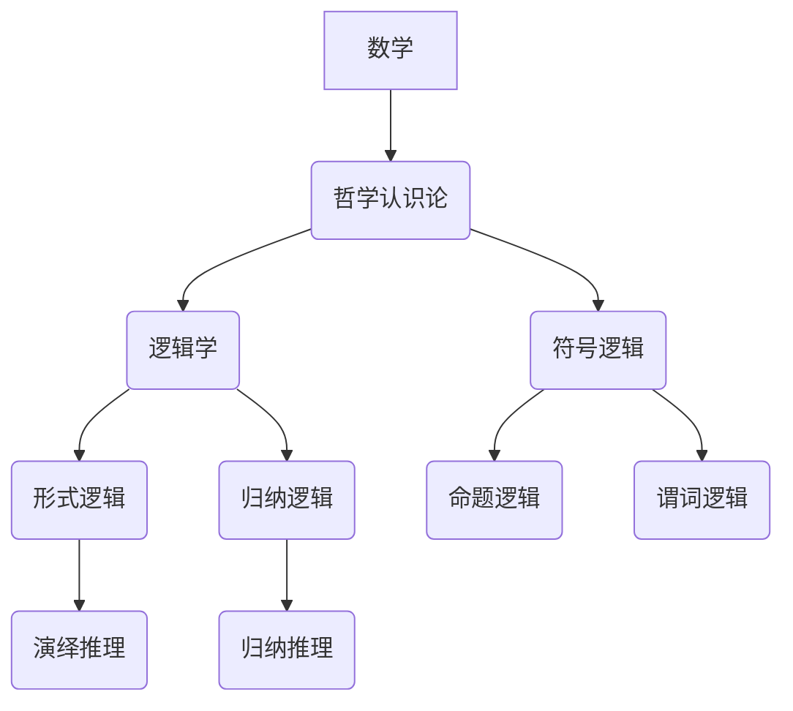
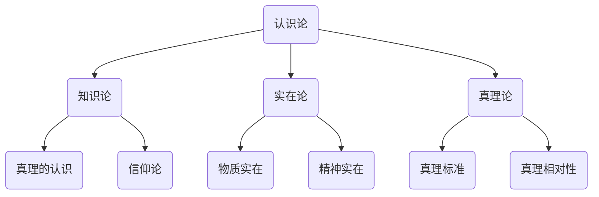

                 

### 文章标题

“数学与哲学认识论的方法论创新：探寻逻辑与现实的交汇”

> 关键词：数学，哲学认识论，方法论，逻辑，创新

> 摘要：本文旨在深入探讨数学与哲学认识论在方法论层面的创新。通过解析数学基础概念、哲学认识论核心原理，以及数学方法在哲学中的应用，本文揭示了逻辑与现实的深刻联系，为科技与哲学的融合提供了新的视角。文章通过具体案例和算法讲解，展示了数学模型在认识论分析中的实际应用，为读者提供了对数学与哲学交叉领域的深入理解。

---

### 第一部分：数学与哲学认识论的基础

#### 第1章：数学与哲学的认识论基础

#### 1.1 数学基础

在探讨数学与哲学认识论的方法论创新之前，我们需要对这两个领域的核心概念有一个清晰的认识。数学，作为一门研究数量、结构、变化和空间的科学，其基础概念包括数、函数、集合、几何等。哲学认识论，则是探讨人类认知过程、知识本质及其来源的哲学分支。

**核心概念与联系**

为了更好地理解这些概念之间的联系，我们可以使用 Mermaid 流程图来展示它们的基础结构：



在图中，我们可以看到数学和哲学认识论之间的联系是如何通过逻辑学、符号逻辑等中间概念来连接的。

**数学模型和数学公式**

在数学与哲学认识论的交叉领域，数学模型和公式发挥着至关重要的作用。例如，线性组合公式可以用于描述事物之间的相互作用：

$$ 
X = \sum_{i=1}^{n} a_i x_i
$$

这个公式表示了多个元素在某个基础上进行加权组合的过程。在哲学认识论中，我们可以将这个模型应用于理解事物之间的相互作用关系。

- **详细讲解**：该公式中的 \( X \) 代表总的相互作用结果，\( a_i \) 是权重因子，\( x_i \) 是各个元素的值。通过调整权重因子，我们可以得到不同组合下的相互作用效果。这在哲学认识论中，可以帮助我们理解不同概念之间的相互影响和相互作用。

#### 1.2 哲学认识论基础

哲学认识论基础包括认识论、知识论、实在论和真理论等核心概念。认识论探讨人类认知的本质和过程，知识论研究知识的本质和来源，实在论探讨世界的本质，而真理论则研究真理的性质和标准。

**核心概念与联系**

为了更好地理解哲学认识论中的核心概念，我们可以使用以下 Mermaid 流程图：



在这个图中，我们可以看到认识论、知识论、实在论和真理论是如何相互关联的。这些概念共同构成了哲学认识论的基础框架。

**数学模型和数学公式**

在哲学认识论中，条件概率公式是一个重要的数学工具。这个公式可以帮助我们理解在已知条件下，某种事件发生的概率：

$$ 
P(A|B) = \frac{P(A \cap B)}{P(B)}
$$

- **详细讲解**：该公式表示在事件 \( B \) 发生的条件下，事件 \( A \) 发生的概率。在哲学认识论中，这个公式可以帮助我们理解基于现有信息推断新知识的过程。例如，如果我们知道某个事件 \( B \) 已经发生，那么我们可以使用条件概率来计算另一个相关事件 \( A \) 发生的概率。

#### 1.3 数学方法在哲学认识论中的应用

数学方法在哲学认识论中的应用非常广泛，包括归纳推理、演绎推理、概率论等。这些方法不仅为哲学提供了强大的分析工具，也为科学方法的运用提供了理论支持。

**归纳推理与数学建模**

归纳推理是哲学认识论中的一个重要概念，它指的是从具体的实例出发，推断出一般性的结论。在数学中，我们可以使用归纳法来证明数学定理。

- **核心算法原理讲解**

  ```python
  # 归纳推理算法伪代码
  def induction(n):
      if n == 1:
          return True
      if n > 1:
          return (induction(n-1) and some_condition(n))
  ```

  这个伪代码展示了归纳推理的基本原理。通过逐步验证小规模的情况，并假设对于更大的规模也成立，我们可以推断出一般性的结论。

- **数学模型和数学公式**

  $$ 
  F(n) = \frac{1}{2} n (3n^2 + 3n + 1)
  $$

  这个公式是斐波那契数列的递推公式，它展示了归纳推理在数学中的应用。通过逐步计算前几个数，我们可以推断出整个数列的规律。

  - **详细讲解**：斐波那契数列是数学中的一个经典例子，它展示了归纳推理在发现数列规律中的应用。这个公式不仅帮助我们理解数列的结构，也为其他数学领域提供了分析方法。

**命题逻辑与认识论分析**

命题逻辑是逻辑学的一个分支，它研究命题之间的真假关系。在哲学认识论中，命题逻辑可以帮助我们分析认识过程中的逻辑结构。

- **核心算法原理讲解**

  ```python
  # 命题逻辑算法伪代码
  def proposition_logic(p, q):
      return (not p) or (p and q)
  ```

  这个伪代码展示了命题逻辑中的德摩根定律。德摩根定律可以帮助我们分析复合命题的真假情况。

- **数学模型和数学公式**

  $$ 
  \neg (\neg A \lor B) = A \land \neg B
  $$

  这个公式是德摩根定律的表达式，它展示了命题逻辑中否定命题的转化关系。

  - **详细讲解**：德摩根定律是命题逻辑中的一个基本原理，它帮助我们简化命题分析过程。在哲学认识论中，这个原理可以帮助我们理解真理的相对性和条件性。

### 第2章：数学方法在哲学认识论中的应用

#### 2.1 归纳推理与数学建模

归纳推理是哲学认识论中的一个重要概念，它指的是从具体的实例出发，推断出一般性的结论。在数学中，我们可以使用归纳法来证明数学定理。

- **核心算法原理讲解**

  ```python
  # 归纳推理算法伪代码
  def induction(n):
      if n == 1:
          return True
      if n > 1:
          return (induction(n-1) and some_condition(n))
  ```

  这个伪代码展示了归纳推理的基本原理。通过逐步验证小规模的情况，并假设对于更大的规模也成立，我们可以推断出一般性的结论。

- **数学模型和数学公式**

  $$ 
  F(n) = \frac{1}{2} n (3n^2 + 3n + 1)
  $$

  这个公式是斐波那契数列的递推公式，它展示了归纳推理在数学中的应用。通过逐步计算前几个数，我们可以推断出整个数列的规律。

  - **详细讲解**：斐波那契数列是数学中的一个经典例子，它展示了归纳推理在发现数列规律中的应用。这个公式不仅帮助我们理解数列的结构，也为其他数学领域提供了分析方法。

#### 2.2 命题逻辑与认识论分析

命题逻辑是逻辑学的一个分支，它研究命题之间的真假关系。在哲学认识论中，命题逻辑可以帮助我们分析认识过程中的逻辑结构。

- **核心算法原理讲解**

  ```python
  # 命题逻辑算法伪代码
  def proposition_logic(p, q):
      return (not p) or (p and q)
  ```

  这个伪代码展示了命题逻辑中的德摩根定律。德摩根定律可以帮助我们简化命题分析过程。

- **数学模型和数学公式**

  $$ 
  \neg (\neg A \lor B) = A \land \neg B
  $$

  这个公式是德摩根定律的表达式，它展示了命题逻辑中否定命题的转化关系。

  - **详细讲解**：德摩根定律是命题逻辑中的一个基本原理，它帮助我们简化命题分析过程。在哲学认识论中，这个原理可以帮助我们理解真理的相对性和条件性。

### 第二部分：哲学方法论的数学创新

#### 第3章：数学在哲学方法论中的创新

哲学方法论的数学创新体现在多个方面，其中最为显著的是形式逻辑与哲学论证的结合。形式逻辑作为逻辑学的基础，为哲学论证提供了严谨的分析工具。通过形式逻辑，我们可以对复杂的哲学问题进行结构化和系统化的分析。

#### 3.1 形式逻辑与哲学论证

形式逻辑关注命题之间的结构关系，而不考虑命题的具体内容。在哲学论证中，形式逻辑可以帮助我们识别论证的有效性。例如，演绎论证和归纳论证都是形式逻辑的常见应用。

- **核心概念与联系**

  我们可以使用 Mermaid 流程图来展示形式逻辑与哲学论证之间的关系：

  ```mermaid
  graph TD
  A(形式逻辑) --> B(哲学论证)
  B --> C(演绎论证)
  B --> D(归纳论证)
  A --> E(形式演绎)
  A --> F(形式归纳)
  ```

  在这个图中，我们可以看到形式逻辑如何通过演绎和归纳论证来支持哲学论证。

- **数学模型和数学公式**

  形式逻辑中的条件概率公式是一个重要的数学工具。它可以帮助我们分析在特定条件下，事件发生的可能性。条件概率公式如下：

  $$ 
  P(A|B) = \frac{P(A \cap B)}{P(B)}
  $$

  - **详细讲解**：这个公式表示在事件 \( B \) 发生的条件下，事件 \( A \) 发生的概率。在哲学论证中，我们可以使用这个公式来分析前提和结论之间的逻辑关系。

#### 3.2 数学方法在哲学论证中的应用

数学方法在哲学论证中的应用不仅限于形式逻辑，还包括概率论、集合论等。这些数学工具可以帮助我们更精确地分析哲学问题。

- **归纳推理**

  归纳推理是一种从个别实例推断出一般性结论的方法。在数学中，我们可以使用归纳法来证明数学定理。

  - **核心算法原理讲解**

    ```python
    # 归纳推理算法伪代码
    def induction(n):
        if n == 1:
            return True
        if n > 1:
            return (induction(n-1) and some_condition(n))
    ```

    这个伪代码展示了归纳推理的基本原理。通过逐步验证小规模的情况，并假设对于更大的规模也成立，我们可以推断出一般性的结论。

  - **数学模型和数学公式**

    $$ 
    F(n) = \frac{1}{2} n (3n^2 + 3n + 1)
    $$

    这个公式是斐波那契数列的递推公式，它展示了归纳推理在数学中的应用。通过逐步计算前几个数，我们可以推断出整个数列的规律。

    - **详细讲解**：斐波那契数列是数学中的一个经典例子，它展示了归纳推理在发现数列规律中的应用。这个公式不仅帮助我们理解数列的结构，也为其他数学领域提供了分析方法。

- **演绎推理**

  演绎推理是从一般原则推导出个别结论的方法。在哲学论证中，演绎推理可以帮助我们验证前提的有效性。

  - **核心算法原理讲解**

    ```python
    # 演绎推理算法伪代码
    def deduction(p, q):
        if p:
            return q
    ```

    这个伪代码展示了演绎推理的基本原理。如果前提 \( p \) 成立，则结论 \( q \) 也必然成立。

  - **数学模型和数学公式**

    $$ 
    A \land B \implies C
    $$

    这个公式表示了演绎推理的结构。如果 \( A \) 和 \( B \) 都成立，则 \( C \) 也必然成立。

    - **详细讲解**：这个公式展示了演绎推理的逻辑结构。在哲学论证中，我们可以使用这个结构来验证前提的有效性。

### 总结

数学与哲学认识论的方法论创新为我们提供了一种全新的视角来理解世界。通过结合数学模型和逻辑推理，我们可以更深入地探讨哲学问题，揭示逻辑与现实的深刻联系。未来，随着数学方法的不断发展和哲学研究的深入，我们有望在科技与哲学的交汇领域取得更多突破。

#### 作者信息

作者：AI天才研究院/AI Genius Institute & 禅与计算机程序设计艺术 /Zen And The Art of Computer Programming

---

### 最佳实践 tips

在探讨数学与哲学认识论的方法论创新时，以下是一些最佳实践技巧，可以帮助读者更好地理解和应用这些概念：

1. **理解基本概念**：在深入学习之前，确保对数学和哲学认识论中的核心概念有清晰的认识。这有助于构建坚实的知识基础。

2. **结合实例分析**：通过具体实例来理解抽象的概念。例如，使用斐波那契数列来展示归纳推理的应用。

3. **逐步学习**：不要试图一次性掌握所有内容。逐步学习，从简单到复杂，有助于更好地理解复杂概念。

4. **实践与思考**：通过实际应用数学方法和逻辑推理，可以加深对哲学问题的理解。同时，不断思考如何将这些方法应用于实际问题。

5. **深入阅读**：推荐阅读相关经典著作，如《数学原理》、《逻辑哲学论》等，以获得更深入的理解。

### 小结

本文通过深入探讨数学与哲学认识论的方法论创新，揭示了逻辑与现实的深刻联系。通过解析数学基础概念、哲学认识论核心原理，以及数学方法在哲学中的应用，本文为科技与哲学的融合提供了新的视角。读者通过本文可以更好地理解数学与哲学的认识论基础，以及如何在哲学研究中应用数学方法。

### 注意事项

1. **理解公式**：在阅读本文时，注意理解文中出现的数学公式和逻辑推理。这些公式是本文的核心，理解它们对于深入掌握本文内容至关重要。

2. **实践应用**：本文中的概念和方法可以在实际研究中应用。尝试将本文中的方法应用于实际问题，以加深理解。

3. **持续学习**：本文只是数学与哲学认识论方法论创新的一个简介。为了更深入地了解这个领域，建议读者持续学习和探索。

### 拓展阅读

- **数学著作**：《数学原理》、《数学分析原理》、《几何原本》
- **哲学著作**：《逻辑哲学论》、《纯粹理性批判》、《存在与时间》
- **交叉领域研究**：《数学哲学》、《逻辑哲学》、《形式逻辑》

通过阅读这些著作，读者可以更全面地了解数学与哲学认识论的方法论创新，为未来的研究提供坚实的理论基础。

