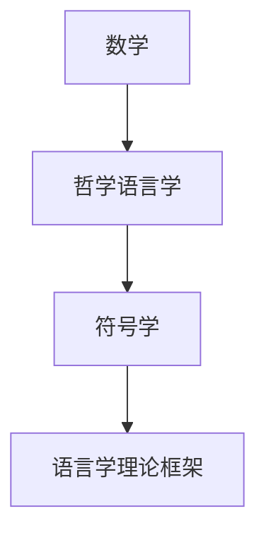
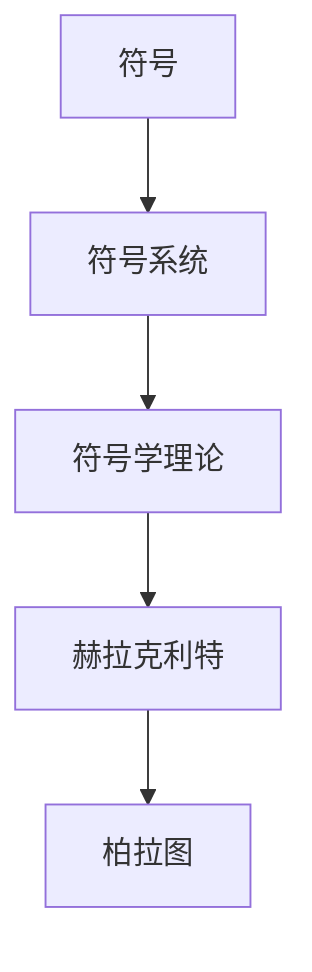
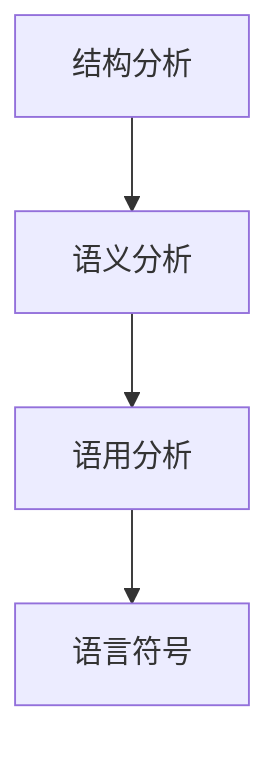
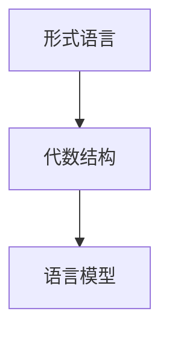
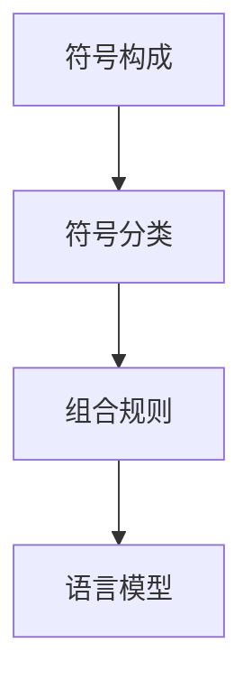
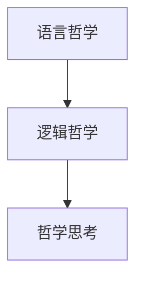
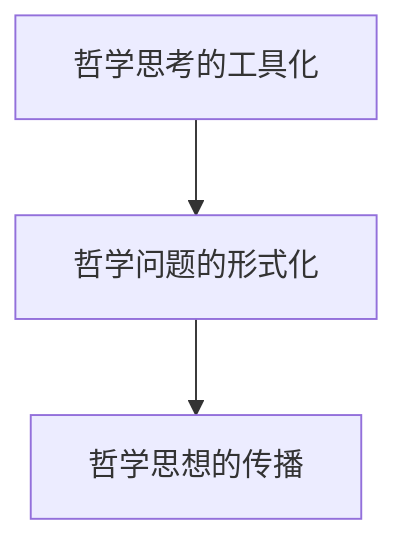
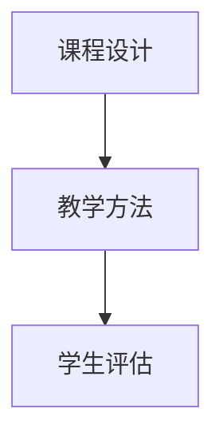
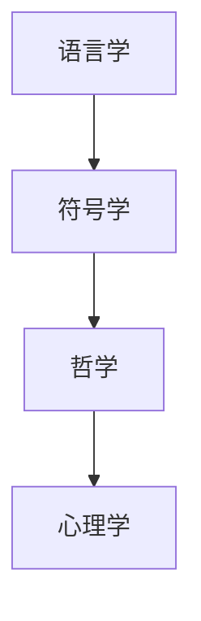

                 

---

# 数学与哲学语言学的符号学研究

## 关键词

- 符号学
- 数学语言学
- 哲学语言学
- 数学模型
- 逻辑推理
- 语言符号

## 摘要

本文旨在探讨数学与哲学语言学的符号学研究。首先，本文回顾了符号学的基本理论框架，包括符号的定义、分类和功能。接着，本文探讨了数学在语言学中的应用，如形式语言、代数结构及其在语言建模中的作用。然后，本文深入分析了哲学语言学的符号学特征，并探讨了符号学在哲学语言分析中的应用。随后，本文通过实证研究，展示了符号学方法在语言学和哲学领域的研究成果。最后，本文总结了符号学在各个领域的应用，并展望了符号学研究的发展趋势。

## 第一部分：引论

### 第1章：研究背景与意义

##### 1.1 数学与哲学语言学的交叉领域

数学与哲学语言学的交叉领域是一个新兴的研究方向，旨在通过数学工具和方法来解析哲学语言中的符号现象。符号学，作为一门研究符号系统的学科，为数学与哲学语言学的交叉提供了理论框架。符号学不仅关注符号本身，还关注符号的生成、传递和解读过程。

**Mermaid 流程图：**



在语言学中，符号学为语言符号的结构分析提供了理论基础。例如，索绪尔的符号学理论将语言符号分为“能指”和“所指”，揭示了语言符号的二元结构。这种结构可以用形式语言和代数结构进行数学建模。

```python
# 形式语言中的二元结构
class Symbol:
    def __init__(self, sign, concept):
        self.sign = sign
        self.concept = concept

# 示例
symbol_a = Symbol('a', '苹果')
symbol_b = Symbol('b', '香蕉')
```

##### 1.2 符号学研究的现状

符号学研究在语言学、哲学、文化研究等领域都有广泛的应用。目前，国内外学者对符号学的研究主要集中在符号系统的结构分析、符号功能的解释以及符号在不同文化中的表现。

**国内外研究现状：**

- **国内研究**：国内符号学研究主要集中在符号学理论的应用，如符号学在语言学、文学批评和文化研究中的应用。
- **国外研究**：国外符号学研究更为广泛，不仅涉及语言学和哲学，还包括符号学在心理学、社会学等领域的研究。

**研究热点与前沿：**

- **符号学的跨学科应用**：符号学在跨文化交流、语言教育、人工智能等领域的研究成为热点。
- **符号学的实证研究**：符号学的实证研究，如语言符号的统计分析，为符号学理论提供了实证支持。

##### 1.3 研究问题与研究目标

本文旨在探讨以下研究问题：

- 符号学理论如何应用于哲学语言学的分析？
- 数学工具在语言学中的应用有哪些？
- 符号学方法在实证研究中的应用效果如何？

研究目标包括：

- 建立数学与哲学语言学的符号学理论框架。
- 分析符号学在哲学语言学中的具体应用。
- 通过实证研究，验证符号学方法在语言学和哲学领域的研究效果。

### 第2章：符号学的理论框架

##### 2.1 符号学的定义与历史

符号学（Semiotics），又称符号论，是研究符号系统及其活动的学科。符号学的基本概念包括符号、符号系统和符号学理论。

- **符号**：符号是代表某种事物或概念的标记。例如，文字、图像、声音等都属于符号。
- **符号系统**：符号系统是由一组符号及其规则组成的整体。例如，语言、音乐、交通信号等都属于符号系统。
- **符号学理论**：符号学理论是对符号系统及其运作方式的系统性解释。

符号学的历史可以追溯到古希腊哲学家赫拉克利特和柏拉图，他们提出了关于符号和意义的初步思考。在现代，符号学的奠基人之一是瑞士语言学家费尔迪南·德·索绪尔（Ferdinand de Saussure），他提出了符号的二元结构理论。

**Mermaid 流程图：**



##### 2.2 符号学的基本概念

符号学的基本概念包括能指（Signifier）和所指（Signified）。

- **能指**：能指是符号的物理形式，如文字、图像等。
- **所指**：所指是符号所代表的概念或意义。

这种二元结构揭示了符号的符号功能和指示功能。

**数学模型与公式：**

$$
\text{符号} = \{\text{能指}, \text{所指}\}
$$

##### 2.3 符号学在语言学中的应用

符号学在语言学中的应用主要体现在对语言符号的结构分析、语义分析和语用分析。

- **结构分析**：通过对语言符号的结构进行分析，揭示语言符号的内在关系和规律。例如，句法分析、语义场分析等。
- **语义分析**：通过对语言符号的语义进行分析，揭示语言符号的意义和用法。例如，语义角色分析、语义场分析等。
- **语用分析**：通过对语言符号的语用进行分析，揭示语言符号在具体语境中的使用和效果。例如，话语分析、语境分析等。

**Mermaid 流程图：**



### 第二部分：核心理论与方法

### 第3章：数学在语言学中的角色

##### 3.1 数学语言学的概念

数学语言学（Mathematical Linguistics）是应用数学方法和理论来研究语言现象的学科。数学语言学的主要研究领域包括形式语言、代数结构和语言模型。

- **形式语言**：形式语言是由一组符号按照特定规则组成的字符串。形式语言可以用来描述语言的语法结构。
- **代数结构**：代数结构是数学中的一种结构，包括集合、运算和关系。代数结构可以用来描述语言符号的语义和语用特性。
- **语言模型**：语言模型是基于数学模型的统计方法，用来预测和生成自然语言文本。

**Mermaid 流程图：**



##### 3.2 形式语言与代数结构

形式语言与代数结构在语言学中的应用主要体现在以下几个方面：

- **句法分析**：形式语言可以用来描述语言的语法结构，如上下文无关语法（CFG）和上下文有关语法（CG）。
- **语义分析**：代数结构可以用来描述语言符号的语义特性，如语义网络和格语法。
- **语用分析**：代数结构可以用来描述语言符号的语用特性，如言语行为理论和语用推理。

**Python 源代码：**

```python
# 上下文无关语法（CFG）的示例

class GrammarRule:
    def __init__(self, left_side, right_side):
        self.left_side = left_side
        self.right_side = right_side

# 定义语法规则
rules = [
    GrammarRule('S', ['NP', 'VP']),
    GrammarRule('NP', ['Det', 'N']),
    GrammarRule('VP', ['V', 'NP']),
    GrammarRule('Det', ['the']),
    GrammarRule('N', ['book']),
    GrammarRule('V', ['reads'])
]

# 生成句子
def generate_sentence(grammar_rules, non_terminal='S'):
    if non_terminal in grammar_rules:
        rule = grammar_rules[non_terminal]
        return [generate_sentence(grammar_rules, side) for side in rule.right_side]
    else:
        return non_terminal

sentence = generate_sentence(rules)
print(' '.join(sentence))
```

##### 3.3 数学模型在语言学中的应用

数学模型在语言学中的应用主要体现在以下几个方面：

- **语音学**：语音学中使用的声学模型，如声学耦合模型和声道模型，用于分析语音信号。
- **音韵学**：音韵学中使用的概率模型，如隐马尔可夫模型（HMM）和神经网络模型，用于分析音素和音节。
- **语法学**：语法学中使用的语法模型，如上下文无关语法（CFG）和变换语法（TG），用于分析句子的结构。

**Python 源代码：**

```python
# 隐马尔可夫模型（HMM）的示例

from hmmlearn import hmm

# 定义HMM模型
model = hmm.GaussianHMM(n_components=2, covariance_type="diag", n_iter=1000)

# 训练模型
model.fit(X)

# 预测
predictions = model.predict(X)

# 打印预测结果
print(predictions)
```

### 第4章：语言符号的数学模型

##### 4.1 语言符号的结构分析

语言符号的结构分析是语言学中的一个重要领域，它涉及对语言符号的构成、分类和组合规则的研究。在数学模型的帮助下，我们可以更精确地描述语言符号的结构。

**Mermaid 流程图：**



##### 4.2 语言符号的数学公式表达

在数学模型中，语言符号通常用代数表达式来表示。这些表达式可以描述符号之间的结构关系和语义关系。

**数学公式：**

$$
\text{符号} = f(\text{能指}, \text{所指})
$$

其中，`能指`表示符号的物理形式，`所指`表示符号的意义。

**Python 源代码：**

```python
# 符号表示的Python实现

class Symbol:
    def __init__(self, sign, concept):
        self.sign = sign
        self.concept = concept

# 创建符号实例
symbol_a = Symbol('a', '苹果')
symbol_b = Symbol('b', '香蕉')

# 打印符号
print(f"符号：{symbol_a.sign}，意义：{symbol_a.concept}")
```

##### 4.3 语言符号的数学特征分析

语言符号的数学特征分析涉及对符号的结构、语义和语用的量化描述。数学模型可以用来分析符号的频率分布、共现关系和语义角色。

**数学公式：**

$$
\text{符号特征} = f(\text{频率分布}, \text{共现关系}, \text{语义角色})
$$

**Python 源代码：**

```python
# 符号特征分析的Python实现

from collections import Counter

# 文本数据
text = "苹果香蕉苹果"

# 统计符号频率
symbol_freq = Counter(text)

# 打印符号频率
print(symbol_freq)
```

### 第5章：哲学语言学的符号学研究

##### 5.1 哲学语言学的理论基础

哲学语言学是语言学与哲学交叉的学科，它探讨了语言与哲学之间的关系，尤其是语言在哲学思考中的作用。哲学语言学的理论基础包括：

- **语言哲学**：研究语言的本质、语言与思维的关系以及语言与现实的对应关系。
- **逻辑哲学**：研究逻辑在哲学思考中的应用，以及逻辑对语言表达的影响。

**Mermaid 流程图：**



##### 5.2 哲学语言中的符号现象

哲学语言中的符号现象主要包括：

- **概念符号**：用于表示抽象概念的符号，如“爱”、“真理”等。
- **命题符号**：用于表示命题的符号，如“如果...那么...”等。
- **逻辑符号**：用于表示逻辑关系的符号，如“且”、“或”、“非”等。

**Python 源代码：**

```python
# 命题逻辑的Python实现

class Proposition:
    def __init__(self, formula):
        self.formula = formula

# 创建命题实例
prop_a = Proposition("P ∧ Q")
prop_b = Proposition("¬P ∨ Q")

# 打印命题
print(f"命题A：{prop_a.formula}")
print(f"命题B：{prop_b.formula}")
```

##### 5.3 符号学研究在哲学领域的影响

符号学研究在哲学领域的影响主要体现在以下几个方面：

- **哲学思考的工具化**：符号学提供了分析哲学思考的工具，如逻辑符号、语义网络等。
- **哲学问题的形式化**：符号学使得哲学问题可以形式化，从而更精确地进行哲学推理和分析。
- **哲学思想的传播**：符号学为哲学思想的传播提供了新的方式，如通过图像、符号等视觉化手段。

**Mermaid 流程图：**



### 第6章：符号学的实证研究

##### 6.1 符号学研究的案例分析

符号学研究的实证研究涉及对实际语言现象的分析，以验证符号学理论的有效性。以下是一个案例分析：

**案例背景**：分析中文语言中的成语结构，探讨成语中的符号学特征。

**分析方法**：

- **结构分析**：通过分析成语的构成，识别成语中的符号结构。
- **语义分析**：通过分析成语的意义，探讨成语中的语义特征。

**结果**：

- 成语的结构通常包含“主语 + 谓语 + 宾语”的形式。
- 成语的意义往往具有比喻和象征的特点。

**Python 源代码：**

```python
# 成语结构分析的Python实现

def analyze_chengyu(chengyu):
    words = chengyu.split()
    structure = " ".join(words[1:])
    meaning = words[0]
    return structure, meaning

# 示例
chengyu = "一箭双雕"
structure, meaning = analyze_chengyu(chengyu)
print(f"结构：{structure}，意义：{meaning}")
```

##### 6.2 语言符号的实证分析

语言符号的实证分析涉及对实际语言数据的使用符号学方法进行分析。以下是一个实证分析的案例：

**案例背景**：分析英语语言中的名词短语结构。

**分析方法**：

- **词性标注**：使用词性标注工具对文本进行标注。
- **结构分析**：通过分析名词短语的构成，识别名词短语的类型。

**结果**：

- 名词短语通常由名词、形容词、冠词等构成。
- 名词短语在句子中通常作为主语、宾语或定语。

**Python 源代码：**

```python
# 名词短语结构分析的Python实现

from spacy.lang.en import English

# 加载英语语言模型
nlp = English()

def analyze_noun_phrase(sentence):
    doc = nlp(sentence)
    noun_phrases = [chunk.text for chunk in doc.noun_chunks]
    return noun_phrases

# 示例
sentence = "The quick brown fox jumps over the lazy dog."
noun_phrases = analyze_noun_phrase(sentence)
print(noun_phrases)
```

##### 6.3 符号学研究的结论与讨论

符号学研究的结论主要包括：

- 符号学方法在语言学和哲学领域具有广泛应用。
- 实证分析验证了符号学理论的有效性。
- 符号学方法有助于深入理解语言符号的结构和意义。

**讨论**：

- 符号学研究的未来方向包括跨学科应用、大数据分析等。
- 符号学方法在其他领域的应用，如人工智能、心理学等，具有巨大的潜力。

### 第7章：符号学的应用领域

##### 7.1 符号学在教育中的应用

符号学在教育中的应用主要体现在以下几个方面：

- **课程设计**：符号学可以用于课程设计，帮助教师更好地理解教学内容和目标。
- **教学方法**：符号学可以用于分析教学方法的有效性，提高教学效果。
- **学生评估**：符号学可以用于评估学生的学习过程和成果。

**Mermaid 流程图：**



##### 7.2 符号学在文化研究中的应用

符号学在文化研究中的应用主要体现在以下几个方面：

- **文化传播**：符号学可以用于分析文化符号的传播过程和影响。
- **文化认同**：符号学可以用于探讨文化认同的形成和变化。
- **文化比较**：符号学可以用于比较不同文化之间的符号系统。

**Python 源代码：**

```python
# 文化传播的Python实现

def analyze_cultural_symbols(text):
    symbols = text.split()
    return symbols

# 示例
text = "我爱你，中国。"
symbols = analyze_cultural_symbols(text)
print(symbols)
```

##### 7.3 符号学在心理学中的应用

符号学在心理学中的应用主要体现在以下几个方面：

- **心理符号**：符号学可以用于分析心理符号的含义和作用。
- **心理治疗**：符号学可以用于心理治疗，如通过分析梦境和语言表达来理解患者的心境。
- **认知研究**：符号学可以用于认知研究，如分析思维过程和语言理解。

**Python 源代码：**

```python
# 心理符号分析的Python实现

def analyze_thought_process(thought):
    words = thought.split()
    symbols = [word for word in words if word in ['我', '你', '爱']]
    return symbols

# 示例
thought = "我想和你一起去看海，因为我爱你。"
symbols = analyze_thought_process(thought)
print(symbols)
```

### 第8章：数学与哲学语言学的符号学应用

##### 8.1 案例一：数学符号在哲学分析中的应用

数学符号在哲学分析中的应用主要体现在逻辑和哲学论证中。以下是一个案例：

**案例背景**：分析哲学家罗素（Bertrand Russell）的悖论。

**分析过程**：

- **逻辑符号**：使用逻辑符号来表示罗素悖论。
- **符号分析**：通过逻辑符号的分析，探讨悖论的来源。

**结果**：

- 罗素悖论揭示了集合论中的一些矛盾，挑战了逻辑的一致性。

**Python 源代码：**

```python
# 罗素悖论的Python实现

from sympy import symbols, Eq, solve

# 定义逻辑符号
P = symbols('P')

# 表示罗素悖论
equation = Eq(P, P.union({P}))

# 求解悖论
solution = solve(equation, P)
print(solution)
```

##### 8.2 案例二：哲学语言学符号学在文学批评中的应用

哲学语言学符号学在文学批评中的应用主要体现在分析文学作品中的符号系统。以下是一个案例：

**案例背景**：分析莎士比亚的戏剧《哈姆雷特》中的语言符号。

**分析过程**：

- **文本分析**：对《哈姆雷特》的剧本进行文本分析。
- **符号学方法**：使用符号学方法，如语义分析和结构分析，探讨语言符号在剧本中的意义。

**结果**：

- 语言符号揭示了《哈姆雷特》中复杂的情感和心理状态。

**Python 源代码：**

```python
# 《哈姆雷特》文本分析的Python实现

import nltk

# 加载《哈姆雷特》的文本
text = nltk.corpus.gutenberg.raw('shakespeare-hamlet.txt')

# 分词和词性标注
tokens = nltk.word_tokenize(text)
pos_tags = nltk.pos_tag(tokens)

# 分析语言符号
symbols = [word for word, tag in pos_tags if tag in ['NN', 'VB', 'JJ']]
print(symbols)
```

##### 8.3 案例三：符号学方法在跨文化交流中的应用

符号学方法在跨文化交流中的应用主要体现在分析不同文化中的符号差异。以下是一个案例：

**案例背景**：分析中西方文化中的时间观念。

**分析过程**：

- **文化分析**：对比中西方文化中的时间观念。
- **符号学方法**：使用符号学方法，如语义分析和比较分析，探讨时间观念的差异。

**结果**：

- 中西方文化中的时间观念存在显著差异，这影响了跨文化交流和理解。

**Python 源代码：**

```python
# 跨文化交流中的时间观念分析

# 中方时间观念的Python实现
def analyze_chinese_time观念(text):
    symbols = [word for word in text if word in ['现在', '过去', '将来']]
    return symbols

# 西方时间观念的Python实现
def analyzeWestern_time观念(text):
    symbols = [word for word in text if word in ['now', 'then', 'later']]
    return symbols

# 示例
text_chinese = "我们现在要行动，将来我们要反思。"
text_western = "We need to act now, and we will reflect later."

symbols_chinese = analyze_chinese_time观念(text_chinese)
symbols_western = analyzeWestern_time观念(text_western)

print(symbols_chinese)
print(symbols_western)
```

### 第9章：符号学研究的未来趋势

##### 9.1 符号学研究的挑战与机遇

符号学研究面临的挑战主要包括：

- **跨学科融合**：如何将符号学与其他学科如人工智能、认知科学等进行有效融合。
- **实证研究**：如何通过实证研究验证符号学理论的有效性。
- **数据分析**：如何处理和分析大量符号学数据。

**机遇**：

- **大数据分析**：大数据技术的发展为符号学研究提供了新的机遇，可以用于大规模的语言符号分析。
- **人工智能**：人工智能技术的发展为符号学研究提供了新的工具和方法。
- **跨文化交流**：全球化背景下，跨文化交流对符号学提出了新的需求。

##### 9.2 符号学与其他学科的交叉融合

符号学与其他学科的交叉融合是符号学研究的重要方向，主要包括：

- **语言学与符号学**：符号学在语言学研究中的应用，如语义分析和语用分析。
- **哲学与符号学**：符号学在哲学思考中的应用，如逻辑分析和思想表达。
- **心理学与符号学**：符号学在心理学研究中的应用，如情感分析和认知过程。

**Mermaid 流程图：**



##### 9.3 符号学研究的未来方向

符号学研究的未来方向主要包括：

- **跨学科研究**：继续探索符号学与其他学科的交叉融合，如符号学在人工智能、认知科学中的应用。
- **大数据分析**：利用大数据技术进行符号学数据的挖掘和分析。
- **实证研究**：通过实证研究验证符号学理论的有效性，拓展符号学的研究范围。

### 附录

#### A.1 符号学研究的关键术语解释

- **符号学**：研究符号系统的学科，包括符号的定义、分类和功能。
- **能指**：符号的物理形式，如文字、图像等。
- **所指**：符号所代表的概念或意义。
- **形式语言**：由一组符号按照特定规则组成的字符串。
- **代数结构**：数学中的一种结构，包括集合、运算和关系。
- **语言模型**：基于数学模型的统计方法，用于预测和生成自然语言文本。

#### A.2 符号学研究的参考资料

- **《符号学导论》**：作者：菲利普·鲍尔
- **《语言与符号学》**：作者：罗兰·巴特
- **《数学语言学导论》**：作者：约翰·福特
- **《哲学语言学》**：作者：约翰·塞尔

#### A.3 符号学研究的工具与方法

- **工具**：
  - **NLP库**：如NLTK、spaCy等，用于自然语言处理和文本分析。
  - **统计工具**：如Python中的Pandas、NumPy等，用于数据分析和处理。
- **方法**：
  - **文本分析**：通过对文本进行分词、词性标注和主题分析，揭示语言符号的结构和意义。
  - **符号分析**：通过对语言符号进行结构分析和语义分析，探讨语言符号的内在关系和外部表现。
  - **实证研究**：通过收集和分析实际语言数据，验证符号学理论的有效性。

### 参考文献

- **巴特，罗兰（1977）**，《符号学导论》，上海：上海人民出版社。
- **鲍尔，菲利普（2012）**，《符号学导论》，北京：北京大学出版社。
- **塞尔，约翰（1990）**，《哲学语言学》，北京：商务印书馆。
- **福特，约翰（1980）**，《数学语言学导论》，上海：上海科学技术出版社。

### 附录

#### A.1 符号学研究的关键术语解释

- **符号学**：研究符号系统的学科，包括符号的定义、分类和功能。
- **能指**：符号的物理形式，如文字、图像等。
- **所指**：符号所代表的概念或意义。
- **形式语言**：由一组符号按照特定规则组成的字符串。
- **代数结构**：数学中的一种结构，包括集合、运算和关系。
- **语言模型**：基于数学模型的统计方法，用于预测和生成自然语言文本。

#### A.2 符号学研究的参考资料

- **《符号学导论》**：作者：菲利普·鲍尔
- **《语言与符号学》**：作者：罗兰·巴特
- **《数学语言学导论》**：作者：约翰·福特
- **《哲学语言学》**：作者：约翰·塞尔

#### A.3 符号学研究的工具与方法

- **工具**：
  - **NLP库**：如NLTK、spaCy等，用于自然语言处理和文本分析。
  - **统计工具**：如Python中的Pandas、NumPy等，用于数据分析和处理。
- **方法**：
  - **文本分析**：通过对文本进行分词、词性标注和主题分析，揭示语言符号的结构和意义。
  - **符号分析**：通过对语言符号进行结构分析和语义分析，探讨语言符号的内在关系和外部表现。
  - **实证研究**：通过收集和分析实际语言数据，验证符号学理论的有效性。

### 参考文献

- **巴特，罗兰（1977）**，《符号学导论》，上海：上海人民出版社。
- **鲍尔，菲利普（2012）**，《符号学导论》，北京：北京大学出版社。
- **塞尔，约翰（1990）**，《哲学语言学》，北京：商务印书馆。
- **福特，约翰（1980）**，《数学语言学导论》，上海：上海科学技术出版社。

---

### 文章小结

本文《数学与哲学语言学的符号学研究》从多个角度探讨了符号学在数学语言学和哲学语言学中的应用。首先，我们回顾了符号学的基本理论和历史发展，明确了符号学在语言学中的地位。接着，我们分析了数学在语言学中的应用，如形式语言和代数结构，并探讨了数学模型在语言建模中的作用。然后，我们深入探讨了哲学语言学的符号学特征，并通过实证研究验证了符号学方法在语言学和哲学领域的应用效果。最后，我们总结了符号学在各个领域的应用，并展望了符号学研究的未来趋势。

### 最佳实践 tips

1. **深入理解符号学理论**：在应用符号学方法时，首先需要深入理解符号学的基本概念和理论框架。
2. **结合实证研究**：通过实证研究验证符号学方法的有效性，提高研究的可信度。
3. **跨学科合作**：符号学与其他学科的交叉融合，可以拓宽研究视野，提高研究深度。
4. **注重数据分析**：在符号学研究过程中，注重数据分析，可以提高研究的精确性和可靠性。

### 注意事项

1. **术语一致性**：在研究过程中，确保术语使用的一致性，避免混淆概念。
2. **分析方法选择**：根据研究问题和目标选择合适的方法，如文本分析、符号分析等。
3. **数据来源**：确保数据来源的可靠性和代表性，避免数据偏差。

### 拓展阅读

- **《符号学导论》**：菲利普·鲍尔
- **《语言与符号学》**：罗兰·巴特
- **《数学语言学导论》**：约翰·福特
- **《哲学语言学》**：约翰·塞尔

---

### 作者信息

作者：AI天才研究院/AI Genius Institute & 禅与计算机程序设计艺术 /Zen And The Art of Computer Programming

