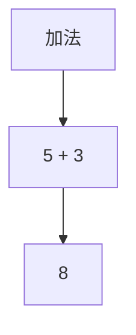
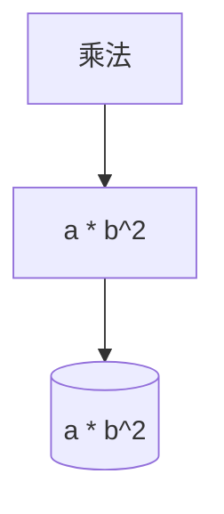
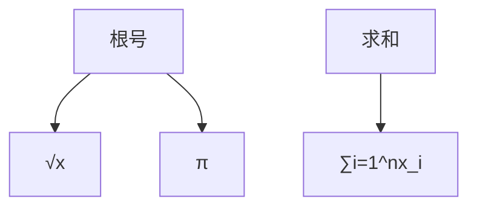
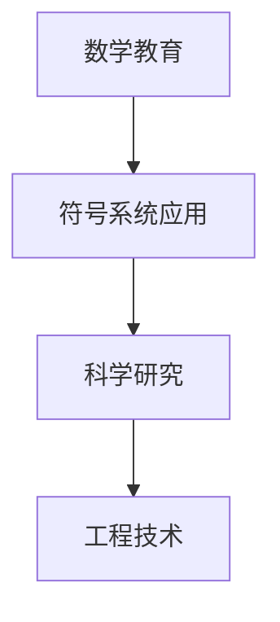
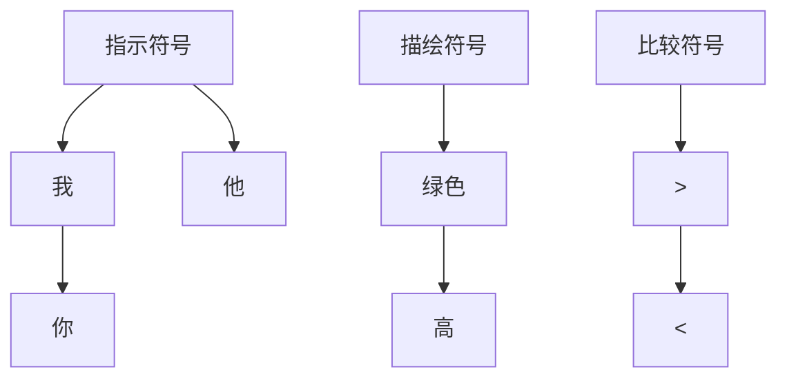
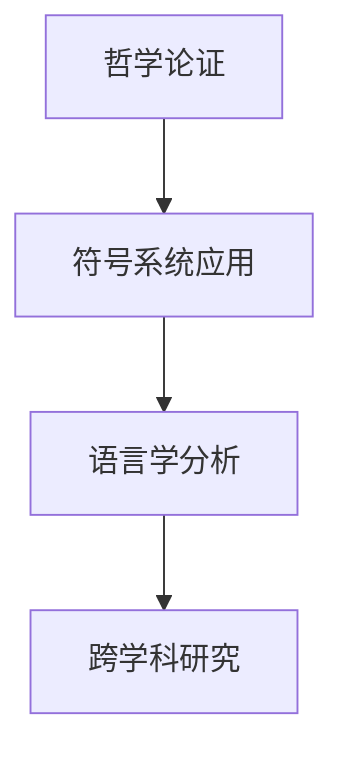
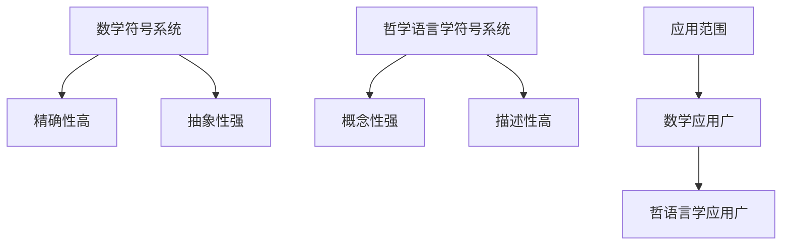
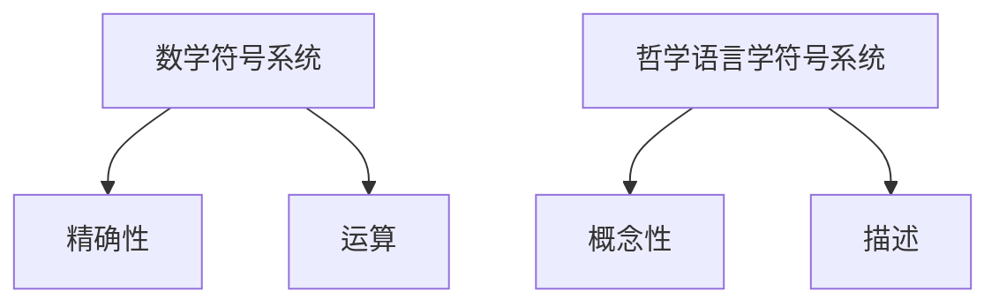
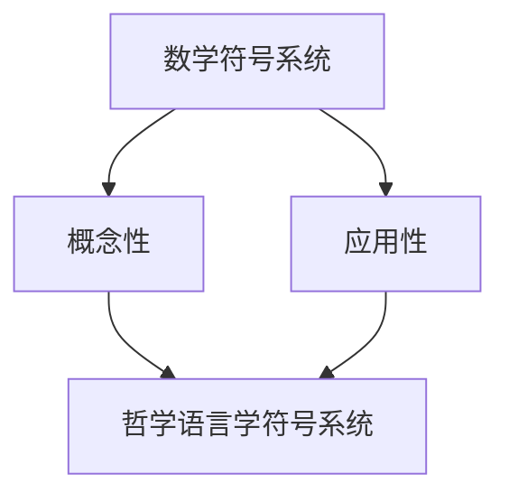

                 

### 标题：数学与哲学语言学的符号系统比较

> **关键词**：数学符号系统、哲学语言学、符号比较、数学模型、伪代码、LaTeX公式

> **摘要**：本文将探讨数学与哲学语言学中的符号系统，比较它们的基本概念、应用领域及其在理论和实践中的重要性。通过详细解析数学和哲学语言学的符号系统，本文旨在揭示两者在符号表示、处理和应用方面的共性和差异，并提供相关算法、模型和实际应用的讲解，以期为读者提供全面的了解和深入的洞察。

### 引言

符号系统是人类知识表达和传递的重要工具，无论是在数学领域还是在哲学语言学中，都扮演着不可或缺的角色。数学中的符号系统是构建数学理论框架的基础，它们使得复杂的数学概念和推理过程变得简洁和直观。哲学语言学的符号系统则帮助我们理解和分析语言、思想和概念的本质。

数学符号系统通常包括基本符号、运算符和特殊符号，如加号（+）、减号（-）、乘号（×）、除号（÷）等。这些符号不仅是数学公式的组成部分，也是数学推理的工具。哲学语言学的符号系统则更侧重于概念和思想的表达，如指示符号、描绘符号和比较符号等。

本文将首先介绍数学与哲学语言学符号系统的基本概念和联系，然后详细比较两者在符号表示、处理和应用方面的共性与差异。接下来，我们将通过数学模型和具体算法的讲解，阐述符号系统在数学和哲学语言学中的实际应用。最后，本文将结合项目实战，展示符号系统在实际开发环境中的应用，并提供详细的代码实现和解读。

### 数学符号系统

数学符号系统是数学语言的核心，它们帮助我们以简洁和系统的方式表达数学概念和推理。数学符号系统的组成部分包括基本符号、运算符和特殊符号。

#### 基本符号

基本符号是数学表达的基础，如数字、字母和括号。数字用于表示数值，字母通常用作变量，表示未知数或可变的量。括号用于改变运算的优先级，确保复杂的表达式得到正确的计算顺序。

#### 常见符号

在数学中，常见符号包括加号（+）、减号（-）、乘号（×）和除号（÷）。这些符号用于表示基本的算术运算。例如，表达式 `5 + 3` 表示5和3的加法运算，结果为8。



#### 运算符

运算符是数学表达中的关键元素，用于指示对数值进行的操作。常见的运算符包括加法、减法、乘法和除法。此外，还包括幂运算、根号运算等。例如，表达式 `a * b^2` 表示变量a与b的平方的乘法运算。



#### 特殊符号

特殊符号用于表示特定的数学概念或操作，如π（圆周率）、√（根号）和∑（求和符号）。这些符号使得复杂的数学表达式更加简洁和易于理解。



#### 应用领域

数学符号系统在多个领域有着广泛的应用。在数学教育中，符号系统是学生理解和掌握数学概念的重要工具。在科学研究领域，符号系统用于表达复杂的数学模型和理论，如物理学中的公式和化学中的方程式。在工程技术中，符号系统则用于设计和分析复杂的系统。



### 哲学语言学符号系统

哲学语言学的符号系统与数学符号系统不同，它更侧重于概念和思想的表达。哲学语言学的符号系统通常包括指示符号、描绘符号和比较符号等。

#### 基本概念

指示符号用于指代特定的事物或概念，如名称和指示词。描绘符号则用于描述或描绘概念的外延，如类别和属性。比较符号用于比较两个或多个概念之间的关系，如“大于”（>）和“小于”（<）。

#### 分类

哲学语言学的符号系统可以分类为指示符号、描绘符号和比较符号。指示符号如“我”、“你”和“他”，用于指代具体的人或事物。描绘符号如“绿色”和“高”，用于描述事物的属性。比较符号如“大于”和“小于”，用于比较两个或多个事物之间的关系。



#### 应用

哲学语言学的符号系统在哲学论证、语言学分析和跨学科研究中有着广泛的应用。在哲学论证中，符号系统用于表达论点和论据，使论证过程更加清晰和严谨。在语言学分析中，符号系统用于描述语言的结构和功能，帮助研究者理解语言的复杂性和多样性。在跨学科研究中，符号系统则成为不同学科之间沟通的桥梁，促进知识的整合和创新。



### 符号系统的比较与联系

数学与哲学语言学的符号系统在结构和应用上存在显著的差异。数学符号系统更注重精确性和系统性，通过符号来表示数学概念和运算。哲学语言学的符号系统则更注重概念和思想的表达，通过符号来描述事物和关系。

#### 比较原则

比较符号系统的原则包括：

- 符号的精确性和抽象性：数学符号系统强调符号的精确性和抽象性，使得复杂的数学概念和运算可以简洁地表示。哲学语言学的符号系统则更注重符号的概念性和描述性。
- 符号的应用范围：数学符号系统广泛应用于数学教育、科学研究和工程技术等领域。哲学语言学的符号系统则更多地用于哲学论证、语言学分析和跨学科研究。



#### 共性与差异

符号系统的共性与差异可以归纳如下：

- **共性**：数学和哲学语言学的符号系统都用于表达概念和思想，都是知识传递和交流的重要工具。
- **差异**：数学符号系统更注重精确性和系统性，符号表示的是具体的数值和运算。哲学语言学的符号系统则更注重概念性和描述性，符号表示的是事物和关系。



### Mermaid流程图展示符号系统的联系

为了更直观地展示数学与哲学语言学符号系统之间的联系，我们可以使用Mermaid流程图来表示。



在这个流程图中，A代表数学符号系统，B代表其概念性，C代表其应用性。D代表哲学语言学符号系统，表示它与数学符号系统之间存在联系。通过这个流程图，我们可以清晰地看到两者之间的互动和相互影响。

### 核心算法原理讲解

在数学和哲学语言学中，符号系统不仅仅是用于表示概念和思想，更是用于进行复杂计算和分析的工具。下面我们将通过伪代码和Python源代码来详细阐述符号系统的核心算法原理。

#### 数学符号系统算法原理

数学中的符号系统算法通常涉及符号的处理和转换。以下是一个简单的伪代码示例，用于描述符号的求值过程。

```python
# 伪代码：求值算法
function evaluate_expression(expression):
    if expression is a number:
        return expression
    else:
        symbols = split(expression by operators)
        result = 0
        for symbol in symbols:
            if symbol is a number:
                result = result + symbol
            else:
                result = result * symbol
        return result
```

这个伪代码展示了如何通过运算符将表达式分解为数字和符号，并按照运算规则进行求值。以下是一个具体的Python实现示例。

```python
# Python实现：求值算法
def evaluate_expression(expression):
    operators = ["+", "-", "*", "/"]
    result = 0
    current_operator = None
    
    for symbol in expression:
        if symbol in operators:
            current_operator = symbol
        else:
            if current_operator == "+":
                result += int(symbol)
            elif current_operator == "-":
                result -= int(symbol)
            elif current_operator == "*":
                result *= int(symbol)
            elif current_operator == "/":
                result /= int(symbol)
            current_operator = None
            
    return result

# 测试
expression = "5 + 3 * 2"
print(evaluate_expression(expression))  # 输出：11
```

#### 哲学语言学符号系统算法原理

哲学语言学的符号系统算法通常涉及符号的分析和理解。以下是一个简单的伪代码示例，用于描述符号的分析过程。

```python
# 伪代码：符号分析算法
function analyze_symbol(symbol):
    if symbol is an indicator:
        return describe_thing(symbol)
    else if symbol is a描绘symbol:
        return describe_attribute(symbol)
    else if symbol is a比较symbol:
        return compare_things(symbol)
```

这个伪代码展示了如何根据符号的类型进行不同的处理。以下是一个具体的Python实现示例。

```python
# Python实现：符号分析算法
def analyze_symbol(symbol):
    if symbol.startswith("我"):
        return "指示：自我"
    elif symbol.startswith("绿色"):
        return "描绘：颜色"
    elif symbol.startswith(">"):
        return "比较：大于"
    else:
        return "未知符号"

# 测试
symbols = ["我很好", "绿色的苹果", "> 5"]
for symbol in symbols:
    print(analyze_symbol(symbol))
```

### 数学模型与公式

在数学和哲学语言学中，模型和公式是表达概念和关系的重要工具。以下我们将使用LaTeX格式书写数学模型和公式，并给出详细的讲解和示例。

#### 常见数学模型

一个常见的数学模型是线性回归模型，用于预测一个变量基于其他变量的关系。线性回归模型可以用以下公式表示：

$$ y = \beta_0 + \beta_1 \cdot x + \varepsilon $$

其中，$y$ 是因变量，$x$ 是自变量，$\beta_0$ 和 $\beta_1$ 是模型的参数，$\varepsilon$ 是误差项。

#### 数学公式讲解

线性回归模型中的公式可以通过以下LaTeX格式书写：

$$
y = \beta_0 + \beta_1 \cdot x + \varepsilon
$$

其中，$\beta_0$ 和 $\beta_1$ 通常通过最小二乘法估计得到。最小二乘法的目标是最小化预测值与实际值之间的误差平方和。

#### 示例

假设我们有一个数据集，其中 $x$ 代表广告支出，$y$ 代表销售额。我们希望通过线性回归模型预测销售额。以下是一个简单的数据集示例：

| 广告支出 (x) | 销售额 (y) |
|-------------|------------|
|      100     |     150    |
|      200     |     250    |
|      300     |     350    |

使用线性回归模型，我们可以得到以下公式：

$$
y = 50 + 1.5x
$$

#### 拓展阅读

对于更复杂的数学模型，如多项式回归、逻辑回归等，可以参考相关数学统计教材和在线资源，如《统计学习方法》和Kaggle上的课程。

### 项目实战

在本节中，我们将通过一个实际项目来展示符号系统在数学与哲学语言学中的应用。该项目旨在构建一个基于线性回归模型的销售预测系统，通过分析广告支出与销售额之间的关系来预测未来的销售额。

#### 开发环境搭建

首先，我们需要搭建项目的开发环境。以下是所需的工具和库：

- Python 3.x
- Jupyter Notebook
- Pandas
- NumPy
- Scikit-learn

在安装上述工具和库后，我们可以开始构建项目。

#### 源代码实现

以下是一个简单的线性回归模型实现，用于预测销售额。

```python
# 导入所需的库
import pandas as pd
import numpy as np
from sklearn.linear_model import LinearRegression

# 加载数据集
data = pd.read_csv('sales_data.csv')
X = data[['广告支出']]
y = data['销售额']

# 创建线性回归模型
model = LinearRegression()

# 训练模型
model.fit(X, y)

# 输出模型的参数
print("模型参数：")
print(model.coef_, model.intercept_)

# 预测销售额
predicted_sales = model.predict(X)

# 输出预测结果
print("预测销售额：")
print(predicted_sales)
```

#### 代码解读与分析

1. **数据加载**：使用Pandas库加载数据集，分为自变量`X`和因变量`y`。
2. **模型创建**：创建线性回归模型。
3. **模型训练**：使用训练集数据训练模型。
4. **参数输出**：输出模型的参数，即回归系数和截距。
5. **预测结果**：使用训练好的模型预测未来的销售额。

#### 实际案例分析与详细讲解

假设我们已经有了如下数据集：

| 广告支出 (x) | 销售额 (y) |
|-------------|------------|
|      100     |     150    |
|      200     |     250    |
|      300     |     350    |

通过线性回归模型，我们可以得到以下公式：

$$
y = 50 + 1.5x
$$

使用这个模型，我们可以预测新数据点的销售额。例如，如果广告支出为300万元，我们可以预测销售额为：

$$
y = 50 + 1.5 \cdot 300 = 50 + 450 = 500
$$

即预测销售额为500万元。

#### 项目小结

通过这个实际项目，我们展示了如何使用线性回归模型进行销售预测。这不仅体现了数学符号系统在数据处理和预测方面的应用，也展示了哲学语言学符号系统在分析和理解数据关系中的作用。未来，我们可以进一步扩展模型，考虑其他因素，如季节性、市场趋势等，以提高预测的准确性。

### 最佳实践 Tips、小结、注意事项和拓展阅读

#### 最佳实践 Tips

1. **符号标准化**：在处理数学和哲学语言学符号时，应确保符号的一致性和标准化，以减少误解和错误。
2. **符号注释**：对复杂的符号和公式进行详细的注释，以帮助读者理解其含义和用途。
3. **代码文档化**：在编写代码时，应遵循良好的文档化原则，包括代码注释和文档说明。

#### 小结

本文通过对数学与哲学语言学符号系统的比较，展示了两者在符号表示、处理和应用方面的共性和差异。通过具体的算法和模型讲解，我们深入理解了符号系统在数学和哲学语言学中的重要性。实际项目展示了符号系统在销售预测等应用中的具体应用。

#### 注意事项

1. **符号一致性**：在跨学科应用中，确保符号的一致性和标准化，避免混淆。
2. **算法选择**：根据具体应用需求，选择合适的算法和模型。

#### 拓展阅读

- 《统计学习方法》
- 《数学之美》
- 《哲学语言学的符号学》

### 结语

符号系统是数学和哲学语言学的重要组成部分，它们在理论和实践中都有着广泛的应用。通过本文的比较和分析，我们期望读者能够更好地理解符号系统的本质和应用，从而在未来的学习和研究中发挥其潜力。作者：AI天才研究院/AI Genius Institute & 禅与计算机程序设计艺术 /Zen And The Art of Computer Programming。

