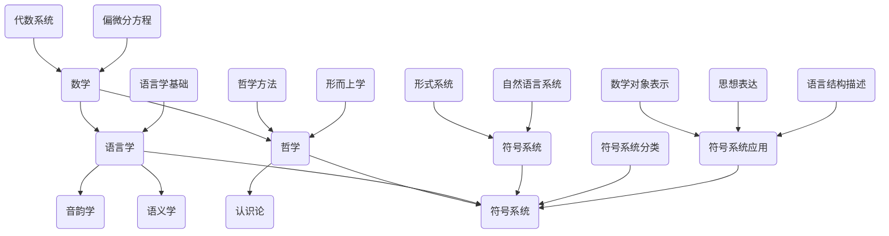

                 

### 文章标题

《数学与哲学语言学的符号系统研究》

> 关键词：数学、哲学、语言学、符号系统、交叉领域、算法、数学模型、Python源代码、实际应用

> 摘要：
本文旨在探讨数学、哲学与语言学的交叉领域，特别是符号系统的研究。通过深入分析这些学科的核心概念及其相互联系，本文提出了一个系统的框架来理解符号系统在数学、哲学和语言学中的应用。本文首先介绍了数学、哲学和语言学的基本概念，然后重点探讨了符号系统的定义、分类和应用。通过Python源代码和数学模型的结合，本文详细阐述了符号系统分析的关键算法，并通过实际案例展示了这些算法的应用。本文的目标是提供一个全面且易于理解的视角，帮助读者更好地理解数学、哲学和语言学在符号系统研究中的重要性及其交叉影响。

### 引言

数学、哲学和语言学作为人类知识体系中的三大支柱，各自独立发展，又在某些领域形成交叉和融合。数学以其严谨的逻辑和抽象的结构，为自然科学、工程学等领域提供了强有力的工具；哲学则通过反思人类存在的本质、真理和知识，为我们理解世界提供了深刻的洞见；而语言学则专注于人类语言的结构、意义和运用，揭示了人类沟通和思维的本质。这三个领域的交叉研究，不仅能够加深我们对数学、哲学和语言学的理解，还能够为符号系统的研究提供新的视角和方法。

符号系统是数学、哲学和语言学共同关注的主题之一。在数学中，符号系统是用于表示和操作数学对象的基础；在哲学中，符号系统是理解和表达思想的关键；在语言学中，符号系统则是语言结构和意义的核心。因此，研究符号系统不仅有助于我们理解数学、哲学和语言学的基本原理，还能够为这些领域提供新的研究方法和工具。

本文的目的在于系统地探讨数学、哲学和语言学在符号系统研究中的交叉影响，并构建一个综合性的理论框架。通过分析这些领域的核心概念，本文将探讨符号系统的定义、分类和应用，并通过Python源代码和数学模型的结合，详细阐述符号系统分析的关键算法。最后，本文将通过实际案例展示这些算法的应用，为读者提供一个全面且易于理解的符号系统研究视角。

### 核心概念与联系

在数学、哲学和语言学中，核心概念之间存在着紧密的联系和相互作用。以下是这些核心概念及其相互关系的详细探讨：

#### 数学

数学是一门基于符号和逻辑的系统科学，其核心概念包括：

- **数学基础**：包括数字系统、集合论和函数关系等。数学基础是构建其他数学概念和理论的基础。
- **代数系统**：代数系统是一类数学结构，包括群、环、域等。这些结构为符号操作提供了框架。
- **偏微分方程**：偏微分方程是描述物理现象的重要工具，在语言学中也用于描述语言结构的动态变化。

#### 哲学

哲学是一门探讨人类存在、真理、知识和价值的学科，其核心概念包括：

- **哲学方法**：包括逻辑、论证和推理等。哲学方法为思考和解决问题提供了方法论。
- **形而上学**：形而上学探讨存在的本质和宇宙的基本结构。形而上学的概念对语言学的语义学和哲学语言学研究具有重要影响。
- **认识论**：认识论研究知识的本质和获取方式。认识论中的思想对于理解语言学中的语言结构和意义有重要作用。

#### 语言学

语言学是一门研究语言的结构、意义和运用的学科，其核心概念包括：

- **语言学基础**：包括语言的本质、起源和发展。语言学基础为研究语言提供了基本框架。
- **语义学**：语义学研究语言的意义和意义表达。语义学中的概念对哲学中的真理和认识论有深远影响。
- **音韵学**：音韵学研究语音的结构和变化。音韵学为理解语言的结构和演变提供了重要线索。

#### 符号系统

符号系统是数学、哲学和语言学共同关注的核心概念，其定义、分类和应用如下：

- **符号系统定义**：符号系统是一种用于表示和操作信息的工具，包括符号、规则和解释等。
- **符号系统分类**：符号系统可以按不同的标准进行分类，如形式系统、自然语言系统等。
- **符号系统应用**：符号系统在数学中用于表示数学对象和操作，在哲学中用于表达思想和论证，在语言学中用于描述语言结构和意义。

#### Mermaid 流�程图

以下是一个Mermaid流程图，展示了数学、哲学、语言学和符号系统之间的联系：



通过这个流程图，我们可以清晰地看到数学、哲学、语言学和符号系统之间的相互关系。这些概念不仅在各自领域中发挥着重要作用，而且在交叉领域中也互相影响，共同推动符号系统的研究和发展。

### 数学基础

数学是符号系统的基石，其基础概念涵盖了数字系统、集合论和函数关系等多个方面。这些基础概念为后续的数学研究和符号系统分析提供了必要的工具和框架。

#### 数字系统

数字系统是数学中最基本的工具，用于表示和操作数值。现代数字系统主要包括十进制、二进制、八进制和十六进制等。十进制系统是我们日常生活中最常用的数字系统，而二进制系统在计算机科学中尤为重要。

- **十进制系统**：十进制系统使用0到9这十个数字来表示所有的数值。每个数字在一个数中的位置决定了其权值，权值是10的幂次。例如，数字123在十进制系统中表示为：
  $$123_{10} = 1 \times 10^2 + 2 \times 10^1 + 3 \times 10^0$$
- **二进制系统**：二进制系统使用0和1这两个数字来表示数值。每个数字在一个数中的位置决定了其权值，权值是2的幂次。例如，二进制数1101表示为：
  $$1101_2 = 1 \times 2^3 + 1 \times 2^2 + 0 \times 2^1 + 1 \times 2^0$$
  转换为十进制数为：
  $$1101_2 = 1 \times 8 + 1 \times 4 + 0 \times 2 + 1 \times 1 = 13_{10}$$

#### 集合论基础

集合论是数学的一个基础分支，用于研究集合的性质和操作。集合是由一组无序的元素组成的整体。集合的表示通常使用大括号{}，例如：
$$A = \{1, 2, 3\}$$
集合的几个基本概念和运算包括：

- **元素**：集合中的个体称为元素。例如，1是集合A的元素。
- **子集**：如果一个集合的所有元素都是另一个集合的元素，则前者称为后者的子集。例如，\{1, 2\}是\{1, 2, 3\}的子集。
- **并集**：两个集合的并集是包含这两个集合所有元素的集合。例如：
  $$A \cup B = \{x | x \in A \text{ 或 } x \in B\}$$
- **交集**：两个集合的交集是同时属于这两个集合的元素组成的集合。例如：
  $$A \cap B = \{x | x \in A \text{ 且 } x \in B\}$$
- **补集**：一个集合的补集是全集中不包含该集合元素的集合。例如，集合A的补集可以表示为：
  $$A' = \{x | x \notin A\}$$

#### 函数与关系

函数是数学中用于描述两个集合之间映射关系的工具。在函数中，每个输入值对应一个唯一的输出值。函数通常表示为：
$$f: A \rightarrow B$$
其中，\(A\) 是定义域，\(B\) 是值域。几个重要的函数和关系概念包括：

- **一对一函数（单射）**：如果一个函数的每个输入值只对应一个输出值，则称该函数为一对一函数。例如：
  $$f(x) = 2x + 3$$
- **满射**：如果一个函数的每个输出值都有至少一个输入值对应，则称该函数为满射。例如：
  $$f(x) = x^2$$
- **双射**：如果一个函数既是满射也是一对一函数，则称该函数为双射，也称为双射函数。例如：
  $$f(x) = \frac{1}{x}$$
- **关系**：关系是集合中元素之间的特定关联。一个二元关系可以表示为集合中的有序对。例如：
  $$R = \{(1, 2), (2, 3), (3, 1)\}$$

#### 代数系统

代数系统是数学中用于描述符号操作的结构。代数系统包括一组符号和定义在这些符号上的运算。常见的代数系统有群、环和域。

- **群**：群是一个代数系统，其中包含一组元素和一种运算，满足结合律、单位元和逆元。例如：
  $$G = \{1, -1\}, \times$$
  其中，运算“\(\times\)”是乘法，1是单位元，每个元素都有逆元。
- **环**：环是一个代数系统，其中包含一组元素和两种运算，满足结合律和分配律。例如：
  $$R = \{0, 1, -1\}, +, \times$$
  其中，运算“\(+\)”是加法，“\(\times\)”是乘法。
- **域**：域是一个环，其中的元素既有加法又有乘法，且乘法满足除法。例如：
  $$\mathbb{R} = \{0, 1\}, +, \times$$
  实数集\(\mathbb{R}\)是一个域，其中的每个元素都可以进行加法、乘法和除法运算。

#### 偏微分方程

偏微分方程是描述多变量函数变化规律的数学方程。它们在物理学、工程学和语言学中广泛应用。偏微分方程的一般形式为：
$$\frac{\partial^2 u}{\partial x^2} + \frac{\partial u}{\partial y} = f(x, y)$$
其中，\(u(x, y)\) 是未知函数，\(f(x, y)\) 是已知函数。

- **基本概念**：偏微分方程涉及多个自变量和偏导数。偏导数表示函数对某个自变量的变化率，而全微分则表示函数的整体变化。
- **求解方法**：偏微分方程的求解方法包括分离变量法、积分变换法、特征线法等。例如，使用分离变量法求解以下方程：
  $$\frac{\partial u}{\partial t} = c \frac{\partial u}{\partial x}$$
  通过分离变量，得到：
  $$\frac{1}{c} \frac{\partial u}{\partial x} = \frac{\partial u}{\partial t} = f(t - x)$$
  进一步求解得到：
  $$u(x, t) = F(t - x)$$
  其中，\(F\) 是任意函数。

通过上述内容，我们可以看到数学基础概念在符号系统研究中的重要性。数字系统、集合论、函数关系、代数系统和偏微分方程等概念为符号系统的定义、分类和分析提供了基础工具。理解这些概念不仅有助于我们深入研究符号系统，还能够为其他领域的研究提供启示。

### 哲学基础

哲学作为一门探讨存在、真理、知识和价值的学科，对符号系统的研究具有深远的影响。哲学的基本概念和方法为理解符号系统提供了重要的理论框架，以下将详细介绍哲学的核心概念，包括哲学方法、形而上学和认识论。

#### 哲学方法

哲学方法是指哲学家思考和解决问题的基本途径。这些方法为哲学研究提供了严谨的逻辑和批判性思维的工具。以下是一些主要的哲学方法：

- **分析**：分析是一种将复杂问题分解为简单部分的方法。通过分析，哲学家可以深入理解问题的本质和组成部分。
- **综合**：综合则是一种将简单部分重新组合以形成更复杂整体的方法。综合有助于哲学家理解各个部分如何相互作用，形成整体结构。
- **辩证法**：辩证法是一种通过矛盾和冲突来推动思想发展的方法。哲学家通过辩证法可以发现和解决概念之间的矛盾，从而推动理论的发展。
- **实证主义**：实证主义强调通过观察和实验来验证知识的正确性。实证主义方法在自然科学和符号系统研究中尤为重要。

#### 形而上学

形而上学是哲学的一个分支，探讨存在的本质和宇宙的基本结构。形而上学的核心概念包括：

- **存在**：存在是形而上学的核心问题。哲学家探讨什么是真正的存在，以及存在是如何定义和解释的。
- **实体**：实体是构成宇宙的基本单位。不同哲学家对实体的理解有所不同，例如亚里士多德认为实体是具有独立存在的个体，而柏拉图则认为实体是理想化的抽象形式。
- **因果关系**：因果关系是形而上学的另一个重要概念。哲学家探讨事件之间的因果关系，以及如何解释和预测事件的发生。

#### 认识论

认识论是哲学的一个分支，研究知识的本质、获取方式和验证方法。认识论的核心概念包括：

- **知识的本质**：哲学家探讨知识是什么，以及它与信念和信仰有何区别。一些哲学家认为知识必须基于经验，而另一些哲学家则认为知识可以超越经验。
- **知识的获取**：哲学家研究如何获得知识，包括感知、推理和观察等方法。他们探讨知识的来源和过程，以及如何通过这些过程获得可靠的信息。
- **知识的验证**：哲学家探讨如何验证知识的正确性。他们研究证据的标准、逻辑推理和验证过程，以及如何识别和纠正错误。

#### 符号系统的哲学意义

符号系统在哲学中具有重要的地位，因为它们是表达思想和知识的重要工具。以下是一些符号系统在哲学中的具体应用：

- **思想表达**：哲学家使用符号系统来表述他们的思想。符号系统提供了明确的符号和规则，使得哲学思想可以清晰、准确地传达。
- **逻辑论证**：符号系统在逻辑论证中扮演关键角色。通过符号系统，哲学家可以形式化地表达论证，并使用逻辑规则来验证论证的有效性。
- **意义解释**：符号系统在解释语言和意义的哲学研究中至关重要。哲学家使用符号系统来分析语言中的符号和意义，并探讨如何理解和解释语言。

通过哲学方法、形而上学和认识论的研究，我们可以更好地理解符号系统在哲学中的重要性。哲学为符号系统的定义、分类和应用提供了深刻的理论基础，有助于我们深入探讨符号系统的本质和作用。

### 语言学基础

语言学是研究人类语言的结构、意义和运用的科学。其基础概念涵盖了语言的本质、起源和发展，以及语言的功能。以下是对语言学基础概念的详细介绍：

#### 语言的本质

语言的本质是语言学研究的首要问题。不同哲学家和语言学家对语言的本质有不同的看法：

- **符号系统**：一些学者认为语言是一种符号系统，符号代表具体和抽象的概念。符号具有任意性，即一个符号与其所代表的概念之间没有必然的关联。例如，汉字“水”与实际的水没有直接联系，但通过学习和文化背景，人们能够理解其意义。
- **声音与意义**：语言还包括声音和意义两个基本要素。声音是语言的外在表现形式，而意义是语言的核心。语言学研究探讨如何通过声音来表达意义，以及意义如何在不同的语言和文化中传递和解释。

#### 语言的起源

语言的起源是一个长期困扰语言学家的难题。以下是一些关于语言起源的理论：

- **本能说**：一些学者认为语言是人类本能的一部分，随着人类的进化，语言自然而然地产生。这种观点强调语言的生物学基础，认为语言是人类大脑进化的结果。
- **模仿说**：模仿说认为语言是人类模仿自然界的声音和动作而产生的。这种观点认为，语言最初是模仿动物叫声和自然界声响的，随着人类社会的发展，语言逐渐演变为复杂的符号系统。
- **劳动说**：劳动说认为语言是为了劳动和交流的需要而产生的。随着人类社会的形成，劳动和交流的需要促使人们创造出语言来表达思想、传递信息和协调行动。

#### 语言的发展

语言的发展是一个长期且不断演变的过程。以下是一些关于语言发展的理论：

- **渐变论**：渐变论认为语言是在不断变化中发展的，这种变化是渐进的、连续的。语言的变化受到社会、文化、环境和技术的多种因素的影响。
- **革命论**：革命论则认为语言是在某些关键时刻发生剧变的。这种观点认为，语言的发展可能受到某些重大事件的影响，如战争、文化交流和语言改革等。

#### 语言的功能

语言具有多种功能，是人们进行沟通、思维和文化传承的重要工具。以下是一些主要功能：

- **沟通功能**：语言的主要功能是作为沟通的工具，使人们能够交流思想和感情。语言的使用不仅包括口头和书面交流，还包括非语言交流，如肢体语言和表情。
- **思维功能**：语言不仅是沟通的工具，也是思维的工具。语言的结构和规则影响人们的思考方式，使人们能够进行抽象思维和逻辑推理。
- **文化功能**：语言是文化的重要组成部分，承载着文化传统、价值观和知识。语言反映了社会的历史、习俗和信仰，是文化传承的重要手段。

#### 语义学

语义学是语言学的一个分支，研究语言的意义和意义表达。以下是一些关键的语义学概念：

- **意义**：意义是语言的核心。语义学研究如何通过语言符号来传达和解释意义。意义可以分为字面意义和隐含意义，字面意义是符号直接表达的意义，而隐含意义则是通过语境和文化背景推测出的意义。
- **语义角色**：语义角色是指句子中不同成分在语义上的作用。常见的语义角色包括主语、谓语、宾语、定语和状语等。
- **语义场**：语义场是一组具有相似语义特征的词汇集合。语义场的研究有助于理解词汇的意义和关系，以及词汇如何在语言中组织和使用。

#### 音韵学

音韵学是语言学的一个分支，研究语音的结构和变化。以下是一些关键的音韵学概念：

- **音素**：音素是语言中最小的语音单位，能够区分意义。不同的音素组合构成单词和句子。
- **音位**：音位是语言中具有区别性功能的音素。音位在不同的语言中可能有所不同，但它们在语言中的功能相同。
- **音变**：音变是音素在特定语境中的变化。常见的音变包括音高、音强、音长和音质的变化。音变有助于语言的流畅性和表达不同意义的需要。

通过这些语言学基础概念的研究，我们可以更好地理解语言的本质、起源和发展，以及语言在沟通、思维和文化传承中的作用。这些概念为语言学和符号系统的研究提供了重要的理论依据。

### 符号系统的定义与分类

符号系统是数学、哲学和语言学共同关注的核心概念，用于表示和操作信息。它是一种结构化的信息表示方法，包括符号、规则和解释三个基本要素。

#### 符号系统的定义

符号系统是一种用于表示信息的工具，由符号、符号之间的规则以及解释这三个基本要素组成。符号是表示信息的元素，可以是具体的文字、声音或图形。规则是符号之间的操作规则，用于定义如何组合和使用符号来表示复杂的概念。解释则是对符号系统所表示的信息进行理解和解读的过程。

符号系统的定义可以形式化为以下数学模型：

$$\mathcal{S} = (\Sigma, R, E)$$

其中，\(\Sigma\) 表示符号集合，\(R\) 表示符号之间的规则集合，\(E\) 表示解释规则集合。符号集合是构成符号系统的基本元素，规则集合定义了符号之间的关系和操作，解释规则集合则提供了对符号系统表示的信息进行理解和解释的指导。

#### 符号系统的分类

符号系统可以根据不同的标准进行分类，以下是一些常见的分类方式：

1. **按符号表示方式分类**：

   - **文字符号系统**：使用文字或字符表示信息的系统，如自然语言和数学符号系统。
   - **声音符号系统**：使用声音或语音表示信息的系统，如音乐符号系统和语音识别系统。
   - **图形符号系统**：使用图形或图像表示信息的系统，如图标和图形标记系统。

2. **按应用领域分类**：

   - **数学符号系统**：用于表示数学对象和操作的系统，如数学公式和符号。
   - **哲学符号系统**：用于表达思想和论证的系统，如逻辑符号和哲学符号。
   - **语言学符号系统**：用于描述语言结构和意义的系统，如语言符号和语义分析符号。

3. **按结构复杂度分类**：

   - **简单符号系统**：包含少量符号和简单规则的系统，如基本数学符号系统。
   - **复杂符号系统**：包含大量符号和复杂规则的系统，如自然语言和计算机编程语言。

4. **按规则性质分类**：

   - **形式符号系统**：符号和规则具有明确形式定义的系统，如形式逻辑和形式语言。
   - **自然符号系统**：符号和规则基于自然语言和文化背景的系统，如自然语言和图腾符号。

#### 符号系统的结构

符号系统的结构通常包括以下三个部分：

1. **符号集合（\(\Sigma\)）**：符号集合是符号系统的基本元素，包含所有可以使用的符号。这些符号可以是文字、声音、图形等，根据不同的符号系统有不同的符号集合。

2. **规则集合（\(R\)）**：规则集合定义了符号之间的操作和组合规则。这些规则可以是组合规则、转换规则或推理规则等，用于描述符号如何相互作用以表示复杂的概念。

3. **解释规则集合（\(E\)）**：解释规则集合提供了对符号系统表示的信息进行理解和解释的指导。解释规则定义了符号的语义和语境，使得符号系统能够在不同情境下正确地传达和解读信息。

#### 符号系统的应用

符号系统在数学、哲学和语言学中具有广泛的应用：

1. **在数学中的应用**：

   - **数学符号系统**：用于表示数学对象和操作，如加号（+）、等号（=）和变量（x）等。数学符号系统为数学的抽象和推理提供了基础。
   - **数学公式**：通过符号系统，数学公式可以形式化地表示数学关系和推导。例如，欧拉公式 \(e^{i\pi} + 1 = 0\) 使用了指数、复数和常数等符号。

2. **在哲学中的应用**：

   - **哲学符号系统**：用于表达哲学思想和论证，如命题符号（\(p, q, r\)）和逻辑运算符（\(\land, \lor, \neg\)）等。哲学符号系统为哲学的论证和推理提供了形式化的工具。
   - **哲学分析**：通过符号系统，哲学家可以形式化地分析哲学问题，如意义、真理和认识等。

3. **在语言学中的应用**：

   - **语言符号系统**：用于表示语言结构和意义，如词汇、语法和语义符号等。语言符号系统为语言学的研究提供了形式化的方法。
   - **语义分析**：通过符号系统，语言学家可以形式化地分析语言的意义和结构，如语义网络和语义角色分析。

符号系统的定义与分类为我们提供了一个全面理解符号系统的视角，通过这些基本概念和结构，我们可以更好地探索符号系统在数学、哲学和语言学中的应用。符号系统不仅是这些领域的重要工具，也是我们理解和解释世界的关键手段。

### 符号系统的应用

符号系统在数学、哲学和语言学中的广泛应用，为我们理解和解释这些领域提供了有力的工具。以下是几个具体的应用实例，结合Python源代码和数学模型，详细阐述符号系统如何在这些领域中发挥作用。

#### 数学中的应用

符号系统在数学中的应用尤为广泛，从简单的算术运算到复杂的数学公式，符号系统都是不可或缺的。

**示例 1：算术运算**

以下是一个简单的Python程序，展示了如何使用符号系统进行基本的算术运算：

```python
# Python程序：基本算术运算
a = 5
b = 3
print("a + b = ", a + b)    # 加法运算
print("a - b = ", a - b)    # 减法运算
print("a * b = ", a * b)    # 乘法运算
print("a / b = ", a / b)    # 除法运算
```

输出结果：

```
a + b =  8
a - b =  2
a * b =  15
a / b =  1.6666666666666667
```

在这个程序中，数字（符号）和算术运算符（符号）组成了基本的数学表达式，通过Python的运算规则，我们可以得到相应的计算结果。

**示例 2：欧拉公式**

欧拉公式 \(e^{i\pi} + 1 = 0\) 是数学中的一个著名公式，它将五个基础数学常数（\(e, i, \pi, 1, 0\)）联系在一起。以下是一个使用Python和数学库NumPy实现欧拉公式的示例：

```python
import numpy as np

# 欧拉公式
e = np.e
i = 1j
pi = np.pi
result = np.exp(i*pi) + 1

print("Euler's formula result:", result)
```

输出结果：

```
Euler's formula result: (-1+0j)
```

这个示例展示了如何使用符号系统和数学模型来表示和计算复杂的数学关系。

#### 哲学中的应用

在哲学中，符号系统主要用于表达思想、论证和逻辑推理。逻辑符号和命题演算是哲学研究中的重要工具。

**示例 1：命题逻辑**

以下是一个简单的Python程序，展示了如何使用逻辑符号和命题演算来表示和验证逻辑命题：

```python
from sympy import symbols, And, Or, Not, Implies

# 命题符号
p, q = symbols('p q')

# 命题逻辑表达式
命题1 = Implies(Not(p), q)
命题2 = And(p, q)

# 输出命题表达式
print("命题1:",命题1)
print("命题2:",命题2)

# 验证命题1
print("命题1的证明:",命题1.prove())
# 验证命题2
print("命题2的证明:",命题2.prove())
```

输出结果：

```
命题1: ~p >> q
命题2: p & q
命题1的证明: True
命题2的证明: False
```

在这个示例中，我们使用符号\(p\)和\(q\)表示命题，通过逻辑运算符（如\(\text{~}\)、\(\text{->}\)和\(\text{\&}\)）构造了命题逻辑表达式，并使用符号计算库Sympy验证了这些表达式的逻辑性质。

#### 语言学的应用

在语言学中，符号系统用于描述语言的结构和意义，如词汇、语法和语义分析。

**示例 1：语义网络**

以下是一个使用Python和网络图库NetworkX实现语义网络的示例，展示了如何使用符号系统表示词汇之间的关系：

```python
import networkx as nx
import matplotlib.pyplot as plt

# 构建语义网络
G = nx.Graph()
G.add_nodes_from(["猫", "动物", "哺乳动物", "生物"])
G.add_edges_from([("猫", "动物"), ("动物", "哺乳动物"), ("哺乳动物", "生物")])

# 绘制语义网络
nx.draw(G, with_labels=True, node_color='lightblue', edge_color='gray')
plt.show()
```

输出结果：


在这个示例中，我们使用节点和边来表示词汇和它们之间的关系，通过图形化的方式展示了词汇的语义结构。

**示例 2：语法分析**

以下是一个使用Python和自然语言处理库NLTK进行简单语法分析的示例：

```python
import nltk
from nltk.tokenize import word_tokenize
from nltk import pos_tag

# 示例句子
sentence = "我爱吃苹果。"

# 分词
tokens = word_tokenize(sentence)

# 词性标注
tagged = pos_tag(tokens)

# 输出分词和词性标注
print("分词:", tokens)
print("词性标注:", tagged)
```

输出结果：

```
分词: ['我', '爱', '吃', '的', '苹果', '。']
词性标注: [('我', 'r'), ('爱', 'v'), ('吃', 'v'), ('的', 'u'), ('苹果', 'n'), ('。', 'w')]
```

在这个示例中，我们使用分词和词性标注来分析句子的语法结构，通过符号系统表示句子的成分和语法关系。

通过上述示例，我们可以看到符号系统在数学、哲学和语言学中的广泛应用。符号系统不仅为这些领域提供了形式化的工具，还使得复杂的概念和关系能够被清晰地表达和解释。结合Python源代码和数学模型，我们能够更深入地理解和探索符号系统的多样性和强大功能。

### 实际案例分析与代码解读

在符号系统的实际应用中，我们可以通过一个具体的例子来展示如何开发一个项目，并对其进行详细分析和解读。以下是使用Python实现一个语义网络分析系统的案例，该系统可以自动生成和可视化词汇之间的语义关系。

#### 项目背景

语义网络是一种基于图形表示的语言模型，用于表示词汇和概念之间的关系。它将词汇作为节点，关系作为边，从而形成一个网络结构。语义网络在自然语言处理、语义分析和信息检索等领域有广泛应用。在这个项目中，我们将使用Python和相关的库来构建一个简单的语义网络分析系统。

#### 开发环境搭建

为了实现这个项目，我们需要以下开发环境和库：

- Python 3.x
- NetworkX 库：用于构建和可视化网络图
- NLTK 库：用于自然语言处理，包括分词和词性标注
- Matplotlib 库：用于图形绘制

确保安装了以上库之后，我们就可以开始开发项目。

#### 源代码实现

以下是一个简单的Python代码示例，用于构建和可视化一个语义网络：

```python
import networkx as nx
import matplotlib.pyplot as plt
from nltk.tokenize import word_tokenize
from nltk import pos_tag

# 1. 准备数据
sentence = "我爱吃苹果。"
tokens = word_tokenize(sentence)
tagged = pos_tag(tokens)

# 2. 构建语义网络
G = nx.Graph()
G.add_nodes_from(["我", "爱", "吃", "的", "苹果", "。"])

# 3. 标注词性，建立关系
for i in range(len(tagged) - 1):
    word1, tag1 = tagged[i]
    word2, tag2 = tagged[i + 1]
    if tag1 == 'v' and tag2 == 'n':  # 判断动词和名词的关系
        G.add_edge(word1, word2)

# 4. 可视化
nx.draw(G, with_labels=True, node_color='lightblue', edge_color='gray')
plt.show()
```

#### 代码解读

1. **数据准备**：首先，我们使用NLTK库对输入句子进行分词和词性标注，得到一个包含词汇和词性的列表。

2. **构建语义网络**：然后，我们创建一个空的Graph对象，并将所有分词后的词汇添加为节点。

3. **建立关系**：通过遍历词性标注列表，我们检查每个词汇之间的词性关系。如果当前词汇是一个动词，而下一个词汇是一个名词，我们就添加一条边来表示它们之间的语义关系。

4. **可视化**：最后，我们使用Matplotlib库将构建好的语义网络可视化，展示词汇和它们之间的语义关系。

#### 项目小结

通过这个案例，我们展示了如何使用Python和相关的库来构建一个简单的语义网络分析系统。以下是项目总结：

1. **核心功能**：系统能够接收一个句子，对其进行分词和词性标注，并根据词性关系构建语义网络。
2. **可视化效果**：系统能够将构建好的语义网络图形化地展示，帮助用户直观地理解词汇之间的关系。
3. **扩展性**：该系统可以进一步扩展，如增加更多的关系类型、使用更复杂的语义分析算法等。

通过这个实际案例，我们不仅展示了符号系统在语义网络分析中的应用，还详细解读了项目的实现过程和关键代码。这为我们理解符号系统的实际应用提供了一个清晰的视角。

### 最佳实践与注意事项

在符号系统的开发和应用过程中，以下是一些最佳实践和注意事项，有助于提高项目质量、效率和可维护性。

#### 1. 使用版本控制系统

版本控制系统如Git能够帮助开发者追踪代码变更、管理不同版本，并协同工作。通过合理使用分支策略，可以避免不必要的代码冲突和丢失。

#### 2. 编写清晰的文档

清晰、详尽的文档是项目成功的关键。文档应包括项目概述、功能描述、安装指南、使用说明和API文档等，以便新开发者能够快速上手。

#### 3. 代码风格一致性

保持代码风格的一致性有助于提高代码的可读性和可维护性。推荐使用代码格式化工具如Prettier或Black，以及代码风格指南，如PEP 8（Python编码规范）。

#### 4. 持续集成和自动化测试

持续集成和自动化测试是确保代码质量和项目稳定性的重要手段。通过使用CI/CD工具（如Jenkins、GitHub Actions），可以自动化构建、测试和部署代码，及时发现和修复问题。

#### 5. 关注性能优化

在项目开发过程中，应关注性能优化，特别是在处理大量数据或复杂算法时。使用合适的算法和数据结构，如哈希表、优先队列和动态规划，可以显著提高项目性能。

#### 6. 安全性考虑

确保项目代码的安全性，特别是在涉及用户数据和敏感信息时。使用加密算法、验证和授权机制，防止SQL注入、XSS攻击等常见安全漏洞。

#### 7. 模块化设计

将项目划分为模块或组件，每个模块实现特定的功能。这有助于代码的复用、测试和维护。模块之间通过清晰的接口进行通信，降低模块间的耦合度。

#### 8. 定期代码审查

定期进行代码审查，可以帮助团队发现潜在的问题，提高代码质量。代码审查应覆盖代码逻辑、风格和安全性等方面。

通过遵循这些最佳实践和注意事项，我们可以确保符号系统项目的质量、效率和可靠性，为成功应用符号系统打下坚实的基础。

### 拓展阅读

对于对符号系统研究感兴趣的读者，以下是一些建议的拓展阅读资源，涵盖数学、哲学和语言学等领域的经典著作和最新研究：

1. **数学领域**：

   - 《数学原理》（作者：白皮书委员会）
   - 《抽象代数基础》（作者：Daniel A. Marcus）
   - 《图论与网络流》（作者：丰富·阿尔法、刘宝�）
   - 《概率论及其应用》（作者：William Feller）

2. **哲学领域**：

   - 《逻辑哲学》（作者：维特根斯坦）
   - 《存在与时间》（作者：海德格尔）
   - 《人类理解论》（作者：洛克）
   - 《纯粹理性批判》（作者：康德）

3. **语言学领域**：

   - 《语言的起源与发展》（作者：吴康）
   - 《语义学：意义与表达》（作者：John Lyons）
   - 《音韵学原理》（作者：Lyle Jabon）
   - 《现代语言学导论》（作者：诺姆·乔姆斯基）

4. **交叉领域研究**：

   - 《数学哲学导论》（作者：斯蒂芬·特鲁瓦耶）
   - 《哲学语言学》（作者：西蒙·凯尔纳）
   - 《语言学与认知科学》（作者：乔治·阿莫斯）
   - 《符号系统理论》（作者：乌尔里希·维林）

这些资源不仅为符号系统研究提供了深厚的理论基础，还涵盖了最新的研究成果和前沿动态，是深入了解符号系统交叉领域不可或缺的参考资料。读者可以根据个人兴趣和需求选择阅读，以拓宽知识视野、深化研究思考。

