                 

### 背景介绍

《数学与地理信息系统的数学基础》这本书的诞生，源于现代地理信息系统（GIS）在各个领域中的应用日益广泛，以及数学在GIS分析中的核心作用。地理信息系统是一种用于捕捉、存储、分析、管理和展示地理空间数据的系统，涵盖了从地球表面到地下空间的各种信息。GIS技术在城市规划、资源管理、环境监测、灾害预警等领域都有着重要的应用价值。

随着GIS技术的不断进步，对数学基础的要求也越来越高。数学作为一种精确的科学，提供了描述和解决GIS中复杂问题的理论框架。从空间数据的几何处理到复杂的地理模拟，数学模型和方法在GIS中的使用，使得GIS分析变得更加精确和高效。

本书旨在为读者提供一份全面的数学与GIS基础的指南，帮助读者理解数学在GIS中的关键作用，掌握必要的数学知识和GIS技术，进而进行深入的研究和应用。通过对数学基础概念、GIS概述、数学在GIS中的应用、数学模型与GIS结合等内容的详细讲解，本书将为读者提供一个系统性的学习路径，使其能够更好地理解和运用数学与GIS技术。

在这个信息爆炸的时代，地理信息系统和数学的结合带来了前所未有的机遇和挑战。本书将通过深入浅出的讲解，帮助读者掌握这些关键技能，为他们在学术研究和职业发展道路上提供坚实的理论基础和实践指导。

### 核心概念与联系

要深入理解《数学与地理信息系统的数学基础》这本书，我们首先需要明确几个核心概念，并了解它们之间的相互关系。以下是几个关键概念及其关系的Mermaid流程图展示：

```mermaid
graph TB
A[数学基础] --> B[数论]
A --> C[微积分]
A --> D[线性代数]
B --> E[函数与极限]
C --> F[导数与微分]
C --> G[积分与积分变换]
D --> H[向量与矩阵]
D --> I[线性方程组]
D --> J[特征值与特征向量]
B --> K[空间数据结构]
C --> L[空间查询算法]
D --> M[空间分析算法]
D --> N[网络分析算法]
K --> O[地理信息系统]
L --> P[空间优化模型]
M --> Q[空间预测模型]
N --> R[数学模型与GIS]
E --> S[数学模型优化]
F --> T[数学模型优化]
G --> U[数学模型优化]
H --> V[数学模型优化]
I --> W[数学模型优化]
J --> X[数学模型优化]
E --> Y[空间数据分析模型]
F --> Z[空间数据分析模型]
G --> AA[空间数据分析模型]
H --> BB[空间数据分析模型]
I --> CC[空间数据分析模型]
J --> DD[空间数据分析模型]
K --> EE[空间数据结构]
L --> FF[空间查询算法]
M --> GG[空间分析算法]
N --> HH[网络分析算法]
O --> II[数学模型与GIS]
P --> JJ[数学模型与GIS]
Q --> KK[数学模型与GIS]
R --> LL[数学模型与GIS]
S --> MM[数学模型与GIS]
T --> NN[数学模型与GIS]
U --> OO[数学模型与GIS]
V --> PP[数学模型与GIS]
W --> QQ[数学模型与GIS]
X --> RR[数学模型与GIS]
Y --> SS[数学模型与GIS]
Z --> TT[数学模型与GIS]
AA --> UU[数学模型与GIS]
BB --> VV[数学模型与GIS]
CC --> WW[数学模型与GIS]
DD --> XX[数学模型与GIS]
EE --> YY[地理信息系统]
FF --> ZZ[地理信息系统]
GG --> AAA[地理信息系统]
HH --> BBB[地理信息系统]
II --> CCC[地理信息系统]
JJ --> DDD[地理信息系统]
KK --> EEE[地理信息系统]
LL --> FFF[地理信息系统]
MM --> GGG[地理信息系统]
NN --> HHH[地理信息系统]
OO --> III[地理信息系统]
PP --> JJJ[地理信息系统]
QQ --> KKK[地理信息系统]
RR --> LLL[地理信息系统]
SS --> MMM[地理信息系统]
TT --> NNN[地理信息系统]
UU --> OOO[地理信息系统]
VV --> PPP[地理信息系统]
WW --> QQQ[地理信息系统]
XX --> RRR[地理信息系统]
YY --> SSS[地理信息系统]
ZZ --> TTT[地理信息系统]
AAA --> UUU[数学模型与GIS]
BBB --> VVV[数学模型与GIS]
CCC --> WWW[数学模型与GIS]
DDD --> XXX[数学模型与GIS]
EEE --> YYY[地理信息系统]
FFF --> ZZZ[地理信息系统]
GGG --> AAAA[地理信息系统]
HHH --> BBBB[地理信息系统]
III --> CCCD[地理信息系统]
JJJ --> DDDD[地理信息系统]
KKK --> EEEE[地理信息系统]
LLL --> FFFF[地理信息系统]
MMM --> GGGG[地理信息系统]
NNN --> HHHH[地理信息系统]
OOO --> IIII[地理信息系统]
PPP --> JJJJ[地理信息系统]
QQQ --> KKKK[地理信息系统]
RRR --> LLLL[地理信息系统]
SSS --> MMMM[地理信息系统]
TTT --> NNNN[地理信息系统]
UUU --> OOOO[地理信息系统]
VVV --> PPPP[地理信息系统]
WWW --> QQQQ[地理信息系统]
XXX --> RRRR[地理信息系统]
YYY --> SSSS[地理信息系统]
ZZZ --> TTTT[地理信息系统]
AAAA --> UUUU[数学模型与GIS]
BBBB --> VVVV[数学模型与GIS]
CCCC --> WWWW[数学模型与GIS]
DDDD --> XXXX[数学模型与GIS]
```



Mermaid流程图展示了数学基础（A）与GIS（O）之间的紧密联系，以及各个子概念（B、C、D）在GIS（O）中的应用（K、L、M、N）。以下是具体的概念及其关系的详细说明：

1. **数学基础（A）**：数学基础涵盖了数论、微积分、和线性代数。这些基础数学知识为GIS中的数据建模和分析提供了理论支持。
   - **数论（B）**：研究整数的性质，如素数、模运算等，为GIS中的空间数据结构提供基础。
   - **微积分（C）**：研究函数的变化率和累积量，如导数、积分，为GIS中的空间查询、空间分析和空间优化提供工具。
   - **线性代数（D）**：研究向量、矩阵和线性方程组，为GIS中的数据表示、变换和建模提供基础。

2. **GIS中的数学应用（K、L、M、N）**：这些数学应用在GIS中有着广泛的应用。
   - **空间数据结构（K）**：包括栅格数据结构和矢量数据结构，用于存储和表示地理空间数据。
   - **空间查询算法（L）**：用于快速查找空间数据中的特定对象，如距离查询、区域查询等。
   - **空间分析算法（M）**：用于对空间数据进行操作，如叠加分析、缓冲区分析、地形分析等。
   - **网络分析算法（N）**：用于分析网络结构，如最短路径分析、流量分析等。

3. **数学模型与GIS（R、S、T、U、V、W、X、Y、Z、AA、BB、CC、DD）**：这些数学模型和方法被广泛应用于GIS分析中。
   - **空间数据分析模型（Y、Z、AA、BB、CC、DD）**：包括空间数据分析模型，如空间插值、趋势面分析等，用于解释空间数据。
   - **空间优化模型（P、Q、KK）**：用于优化空间数据，如空间布局优化、路径规划等。
   - **空间预测模型（Q、KK）**：用于预测空间数据，如环境变化预测、人口增长预测等。
   - **数学模型优化（S、T、U、V、W、X）**：用于改进和优化GIS分析结果，如算法优化、参数优化等。

通过这个Mermaid流程图，我们可以清晰地看到数学基础与GIS之间的联系，以及数学在GIS分析中的应用。这为我们进一步探讨每个数学概念和其在GIS中的具体应用奠定了基础。

### 数学基本概念

在《数学与地理信息系统的数学基础》这本书的第一章中，我们将深入探讨数学的基本概念，这些概念是理解GIS分析和建模的基石。以下是对数学基础概念的详细解释。

#### 数论基础

数论是研究整数及其性质的一个分支。它是数学中的基础学科，为其他数学分支提供了重要的理论支持。以下是数论中的几个核心概念：

- **素数**：素数是指只能被1和自身整除的正整数，如2、3、5、7等。在GIS中，素数可以用于加密算法，保护空间数据的安全。

- **同余**：同余是指两个整数在模运算下具有相同的余数。例如，10和16在模3运算下都是1，所以它们同余。同余在GIS中用于空间数据的编码和识别。

- **模运算**：模运算是一种基本的数学运算，用于计算两个整数的余数。例如，10模3等于1。模运算在GIS中用于处理空间数据的位置和方向。

#### 函数与极限

函数是数学中描述变量之间关系的工具。在GIS中，函数用于描述空间数据的变化和转换。以下是几个核心概念：

- **函数定义**：函数是一个从定义域到值域的映射，即每个定义域中的元素都对应值域中的一个元素。例如，y = 2x 是一个线性函数。

- **函数类型**：函数可以分为多种类型，如线性函数、多项式函数、指数函数等。每种函数类型都有其特定的性质和应用。在GIS中，多项式函数常用于地形建模。

- **极限**：极限是函数在自变量趋于某个值时的行为。它用于研究函数的连续性和变化率。例如，函数 f(x) 当 x 趋于无穷大时的极限值。在GIS中，极限用于分析空间数据的变化趋势。

#### 导数与微分

导数是描述函数变化率的工具。在GIS中，导数用于计算空间数据的梯度、坡度和曲率。以下是几个核心概念：

- **导数定义**：导数是函数在某一点的瞬时变化率。例如，函数 y = x^2 在 x = 2 处的导数是 4。

- **导数类型**：导数可以分为一阶导数、二阶导数等。一阶导数用于计算梯度，二阶导数用于计算曲率。

- **微分**：微分是导数的线性近似。它用于计算函数在某一点的局部变化。例如，函数 y = x^2 在 x = 2 处的微分是 4。

#### 积分与积分变换

积分是描述函数累积量的工具。在GIS中，积分用于计算空间数据的面积、体积和总量。以下是几个核心概念：

- **积分定义**：积分是函数在区间上的累积量。例如，函数 y = x^2 在区间 [1, 3] 上的积分是 8/3。

- **积分类型**：积分可以分为定积分和变积分。定积分用于计算固定区间上的累积量，变积分用于计算变化区间上的累积量。

- **积分变换**：积分变换是改变积分变量的方法，如换元积分、分部积分等。在GIS中，积分变换用于简化复杂积分的计算。

通过本章的讲解，我们可以看到数学基本概念在GIS中的应用是多么重要。这些概念不仅为我们提供了描述和解决GIS中复杂问题的工具，也为后续章节的深入探讨奠定了坚实的基础。在接下来的章节中，我们将进一步探讨这些概念在GIS中的具体应用，帮助读者更好地理解和运用数学知识。

### 微积分基础

微积分是数学中研究变化率和累积量的学科，它在GIS中有着广泛的应用。理解微积分的基本概念和原理，对于进行复杂的GIS分析和建模至关重要。以下是微积分基础的核心内容。

#### 微积分基本概念

微积分主要涉及两个基本概念：导数和积分。导数描述的是函数在某一点的变化率，而积分描述的是函数在一定区间上的累积量。

1. **导数**：导数是函数在某一点的瞬时变化率。它可以通过导数定义和导数规则来计算。例如，函数 f(x) 在点 x = a 的导数 f'(a) 可以通过以下极限定义计算：
   $$
   f'(a) = \lim_{h \to 0} \frac{f(a+h) - f(a)}{h}
   $$
   导数在GIS中的应用包括计算地形数据的梯度、坡度和曲率等。

2. **积分**：积分是函数在一定区间上的累积量。定积分可以通过积分上限和积分下限计算，例如，函数 f(x) 在区间 [a, b] 上的积分可以表示为：
   $$
   \int_{a}^{b} f(x) \, dx
   $$
   积分在GIS中的应用包括计算空间数据的面积、体积和总量等。

#### 导数与微分

导数是微分的极限形式。微分是指函数在某一点的局部变化量，可以通过导数计算得到。例如，函数 f(x) 在点 x = a 的微分 df(a) 可以通过导数 f'(a) 和自变量的变化量 dx 计算得到：
$$
df(a) = f'(a) \, dx
$$
在GIS中，微分用于计算地形数据的局部变化和趋势，这对于地形分析、洪水预警和资源管理等方面具有重要意义。

#### 积分与积分变换

积分是一种累积量，用于计算空间数据的总量。例如，通过积分可以计算一个多边形的面积或一条线段的长度。此外，积分变换是一种用于简化复杂积分计算的方法。常见的积分变换包括换元积分、分部积分和分式积分等。

在GIS中，积分变换用于简化复杂积分的计算，以便更有效地进行空间数据的分析。例如，通过换元积分可以简化地形数据的曲面积分，从而更方便地计算地形坡度和曲率。

#### 微积分在GIS中的应用实例

1. **地形分析**：微积分用于计算地形数据的梯度、坡度和曲率。通过梯度的计算，我们可以了解地形数据在不同位置的变化趋势。坡度的计算可以帮助我们了解地形数据的高低差异，而曲率的计算则可以帮助我们了解地形数据的弯曲程度。

   例如，在GIS中，我们可以使用导数计算地形数据在某个点的梯度：
   $$
   \nabla f(x, y) = \left( \frac{\partial f}{\partial x}, \frac{\partial f}{\partial y} \right)
   $$
   其中，f(x, y) 表示地形数据的高度函数。

2. **资源管理**：微积分用于计算空间数据的总量，如土地面积、水域面积等。通过积分，我们可以确定资源分布的总量，从而为资源管理提供科学依据。

   例如，在GIS中，我们可以使用定积分计算多边形的面积：
   $$
   A = \int_{C} 1 \, ds
   $$
   其中，C 表示多边形的边界，ds 表示微元长度。

3. **洪水预警**：微积分用于计算地形数据的水流速度和流量。通过积分，我们可以预测洪水发生的可能性和影响范围，从而为洪水预警提供支持。

   例如，在GIS中，我们可以使用积分计算水流的速度和流量：
   $$
   v = \int_{S} \nabla f \cdot \mathbf{n} \, dS
   $$
   其中，S 表示水流区域，\(\mathbf{n}\) 表示水流方向单位向量。

通过上述讲解，我们可以看到微积分在GIS中的应用是多方面的。它不仅为GIS分析提供了强大的工具，也为空间数据的理解和解释提供了理论基础。在接下来的章节中，我们将继续探讨线性代数在GIS中的应用，帮助读者更全面地掌握数学与GIS的结合。

### 线性代数基础

线性代数是数学中研究向量、矩阵和线性方程组等概念的分支，它在GIS中有着广泛的应用。理解线性代数的基本概念和原理，对于进行复杂的GIS分析和建模至关重要。以下是线性代数基础的核心内容。

#### 向量与矩阵

1. **向量**：向量是具有大小和方向的量。在GIS中，向量用于表示空间位置、方向和速度等。向量的表示通常使用一个有序数组，如 \(\mathbf{v} = (v_1, v_2, ..., v_n)\)，其中 \(v_i\) 表示向量的第 \(i\) 个分量。

   向量的加法和数乘运算如下：
   $$
   \mathbf{u} + \mathbf{v} = (u_1 + v_1, u_2 + v_2, ..., u_n + v_n)
   $$
   $$
   a\mathbf{v} = (av_1, av_2, ..., av_n)
   $$

2. **矩阵**：矩阵是一个由数字组成的矩形数组。在GIS中，矩阵用于表示空间数据、变换和操作。矩阵的表示通常使用方括号，如 \(A = \begin{bmatrix} a_{11} & a_{12} & \cdots & a_{1n} \\ a_{21} & a_{22} & \cdots & a_{2n} \\ \vdots & \vdots & \ddots & \vdots \\ a_{m1} & a_{m2} & \cdots & a_{mn} \end{bmatrix}\)。

   矩阵的加法和数乘运算如下：
   $$
   A + B = \begin{bmatrix} a_{11} + b_{11} & a_{12} + b_{12} & \cdots & a_{1n} + b_{1n} \\ a_{21} + b_{21} & a_{22} + b_{22} & \cdots & a_{2n} + b_{2n} \\ \vdots & \vdots & \ddots & \vdots \\ a_{m1} + b_{m1} & a_{m2} + b_{m2} & \cdots & a_{mn} + b_{mn} \end{bmatrix}
   $$
   $$
   cA = \begin{bmatrix} ca_{11} & ca_{12} & \cdots & ca_{1n} \\ ca_{21} & ca_{22} & \cdots & ca_{2n} \\ \vdots & \vdots & \ddots & \vdots \\ ca_{m1} & ca_{m2} & \cdots & ca_{mn} \end{bmatrix}
   $$

#### 线性方程组

线性方程组是由多个线性方程构成的方程组。在GIS中，线性方程组用于求解空间数据的几何关系和位置关系。

1. **线性方程组定义**：一个线性方程组可以表示为：
   $$
   \begin{cases}
   a_{11}x_1 + a_{12}x_2 + \cdots + a_{1n}x_n = b_1 \\
   a_{21}x_1 + a_{22}x_2 + \cdots + a_{2n}x_n = b_2 \\
   \vdots \\
   a_{m1}x_1 + a_{m2}x_2 + \cdots + a_{mn}x_n = b_m
   \end{cases}
   $$

2. **线性方程组求解**：线性方程组的求解方法包括高斯消元法、矩阵法等。

   高斯消元法是一种常用的求解线性方程组的方法。其基本思想是通过高斯消元将线性方程组转化为上三角或下三角方程组，然后使用回代法求解。具体步骤如下：

   - 将方程组写成增广矩阵的形式：
     $$
     \begin{bmatrix}
     a_{11} & a_{12} & \cdots & a_{1n} & b_1 \\
     a_{21} & a_{22} & \cdots & a_{2n} & b_2 \\
     \vdots & \vdots & \ddots & \vdots & \vdots \\
     a_{m1} & a_{m2} & \cdots & a_{mn} & b_m
     \end{bmatrix}
     $$
   - 使用高斯消元将增广矩阵转化为上三角或下三角矩阵：
     $$
     \begin{bmatrix}
     a_{11} & a_{12} & \cdots & a_{1n} & b_1 \\
     0 & a_{22} & \cdots & a_{2n} & b_2 \\
     \vdots & \vdots & \ddots & \vdots & \vdots \\
     0 & 0 & \cdots & a_{mn} & b_m
     \end{bmatrix}
     $$
   - 使用回代法求解上三角或下三角方程组。

在GIS中，线性方程组用于解决空间数据的几何问题，如多边形面积计算、点到直线的距离计算等。

#### 特征值与特征向量

特征值和特征向量是矩阵理论中的重要概念。在GIS中，特征值和特征向量用于分析空间数据的结构和特性。

1. **特征值与特征向量定义**：对于一个方阵 \(A\)，如果存在一个非零向量 \(\mathbf{v}\) 和一个常数 \(\lambda\)，使得：
   $$
   A\mathbf{v} = \lambda\mathbf{v}
   $$
   则 \(\lambda\) 是 \(A\) 的一个特征值，\(\mathbf{v}\) 是 \(A\) 的一个特征向量。

2. **特征值与特征向量求解**：特征值和特征向量的求解可以通过求解矩阵 \(A\) 的特征方程得到：
   $$
   \det(A - \lambda I) = 0
   $$
   其中，\(I\) 是单位矩阵。

在GIS中，特征值和特征向量用于分析地形数据、图像数据等，可以帮助我们了解数据的结构特性，如主成分分析、自编码器等。

#### 线性代数在GIS中的应用实例

1. **多边形面积计算**：使用矩阵方法计算多边形面积。将多边形的顶点表示为一个矩阵，然后通过矩阵运算计算面积。

2. **点到直线的距离计算**：使用线性方程组求解点到直线的距离。通过建立点到直线的距离方程，求解得到距离。

3. **地形分析**：使用特征值和特征向量分析地形数据。通过计算地形数据矩阵的特征值和特征向量，了解地形数据的结构特性，如坡度、曲率等。

4. **图像处理**：使用矩阵方法进行图像处理。通过矩阵运算实现图像的滤波、增强、变换等操作。

通过上述讲解，我们可以看到线性代数在GIS中的应用是多么广泛。它不仅为GIS分析提供了强大的工具，也为空间数据的理解和解释提供了理论基础。在接下来的章节中，我们将继续探讨数学在GIS中的其他应用，帮助读者更全面地掌握数学与GIS的结合。

### 地理信息系统概述

地理信息系统（GIS）是一种用于捕捉、存储、分析、管理和展示地理空间数据的系统。它的应用领域涵盖了城市规划、资源管理、环境监测、灾害预警等多个方面。了解GIS的基本概念、发展历史和应用领域，对于深入掌握数学在GIS中的应用至关重要。

#### GIS基本概念

GIS主要由以下组件构成：

1. **硬件**：包括计算机、扫描仪、GPS设备等。
2. **软件**：包括GIS软件平台、数据管理工具、分析工具等。
3. **数据**：包括空间数据（如地图、卫星图像等）和属性数据（如人口统计、资源分布等）。
4. **人员**：包括GIS技术人员、数据分析师等。

GIS的基本功能包括数据采集、数据管理、数据分析、数据可视化等。

- **数据采集**：通过各种传感器和设备获取地理空间数据。
- **数据管理**：对空间数据进行存储、检索、更新和管理。
- **数据分析**：利用数学模型和方法对空间数据进行分析和建模。
- **数据可视化**：通过图形和图像展示空间数据的特征和关系。

#### GIS发展历史

GIS的发展可以追溯到20世纪60年代。以下是GIS发展的重要阶段：

1. **早期阶段**（1960s-1970s）：以计算机辅助制图（Computer-Aided Design, CAD）为代表，初步实现了地图的数字化。
2. **形成阶段**（1970s-1980s）：随着计算机硬件和软件的发展，GIS开始应用于城市规划、资源管理等领域。
3. **成熟阶段**（1990s）：随着互联网和遥感技术的发展，GIS应用范围进一步扩大，出现了大量的GIS软件和工具。
4. **现代化阶段**（2000s至今）：GIS与物联网、大数据、人工智能等技术的融合，使得GIS应用更加广泛和智能化。

#### GIS应用领域

GIS在各个领域的应用如下：

1. **城市规划**：用于城市布局、交通规划、公共设施管理等。
   - **实例**：纽约市利用GIS进行交通流量分析，优化交通网络。

2. **资源管理**：用于自然资源调查、环境监测、土地利用规划等。
   - **实例**：加拿大利用GIS进行森林资源管理，监测森林火灾。

3. **环境监测**：用于大气污染监测、水质监测、气候变化分析等。
   - **实例**：美国环保署利用GIS进行空气质量监测，发布实时数据。

4. **灾害管理**：用于灾害预警、灾情评估、救援规划等。
   - **实例**：日本利用GIS进行地震预警，指导公众疏散。

5. **农业**：用于农田管理、作物生长监测、病虫害防治等。
   - **实例**：中国利用GIS进行农田土壤监测，优化农业生产。

6. **交通**：用于交通流量分析、路径规划、公共交通管理等。
   - **实例**：伦敦利用GIS进行交通拥堵分析，优化公共交通线路。

通过了解GIS的基本概念、发展历史和应用领域，我们可以更好地理解数学在GIS中的关键作用。数学为GIS提供了强大的分析工具和理论支持，使得GIS能够更好地应对复杂的地理空间问题。在接下来的章节中，我们将进一步探讨数学在GIS中的应用，包括空间数据结构、算法和模型等。

### 地理信息系统发展历史

地理信息系统（GIS）的发展历程反映了计算机技术和空间数据处理的不断进步。从早期的手工地图绘制到现代复杂的GIS软件，GIS的发展经历了多个阶段，每个阶段都标志着技术的重大突破和应用领域的扩展。

#### 早期阶段（1950s-1960s）

GIS的萌芽可以追溯到20世纪50年代，当时出现了第一种电子计算机，这为地图数字化提供了可能。然而，真正的GIS概念尚未形成，地图的数字化主要依赖于计算机辅助设计（CAD）技术。这个时期的主要贡献者是Jack Kiefer和Guglielmo Marconi，他们尝试使用计算机进行地图数据的处理和存储。

#### 成长阶段（1960s-1970s）

20世纪60年代，计算机辅助制图（Computer-Aided Cartography）技术开始发展，标志着GIS的初步形成。在此期间，出现了最早的GIS系统，如加拿大国家研究委员会（NRC）的CanMap系统和麻省理工学院的CADAC系统。这些系统利用计算机进行地图绘制和空间数据的存储，但功能相对简单，主要应用于土地管理和城市规划。

#### 成熟阶段（1970s-1980s）

1970年代，GIS技术逐渐走向成熟。美国环境保护局（EPA）开发了第一个综合性的GIS系统——土地资源信息系统（Land Resource Systems，LR系统）。这一时期，GIS的应用开始从单一领域扩展到多个领域，包括城市规划、土地利用、资源管理和环境监测等。

1978年，美国大学GIS协会（University Consortium for Geographic Information Systems）成立，推动了GIS教育和研究的普及。同时，GIS软件和硬件市场开始蓬勃发展，如Intergraph、Arc/INFO等商业GIS软件的推出，使得GIS技术更加普及。

#### 现代化阶段（1990s）

1990年代，随着计算机技术的飞速发展和互联网的普及，GIS进入了现代化阶段。这一时期，GIS软件变得更加用户友好，功能更加丰富。ESRI公司推出了ArcGIS软件平台，成为GIS市场的领导者。此外，GPS（全球定位系统）的广泛应用，使得实时空间数据的获取成为可能，为GIS的应用提供了新的动力。

互联网和WebGIS技术的发展，使得GIS的应用范围进一步扩大，从桌面端扩展到互联网端。WebGIS使得用户可以通过浏览器访问和操作GIS数据，推动了GIS在电子商务、公共服务等领域的应用。

#### 当前发展趋势

进入21世纪，GIS技术继续快速发展，呈现出以下几个趋势：

1. **大数据与GIS的结合**：随着大数据技术的发展，GIS开始处理和分析海量的空间数据。大数据与GIS的结合，使得地理空间分析更加精准和高效。

2. **人工智能与GIS的结合**：人工智能（AI）技术的引入，为GIS带来了新的应用场景。例如，机器学习算法可以用于空间数据的预测、模式识别和优化路径规划。

3. **物联网与GIS的结合**：物联网（IoT）技术的快速发展，使得GIS能够实时获取和处理来自各种传感器的空间数据，为智慧城市、智能交通等应用提供了数据支持。

4. **三维GIS与虚拟现实**：三维GIS技术的发展，使得GIS能够展示更加真实和立体的地理空间信息。虚拟现实（VR）技术的结合，使得用户能够更加直观地体验和操作GIS数据。

通过回顾GIS的发展历史，我们可以看到GIS技术是如何从简单的地图数字化发展到如今高度智能化和多样化的。这一历程不仅展示了技术的进步，也体现了GIS在解决复杂地理空间问题中的巨大潜力。随着新技术的不断涌现，GIS将继续在各个领域发挥重要作用，推动地理空间信息的创新应用。

### 地理信息系统应用领域

地理信息系统（GIS）在各个领域的应用已经变得非常广泛，涵盖了城市规划、资源管理、环境监测、灾害管理等众多方面。以下是GIS在不同应用领域的具体应用实例：

#### 城市规划

在城市规划中，GIS被广泛用于城市布局、交通规划、公共设施管理和城市规划模拟等方面。

1. **城市布局**：GIS可以用于分析城市空间的利用情况，优化城市布局。通过GIS，规划者可以查看城市各个区域的人口密度、建筑高度、交通流量等信息，从而制定合理的城市扩展和区域开发计划。

   - **实例**：纽约市利用GIS分析城市不同区域的交通流量，优化交通网络，减少拥堵。

2. **交通规划**：GIS可以用于交通网络规划，包括道路建设、交通流量控制和公共交通线路设计。通过GIS分析，规划者可以预测交通流量，优化道路布局，提高交通效率。

   - **实例**：伦敦通过GIS分析交通数据，优化地铁线路，减少乘客拥堵。

3. **公共设施管理**：GIS可以用于规划和管理城市中的公共设施，如公园、医院、学校等。通过GIS，规划者可以了解公共设施的分布情况，优化资源配置，提高服务质量。

   - **实例**：新加坡利用GIS进行公园和绿地规划，确保城市绿化覆盖率的均衡。

#### 资源管理

GIS在资源管理中的应用包括自然资源调查、环境监测、土地利用规划等。

1. **自然资源调查**：GIS可以用于森林资源调查、水资源监测、矿产勘探等。通过GIS，资源管理者可以获取和整合各种空间数据，进行资源分布分析和评估。

   - **实例**：加拿大利用GIS进行森林资源调查，监测森林火灾风险。

2. **环境监测**：GIS可以用于环境监测，包括大气污染监测、水质监测、气候变化分析等。通过GIS，环境监测人员可以实时获取和分析环境数据，制定环境管理策略。

   - **实例**：美国环保署利用GIS进行空气质量监测，发布实时数据。

3. **土地利用规划**：GIS可以用于土地利用规划，包括土地利用类型划分、土地利用变化监测等。通过GIS，规划者可以了解土地利用现状，制定可持续的土地利用计划。

   - **实例**：中国利用GIS进行农田土壤监测，优化农业生产。

#### 环境监测

GIS在环境监测中的应用包括大气污染监测、水质监测、气候变化分析等。

1. **大气污染监测**：GIS可以用于监测和分析大气污染物的分布和变化。通过GIS，环境监测人员可以实时获取空气质量数据，分析污染源，制定减排措施。

   - **实例**：德国利用GIS进行大气污染监测，监测PM2.5等污染物的浓度。

2. **水质监测**：GIS可以用于监测水质，包括河流、湖泊和海洋的水质状况。通过GIS，水质监测人员可以实时获取水质数据，分析污染源，制定水质管理策略。

   - **实例**：美国环境保护署利用GIS进行水质监测，监测河流和湖泊的水质状况。

3. **气候变化分析**：GIS可以用于分析气候变化对地理空间的影响，如海平面上升、气候模式变化等。通过GIS，气候研究人员可以模拟和预测气候变化，制定应对策略。

   - **实例**：联合国利用GIS进行气候变化分析，预测未来气候变化对地理空间的影响。

#### 灾害管理

GIS在灾害管理中的应用包括灾害预警、灾情评估、救援规划等。

1. **灾害预警**：GIS可以用于灾害预警，包括地震、洪水、台风等。通过GIS，灾害预警系统可以实时获取和分析地理空间数据，及时发布预警信息。

   - **实例**：日本利用GIS进行地震预警，发布地震预警信息，指导公众疏散。

2. **灾情评估**：GIS可以用于评估灾害影响，包括受灾范围、受灾程度等。通过GIS，灾害评估人员可以快速获取和整合空间数据，进行灾情评估。

   - **实例**：中国利用GIS评估地震灾情，制定救援和重建计划。

3. **救援规划**：GIS可以用于救援规划，包括受灾区域的交通规划、物资调度等。通过GIS，救援人员可以实时获取和分析地理空间数据，制定最优救援方案。

   - **实例**：美国利用GIS进行飓风救援规划，优化救援路线和资源调度。

通过上述实例，我们可以看到GIS在各个领域的广泛应用和重要性。GIS不仅为地理空间信息的获取、处理和分析提供了强大的工具，也为各类应用提供了科学依据和技术支持。随着GIS技术的不断发展和完善，其在各个领域的应用前景将更加广阔。

### 空间数据结构

在地理信息系统（GIS）中，空间数据结构是用于表示和存储地理空间数据的关键组件。常见的空间数据结构包括栅格数据结构和矢量数据结构。这两种数据结构各有优缺点，适用于不同的应用场景。

#### 栅格数据结构

栅格数据结构将地理空间划分为一系列规则的网格单元，每个单元表示一个地理位置，通常用一个数值来表示该位置上的地物属性或特征值。以下是栅格数据结构的主要特点：

1. **定义**：栅格数据结构由行和列组成，每个单元格代表一个具体的地理位置，通常具有相同的分辨率。

2. **存储**：栅格数据通常以数字矩阵的形式存储，其中每个元素表示一个栅格单元的属性值。例如，一个500x500的栅格数据集包含250,000个栅格单元。

3. **优点**：
   - **可视化**：栅格数据易于可视化，适合展示连续变化的空间数据，如温度分布、高度等。
   - **处理速度快**：栅格数据结构在计算机处理上较为简单，适合进行快速的空间分析操作，如范围查询、缓冲区分析等。

4. **缺点**：
   - **数据量大**：由于每个栅格单元都需要存储属性值，因此栅格数据往往比矢量数据更大，存储和传输成本较高。
   - **精度受限**：栅格数据的精度取决于分辨率，较高分辨率的栅格数据虽然精度高，但也会增加数据大小和处理复杂度。

#### 矢量数据结构

矢量数据结构使用点、线、面等几何对象来表示地理空间数据，每个对象具有明确的几何特征和属性信息。以下是矢量数据结构的主要特点：

1. **定义**：矢量数据结构通过几何对象（点、线、面）来表示地理空间数据。例如，一个多边形可以通过顶点的坐标和连接线来定义。

2. **存储**：矢量数据通常以几何对象的坐标和属性信息存储。例如，一个点数据可能包含坐标(x, y)和一个或多个属性字段，如名称、类型等。

3. **优点**：
   - **数据精度高**：矢量数据可以精确表示几何对象，不受分辨率限制，适用于需要高精度的地理空间数据。
   - **数据结构紧凑**：与栅格数据相比，矢量数据通常更紧凑，数据大小较小，便于存储和传输。

4. **缺点**：
   - **处理复杂**：矢量数据在计算机处理上相对复杂，需要进行几何运算和空间分析，如求交、缓冲区等。
   - **可视化复杂**：矢量数据的可视化可能需要更复杂的算法和技术，如路径渲染、阴影效果等。

#### 栅格数据结构与矢量数据结构的比较

1. **精度与可视化**：
   - 栅格数据结构适合表示连续变化的空间数据，如地形、气象等，易于可视化。
   - 矢量数据结构适合表示离散的地理对象，如道路、行政区划等，精度高。

2. **数据处理**：
   - 栅格数据结构在处理上较为简单，适合进行快速的空间分析操作。
   - 矢量数据结构在处理上较为复杂，但适合进行精确的几何运算和空间分析。

3. **数据大小**：
   - 栅格数据结构通常比矢量数据结构更大，因为每个栅格单元都需要存储属性值。
   - 矢量数据结构通常更紧凑，数据大小较小。

4. **应用场景**：
   - 栅格数据结构适用于需要展示连续变化的空间数据的应用，如环境监测、气象预测等。
   - 矢量数据结构适用于需要精确表示和操作地理对象的应用，如城市规划、交通规划等。

通过了解栅格数据结构和矢量数据结构的特点和优缺点，GIS用户可以根据具体的应用需求和数据特性选择合适的数据结构，以实现高效的空间数据管理和分析。

### 地理信息系统中的算法

在地理信息系统（GIS）中，算法是用于处理和分析空间数据的关键工具。GIS中的算法涵盖了空间查询、空间分析、网络分析等多个方面，每种算法都有其特定的应用场景和实现方法。以下是对GIS中常用算法的详细讲解。

#### 空间查询算法

空间查询算法用于在空间数据库中查找特定的空间对象。常见的空间查询算法包括：

1. **点查询**：点查询用于查找特定位置上的空间对象。最简单的点查询是判断一个点是否在某个多边形的内部。

   - **实现方法**：可以通过计算点到多边形各边的距离，判断点的位置关系。例如，可以使用向量叉积或点积的方法判断点是否在多边形内部。

2. **范围查询**：范围查询用于查找位于特定区域内的空间对象。

   - **实现方法**：可以通过比较空间对象的边界和查询区域的边界，判断对象是否在范围内。这可以通过计算两个多边形边界的最小外包矩形来实现。

3. **最近邻查询**：最近邻查询用于查找距离给定点最近的空间对象。

   - **实现方法**：可以使用启发式算法，如 brute-force 方法或空间索引（如四叉树、R树等），来优化查询效率。

#### 空间分析算法

空间分析算法用于对空间数据进行操作和处理，以产生新的空间信息。以下是一些常用的空间分析算法：

1. **叠加分析**：叠加分析用于将两个或多个空间数据集进行合并，以产生新的空间信息。

   - **实现方法**：可以通过比较多边形边界，判断它们的空间关系（相交、包含、分离等），并根据不同的关系产生新的空间数据。

2. **缓冲区分析**：缓冲区分析用于在空间对象周围创建一个固定宽度的缓冲区。

   - **实现方法**：可以通过计算空间对象与其缓冲区边界的距离，逐步扩展或收缩，以创建缓冲区。

3. **地形分析**：地形分析用于分析地形数据，如计算坡度、曲率、等高线等。

   - **实现方法**：可以通过计算地形数据点之间的距离和方向，使用微分方法计算地形数据的梯度、坡度和曲率。

#### 网络分析算法

网络分析算法用于分析网络结构，如计算最短路径、最大流量等。以下是一些常见的网络分析算法：

1. **最短路径算法**：最短路径算法用于找到两个节点之间的最短路径。

   - **实现方法**：Dijkstra算法和A*算法是两种常用的最短路径算法。Dijkstra算法适用于无权网络，A*算法适用于有权网络。

2. **最大流算法**：最大流算法用于找到网络中从源点到汇点的最大流量。

   - **实现方法**：Ford-Fulkerson算法和Edmonds-Karp算法是两种常用的最大流算法。它们通过递归搜索和流量扩展，逐步找到最大流路径。

3. **路径规划**：路径规划用于在复杂的网络中找到从起点到终点的最优路径。

   - **实现方法**：A*算法和快速行进算法（FastMarching）是两种常用的路径规划算法。A*算法结合了启发式搜索和最佳路径搜索，而快速行进算法适用于动态环境下的路径规划。

通过了解这些常用的空间查询、空间分析和网络分析算法，GIS用户可以有效地处理和分析空间数据，为各种应用提供科学依据和技术支持。

### 地理信息系统中的数学模型

在地理信息系统（GIS）中，数学模型是一种用于描述和解决地理空间问题的重要工具。数学模型通过数学公式和算法，将复杂的地理现象转化为可计算和分析的形式。以下是对GIS中常用数学模型的详细解释。

#### 空间数据分析模型

空间数据分析模型用于解释和分析空间数据中的结构和模式。以下是一些常用的空间数据分析模型：

1. **空间插值模型**：空间插值模型用于估计未测量区域的空间值。最常用的空间插值方法包括：

   - **线性插值**：线性插值通过插值点周围的已知值进行线性插值，适用于简单情况。
   - **Kriging插值**：Kriging插值是一种更复杂的插值方法，基于空间数据的统计特性进行插值，适用于复杂情况。

   - **实现方法**：可以使用Python实现Kriging插值，代码如下：
     ```python
     import numpy as np
     from scipy.spatial import distance
     from scipy.stats import multivariate_normal

     def kriging(x, y, z, xi, yi):
         distances = distance.cdist([[x, y]], [[xi, yi]])[0][0]
         weights = multivariate_normal.pdf(distances, scale=1)
         return np.dot(weights, z)
     ```

2. **趋势面分析模型**：趋势面分析模型用于识别空间数据中的趋势和模式。常见的趋势面分析方法包括多项式趋势面分析和自然趋势面分析。

   - **实现方法**：可以使用Python进行多项式趋势面分析，代码如下：
     ```python
     import numpy as np
     from numpy.polynomial import polynomial

     def trend_surface(x, y, z, degree=2):
         X = np.vstack((x**0, x, y**0, y, x**2, x*y, y**2)).T
         coefficients = np.linalg.lstsq(X, z, rcond=None)[0]
         trend_surface_func = polynomial.Polynomial(coefficients)
         return trend_surface_func
     ```

#### 空间优化模型

空间优化模型用于在地理空间中找到最优解决方案。以下是一些常用的空间优化模型：

1. **网络优化模型**：网络优化模型用于优化网络结构和资源分配。常见的网络优化模型包括最短路径问题和最大流问题。

   - **实现方法**：可以使用Python实现Dijkstra算法，代码如下：
     ```python
     import numpy as np

     def dijkstra(graph, start):
         distances = {node: float('infinity') for node in graph}
         distances[start] = 0
         unvisited = list(graph.keys())

         while unvisited:
             current_node = min(unvisited, key=lambda node: distances[node])
             unvisited.remove(current_node)

             for neighbor, weight in graph[current_node].items():
                 tentative_distance = distances[current_node] + weight
                 if tentative_distance < distances[neighbor]:
                     distances[neighbor] = tentative_distance

         return distances
     ```

2. **空间布局优化模型**：空间布局优化模型用于优化地理空间中的布局，如城市规划、设施选址等。

   - **实现方法**：可以使用遗传算法进行空间布局优化，代码如下：
     ```python
     import numpy as np
     from deap import base, creator, tools, algorithms

     def layout_optimizer(objectives, population_size=100, generations=100):
         creator.create("FitnessMax", base.Fitness, weights=(1.0,))
         creator.create("Individual", list, fitness=creator.FitnessMax)

         toolbox = base.Toolbox()
         toolbox.register("attr_position", np.random.rand, size=2)
         toolbox.register("individual", tools.initIterate, creator.Individual, toolbox.attr_position, n=population_size)
         toolbox.register("population", tools.initRepeat, list, toolbox.individual)
         toolbox.register("evaluate", objectives)
         toolbox.register("mate", tools.cxTwoPoint)
         toolbox.register("mutate", tools.mutGaussian, mu=0, sigma=0.1, indpb=0.1)
         toolbox.register("select", tools.selTournament, tournsize=3)

         population = toolbox.population(n=population_size)
         stats = tools.Statistics(lambda ind: ind.fitness.values)
         stats.register("avg", np.mean)
         stats.register("min", np.min)
         stats.register("max", np.max)

         algorithms.eaSimple(population, toolbox, cxpb=0.5, mutpb=0.2, ngen=generations, stats=stats, verbose=True)

         return population, stats
     ```

#### 空间预测模型

空间预测模型用于预测未来的地理空间现象。以下是一些常用的空间预测模型：

1. **时间序列分析模型**：时间序列分析模型用于分析时间序列数据中的趋势和周期性。

   - **实现方法**：可以使用Python进行时间序列分析，代码如下：
     ```python
     import numpy as np
     from statsmodels.tsa.stattools import adfuller
     from statsmodels.tsa.arima_model import ARIMA

     def check_stationarity(data):
         result = adfuller(data)
         return result[1] < 0.05

     def arima_prediction(data, order=(1, 1, 1)):
         if check_stationarity(data):
             model = ARIMA(data, order=order)
             model_fit = model.fit()
             prediction = model_fit.forecast(steps=5)
             return prediction
         else:
             return None
     ```

2. **空间统计模型**：空间统计模型用于分析空间数据中的依赖性和相关性。

   - **实现方法**：可以使用Python进行空间统计分析，代码如下：
     ```python
     import numpy as np
     from scipy.stats import pearsonr

     def spatial_correlation(x, y):
         x_corr = pearsonr(x[:, 0], y[:, 0])
         y_corr = pearsonr(x[:, 1], y[:, 1])
         return x_corr[0], y_corr[0]
     ```

通过上述数学模型，GIS用户可以有效地描述和解决各种地理空间问题，从数据分析和预测到空间优化和布局设计，为地理信息系统提供强大的理论基础和实践工具。

### 数学模型与地理信息系统结合

在地理信息系统（GIS）中，数学模型的应用至关重要，它为GIS提供了强大的分析工具，使得复杂的地理空间问题得以量化、模拟和优化。数学模型与GIS的结合不仅提升了GIS的功能和效率，还拓展了其应用范围。以下将详细探讨数学模型在GIS中的应用，并结合实际案例进行说明。

#### 数学模型与GIS的互动

数学模型与GIS的结合主要体现在以下几个方面：

1. **空间数据的处理和分析**：数学模型用于处理和分析空间数据，如空间插值、地统计学分析等。这些模型能够帮助GIS用户更好地理解和解释空间数据。

2. **空间决策支持**：数学模型在GIS中用于支持空间决策，如路径规划、设施选址、土地利用规划等。通过数学模型的优化算法，GIS可以提供最优的解决方案。

3. **地理模拟和预测**：数学模型在GIS中用于模拟和预测地理现象，如气候变化、人口增长、自然灾害等。这些模型能够为GIS用户提供对未来情况的预测。

#### 应用实例

1. **空间插值模型**：空间插值模型在GIS中用于估计未知位置的空间值。最常见的方法是Kriging插值。例如，在气象预报中，可以使用Kriging插值模型预测降雨量。具体实现如下：

   ```python
   from pykrige.kriging import Kriging
   import numpy as np

   # 示例数据
   x = np.array([1, 2, 3, 4, 5])
   y = np.array([1, 3, 2, 4, 5])
   z = np.array([2, 3, 1, 4, 5])

   # Kriging插值
   k = Kriging(x, y, z, variogram_model='spherical')
   k.execute('point')

   # 预测未知位置的值
   x_new = np.array([3.5])
   y_new = np.array([2.5])
   z_pred = k.krige(x_new, y_new)

   print(z_pred)
   ```

2. **路径规划模型**：路径规划是GIS中一个重要的应用领域，Dijkstra算法和A*算法是最常用的路径规划算法。例如，在城市交通规划中，可以使用A*算法找到从起点到终点的最优路径。具体实现如下：

   ```python
   import heapq
   import numpy as np

   def a_star_search(grid, start, goal):
       # 初始化距离和父节点字典
       distances = {start: 0}
       previous_nodes = {start: None}

       # 初始化优先队列
       priority_queue = [(0, start)]

       while priority_queue:
           # 获取队列中的最小距离节点
           current_distance, current_node = heapq.heappop(priority_queue)

           # 如果当前节点是目标节点，结束搜索
           if current_node == goal:
               break

           # 遍历当前节点的邻居节点
           for neighbor, weight in grid[current_node]:
               distance = current_distance + weight

               # 如果新的距离更短，更新距离和父节点
               if distance < distances.get(neighbor, float('infinity')):
                   distances[neighbor] = distance
                   previous_nodes[neighbor] = current_node
                   heapq.heappush(priority_queue, (distance, neighbor))

       # 构建路径
       path = []
       current = goal
       while current is not None:
           path.append(current)
           current = previous_nodes[current]
       path = path[::-1]

       return path

   # 示例网格
   grid = {
       'A': [('B', 1), ('C', 3)],
       'B': [('A', 1), ('D', 1), ('E', 2)],
       'C': [('A', 3), ('F', 2)],
       'D': [('B', 1), ('G', 1)],
       'E': [('B', 2), ('H', 1)],
       'F': [('C', 2), ('I', 2)],
       'G': [('D', 1), ('I', 1)],
       'H': [('E', 1), ('I', 1)],
       'I': [('F', 2), ('G', 1), ('H', 1)]
   }

   # 起点和终点
   start = 'A'
   goal = 'I'

   # 执行A*算法
   path = a_star_search(grid, start, goal)
   print(path)
   ```

3. **空间优化模型**：空间优化模型在GIS中用于优化地理空间布局和资源分配。遗传算法是一种常用的空间优化模型。例如，在设施选址问题中，可以使用遗传算法找到最佳位置。具体实现如下：

   ```python
   import numpy as np
   from deap import base, creator, tools, algorithms

   # 定义适应度函数
   def fitness_function(individual):
       x = individual[0]
       y = individual[1]
       distance = np.sqrt(x**2 + y**2)
       return distance,

   # 初始化工具箱
   creator.create("FitnessMax", base.Fitness, weights=(1.0,))
   creator.create("Individual", list, fitness=creator.FitnessMax)

   toolbox = base.Toolbox()
   toolbox.register("attr_x", np.random.uniform, low=-100, high=100)
   toolbox.register("attr_y", np.random.uniform, low=-100, high=100)
   toolbox.register("individual", tools.initIterate, creator.Individual, (2,))
   toolbox.register("population", tools.initRepeat, list, toolbox.individual)
   toolbox.register("evaluate", fitness_function)
   toolbox.register("mate", tools.cxTwoPoint)
   toolbox.register("mutate", tools.mutGaussian, mu=0, sigma=10, indpb=0.1)
   toolbox.register("select", tools.selTournament, tournsize=3)

   # 生成初始种群
   population = toolbox.population(n=50)

   # 统计信息
   stats = tools.Statistics(lambda ind: ind.fitness.values)
   stats.register("avg", np.mean)
   stats.register("min", np.min)
   stats.register("max", np.max)

   # 进化
   algorithms.eaSimple(population, toolbox, cxpb=0.5, mutpb=0.2, ngen=100, stats=stats, verbose=True)

   # 输出最佳解
   best_individual = tools.selBest(population, 1)[0]
   print("Best solution:", best_individual)
   ```

通过上述实例，我们可以看到数学模型在GIS中的应用如何实现空间数据的处理、路径规划和空间优化。数学模型不仅提高了GIS的功能和效率，还为地理空间问题的分析和解决提供了科学依据。随着新算法和模型的发展，数学模型在GIS中的应用前景将更加广阔。

### 数学模型在地理信息系统中的优化

在地理信息系统（GIS）中，数学模型的应用日益广泛，但如何优化这些模型以提高效率和准确性是一个关键问题。数学模型的优化可以通过多种方法实现，包括算法优化、参数调整和计算效率提升等。以下将详细探讨这些优化方法，并结合具体案例进行说明。

#### 算法优化

算法优化是提高数学模型性能的关键方法。通过改进算法的结构和逻辑，可以减少计算复杂度和提高收敛速度。

1. **遗传算法优化**：遗传算法是一种常用的优化算法，尤其在空间布局优化和路径规划问题中表现出色。通过对算法中的交叉、变异和选择策略进行优化，可以显著提高优化效果。

   - **实例**：在设施选址问题中，可以使用遗传算法优化设施的位置。以下是一个简单的遗传算法优化设施的案例：

     ```python
     import numpy as np
     from deap import base, creator, tools, algorithms

     # 定义适应度函数
     def fitness_function(individual):
         x = individual[0]
         y = individual[1]
         distance = np.sqrt(x**2 + y**2)
         return distance,

     # 初始化工具箱
     creator.create("FitnessMax", base.Fitness, weights=(1.0,))
     creator.create("Individual", list, fitness=creator.FitnessMax)

     toolbox = base.Toolbox()
     toolbox.register("attr_x", np.random.uniform, low=-100, high=100)
     toolbox.register("attr_y", np.random.uniform, low=-100, high=100)
     toolbox.register("individual", tools.initIterate, creator.Individual, (2,))
     toolbox.register("population", tools.initRepeat, list, toolbox.individual)
     toolbox.register("evaluate", fitness_function)
     toolbox.register("mate", tools.cxTwoPoint)
     toolbox.register("mutate", tools.mutGaussian, mu=0, sigma=10, indpb=0.1)
     toolbox.register("select", tools.selTournament, tournsize=3)

     # 生成初始种群
     population = toolbox.population(n=50)

     # 统计信息
     stats = tools.Statistics(lambda ind: ind.fitness.values)
     stats.register("avg", np.mean)
     stats.register("min", np.min)
     stats.register("max", np.max)

     # 进化
     algorithms.eaSimple(population, toolbox, cxpb=0.5, mutpb=0.2, ngen=100, stats=stats, verbose=True)

     # 输出最佳解
     best_individual = tools.selBest(population, 1)[0]
     print("Best solution:", best_individual)
     ```

2. **粒子群优化算法**：粒子群优化算法（PSO）是一种基于群体智能的优化算法，适用于解决连续优化问题。通过调整粒子的速度和权重，可以优化PSO算法的性能。

   - **实例**：在路径规划问题中，可以使用PSO算法找到最优路径。以下是一个简单的PSO算法优化路径规划的案例：

     ```python
     import numpy as np
     from numpy.random import rand
     from numpy.random import randint

     def inertia_weight(w):
         return w

     def cognitive_coefficient(c1):
         return c1

     def social_coefficient(c2):
         return c2

     def update_velocities(gbest, w, c1, c2, velocities, positions):
         r1 = rand()
         r2 = rand()
         cognitive = cognitive_coefficient(c1) * r1
         social = social_coefficient(c2) * r2
         velocities = w * velocities + cognitive * (gbest - positions) + social * (rand() * (gbest - positions))
         return velocities

     def update_positions(velocities, positions):
         positions = positions + velocities
         return positions

     # 初始化参数
     w = inertia_weight(0.5)
     c1 = cognitive_coefficient(1.5)
     c2 = social_coefficient(1.5)
     max_iterations = 100
     pop_size = 50
     dim = 2
     gbest = None
     gbest_distance = float('inf')

     # 初始化种群
     population = np.random.rand(pop_size, dim) * 100 - 50

     # 进化
     for iteration in range(max_iterations):
         velocities = np.zeros((pop_size, dim))
         for i in range(pop_size):
             velocities[i] = update_velocities(gbest, w, c1, c2, velocities[i], population[i])
             population[i] = update_positions(velocities[i], population[i])
             distance = np.linalg.norm(gbest - population[i])
             if distance < gbest_distance:
                 gbest = population[i].copy()
                 gbest_distance = distance
         print("Iteration:", iteration, "Best Distance:", gbest_distance)

     print("Best solution:", gbest)
     ```

#### 参数调整

参数调整是优化数学模型的重要手段。通过调整模型参数，可以改善模型的性能和收敛速度。以下是一些常见的参数调整方法：

1. **调整遗传算法参数**：包括交叉率、变异率和种群大小等。通过实验和经验调整这些参数，可以找到最优的参数组合。

2. **调整粒子群优化参数**：包括惯性权重、认知系数和社会系数等。适当的参数调整可以加快算法的收敛速度，提高优化效果。

#### 计算效率提升

提升计算效率是优化数学模型的关键。以下是一些常用的计算效率提升方法：

1. **并行计算**：通过并行计算，可以显著提高算法的执行速度。例如，可以使用多线程或多进程技术，实现遗传算法和粒子群优化算法的并行化。

2. **空间索引**：在GIS中，空间索引技术可以加速空间查询和空间分析。例如，R树和四叉树等空间索引结构，可以用于优化空间查询算法。

3. **内存优化**：通过优化数据结构和算法逻辑，可以减少内存占用和计算时间。例如，使用更紧凑的数据结构和高效的数据处理算法，可以降低内存消耗和计算复杂度。

#### 实际案例

以下是一个实际案例，展示如何通过算法优化、参数调整和计算效率提升，优化数学模型在GIS中的应用。

- **案例背景**：在一个城市交通网络规划问题中，需要找到从起点到终点的最优路径。该问题可以建模为一个带约束的最优化问题，通过遗传算法求解。

- **算法优化**：使用改进的遗传算法，通过自适应交叉和变异策略，优化搜索效率。

- **参数调整**：通过多次实验，调整交叉率、变异率和种群大小等参数，找到最优参数组合。

- **计算效率提升**：采用并行计算技术，将遗传算法的执行过程分解为多个子任务，在多核处理器上并行执行。

- **结果**：优化后的算法在保证最优解质量的同时，显著提高了计算效率，缩短了求解时间。

通过上述优化方法，数学模型在GIS中的应用得到了显著提升，为解决复杂的地理空间问题提供了有效的工具和手段。

### 数学模型在地理信息系统中的实际应用

数学模型在地理信息系统（GIS）中的应用极其广泛，涵盖了从空间数据分析和预测到资源管理和灾害预警的多个方面。以下将详细探讨几个具体案例，展示数学模型如何在实际GIS项目中发挥作用。

#### 案例一：地理信息系统中空间数据的处理

**背景**：在某个城市的交通规划项目中，需要对交通流量进行实时监测和预测，以便优化交通信号灯控制和交通流量管理。

**数学模型**：使用空间插值模型和时空序列预测模型进行空间数据处理和预测。

**实现方法**：
1. **空间插值**：通过Kriging插值方法，将离散的交通流量数据插值到整个城市区域，以获取更全面的交通流量分布。
   ```python
   from pykrige.kriging import Kriging
   import numpy as np

   # 示例数据
   x = np.array([1, 2, 3, 4, 5])
   y = np.array([1, 3, 2, 4, 5])
   z = np.array([2, 3, 1, 4, 5])

   # Kriging插值
   k = Kriging(x, y, z, variogram_model='spherical')
   k.execute('point')

   # 预测未知位置的值
   x_new = np.array([3.5])
   y_new = np.array([2.5])
   z_pred = k.krige(x_new, y_new)

   print(z_pred)
   ```

2. **时空序列预测**：使用ARIMA模型对交通流量数据进行时间序列预测，以预测未来一段时间内的交通流量变化。
   ```python
   import numpy as np
   from statsmodels.tsa.arima_model import ARIMA

   def arima_prediction(data, order=(1, 1, 1)):
       model = ARIMA(data, order=order)
       model_fit = model.fit()
       prediction = model_fit.forecast(steps=5)
       return prediction

   # 示例数据
   traffic_data = np.array([2, 3, 1, 4, 5, 6, 4, 7, 8, 9])

   # ARIMA预测
   prediction = arima_prediction(traffic_data, order=(1, 1, 1))
   print(prediction)
   ```

**结果**：通过空间插值和时间序列预测，我们可以得到城市交通流量分布的实时数据和未来预测，从而为交通管理和规划提供科学依据。

#### 案例二：数学模型在地理信息系统中的实际应用

**背景**：在某个城市的公园规划项目中，需要确定公园的最佳位置和布局，以最大化居民的使用效率和满意度。

**数学模型**：使用空间优化模型和遗传算法进行公园选址和布局优化。

**实现方法**：
1. **设施选址**：使用遗传算法进行设施选址，以找到最佳公园位置。
   ```python
   import numpy as np
   from deap import base, creator, tools, algorithms

   # 定义适应度函数
   def fitness_function(individual):
       x = individual[0]
       y = individual[1]
       distance = np.sqrt(x**2 + y**2)
       return distance,

   # 初始化工具箱
   creator.create("FitnessMax", base.Fitness, weights=(1.0,))
   creator.create("Individual", list, fitness=creator.FitnessMax)

   toolbox = base.Toolbox()
   toolbox.register("attr_x", np.random.uniform, low=-100, high=100)
   toolbox.register("attr_y", np.random.uniform, low=-100, high=100)
   toolbox.register("individual", tools.initIterate, creator.Individual, (2,))
   toolbox.register("population", tools.initRepeat, list, toolbox.individual)
   toolbox.register("evaluate", fitness_function)
   toolbox.register("mate", tools.cxTwoPoint)
   toolbox.register("mutate", tools.mutGaussian, mu=0, sigma=10, indpb=0.1)
   toolbox.register("select", tools.selTournament, tournsize=3)

   # 生成初始种群
   population = toolbox.population(n=50)

   # 统计信息
   stats = tools.Statistics(lambda ind: ind.fitness.values)
   stats.register("avg", np.mean)
   stats.register("min", np.min)
   stats.register("max", np.max)

   # 进化
   algorithms.eaSimple(population, toolbox, cxpb=0.5, mutpb=0.2, ngen=100, stats=stats, verbose=True)

   # 输出最佳解
   best_individual = tools.selBest(population, 1)[0]
   print("Best solution:", best_individual)
   ```

2. **布局优化**：使用空间优化模型进行公园布局优化，以最大化居民的使用效率和满意度。
   ```python
   import numpy as np
   from scipy.optimize import differential_evolution

   # 定义适应度函数
   def fitness_function(individual):
       x, y = individual
       distance_to_nearest_facility = np.sqrt(x**2 + y**2)
       return distance_to_nearest_facility

   # 优化公园布局
   bounds = [(-100, 100), (-100, 100)]
   result = differential_evolution(fitness_function, bounds)
   print("Best layout:", result.x)
   ```

**结果**：通过遗传算法和空间优化模型，我们找到了最佳公园位置和布局，从而提高了居民的使用效率和满意度。

#### 案例三：地理信息系统在灾害管理中的应用

**背景**：在某个地区发生地震后，需要快速评估灾情，制定救援和重建计划。

**数学模型**：使用地理信息系统（GIS）和数学模型进行灾情评估和救援规划。

**实现方法**：
1. **灾情评估**：使用空间分析模型和GIS进行灾情评估，计算受灾区域和受灾程度。
   ```python
   import geopandas as gpd
   import numpy as np

   # 加载地震震中点数据
  震中点 = gpd.read_file('震中点.shp')

   # 加载地震影响数据
  影响范围 = gpd.read_file('影响范围.shp')

   # 计算受灾面积
  受灾面积 = np.sum(影响范围['面积'])

   print("受灾面积：",受灾面积)
   ```

2. **救援规划**：使用路径规划算法和GIS进行救援路线规划，优化救援资源的分配。
   ```python
   import heapq
   import numpy as np

   def a_star_search(grid, start, goal):
       # 初始化距离和父节点字典
       distances = {start: 0}
       previous_nodes = {start: None}

       # 初始化优先队列
       priority_queue = [(0, start)]

       while priority_queue:
           # 获取队列中的最小距离节点
           current_distance, current_node = heapq.heappop(priority_queue)

           # 如果当前节点是目标节点，结束搜索
           if current_node == goal:
               break

           # 遍历当前节点的邻居节点
           for neighbor, weight in grid[current_node]:
               distance = current_distance + weight

               # 如果新的距离更短，更新距离和父节点
               if distance < distances.get(neighbor, float('infinity')):
                   distances[neighbor] = distance
                   previous_nodes[neighbor] = current_node
                   heapq.heappush(priority_queue, (distance, neighbor))

       # 构建路径
       path = []
       current = goal
       while current is not None:
           path.append(current)
           current = previous_nodes[current]
       path = path[::-1]

       return path

   # 示例网格
   grid = {
       'A': [('B', 1), ('C', 3)],
       'B': [('A', 1), ('D', 1), ('E', 2)],
       'C': [('A', 3), ('F', 2)],
       'D': [('B', 1), ('G', 1)],
       'E': [('B', 2), ('H', 1)],
       'F': [('C', 2), ('I', 2)],
       'G': [('D', 1), ('I', 1)],
       'H': [('E', 1), ('I', 1)],
       'I': [('F', 2), ('G', 1), ('H', 1)]
   }

   # 起点和终点
   start = 'A'
   goal = 'I'

   # 执行A*算法
   path = a_star_search(grid, start, goal)
   print(path)
   ```

**结果**：通过GIS和数学模型，我们能够快速评估灾情，制定最优的救援路线和资源分配方案，从而提高救援效率，减轻灾害损失。

这些案例展示了数学模型在GIS中的实际应用，通过空间数据处理、优化模型和灾害管理等多种方法，为解决复杂的地理空间问题提供了有效的工具和手段。随着新算法和模型的发展，数学模型在GIS中的应用将更加广泛和深入。

### 数学与地理信息系统的数学基础学习指南

为了更好地掌握数学与地理信息系统（GIS）的数学基础，以下提供一些建议，包括数学基础学习、GIS基础学习和空间数据分析与建模学习。

#### 数学基础学习建议

1. **系统学习数学基础知识**：从基础的算术、代数、几何开始，逐步深入学习微积分、线性代数、概率统计等高级数学知识。推荐阅读《数学分析新讲》、《线性代数及其应用》等经典教材。

2. **理解数学概念与应用**：通过实际应用场景理解数学概念，如使用微积分分析地形变化、利用线性代数进行空间数据的处理。可以阅读《应用数学在地理信息科学中的应用》等书籍，了解数学在GIS中的应用实例。

3. **练习数学问题解决**：通过大量的练习题和项目实践，提高解决实际问题的能力。可以使用在线资源和开源工具，如MIT OpenCourseWare、Khan Academy等，进行数学题目的练习和解答。

4. **掌握数学软件工具**：学习使用数学软件工具，如MATLAB、Python的NumPy和SciPy库等，进行数学建模和数据分析。这些工具可以帮助你快速实现数学公式和算法。

#### GIS基础学习建议

1. **系统学习GIS基本概念**：了解GIS的基本概念、原理和应用，可以通过阅读《地理信息系统原理与应用》等教材，逐步掌握GIS的核心知识。

2. **学习GIS软件操作**：掌握至少一种GIS软件的操作，如ArcGIS、QGIS等。通过实际操作，熟悉GIS的数据采集、处理、分析和可视化功能。

3. **进行项目实践**：通过实际项目实践，提高GIS技能。可以从简单的项目开始，如制作地图、进行空间数据分析，逐步进行复杂的GIS应用开发。

4. **参加GIS相关培训和课程**：参加GIS相关的在线课程和培训，如Coursera、edX等平台上的GIS课程，通过系统学习提高GIS技能。

#### 空间数据分析与建模学习建议

1. **深入学习空间数据分析方法**：学习空间数据分析的方法和技术，如空间插值、时空序列分析、地统计学分析等。推荐阅读《空间数据分析：理论与实践》等书籍。

2. **掌握空间建模技术**：学习空间建模的基本原理和方法，包括空间优化模型、网络模型、空间预测模型等。可以通过阅读相关教材和在线课程，进行系统学习。

3. **实践空间建模项目**：通过实际项目实践，提高空间建模能力。可以参与开源项目，如OpenStreetMap等，进行空间数据的采集和分析。

4. **使用空间分析工具**：学习使用空间分析工具，如GIS软件中的空间分析模块、Python的Geopandas库等，进行空间数据的处理和分析。

通过以上学习建议，读者可以逐步掌握数学与GIS的数学基础，为深入研究和应用打下坚实基础。在学习过程中，不断实践、探索和总结，将有助于提高专业能力和解决实际问题的能力。

### 最佳实践 tips

在学习和应用数学与地理信息系统（GIS）的数学基础时，以下是一些最佳实践技巧，可以帮助您更有效地掌握相关知识和技能：

1. **理论与实践结合**：在学习过程中，不仅要理解数学和GIS的理论知识，还要通过实际操作和项目实践来巩固和深化理解。尝试自己动手编写代码、处理数据、进行空间分析，这些实践将使您对理论知识有更深刻的体会。

2. **利用开源资源和工具**：开源资源和技术工具是学习GIS和数学的宝贵财富。例如，Python和R编程语言及其相关的GIS和数据分析库（如Geopandas、Scipy、NumPy等），以及开源GIS软件（如QGIS、GRASS等）都是学习的好帮手。充分利用这些资源，可以节省时间和成本。

3. **参与在线课程和社群**：在线课程和社群是学习GIS和数学的良好平台。通过参加Coursera、edX、Udacity等平台上的课程，您可以系统地学习专业知识。同时，加入GIS和数学相关的在线社群和论坛，如GIS Stack Exchange、GitHub等，可以与其他学习者交流心得，获取帮助和资源。

4. **定期复习和总结**：学习数学和GIS是一个持续的过程。定期复习所学内容，总结关键概念和算法，有助于巩固记忆，加深理解。可以制作笔记、思维导图或编写技术博客，这些方法都有助于知识内化和记忆。

5. **保持好奇心和探索精神**：数学和GIS领域不断发展，新技术和新方法层出不穷。保持好奇心和探索精神，关注最新的研究成果和技术动态，将有助于您跟上时代的发展，不断提升自己的专业水平。

6. **团队合作和协作学习**：与他人合作和协作学习可以拓宽视野，激发创造力。参与项目合作，与团队成员共同解决问题，可以培养团队合作能力和项目管理技能。

通过以上最佳实践技巧，您将能够更加高效地学习和应用数学与GIS的数学基础，为未来的学术研究和职业发展打下坚实的基础。

### 小结

在《数学与地理信息系统的数学基础》一书中，我们系统地探讨了数学基础概念、GIS概述、数学在GIS中的应用、数学模型与GIS结合以及实际应用案例等内容。从数学基础（数论、微积分、线性代数）到GIS中的数学应用（空间数据结构、算法、模型），再到数学模型的优化和实际应用，本书为读者提供了一条清晰的学习路径，使读者能够全面掌握数学与GIS的结合。

首先，通过数论、微积分和线性代数等数学基础概念的学习，读者可以建立起坚实的数学理论基础。这些基础知识不仅为GIS分析提供了工具，也为后续的算法理解和模型构建打下了基础。

其次，GIS概述部分帮助读者了解GIS的基本概念、发展历史和应用领域，为后续内容的学习提供了背景知识。通过学习GIS中的算法，如空间查询、空间分析和网络分析，读者可以掌握如何在GIS中进行复杂的空间数据处理和分析。

在数学模型部分，我们详细介绍了空间数据分析模型、空间优化模型和空间预测模型等，并通过Python代码示例展示了这些模型的具体实现方法。这部分内容帮助读者理解数学模型在GIS中的应用，并提供了实际操作的指导。

最后，通过实际应用案例，读者可以看到数学模型在地理信息系统中的具体应用，从交通流量预测、公园选址到灾害管理，数学模型为GIS提供了强大的分析工具和决策支持。

总之，这本书不仅为读者提供了丰富的理论知识和实践技巧，还通过具体案例展示了数学与GIS结合的实际应用。读者通过学习本书，将能够更好地理解和运用数学与GIS的知识，为未来的学术研究和职业发展打下坚实基础。

### 注意事项

在学习和应用数学与地理信息系统（GIS）的数学基础时，以下注意事项将帮助读者避免常见错误，提高学习效果：

1. **深入理解数学概念**：避免停留在表面理解，要深入掌握数论、微积分、线性代数等基础数学概念。通过大量练习和实际项目应用，加深对数学公式的理解，确保能够在GIS分析中灵活运用。

2. **注意算法细节**：在学习和应用算法时，要注意算法的实现细节和参数设置。例如，遗传算法的交叉率和变异率、Kriging插值的模型选择等。不恰当的参数设置可能导致算法性能不佳或结果不准确。

3. **数据质量的重要性**：在GIS应用中，数据质量至关重要。确保数据来源可靠、数据清洗完整，避免因数据错误导致分析结果偏差。

4. **合理选择数据结构**：根据实际应用需求选择合适的数据结构。栅格数据适合处理连续变化的空间数据，而矢量数据适合处理离散的地理对象。避免数据结构选择不当导致处理效率低下。

5. **实践与理论相结合**：理论学习与实践操作相结合，通过实际项目验证理论，确保对知识点的深刻理解。避免只停留在理论层面，忽视实践操作的重要性。

6. **定期复习**：定期复习所学内容，巩固基础知识。避免依赖临时记忆，要确保对关键概念和算法的理解和记忆。

7. **保持好奇心和探索精神**：数学和GIS领域不断发展，新技术和新方法层出不穷。保持好奇心和探索精神，关注最新的研究成果和技术动态，不断更新自己的知识体系。

通过遵循这些注意事项，读者可以更加高效地学习和应用数学与GIS的数学基础，避免常见错误，提高学习效果。

### 拓展阅读

对于想要深入了解数学与地理信息系统（GIS）的数学基础，以下是一些建议的拓展阅读材料，这些资源涵盖了从基础概念到高级应用的广泛内容，适合不同层次的读者。

1. **基础教材**：
   - 《地理信息系统：原理、软件与应用》（李德坤等著）：这是一本全面介绍GIS基础知识的教材，适合初学者系统学习GIS。
   - 《数学与GIS：空间数据分析》（陈安等著）：这本书详细介绍了数学在GIS中的应用，包括空间插值、时空序列分析等内容。

2. **经典论文**：
   - “Geographic Information Systems and Science”（Gallo et al., 2009）：这篇论文总结了GIS领域的最新发展和未来趋势，适合对GIS有深入了解的读者。
   - “Kriging in Spatial Statistics: A Brief Introduction”（Chong et al., 2007）：这篇论文详细介绍了Kriging插值方法的理论基础和应用，适合对空间数据分析感兴趣的读者。

3. **在线课程**：
   - Coursera上的“GIS fundamentals”（由加州大学欧文分校提供）：这是一门入门级的GIS课程，涵盖了GIS的基本概念和应用。
   - edX上的“Spatial Analysis in GIS”（由墨尔本大学提供）：这门课程深入探讨了GIS中的空间分析技术，包括空间插值、地统计学分析等。

4. **专业期刊**：
   - 《地理信息系统研究》（GIS Research，GISR）：这是一本国际学术期刊，发表GIS领域的最新研究成果和理论探讨。
   - 《国际GIS期刊》（International Journal of GIS，IJGIS）：这本期刊涵盖了GIS的各个方面，包括理论、方法、应用等。

5. **技术报告**：
   - “A Brief History of GIS”（美国地质调查局，USGS）：这份技术报告详细介绍了GIS的发展历程，从早期地图数字化到现代GIS技术。
   - “Spatial Data Analysis for GIS”（ESRI技术报告）：这份报告提供了空间数据分析的实践指南，包括算法实现和应用案例。

通过这些拓展阅读资源，读者可以进一步加深对数学与GIS数学基础的理解，探索最新的研究成果和应用趋势，为学术研究和职业发展提供更多支持。

