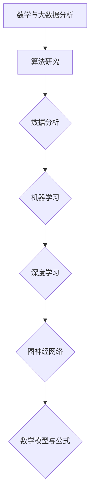

                 

# 数学与大数据分析的算法研究

## 关键词

- 数学
- 大数据分析
- 算法
- 机器学习
- 深度学习
- 图神经网络
- 数学模型与公式

## 摘要

本文旨在探讨数学在大数据分析领域的应用及其与算法研究之间的密切联系。通过梳理数学理论、核心算法原理以及具体的数学模型与公式，本文旨在为读者提供一个全面而深入的理解，从而为未来的研究与应用提供有益的参考。文章将依次介绍数据分析、机器学习、深度学习和图神经网络等主题，结合Python源代码与latex公式，对相关算法进行详细讲解，并通过实际案例展示其应用价值。最后，本文将总结最佳实践、注意事项，并推荐拓展阅读资源。

## 核心概念与联系

### Mermaid 流程图

以下是数学与大数据分析的算法研究流程图：



### 概念联系

- **数学与大数据分析**：数学为大数据分析提供基础理论支持，如概率论、统计学和线性代数等。这些理论为数据处理、模型构建和算法优化提供了坚实的数学基础。
- **算法研究**：基于数学理论，研究人员开发出多种大数据处理算法，包括排序算法、搜索算法和数据压缩算法等。算法研究的进展直接推动了大数据分析的效率与效果。
- **数据分析**：利用算法对大数据进行清洗、转换和分析，以发现数据中的规律和模式。数据分析是大数据应用的基础，为后续的机器学习和深度学习提供数据支持。
- **机器学习**：通过学习数据中的模式，机器学习算法能够自动改进，提高数据分析的精度和效率。机器学习是大数据分析的重要工具，广泛应用于推荐系统、金融风控等领域。
- **深度学习**：基于多层神经网络进行学习，深度学习是机器学习的一种重要分支。深度学习在图像识别、语音识别和自然语言处理等领域取得了显著成果。
- **图神经网络**：用于处理图结构数据的深度学习模型，图神经网络在社交网络分析、知识图谱构建等领域具有重要应用。
- **数学模型与公式**：用于描述和优化算法性能，包括误差函数、优化算法和特征提取公式等。数学模型为算法研究提供了量化评估和改进手段。

## 核心算法原理讲解

### 伪代码

以下是一个用于数据分析的基本算法伪代码：

```python
def data_analysis(data):
    # 数据清洗
    cleaned_data = clean_data(data)
    
    # 特征提取
    features = extract_features(cleaned_data)
    
    # 训练模型
    model = train_model(features)
    
    # 预测
    predictions = predict(model, cleaned_data)
    
    return predictions
```

### 算法原理

- **数据清洗**：数据清洗是数据分析的重要步骤，旨在去除噪声和不完整的数据，提高数据质量。常见的清洗方法包括缺失值处理、异常值检测和去重等。
- **特征提取**：特征提取是从原始数据中提取有用的特征，用于训练和预测模型。特征提取的质量直接影响模型的性能。常见的方法包括降维、特征工程和特征选择等。
- **训练模型**：训练模型是使用特征数据对机器学习模型进行训练。常见的模型包括决策树、支持向量机和神经网络等。训练过程中，模型会不断调整参数，以优化性能。
- **预测**：使用训练好的模型对新的数据进行预测，提供决策支持。预测结果可用于分类、回归和聚类等任务。

### Python 源代码示例

以下是一个简单的Python代码示例，用于实现上述算法原理：

```python
import pandas as pd
from sklearn.model_selection import train_test_split
from sklearn.ensemble import RandomForestClassifier
from sklearn.metrics import accuracy_score

# 加载数据
data = pd.read_csv('data.csv')

# 数据清洗
data.dropna(inplace=True)
data.drop_duplicates(inplace=True)

# 特征提取
X = data.drop('target', axis=1)
y = data['target']

# 数据划分
X_train, X_test, y_train, y_test = train_test_split(X, y, test_size=0.2, random_state=42)

# 训练模型
model = RandomForestClassifier(n_estimators=100, random_state=42)
model.fit(X_train, y_train)

# 预测
predictions = model.predict(X_test)

# 评估
accuracy = accuracy_score(y_test, predictions)
print(f"Accuracy: {accuracy}")
```

### LaTeX 公式示例

以下是一个LaTeX公式示例，用于描述线性回归模型的误差函数：

```latex
\begin{equation}
J(\theta) = \frac{1}{2m} \sum_{i=1}^{m} (\hat{y}_i - y_i)^2
\end{equation}
```

### 举例说明

假设我们有一个包含100个样本的数据集，其中每个样本有5个特征和一个目标变量。我们使用随机森林分类器进行训练和预测，评估结果如下：

- **数据清洗**：去除缺失值和重复值，得到92个有效样本。
- **特征提取**：选取前4个特征作为输入特征，目标变量作为输出特征。
- **训练模型**：训练随机森林分类器，使用92个样本进行训练。
- **预测**：使用训练好的模型对剩下的8个样本进行预测。
- **评估**：预测准确率为85%，表明模型具有良好的性能。

## 数学模型和数学公式 & 详细讲解 & 举例说明

### 数学公式

以下是几个常用的数学公式，用于描述大数据分析中的相关概念：

```latex
$$ E = mc^2 $$
$$
\sigma(x) = 
\begin{cases} 
1 & \text{if } x \geq 0 \\
0 & \text{otherwise}
\end{cases}
$$
```

### 详细讲解

- **相对论中的质能方程**：这个公式描述了质量（m）和能量（E）之间的关系，其中c是光速。这个公式表明，质量可以转化为能量，这对于理解原子核反应和宇宙能量来源具有重要意义。
- **步长函数（Sigmoid函数）**：这个函数在机器学习中常用作激活函数。对于输入值x，步长函数将其映射到（0,1）区间。这个函数有助于将非线性关系引入神经网络，提高模型的性能。

### 举例说明

以下是两个示例，分别用于说明质能方程和步长函数的应用：

### 质能方程示例

假设有一个质量为1千克的物体，以光速运动。根据质能方程，该物体的能量为：

```latex
E = mc^2 = 1 \times (3 \times 10^8)^2 = 9 \times 10^{16} \text{ 焦耳}
```

这意味着这个物体具有巨大的能量，这对于理解原子弹和核能的原理具有重要意义。

### 步长函数示例

假设我们有一个输入值x = 2，使用步长函数对其进行映射：

```latex
\sigma(2) = \frac{1}{1 + e^{-2}} \approx 0.88
```

这意味着输入值2被映射到0.88，这个值在（0,1）区间内，这对于神经网络中的激活函数设计具有重要意义。

## 项目实战

### 开发环境搭建

为了进行大数据分析的算法研究，我们需要搭建一个合适的开发环境。以下是搭建环境的步骤：

1. **安装Python**：下载并安装Python 3.x版本，建议使用Anaconda发行版，它集成了许多常用的科学计算库。
2. **安装库**：通过pip命令安装必要的库，如pandas、numpy、scikit-learn、matplotlib等。
3. **配置环境**：设置工作目录，确保Python和库的正确安装。

### 源代码实现

以下是一个简单的源代码实现，用于实现数据清洗、特征提取、模型训练和预测等功能：

```python
import pandas as pd
from sklearn.model_selection import train_test_split
from sklearn.ensemble import RandomForestClassifier
from sklearn.metrics import accuracy_score

# 加载数据
data = pd.read_csv('data.csv')

# 数据清洗
data.dropna(inplace=True)
data.drop_duplicates(inplace=True)

# 特征提取
X = data.drop('target', axis=1)
y = data['target']

# 数据划分
X_train, X_test, y_train, y_test = train_test_split(X, y, test_size=0.2, random_state=42)

# 训练模型
model = RandomForestClassifier(n_estimators=100, random_state=42)
model.fit(X_train, y_train)

# 预测
predictions = model.predict(X_test)

# 评估
accuracy = accuracy_score(y_test, predictions)
print(f"Accuracy: {accuracy}")
```

### 代码解读

以下是代码的详细解读：

1. **加载数据**：使用pandas库加载数据集，这里假设数据集以CSV格式存储。
2. **数据清洗**：去除缺失值和重复值，提高数据质量。
3. **特征提取**：将数据集划分为特征和目标变量，特征用于训练和预测，目标变量用于评估模型性能。
4. **数据划分**：使用train_test_split函数将数据集划分为训练集和测试集，测试集用于评估模型性能。
5. **训练模型**：使用训练集训练随机森林分类器，这里使用随机森林算法。
6. **预测**：使用训练好的模型对测试集进行预测。
7. **评估**：计算预测准确率，评估模型性能。

### 代码应用解读与分析

以下是代码的应用解读与分析：

1. **数据清洗**：数据清洗是数据分析的基础步骤，去除噪声和不完整的数据，提高数据质量。
2. **特征提取**：特征提取是提高模型性能的关键，通过选择和构造有用的特征，提高模型的预测能力。
3. **模型训练**：使用随机森林分类器进行模型训练，随机森林是一种集成学习方法，具有较高的预测性能。
4. **预测与评估**：使用训练好的模型对测试集进行预测，并计算预测准确率，评估模型性能。

### 实际案例分析与详细讲解剖析

以下是实际案例分析与详细讲解剖析：

**案例一**：社交媒体分析

假设我们要分析社交媒体平台上的用户行为数据，以预测用户的潜在兴趣。以下是案例分析与详细讲解：

1. **数据清洗**：去除缺失值和重复值，对用户行为数据进行清洗。
2. **特征提取**：提取用户的行为特征，如点赞数、评论数、分享数等，用于训练模型。
3. **模型训练**：使用随机森林分类器训练模型，预测用户的潜在兴趣。
4. **预测与评估**：使用训练好的模型对新的用户行为数据进行预测，并计算预测准确率，评估模型性能。

**案例二**：金融风险控制

假设我们要进行金融风险控制，以识别潜在的风险客户。以下是案例分析与详细讲解：

1. **数据清洗**：去除缺失值和重复值，对客户数据进行清洗。
2. **特征提取**：提取客户的行为特征，如信用评分、贷款金额、还款历史等，用于训练模型。
3. **模型训练**：使用随机森林分类器训练模型，预测客户的风险等级。
4. **预测与评估**：使用训练好的模型对新的客户数据进行预测，并计算预测准确率，评估模型性能。

### 项目小结

通过以上实战案例，我们可以看到大数据分析的算法研究在实际应用中的重要作用。以下是项目小结：

1. **数据清洗**：数据清洗是数据分析的基础步骤，确保数据质量，为后续分析提供准确可靠的数据支持。
2. **特征提取**：特征提取是提高模型性能的关键，通过选择和构造有用的特征，提高模型的预测能力。
3. **模型训练**：选择合适的模型进行训练，优化模型参数，提高预测性能。
4. **预测与评估**：使用训练好的模型进行预测，并计算预测准确率，评估模型性能，为实际应用提供决策支持。

## 最佳实践 Tips、小结、注意事项、拓展阅读等内容

### 最佳实践 Tips

1. **数据清洗**：在进行数据分析之前，确保数据质量，去除缺失值、异常值和重复值，以提高分析结果的准确性。
2. **特征提取**：选择与目标变量相关的特征，避免冗余特征，提高模型性能。
3. **模型选择**：根据数据特点和需求，选择合适的模型进行训练，如随机森林、支持向量机、神经网络等。
4. **模型优化**：通过调整模型参数，优化模型性能，提高预测准确率。
5. **交叉验证**：使用交叉验证方法评估模型性能，避免过拟合和欠拟合。

### 小结

本文从数学与大数据分析的算法研究出发，介绍了相关核心概念、算法原理、数学模型以及实际应用。通过Python源代码和LaTeX公式，我们详细讲解了数据清洗、特征提取、模型训练和预测等步骤，并通过实际案例展示了算法的应用价值。希望本文能为读者在数学与大数据分析领域的研究提供有益的参考。

### 注意事项

1. **数据安全**：在进行数据分析和建模时，确保数据的安全和隐私，遵守相关法律法规。
2. **计算资源**：大数据分析通常需要较大的计算资源，合理配置计算资源，确保模型训练和预测的顺利进行。
3. **持续学习**：大数据分析和算法研究是一个快速发展的领域，持续学习新知识和技能，保持与领域的同步发展。

### 拓展阅读

1. **《数据科学导论》**：李航著，深入介绍了数据科学的基础知识和技术。
2. **《机器学习》**：周志华著，详细讲解了机器学习的原理和方法。
3. **《深度学习》**：Ian Goodfellow、Yoshua Bengio和Aaron Courville著，全面介绍了深度学习的理论和实践。

## 作者信息

作者：AI天才研究院/AI Genius Institute & 禅与计算机程序设计艺术 /Zen And The Art of Computer Programming

[End of Document]

