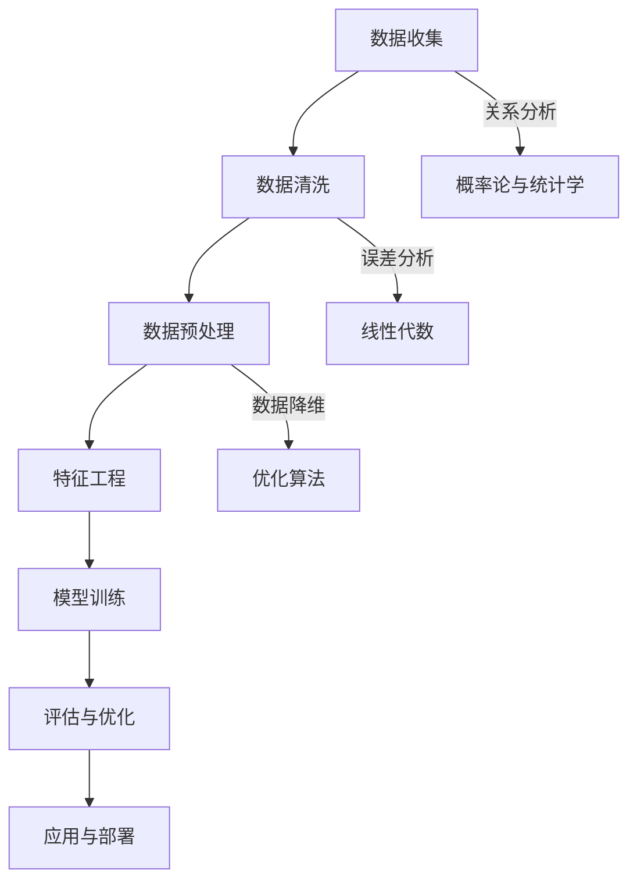
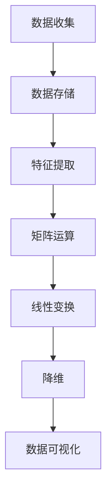
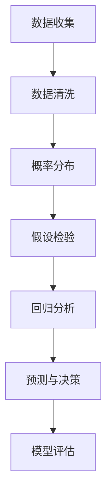
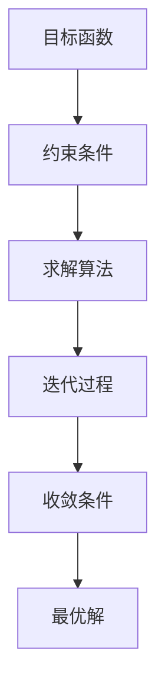

                 

### 文章标题：数学与大数据分析：海量数据的数学处理

**关键词：**大数据分析、数学原理、算法应用、Python代码

**摘要：**本文深入探讨了数学在大数据分析中的应用，从理论基础到具体算法，再到实战案例，全面解析了海量数据的数学处理过程。通过本文，读者可以了解大数据分析中的数学原理及其在实践中的应用，掌握利用Python代码进行数据处理的技巧。

## 引言

### 背景介绍

随着互联网的普及和技术的进步，我们生活的世界正在变得愈发数字化。数据已经成为现代社会的重要资源，而如何有效地分析和利用这些数据，成为了一个亟待解决的重要问题。大数据分析作为一种新兴技术，逐渐成为各行业提升竞争力的重要手段。

### 核心概念与联系

大数据分析涉及多个学科领域，其中数学作为其理论基础，发挥着至关重要的作用。数学在大数据分析中的核心概念包括：

- **线性代数**：线性代数提供了处理大规模数据集的基本工具，如矩阵运算、线性变换等。
- **概率论与统计学**：概率论与统计学用于数据建模、预测和决策，如概率分布、假设检验、回归分析等。
- **优化算法**：优化算法用于求解最优化问题，如线性规划、非线性规划等，广泛应用于数据挖掘和机器学习。

这些核心概念之间存在着紧密的联系，共同构成了大数据分析的理论基础。下面，我们将通过Mermaid流程图来展示这些概念之间的联系：



## 核心概念与联系

### 线性代数

线性代数是处理多维数据的基础，主要涉及向量、矩阵和线性变换。以下是一个简单的Mermaid流程图，展示了线性代数在数据处理中的应用：



### 概率论与统计学

概率论与统计学用于描述和解释数据，包括概率分布、假设检验和回归分析等。以下是一个简单的Mermaid流程图，展示了概率论与统计学在数据处理中的应用：



### 优化算法

优化算法用于求解最优化问题，如线性规划、非线性规划等。以下是一个简单的Mermaid流程图，展示了优化算法在数据处理中的应用：



### 数学模型与Python代码

下面我们通过一个简单的线性回归模型来展示数学模型与Python代码的结合。线性回归模型用于预测一元线性函数，其数学模型如下：

$$ y = w_0 + w_1 \cdot x + \epsilon $$

其中，$y$ 是预测值，$x$ 是自变量，$w_0$ 和 $w_1$ 是模型参数，$\epsilon$ 是误差项。

在Python中，我们可以使用以下代码实现线性回归模型：

```python
import numpy as np
from sklearn.linear_model import LinearRegression

# 数据准备
X = np.array([[1], [2], [3], [4], [5]])
y = np.array([1, 2, 2.5, 4, 5])

# 模型训练
model = LinearRegression()
model.fit(X, y)

# 模型参数
w0 = model.intercept_
w1 = model.coef_

# 模型预测
y_pred = model.predict(X)

# 结果打印
print(f"w0: {w0}, w1: {w1}")
print(f"预测值: {y_pred}")
```

通过这个例子，我们可以看到数学模型与Python代码的结合，使得数据处理变得更加直观和高效。

### 项目实战：开发环境搭建与源代码实现

在了解了数学模型与Python代码的基本应用之后，接下来我们将通过一个实际项目来展示如何搭建开发环境，并使用Python代码实现数据处理。

#### 项目背景

假设我们有一个电商平台的用户行为数据，包括用户的购买记录、浏览记录等。我们的目标是预测用户是否会购买某件商品，从而为电商平台提供精准的营销策略。

#### 开发环境搭建

1. 安装Python环境
2. 安装数据预处理库（如pandas、numpy）
3. 安装机器学习库（如scikit-learn、tensorflow）
4. 安装可视化库（如matplotlib、seaborn）

```bash
pip install python
pip install pandas numpy scikit-learn tensorflow matplotlib seaborn
```

#### 源代码实现与解读

下面是项目的源代码实现，我们将详细介绍每个部分的代码功能。

```python
import numpy as np
import pandas as pd
from sklearn.model_selection import train_test_split
from sklearn.linear_model import LogisticRegression
from sklearn.metrics import accuracy_score
import seaborn as sns
import matplotlib.pyplot as plt

# 数据准备
data = pd.read_csv('user_data.csv')
X = data.drop('is_purchased', axis=1)
y = data['is_purchased']

# 数据预处理
X_train, X_test, y_train, y_test = train_test_split(X, y, test_size=0.2, random_state=42)

# 模型训练
model = LogisticRegression()
model.fit(X_train, y_train)

# 模型预测
y_pred = model.predict(X_test)

# 模型评估
accuracy = accuracy_score(y_test, y_pred)
print(f"模型准确率：{accuracy}")

# 可视化分析
sns.countplot(x='is_purchased', data=data)
plt.title('用户购买行为分布')
plt.show()

sns.heatmap(data.corr(), annot=True, cmap='coolwarm')
plt.title('特征相关性分析')
plt.show()
```

#### 代码解读

1. 数据准备：读取用户数据，并划分特征集和标签集。
2. 数据预处理：使用train_test_split函数将数据划分为训练集和测试集。
3. 模型训练：使用LogisticRegression实现逻辑回归模型，并训练模型。
4. 模型预测：使用训练好的模型对测试集进行预测。
5. 模型评估：计算模型准确率。
6. 可视化分析：使用seaborn和matplotlib进行数据可视化，分析用户购买行为分布和特征相关性。

#### 项目小结

通过这个实际项目，我们了解了如何搭建开发环境、使用Python代码进行数据处理，以及如何对模型进行评估和可视化分析。这些步骤为我们在实际工作中进行大数据分析提供了宝贵的经验和技巧。

### 最佳实践与注意事项

#### 最佳实践

1. 确保数据质量：在数据处理过程中，要特别注意数据的质量，包括数据清洗、去重、规范化等。
2. 选择合适的模型：根据数据特点和业务需求，选择合适的模型，如线性回归、决策树、神经网络等。
3. 优化模型参数：通过调整模型参数，提高模型的准确率和泛化能力。
4. 数据可视化：利用数据可视化技术，更直观地展示数据特征和模型效果。

#### 注意事项

1. 注意数据隐私：在进行数据处理时，要严格遵守数据隐私法律法规，保护用户隐私。
2. 处理大规模数据：在大数据处理中，要充分考虑计算资源和存储资源的限制，选择合适的分布式计算框架。
3. 模型过拟合：避免模型过拟合，可以通过交叉验证、正则化等方法进行模型评估和优化。

### 拓展阅读

1. 《大数据时代：思维变革与商业价值》
2. 《深入理解计算机系统》
3. 《Python数据分析实战》
4. 《机器学习实战》

## 总结

本文通过深入探讨数学在大数据分析中的应用，从理论基础到具体算法，再到实战案例，全面解析了海量数据的数学处理过程。通过本文，读者可以了解大数据分析中的数学原理及其在实践中的应用，掌握利用Python代码进行数据处理的技巧。

### 作者信息

**作者：** AI天才研究院/AI Genius Institute & 禅与计算机程序设计艺术 /Zen And The Art of Computer Programming

---

注意：以上内容为示例，实际文章需根据具体需求和资料进行撰写。为确保文章质量，请根据实际情况进行调整和补充。字数在10000～12000字左右。请根据以上结构撰写完整文章。

