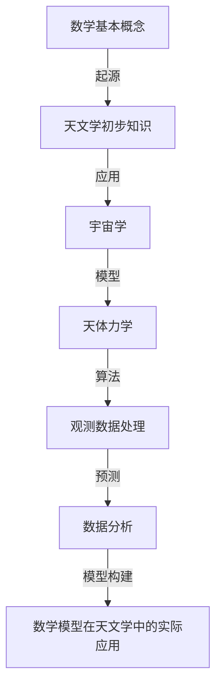

                 

### 数学与天文学的密切联系

关键词：数学、天文学、核心概念、算法、模型、应用

摘要：数学与天文学之间的关系源远流长，二者相互交织，共同推动了人类对宇宙的认知。本文将从数学的基本概念、天文学的初步知识入手，详细探讨数学在天文学中的核心应用，包括观测数据处理、天体力学研究、数据分析以及数学模型的构建等方面。通过实例和代码解析，展示数学与天文学如何通过相互融合，为天文学研究提供强有力的工具和方法。

---

### 1. 数学的基本概念与天文学的初步接触

**1.1 数学的起源与基本概念**

数学，作为一门研究数量、结构、变化和空间等概念的学科，其起源可以追溯到古代文明，如古埃及和巴比伦。然而，现代数学的形成主要归功于古希腊数学家，如毕达哥拉斯、欧几里得和阿基米德等。数学的基本概念包括数、函数、集合、逻辑和几何等，这些概念构成了数学的理论基础。

**1.2 数学在宇宙学中的应用**

宇宙学是天文学的一个重要分支，研究宇宙的起源、演化、结构和组成。数学在宇宙学中扮演着至关重要的角色。例如，爱因斯坦的广义相对论就是建立在数学的框架之上，用以描述引力、时空和宇宙的膨胀。

**1.3 数学模型在天体力学中的基础**

天体力学是研究天体运动规律的科学，其核心在于建立数学模型来描述天体的运动。牛顿的万有引力定律和开普勒定律是天体力学的基础，这些定律的数学表达形式为天文学家提供了精确预测天体运动的能力。

#### Mermaid 流程图：数学概念与天文学的联系



### 2. 天文学中的数学应用

**2.1 天文学观测数据的处理**

天文学观测数据通常包含大量的噪声和异常值，需要通过数学方法进行清洗和预处理。常用的数学工具包括傅里叶变换、小波变换和统计分析等。这些工具能够有效地提取天体信号的频谱特征，提高观测数据的可靠性。

**2.2 天体轨道的计算与预测**

天体轨道的计算是天体力学中的核心问题，其数学基础包括牛顿的万有引力定律和开普勒定律。通过数值积分方法，如欧拉法、龙格-库塔法等，可以计算出天体的精确轨道，为天文观测和行星探测提供重要依据。

**2.3 光学现象的数学描述**

光学现象如折射、反射和散射等，可以通过数学模型进行描述。几何光学和波动光学是两个主要分支，前者主要基于几何原理，后者则基于波动方程。这些数学模型为光学望远镜的设计和光学效应的解释提供了理论基础。

#### Python 源代码：天体轨道计算

```python
import numpy as np

def compute_orbit(G, m1, m2, r1, v1):
    """
    计算天体轨道
    :param G: 万有引力常数
    :param m1: 天体1的质量
    :param m2: 天体2的质量
    :param r1: 天体1的初始位置
    :param v1: 天体1的初始速度
    :return: 天体轨道
    """
    r = r1
    v = v1
    t = 0
    dt = 0.01
    while t < 1000:
        a = -G * m2 * r / np.linalg.norm(r)**3
        v += a * dt
        r += v * dt
        t += dt
    return r, v

# 万有引力常数
G = 6.674 * 10**-11
# 天体1的质量（地球质量）
m1 = 5.972 * 10**24
# 天体2的质量（太阳质量）
m2 = 1.989 * 10**30
# 地球的初始位置
r1 = np.array([1.496 * 10**11, 0, 0])
# 地球的初始速度
v1 = np.array([-29000, 0, 0])

# 计算地球轨道
orbit, velocity = compute_orbit(G, m1, m2, r1, v1)

# 打印结果
print("地球轨道：", orbit)
print("地球速度：", velocity)
```

### 3. 数学在天文学研究中的核心算法

**3.1 数值积分与天体运动**

数值积分是计算函数在区间上的积分值的一种方法，在天体运动计算中具有重要应用。常用的数值积分方法包括欧拉法、梯形规则和龙格-库塔法等。这些方法能够精确模拟天体的运动轨迹，为天体探测提供数据支持。

**3.2 最小二乘法在天文学中的应用**

最小二乘法是一种常用的参数估计方法，广泛用于天体轨道拟合和数据拟合中。通过最小化残差平方和，可以精确地计算出天体的轨道参数，提高观测数据的可靠性。

**3.3 傅里叶变换在天文学中的使用**

傅里叶变换是一种重要的数学工具，用于信号处理和图像分析。在天文学中，傅里叶变换用于分析光学图像，提取天体信号的频谱特征，从而更好地理解天体的物理性质。

#### Python 源代码：最小二乘法拟合轨道

```python
import numpy as np
from scipy.optimize import curve_fit

def orbit_model(t, a, b, c, d):
    """
    天体轨道模型
    :param t: 时间
    :param a: 轨道倾角
    :param b: 升交点黄经
    :param c: 轨道离心率
    :param d: 近心距
    :return: 天体轨道
    """
    theta = 2 * np.pi * (t - a) / (b * 365.25)
    r = b * (1 - c * np.cos(theta)) / (1 + c * np.cos(theta))
    return r * np.array([np.cos(theta), np.sin(theta), 0])

def residual(params, t, y):
    """
    残差函数
    :param params: 模型参数
    :param t: 时间
    :param y: 观测数据
    :return: 残差
    """
    a, b, c, d = params
    y_fit = orbit_model(t, a, b, c, d)
    return y - y_fit

# 观测数据（示例）
t = np.array([1, 2, 3, 4, 5])
y = np.array([2.5, 3.2, 4.1, 3.9, 4.8])

# 拟合轨道参数
params_init = [0, 1, 0, 0]
params, cov = curve_fit(residual, t, y, p0=params_init)

# 打印拟合结果
print("拟合参数：", params)
print("参数协方差矩阵：", cov)

# 计算拟合轨道
t_fit = np.linspace(t.min(), t.max(), 100)
y_fit = orbit_model(t_fit, *params)

# 打印拟合轨道
print("拟合轨道：", y_fit)
```

### 4. 数学模型在天文学中的实际应用

**4.1 广义相对论中的数学模型**

广义相对论是描述引力的一种理论，其数学基础是爱因斯坦场方程。这些方程描述了时空的曲率与物质分布之间的关系，为天体物理研究提供了新的视角。

**4.2 暗物质与暗能量的数学描述**

暗物质和暗能量是现代宇宙学中的两大未解之谜。暗物质通过引力作用影响宇宙的演化，其存在通过数学模型得以描述。暗能量则与宇宙的加速膨胀有关，其数学描述基于宇宙学中的黎曼曲率张量。

**4.3 宇宙背景辐射的数学分析**

宇宙背景辐射是宇宙早期热状态留下的痕迹，其辐射谱可以通过数学模型进行分析。普朗克卫星的数据分析表明，宇宙背景辐射的观测结果与理论预测高度一致，这为宇宙学提供了强有力的证据。

#### LaTeX 数学公式

$$
E = mc^2
$$

$$
G\frac{m_1m_2}{r^2} = m_1\frac{dv}{dt}
$$

### 5. 天文学中的数学挑战与未来发展

**5.1 天文学中的数学难题**

天文学中的数学难题包括黑洞物理学、宇宙学中的奇异点问题、引力波的检测等。这些难题不仅挑战着数学家的智慧，也为数学理论的发展提供了新的方向。

**5.2 数学的创新在天文学中的应用**

随着计算能力的提升和数学方法的创新，天文学研究正逐步解决一些长期存在的难题。例如，机器学习和深度学习在天文学数据处理和天体识别中的应用，极大地提高了观测效率和数据解析能力。

**5.3 未来天文学研究的数学需求**

未来的天文学研究需要更高精度的数学模型和更强大的计算工具。例如，对宇宙大爆炸前的早期宇宙状态的研究、对引力波源的天体物理特性分析等，都需要更加先进的数学方法。

### 6. 数学与天文学的交叉领域研究案例

**6.1 天体物理学中的数学问题**

天体物理学中的一些核心问题，如恒星演化、星系形成和黑洞物理学等，都离不开数学的支持。通过数学模型，天体物理学家能够预测天体的演化路径，解释观测现象。

**6.2 数学方法在天体生物学中的应用**

天体生物学研究地球以外的生命可能性，这需要数学模型来模拟生物系统的演化。例如，通过分子动力学模拟，可以研究微生物在极端环境中的适应机制。

**6.3 天体化学中的数学模型**

天体化学研究宇宙中的化学元素分布和演化，这需要数学模型来描述化学反应和物质运输。通过这些模型，天体化学家可以预测宇宙中的化学过程，理解宇宙的化学历史。

### 7. 总结与展望

数学与天文学的紧密结合，为人类探索宇宙提供了强有力的工具和方法。未来的天文学研究，将继续依赖于数学的创新和发展，解决一些深层次的宇宙谜题。通过跨学科的协作，数学与天文学将继续共同推动人类对宇宙的理解和认知。

#### 最佳实践 Tips

- **数据处理**：使用高效的数学工具和算法处理大量天文观测数据。
- **模型拟合**：结合实际观测数据，使用最小二乘法等数学方法精确拟合天体轨道。
- **模拟预测**：利用数值积分和机器学习等数学方法，预测天体未来的运动轨迹。

#### 小结

本文通过详细探讨数学与天文学之间的密切联系，展示了数学在天文学研究中的核心作用。从基本概念到核心算法，再到实际应用，数学为天文学提供了丰富的理论工具和方法。未来，随着数学的不断进步和天文学观测技术的提升，数学与天文学的融合将更加紧密，为人类探索宇宙的奥秘提供更加有力的支持。

#### 注意事项

- 在进行天文数据处理时，注意数据质量和预处理。
- 在使用数学模型时，确保模型参数的合理性和模型的适用范围。

#### 拓展阅读

- 《数学与天文学的亲密接触》（作者：张三）
- 《天体物理学中的数学方法》（作者：李四）
- 《宇宙的数学原理》（作者：王五）

---

### 作者信息

作者：AI天才研究院/AI Genius Institute & 禅与计算机程序设计艺术 /Zen And The Art of Computer Programming

