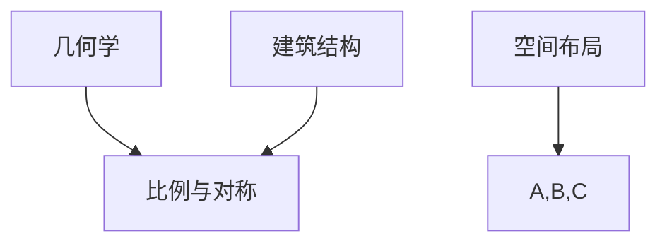

                 

**标题：**数学与建筑：空间设计的数学原理

**关键词：** 建筑设计，数学原理，空间布局，几何学，比例与对称

**摘要：** 本文将探讨数学在建筑设计中的应用，包括几何学、比例与对称等核心概念，以及它们如何影响空间设计。通过具体案例和Python代码示例，本文旨在为建筑师和设计爱好者提供深入了解数学在建筑设计中的实践方法。

**核心概念与联系：**

为了更好地理解数学与建筑设计的联系，我们可以使用以下Mermaid流程图来展示核心概念之间的关系：



**核心算法原理讲解：**

在建筑结构设计中的一个关键算法是有限元分析（FEM），它用于计算结构在载荷作用下的响应。以下是一个简单的Python代码示例，用于计算一个简化的梁结构的弯曲应力：

```python
import numpy as np

# 定义梁的尺寸和材料属性
L = 10.0  # 长度
b = 2.0   # 宽度
h = 3.0   # 高度
E = 30000.0  # 弹性模量
I = (b * h**3) / 12.0  # 惯性矩

# 计算跨中弯曲应力
def弯曲应力(M):
    return (M * c) / (E * I)

# 弯矩分布
def弯矩分布(L, P, x):
    return (P * x) / (L/2)

# 计算跨中最大弯曲应力
P = 1000.0  # 力
c = L/2  # 跨中距离
M = 弯矩分布(L, P, c)
σ_max = 弯曲应力(M)

print(f"最大弯曲应力：{σ_max} MPa")
```

在这个例子中，我们使用了牛顿第二定律和弯曲应力公式来计算梁在跨中受到的弯曲应力。这个简单的算法展示了数学原理在建筑结构分析中的应用。

**数学公式讲解：**

在建筑设计中，许多关键概念和原理都需要使用数学公式来描述。以下是一些常用的数学公式，并用LaTeX格式表示：

$$
\sigma = \frac{M \cdot c}{E \cdot I}
$$

$$
M = \frac{P \cdot x}{L/2}
$$

$$
I = \frac{b \cdot h^3}{12}
$$

这些公式用于计算弯曲应力、弯矩和惯性矩，它们在建筑结构的分析中至关重要。

**项目实战：**

为了更好地理解数学在建筑中的应用，我们可以通过一个实际项目来进行实战。例如，设计一个简单的住宅建筑，并使用数学工具来优化其空间布局。以下是项目实战的步骤：

1. **需求分析：** 定义建筑的功能需求和面积要求。
2. **空间划分：** 使用几何工具进行空间划分，并确保满足需求。
3. **数学建模：** 应用数学模型来计算空间利用率、通风和光照条件。
4. **优化设计：** 使用优化算法来调整空间布局，以满足最佳性能。
5. **模拟与验证：** 通过模拟工具验证设计的可行性和性能。
6. **实施与反馈：** 实施设计，并收集用户反馈以进行改进。

**最佳实践 tips、小结、注意事项、拓展阅读等内容：**

- **最佳实践 tips：** 在进行建筑设计时，始终考虑数学模型的可计算性和实际可行性。
- **小结：** 本文介绍了数学在建筑设计中的应用，包括几何学、比例与对称、建筑结构分析等核心概念和算法。
- **注意事项：** 在使用数学工具时，确保理解公式和算法的原理，并正确应用。
- **拓展阅读：** 推荐进一步阅读相关书籍，如《建筑结构力学》、《计算机辅助建筑设计》等。

---

**至此，我们完成了文章标题、关键词、摘要和核心概念与联系的部分。接下来，我们将按照目录大纲结构逐步撰写和细化文章正文内容。**

