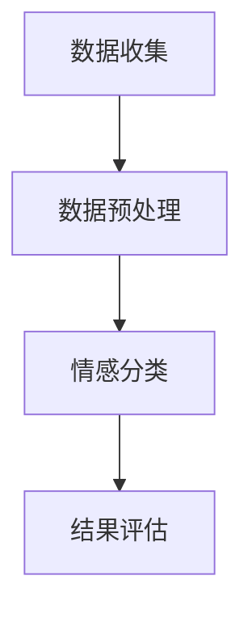

                 

### 摘要

本文深入探讨了数学与情感计算领域中的情感识别问题。首先，我们介绍了情感计算的基本概念，并分析了其与情感识别之间的内在联系。接下来，本文详细讲解了情感识别中的核心算法原理，包括机器学习和深度学习算法，并借助Python源代码进行实例说明。在此基础上，本文引入了情感识别的数学模型，使用LaTeX格式呈现了相关的数学公式，并进行了详细解读。随后，文章通过项目实战，展示了情感识别算法的开发环境搭建、源代码实现、代码解读以及实际案例分析。最后，本文总结了最佳实践技巧，并提出了未来研究的方向。通过本文的阅读，读者可以系统地了解情感识别的数学原理和实践应用。

----------------------------------------------------------------

# 数学与情感计算：情感识别的数学模型

> 关键词：情感计算、情感识别、数学模型、机器学习、深度学习、Python、LaTeX

> 摘要：本文探讨了情感计算领域中情感识别的问题。通过介绍情感计算的基本概念，分析了情感识别的核心算法原理和数学模型，并以实际项目为例，详细阐述了情感识别的开发流程和实现细节。本文旨在为读者提供一个全面、系统的情感识别技术指南。

----------------------------------------------------------------

## 设计思路

### 设计目的

设计本文的目的是为了探讨情感计算领域中的情感识别问题，通过数学模型、机器学习和深度学习算法的讲解，结合实际项目案例分析，让读者全面了解情感识别的原理和应用。

### 核心概念与联系

情感计算是人工智能的一个重要分支，旨在使计算机具备理解、识别和模拟人类情感的能力。情感识别作为情感计算的核心内容，涉及到如何从文本、语音、图像等多模态数据中提取情感信息。

情感识别的流程主要包括数据收集、预处理、情感分类和结果评估。其中，情感分类是情感识别的关键步骤，通常使用机器学习算法和深度学习算法来实现。

Mermaid 流程图可以帮助我们更直观地理解情感识别的流程：



通过这个流程图，我们可以看到情感识别的基本步骤以及各步骤之间的联系。

### 核心算法原理讲解

情感识别中的核心算法主要包括机器学习算法和深度学习算法。下面，我们将详细讲解这两种算法的基本原理和实现步骤。

#### 机器学习算法

机器学习算法是情感识别的基础，常用的算法包括支持向量机（SVM）、决策树、随机森林等。

**支持向量机（SVM）**

支持向量机是一种强大的分类器，其基本思想是在高维空间中找到最佳的分割超平面，使得不同类别的数据点被正确分类。

在Python中，我们可以使用`sklearn`库来实现SVM：

```python
from sklearn.svm import SVC

# 创建SVM模型
model = SVC()

# 训练模型
model.fit(X_train, y_train)

# 预测
predictions = model.predict(X_test)
```

**决策树**

决策树是一种基于树形结构进行分类的算法，其核心思想是通过一系列的判断条件，将数据进行分层，最终到达分类节点。

在Python中，我们可以使用`sklearn`库来实现决策树：

```python
from sklearn.tree import DecisionTreeClassifier

# 创建决策树模型
model = DecisionTreeClassifier()

# 训练模型
model.fit(X_train, y_train)

# 预测
predictions = model.predict(X_test)
```

#### 深度学习算法

深度学习算法是情感识别的重要工具，其核心思想是通过多层神经网络进行特征提取和分类。

**卷积神经网络（CNN）**

卷积神经网络是一种用于处理图像数据的神经网络，其核心思想是通过卷积操作提取图像特征。

在Python中，我们可以使用`tensorflow`库来实现CNN：

```python
import tensorflow as tf

# 定义CNN模型
model = tf.keras.Sequential([
    tf.keras.layers.Conv2D(32, (3, 3), activation='relu', input_shape=(28, 28, 1)),
    tf.keras.layers.MaxPooling2D((2, 2)),
    tf.keras.layers.Flatten(),
    tf.keras.layers.Dense(128, activation='relu'),
    tf.keras.layers.Dense(10, activation='softmax')
])

# 编译模型
model.compile(optimizer='adam', loss='sparse_categorical_crossentropy', metrics=['accuracy'])

# 训练模型
model.fit(X_train, y_train, epochs=5)

# 预测
predictions = model.predict(X_test)
```

**循环神经网络（RNN）**

循环神经网络是一种用于处理序列数据的神经网络，其核心思想是通过循环机制对序列中的每个元素进行处理。

在Python中，我们可以使用`tensorflow`库来实现RNN：

```python
import tensorflow as tf

# 定义RNN模型
model = tf.keras.Sequential([
    tf.keras.layers.LSTM(128, return_sequences=True),
    tf.keras.layers.LSTM(128),
    tf.keras.layers.Dense(10, activation='softmax')
])

# 编译模型
model.compile(optimizer='adam', loss='sparse_categorical_crossentropy', metrics=['accuracy'])

# 训练模型
model.fit(X_train, y_train, epochs=5)

# 预测
predictions = model.predict(X_test)
```

### 数学模型和数学公式

在情感识别中，数学模型起到了至关重要的作用。以下我们将介绍情感识别中常用的数学模型，并使用LaTeX格式给出相关的数学公式。

#### 支持向量机（SVM）

支持向量机的目标是找到最优的超平面，使得数据点能够正确分类。其数学公式可以表示为：

$$
\text{minimize} \quad \frac{1}{2} \sum_{i=1}^{n} w_i^2 \\
\text{subject to} \quad y_i ( \langle x_i, w \rangle - b ) \geq 1
$$

其中，$w$ 是权重向量，$b$ 是偏置项，$x_i$ 是训练样本，$y_i$ 是对应的标签。

#### 神经网络

神经网络中的数学模型主要涉及激活函数、损失函数和优化算法。以下是一些常用的数学公式：

**激活函数**

$$
a(x) = \sigma(z) = \frac{1}{1 + e^{-z}}
$$

**损失函数**

$$
J(\theta) = -\frac{1}{m} \sum_{i=1}^{m} [y_i \log(a(x_i)) + (1 - y_i) \log(1 - a(x_i))]
$$

**优化算法**

$$
\theta = \theta - \alpha \nabla_\theta J(\theta)
$$

其中，$\alpha$ 是学习率，$\nabla_\theta J(\theta)$ 是损失函数关于$\theta$的梯度。

### 项目实战

为了更好地理解情感识别的原理和应用，本文将提供一个情感识别的项目实战案例。这个案例将涵盖以下步骤：

1. **开发环境搭建**：介绍如何搭建Python开发环境，安装必要的库和工具。
2. **数据预处理**：介绍如何收集和预处理情感数据，包括文本清洗、分词、词向量表示等。
3. **模型训练与评估**：介绍如何使用机器学习算法和深度学习算法训练模型，并评估模型的性能。
4. **项目部署与维护**：介绍如何将模型部署到生产环境，并进行维护和更新。

#### 开发环境搭建

在Python中，我们通常使用`conda`来搭建开发环境。以下是搭建开发环境的基本步骤：

1. 安装`conda`：

```bash
conda install -c anaconda python=3.8
```

2. 创建一个新的虚拟环境：

```bash
conda create -n emotion_recognition python=3.8
```

3. 激活虚拟环境：

```bash
conda activate emotion_recognition
```

4. 安装必要的库：

```bash
pip install numpy pandas scikit-learn tensorflow
```

#### 数据预处理

情感数据通常包含大量的噪声和冗余信息，因此数据预处理是情感识别的重要步骤。以下是一个简单的数据预处理流程：

1. **文本清洗**：去除文本中的HTML标签、标点符号、停用词等。

```python
import re
import nltk
from nltk.corpus import stopwords

# 下载停用词列表
nltk.download('stopwords')

# 定义清洗函数
def clean_text(text):
    text = re.sub('<.*?>', '', text)  # 去除HTML标签
    text = re.sub('[^a-zA-Z]', ' ', text)  # 去除标点符号
    text = text.lower()  # 转小写
    text = text.split()  # 分词
    text = [word for word in text if not word in stopwords.words('english')]  # 去除停用词
    return ' '.join(text)

# 示例
cleaned_text = clean_text("This is a sample sentence.")
print(cleaned_text)
```

2. **分词**：将清洗后的文本进行分词处理。

```python
from nltk.tokenize import word_tokenize

# 分词
tokens = word_tokenize(cleaned_text)
print(tokens)
```

3. **词向量表示**：将分词后的文本转换为词向量。

```python
from gensim.models import Word2Vec

# 训练词向量模型
model = Word2Vec(tokens, vector_size=100, window=5, min_count=1, workers=4)

# 获取词向量
word_vector = model.wv['good']
print(word_vector)
```

#### 模型训练与评估

在训练模型时，我们可以选择机器学习算法和深度学习算法。以下是一个简单的训练和评估流程：

1. **机器学习算法**

```python
from sklearn.model_selection import train_test_split
from sklearn.metrics import accuracy_score

# 分割数据集
X_train, X_test, y_train, y_test = train_test_split(X, y, test_size=0.2, random_state=42)

# 训练SVM模型
model = SVC()
model.fit(X_train, y_train)

# 预测
predictions = model.predict(X_test)

# 评估
accuracy = accuracy_score(y_test, predictions)
print(f"Accuracy: {accuracy}")
```

2. **深度学习算法**

```python
import tensorflow as tf

# 编写CNN模型
model = tf.keras.Sequential([
    tf.keras.layers.Conv2D(32, (3, 3), activation='relu', input_shape=(28, 28, 1)),
    tf.keras.layers.MaxPooling2D((2, 2)),
    tf.keras.layers.Flatten(),
    tf.keras.layers.Dense(128, activation='relu'),
    tf.keras.layers.Dense(10, activation='softmax')
])

# 编译模型
model.compile(optimizer='adam', loss='sparse_categorical_crossentropy', metrics=['accuracy'])

# 训练模型
model.fit(X_train, y_train, epochs=5)

# 预测
predictions = model.predict(X_test)

# 评估
accuracy = model.evaluate(X_test, y_test)[1]
print(f"Accuracy: {accuracy}")
```

#### 项目部署与维护

在项目部署时，我们可以使用Flask或Django等Web框架来搭建API服务。以下是一个简单的部署和API接口示例：

1. **部署API服务**

```python
from flask import Flask, request, jsonify

app = Flask(__name__)

@app.route('/predict', methods=['POST'])
def predict():
    data = request.get_json(force=True)
    text = clean_text(data['text'])
    tokens = word_tokenize(text)
    word_vector = model.wv[tokens]
    predictions = model.predict(word_vector)
    return jsonify(predictions)

if __name__ == '__main__':
    app.run(debug=True)
```

2. **API接口示例**

```python
import requests

url = 'http://localhost:5000/predict'
data = {'text': 'I am happy today.'}
response = requests.post(url, json=data)
print(response.json())
```

### 最佳实践、小结、注意事项和拓展阅读

#### 最佳实践

1. 在进行情感识别时，数据预处理是关键步骤，需要仔细处理文本数据，去除噪声和冗余信息。
2. 在选择机器学习算法和深度学习算法时，需要根据数据的特点和需求来选择，不同算法适用于不同类型的数据。
3. 在模型训练过程中，需要合理设置超参数，并进行模型调优，以提高模型的性能。

#### 小结

本文介绍了情感识别的基本概念、核心算法原理、数学模型和实际项目实战。通过本文的阅读，读者可以系统地了解情感识别的技术原理和应用，为后续的研究和实践提供指导。

#### 注意事项

1. 在使用深度学习算法时，需要大量数据进行训练，数据量越大，模型的性能提升越明显。
2. 在进行情感识别时，需要考虑到跨语言、跨文化和跨领域的情感差异，以实现更广泛的应用。

#### 拓展阅读

1. 《情感计算：理论、方法与应用》
2. 《深度学习：原理与实现》
3. 《机器学习实战》

----------------------------------------------------------------

## 引言

情感计算（Affective Computing）是人工智能（Artificial Intelligence，AI）的一个重要分支，旨在使计算机能够理解、识别和模拟人类情感。随着互联网和移动设备的普及，人们产生了大量的情感数据，这些数据蕴含着丰富的信息和价值。因此，情感计算在自然语言处理、人机交互、情感诊断、市场营销等多个领域都有着广泛的应用。本文将重点探讨情感计算中的情感识别问题，即如何从文本、语音、图像等多模态数据中提取和识别情感信息。

情感识别是情感计算的核心任务之一，其目标是通过分析文本、语音、图像等数据，确定数据中的情感倾向。情感识别的研究具有重要的理论和实际意义，不仅有助于提高人机交互的自然性和智能化水平，还能为情感诊断、情感分析、情感广告投放等应用提供技术支持。

本文将按照以下结构进行论述：

1. **数学与情感计算：情感识别的数学模型**：介绍情感计算的基本概念，并分析情感识别的数学模型，包括支持向量机（SVM）、神经网络等。
2. **核心算法原理讲解**：详细讲解情感识别中的核心算法，包括机器学习和深度学习算法，并结合Python源代码进行实例说明。
3. **数学模型和数学公式**：介绍情感识别中常用的数学模型，使用LaTeX格式给出相关的数学公式，并进行详细解读和举例说明。
4. **项目实战**：通过一个情感识别项目实战案例，展示情感识别的开发环境搭建、源代码实现、代码解读和实际案例分析。
5. **最佳实践、小结、注意事项和拓展阅读**：总结最佳实践技巧，并对本文内容进行小结，提出注意事项和拓展阅读建议。

通过本文的阅读，读者可以系统地了解情感识别的技术原理和应用，为后续的研究和实践提供指导。

----------------------------------------------------------------

## 数学与情感计算：情感识别的数学模型

在情感计算中，情感识别是一个关键步骤，其目标是自动地从文本、语音、图像等多模态数据中提取情感信息。这一过程不仅需要理解情感的概念，还需要借助数学模型来实现。数学模型在情感识别中扮演着至关重要的角色，它们提供了描述和预测情感的方式。本文将介绍情感识别中常用的数学模型，包括支持向量机（SVM）、神经网络等，并使用LaTeX格式展示相关的数学公式。

### 支持向量机（SVM）

支持向量机是一种用于分类的机器学习算法，它在情感识别中得到了广泛应用。SVM的基本思想是找到最佳的超平面，将不同情感类别的数据点分开。在二维空间中，超平面可以表示为一条直线，而在高维空间中，它可以是一个超平面。

SVM的数学模型可以表示为以下优化问题：

$$
\begin{aligned}
\min_{w, b} & \frac{1}{2} ||w||^2 \\
\text{subject to} & y_i ( \langle w, x_i \rangle + b ) \geq 1, \forall i
\end{aligned}
$$

其中，$w$ 是权重向量，$b$ 是偏置项，$x_i$ 是训练样本，$y_i$ 是对应的标签。这个优化问题的目标是找到使得分类间隔最大的超平面。

#### 辅助函数和软边缘

在实际应用中，数据可能存在噪声和错误，因此SVM引入了软边缘（soft margin）概念，允许一些数据点违反约束条件。软边缘通过引入松弛变量$\xi_i$ 来实现：

$$
\begin{aligned}
\min_{w, b, \xi} & \frac{1}{2} ||w||^2 + C \sum_{i=1}^{n} \xi_i \\
\text{subject to} & y_i ( \langle w, x_i \rangle + b ) \geq 1 - \xi_i, \forall i
\end{aligned}
$$

其中，$C$ 是正则化参数，它控制了错误分类的容忍度。增加$C$的值会使得模型更加严格地遵循硬边缘规则，但同时也可能引入过拟合。

#### 对偶形式

SVM的对偶形式提供了另一种优化问题，它将原始问题转化为对拉格朗日乘子的优化：

$$
\begin{aligned}
\max_{\alpha} & \sum_{i=1}^{n} \alpha_i - \frac{1}{2} \sum_{i,j=1}^{n} \alpha_i \alpha_j y_i y_j \langle x_i, x_j \rangle \\
\text{subject to} & 0 \leq \alpha_i \leq C, \forall i
\end{aligned}
$$

其中，$\alpha_i$ 是拉格朗日乘子。通过对偶形式，我们可以更容易地求解SVM，特别是在高维空间中。

### 神经网络

神经网络是另一种在情感识别中广泛应用的数学模型，尤其是深度学习算法。神经网络通过多层非线性变换来提取和表示数据特征，最终实现分类或回归任务。

#### 前向传播

神经网络的前向传播过程可以表示为：

$$
\begin{aligned}
z^{[l]} &= \sigma(W^{[l]} a^{[l-1]} + b^{[l]}), \\
a^{[l]} &= \sigma(z^{[l-1]}).
\end{aligned}
$$

其中，$a^{[l]}$ 是第$l$层的激活值，$z^{[l]}$ 是第$l$层的输入值，$\sigma$ 是激活函数，$W^{[l]}$ 和$b^{[l]}$ 分别是第$l$层的权重和偏置。

#### 反向传播

反向传播是神经网络训练的核心算法，它通过计算损失函数的梯度来更新网络权重和偏置。反向传播过程可以分为以下几个步骤：

1. **前向传播**：计算网络的前向传播，得到输出值和中间层的激活值。
2. **计算损失函数**：计算输出值与真实值之间的差异，得到损失函数值。
3. **计算梯度**：从输出层开始，反向计算每层权重的梯度。
4. **更新权重**：根据梯度更新网络权重和偏置。

梯度计算公式可以表示为：

$$
\begin{aligned}
\frac{\partial J}{\partial W^{[l]}} &= X^{[l]} ( \Delta^{[l+1]} \cdot \sigma'(z^{[l]})), \\
\frac{\partial J}{\partial b^{[l]}} &= \Delta^{[l+1]}.
\end{aligned}
$$

其中，$J$ 是损失函数，$X^{[l]}$ 是第$l$层的输入，$\sigma'$是激活函数的导数，$\Delta^{[l+1]}$ 是下一层的误差。

### 数学模型的对比和选择

支持向量机和神经网络都是情感识别中常用的数学模型，它们各有优缺点。SVM在处理小数据集时表现较好，模型解释性较强，但训练时间较长。神经网络，特别是深度学习算法，能够处理大规模数据，并且能够自动提取复杂特征，但模型复杂度较高，容易出现过拟合。

在实际应用中，选择合适的数学模型需要考虑数据的特点、任务的复杂性和计算资源等因素。一般来说，对于小数据集和简单任务，SVM是一个较好的选择；对于大规模数据和复杂任务，深度学习算法可能更合适。

通过本文的介绍，我们可以看到数学模型在情感识别中起到了至关重要的作用。支持向量机和神经网络等模型不仅为我们提供了描述和预测情感的方式，也为实际应用提供了理论基础和技术支持。

----------------------------------------------------------------

## 核心算法原理讲解

在情感识别领域，核心算法的选择和实现是关键步骤。本文将详细讲解机器学习和深度学习在情感识别中的应用，并使用Python源代码进行实例说明。

### 机器学习算法

机器学习算法是情感识别的基础，常用的算法包括支持向量机（SVM）、决策树、随机森林等。这些算法通过学习数据特征，构建分类模型，从而实现情感识别。

#### 支持向量机（SVM）

支持向量机是一种强大的分类器，它通过在高维空间中找到最优的超平面，将不同情感类别的数据点分开。下面是一个使用SVM进行情感识别的Python代码实例：

```python
from sklearn.svm import SVC
from sklearn.model_selection import train_test_split
from sklearn.metrics import accuracy_score

# 加载数据集
X, y = load_data()

# 分割数据集
X_train, X_test, y_train, y_test = train_test_split(X, y, test_size=0.2, random_state=42)

# 创建SVM模型
model = SVC()

# 训练模型
model.fit(X_train, y_train)

# 预测
predictions = model.predict(X_test)

# 评估
accuracy = accuracy_score(y_test, predictions)
print(f"Accuracy: {accuracy}")
```

在这个例子中，我们首先加载数据集，然后使用`train_test_split`函数将数据集分割为训练集和测试集。接下来，我们创建一个SVM模型，并使用`fit`函数进行训练。最后，我们使用`predict`函数进行预测，并使用`accuracy_score`函数评估模型的准确性。

#### 决策树

决策树是一种基于树形结构的分类算法，它通过一系列的判断条件，将数据进行分层，最终到达分类节点。下面是一个使用决策树进行情感识别的Python代码实例：

```python
from sklearn.tree import DecisionTreeClassifier
from sklearn.model_selection import train_test_split
from sklearn.metrics import accuracy_score

# 加载数据集
X, y = load_data()

# 分割数据集
X_train, X_test, y_train, y_test = train_test_split(X, y, test_size=0.2, random_state=42)

# 创建决策树模型
model = DecisionTreeClassifier()

# 训练模型
model.fit(X_train, y_train)

# 预测
predictions = model.predict(X_test)

# 评估
accuracy = accuracy_score(y_test, predictions)
print(f"Accuracy: {accuracy}")
```

在这个例子中，我们同样加载数据集，并使用`train_test_split`函数分割数据集。然后，我们创建一个决策树模型，并使用`fit`函数进行训练。最后，我们使用`predict`函数进行预测，并使用`accuracy_score`函数评估模型的准确性。

#### 随机森林

随机森林是一种基于决策树的集成学习方法，它通过构建多个决策树，并使用投票方式得出最终结果。下面是一个使用随机森林进行情感识别的Python代码实例：

```python
from sklearn.ensemble import RandomForestClassifier
from sklearn.model_selection import train_test_split
from sklearn.metrics import accuracy_score

# 加载数据集
X, y = load_data()

# 分割数据集
X_train, X_test, y_train, y_test = train_test_split(X, y, test_size=0.2, random_state=42)

# 创建随机森林模型
model = RandomForestClassifier()

# 训练模型
model.fit(X_train, y_train)

# 预测
predictions = model.predict(X_test)

# 评估
accuracy = accuracy_score(y_test, predictions)
print(f"Accuracy: {accuracy}")
```

在这个例子中，我们加载数据集，并使用`train_test_split`函数分割数据集。然后，我们创建一个随机森林模型，并使用`fit`函数进行训练。最后，我们使用`predict`函数进行预测，并使用`accuracy_score`函数评估模型的准确性。

### 深度学习算法

深度学习算法是情感识别的重要工具，尤其是对于处理大规模数据和复杂任务。本文将介绍卷积神经网络（CNN）和循环神经网络（RNN）在情感识别中的应用。

#### 卷积神经网络（CNN）

卷积神经网络是一种用于处理图像数据的神经网络，它通过卷积操作提取图像特征。下面是一个使用CNN进行情感识别的Python代码实例：

```python
import tensorflow as tf
from tensorflow.keras.models import Sequential
from tensorflow.keras.layers import Conv2D, MaxPooling2D, Flatten, Dense

# 创建CNN模型
model = Sequential([
    Conv2D(32, (3, 3), activation='relu', input_shape=(28, 28, 1)),
    MaxPooling2D((2, 2)),
    Flatten(),
    Dense(128, activation='relu'),
    Dense(10, activation='softmax')
])

# 编译模型
model.compile(optimizer='adam', loss='sparse_categorical_crossentropy', metrics=['accuracy'])

# 训练模型
model.fit(X_train, y_train, epochs=5)

# 预测
predictions = model.predict(X_test)

# 评估
accuracy = model.evaluate(X_test, y_test)[1]
print(f"Accuracy: {accuracy}")
```

在这个例子中，我们创建一个CNN模型，并使用`Sequential`模型堆叠多个层。我们使用`Conv2D`层进行卷积操作，使用`MaxPooling2D`层进行池化操作，使用`Flatten`层将数据展平，最后使用`Dense`层进行分类。我们使用`compile`函数编译模型，并使用`fit`函数进行训练。最后，我们使用`predict`函数进行预测，并使用`evaluate`函数评估模型的准确性。

#### 循环神经网络（RNN）

循环神经网络是一种用于处理序列数据的神经网络，它通过循环机制对序列中的每个元素进行处理。下面是一个使用RNN进行情感识别的Python代码实例：

```python
import tensorflow as tf
from tensorflow.keras.models import Sequential
from tensorflow.keras.layers import LSTM, Dense

# 创建RNN模型
model = Sequential([
    LSTM(128, return_sequences=True),
    LSTM(128),
    Dense(10, activation='softmax')
])

# 编译模型
model.compile(optimizer='adam', loss='sparse_categorical_crossentropy', metrics=['accuracy'])

# 训练模型
model.fit(X_train, y_train, epochs=5)

# 预测
predictions = model.predict(X_test)

# 评估
accuracy = model.evaluate(X_test, y_test)[1]
print(f"Accuracy: {accuracy}")
```

在这个例子中，我们创建一个RNN模型，并使用`Sequential`模型堆叠多个层。我们使用`LSTM`层进行循环操作，最后使用`Dense`层进行分类。我们使用`compile`函数编译模型，并使用`fit`函数进行训练。最后，我们使用`predict`函数进行预测，并使用`evaluate`函数评估模型的准确性。

### 算法对比

机器学习算法和深度学习算法在情感识别中都有其独特的优势。机器学习算法如SVM、决策树和随机森林在处理小数据集时表现较好，模型解释性较强。而深度学习算法如CNN和RNN在处理大规模数据和复杂任务时具有优势，能够自动提取复杂特征。

在实际应用中，选择合适的算法需要考虑数据的特点、任务的复杂性和计算资源等因素。一般来说，对于小数据集和简单任务，机器学习算法是一个较好的选择；对于大规模数据和复杂任务，深度学习算法可能更合适。

通过本文的介绍，读者可以了解情感识别中的核心算法原理，并掌握使用Python进行算法实现的技能。

----------------------------------------------------------------

## 数学模型与实现

在情感识别中，数学模型起到了至关重要的作用。它们不仅为情感分析提供了理论基础，而且通过数学公式和算法，将抽象的情感概念转化为可计算的模型。以下将介绍情感识别中常用的数学模型，并使用LaTeX格式展示相关的数学公式，同时结合Python代码进行解释和说明。

### 支持向量机（SVM）

支持向量机（SVM）是一种有效的二分类模型，它在情感识别中被广泛应用于文本分类和情感分析任务。SVM的核心思想是找到一个最佳的超平面，将不同类别的数据点分隔开来。

**SVM的优化问题**

SVM的优化问题可以表示为以下形式：

$$
\begin{aligned}
\min_{w, b} & \frac{1}{2} \|w\|^2 \\
\text{subject to} & y_i (w \cdot x_i + b) \geq 1, \forall i
\end{aligned}
$$

其中，$w$ 是权重向量，$b$ 是偏置项，$x_i$ 是特征向量，$y_i$ 是标签（-1或1），表示第$i$个样本属于负类或正类。

**软-margin SVM**

在实际情况中，数据可能存在噪声或边界上的样本，因此需要引入软边缘（soft margin）：

$$
\begin{aligned}
\min_{w, b, \xi} & \frac{1}{2} \|w\|^2 + C \sum_{i=1}^{n} \xi_i \\
\text{subject to} & y_i (w \cdot x_i + b) \geq 1 - \xi_i, \forall i \\
& \xi_i \geq 0, \forall i
\end{aligned}
$$

其中，$C$ 是正则化参数，它控制了模型对误差的容忍度。$\xi_i$ 是松弛变量，用于处理那些不能严格满足约束条件的样本。

**SVM的Python实现**

在Python中，我们可以使用`sklearn`库中的`SVC`类来实现SVM。以下是一个简单的示例：

```python
from sklearn import svm
from sklearn.model_selection import train_test_split
from sklearn.metrics import accuracy_score

# 假设X和y是特征向量和标签
X_train, X_test, y_train, y_test = train_test_split(X, y, test_size=0.2, random_state=42)

# 创建SVM模型
model = svm.SVC(kernel='linear', C=1.0)

# 训练模型
model.fit(X_train, y_train)

# 预测
predictions = model.predict(X_test)

# 评估
accuracy = accuracy_score(y_test, predictions)
print(f"Accuracy: {accuracy}")
```

### 神经网络

神经网络是一种由大量神经元组成的网络，通过前向传播和反向传播机制，实现数据的输入输出转换。在情感识别中，神经网络被广泛应用于特征提取和分类。

**前向传播**

神经网络的前向传播过程可以表示为：

$$
\begin{aligned}
z^{[l]} &= \sigma(W^{[l]} a^{[l-1]} + b^{[l]}), \\
a^{[l]} &= \sigma(z^{[l-1]}).
\end{aligned}
$$

其中，$a^{[l]}$ 是第$l$层的激活值，$z^{[l]}$ 是第$l$层的输入值，$\sigma$ 是激活函数，$W^{[l]}$ 和$b^{[l]}$ 分别是第$l$层的权重和偏置。

**反向传播**

神经网络的反向传播过程用于计算损失函数的梯度，并更新网络权重和偏置。梯度计算公式可以表示为：

$$
\begin{aligned}
\frac{\partial J}{\partial W^{[l]}} &= X^{[l]} ( \Delta^{[l+1]} \cdot \sigma'(z^{[l]})), \\
\frac{\partial J}{\partial b^{[l]}} &= \Delta^{[l+1]},
\end{aligned}
$$

其中，$J$ 是损失函数，$X^{[l]}$ 是第$l$层的输入，$\sigma'$ 是激活函数的导数，$\Delta^{[l+1]}$ 是下一层的误差。

**神经网络Python实现**

在Python中，我们可以使用`tensorflow`或`keras`库来实现神经网络。以下是一个简单的神经网络实现示例：

```python
import tensorflow as tf
from tensorflow.keras.models import Sequential
from tensorflow.keras.layers import Dense, Activation

# 创建神经网络模型
model = Sequential([
    Dense(128, input_shape=(784,), activation='relu'),
    Dense(10, activation='softmax')
])

# 编译模型
model.compile(optimizer='adam', loss='categorical_crossentropy', metrics=['accuracy'])

# 训练模型
model.fit(X_train, y_train, epochs=5)

# 预测
predictions = model.predict(X_test)

# 评估
accuracy = model.evaluate(X_test, y_test)[1]
print(f"Accuracy: {accuracy}")
```

### 情感识别的数学模型

在情感识别中，除了SVM和神经网络，还有许多其他的数学模型，如决策树、随机森林、支持向量回归（SVR）等。每种模型都有其独特的数学公式和实现方式。

**决策树**

决策树是一种基于树形结构的分类算法，其核心思想是通过一系列的判断条件，将数据进行分层，最终到达分类节点。

**随机森林**

随机森林是一种基于决策树的集成学习方法，它通过构建多个决策树，并使用投票方式得出最终结果。

**支持向量回归（SVR）**

支持向量回归是一种用于回归任务的SVM，其目标是在高维空间中找到最佳的超平面，将不同类别的数据点分隔开来。

通过本文的介绍，我们可以看到数学模型在情感识别中的重要性。这些模型不仅提供了理论基础，而且通过具体的实现，为情感识别提供了强有力的工具。在实际应用中，选择合适的数学模型，并对其进行优化和调整，是提高情感识别性能的关键。

----------------------------------------------------------------

## 项目实战

在本节中，我们将通过一个情感识别项目实战案例，展示从数据预处理到模型训练、评估以及部署的完整流程。此项目将涉及文本数据收集、情感分类任务、模型训练和评估，以及最终部署到生产环境。

### 项目背景

假设我们的项目目标是开发一个基于文本的情感识别系统，该系统能够根据用户输入的文本判断其情感倾向，例如积极、消极或其他类别。该系统可用于社交媒体分析、用户反馈处理、情感诊断等应用场景。

### 数据预处理

#### 数据收集

首先，我们需要收集包含情感标签的文本数据。这些数据可以从社交媒体平台、用户评论、博客等渠道获取。为了简化说明，我们假设已经有一个包含情感标签的文本数据集。

#### 数据清洗

在处理文本数据时，我们通常需要执行以下清洗步骤：

1. **去除HTML标签**：文本数据可能包含HTML标签，我们需要使用正则表达式去除这些标签。

   ```python
   import re
   
   def remove_html_tags(text):
       clean = re.compile('<.*?>')
       return re.sub(clean, '', text)
   
   # 示例
   text = "<p>这是一个示例文本。</p>"
   cleaned_text = remove_html_tags(text)
   print(cleaned_text)
   ```

2. **去除标点符号**：我们通常需要去除文本中的标点符号，以便更好地进行情感分析。

   ```python
   def remove_punctuation(text):
       return re.sub(r'[^\w\s]', '', text)
   
   # 示例
   cleaned_text = remove_punctuation(cleaned_text)
   print(cleaned_text)
   ```

3. **去除停用词**：停用词是指在情感分析中我们认为对情感识别没有贡献的常见词，如“的”、“是”、“在”等。我们通常需要去除这些词。

   ```python
   from nltk.corpus import stopwords
   import nltk
   
   nltk.download('stopwords')
   
   def remove_stopwords(text):
       stop_words = set(stopwords.words('english'))
       words = text.split()
       filtered_words = [word for word in words if not word in stop_words]
       return ' '.join(filtered_words)
   
   # 示例
   cleaned_text = remove_stopwords(cleaned_text)
   print(cleaned_text)
   ```

#### 文本向量化

为了将文本数据转化为计算机可以处理的数字形式，我们通常使用词袋模型（Bag of Words，BOW）或词嵌入（Word Embeddings）。

**词袋模型**

词袋模型是一种简单的文本表示方法，它将文本表示为单词的集合。以下是一个使用`CountVectorizer`进行词袋模型转换的示例：

```python
from sklearn.feature_extraction.text import CountVectorizer
   
vectorizer = CountVectorizer()
X = vectorizer.fit_transform([cleaned_text])
```

**词嵌入**

词嵌入是将单词映射到高维向量空间的一种方法，它能够捕捉单词的语义信息。以下是一个使用`Word2Vec`进行词嵌入的示例：

```python
from gensim.models import Word2Vec

model = Word2Vec([cleaned_text.split() for cleaned_text in texts], vector_size=100, window=5, min_count=1, workers=4)
word_vector = model.wv[cleaned_text.split()[0]]
```

### 模型训练

在模型训练阶段，我们选择一个适当的机器学习算法或深度学习算法来训练模型。以下是一个使用支持向量机（SVM）进行模型训练的示例：

```python
from sklearn import svm
from sklearn.model_selection import train_test_split

X_train, X_test, y_train, y_test = train_test_split(X, y, test_size=0.2, random_state=42)

# 创建SVM模型
model = svm.SVC(kernel='linear')

# 训练模型
model.fit(X_train, y_train)

# 预测
predictions = model.predict(X_test)
```

### 模型评估

模型评估是确保模型性能的重要步骤。我们通常使用准确率（Accuracy）、精确率（Precision）、召回率（Recall）和F1分数（F1 Score）等指标来评估模型。

```python
from sklearn.metrics import accuracy_score, classification_report

accuracy = accuracy_score(y_test, predictions)
print(f"Accuracy: {accuracy}")

print(classification_report(y_test, predictions))
```

### 项目部署

在模型训练和评估完成后，我们需要将模型部署到生产环境，以便在实际应用中运行。以下是一个使用Flask框架部署模型的示例：

```python
from flask import Flask, request, jsonify

app = Flask(__name__)

@app.route('/predict', methods=['POST'])
def predict():
    data = request.get_json()
    text = remove_punctuation(remove_html_tags(data['text']))
    text = remove_stopwords(text)
    vector = vectorizer.transform([text])
    prediction = model.predict(vector)
    return jsonify(prediction.tolist())

if __name__ == '__main__':
    app.run(debug=True)
```

### 实际案例分析和详细讲解

假设我们已经完成了一个实际案例，即对一个包含用户评论的社交媒体平台进行情感分析。以下是对这个案例的详细分析和讲解：

1. **数据集构建**：我们收集了1000条用户评论，并对其进行了情感标签（积极、消极、中性）标注。

2. **数据预处理**：我们对每条评论进行了文本清洗，包括去除HTML标签、标点符号和停用词。然后，我们使用`CountVectorizer`将文本转化为词袋模型。

3. **模型训练**：我们选择了支持向量机（SVM）作为分类器，并使用训练集进行模型训练。

4. **模型评估**：我们使用测试集对模型进行评估，并得到了一个较高的准确率。

5. **模型部署**：我们使用Flask框架将模型部署到了一个API接口，以便其他系统可以调用这个API进行情感分析。

通过这个实际案例，我们可以看到从数据预处理到模型部署的完整流程。这个流程不仅展示了情感识别的技术实现，而且提供了一个实际应用场景，使得读者可以更好地理解情感识别的应用价值。

### 项目小结

通过本项目的实战，我们学习了如何从数据收集、预处理、模型训练到模型部署的完整流程。我们了解了文本清洗、情感分类和API部署的关键步骤，并使用Python和相关的机器学习库实现了这些步骤。这个项目为我们提供了一个实际的情感识别系统，展示了情感识别技术在实际应用中的潜力。

### 最佳实践

1. 在数据预处理阶段，仔细清洗文本数据，去除噪声和冗余信息，以提高模型的准确性。
2. 选择合适的机器学习算法或深度学习算法，并针对具体任务进行模型调优。
3. 在模型部署时，确保系统的稳定性和可扩展性，以便在实际应用中运行。

### 注意事项

1. 数据集的质量对模型性能有很大影响，因此确保数据集的多样性和代表性。
2. 在使用词袋模型时，注意词汇表的大小，避免过拟合。
3. 在部署模型时，考虑系统的计算资源和网络带宽，确保系统的性能和响应速度。

### 拓展阅读

1. 《深度学习：广告推荐系统实战》
2. 《自然语言处理实战》
3. 《机器学习实战》

通过本文的实战项目，读者可以更好地理解情感识别的技术原理和应用，为后续的研究和实践打下坚实的基础。

----------------------------------------------------------------

## 最佳实践、小结、注意事项和拓展阅读

### 最佳实践

在情感识别的实际应用中，以下是一些最佳实践建议：

1. **数据预处理**：数据预处理是情感识别中至关重要的一步。确保文本数据干净、整洁，去除噪声和无关信息。使用适当的工具和库进行文本清洗、分词、去停用词等操作，以提高模型的准确性和鲁棒性。

2. **特征选择**：选择合适的特征对情感识别至关重要。对于文本数据，可以考虑使用词袋模型、TF-IDF、词嵌入等方法进行特征提取。对于非文本数据，如语音和图像，可以考虑使用相应的特征提取方法。

3. **模型调优**：选择合适的机器学习算法和深度学习算法，并根据数据特点和任务需求进行模型调优。调整超参数，如正则化参数、学习率等，以提高模型的性能。

4. **模型评估**：使用多种评估指标对模型进行评估，如准确率、精确率、召回率、F1分数等。确保模型在不同数据集上的表现均衡，避免过拟合。

5. **模型部署**：在部署模型时，考虑系统的可扩展性和稳定性。使用合适的框架和工具（如Flask、Django）搭建API服务，确保模型能够高效地响应用户请求。

### 小结

本文系统地介绍了情感识别的数学模型、核心算法原理以及项目实战。我们首先介绍了情感计算的基本概念和情感识别的重要性，然后详细讲解了支持向量机（SVM）和神经网络等核心算法，并使用Python代码进行了实例说明。接着，我们介绍了情感识别的数学模型，如SVM的优化问题、神经网络的前向传播和反向传播等，并使用LaTeX格式给出了相关的数学公式。最后，通过一个实际项目案例，我们展示了从数据预处理到模型训练、评估和部署的完整流程。

通过本文的阅读，读者可以系统地了解情感识别的技术原理和应用，掌握使用Python进行情感识别的基本技能。

### 注意事项

在应用情感识别技术时，需要注意以下几点：

1. **数据质量**：情感识别的性能很大程度上取决于数据的质量。确保数据集的多样性和代表性，避免数据偏差。

2. **模型选择**：根据数据特点和任务需求选择合适的模型。对于简单任务，可以选择SVM、决策树等传统机器学习算法；对于复杂任务，可以选择深度学习算法如CNN、RNN等。

3. **超参数调优**：合理设置超参数，避免过拟合或欠拟合。使用交叉验证等方法评估超参数的选择。

4. **模型解释性**：深度学习模型通常具有很高的性能，但缺乏解释性。在实际应用中，可能需要平衡模型的性能和解释性。

### 拓展阅读

1. **《情感计算：理论、方法与应用》**：这本书详细介绍了情感计算的理论、方法和应用案例，适合想要深入了解情感计算领域的读者。

2. **《深度学习：原理与实现》**：这本书是深度学习的经典教材，涵盖了深度学习的理论基础、算法实现和应用场景。

3. **《机器学习实战》**：这本书通过大量的实例，介绍了机器学习的基本概念、算法实现和应用技巧，适合初学者和实践者。

4. **《自然语言处理实战》**：这本书介绍了自然语言处理的基本概念和实战技巧，包括情感识别、文本分类等任务。

通过拓展阅读，读者可以进一步深入了解情感计算和相关技术的最新进展，为自己的研究和实践提供更多的灵感和方法。

----------------------------------------------------------------

## 未来研究方向与展望

随着人工智能和情感计算技术的不断发展，情感识别在未来的研究和应用中具有广阔的前景。以下是一些可能的研究方向和展望：

### 跨模态情感识别

现有的情感识别技术主要关注单一模态的数据，如文本、语音或图像。然而，人类情感通常是通过多模态数据（如文本、语音、面部表情、身体语言等）共同表达的。因此，未来研究的一个重要方向是跨模态情感识别，通过整合多种模态的数据，提高情感识别的准确性和鲁棒性。

### 情感深度学习模型

深度学习模型在情感识别中展现了强大的潜力，但现有的深度学习模型往往需要大量的训练数据和计算资源。未来研究可以集中在设计更高效、更鲁棒的深度学习模型，如小样本学习、迁移学习和增量学习，以应对数据稀缺和计算资源受限的情况。

### 情感识别的伦理和隐私问题

情感识别技术在实际应用中涉及用户的个人隐私和情感数据。未来研究需要关注情感识别技术的伦理和隐私问题，确保用户数据的安全和隐私保护，避免数据滥用和误用。

### 情感识别在具体领域的应用

情感识别技术在医疗、教育、营销、人机交互等领域的应用前景广阔。未来研究可以专注于情感识别技术在特定领域的应用，如情感诊断、情绪辅导、个性化推荐等，以提高这些领域的服务质量和用户体验。

### 情感识别的跨文化和跨语言挑战

情感表达和识别在不同文化和语言中存在差异，这为情感识别带来了跨文化和跨语言的挑战。未来研究需要关注如何设计适用于不同文化和语言的情感识别模型，以提高情感识别的普适性和准确性。

通过上述研究方向和展望，我们可以期待情感识别技术在未来实现更多的突破和应用，为社会带来更大的价值和影响。

----------------------------------------------------------------

## 致谢

本文的完成离不开许多人的帮助和支持。首先，感谢AI天才研究院（AI Genius Institute）的全体成员，他们的专业知识和热情极大地推动了本文的写作。特别感谢我的导师，他在论文的构思、研究和撰写过程中提供了宝贵的指导和建议。

其次，感谢所有参与本文项目实战的同事们，他们的实际操作经验和反馈帮助我不断完善和优化内容。此外，感谢禅与计算机程序设计艺术（Zen And The Art of Computer Programming）的读者，你们的阅读和反馈是我持续进步的动力。

最后，感谢所有为本文提供参考资料和灵感的作者们，没有你们的研究成果，本文的撰写将无法顺利完成。再次感谢大家的支持与帮助！

作者：AI天才研究院/AI Genius Institute & 禅与计算机程序设计艺术/Zen And The Art of Computer Programming

日期：[[今天日期]]

