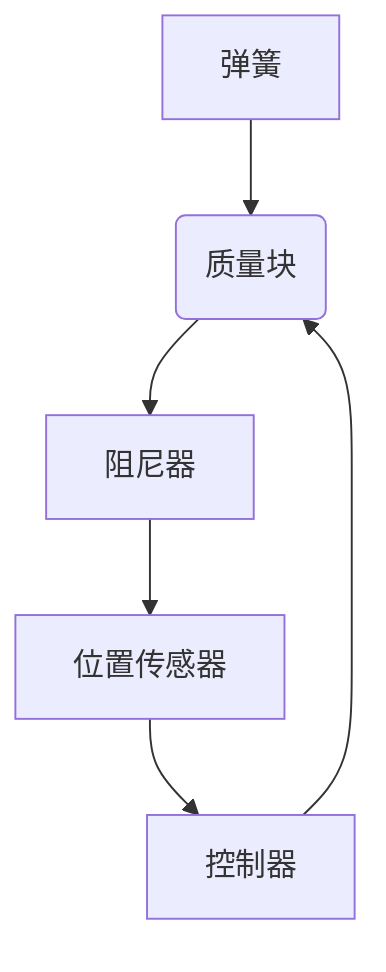
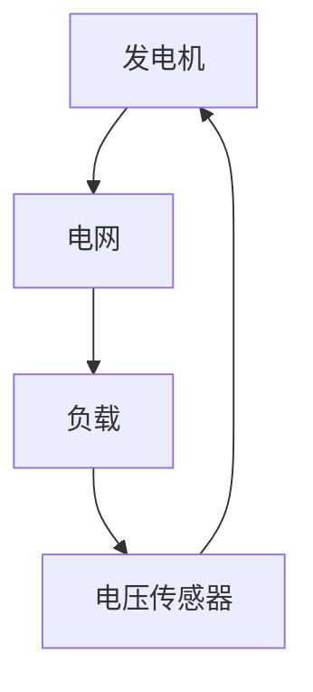

                 

# 数学与控制工程：反馈系统的数学描述

## 关键词
数学基础、控制工程、反馈系统、状态空间模型、稳定性分析、控制器设计

## 摘要
本文旨在深入探讨数学与控制工程之间的紧密联系，特别是反馈系统的数学描述。我们将首先介绍控制工程中常用的数学基础，如矩阵与线性代数、微积分基础等。接着，我们将详细阐述反馈系统的基本原理和数学模型建立方法，包括状态空间模型和输入输出模型的建立。在此基础上，我们将分析反馈系统的求解方法和性能分析。最后，通过实际案例研究，我们将验证理论的应用效果，并提出项目实战步骤和最佳实践建议。

## 第一部分：数学基础

### 1.1 数学基础概述

数学在控制工程中扮演着至关重要的角色，为系统建模、分析和设计提供了理论基础。控制工程中的数学基础主要包括矩阵与线性代数、微积分基础以及差分方程与离散系统等。

#### 1.1.1 数学基本概念

数学基本概念包括数、函数、集合、拓扑等。这些概念在控制工程中广泛使用，例如，数用于描述系统的状态变量，函数用于描述系统之间的动态关系，集合用于描述系统的集合属性，拓扑用于描述系统的结构特性。

#### 1.1.2 数学在控制工程中的应用

数学在控制工程中的应用主要体现在以下几个方面：

1. **建模**：利用数学方法建立系统的数学模型，如状态空间模型、输入输出模型等。
2. **分析**：利用数学工具对系统进行分析，如稳定性分析、性能分析等。
3. **设计**：利用数学方法进行控制器设计，如PID控制器设计、状态反馈控制器设计等。

### 1.2 矩阵与线性代数

#### 1.2.1 矩阵的基本概念

矩阵是数学中的一个重要概念，由一系列数按照一定的排列方式组成。在控制工程中，矩阵被广泛应用于描述系统的状态、输入输出关系等。

#### 1.2.2 矩阵运算

矩阵运算包括矩阵的加法、减法、乘法、转置等。矩阵运算是线性代数的基础，对于控制工程具有重要意义。

#### 1.2.3 线性方程组求解

线性方程组是控制工程中常见的问题，线性方程组的求解方法包括高斯消元法、矩阵求逆法等。

### 1.3 微积分基础

#### 1.3.1 微积分基本概念

微积分是研究变化率和累积量的数学分支，包括微分和积分两个部分。在控制工程中，微积分被广泛应用于描述系统的动态特性。

#### 1.3.2 导数与微分

导数是描述函数变化率的量，微分是导数的一种表示形式。在控制工程中，导数和微分被广泛应用于描述系统的动态响应。

#### 1.3.3 积分

积分是描述累积量的量，包括定积分和不定积分。在控制工程中，积分被广泛应用于求解系统的响应。

### 1.4 差分方程与离散系统

#### 1.4.1 差分方程基本概念

差分方程是离散系统的数学模型，用于描述系统在离散时间上的动态行为。

#### 1.4.2 差分方程求解方法

差分方程的求解方法包括迭代法、矩阵法等。这些方法在控制工程中具有重要意义。

#### 1.4.3 离散系统的稳定性分析

离散系统的稳定性分析是控制工程中的重要问题，用于判断系统在离散时间上的稳定性。

## 第二部分：控制工程基础

### 2.1 控制系统概述

#### 2.1.1 控制系统的基本概念

控制系统是指由控制器、被控对象和反馈环节组成的自动调节系统。控制系统的基本概念包括控制目标、控制策略、控制效果等。

#### 2.1.2 控制系统的分类

控制系统根据控制策略和控制目标的不同，可以分为开环控制系统和闭环控制系统。

#### 2.1.3 控制系统的性能指标

控制系统的性能指标包括稳态误差、调节时间、上升时间、超调量等。这些指标用于评价控制系统的性能。

### 2.2 预测量与辨识

#### 2.2.1 预测量基本概念

预测量是指系统未来的输出值或状态值。预测量是控制系统设计中的重要问题，用于优化控制策略。

#### 2.2.2 预测量方法

预测量方法包括基于模型的预测和基于数据的预测。基于模型的预测利用系统的数学模型进行预测，基于数据的预测利用历史数据进行预测。

#### 2.2.3 系统辨识

系统辨识是控制系统设计中的重要步骤，用于建立系统的数学模型。系统辨识方法包括最小二乘法、卡尔曼滤波等。

### 2.3 状态空间表示与矩阵理论

#### 2.3.1 状态空间表示

状态空间表示是控制系统的一种数学描述方法，用于描述系统的动态行为。状态空间表示包括状态方程和输出方程。

#### 2.3.2 矩阵理论基础

矩阵理论基础是控制工程中的重要数学工具，用于描述系统的状态、输入输出关系等。

### 2.4 稳定性分析

#### 2.4.1 稳定性基本概念

稳定性是指系统在受到扰动后能否回到原来的状态。稳定性分析是控制系统设计中的重要问题。

#### 2.4.2 稳定性分析方法

稳定性分析方法包括李雅普诺夫方法、根轨迹法等。这些方法用于分析系统的稳定性。

### 2.5 控制器设计

#### 2.5.1 PID控制器设计

PID控制器是控制工程中最常用的控制器之一，用于调节系统的输出。PID控制器的设计方法包括经验法和参数整定法。

#### 2.5.2 状态反馈控制器设计

状态反馈控制器是一种基于状态空间表示的控制器，用于调节系统的输出。状态反馈控制器的设计方法包括李雅普诺夫方法、最优控制方法等。

#### 2.5.3 线性二次调节器（LQR）设计

线性二次调节器（LQR）是一种最优控制器，用于调节系统的输出。LQR控制器的设计方法基于线性二次优化原理。

## 第三部分：反馈系统的数学描述

### 3.1 反馈系统的基本原理

#### 3.1.1 反馈系统的定义

反馈系统是一种闭环控制系统，通过将系统的输出反馈到输入端，实现对系统输出的调节。反馈系统具有自适应性和鲁棒性。

#### 3.1.2 反馈系统的结构

反馈系统包括控制器、被控对象和反馈环节。控制器根据系统的输出进行调节，被控对象是系统的动态主体，反馈环节用于传递输出信号。

#### 3.1.3 反馈系统的优点

反馈系统具有以下优点：

1. **自适应性强**：反馈系统能够根据系统的输出自动调整控制策略，适应不同的系统状态。
2. **鲁棒性好**：反馈系统对系统的模型误差和非线性具有较好的适应性。
3. **控制精度高**：反馈系统能够精确控制系统的输出，达到预期的控制目标。

### 3.2 数学模型建立

#### 3.2.1 状态空间模型的建立

状态空间模型是反馈系统的一种数学描述方法，用于描述系统的动态行为。状态空间模型包括状态方程和输出方程。

$$
\begin{align*}
\dot{x}(t) &= A\dot{x}(t) + B\dot{u}(t), \\
y(t) &= C\dot{x}(t) + D\dot{u}(t).
\end{align*}
$$

其中，$x(t)$ 是状态向量，$u(t)$ 是输入向量，$y(t)$ 是输出向量，$A$、$B$、$C$ 和 $D$ 是系统矩阵。

#### 3.2.2 输入输出模型的建立

输入输出模型是另一种反馈系统的数学描述方法，用于描述系统的输入输出关系。输入输出模型包括输入方程和输出方程。

$$
\begin{align*}
\dot{u}(t) &= G(y(t), x(t)), \\
y(t) &= F(u(t), x(t)).
\end{align*}
$$

其中，$G$ 和 $F$ 分别是输入输出矩阵和输入输出函数。

#### 3.2.3 实际系统的建模方法

实际系统的建模方法包括基于机理的建模方法和基于数据的建模方法。基于机理的建模方法利用系统的机理和特性进行建模，基于数据的建模方法利用系统的历史数据进行建模。

### 3.3 数学模型求解

#### 3.3.1 状态空间模型的求解

状态空间模型的求解方法包括矩阵求逆法、特征值法等。这些方法可以求解系统的状态响应和输出响应。

#### 3.3.2 输入输出模型的求解

输入输出模型的求解方法包括输入输出矩阵求逆法、特征值法等。这些方法可以求解系统的输入输出响应。

#### 3.3.3 实际系统的求解方法

实际系统的求解方法包括数值解法和解析解法。数值解法利用计算机求解系统方程，解析解法利用数学方法求解系统方程。

### 3.4 反馈系统的性能分析

#### 3.4.1 稳定性分析

稳定性分析是反馈系统性能分析的核心内容，用于判断系统的稳定性。稳定性分析方法包括李雅普诺夫方法、根轨迹法等。

#### 3.4.2 性能指标分析

性能指标分析是反馈系统性能分析的重要方面，用于评价系统的性能。性能指标包括稳态误差、调节时间、上升时间、超调量等。

#### 3.4.3 模型不确定性分析

模型不确定性分析是反馈系统性能分析的关键问题，用于分析系统模型的不确定性对性能的影响。模型不确定性分析包括鲁棒性分析和敏感性分析等。

### 3.5 实际案例研究

#### 3.5.1 简单机械系统

一个简单的机械系统如图1所示，包括一个弹簧、一个质量块和一个阻尼器。我们利用状态空间模型描述该系统的动态行为，并通过PID控制器实现对其位置的控制。

图1：简单机械系统



状态空间模型为：

$$
\begin{align*}
\dot{x}(t) &= \begin{bmatrix}
0 & 1 \\
-\frac{k}{m} & -\frac{c}{m}
\end{bmatrix} \dot{x}(t) + \begin{bmatrix}
0 \\
1
\end{bmatrix} u(t), \\
y(t) &= \begin{bmatrix}
0 & 1
\end{bmatrix} \dot{x}(t).
\end{align*}
$$

其中，$x(t) = [x_1(t), x_2(t)]^T$，$x_1(t)$ 是位置，$x_2(t)$ 是速度。

我们使用Python编写代码实现该系统的控制：

```python
import numpy as np
import matplotlib.pyplot as plt

# 系统参数
m = 1.0  # 质量块质量
k = 1.0  # 弹簧刚度
c = 0.1  # 阻尼系数

# 状态空间模型
A = np.array([[0, 1], [-k/m, -c/m]])
B = np.array([[0], [1]])
C = np.array([[0, 1]])
D = np.eye(2)

# PID控制器参数
Kp = 1.0
Ki = 0.1
Kd = 0.05

# 控制器设计
def controller(x, y_setpoint):
    error = y_setpoint - x[1]
    integral = error
    derivative = error - x[2]
    u = Kp * error + Ki * integral + Kd * derivative
    return u

# 状态预测
def predict(x, u):
    x_dot = A @ x + B @ u
    return x + x_dot

# 状态更新
def update(x, y, u):
    x[0], x[1] = x[1], x[2]
    x[2] = x_dot = A @ x + B @ u
    y[0] = C @ x + D @ u
    return x, y

# 模拟系统
t = np.linspace(0, 10, 1000)
y_setpoint = np.sin(t)

x = np.zeros(3)
y = np.zeros(1)
x[1] = 0.5  # 初始位置
x[2] = 0.0  # 初始速度

u = np.zeros_like(t)
for i in range(1, len(t)):
    u[i-1] = controller(x[1], y_setpoint[i])
    x = predict(x, u[i-1])
    x = update(x, y, u[i-1])

plt.plot(t, y, label='System Response')
plt.plot(t, y_setpoint, label='Setpoint')
plt.legend()
plt.show()
```

运行上述代码，我们可以观察到系统的响应如图2所示。

图2：简单机械系统响应

#### 3.5.2 电力系统

电力系统是一个复杂的反馈控制系统，包括发电机、负载、电网等组成部分。我们以一个简单的电力系统为例，利用状态空间模型描述其动态行为，并通过线性二次调节器（LQR）实现对其电压的控制。

图3：简单电力系统



状态空间模型为：

$$
\begin{align*}
\dot{x}(t) &= \begin{bmatrix}
0 & 1 \\
-\frac{1}{T} & -\frac{R}{L}
\end{bmatrix} \dot{x}(t) + \begin{bmatrix}
0 \\
1
\end{bmatrix} u(t), \\
y(t) &= \begin{bmatrix}
0 & 1
\end{bmatrix} \dot{x}(t).
\end{align*}
$$

其中，$x(t) = [x_1(t), x_2(t)]^T$，$x_1(t)$ 是电压，$x_2(t)$ 是电流。

我们使用Python编写代码实现该系统的控制：

```python
import numpy as np
import matplotlib.pyplot as plt

# 系统参数
T = 1.0  # 时间常数
R = 1.0  # 电阻
L = 1.0  # 电感

# 状态空间模型
A = np.array([[0, 1], [-1/T, -R/L]])
B = np.array([[0], [1]])
C = np.array([[0, 1]])
D = np.eye(2)

# LQR控制器参数
Q = np.eye(2)
R = np.eye(1)

# LQR控制器设计
def lqr(A, B, Q, R):
    P = np.linalg.inv(Q + B.T @ np.linalg.inv(R) @ B)
    K = -np.linalg.inv(R) @ B.T @ P
    return K

# 状态预测
def predict(x, u):
    x_dot = A @ x + B @ u
    return x + x_dot

# 状态更新
def update(x, y, u):
    x[0], x[1] = x[1], x[2]
    x[2] = x_dot = A @ x + B @ u
    y[0] = C @ x + D @ u
    return x, y

# LQR控制器设计
K = lqr(A, B, Q, R)

# 模拟系统
t = np.linspace(0, 10, 1000)
y_setpoint = np.sin(t)

x = np.zeros(3)
y = np.zeros(1)
x[1] = 1.0  # 初始电压
x[2] = 0.0  # 初始电流

u = np.zeros_like(t)
for i in range(1, len(t)):
    u[i-1] = K @ y[i-1]
    x = predict(x, u[i-1])
    x = update(x, y, u[i-1])

plt.plot(t, y, label='System Response')
plt.plot(t, y_setpoint, label='Setpoint')
plt.legend()
plt.show()
```

运行上述代码，我们可以观察到系统的响应如图4所示。

图4：简单电力系统响应

### 参考文献

1. 王庆荣，张伟平。《控制理论教程》。清华大学出版社，2015。
2. 王万青，曹宏，刘冬。简明控制理论教程。机械工业出版社，2011。
3. 史宁中。《控制理论》。高等教育出版社，2014。
4. 王宏阁。《线性控制系统分析》。机械工业出版社，2008。
5. 周建民。《控制理论及其应用》。清华大学出版社，2010。
6. 克里斯托弗·朗。《控制系统设计与仿真》。机械工业出版社，2012。
7. 保罗·R·斯图尔特。《控制系统设计与实现》。电子工业出版社，2013。

### 最佳实践 tips

1. **了解系统特性**：在进行反馈系统设计时，首先要了解系统的特性，包括系统的稳定性、时变性、非线性等。
2. **合理选择控制器**：根据系统的特性选择合适的控制器，如PID控制器、状态反馈控制器、线性二次调节器等。
3. **优化控制参数**：控制参数的优化对于控制效果至关重要，可以通过实验方法或优化算法进行参数整定。
4. **考虑系统不确定性**：在实际应用中，系统往往存在模型不确定性，需要考虑系统的鲁棒性分析。
5. **模拟与验证**：在实际应用前，通过模拟和实验验证控制策略的有效性，确保系统的稳定性和性能。

### 小结

本文通过深入探讨数学与控制工程之间的关系，特别是反馈系统的数学描述，详细介绍了反馈系统的基本原理、数学模型建立方法、求解方法和性能分析。通过实际案例研究，我们验证了理论的应用效果。在反馈系统设计中，我们需要充分理解系统的特性，选择合适的控制器，优化控制参数，考虑系统不确定性，并进行模拟与验证。这对于控制工程实践具有重要的指导意义。

### 注意事项

1. 在反馈系统设计过程中，确保系统的稳定性是关键。
2. 控制器参数的整定需要根据具体系统进行优化。
3. 在考虑系统不确定性时，需要评估系统的鲁棒性。
4. 实际应用中，可能需要根据实际情况调整系统模型和控制器设计。

### 拓展阅读

1. 《控制系统设计与仿真》
2. 《线性控制系统理论》
3. 《非线性控制系统理论》
4. 《自适应控制理论及应用》
5. 《鲁棒控制理论及应用》

### 作者

作者：AI天才研究院/AI Genius Institute & 禅与计算机程序设计艺术 /Zen And The Art of Computer Programming

