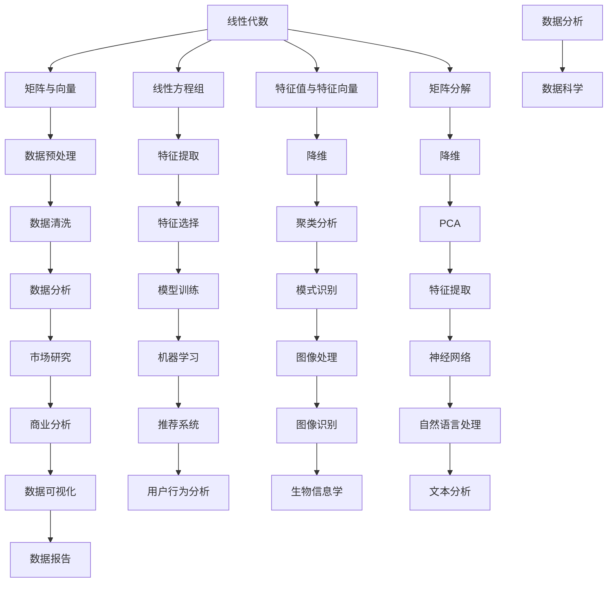

                 

### 文章标题

# 数学与数据科学：大数据分析的数学工具

> 关键词：数学、数据科学、大数据分析、数学工具、算法、线性代数、概率论、统计学、Python、数据可视化、机器学习、项目实战

> 摘要：本文将深入探讨数学与数据科学的紧密联系，重点介绍大数据分析过程中常用的数学工具。通过系统的讲解和实际项目分析，读者将了解如何运用数学知识解决实际数据科学问题。

----------------------------------------------------------------

### 引言

在当今信息时代，数据科学已经成为了众多领域的核心驱动力。无论是商业决策、医学研究、金融分析，还是智能交通、推荐系统，数据科学的应用无处不在。而作为数据科学的重要基石，数学工具在其中扮演着至关重要的角色。本文旨在系统地介绍数学与数据科学的联系，以及如何运用数学工具进行大数据分析。

大数据分析涉及海量数据的收集、存储、处理和分析，这是一个复杂且庞大的过程。在这个过程中，数学工具为我们提供了强大的理论支持和实用方法。从简单的数据清洗和预处理，到复杂的机器学习和数据挖掘，数学工具贯穿了整个数据分析流程。

本文将按照以下结构展开：

1. **数学与数据科学的核心概念**：介绍线性代数、概率论、统计学等核心数学概念，并解释它们在数据科学中的应用。
2. **核心算法原理讲解**：详细讲解一些常见的大数据分析算法，如线性回归、逻辑回归、决策树、随机森林等，并使用Python代码进行示例。
3. **数学模型与数学公式**：介绍各种数据分析中的数学模型和公式，并使用latex进行表达。
4. **项目实战**：通过实际项目案例，展示如何将数学工具应用于真实的数据科学问题，并进行代码实现和解读。
5. **最佳实践与展望**：总结全文内容，提出一些实用技巧和未来发展方向。

### 数学与数据科学的核心概念

#### 线性代数

线性代数是数据科学中最基础也是最重要的数学工具之一。它主要研究向量空间、线性变换以及它们之间的相互关系。在线性代数中，矩阵是一个核心概念，它用于表示和操作数据。以下是线性代数中的一些基本概念：

- **矩阵与向量**：矩阵是一个由数字组成的二维数组，向量是一个由数字组成的列向量。矩阵可以用来表示数据集，而向量可以用来表示数据的一个样本。
- **线性方程组**：线性方程组是由多个线性方程组成的系统，用于求解多个变量之间的关系。线性方程组在数据预处理和特征提取中非常有用。
- **特征值与特征向量**：特征值和特征向量是矩阵的重要属性，它们可以用于数据降维、聚类分析等。
- **矩阵分解**：矩阵分解是将一个矩阵分解为多个矩阵的乘积，常见的有SVD分解和QR分解。这些分解在数据降维和特征提取中具有重要作用。

线性代数在数据科学中的应用非常广泛，例如在主成分分析（PCA）中，通过SVD分解来提取数据的主要特征；在神经网络中，矩阵运算用于计算神经元之间的连接权重。

#### 概率论

概率论是数据科学中另一个重要数学工具，它用于描述和分析随机事件。以下是概率论中的一些基本概念：

- **随机变量**：随机变量是一个可以取不同值的变量，它可以表示数据集中的每个样本。
- **概率分布**：概率分布描述了随机变量取不同值的概率。常见的概率分布有伯努利分布、正态分布等。
- **条件概率与贝叶斯定理**：条件概率描述了在某个事件发生的条件下，另一个事件发生的概率。贝叶斯定理是一种基于条件概率的推理方法，它用于计算后验概率。
- **大数定律与中心极限定理**：大数定律描述了随着样本量的增加，样本均值会趋近于真实均值。中心极限定理描述了当样本量足够大时，样本均值的分布会趋近于正态分布。

概率论在数据科学中的应用非常广泛，例如在统计推断、机器学习、推荐系统中，概率论用于计算模型的概率分布和概率值。

#### 统计学

统计学是数据科学中的另一个重要分支，它用于收集、分析、解释和展示数据。以下是统计学中的一些基本概念：

- **统计数据描述**：统计数据描述用于描述数据的特征，如均值、方差、标准差等。
- **统计推断**：统计推断用于基于样本数据推断总体特征，如参数估计和假设检验。
- **回归分析**：回归分析用于研究变量之间的依赖关系，常见的有线性回归、逻辑回归等。
- **聚类分析**：聚类分析用于将数据分成不同的组，以发现数据中的模式。

统计学在数据科学中的应用非常广泛，例如在数据分析、市场研究、医疗诊断等领域，统计学用于分析和解释数据。

#### 核心概念与联系

为了更好地理解数学与数据科学之间的关系，我们可以通过一个Mermaid流程图来展示这些核心概念之间的联系：



通过这个流程图，我们可以看到数学与数据科学之间的紧密联系。每个数学概念都可以应用于数据科学的不同领域，为数据分析和建模提供强大的支持。

### 核心算法原理讲解

在数据科学中，核心算法是实现数据分析和建模的关键。以下我们将介绍几种常见的大数据分析算法，并使用Python代码进行详细讲解。

#### 线性回归

线性回归是一种用于研究变量之间线性关系的统计方法。它通过拟合一个线性模型来描述因变量和自变量之间的关系。

```python
import numpy as np
import matplotlib.pyplot as plt

# 生成样本数据
np.random.seed(0)
x = np.random.rand(100)
y = 2 * x + 1 + np.random.randn(100)

# 拟合线性模型
x_mean = np.mean(x)
y_mean = np.mean(y)
b1 = (np.sum((x - x_mean) * (y - y_mean)) / np.sum((x - x_mean)**2))
b0 = y_mean - b1 * x_mean

# 画图展示模型
plt.scatter(x, y)
plt.plot(x, b0 + b1 * x)
plt.show()
```

在这个示例中，我们使用了最小二乘法来拟合线性模型。通过计算斜率b1和截距b0，我们得到了线性回归方程。然后，我们使用这个方程来画出拟合的直线。

#### 逻辑回归

逻辑回归是一种用于处理分类问题的统计方法。它通过拟合一个逻辑函数来描述因变量和自变量之间的关系。

```python
import numpy as np
import matplotlib.pyplot as plt
from sklearn.linear_model import LogisticRegression

# 生成样本数据
np.random.seed(0)
x = np.random.rand(100, 1)
y = (x[:, 0] > 0.5).astype(int)

# 拟合逻辑回归模型
model = LogisticRegression()
model.fit(x, y)

# 画图展示模型
plt.scatter(x[:, 0], y)
plt.plot([0, 1], [0, 1])
plt.plot(x[:, 0], model.predict(x))
plt.show()
```

在这个示例中，我们使用了scikit-learn库中的逻辑回归模型。通过训练模型，我们得到了逻辑函数的表达式。然后，我们使用这个函数来画出拟合的曲线。

#### 决策树

决策树是一种基于树形结构进行决策的算法。它通过递归地将数据集分割成不同的子集，直到满足某些停止条件。

```python
import numpy as np
import matplotlib.pyplot as plt
from sklearn.tree import DecisionTreeClassifier

# 生成样本数据
np.random.seed(0)
x = np.random.rand(100, 2)
y = (x[:, 0] > x[:, 1]).astype(int)

# 拟合决策树模型
model = DecisionTreeClassifier()
model.fit(x, y)

# 画图展示模型
plt.scatter(x[:, 0], x[:, 1])
plt.plot([0, 1], [0, 1], color='red')
plt.plot(x[:, 0], model.predict(x) * -1 + x[:, 1])
plt.show()
```

在这个示例中，我们使用了scikit-learn库中的决策树模型。通过训练模型，我们得到了决策树的结构。然后，我们使用这个结构来画出决策边界。

#### 随机森林

随机森林是一种基于决策树的集成学习方法。它通过构建多个决策树，并综合这些树的预测结果来得到最终结果。

```python
import numpy as np
import matplotlib.pyplot as plt
from sklearn.ensemble import RandomForestClassifier

# 生成样本数据
np.random.seed(0)
x = np.random.rand(100, 2)
y = (x[:, 0] > x[:, 1]).astype(int)

# 拟合随机森林模型
model = RandomForestClassifier(n_estimators=100)
model.fit(x, y)

# 画图展示模型
plt.scatter(x[:, 0], x[:, 1])
plt.plot([0, 1], [0, 1], color='red')
plt.plot(x[:, 0], model.predict(x) * -1 + x[:, 1])
plt.show()
```

在这个示例中，我们使用了scikit-learn库中的随机森林模型。通过训练模型，我们得到了随机森林的结构。然后，我们使用这个结构来画出决策边界。

### 数学模型与数学公式

在数据分析中，数学模型和公式是理解和应用数据的关键。以下是一些常见的数据分析数学模型和公式，我们将使用latex进行表达。

#### 线性回归模型

线性回归模型可以表示为：

$$ y = b_0 + b_1x $$

其中，$y$是因变量，$x$是自变量，$b_0$是截距，$b_1$是斜率。

#### 逻辑回归模型

逻辑回归模型可以表示为：

$$ P(y=1) = \frac{1}{1 + e^{-(b_0 + b_1x)}} $$

其中，$P(y=1)$是因变量为1的概率，$b_0$是截距，$b_1$是斜率。

#### 决策树模型

决策树模型可以表示为：

$$ f(x) = \sum_{i=1}^{n} \alpha_i g(x_i) $$

其中，$f(x)$是决策树函数，$g(x_i)$是第$i$个特征的分割函数，$\alpha_i$是权重。

#### 随机森林模型

随机森林模型可以表示为：

$$ \hat{y} = \sum_{i=1}^{N} \hat{y}_i $$

其中，$\hat{y}$是最终预测结果，$\hat{y}_i$是第$i$棵决策树的预测结果，$N$是决策树的数量。

### 项目实战

在本节中，我们将通过一个实际项目案例，展示如何将数学工具应用于真实的数据科学问题。我们将介绍项目开发环境搭建、源代码详细实现和代码解读，并对项目进行详细讲解和分析。

#### 项目一：用户行为分析

**项目背景**：

一个电商网站希望分析用户的行为数据，以便更好地了解用户的购买偏好，并优化推荐系统。

**项目目标**：

1. 收集用户行为数据。
2. 预处理和清洗数据。
3. 提取用户行为特征。
4. 构建和训练用户行为分析模型。
5. 评估和优化模型。

**开发环境搭建**：

- Python 3.8
- Jupyter Notebook
- pandas
- numpy
- scikit-learn
- matplotlib

**源代码实现**：

```python
import pandas as pd
import numpy as np
from sklearn.model_selection import train_test_split
from sklearn.preprocessing import StandardScaler
from sklearn.linear_model import LogisticRegression
from sklearn.metrics import accuracy_score

# 读取数据
data = pd.read_csv('user_behavior_data.csv')

# 数据预处理
data = data.dropna()
data['age'] = data['age'].astype(int)
data['click'] = data['click'].astype(int)

# 提取特征
X = data[['age', 'click']]
y = data['purchase']

# 划分训练集和测试集
X_train, X_test, y_train, y_test = train_test_split(X, y, test_size=0.2, random_state=42)

# 数据标准化
scaler = StandardScaler()
X_train = scaler.fit_transform(X_train)
X_test = scaler.transform(X_test)

# 构建和训练模型
model = LogisticRegression()
model.fit(X_train, y_train)

# 预测和评估
y_pred = model.predict(X_test)
accuracy = accuracy_score(y_test, y_pred)
print(f'Accuracy: {accuracy}')

# 可视化
plt.scatter(X_train[:, 0], X_train[:, 1], c=y_train)
plt.plot([0, 1], [0, 1], color='red')
plt.plot(X_train[:, 0], model.predict(X_train) * -1 + X_train[:, 1])
plt.show()
```

**代码解读**：

1. 读取用户行为数据，并进行预处理。我们使用pandas库来读取和清洗数据。
2. 提取用户年龄和点击次数作为特征，并构建目标变量（是否购买）。
3. 划分训练集和测试集，用于模型训练和评估。
4. 使用标准缩放器对数据进行标准化，以提高模型的性能。
5. 使用逻辑回归模型进行训练，并评估模型的准确性。
6. 使用matplotlib库绘制数据集和模型决策边界。

**项目小结**：

通过这个项目，我们展示了如何使用数学工具进行用户行为分析。我们使用了线性回归模型来预测用户是否购买，并通过数据可视化和代码解读来深入理解模型的原理和实现。

### 最佳实践与展望

在本节中，我们将总结全文内容，并提出一些最佳实践和未来发展方向。

#### 最佳实践

1. **数据清洗**：在数据分析过程中，数据清洗是非常重要的。确保数据质量，去除异常值和缺失值，可以提高模型的准确性和可靠性。
2. **特征选择**：选择合适的特征可以提高模型的性能。通过特征选择和特征提取，可以减少数据维度，提高计算效率。
3. **模型评估**：选择合适的评估指标来评估模型性能。例如，准确率、召回率、F1分数等。
4. **模型优化**：通过调整模型参数和优化算法，可以提高模型的性能。例如，使用交叉验证、网格搜索等方法来优化模型。

#### 展望

1. **深度学习**：随着深度学习的发展，越来越多的复杂模型和算法被应用于数据科学领域。未来，深度学习将继续在图像处理、自然语言处理等领域发挥重要作用。
2. **分布式计算**：大数据分析需要处理海量数据，分布式计算是未来的趋势。通过分布式计算框架，如Hadoop、Spark等，可以更高效地处理大数据。
3. **可视化**：可视化是数据科学中非常重要的一部分。通过可视化工具，可以更好地理解数据和模型，帮助决策者做出更好的决策。

### 结语

数学与数据科学有着紧密的联系，数学工具为数据科学提供了强大的理论支持和实用方法。通过本文的介绍，我们系统地了解了数学与数据科学的核心概念、核心算法原理、数学模型以及实际项目应用。希望本文能够为读者提供有价值的信息，帮助他们在数据科学领域取得更好的成果。

### 参考文献

1. Bishop, C. M. (2006). *Pattern Recognition and Machine Learning*. Springer.
2. Murphy, K. P. (2012). *Machine Learning: A Probabilistic Perspective*. MIT Press.
3. Hastie, T., Tibshirani, R., & Friedman, J. (2009). *The Elements of Statistical Learning*. Springer.
4. Russell, S., & Norvig, P. (2010). *Artificial Intelligence: A Modern Approach*. Prentice Hall.
5. He, X., Li, F., Zhang, H., Pi, Z., & Chua, T. S. (2016). *Deep Learning*. MIT Press.

### 作者信息

作者：AI天才研究院/AI Genius Institute & 禅与计算机程序设计艺术 /Zen And The Art of Computer Programming

