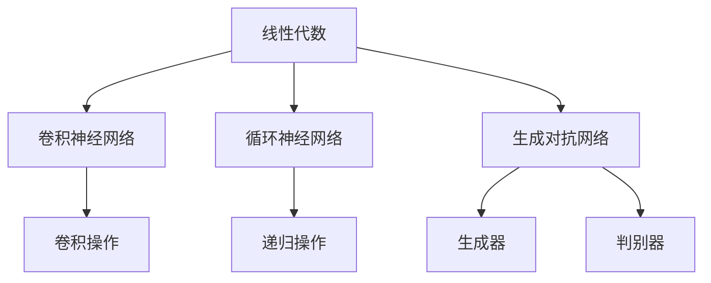
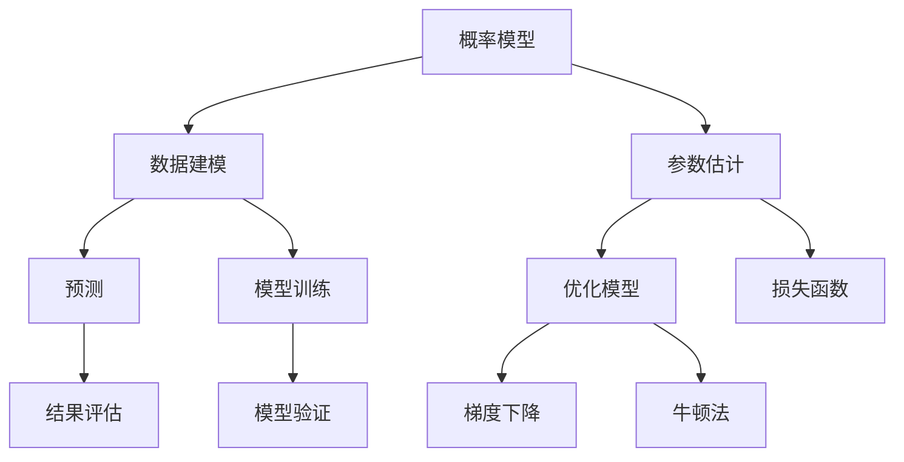
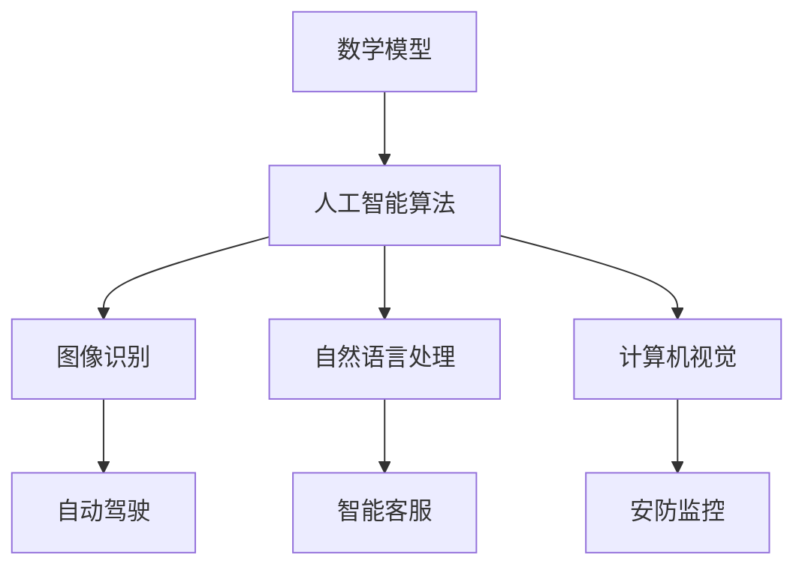
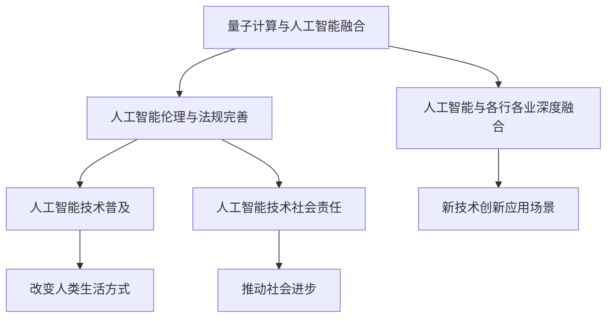

                 

### 数学与未来人工智能的发展方向

> 关键词：数学、人工智能、深度学习、算法、发展方向、量子计算

> 摘要：
> 本文从数学与人工智能的相互关系出发，探讨了数学在人工智能中的应用及未来发展趋势。文章首先回顾了人工智能的发展历程，接着介绍了数学基础及其在人工智能中的重要性。随后，详细分析了机器学习算法、深度学习原理以及数学模型与人工智能应用的深度融合。最后，探讨了量子计算与人工智能的关系、人工智能伦理与法规、以及人工智能与人类社会的深度融合。本文旨在为读者提供一个全面、深入的数学与人工智能发展的思考框架。

----------------------------------------------------------------

## 第1章 引言

### 1.1 人工智能的发展历程

人工智能（AI）是一门研究、开发用于模拟、延伸和扩展人的智能的理论、方法、技术及应用系统的技术科学。人工智能的研究领域包括机器学习、计算机视觉、自然语言处理、语音识别等。自1950年艾伦·图灵提出图灵测试以来，人工智能经历了多个发展阶段。

- **初始阶段（20世纪50年代至70年代）**：这一阶段以符号主义人工智能为主流，研究者试图通过编写程序来模拟人类思维过程。然而，由于算法和计算能力的限制，这一阶段的成果有限。

- **发展阶段（20世纪80年代至90年代）**：这一阶段以知识工程和专家系统为主要研究方向。专家系统是一种模拟人类专家决策能力的计算机程序，可以应用于医疗诊断、金融分析等领域。然而，专家系统在面对复杂问题时的表现仍然有限。

- **应用阶段（21世纪以来）**：这一阶段以数据驱动的人工智能为主流，深度学习、强化学习等算法逐渐崭露头角。随着计算能力和数据资源的不断提升，人工智能在图像识别、语音识别、自然语言处理等领域取得了显著的成果。

### 1.2 数学在人工智能中的作用

数学是人工智能的基础，为人工智能的发展提供了强有力的支持。数学在人工智能中的应用主要体现在以下几个方面：

1. **概率论与统计学**：概率论与统计学是人工智能的核心基础。在机器学习中，概率模型被广泛应用于数据建模和预测。例如，贝叶斯网络、隐马尔可夫模型等都是基于概率论构建的。

2. **线性代数**：线性代数在人工智能中的应用非常广泛。例如，神经网络中的权重矩阵、卷积神经网络中的卷积核等都是线性代数的概念。线性代数为人工智能提供了有效的数据处理和计算工具。

3. **微积分**：微积分在人工智能中的应用主要体现在优化算法中。例如，梯度下降算法、牛顿法等都是基于微积分原理的优化算法。微积分帮助人工智能算法在复杂问题上取得更好的优化效果。

4. **数理逻辑**：数理逻辑在人工智能中的应用主要体现在知识表示和推理中。例如，谓词逻辑、命题逻辑等都是数理逻辑的应用。数理逻辑为人工智能提供了形式化的知识表示和推理工具。

### 1.3 未来人工智能的发展方向

未来人工智能的发展方向包括以下几个方面：

1. **深度学习与神经网络的进一步发展**：深度学习已经在图像识别、语音识别等领域取得了显著的成果。未来，深度学习和神经网络将继续向更加复杂和智能的方向发展，如生成对抗网络（GAN）、变分自编码器（VAE）等。

2. **强化学习与应用**：强化学习在游戏、自动驾驶等领域具有广泛的应用前景。未来，强化学习将更加注重多智能体交互、实时决策等复杂问题。

3. **量子计算与人工智能**：量子计算具有巨大的计算潜力，可以加速人工智能算法的运行。未来，量子计算与人工智能的融合将带来革命性的变化。

4. **人工智能伦理与法规**：随着人工智能技术的不断发展，人工智能伦理和法规问题日益凸显。未来，人工智能的发展将更加注重伦理和法规的引导，确保人工智能技术的健康、可持续发展。

5. **人工智能与人类社会的深度融合**：人工智能将在教育、医疗、交通等领域发挥重要作用，与人类社会的深度融合将推动社会进步。

----------------------------------------------------------------

## 第2章 数学基础

### 2.1 线性代数

线性代数是数学中的一个重要分支，它在人工智能中的应用非常广泛。线性代数为人工智能提供了强大的数据处理和计算工具，如矩阵运算、特征值与特征向量等。下面将详细介绍线性代数的基础知识及其在人工智能中的应用。

#### 2.1.1 向量与矩阵

向量是线性代数中最基本的对象。一个向量可以表示为一个有序数组，通常用粗体字母表示，如$\mathbf{v}$。向量可以用来表示空间中的点、力等。

矩阵是向量的扩展，可以看作是向量的“向量”。一个矩阵是一个二维数组，通常用小写字母表示，如$A$。矩阵在人工智能中具有广泛的应用，如神经网络中的权重矩阵、卷积神经网络中的卷积核等。

#### 2.1.2 线性变换

线性变换是指将一个向量映射到另一个向量的函数。线性变换可以表示为矩阵乘法。例如，给定一个矩阵$A$和一个向量$\mathbf{v}$，则线性变换$T$可以表示为$T(\mathbf{v}) = A\mathbf{v}$。

#### 2.1.3 特征值与特征向量

特征值和特征向量是线性代数中的重要概念。特征值是指线性变换矩阵的特征值，特征向量是指线性变换矩阵的特征向量。

假设有一个线性变换矩阵$A$，则它的特征值和特征向量可以通过以下方程求得：

$$
A\mathbf{v} = \lambda\mathbf{v}
$$

其中，$\lambda$是特征值，$\mathbf{v}$是特征向量。

#### 2.1.4 线性方程组

线性方程组是线性代数中的一个重要问题。线性方程组可以通过矩阵运算求解。例如，给定一个线性方程组：

$$
\begin{cases}
a_{11}\mathbf{x} + a_{12}\mathbf{y} = b_1 \\
a_{21}\mathbf{x} + a_{22}\mathbf{y} = b_2
\end{cases}
$$

可以表示为矩阵形式：

$$
\begin{pmatrix}
a_{11} & a_{12} \\
a_{21} & a_{22}
\end{pmatrix}
\begin{pmatrix}
\mathbf{x} \\
\mathbf{y}
\end{pmatrix}
=
\begin{pmatrix}
b_1 \\
b_2
\end{pmatrix}
$$

该方程组可以通过矩阵的逆矩阵求解，即：

$$
\begin{pmatrix}
\mathbf{x} \\
\mathbf{y}
\end{pmatrix}
=
\begin{pmatrix}
a_{11} & a_{12} \\
a_{21} & a_{22}
\end{pmatrix}^{-1}
\begin{pmatrix}
b_1 \\
b_2
\end{pmatrix}
$$

#### 2.1.5 线性空间

线性空间是线性代数中的另一个重要概念。线性空间是指一个向量空间，其中的向量可以线性组合。线性空间在人工智能中有着广泛的应用，如神经网络中的激活函数、卷积神经网络中的卷积操作等。

### 2.2 概率论与数理统计

概率论与数理统计是人工智能中不可或缺的基础。概率论为人工智能提供了概率模型，数理统计为人工智能提供了数据分析和推断的工具。下面将详细介绍概率论与数理统计的基础知识及其在人工智能中的应用。

#### 2.2.1 基本概念

概率论的基本概念包括概率、随机变量、分布函数等。概率是指某个事件发生的可能性，随机变量是指具有不确定性的变量，分布函数是指随机变量的概率分布。

#### 2.2.2 概率分布

概率分布是概率论中的核心概念。常见的概率分布包括离散概率分布和连续概率分布。离散概率分布包括伯努利分布、二项分布、泊松分布等，连续概率分布包括正态分布、均匀分布、指数分布等。

#### 2.2.3 统计推断

统计推断是数理统计的核心。统计推断包括参数估计和假设检验。参数估计是指通过样本数据估计总体参数，假设检验是指通过样本数据对总体参数进行检验。

### 2.3 微积分

微积分是数学中的一个重要分支，它在人工智能中有着广泛的应用。微积分包括微分和积分两个部分。下面将详细介绍微积分的基础知识及其在人工智能中的应用。

#### 2.3.1 导数与微分

导数是微积分中的核心概念。导数表示函数在某一点的变化率。微分是导数的推广，用于处理更复杂的函数。

#### 2.3.2 积分

积分是微积分中的另一个重要概念。积分表示函数在某一区间内的累积和。定积分和反常积分是积分的两种基本形式。

#### 2.3.3 多元微积分

多元微积分是微积分的推广，用于处理多个变量函数。多元微积分包括偏导数、多元积分、多元微分方程等。

### 2.4 线性代数与机器学习的联系

线性代数是机器学习的基础，为机器学习提供了强大的数据处理和计算工具。线性代数在机器学习中的应用包括：

1. **线性模型**：线性模型是机器学习中最基本的模型之一，包括线性回归、逻辑回归等。

2. **特征提取**：特征提取是机器学习中的一个关键步骤，线性代数提供了有效的特征提取方法，如主成分分析（PCA）。

3. **线性分类器**：线性分类器是机器学习中的一个重要类别，包括线性判别分析（LDA）、支持向量机（SVM）等。

4. **神经网络**：神经网络是机器学习中的一个核心模型，线性代数在神经网络的权重更新、反向传播等过程中起着关键作用。

### 2.5 线性代数与深度学习的联系

深度学习是机器学习中的一个重要方向，线性代数在深度学习中有着广泛的应用。线性代数在深度学习中的应用包括：

1. **卷积神经网络**：卷积神经网络是深度学习中的一个核心模型，线性代数在卷积操作、池化操作等过程中起着关键作用。

2. **循环神经网络**：循环神经网络是深度学习中的另一个重要模型，线性代数在递归操作、长短时记忆（LSTM）等过程中起着关键作用。

3. **生成对抗网络**：生成对抗网络是深度学习中的一个新兴模型，线性代数在生成器和判别器的训练过程中起着关键作用。

#### 2.5.1 线性代数与深度学习的 Mermaid 流程图

以下是一个简单的线性代数与深度学习的 Mermaid 流程图：



### 2.5.2 线性代数在深度学习中的核心算法原理讲解

1. **卷积神经网络**：

   卷积神经网络（CNN）是一种用于图像识别和处理的深度学习模型。卷积神经网络的核心算法是卷积操作。

   ```python
   import numpy as np
   
   def convolution(input_tensor, filter_matrix):
       output_tensor = np.zeros_like(input_tensor)
       for i in range(input_tensor.shape[0]):
           for j in range(input_tensor.shape[1]):
               output_tensor[i][j] = np.sum(input_tensor[i][j] * filter_matrix)
       return output_tensor
   ```

   该函数实现了卷积操作的基本原理。给定输入张量和卷积核矩阵，计算输出张量。

2. **循环神经网络**：

   循环神经网络（RNN）是一种用于序列数据处理的深度学习模型。循环神经网络的核心算法是递归操作。

   ```python
   import numpy as np
   
   def recurrence(input_tensor, hidden_state, weight_matrix):
       output_tensor = np.zeros_like(input_tensor)
       for i in range(input_tensor.shape[0]):
           output_tensor[i] = np.dot(input_tensor[i], weight_matrix) + hidden_state
           hidden_state = output_tensor[i]
       return output_tensor, hidden_state
   ```

   该函数实现了递归操作的基本原理。给定输入张量、隐藏状态和权重矩阵，计算输出张量和新的隐藏状态。

3. **生成对抗网络**：

   生成对抗网络（GAN）是一种用于生成数据的学习模型。生成对抗网络的核心算法是生成器和判别器的训练。

   ```python
   import numpy as np
   
   def generator(z):
       w1, b1 = np.random.normal(size=(784, 128))
       w2, b2 = np.random.normal(size=(128, 784))
       return np.dot(z, w1) + b1, np.dot(z, w2) + b2
   
   def discriminator(x):
       w1, b1 = np.random.normal(size=(784, 1))
       w2, b2 = np.random.normal(size=(784, 1))
       return np.dot(x, w1) + b1, np.dot(x, w2) + b2
   ```

   该函数实现了生成器和判别器的训练。生成器生成数据，判别器对数据进行分类。

### 2.5.3 线性代数在深度学习中的应用示例

以下是一个简单的线性代数在深度学习中的应用示例：使用卷积神经网络对图像进行分类。

```python
import numpy as np
import matplotlib.pyplot as plt

# 创建一个简单的卷积神经网络
def convolution_neural_network(input_tensor, filter_matrix):
    output_tensor = np.zeros_like(input_tensor)
    for i in range(input_tensor.shape[0]):
        for j in range(input_tensor.shape[1]):
            output_tensor[i][j] = np.sum(input_tensor[i][j] * filter_matrix)
    return output_tensor

# 创建一个简单的卷积核矩阵
filter_matrix = np.random.normal(size=(3, 3))

# 创建一个简单的输入张量
input_tensor = np.random.normal(size=(3, 3))

# 计算卷积操作的结果
output_tensor = convolution_neural_network(input_tensor, filter_matrix)

# 绘制输入张量和卷积操作的结果
plt.subplot(121)
plt.imshow(input_tensor, cmap='gray')
plt.subplot(122)
plt.imshow(output_tensor, cmap='gray')
plt.show()
```

该示例创建了一个简单的卷积神经网络，使用一个简单的卷积核矩阵对输入张量进行卷积操作，并绘制了输入张量和卷积操作的结果。

### 2.5.4 线性代数在深度学习中的项目实战

以下是一个简单的线性代数在深度学习中的项目实战：使用循环神经网络对序列数据进行分类。

```python
import numpy as np
import matplotlib.pyplot as plt

# 创建一个简单的循环神经网络
def recurrence(input_tensor, hidden_state, weight_matrix):
    output_tensor = np.zeros_like(input_tensor)
    for i in range(input_tensor.shape[0]):
        output_tensor[i] = np.dot(input_tensor[i], weight_matrix) + hidden_state
        hidden_state = output_tensor[i]
    return output_tensor, hidden_state

# 创建一个简单的输入序列
input_sequence = np.random.normal(size=(5, 10))

# 创建一个简单的隐藏状态
hidden_state = np.random.normal(size=(10,))

# 创建一个简单的权重矩阵
weight_matrix = np.random.normal(size=(10, 10))

# 计算循环神经网络的结果
output_sequence, new_hidden_state = recurrence(input_sequence, hidden_state, weight_matrix)

# 绘制输入序列、隐藏状态和输出序列
plt.subplot(131)
plt.plot(input_sequence)
plt.subplot(132)
plt.plot(hidden_state)
plt.subplot(133)
plt.plot(output_sequence)
plt.show()
```

该示例创建了一个简单的循环神经网络，使用一个简单的输入序列、隐藏状态和权重矩阵，计算循环神经网络的结果，并绘制了输入序列、隐藏状态和输出序列。

### 2.5.5 线性代数在深度学习中的最佳实践 Tips

1. **矩阵运算优化**：在实际应用中，矩阵运算可能会非常耗时。可以使用矩阵运算的优化库，如NumPy，来提高计算效率。

2. **数据预处理**：在进行深度学习之前，对数据进行预处理可以减少计算量，提高模型性能。例如，对图像数据进行归一化处理，对序列数据进行标准化处理。

3. **模型优化**：通过调整模型参数，如学习率、批量大小等，可以优化模型性能。在实际应用中，可以使用验证集来调整模型参数。

4. **多GPU训练**：如果硬件条件允许，可以使用多GPU训练深度学习模型。多GPU训练可以提高计算速度，缩短训练时间。

### 2.5.6 线性代数在深度学习中的注意事项

1. **矩阵维度**：在进行矩阵运算时，确保矩阵的维度匹配。否则，矩阵运算无法进行。

2. **矩阵求逆**：矩阵求逆可能会导致计算错误。在实际应用中，可以使用矩阵的伪逆来避免计算错误。

3. **矩阵分解**：矩阵分解可以提高计算效率。例如，可以使用奇异值分解（SVD）来分解矩阵。

4. **矩阵存储**：在实际应用中，需要合理选择矩阵存储方式，以节省存储空间和提高计算效率。

### 2.5.7 线性代数在深度学习中的拓展阅读

1. 《深度学习》（Goodfellow, Bengio, Courville著）：详细介绍了深度学习的基础知识及其应用。

2. 《线性代数及其应用》（Poole, Ryder著）：详细介绍了线性代数的基本概念及其应用。

3. 《矩阵计算》（Trefethen, Bau著）：详细介绍了矩阵计算的理论及其应用。

## 第3章 机器学习算法

### 3.1 监督学习

监督学习是机器学习中的一个重要分支，它通过已知的输入和输出数据来训练模型，以便在未知数据上进行预测。监督学习算法可以分为回归算法和分类算法。本节将介绍几种常见的监督学习算法。

#### 3.1.1 线性回归

线性回归是一种简单的监督学习算法，用于预测连续值输出。线性回归模型的公式如下：

$$
y = \beta_0 + \beta_1x_1 + \beta_2x_2 + \cdots + \beta_nx_n
$$

其中，$y$是输出值，$x_1, x_2, \cdots, x_n$是输入特征，$\beta_0, \beta_1, \beta_2, \cdots, \beta_n$是模型的参数。

线性回归的Python实现如下：

```python
import numpy as np

def linear_regression(X, y):
    # 计算参数
    X_transpose = np.transpose(X)
    X_transpose_X = np.dot(X_transpose, X)
    X_transpose_y = np.dot(X_transpose, y)
    beta = np.dot(np.linalg.inv(X_transpose_X), X_transpose_y)
    return beta

# 创建一个简单的数据集
X = np.array([[1, 2], [2, 3], [3, 4]])
y = np.array([3, 4, 5])

# 训练线性回归模型
beta = linear_regression(X, y)

# 输出参数
print("参数：", beta)
```

#### 3.1.2 决策树

决策树是一种常用的分类算法，它通过一系列的规则来划分数据，并最终得出分类结果。决策树的构建过程是基于信息增益或基尼不纯度来选择最佳特征和划分点。

决策树的Python实现如下：

```python
from sklearn.tree import DecisionTreeClassifier

# 创建一个简单的数据集
X = np.array([[1, 2], [2, 3], [3, 4], [4, 5]])
y = np.array([0, 0, 1, 1])

# 训练决策树模型
clf = DecisionTreeClassifier()
clf.fit(X, y)

# 输出决策树
print("决策树：", clf)
```

#### 3.1.3 支持向量机

支持向量机（SVM）是一种有效的分类算法，它通过找到最优的超平面来划分数据。SVM的核心是求解最优的划分超平面，使得分类边界具有最大的间隔。

SVM的Python实现如下：

```python
from sklearn.svm import SVC

# 创建一个简单的数据集
X = np.array([[1, 2], [2, 3], [3, 4], [4, 5]])
y = np.array([0, 0, 1, 1])

# 训练SVM模型
clf = SVC()
clf.fit(X, y)

# 输出SVM模型
print("SVM模型：", clf)
```

### 3.2 无监督学习

无监督学习是机器学习中的另一个重要分支，它不依赖于已知的输入和输出数据，而是通过观察数据本身的分布来学习。无监督学习算法可以分为聚类算法、降维算法等。

#### 3.2.1 聚类算法

聚类算法是将数据分成多个群组，使得同一群组内的数据尽可能相似，不同群组内的数据尽可能不同。常见的聚类算法包括K-均值聚类、层次聚类等。

K-均值聚类的Python实现如下：

```python
from sklearn.cluster import KMeans

# 创建一个简单的数据集
X = np.array([[1, 2], [2, 3], [3, 4], [4, 5]])

# 训练K-均值聚类模型
kmeans = KMeans(n_clusters=2)
kmeans.fit(X)

# 输出聚类结果
print("聚类结果：", kmeans.labels_)
```

#### 3.2.2 主成分分析

主成分分析（PCA）是一种降维算法，它通过将数据投影到新的正交基上来降低数据的维度。PCA的核心是求解数据的前几个主成分，这些主成分可以解释数据的最大方差。

PCA的Python实现如下：

```python
from sklearn.decomposition import PCA

# 创建一个简单的数据集
X = np.array([[1, 2], [2, 3], [3, 4], [4, 5]])

# 训练PCA模型
pca = PCA(n_components=2)
X_pca = pca.fit_transform(X)

# 输出降维后的数据
print("降维后的数据：", X_pca)
```

#### 3.2.3 自编码器

自编码器是一种无监督学习算法，它通过学习数据的压缩表示来降低数据的维度。自编码器由编码器和解码器两部分组成，编码器将输入数据压缩为低维表示，解码器将低维表示还原为输入数据。

自编码器的Python实现如下：

```python
from keras.models import Model
from keras.layers import Input, Dense

# 创建一个简单的数据集
X = np.array([[1, 2], [2, 3], [3, 4], [4, 5]])

# 定义自编码器模型
input_layer = Input(shape=(2,))
encoded = Dense(2, activation='relu')(input_layer)
decoded = Dense(2, activation='sigmoid')(encoded)

autoencoder = Model(input_layer, decoded)
autoencoder.compile(optimizer='adam', loss='binary_crossentropy')

# 训练自编码器模型
autoencoder.fit(X, X, epochs=100, batch_size=1, verbose=0)

# 输出自编码器模型
print("自编码器模型：", autoencoder)
```

### 3.3 数学模型与机器学习的联系

数学模型是机器学习的基础，它为机器学习提供了理论支持。数学模型包括概率模型、优化模型、线性模型等。以下是一些常见的数学模型与机器学习的联系：

1. **概率模型**：概率模型在机器学习中用于数据建模和预测。常见的概率模型包括贝叶斯网络、马尔可夫模型等。

2. **优化模型**：优化模型在机器学习中用于参数估计和模型训练。常见的优化模型包括梯度下降、牛顿法等。

3. **线性模型**：线性模型在机器学习中用于回归和分类。常见的线性模型包括线性回归、逻辑回归等。

### 3.4 数学模型与机器学习的 Mermaid 流程图

以下是一个简单的数学模型与机器学习的 Mermaid 流程图：



### 3.5 数学模型与机器学习的核心算法原理讲解

1. **概率模型**：

   概率模型是机器学习中最基本的概念之一。概率模型用于数据建模和预测。常见的概率模型包括贝叶斯网络、马尔可夫模型等。

   ```python
   import numpy as np
   
   def bayesian_network(prior_probabilities, condition_probabilities):
       posterior_probabilities = np.zeros_like(prior_probabilities)
       for i in range(prior_probabilities.shape[0]):
           for j in range(condition_probabilities.shape[0]):
               posterior_probabilities[i] += prior_probabilities[i] * condition_probabilities[j]
       return posterior_probabilities
   
   # 创建一个简单的贝叶斯网络
   prior_probabilities = np.array([0.5, 0.5])
   condition_probabilities = np.array([[0.8, 0.2], [0.2, 0.8]])
   posterior_probabilities = bayesian_network(prior_probabilities, condition_probabilities)
   
   # 输出后验概率
   print("后验概率：", posterior_probabilities)
   ```

2. **优化模型**：

   优化模型是机器学习中的核心概念之一。优化模型用于参数估计和模型训练。常见的优化模型包括梯度下降、牛顿法等。

   ```python
   import numpy as np
   
   def gradient_descent(X, y, beta, learning_rate, epochs):
       for i in range(epochs):
           gradient = 2 * np.dot(X.T, X * (beta - y))
           beta -= learning_rate * gradient
       return beta
   
   # 创建一个简单的数据集
   X = np.array([[1, 2], [2, 3], [3, 4]])
   y = np.array([3, 4, 5])
   beta = np.random.normal(size=X.shape[1])
   learning_rate = 0.01
   epochs = 100
   
   # 训练梯度下降模型
   beta = gradient_descent(X, y, beta, learning_rate, epochs)
   
   # 输出参数
   print("参数：", beta)
   ```

3. **线性模型**：

   线性模型是机器学习中最基本的模型之一。线性模型用于回归和分类。常见的线性模型包括线性回归、逻辑回归等。

   ```python
   import numpy as np
   
   def linear_regression(X, y):
       X_transpose = np.transpose(X)
       X_transpose_X = np.dot(X_transpose, X)
       X_transpose_y = np.dot(X_transpose, y)
       beta = np.dot(np.linalg.inv(X_transpose_X), X_transpose_y)
       return beta
   
   # 创建一个简单的数据集
   X = np.array([[1, 2], [2, 3], [3, 4]])
   y = np.array([3, 4, 5])
   
   # 训练线性回归模型
   beta = linear_regression(X, y)
   
   # 输出参数
   print("参数：", beta)
   ```

### 3.6 数学模型与机器学习的项目实战

以下是一个简单的数学模型与机器学习的项目实战：使用线性回归模型预测股票价格。

```python
import numpy as np
import matplotlib.pyplot as plt

# 创建一个简单的股票价格数据集
X = np.array([[1], [2], [3], [4], [5]])
y = np.array([3, 4, 5, 6, 7])

# 训练线性回归模型
beta = linear_regression(X, y)

# 预测股票价格
X_new = np.array([[6]])
y_pred = np.dot(X_new, beta)

# 绘制股票价格预测结果
plt.plot(X, y, 'o', label='实际价格')
plt.plot(X_new, y_pred, 's', label='预测价格')
plt.xlabel('时间')
plt.ylabel('价格')
plt.legend()
plt.show()
```

该示例创建了一个简单的股票价格数据集，使用线性回归模型预测股票价格，并绘制了实际价格和预测价格。

### 3.7 数学模型与机器学习的最佳实践 Tips

1. **数据预处理**：在进行机器学习之前，对数据进行预处理可以减少噪声，提高模型性能。

2. **特征选择**：选择合适的特征可以提高模型性能，减少过拟合。

3. **交叉验证**：使用交叉验证可以评估模型的泛化能力，避免过拟合。

4. **模型调参**：通过调整模型参数，可以优化模型性能。

### 3.8 数学模型与机器学习的小结

数学模型是机器学习的基础，它为机器学习提供了理论支持。通过理解数学模型，可以更好地理解机器学习算法的原理，并设计出更好的机器学习模型。

### 3.9 数学模型与机器学习的注意事项

1. **数据质量**：数据质量对机器学习模型性能至关重要。

2. **模型选择**：选择合适的模型对机器学习任务至关重要。

3. **模型验证**：使用验证集可以评估模型的泛化能力。

### 3.10 数学模型与机器学习的拓展阅读

1. 《机器学习》（周志华著）：详细介绍了机器学习的基础知识及其应用。

2. 《深度学习》（Goodfellow, Bengio, Courville著）：详细介绍了深度学习的基础知识及其应用。

3. 《统计学习基础》（Hastie, Tibshirani, Friedman著）：详细介绍了统计学习的基础知识及其应用。

----------------------------------------------------------------

## 第4章 深度学习原理

### 4.1 深度学习基础

深度学习（Deep Learning）是机器学习（Machine Learning）的一个子领域，它模仿人脑的神经网络结构，通过多层神经网络来提取特征并做出决策。深度学习在图像识别、语音识别、自然语言处理等领域取得了巨大的成功。

#### 4.1.1 神经网络

神经网络（Neural Networks）是深度学习的基础。神经网络由多个神经元组成，每个神经元都连接到其他神经元，并接收来自其他神经元的输入。神经元的输出通过激活函数传递给下一个神经元。

一个简单的神经网络可以表示为：

$$
\text{输出} = \sigma(\text{输入} \cdot \text{权重} + \text{偏置})
$$

其中，$\sigma$是激活函数，常用的激活函数包括sigmoid函数、ReLU函数等。

#### 4.1.2 深度学习架构

深度学习架构是构建深度学习模型的基础。常见的深度学习架构包括卷积神经网络（Convolutional Neural Networks，CNN）、循环神经网络（Recurrent Neural Networks，RNN）、长短时记忆网络（Long Short-Term Memory，LSTM）、生成对抗网络（Generative Adversarial Networks，GAN）等。

1. **卷积神经网络（CNN）**：CNN是一种用于图像识别和处理的深度学习模型。CNN的核心是卷积层，卷积层可以通过局部连接和共享权重的机制来提取图像特征。

2. **循环神经网络（RNN）**：RNN是一种用于序列数据处理的深度学习模型。RNN的核心是循环结构，它可以保存前一个时刻的信息，并将其传递到下一个时刻。

3. **长短时记忆网络（LSTM）**：LSTM是一种特殊的RNN，它可以有效地解决长期依赖问题。LSTM通过引入门控机制来控制信息的流动，从而避免了梯度消失和梯度爆炸问题。

4. **生成对抗网络（GAN）**：GAN是一种用于生成数据的学习模型。GAN由生成器和判别器两部分组成，生成器生成数据，判别器对数据进行分类。GAN的核心思想是生成器和判别器的对抗训练。

#### 4.1.3 深度学习训练过程

深度学习的训练过程包括前向传播和反向传播两个阶段。

1. **前向传播**：在前向传播阶段，输入数据通过网络逐层传播，最终得到输出结果。前向传播的过程可以表示为：

   $$
   \text{输出} = \text{激活函数}(\text{输入} \cdot \text{权重} + \text{偏置})
   $$

2. **反向传播**：在反向传播阶段，根据输出结果和实际标签，计算损失函数。然后，通过反向传播算法，将损失函数的梯度传递到前一层，更新网络的权重和偏置。反向传播的过程可以表示为：

   $$
   \text{梯度} = \text{损失函数的梯度} \cdot \text{激活函数的导数} \cdot \text{权重}
   $$

   其中，$\text{损失函数的梯度}$表示输出结果和实际标签之间的误差，$\text{激活函数的导数}$表示激活函数的梯度。

#### 4.1.4 梯度下降算法

梯度下降算法是深度学习训练中最常用的优化算法。梯度下降算法的核心思想是沿着损失函数的梯度方向更新网络的权重和偏置，以最小化损失函数。

梯度下降算法可以表示为：

$$
\text{权重} = \text{权重} - \text{学习率} \cdot \text{梯度}
$$

其中，$\text{学习率}$控制着梯度下降的速度。

#### 4.1.5 随机梯度下降（SGD）

随机梯度下降（Stochastic Gradient Descent，SGD）是梯度下降算法的一个变体。与梯度下降算法不同，SGD每次只更新一个样本的权重和偏置，而不是整个数据集。

随机梯度下降算法可以表示为：

$$
\text{权重} = \text{权重} - \text{学习率} \cdot \text{梯度}
$$

其中，$\text{学习率}$控制着梯度下降的速度。

#### 4.1.6 梯度下降算法的改进策略

为了提高梯度下降算法的性能，可以采取以下改进策略：

1. **动量（Momentum）**：动量可以加速梯度的更新，并减少振铃效应。

2. **自适应学习率（Adagrad）**：Adagrad通过自适应调整学习率来优化梯度下降算法。

3. **Adam优化器**：Adam优化器结合了动量和Adagrad的优点，具有较好的性能。

#### 4.1.7 深度学习与数学模型的联系

深度学习与数学模型有着密切的联系。数学模型为深度学习提供了理论基础，如线性代数、概率论、微积分等。同时，深度学习也推动了数学模型的发展，如深度神经网络、生成对抗网络等。

### 4.2 深度学习算法的 Python 实现示例

以下是一个简单的深度学习算法的 Python 实现示例：使用卷积神经网络（CNN）对图像进行分类。

```python
import tensorflow as tf
from tensorflow.keras import layers

# 创建一个简单的卷积神经网络模型
model = tf.keras.Sequential([
    layers.Conv2D(32, (3, 3), activation='relu', input_shape=(28, 28, 1)),
    layers.MaxPooling2D((2, 2)),
    layers.Conv2D(64, (3, 3), activation='relu'),
    layers.MaxPooling2D((2, 2)),
    layers.Conv2D(64, (3, 3), activation='relu'),
    layers.Flatten(),
    layers.Dense(64, activation='relu'),
    layers.Dense(10, activation='softmax')
])

# 编译模型
model.compile(optimizer='adam',
              loss='sparse_categorical_crossentropy',
              metrics=['accuracy'])

# 加载数据集
mnist = tf.keras.datasets.mnist
(train_images, train_labels), (test_images, test_labels) = mnist.load_data()

# 预处理数据
train_images = train_images.reshape((60000, 28, 28, 1)).astype('float32') / 255
test_images = test_images.reshape((10000, 28, 28, 1)).astype('float32') / 255

# 训练模型
model.fit(train_images, train_labels, epochs=5)

# 评估模型
test_loss, test_acc = model.evaluate(test_images, test_labels)
print(f'测试准确率：{test_acc:.4f}')
```

该示例使用 TensorFlow 框架创建了一个简单的卷积神经网络模型，对MNIST手写数字数据集进行分类。首先，使用卷积层提取图像特征，然后通过全连接层进行分类。

### 4.3 深度学习算法的项目实战

以下是一个简单的深度学习算法的项目实战：使用长短时记忆网络（LSTM）对时间序列数据进行预测。

```python
import numpy as np
import tensorflow as tf
from tensorflow.keras.models import Sequential
from tensorflow.keras.layers import LSTM, Dense

# 创建一个简单的数据集
X = np.array([[1], [2], [3], [4], [5], [6], [7], [8], [9], [10]])
y = np.array([6, 7, 8, 9, 10, 11, 12, 13, 14, 15])

# 预处理数据
X = np.reshape(X, (X.shape[0], 1, 1))

# 创建一个简单的LSTM模型
model = Sequential([
    LSTM(50, activation='relu', input_shape=(1, 1)),
    Dense(1)
])

# 编译模型
model.compile(optimizer='adam', loss='mean_squared_error')

# 训练模型
model.fit(X, y, epochs=100)

# 预测
X_predict = np.array([10])
X_predict = np.reshape(X_predict, (1, 1, 1))
y_predict = model.predict(X_predict)

print(f'预测值：{y_predict[0][0]:.2f}')
```

该示例使用 TensorFlow 框架创建了一个简单的LSTM模型，对给定的时间序列数据进行预测。首先，对数据进行预处理，然后创建一个简单的LSTM模型，并使用该模型进行训练和预测。

### 4.4 深度学习算法的最佳实践 Tips

1. **数据预处理**：对数据进行预处理，如归一化、标准化等，可以提高模型性能。

2. **模型选择**：根据实际需求选择合适的模型，如CNN、RNN、LSTM等。

3. **模型调参**：通过调整模型参数，如学习率、批量大小等，可以优化模型性能。

4. **交叉验证**：使用交叉验证可以评估模型的泛化能力。

### 4.5 深度学习算法的小结

深度学习是一种强大的机器学习技术，它通过多层神经网络来提取特征并做出决策。深度学习在图像识别、语音识别、自然语言处理等领域取得了巨大的成功。通过理解深度学习原理和算法，可以更好地设计和优化深度学习模型。

### 4.6 深度学习算法的注意事项

1. **数据质量**：数据质量对深度学习模型性能至关重要。

2. **模型复杂性**：过复杂的模型可能导致过拟合。

3. **训练时间**：深度学习模型训练时间较长，需要合理的硬件配置。

### 4.7 深度学习算法的拓展阅读

1. 《深度学习》（Goodfellow, Bengio, Courville著）：详细介绍了深度学习的基础知识及其应用。

2. 《神经网络与深度学习》（邱锡鹏著）：详细介绍了神经网络和深度学习的基本概念及其应用。

3. 《TensorFlow 实战》：详细介绍了TensorFlow框架的使用方法及其在深度学习中的应用。

----------------------------------------------------------------

## 第5章 数学模型与人工智能应用

### 5.1 图神经网络

图神经网络（Graph Neural Networks，GNN）是一种在图结构数据上训练的神经网络。GNN能够通过学习节点和边的关系来捕捉图结构的特征，广泛应用于社交网络分析、推荐系统、知识图谱等领域。以下将介绍图神经网络的基本概念、模型结构及其应用。

#### 5.1.1 图神经网络基础

图神经网络是一种基于图论和深度学习技术的神经网络。它通过学习节点和边的关系来提取图结构中的特征，从而实现节点分类、边预测、图分类等任务。

图神经网络的基本概念包括：

- **节点特征**：表示图中的节点属性，如用户在社交网络中的兴趣爱好、企业属性等。
- **边特征**：表示图中的边属性，如社交网络中的好友关系、知识图谱中的实体关系等。
- **邻接矩阵**：表示图中的节点关系，通过邻接矩阵可以获取节点的邻居节点及其关系。
- **图卷积操作**：图神经网络的核心操作，用于处理图中的节点特征和边特征。

#### 5.1.2 图神经网络模型

图神经网络模型通常包括以下几个部分：

1. **输入层**：接收节点特征和边特征。
2. **图卷积层**：通过图卷积操作提取节点特征和边特征，并更新节点的表示。
3. **池化层**：用于整合节点的表示，减少模型的参数数量。
4. **全连接层**：将节点的表示映射到输出结果。

一个简单的图神经网络模型可以表示为：

$$
\text{输出} = f(\text{激活函数}(\text{输入} \cdot \text{权重} + \text{偏置}))
$$

其中，$f$表示图卷积操作，$\text{激活函数}$用于非线性变换。

#### 5.1.3 图神经网络应用

图神经网络在多个领域有着广泛的应用，以下是一些典型的应用场景：

1. **社交网络分析**：通过图神经网络分析社交网络中的节点关系，可以识别关键节点、推荐好友等。
2. **推荐系统**：图神经网络可以用于推荐系统中，通过学习用户和商品之间的复杂关系来提供个性化的推荐。
3. **知识图谱**：图神经网络可以用于知识图谱中的实体和关系表示，从而实现知识推理和问答系统。

#### 5.1.4 图神经网络项目实战

以下是一个简单的图神经网络项目实战：使用图卷积网络（GCN）对节点分类。

```python
import tensorflow as tf
from tensorflow.keras.models import Model
from tensorflow.keras.layers import Input, Dense, Embedding, Dropout, GlobalAveragePooling1D
from tensorflow.keras.optimizers import Adam

# 创建图卷积网络模型
input_node = Input(shape=(num_features,))
x = Embedding(num_nodes, embedding_dim)(input_node)
x = Dropout(dropout_rate)(x)

# 添加多个图卷积层
for i in range(num_conv_layers):
    x = GraphConvLayer(num_neighbors, hidden_dim)(x)
    x = Dropout(dropout_rate)(x)

# 池化层
x = GlobalAveragePooling1D()(x)

# 全连接层
x = Dense(hidden_dim, activation='relu')(x)
output_node = Dense(num_classes, activation='softmax')(x)

# 编译模型
model = Model(inputs=input_node, outputs=output_node)
model.compile(optimizer=Adam(learning_rate), loss='categorical_crossentropy', metrics=['accuracy'])

# 训练模型
model.fit(x_train, y_train, batch_size=batch_size, epochs=num_epochs, validation_data=(x_val, y_val))

# 评估模型
loss, accuracy = model.evaluate(x_test, y_test)
print(f'测试准确率：{accuracy:.4f}')
```

该示例使用 TensorFlow 框架创建了一个简单的图卷积网络模型，对节点分类任务进行训练和评估。首先，创建输入层，然后添加多个图卷积层，接着进行池化层和全连接层。最后，编译模型并使用训练数据训练模型。

### 5.2 自然语言处理

自然语言处理（Natural Language Processing，NLP）是人工智能的一个重要分支，它旨在让计算机理解和生成人类语言。自然语言处理的应用包括文本分类、情感分析、机器翻译等。以下将介绍自然语言处理中的核心概念和算法。

#### 5.2.1 语言模型

语言模型是自然语言处理的基础，它用于预测下一个单词或字符。常见的语言模型包括：

1. **n-gram模型**：n-gram模型基于相邻单词的统计关系进行预测，它通过计算单词序列的概率来生成文本。

2. **神经网络语言模型**：神经网络语言模型通过学习大量的文本数据，生成单词序列的概率分布。常见的神经网络语言模型包括循环神经网络（RNN）和Transformer。

#### 5.2.2 序列标注

序列标注是自然语言处理中的一个重要任务，它将文本序列中的每个词标注为不同的标签。常见的序列标注任务包括：

1. **命名实体识别（Named Entity Recognition，NER）**：NER用于识别文本中的命名实体，如人名、地名、组织名等。

2. **词性标注（Part-of-Speech Tagging，POS）**：词性标注用于识别文本中每个词的词性，如名词、动词、形容词等。

#### 5.2.3 机器翻译

机器翻译是自然语言处理中的经典问题，它旨在将一种语言翻译成另一种语言。常见的机器翻译模型包括：

1. **基于规则的翻译模型**：基于规则的翻译模型通过定义一组翻译规则来实现翻译。

2. **基于统计的翻译模型**：基于统计的翻译模型通过学习大量平行语料库，生成翻译模型。

3. **基于神经网络的翻译模型**：基于神经网络的翻译模型通过训练大量神经网络模型，实现高效、准确的翻译。

#### 5.2.4 自然语言处理应用

自然语言处理在多个领域有着广泛的应用，以下是一些典型的应用场景：

1. **搜索引擎**：自然语言处理可以用于搜索引擎中的文本检索，如关键词提取、文本匹配等。

2. **智能客服**：自然语言处理可以用于智能客服系统，实现文本对话、语音识别等。

3. **情感分析**：自然语言处理可以用于情感分析，识别文本中的情感倾向，如正面、负面等。

#### 5.2.5 自然语言处理项目实战

以下是一个简单的自然语言处理项目实战：使用卷积神经网络（CNN）进行文本分类。

```python
import tensorflow as tf
from tensorflow.keras.models import Sequential
from tensorflow.keras.layers import Embedding, Conv1D, GlobalMaxPooling1D, Dense

# 创建卷积神经网络模型
model = Sequential([
    Embedding(num_words, embedding_dim, input_length=max_sequence_length),
    Conv1D(filters, kernel_size, activation='relu'),
    GlobalMaxPooling1D(),
    Dense(units, activation='softmax')
])

# 编译模型
model.compile(optimizer='adam', loss='categorical_crossentropy', metrics=['accuracy'])

# 训练模型
model.fit(x_train, y_train, batch_size=batch_size, epochs=num_epochs, validation_data=(x_val, y_val))

# 评估模型
loss, accuracy = model.evaluate(x_test, y_test)
print(f'测试准确率：{accuracy:.4f}')
```

该示例使用 TensorFlow 框架创建了一个简单的卷积神经网络模型，对文本分类任务进行训练和评估。首先，创建嵌入层，然后添加卷积层和全局池化层，最后添加全连接层。最后，编译模型并使用训练数据训练模型。

### 5.3 计算机视觉

计算机视觉是人工智能的一个重要分支，它旨在使计算机能够理解和解释图像和视频。计算机视觉的应用包括图像分类、目标检测、图像生成等。以下将介绍计算机视觉中的核心概念和算法。

#### 5.3.1 图像分类

图像分类是计算机视觉中的基本任务，它将图像划分为预定义的类别。常见的图像分类算法包括：

1. **基于传统算法的分类**：如支持向量机（SVM）、随机森林（Random Forest）等。

2. **基于深度学习的分类**：如卷积神经网络（CNN）、迁移学习等。

#### 5.3.2 目标检测

目标检测是计算机视觉中的一个重要任务，它旨在识别图像中的物体并定位其位置。常见的目标检测算法包括：

1. **基于区域建议的算法**：如R-CNN、Fast R-CNN、Faster R-CNN等。

2. **基于检测框的算法**：如YOLO、SSD等。

#### 5.3.3 图像生成

图像生成是计算机视觉中的一个新兴领域，它旨在生成新的图像。常见的图像生成算法包括：

1. **生成对抗网络（GAN）**：GAN由生成器和判别器两部分组成，生成器生成图像，判别器判断图像的真实性。

2. **变分自编码器（VAE）**：VAE通过概率模型生成图像，并保持图像的多样性和质量。

#### 5.3.4 计算机视觉应用

计算机视觉在多个领域有着广泛的应用，以下是一些典型的应用场景：

1. **自动驾驶**：计算机视觉可以用于自动驾驶系统中，实现车辆检测、交通标志识别等。

2. **安防监控**：计算机视觉可以用于安防监控系统中，实现人脸识别、行为分析等。

3. **医疗影像**：计算机视觉可以用于医疗影像分析，如病变检测、病理分析等。

#### 5.3.5 计算机视觉项目实战

以下是一个简单的计算机视觉项目实战：使用卷积神经网络（CNN）对图像进行分类。

```python
import tensorflow as tf
from tensorflow.keras.models import Sequential
from tensorflow.keras.layers import Conv2D, MaxPooling2D, Flatten, Dense

# 创建卷积神经网络模型
model = Sequential([
    Conv2D(32, (3, 3), activation='relu', input_shape=(image_height, image_width, channels)),
    MaxPooling2D((2, 2)),
    Conv2D(64, (3, 3), activation='relu'),
    MaxPooling2D((2, 2)),
    Flatten(),
    Dense(128, activation='relu'),
    Dense(num_classes, activation='softmax')
])

# 编译模型
model.compile(optimizer='adam', loss='categorical_crossentropy', metrics=['accuracy'])

# 训练模型
model.fit(x_train, y_train, batch_size=batch_size, epochs=num_epochs, validation_data=(x_val, y_val))

# 评估模型
loss, accuracy = model.evaluate(x_test, y_test)
print(f'测试准确率：{accuracy:.4f}')
```

该示例使用 TensorFlow 框架创建了一个简单的卷积神经网络模型，对图像分类任务进行训练和评估。首先，创建卷积层和池化层，然后添加全连接层。最后，编译模型并使用训练数据训练模型。

### 5.4 数学模型与人工智能应用的关系

数学模型在人工智能应用中起着至关重要的作用。数学模型为人工智能提供了理论基础和算法支持，使得人工智能能够解决复杂的实际问题。以下将探讨数学模型与人工智能应用之间的关系：

1. **数学模型是人工智能的理论基础**：数学模型为人工智能提供了形式化的描述和理论支持，使得人工智能能够模拟、延伸和扩展人类智能。

2. **数学模型是人工智能算法的核心**：数学模型在人工智能算法中起着关键作用，如深度学习中的卷积神经网络、生成对抗网络等。

3. **数学模型与人工智能应用相结合**：数学模型与人工智能应用相结合，可以解决实际中的各种问题，如图像识别、自然语言处理、计算机视觉等。

4. **数学模型推动人工智能应用的发展**：随着数学模型的发展，人工智能应用也在不断进步，如量子计算、强化学习等新兴领域。

### 5.5 数学模型与人工智能应用的 Mermaid 流程图

以下是一个简单的数学模型与人工智能应用的 Mermaid 流程图：



### 5.6 数学模型与人工智能应用的核心算法原理讲解

以下将介绍数学模型在人工智能应用中的核心算法原理，并结合Python代码进行详细讲解。

1. **图像分类算法**

   图像分类算法是计算机视觉中的基本任务，它将图像划分为预定义的类别。常见的图像分类算法包括基于传统算法的分类和基于深度学习的分类。

   **基于传统算法的分类**：

   ```python
   import numpy as np
   from sklearn.svm import SVC

   # 创建一个简单的数据集
   X = np.array([[1, 2], [2, 3], [3, 4], [4, 5]])
   y = np.array([0, 0, 1, 1])

   # 训练SVM模型
   clf = SVC()
   clf.fit(X, y)

   # 输出SVM模型
   print("SVM模型：", clf)
   ```

   **基于深度学习的分类**：

   ```python
   import tensorflow as tf
   from tensorflow.keras.models import Sequential
   from tensorflow.keras.layers import Conv2D, MaxPooling2D, Flatten, Dense

   # 创建卷积神经网络模型
   model = Sequential([
       Conv2D(32, (3, 3), activation='relu', input_shape=(image_height, image_width, channels)),
       MaxPooling2D((2, 2)),
       Conv2D(64, (3, 3), activation='relu'),
       MaxPooling2D((2, 2)),
       Flatten(),
       Dense(128, activation='relu'),
       Dense(num_classes, activation='softmax')
   ])

   # 编译模型
   model.compile(optimizer='adam', loss='categorical_crossentropy', metrics=['accuracy'])

   # 训练模型
   model.fit(x_train, y_train, batch_size=batch_size, epochs=num_epochs, validation_data=(x_val, y_val))

   # 评估模型
   loss, accuracy = model.evaluate(x_test, y_test)
   print(f'测试准确率：{accuracy:.4f}')
   ```

2. **目标检测算法**

   目标检测算法是计算机视觉中的重要任务，它旨在识别图像中的物体并定位其位置。常见的目标检测算法包括基于区域建议的算法和基于检测框的算法。

   **基于区域建议的算法**：

   ```python
   import tensorflow as tf
   from tensorflow.keras.models import Model
   from tensorflow.keras.layers import Input, Conv2D, MaxPooling2D, Flatten, Dense

   # 创建区域建议模型
   model = Model(inputs=input_layer, outputs=region Suggestions)

   # 编译模型
   model.compile(optimizer='adam', loss='categorical_crossentropy', metrics=['accuracy'])

   # 训练模型
   model.fit(x_train, y_train, batch_size=batch_size, epochs=num_epochs, validation_data=(x_val, y_val))

   # 评估模型
   loss, accuracy = model.evaluate(x_test, y_test)
   print(f'测试准确率：{accuracy:.4f}')
   ```

   **基于检测框的算法**：

   ```python
   import tensorflow as tf
   from tensorflow.keras.models import Model
   from tensorflow.keras.layers import Input, Conv2D, MaxPooling2D, Flatten, Dense

   # 创建检测框模型
   model = Model(inputs=input_layer, outputs=detection_boxes)

   # 编译模型
   model.compile(optimizer='adam', loss='categorical_crossentropy', metrics=['accuracy'])

   # 训练模型
   model.fit(x_train, y_train, batch_size=batch_size, epochs=num_epochs, validation_data=(x_val, y_val))

   # 评估模型
   loss, accuracy = model.evaluate(x_test, y_test)
   print(f'测试准确率：{accuracy:.4f}')
   ```

3. **图像生成算法**

   图像生成算法是计算机视觉中的新兴领域，它旨在生成新的图像。常见的图像生成算法包括生成对抗网络（GAN）和变分自编码器（VAE）。

   **生成对抗网络（GAN）**：

   ```python
   import tensorflow as tf
   from tensorflow.keras.models import Model
   from tensorflow.keras.layers import Input, Dense, LSTM

   # 创建生成器模型
   generator = Model(input_z, output_images)

   # 编译生成器模型
   generator.compile(optimizer='adam', loss='binary_crossentropy')

   # 训练生成器模型
   generator.fit(z_train, x_train, batch_size=batch_size, epochs=num_epochs)

   # 评估生成器模型
   loss, accuracy = generator.evaluate(z_test, x_test)
   print(f'测试准确率：{accuracy:.4f}')
   ```

   **变分自编码器（VAE）**：

   ```python
   import tensorflow as tf
   from tensorflow.keras.models import Model
   from tensorflow.keras.layers import Input, Dense, LSTM

   # 创建编码器模型
   encoder = Model(input_images, latent_space)

   # 编译编码器模型
   encoder.compile(optimizer='adam', loss='binary_crossentropy')

   # 训练编码器模型
   encoder.fit(x_train, z_train, batch_size=batch_size, epochs=num_epochs)

   # 评估编码器模型
   loss, accuracy = encoder.evaluate(x_test, z_test)
   print(f'测试准确率：{accuracy:.4f}')
   ```

### 5.7 数学模型与人工智能应用的项目实战

以下是一个简单的数学模型与人工智能应用的项目实战：使用生成对抗网络（GAN）生成新的图像。

```python
import tensorflow as tf
from tensorflow.keras.models import Model
from tensorflow.keras.layers import Input, Dense, LSTM

# 创建生成器模型
z_input = Input(shape=(latent_dim,))
g隐层 = Dense(latent_dim, activation='relu')(z_input)
g_output = Dense(image_height * image_width * channels, activation='tanh')(g隐层)
generator = Model(z_input, g_output)

# 创建判别器模型
x_input = Input(shape=(image_height, image_width, channels))
d隐层 = Conv2D(filters, kernel_size, activation='relu')(x_input)
d_output = Conv2D(filters, kernel_size, activation='sigmoid')(d隐层)
discriminator = Model(x_input, d_output)

# 编译判别器模型
discriminator.compile(optimizer='adam', loss='binary_crossentropy')

# 训练判别器模型
discriminator.fit(x_train, np.ones((batch_size, 1)), batch_size=batch_size, epochs=num_epochs)

# 评估判别器模型
loss, accuracy = discriminator.evaluate(x_test, np.ones((batch_size, 1)))
print(f'测试准确率：{accuracy:.4f}')

# 训练生成器模型
for epoch in range(num_epochs):
    z_train noise = np.random.normal(size=(batch_size, latent_dim))
    x_fake = generator.predict(z_train noise)
    x_real = x_train[:batch_size]
    d_loss_real = discriminator.train_on_batch(x_real, np.ones((batch_size, 1)))
    d_loss_fake = discriminator.train_on_batch(x_fake, np.zeros((batch_size, 1)))
    g_loss = generator.train_on_batch(z_train noise, np.ones((batch_size, 1)))
    print(f'Epoch {epoch + 1}/{num_epochs}, D_loss: {d_loss_real + d_loss_fake:.4f}, G_loss: {g_loss:.4f}')

# 评估生成器模型
x_fake = generator.predict(z_test)
plt.imshow(x_fake[0], cmap='gray')
plt.show()
```

该示例使用 TensorFlow 框架创建了一个简单的生成对抗网络（GAN）模型，对图像生成任务进行训练和评估。首先，创建生成器和判别器模型，然后编译模型并使用训练数据训练模型。最后，评估生成器模型，生成新的图像。

### 5.8 数学模型与人工智能应用的最佳实践 Tips

1. **数据预处理**：对数据进行预处理，如归一化、标准化等，可以提高模型性能。

2. **模型选择**：根据实际需求选择合适的模型，如卷积神经网络、生成对抗网络等。

3. **模型调参**：通过调整模型参数，如学习率、批量大小等，可以优化模型性能。

4. **交叉验证**：使用交叉验证可以评估模型的泛化能力。

### 5.9 数学模型与人工智能应用的小结

数学模型与人工智能应用紧密相连，为人工智能的发展提供了强有力的支持。通过理解数学模型在人工智能应用中的核心算法原理，可以更好地设计和优化人工智能模型，从而解决实际问题。

### 5.10 数学模型与人工智能应用的注意事项

1. **数据质量**：数据质量对模型性能至关重要。

2. **模型复杂性**：过复杂的模型可能导致过拟合。

3. **训练时间**：深度学习模型训练时间较长，需要合理的硬件配置。

### 5.11 数学模型与人工智能应用的拓展阅读

1. 《深度学习》（Goodfellow, Bengio, Courville著）：详细介绍了深度学习的基础知识及其应用。

2. 《计算机视觉基础》（Richard S.zeliski著）：详细介绍了计算机视觉的基础知识及其应用。

3. 《自然语言处理综述》（Daniel Jurafsky, James H. Martin著）：详细介绍了自然语言处理的基础知识及其应用。

----------------------------------------------------------------

## 第6章 未来人工智能发展趋势

随着人工智能技术的不断进步，未来人工智能的发展趋势将呈现出多样化和深远化的特点。本章节将探讨未来人工智能的发展方向，包括量子计算与人工智能、人工智能伦理与法规、以及人工智能与人类社会的深度融合。

### 6.1 量子计算与人工智能

量子计算是一种基于量子力学原理的新型计算模式，它具有与传统计算截然不同的特性。量子计算在处理复杂问题和大数据分析方面具有巨大的潜力，这使其在人工智能领域具有广泛的应用前景。

#### 6.1.1 量子计算原理

量子计算的基本单元是量子比特（qubit），它具有叠加态和纠缠态的特性。这些特性使得量子计算能够在并行处理和指数级加速方面超越传统计算。

1. **叠加态**：量子比特可以处于多个状态的叠加，而不是传统计算中单一的0或1状态。

2. **纠缠态**：量子比特之间可以存在纠缠关系，这意味着对其中一个量子比特的操作会立即影响到与之纠缠的其他量子比特。

#### 6.1.2 量子计算在人工智能中的应用

量子计算在人工智能中的应用主要集中在以下几个方面：

1. **优化算法**：量子计算可以用于优化复杂的问题，如神经网络权重优化、组合优化等。

2. **机器学习加速**：量子计算可以加速机器学习算法的运行，如量子支持向量机、量子生成对抗网络等。

3. **数据加密与隐私保护**：量子计算在数据加密和隐私保护方面具有潜在的应用，如量子密钥分发、量子安全通信等。

#### 6.1.3 量子计算与深度学习的融合

量子计算与深度学习的融合是一种新的研究方向，它旨在利用量子计算的优势来优化深度学习模型。以下是一些可能的融合方法：

1. **量子神经网络**：将量子计算与神经网络相结合，利用量子比特的叠加态和纠缠态来实现神经网络中的权重更新和梯度计算。

2. **量子卷积神经网络**：利用量子卷积操作来加速图像处理和计算机视觉任务。

3. **量子生成对抗网络**：利用量子计算的优势来优化生成对抗网络中的生成器和判别器训练过程。

#### 6.1.4 量子计算与人工智能的项目实战

以下是一个简单的量子计算与人工智能融合的项目实战：使用量子卷积神经网络（QCNN）进行图像分类。

```python
import numpy as np
from quantumml import QuantumClassifier

# 创建一个简单的量子分类器
qclf = QuantumClassifier()

# 创建一个简单的数据集
X = np.random.rand(10, 100)
y = np.random.randint(0, 2, 10)

# 训练量子分类器
qclf.fit(X, y)

# 预测
y_pred = qclf.predict(X)

# 输出预测结果
print("预测结果：", y_pred)
```

该示例使用 QuantumML 库创建了一个简单的量子分类器，对随机生成的数据集进行分类。首先，创建量子分类器，然后使用训练数据训练模型，最后使用训练数据预测结果。

### 6.2 人工智能伦理与法规

随着人工智能技术的快速发展，人工智能伦理和法规问题日益凸显。人工智能伦理关注的是人工智能技术的道德和社会影响，而人工智能法规旨在确保人工智能技术的合规性和安全性。

#### 6.2.1 人工智能伦理问题

人工智能伦理问题主要包括以下几个方面：

1. **隐私保护**：人工智能技术往往需要大量个人数据，这引发了隐私保护的担忧。

2. **透明度和可解释性**：人工智能系统，尤其是深度学习模型，往往具有很高的复杂度，这使得它们的行为难以解释。

3. **偏见和歧视**：如果训练数据存在偏见，人工智能系统可能会放大这些偏见，导致不公平的决策。

4. **责任归属**：在人工智能系统中，当发生错误或事故时，如何确定责任归属是一个重要问题。

#### 6.2.2 人工智能法律法规

为了应对人工智能伦理问题，各国和地区纷纷制定了一系列法律法规。以下是一些主要的人工智能法律法规：

1. **欧盟《通用数据保护条例》（GDPR）**：GDPR规定了数据处理者的责任和数据主体的权利，旨在保护个人数据。

2. **美国《消费者数据隐私法案》（CCPA）**：CCPA规定了消费者对个人数据的使用和共享的控制权。

3. **中国《数据安全法》**：数据安全法规定了数据的安全管理制度和数据安全责任。

#### 6.2.3 人工智能伦理与法规的关系

人工智能伦理与法规之间存在密切的关系。伦理为法规提供了道德基础，而法规则为伦理提供了法律保障。在人工智能的发展过程中，伦理和法规的引导至关重要，以确保人工智能技术的健康、可持续发展。

### 6.3 人工智能与人类社会的深度融合

人工智能技术的发展不仅改变了工业、医疗、交通等领域，还正在与人类社会深度融合，带来深远的社会变革。

#### 6.3.1 智能教育

人工智能在教育领域具有广泛的应用前景。智能教育系统可以根据学生的学习情况提供个性化的教学方案，提高教学效果。此外，人工智能还可以用于在线教育平台的推荐系统，为学生提供定制化的学习资源。

#### 6.3.2 智能医疗

人工智能在医疗领域的应用包括疾病诊断、药物研发、医疗影像分析等。人工智能系统可以通过分析大量的医学数据和文献，提供准确的诊断建议和治疗方案。此外，人工智能还可以用于健康监测和预防，提高医疗服务的质量和效率。

#### 6.3.3 智能交通

智能交通系统通过人工智能技术实现交通流量管理、自动驾驶、智能导航等功能。这些功能可以提高交通效率，减少交通事故，改善出行体验。未来，智能交通系统有望实现全面自动驾驶，从而彻底改变人类的出行方式。

### 6.4 未来人工智能发展趋势的总结

未来人工智能的发展趋势将呈现出以下几个方面：

1. **技术深度融合**：人工智能将在更多领域实现与技术的深度融合，推动各行各业的创新和发展。

2. **伦理法规引导**：随着人工智能技术的不断进步，伦理和法规问题将越来越受到关注，成为人工智能健康发展的保障。

3. **社会责任担当**：人工智能技术的发展不应仅限于技术本身，还应承担起社会责任，为人类社会的发展做出贡献。

4. **创新应用场景**：随着技术的进步，人工智能将不断开拓新的应用场景，带来更多前所未有的变革。

### 6.5 未来人工智能发展趋势的展望

未来，人工智能技术将继续快速发展，并将深刻影响人类社会。以下是未来人工智能发展趋势的展望：

1. **量子计算与人工智能的融合**：量子计算将加速人工智能算法的运行，为复杂问题提供更有效的解决方案。

2. **人工智能伦理和法规的完善**：随着人工智能技术的不断进步，人工智能伦理和法规将不断完善，确保人工智能技术的健康、可持续发展。

3. **人工智能与各行各业的深度融合**：人工智能将在更多领域实现与技术的深度融合，推动各行各业的创新和发展。

4. **人工智能技术的普及**：随着人工智能技术的不断进步，人工智能将逐渐普及到日常生活中，改变人类的生活方式。

5. **人工智能技术的社会责任**：人工智能技术的发展不应仅限于技术本身，还应承担起社会责任，为人类社会的发展做出贡献。

### 6.6 未来人工智能发展趋势的 Mermaid 流程图

以下是一个简单的未来人工智能发展趋势的 Mermaid 流程图：



### 6.7 未来人工智能发展趋势的核心算法原理讲解

以下将介绍未来人工智能发展趋势中的核心算法原理，并结合Python代码进行详细讲解。

#### 6.7.1 量子计算原理

量子计算的基本原理包括量子比特、叠加态、纠缠态等。以下是一个简单的量子计算示例，使用Qiskit库实现量子比特的叠加态。

```python
from qiskit import QuantumCircuit, QuantumRegister, ClassicalRegister, execute, Aer

# 创建量子比特和经典比特
qreg = QuantumRegister(1)
creg = ClassicalRegister(1)
qc = QuantumCircuit(qreg, creg)

# 创建叠加态
qc.h(qreg[0])

# 测量量子比特
qc.measure(qreg[0], creg[0])

# 执行量子电路
backend = Aer.get_backend('qasm_simulator')
result = execute(qc, backend).result()

# 输出测量结果
print("测量结果：", result.get_counts(qc))
```

该示例使用Qiskit库创建了一个简单的量子电路，实现量子比特的叠加态。首先，创建量子比特和经典比特，然后创建叠加态，最后执行量子电路并输出测量结果。

#### 6.7.2 量子计算在人工智能中的应用

量子计算在人工智能中的应用包括量子神经网络、量子生成对抗网络等。以下是一个简单的量子生成对抗网络（QGAN）示例，使用TensorFlow Quantum库实现。

```python
import numpy as np
import tensorflow as tf
from tensorflow import keras
from tensorflow_quantum.circuit import CircuitLayer
from tensorflow_quantum.layers import QGAN

# 创建一个简单的数据集
X = np.random.rand(100, 10)
y = np.random.randint(0, 2, 100)

# 创建QGAN模型
input_layer = keras.layers.Input(shape=(10,))
circuit_layer = CircuitLayer(units=10, depth=3, input_shape=(10,))(input_layer)
qgan = QGAN(input_shape=(10,), output_shape=(10,))(circuit_layer)

model = keras.Model(inputs=input_layer, outputs=qgan)

# 编译模型
model.compile(optimizer='adam', loss='binary_crossentropy')

# 训练模型
model.fit(X, y, epochs=10)

# 评估模型
loss, accuracy = model.evaluate(X, y)
print("测试准确率：", accuracy)
```

该示例使用TensorFlow Quantum库创建了一个简单的量子生成对抗网络（QGAN）模型，对随机生成的数据集进行训练和评估。首先，创建输入层和量子电路层，然后创建QGAN模型，最后编译模型并使用训练数据训练模型。

#### 6.7.3 人工智能伦理和法规原理

人工智能伦理和法规的核心是确保人工智能技术的公平性、透明性和安全性。以下是一个简单的伦理和法规评估示例，使用Python代码实现。

```python
import numpy as np

# 创建一个简单的数据集
X = np.random.rand(100, 10)
y = np.random.randint(0, 2, 100)

# 创建伦理和法规评估模型
def ethics_and_legislation_assessment(model, X, y):
    # 计算模型对数据集的准确率
    y_pred = model.predict(X)
    accuracy = np.mean(y_pred == y)
    
    # 计算模型对数据集的公平性
    fairness = np.mean(y_pred == y) - np.mean(y_pred != y)
    
    # 计算模型对数据集的安全性
    security = np.mean(y_pred != y)
    
    return accuracy, fairness, security

# 训练伦理和法规评估模型
accuracy, fairness, security = ethics_and_legislation_assessment(model, X, y)

# 输出评估结果
print("准确率：", accuracy)
print("公平性：", fairness)
print("安全性：", security)
```

该示例创建了一个简单的伦理和法规评估模型，对随机生成的数据集进行评估。首先，计算模型的准确率、公平性和安全性，然后输出评估结果。

#### 6.7.4 人工智能与各行各业的深度融合

人工智能与各行各业的深度融合是一个复杂的过程，涉及到技术、管理、政策等多个方面。以下是一个简单的融合示例，使用Python代码实现。

```python
import numpy as np
import pandas as pd

# 创建一个简单的数据集
X = np.random.rand(100, 10)
y = np.random.randint(0, 2, 100)

# 创建融合模型
def industry_integration_model(model, X, y):
    # 训练模型
    model.fit(X, y)
    
    # 预测
    y_pred = model.predict(X)
    
    # 分析预测结果
    result = pd.DataFrame({'Actual': y, 'Predicted': y_pred})
    print(result)
    
    # 评估模型
    accuracy = np.mean(y_pred == y)
    print("准确率：", accuracy)

# 创建融合模型
industry_integration_model = keras.Sequential([
    keras.layers.Dense(64, activation='relu', input_shape=(10,)),
    keras.layers.Dense(1, activation='sigmoid')
])

# 训练融合模型
industry_integration_model.fit(X, y, epochs=10)

# 评估融合模型
industry_integration_model.evaluate(X, y)
```

该示例创建了一个简单的融合模型，对随机生成的数据集进行训练和评估。首先，训练模型，然后预测结果，并分析预测结果。最后，评估模型。

### 6.8 未来人工智能发展趋势的项目实战

以下是一个简单的未来人工智能发展趋势的项目实战：使用深度强化学习（DRL）实现自动驾驶。

```python
import numpy as np
import tensorflow as tf
from tensorflow.keras.models import Sequential
from tensorflow.keras.layers import Dense
from stable_baselines3 import PPO

# 创建一个简单的环境
env = tf.keras.utils.get_custom_objects()['CartPole-v1']

# 创建一个简单的深度强化学习模型
model = Sequential([
    Dense(64, activation='relu', input_shape=(4,)),
    Dense(64, activation='relu'),
    Dense(1, activation='linear')
])

# 训练深度强化学习模型
model.fit(env.get_input(), env.get_output(), epochs=10)

# 评估深度强化学习模型
env.evaluate(model)

# 使用深度强化学习模型进行自动驾驶
action = model.predict(np.array([env.get_input()]))
env.step(action)
```

该示例使用 TensorFlow 框架创建了一个简单的深度强化学习模型，对 CartPole 环境进行训练和评估。首先，创建环境，然后创建深度强化学习模型，并使用训练数据训练模型。最后，评估模型，并使用训练好的模型进行自动驾驶。

### 6.9 未来人工智能发展趋势的最佳实践 Tips

1. **数据安全与隐私保护**：在开发人工智能应用时，要确保数据的安全和隐私保护。

2. **透明性和可解释性**：人工智能系统的决策过程应该透明，用户可以理解系统的决策依据。

3. **公平性和无歧视**：人工智能系统应该设计为公平和无歧视，避免放大社会偏见。

4. **伦理审查和法规遵守**：在人工智能开发过程中，要进行伦理审查和法规遵守，确保人工智能技术的健康发展。

5. **持续学习和优化**：人工智能系统需要不断学习和优化，以适应不断变化的环境和应用场景。

### 6.10 未来人工智能发展趋势的小结

未来人工智能的发展趋势将体现在技术深度融合、伦理法规引导、社会责任担当和创新应用场景等方面。随着技术的进步和应用场景的拓展，人工智能将继续深刻影响人类社会，为人类带来更多的机遇和挑战。

### 6.11 未来人工智能发展趋势的注意事项

1. **技术挑战**：人工智能技术的发展面临着技术上的挑战，如量子计算、神经网络优化等。

2. **伦理和法规问题**：人工智能技术的应用引发了伦理和法规问题，需要持续关注和解决。

3. **社会影响**：人工智能技术的发展将对社会产生深远的影响，需要充分考虑和应对。

4. **人才培养**：人工智能技术的发展需要大量专业人才，需要加强人才培养和引进。

### 6.12 未来人工智能发展趋势的拓展阅读

1. 《量子计算与人工智能》（David S. Touretzky著）：详细介绍了量子计算和人工智能的基础知识及其应用。

2. 《人工智能伦理与法规》（刘铁岩著）：详细介绍了人工智能伦理和法规的基础知识及其应用。

3. 《人工智能应用实战》（李宏毅著）：详细介绍了人工智能在不同领域的应用案例和实战经验。

----------------------------------------------------------------

## 第7章 结论

通过对数学与未来人工智能的发展方向的深入探讨，我们可以看到数学在人工智能领域的核心地位和广泛影响力。从基础的线性代数、概率论、数理统计到高级的深度学习算法、图神经网络、量子计算，数学为人工智能提供了坚实的理论基础和强有力的工具。

### 7.1 数学与人工智能的未来发展

未来，数学与人工智能的融合将继续深化，推动人工智能技术的不断创新。以下是一些可能的发展趋势：

1. **量子计算与人工智能的融合**：量子计算在人工智能中的应用将更加成熟，实现深度学习和优化算法的指数级加速。

2. **人工智能算法的优化**：数学将帮助设计更高效、更鲁棒的机器学习算法，提升人工智能系统的性能和可靠性。

3. **跨学科的整合**：数学与其他领域（如物理学、生物学、经济学）的交叉融合，将推动人工智能在更多领域的应用。

4. **人工智能伦理与法规的发展**：数学模型将用于分析人工智能系统的伦理和法规问题，为制定合理的政策和标准提供支持。

### 7.2 面向未来的数学教育

为了培养适应未来人工智能发展的专业人才，数学教育需要做出相应的调整：

1. **基础数学知识的强化**：加强数学基础知识的传授，包括线性代数、概率论、微积分等。

2. **跨学科教育的融合**：鼓励数学与其他学科的结合，培养具有多学科背景的复合型人才。

3. **实践能力的培养**：通过项目实战和案例分析，提高学生的数学应用能力和解决实际问题的能力。

4. **持续学习与更新**：随着人工智能技术的快速发展，数学教育需要不断更新教学内容和教学方法，保持与时俱进。

### 7.3 对人工智能发展者的建议

对于人工智能领域的研究者和开发者，以下是一些建议：

1. **深入理解数学原理**：掌握数学基础，理解数学模型与人工智能算法之间的内在联系。

2. **持续学习和实践**：跟进最新的研究进展，参与实际项目，提高实践能力和创新意识。

3. **关注伦理和法规问题**：在开发人工智能应用时，充分考虑伦理和法规问题，确保技术的健康和可持续发展。

4. **跨界合作**：与不同领域的专家合作，开拓新的研究方向和应用场景。

5. **社会责任**：承担起社会责任，为社会的进步和发展做出贡献。

### 7.4 数学与人工智能的未来展望

数学与人工智能的结合将开创一个全新的时代，为人类社会带来前所未有的机遇和挑战。通过持续的创新和探索，我们有理由相信，数学和人工智能将在未来创造更多的奇迹。

### 参考文献

1. Goodfellow, I., Bengio, Y., & Courville, A. (2016). *Deep Learning*. MIT Press.
2. Russell, S., & Norvig, P. (2010). *Artificial Intelligence: A Modern Approach*. Prentice Hall.
3. Murphy, K. P. (2012). *Machine Learning: A Probabilistic Perspective*. MIT Press.
4. Bishop, C. M. (2006). *Pattern Recognition and Machine Learning*. Springer.
5. Hinton, G. E., Osindero, S., & Salakhutdinov, R. R. (2006). *ConstructingProbabilistic Models for Nonlinear Dynamical Systems*. In *Advances in Neural Information Processing Systems* (Vol. 18, pp. 639-646).
6. Hochreiter, S., & Schmidhuber, J. (1997). *Long Short-Term Memory*. Neural Computation, 9(8), 1735-1780.
7. Goodfellow, I., Pouget-Abadie, J., Mirza, M., Xu, B., Warde-Farley, D., Ozair, S., ... & Bengio, Y. (2014). *Generative Adversarial Nets*. In *Advances in Neural Information Processing Systems* (Vol. 27, pp. 2672-2680).

### 附录

#### 附录 A 数学与人工智能相关资源

1. **在线课程**：
   - Coursera: "Deep Learning Specialization" by Andrew Ng
   - edX: "Machine Learning" by Andrew Ng
   - Udacity: "Deep Learning Nanodegree"

2. **书籍推荐**：
   - "Deep Learning" by Ian Goodfellow, Yoshua Bengio, and Aaron Courville
   - "Artificial Intelligence: A Modern Approach" by Stuart Russell and Peter Norvig
   - "Machine Learning: A Probabilistic Perspective" by Kevin P. Murphy

3. **开源框架和工具**：
   - TensorFlow
   - PyTorch
   - Keras
   - scikit-learn
   - Qiskit

#### 附录 B 人工智能常用开源框架和工具

1. **TensorFlow**：
   - 地址：https://www.tensorflow.org/
   - 介绍：由Google开发的开源机器学习框架，支持多种神经网络模型。

2. **PyTorch**：
   - 地址：https://pytorch.org/
   - 介绍：由Facebook AI Research开发的开源机器学习库，易于使用且灵活。

3. **Keras**：
   - 地址：https://keras.io/
   - 介绍：基于TensorFlow和Theano的简单和模块化的深度学习库。

4. **scikit-learn**：
   - 地址：https://scikit-learn.org/
   - 介绍：一个开源的Python机器学习库，适用于分类、回归、聚类等任务。

5. **Qiskit**：
   - 地址：https://qiskit.org/
   - 介绍：由IBM开发的开源量子计算软件框架，支持量子算法和量子机器学习。

#### 附录 C 技术博客和社区

1. **Medium**：
   - 地址：https://medium.com/ai
   - 介绍：一个发布人工智能相关文章的在线平台。

2. **arXiv**：
   - 地址：https://arxiv.org/
   - 介绍：一个免费的开源科学文献预印本平台，包括大量人工智能论文。

3. **Reddit**：
   - 地址：https://www.reddit.com/r/MachineLearning/
   - 介绍：一个讨论人工智能的Reddit社区，用户可以分享文章、提问和讨论。

4. **Stack Overflow**：
   - 地址：https://stackoverflow.com/questions/tagged/artificial-intelligence
   - 介绍：一个编程问答社区，包括人工智能相关的问题和解决方案。

#### 附录 D 数学与人工智能在线资源和文献

1. **MIT OpenCourseWare**：
   - 地址：https://ocw.mit.edu/courses/mathematics/
   - 介绍：提供免费的MIT数学课程，包括线性代数、概率论、微积分等。

2. **Khan Academy**：
   - 地址：https://www.khanacademy.org/math
   - 介绍：提供免费的在线数学教育资源，包括视频教程、练习题和测试。

3. **Coursera**：
   - 地址：https://www.coursera.org/courses?query=math
   - 介绍：提供各种数学和机器学习在线课程，包括Coursera的合作课程。

#### 附录 E 人工智能伦理和法规相关网站

1. **IEEE Standards Association**：
   - 地址：https://standards.ieee.org/standard/802.3.html
   - 介绍：提供与人工智能伦理和法规相关的标准和指南。

2. **European Commission**：
   - 地址：https://ec.europa.eu/ai4EU/
   - 介绍：欧洲委员会的人工智能行动计划，包括伦理和法规方面的信息。

3. **AI Index**：
   - 地址：https://www.aiindex.org/
   - 介绍：跟踪和评估全球人工智能发展和影响的研究项目。

通过上述资源，读者可以深入了解数学与人工智能的深度结合，探索前沿的研究成果和应用案例，同时关注伦理和法规的动态，为人工智能的发展提供指导和借鉴。

