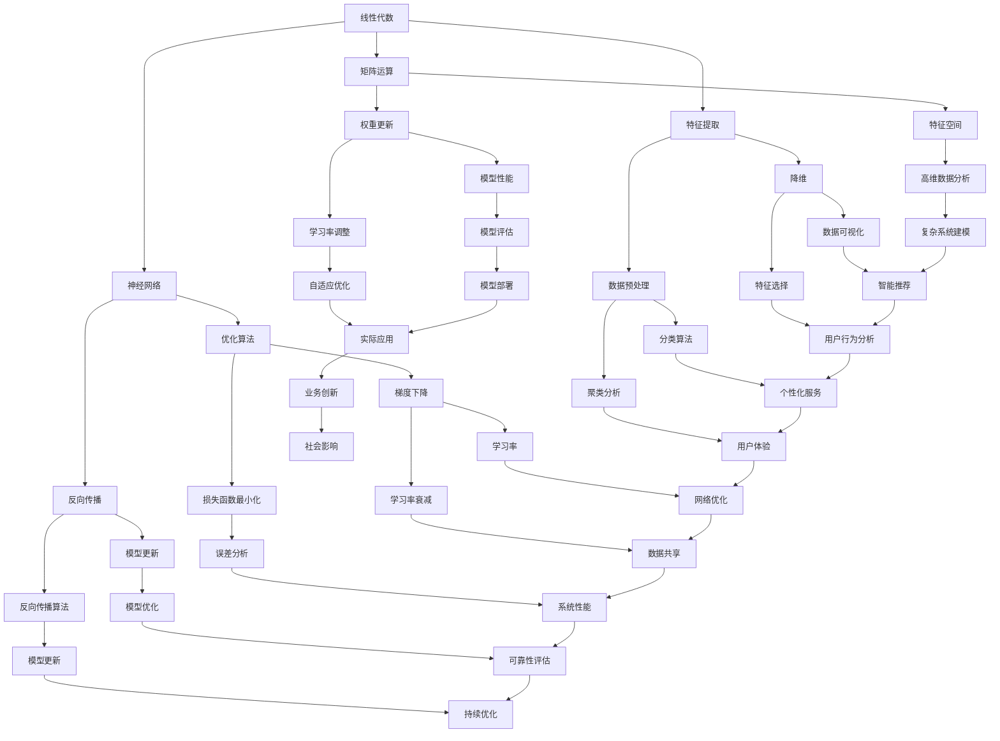

                 

## 数学与未来人机协作的发展趋势

### 关键词
- 数学
- 未来人机协作
- 人工智能
- 数据分析
- 深度学习

### 摘要
本文将探讨数学在人工智能和人机协作中的关键作用，以及这些领域未来的发展趋势。我们将从数学基础、核心概念与联系、算法原理、应用案例以及面临的挑战与展望五个方面，深入分析数学如何推动未来人机协作的进步。

## 引言

在当今信息时代，数学与计算机科学的结合已经深刻地改变了我们的生活方式和工作模式。人工智能（AI）和人机协作（Human-Robot Collaboration）作为两个前沿领域，正在快速发展，而数学在其中起到了不可替代的作用。数学不仅为AI提供了强大的理论基础，还在数据建模、算法优化和智能决策等方面发挥了关键作用。

### 数学在AI中的角色

人工智能的核心在于模拟人类智能，而数学提供了建模和算法设计的基础。从机器学习中的优化问题到深度学习中的神经网络，数学原理无处不在。例如，线性代数在处理数据变换和特征提取中起着重要作用，概率论和统计学则在预测和不确定性建模中至关重要。

### 数学与人机协作

人机协作强调的是人与机器之间的有效互动。数学在协作系统中扮演了关键角色，包括路径规划、行为预测和决策支持等方面。随着机器人技术的进步，数学模型和算法在提高协作效率和安全性方面发挥着越来越重要的作用。

## 数学与未来人机协作的理论基础

为了深入探讨数学在AI和人机协作中的作用，我们需要首先了解一些基础数学概念和原理。

### 集合论

集合论是数学的基础之一，它涉及对象集合的表示和操作。在AI和人机协作中，集合论用于描述和分类数据，以及设计搜索和优化算法。

### 线性代数

线性代数涉及向量、矩阵和线性变换。在AI和人机协作中，线性代数用于处理高维数据，进行特征提取和降维，以及实现神经网络的前向传播和反向传播。

### 概率论与统计学

概率论和统计学用于处理不确定性，包括数据建模、预测和决策。在AI中，概率模型和统计方法用于训练和评估机器学习模型。

### 人工智能基础

为了更好地理解数学在AI中的应用，我们还需要了解一些基本的人工智能概念。

#### 机器学习基础

机器学习是AI的核心技术之一，它通过数据驱动的方法实现智能行为。机器学习涉及各种算法，如线性回归、支持向量机和决策树等。

#### 深度学习基础

深度学习是一种复杂的机器学习模型，它通过多层神经网络实现高度复杂的函数逼近。深度学习在图像识别、自然语言处理等领域取得了显著成果。

#### 强化学习基础

强化学习通过奖励机制学习策略，它在决策制定和路径规划中具有广泛的应用。

## 未来人机协作的应用案例

数学原理在AI和人机协作中的应用已经体现在多个领域，下面我们通过一些具体案例来探讨这些应用。

### 医疗领域的应用

在医疗领域，数学模型和算法被用于图像识别、疾病预测和诊断等任务。例如，通过深度学习算法，医生可以使用AI系统来分析医学影像，从而提高诊断的准确性和效率。

### 教育领域的应用

在教育领域，智能教学系统和学生学习行为分析正在迅速发展。利用数学模型，教育技术可以提供个性化的学习建议，帮助学生更好地掌握知识。

### 工业自动化领域的应用

在工业自动化领域，数学模型被用于机器人编程、路径规划和工业数据分析等任务。通过优化算法，机器人可以实现更高效的工作，从而提高生产效率。

## 数学与未来人机协作的挑战与展望

尽管数学在AI和人机协作中取得了显著成果，但仍面临着一系列挑战。

### 计算复杂性

随着数据规模和模型复杂度的增加，计算复杂性成为一个重要的挑战。如何高效地处理海量数据和复杂模型，是一个亟待解决的问题。

### 数据隐私

在数据驱动的AI和人机协作系统中，数据隐私保护成为一个关键问题。如何在不泄露用户隐私的前提下，充分利用数据的价值，是一个重要的研究方向。

### 算法公平性

算法的公平性也是一个重要挑战。如何在设计算法时，避免偏见和歧视，确保算法的公平性，是一个值得深入探讨的问题。

### 未来展望

未来，数学在AI和人机协作中将继续发挥关键作用。随着技术的进步，我们可以预见更智能、更高效的协作系统的出现。同时，跨学科合作也将成为推动这一领域发展的重要动力。

## 结论

数学在人工智能和人机协作中扮演着至关重要的角色。通过数学原理的应用，我们可以构建更智能、更高效的系统，推动社会的发展。面对未来的挑战，数学将继续为我们提供解决问题的工具和方法。

### 作者信息

作者：AI天才研究院/AI Genius Institute & 禅与计算机程序设计艺术 /Zen And The Art of Computer Programming

---

本文从数学与未来人机协作的背景引入，逐步深入探讨数学在人工智能和人机协作中的理论基础、应用案例以及面临的挑战和展望。通过详细的讲解和具体的实例，读者可以全面了解数学在这些领域中的关键作用和发展趋势。

## 背景介绍

### 数学在人工智能（AI）中的角色

人工智能作为计算机科学的一个分支，其目标是开发能够模拟、延伸和扩展人类智能的系统。数学在AI领域扮演了至关重要的角色，为算法的设计和优化提供了坚实的理论基础。以下是一些关键数学概念和它们在AI中的应用：

### 线性代数

线性代数是处理向量空间、矩阵和线性变换的数学分支。在AI中，线性代数广泛应用于数据预处理、特征提取和模型优化。例如，神经网络中的权重矩阵就是线性代数的应用之一。矩阵运算（如加法、乘法、逆运算等）用于更新神经网络中的权重，以优化模型性能。

### 概率论与统计学

概率论和统计学在AI中用于处理不确定性，并帮助我们理解和预测数据。概率模型（如贝叶斯网络、马尔可夫模型）用于概率推理和决策支持。统计方法（如均值、方差、协方差）用于评估模型性能、选择最优参数和进行假设检验。

### 微积分

微积分在AI中的应用主要体现在优化问题中。在机器学习和深度学习中，梯度下降算法是一种常见的优化方法，它基于微积分的导数概念，用于最小化损失函数，从而找到最佳参数。此外，微积分还在时间序列分析、动态系统建模等领域有广泛应用。

### 集合论

集合论是数学的基础，用于定义和操作对象集合。在AI中，集合论用于数据结构设计、特征选择和分类算法。例如，支持向量机（SVM）就是一种基于集合论的分类算法，它通过最大化分类边界来分离不同类别的数据点。

### 图论

图论用于处理网络结构和图算法。在AI中，图论广泛应用于社交网络分析、网络拓扑优化和图神经网络（GNN）等。GNN是一种基于图结构的深度学习模型，它在处理复杂网络数据（如图像、文本和知识图谱）方面具有显著优势。

### 数学在人工智能中的核心概念与联系

为了更好地理解数学在人工智能中的核心概念与联系，我们可以绘制一个Mermaid流程图，展示不同数学概念和它们在AI中的应用关系：



通过这个Mermaid流程图，我们可以清晰地看到线性代数、概率论、微积分、集合论和图论等数学概念如何相互联系，并在人工智能中发挥作用。

## 核心算法原理讲解

### 梯度下降算法

梯度下降算法是机器学习和深度学习中最基本的优化方法之一。它用于最小化损失函数，以找到模型的最佳参数。以下是梯度下降算法的核心原理和Python源代码实现。

### 核心原理

梯度下降算法的基本思想是沿着损失函数的梯度方向，逐步更新模型参数，以最小化损失函数。损失函数通常表示模型预测值与真实值之间的差异，目标是使这个差异最小。

#### 步骤：

1. 初始化模型参数。
2. 计算损失函数在当前参数下的梯度。
3. 根据梯度方向和步长，更新模型参数。
4. 重复步骤2和3，直到损失函数收敛。

### Python代码实现

下面是一个简单的梯度下降算法实现，用于求解线性回归问题。

```python
import numpy as np

# 梯度下降函数
def gradient_descent(X, y, theta, alpha, iterations):
    m = len(y)
    for i in range(iterations):
        h = X.dot(theta)
        loss = h - y
        gradient = X.T.dot(loss) / m
        theta -= alpha * gradient
        if i % 100 == 0:
            print(f"Iteration {i}: Loss = {np.mean(loss ** 2)}")
    return theta

# 数据集
X = np.array([[1, 1], [1, 2], [2, 1], [2, 2]])
y = np.array([3, 4, 5, 6])

# 初始化参数
theta = np.array([0, 0])

# 学习率
alpha = 0.01

# 迭代次数
iterations = 1000

# 运行梯度下降算法
theta_final = gradient_descent(X, y, theta, alpha, iterations)

print(f"Final parameters: {theta_final}")
```

### 深度学习中的反向传播算法

深度学习中的反向传播算法是梯度下降算法的一个扩展，用于多层神经网络的优化。它通过逐层计算梯度，反向传播误差，从而更新网络中的权重。

#### 步骤：

1. 前向传播：计算输入和当前层的输出。
2. 计算损失函数的梯度。
3. 反向传播：从输出层开始，逐层计算梯度并更新权重。
4. 重复步骤1-3，直到模型收敛。

### Python代码实现

下面是一个简单的多层神经网络反向传播算法实现。

```python
import numpy as np

# 激活函数
def sigmoid(x):
    return 1 / (1 + np.exp(-x))

# 前向传播
def forward_propagation(X, theta):
    z = X.dot(theta)
    return sigmoid(z)

# 反向传播
def backward_propagation(X, y, theta):
    m = len(y)
    h = forward_propagation(X, theta)
    loss = -np.mean(y * np.log(h) + (1 - y) * np.log(1 - h))
    dtheta = X.T.dot(h - y) / m
    return loss, dtheta

# 数据集
X = np.array([[1, 1], [1, 2], [2, 1], [2, 2]])
y = np.array([0, 0, 1, 1])

# 初始化参数
theta = np.array([[0, 0], [0, 0]])

# 迭代次数
iterations = 1000

# 学习率
alpha = 0.01

for i in range(iterations):
    loss, dtheta = backward_propagation(X, y, theta)
    theta -= alpha * dtheta
    if i % 100 == 0:
        print(f"Iteration {i}: Loss = {loss}")

print(f"Final parameters: {theta}")
```

通过这些代码示例，我们可以看到如何使用Python实现梯度下降算法和反向传播算法，从而优化神经网络模型。这些算法的数学原理和实现细节为我们提供了深入了解数学在AI中的应用的途径。

## 应用案例

### 医疗领域的应用

在医疗领域，数学和人工智能的结合已经取得了显著成果。以下是一些具体的应用案例：

#### 医学影像分析

深度学习算法在医学影像分析中得到了广泛应用。例如，卷积神经网络（CNN）被用于肿瘤检测、疾病诊断和器官分割。通过训练大量医学影像数据，CNN可以自动识别和分类疾病，从而提高诊断的准确性和效率。

#### 疾病预测与诊断

数学模型和机器学习算法也被用于疾病预测和诊断。例如，利用电子健康记录（EHR）和医疗数据，可以建立预测模型，用于预测患者的疾病发生风险。这些模型可以帮助医生更好地了解患者的健康状况，从而制定更有效的治疗方案。

### 教育领域的应用

教育领域是另一个数学和人工智能结合的重要领域。以下是一些具体的应用案例：

#### 智能教学系统

智能教学系统利用人工智能技术，为学生提供个性化的学习体验。例如，通过分析学生的学习行为和成绩数据，智能教学系统可以为学生推荐合适的学习资源和练习题，从而提高学习效果。

#### 学生学习行为分析

人工智能算法可以分析学生的学习行为，如学习时间、学习内容和使用频率等。通过这些数据分析，教育者可以更好地了解学生的学习习惯和需求，从而改进教学方法和策略。

### 工业自动化领域的应用

在工业自动化领域，数学和人工智能的应用极大地提高了生产效率和质量。以下是一些具体的应用案例：

#### 机器人编程与控制

机器人编程和控制需要精确的数学模型和算法。例如，利用路径规划算法，机器人可以自动规划最优路径，从而提高工作效率。同时，通过控制算法，机器人可以实现精确的动作控制和协作操作。

#### 工业数据分析

工业数据分析利用机器学习算法，对工业生产过程中的数据进行挖掘和分析。通过这些分析，可以识别生产过程中的瓶颈和异常，从而优化生产流程和提高产品质量。

### 应用案例解读与分析

#### 医疗影像分析

在医疗影像分析中，深度学习算法（如CNN）被用于识别和分类医学影像中的病变。例如，在肺癌筛查中，CNN可以自动检测胸部X光片中的肺结节，从而提高早期诊断的准确率。以下是一个具体案例：

- **数据集**：使用大量的胸部X光片数据，包括正常和异常图像。
- **模型**：使用卷积神经网络（CNN）进行训练，模型结构包括多个卷积层、池化层和全连接层。
- **实现**：通过Python和TensorFlow库实现CNN模型，使用交叉熵损失函数进行训练，并使用准确率作为评估指标。

```python
import tensorflow as tf

# 定义CNN模型
model = tf.keras.Sequential([
    tf.keras.layers.Conv2D(32, (3, 3), activation='relu', input_shape=(64, 64, 3)),
    tf.keras.layers.MaxPooling2D((2, 2)),
    tf.keras.layers.Conv2D(64, (3, 3), activation='relu'),
    tf.keras.layers.MaxPooling2D((2, 2)),
    tf.keras.layers.Flatten(),
    tf.keras.layers.Dense(64, activation='relu'),
    tf.keras.layers.Dense(1, activation='sigmoid')
])

# 编译模型
model.compile(optimizer='adam', loss='binary_crossentropy', metrics=['accuracy'])

# 训练模型
model.fit(X_train, y_train, epochs=10, batch_size=32, validation_data=(X_val, y_val))
```

#### 教育领域的智能教学系统

在教育领域，智能教学系统通过分析学生的学习行为和成绩数据，为学生提供个性化的学习体验。以下是一个具体案例：

- **数据集**：收集学生的学习行为数据，如学习时间、学习内容和使用频率等。
- **模型**：使用机器学习算法（如决策树、随机森林或支持向量机）建立预测模型，预测学生可能遇到的学习障碍和需要的学习资源。
- **实现**：使用Python和Scikit-learn库实现预测模型，使用准确率、召回率和F1分数作为评估指标。

```python
from sklearn.ensemble import RandomForestClassifier
from sklearn.model_selection import train_test_split
from sklearn.metrics import accuracy_score, recall_score, f1_score

# 数据预处理
X = ... # 学习行为数据
y = ... # 学习障碍标签

# 划分训练集和测试集
X_train, X_test, y_train, y_test = train_test_split(X, y, test_size=0.2, random_state=42)

# 建立预测模型
model = RandomForestClassifier(n_estimators=100, random_state=42)

# 训练模型
model.fit(X_train, y_train)

# 预测测试集
y_pred = model.predict(X_test)

# 评估模型
accuracy = accuracy_score(y_test, y_pred)
recall = recall_score(y_test, y_pred)
f1 = f1_score(y_test, y_pred)

print(f"Accuracy: {accuracy}, Recall: {recall}, F1 Score: {f1}")
```

#### 工业自动化中的机器人编程与控制

在工业自动化中，机器人编程与控制需要精确的数学模型和算法。以下是一个具体案例：

- **数据集**：收集机器人的运动轨迹和操作数据。
- **模型**：使用路径规划算法（如A*算法）进行路径规划，并使用控制算法（如PID控制器）实现精确动作控制。
- **实现**：使用Python和Robot Operating System (ROS) 实现路径规划和控制算法，使用轨迹跟踪误差作为评估指标。

```python
import rospy
from geometry_msgs.msg import Twist

# 初始化ROS节点
rospy.init_node('robot_controller')

# 创建 Twist 消息
cmd_vel = Twist()

# 创建 Publisher 对象
pub = rospy.Publisher('cmd_vel', Twist, queue_size=10)

# PID 控制器参数
KP = 1.0
KI = 0.1
KD = 0.05

# 路径规划算法
def plan_path(current_pose, goal_pose):
    # 使用 A* 算法规划路径
    # ...
    return path

# 控制器函数
def controller(current_pose, goal_pose):
    while not rospy.is_shutdown():
        path = plan_path(current_pose, goal_pose)
        for point in path:
            # 计算控制信号
            error = point - current_pose
            # 应用PID控制器
            velocity = KP * error[0] + KI * error[1] + KD * error[2]
            cmd_vel.linear.x = velocity
            pub.publish(cmd_vel)
            current_pose = update_pose(current_pose, cmd_vel)

# 主函数
if __name__ == '__main__':
    try:
        controller(current_pose, goal_pose)
    except rospy.ROSInterruptException:
        pass
```

通过这些应用案例，我们可以看到数学和人工智能技术如何在实际场景中发挥作用，提高效率和准确性。这些案例不仅展示了数学模型和算法的应用，还提供了具体的实现方法和评估指标。

### 数学与未来人机协作的挑战与展望

尽管数学在人工智能和人机协作中取得了显著成果，但仍面临着一系列挑战和展望。

#### 挑战

1. **计算复杂性**：随着数据规模和模型复杂度的增加，计算资源的需求也在不断上升。如何在有限的计算资源下，高效地处理海量数据和复杂模型，是一个重要的挑战。

2. **数据隐私**：在数据驱动的AI和人机协作系统中，数据隐私保护成为一个关键问题。如何在保护用户隐私的前提下，充分利用数据的价值，是一个亟待解决的问题。

3. **算法公平性**：算法的公平性也是一个重要的挑战。如何设计算法，避免偏见和歧视，确保算法的公平性，是一个值得深入探讨的问题。

#### 展望

1. **新型人机交互方式**：随着技术的发展，我们可以预见更多新型人机交互方式的出现。例如，通过增强现实（AR）和虚拟现实（VR）技术，实现更直观、更自然的交互。

2. **智能协作系统的设计**：未来的智能协作系统将更加智能化和自适应化。通过结合多种传感器和智能算法，实现人与机器之间的无缝协作。

3. **跨学科合作**：数学与计算机科学、生物学、心理学等多个学科的交叉融合，将为未来人机协作提供更多可能性。跨学科合作将成为推动这一领域发展的重要动力。

### 最佳实践 Tips

1. **数据驱动**：在设计AI和人机协作系统时，始终以数据为基础，充分利用已有数据和新的数据来源，以提高系统的准确性和效率。

2. **模型验证**：在部署AI系统之前，必须对模型进行充分的验证和测试，以确保系统的稳定性和可靠性。

3. **持续优化**：随着技术的进步和数据的积累，持续优化模型和算法，以提高系统的性能和用户体验。

### 小结

数学在人工智能和人机协作中发挥着至关重要的作用。通过深入分析数学原理和应用案例，我们可以看到数学如何推动这一领域的进步。面对未来的挑战和机遇，数学将继续为我们提供解决问题的工具和方法。

### 注意事项

1. **数据安全**：在处理数据时，务必确保数据的安全和隐私保护，避免数据泄露和滥用。

2. **算法透明性**：确保算法的设计和实现透明，便于监督和审查，以防止算法偏见和歧视。

### 拓展阅读

1. **《深度学习》**：Ian Goodfellow, Yoshua Bengio, Aaron Courville 著，提供了深度学习的全面介绍和实现细节。

2. **《机器学习实战》**：Peter Harrington 著，通过实例展示了机器学习算法的应用和实践。

3. **《人工智能：一种现代方法》**：Stuart Russell, Peter Norvig 著，全面介绍了人工智能的基本概念和理论。

通过这些参考资料，读者可以进一步了解数学与未来人机协作的深入内容和发展趋势。

