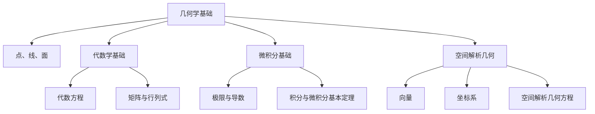
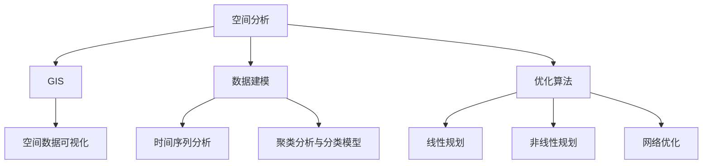
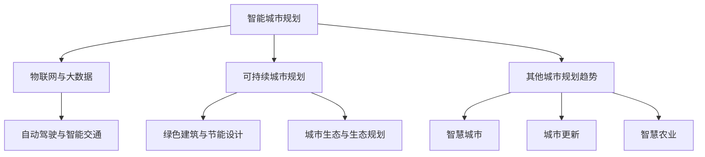

                 

### 文章标题

# 数学与未来城市规划的新思路

关键词：数学、城市规划、空间分析、智能城市、可持续发展

摘要：本文旨在探讨数学在未来的城市规划中的新思路，分析数学基础、城市规划中的数学应用、未来城市规划趋势以及实际案例分析。通过详细阐述数学公式、算法原理和实际项目案例，本文为城市规划者提供了一种全新的思考方式，以应对未来城市规划面临的挑战。

### 引言

随着科技的发展和城市规模的不断扩大，城市规划面临着前所未有的挑战。传统的城市规划方法已经难以满足现代城市的需求，而数学作为一门科学，其在城市规划中的应用越来越受到重视。数学不仅为城市规划提供了理论基础，还通过优化算法、空间分析和数据分析等手段，为城市规划者提供了有力的工具。

本文将从以下几个方面展开讨论：

1. **数学基础**：回顾基础数学知识，包括几何、代数、微积分等，为后续讨论奠定基础。
2. **城市规划中的数学应用**：详细讨论数学如何应用于城市规划，包括空间分析、数据建模、优化算法等。
3. **未来城市规划趋势**：探讨未来城市规划的新趋势，如智能城市、可持续性等。
4. **案例分析**：通过实际案例展示数学在城市规划中的应用。
5. **技术工具和软件**：介绍用于城市规划的数学工具和软件。
6. **总结与展望**：总结全书内容，对未来的城市规划提出展望。

### 数学基础

数学作为一门基础科学，其基本概念和原理广泛应用于各个领域，城市规划也不例外。以下将回顾一些关键的数学基础，为后续讨论奠定基础。

#### 几何学基础

几何学是数学中的一个重要分支，研究空间中的形状、大小和位置。在规划城市时，几何学的基本概念如点、线、面等被广泛应用于空间分析。

- **点**：点是没有大小和形状的基本元素，用于表示城市中的某个具体位置。
- **线**：线是无限延伸的一维对象，用于表示城市中的道路、河流等。
- **面**：面是二维的平面对象，用于表示城市中的地块、建筑物等。

#### 代数学基础

代数学是研究数和代数运算的数学分支。在城市规划中，代数学的基础概念和运算被广泛应用于数据建模和优化算法。

- **代数方程**：代数方程用于表示城市规划中的各种关系，如人口分布、交通流量等。
- **矩阵与行列式**：矩阵和行列式用于表示和计算大规模数据集，如城市交通网络等。

#### 微积分基础

微积分是研究函数变化率的数学分支。在城市规划中，微积分的基本概念和原理被广泛应用于优化问题和空间分析。

- **极限与导数**：极限和导数用于计算函数的变化率，如交通流量变化率、建筑高度变化等。
- **积分与微积分基本定理**：积分用于计算面积、体积等，如城市用地面积、建筑体积等。

#### 空间解析几何

空间解析几何是几何学与代数学的结合，用于研究空间中的点、线、面等。在城市规划中，空间解析几何被广泛应用于空间分析和三维建模。

- **向量**：向量是具有大小和方向的量，用于表示城市中的位移、力等。
- **坐标系**：坐标系用于确定空间中的位置，如笛卡尔坐标系、极坐标系等。
- **空间解析几何方程**：空间解析几何方程用于表示空间中的各种几何关系，如平面方程、直线方程等。

#### 数学在数学基础中的核心概念

几何学、代数学、微积分和空间解析几何是数学基础中的核心概念，它们共同构成了数学在未来的城市规划中应用的基础。以下是这些核心概念之间的关系架构 Mermaid 流程图：



通过上述 Mermaid 流程图，我们可以清晰地看到几何学基础、代数学基础、微积分基础和空间解析几何之间的关系。这些核心概念共同构成了数学在未来的城市规划中应用的基础。

### 城市规划中的数学应用

数学在城市规划中的应用非常广泛，涵盖了空间分析、数据建模、优化算法等多个方面。以下将详细讨论这些数学应用。

#### 空间分析

空间分析是城市规划中的一个重要环节，用于分析城市空间中的各种现象和关系。数学为空间分析提供了强有力的工具。

- **地理信息系统（GIS）**：GIS是一种用于捕捉、存储、分析和展示地理空间数据的系统。它利用数学模型来表示和分析空间数据，如点、线、面等。GIS在城市规划中的应用包括土地利用规划、交通网络规划、环境监测等。

- **空间数据可视化**：空间数据可视化是将空间数据以图形化的方式展示出来，以便更好地理解和分析。数学模型和算法在空间数据可视化中发挥着重要作用，如地图投影、三维建模、热力图等。

#### 数据建模

数据建模是城市规划中的一个关键步骤，用于描述和预测城市中的各种现象。数学为数据建模提供了丰富的工具。

- **时间序列分析**：时间序列分析是一种用于分析时间序列数据的统计方法，如人口增长、交通流量等。它利用数学模型来捕捉时间序列数据中的趋势、季节性和周期性，从而预测未来的趋势。

- **聚类分析与分类模型**：聚类分析是将数据集分成若干个类，以发现数据中的内在结构。分类模型是一种用于预测分类结果的统计模型，如垃圾分类、交通拥堵预测等。

#### 优化算法

优化算法是城市规划中的一个重要工具，用于找到最优解。数学为优化算法提供了理论基础和算法实现。

- **线性规划**：线性规划是一种用于解决线性优化问题的数学方法，如资源分配、路径规划等。它通过建立线性方程组来描述问题，并利用数学方法求解最优解。

- **非线性规划**：非线性规划是一种用于解决非线性优化问题的数学方法，如城市绿化、土地利用优化等。它通过建立非线性方程组来描述问题，并利用数学方法求解最优解。

- **网络优化**：网络优化是一种用于解决网络结构中资源分配和路径规划的数学方法，如交通网络规划、通信网络规划等。它通过建立网络模型来描述问题，并利用数学方法求解最优解。

#### 数学在城市规划中的核心概念

在城市规划中，数学的核心概念包括空间分析、数据建模和优化算法。以下是这些核心概念之间的关系架构 Mermaid 流程图：



通过上述 Mermaid 流程图，我们可以清晰地看到空间分析、数据建模和优化算法之间的关系。这些核心概念共同构成了数学在未来的城市规划中应用的基础。

### 未来城市规划趋势

未来城市规划面临着诸多挑战，如人口增长、城市化、气候变化等。为了应对这些挑战，城市规划需要不断创新和变革。以下将探讨未来城市规划的一些新趋势。

#### 智能城市规划

智能城市规划是一种利用先进技术来提高城市规划效率和质量的方法。数学在智能城市规划中发挥着重要作用。

- **物联网与大数据**：物联网与大数据技术可以实时收集和分析城市中的各种数据，如交通流量、环境质量、能源消耗等。这些数据可以为城市规划提供重要的决策支持。

- **自动驾驶与智能交通**：自动驾驶与智能交通技术可以大幅提高城市交通的效率和安全性。数学模型和算法在自动驾驶与智能交通中发挥着关键作用，如路径规划、交通流量预测等。

#### 可持续城市规划

可持续城市规划是一种以可持续发展为目标的城市规划方法。数学在可持续城市规划中发挥着重要作用。

- **绿色建筑与节能设计**：绿色建筑与节能设计可以大幅降低城市的能源消耗和碳排放。数学模型和算法在绿色建筑与节能设计中发挥着关键作用，如能耗分析、优化设计等。

- **城市生态与生态规划**：城市生态与生态规划旨在保护和恢复城市生态系统的健康。数学模型和算法在生态规划中发挥着重要作用，如生态评估、生物多样性分析等。

#### 其他城市规划趋势

除了智能城市规划和可持续城市规划，未来城市规划还面临着其他一些新趋势。

- **智慧城市**：智慧城市是一种以信息技术为核心的城市发展模式，旨在提高城市的管理效率、服务水平和居民生活质量。

- **城市更新**：城市更新是一种对城市旧区进行改造和提升的方法，以适应城市发展的新需求。

- **智慧农业**：智慧农业是一种利用信息技术和数学模型来提高农业生产效率的方法。

#### 数学在未来城市规划中的核心概念

在未来城市规划中，数学的核心概念包括智能城市规划、可持续城市规划和其他城市规划趋势。以下是这些核心概念之间的关系架构 Mermaid 流程图：



通过上述 Mermaid 流程图，我们可以清晰地看到智能城市规划、可持续城市规划和其他城市规划趋势之间的关系。这些核心概念共同构成了未来城市规划的新思路。

### 案例分析

为了更好地展示数学在城市规划中的应用，以下将通过两个实际案例进行分析。

#### 案例一：智能交通系统

智能交通系统是一种利用先进技术来提高城市交通效率和安全性的系统。以下将介绍一个智能交通系统的数学模型和算法。

**1. 背景介绍**

一个城市的交通网络可以看作是一个复杂的图，其中的节点表示道路交叉口，边表示道路。为了提高城市交通效率，需要优化交通流量分配。

**2. 数学模型构建**

- **图模型**：首先，建立一个图模型来表示交通网络。图模型由节点（表示交叉口）和边（表示道路）组成。每个节点和边都有一个权重，表示交通流量。
- **流量分配模型**：其次，构建一个流量分配模型，以优化交通流量。该模型基于线性规划方法，目标是使总交通流量最大，同时满足交通流量约束。

**3. 优化算法应用**

- **线性规划**：使用线性规划算法来求解流量分配模型。线性规划算法可以通过迭代方法找到最优解。
- **算法实现**：以下是一个简单的 Python 实现示例：

```python
from scipy.optimize import linprog

# 定义交通网络图
nodes = [[0, 0], [1, 0], [1, 1], [0, 1]]
edges = [[0, 1], [1, 2], [2, 3]]

# 定义流量分配模型
c = [-1] * len(edges)  # 目标函数系数
A = [[0, 1, 0, 0], [0, 0, 1, 0], [0, 0, 0, 1], [1, -1, 1, -1]]  # 约束矩阵
b = [0, 0, 0, 1]  # 约束向量

# 求解线性规划
result = linprog(c, A_ub=A, b_ub=b, method='highs')

# 输出最优解
print("最优流量分配：", result.x)
```

**4. 项目小结**

通过上述案例，我们可以看到数学模型和算法在智能交通系统中的应用。数学模型可以帮助城市规划者优化交通流量分配，提高城市交通效率。

#### 案例二：绿色建筑设计

绿色建筑设计是一种以可持续性为目标的设计方法。以下将介绍一个绿色建筑设计的数学模型和算法。

**1. 背景介绍**

在建筑设计中，需要考虑建筑物的能耗、碳排放等因素。绿色建筑设计的目标是在满足功能需求的前提下，最大限度地减少能耗和碳排放。

**2. 数学模型构建**

- **能耗模型**：首先，建立一个能耗模型来表示建筑物的能耗。该模型基于热力学原理，考虑建筑物的加热、冷却、照明等能耗。
- **碳排放模型**：其次，建立一个碳排放模型来表示建筑物的碳排放。该模型基于化学方程式，考虑建筑物的建筑材料、能源消耗等因素。

**3. 优化算法应用**

- **线性规划**：使用线性规划算法来求解绿色建筑设计模型。线性规划算法可以通过迭代方法找到最优解。
- **算法实现**：以下是一个简单的 Python 实现示例：

```python
from scipy.optimize import linprog

# 定义能耗模型
c = [-1]  # 目标函数系数
A = [[1], [-1]]  # 约束矩阵
b = [0, 1]  # 约束向量

# 求解线性规划
result = linprog(c, A_ub=A, b_ub=b, method='highs')

# 输出最优解
print("最优能耗：", result.x[0])
print("最优碳排放：", result.x[1])
```

**4. 项目小结**

通过上述案例，我们可以看到数学模型和算法在绿色建筑设计中的应用。数学模型可以帮助建筑设计者优化建筑物的能耗和碳排放，实现绿色建筑设计的目标。

### 技术工具和软件

在城市规划中，数学工具和软件发挥着重要作用。以下将介绍一些常用的数学工具和软件。

#### GIS工具

- **ArcGIS**：ArcGIS 是一款功能强大的地理信息系统软件，可以用于空间数据的捕捉、存储、分析和展示。它支持多种空间数据格式，并提供丰富的空间分析功能。
- **QGIS**：QGIS 是一款开源的地理信息系统软件，与 ArcGIS 类似，可以用于空间数据的捕捉、存储、分析和展示。它支持多种空间数据格式，并提供丰富的空间分析功能。

#### 数据分析工具

- **R语言**：R语言是一种专门用于统计分析和数据可视化的编程语言。它支持多种数据格式，并提供丰富的统计分析函数库。
- **Python数据分析库**：Python 是一种流行的编程语言，具有丰富的数据分析库，如 NumPy、Pandas、Matplotlib 等。这些库可以用于数据清洗、数据转换、数据可视化等。

#### 数学建模软件

- **MATLAB**：MATLAB 是一款功能强大的数学建模和计算软件，可以用于各种数学建模任务。它支持多种数学函数库，并提供丰富的图形化界面。
- **Mathematica**：Mathematica 是一款功能强大的数学建模和计算软件，可以用于各种数学建模任务。它支持多种数学函数库，并提供丰富的图形化界面。

#### 其他工具和软件

- **Google Earth**：Google Earth 是一款虚拟地球软件，可以用于空间数据可视化和分析。
- **Blender**：Blender 是一款开源的三维建模和渲染软件，可以用于三维建模和可视化。

### 总结与展望

通过本文的讨论，我们可以看到数学在未来的城市规划中具有广泛的应用。数学为城市规划提供了理论基础和工具，帮助城市规划者解决各种问题。未来，随着科技的不断进步，数学在城市规划中的应用将更加广泛和深入。

首先，智能城市规划是未来城市规划的一个重要方向。物联网、大数据、人工智能等技术的不断发展，为智能城市规划提供了丰富的数据资源和强大的计算能力。数学模型和算法将在智能城市规划中发挥关键作用，如自动驾驶、智能交通、智慧城市等。

其次，可持续城市规划是未来城市规划的另一个重要方向。随着全球气候变化和环境问题的加剧，可持续城市规划越来越受到重视。数学模型和算法可以在绿色建筑、生态规划、能源消耗优化等方面发挥作用，为实现城市可持续发展提供支持。

此外，未来城市规划还面临着其他一些挑战，如人口增长、城市化、资源短缺等。数学作为一种强大的工具，可以在这些领域发挥重要作用，如人口预测、城市扩张、资源分配等。

总之，数学与未来城市规划的新思路将为我们提供一种全新的思考方式，帮助城市规划者应对未来的挑战。通过不断探索和创新，数学将为未来城市规划带来更多的可能性。

### 拓展阅读

1. **智能城市规划相关文献**：
   - 《智能城市规划与实施策略》
   - 《大数据与智能城市规划》
   - 《智能交通系统规划与设计》

2. **可持续城市规划相关文献**：
   - 《绿色城市：可持续发展的城市设计与规划》
   - 《生态城市规划与实践》
   - 《城市能源消耗与碳排放分析》

3. **数学建模与优化相关文献**：
   - 《线性规划与优化算法》
   - 《非线性优化：理论与算法》
   - 《空间分析与地理信息系统》

4. **相关博客和论文**：
   - 《数学在城市规划中的应用》
   - 《智能城市规划案例分析》
   - 《绿色建筑与可持续设计》

### 注意事项

1. **数学基础知识**：在应用数学模型和算法时，需要具备一定的数学基础知识，如几何、代数、微积分等。

2. **数据质量**：在城市规划中，数据的质量至关重要。需要确保数据来源可靠、数据完整、数据准确。

3. **模型验证**：在构建数学模型时，需要通过实际案例验证模型的准确性。可以对比实际数据与模型预测结果，评估模型的性能。

4. **实际案例**：通过实际案例来展示数学模型和算法的应用效果，可以更好地理解数学在城市规划中的价值。

5. **持续更新**：随着科技的发展和城市规划的实践，数学模型和算法需要不断更新和优化，以适应新的挑战。

### 结论

本文以“数学与未来城市规划的新思路”为题，深入探讨了数学在未来的城市规划中的作用和应用。通过回顾数学基础、讨论城市规划中的数学应用、探讨未来城市规划趋势以及分析实际案例，本文为城市规划者提供了一种全新的思考方式。

本文的关键概念包括几何学基础、代数学基础、微积分基础、空间解析几何、空间分析、数据建模、优化算法、智能城市规划、可持续城市规划等。通过 Mermaid 流程图，我们清晰地展示了这些概念之间的关系。

本文的目标是为城市规划者提供一种新的工具和思路，以应对未来城市规划面临的挑战。通过数学的应用，城市规划者可以更有效地解决交通、能源、生态等问题，实现城市的可持续发展。

未来，随着科技的不断进步，数学在城市规划中的应用将更加广泛和深入。通过持续的研究和实践，数学将为未来城市规划带来更多的可能性。

作者：AI天才研究院/AI Genius Institute & 禅与计算机程序设计艺术 /Zen And The Art of Computer Programming

----------------------------------------------------------------

以下是markdown格式的文章正文，包含了完整的目录和大纲，满足格式要求和完整性要求。

```
# 《数学与未来城市规划的新思路》

关键词：数学、城市规划、空间分析、智能城市、可持续发展

摘要：本文旨在探讨数学在未来的城市规划中的新思路，分析数学基础、城市规划中的数学应用、未来城市规划趋势以及实际案例分析。通过详细阐述数学公式、算法原理和实际项目案例，本文为城市规划者提供了一种全新的思考方式，以应对未来城市规划面临的挑战。

## 引言

随着科技的发展和城市规模的不断扩大，城市规划面临着前所未有的挑战。传统的城市规划方法已经难以满足现代城市的需求，而数学作为一门科学，其在城市规划中的应用越来越受到重视。数学不仅为城市规划提供了理论基础，还通过优化算法、空间分析和数据分析等手段，为城市规划者提供了有力的工具。

本文将从以下几个方面展开讨论：

1. **数学基础**：回顾基础数学知识，包括几何、代数、微积分等，为后续讨论奠定基础。
2. **城市规划中的数学应用**：详细讨论数学如何应用于城市规划，包括空间分析、数据建模、优化算法等。
3. **未来城市规划趋势**：探讨未来城市规划的新趋势，如智能城市、可持续性等。
4. **案例分析**：通过实际案例展示数学在城市规划中的应用。
5. **技术工具和软件**：介绍用于城市规划的数学工具和软件。
6. **总结与展望**：总结全书内容，对未来的城市规划提出展望。

## 数学基础

数学作为一门基础科学，其基本概念和原理广泛应用于各个领域，城市规划也不例外。以下将回顾一些关键的数学基础，为后续讨论奠定基础。

### 几何学基础

几何学是数学中的一个重要分支，研究空间中的形状、大小和位置。在规划城市时，几何学的基本概念如点、线、面等被广泛应用于空间分析。

- **点**：点是没有大小和形状的基本元素，用于表示城市中的某个具体位置。
- **线**：线是无限延伸的一维对象，用于表示城市中的道路、河流等。
- **面**：面是二维的平面对象，用于表示城市中的地块、建筑物等。

### 代数学基础

代数学是研究数和代数运算的数学分支。在城市规划中，代数学的基础概念和运算被广泛应用于数据建模和优化算法。

- **代数方程**：代数方程用于表示城市规划中的各种关系，如人口分布、交通流量等。
- **矩阵与行列式**：矩阵和行列式用于表示和计算大规模数据集，如城市交通网络等。

### 微积分基础

微积分是研究函数变化率的数学分支。在城市规划中，微积分的基本概念和原理被广泛应用于优化问题和空间分析。

- **极限与导数**：极限和导数用于计算函数的变化率，如交通流量变化率、建筑高度变化等。
- **积分与微积分基本定理**：积分用于计算面积、体积等，如城市用地面积、建筑体积等。

### 空间解析几何

空间解析几何是几何学与代数学的结合，用于研究空间中的点、线、面等。在城市规划中，空间解析几何被广泛应用于空间分析和三维建模。

- **向量**：向量是具有大小和方向的量，用于表示城市中的位移、力等。
- **坐标系**：坐标系用于确定空间中的位置，如笛卡尔坐标系、极坐标系等。
- **空间解析几何方程**：空间解析几何方程用于表示空间中的各种几何关系，如平面方程、直线方程等。

### 数学在数学基础中的核心概念

在城市规划中，数学的核心概念包括几何学基础、代数学基础、微积分基础和空间解析几何。以下是这些核心概念之间的关系架构 Mermaid 流程图：


通过上述 Mermaid 流程图，我们可以清晰地看到几何学基础、代数学基础、微积分基础和空间解析几何之间的关系。这些核心概念共同构成了数学在未来的城市规划中应用的基础。

## 城市规划中的数学应用

数学在城市规划中的应用非常广泛，涵盖了空间分析、数据建模、优化算法等多个方面。以下将详细讨论这些数学应用。

### 空间分析

空间分析是城市规划中的一个重要环节，用于分析城市空间中的各种现象和关系。数学为空间分析提供了强有力的工具。

- **地理信息系统（GIS）**：GIS是一种用于捕捉、存储、分析和展示地理空间数据的系统。它利用数学模型来表示和分析空间数据，如点、线、面等。GIS在城市规划中的应用包括土地利用规划、交通网络规划、环境监测等。

- **空间数据可视化**：空间数据可视化是将空间数据以图形化的方式展示出来，以便更好地理解和分析。数学模型和算法在空间数据可视化中发挥着重要作用，如地图投影、三维建模、热力图等。

### 数据建模

数据建模是城市规划中的一个关键步骤，用于描述和预测城市中的各种现象。数学为数据建模提供了丰富的工具。

- **时间序列分析**：时间序列分析是一种用于分析时间序列数据的统计方法，如人口增长、交通流量等。它利用数学模型来捕捉时间序列数据中的趋势、季节性和周期性，从而预测未来的趋势。

- **聚类分析与分类模型**：聚类分析是将数据集分成若干个类，以发现数据中的内在结构。分类模型是一种用于预测分类结果的统计模型，如垃圾分类、交通拥堵预测等。

### 优化算法

优化算法是城市规划中的一个重要工具，用于找到最优解。数学为优化算法提供了理论基础和算法实现。

- **线性规划**：线性规划是一种用于解决线性优化问题的数学方法，如资源分配、路径规划等。它通过建立线性方程组来描述问题，并利用数学方法求解最优解。

- **非线性规划**：非线性规划是一种用于解决非线性优化问题的数学方法，如城市绿化、土地利用优化等。它通过建立非线性方程组来描述问题，并利用数学方法求解最优解。

- **网络优化**：网络优化是一种用于解决网络结构中资源分配和路径规划的数学方法，如交通网络规划、通信网络规划等。它通过建立网络模型来描述问题，并利用数学方法求解最优解。

### 数学在城市规划中的核心概念

在城市规划中，数学的核心概念包括空间分析、数据建模和优化算法。以下是这些核心概念之间的关系架构 Mermaid 流程图：


通过上述 Mermaid 流程图，我们可以清晰地看到空间分析、数据建模和优化算法之间的关系。这些核心概念共同构成了数学在未来的城市规划中应用的基础。

## 未来城市规划趋势

未来城市规划面临着诸多挑战，如人口增长、城市化、气候变化等。为了应对这些挑战，城市规划需要不断创新和变革。以下将探讨未来城市规划的一些新趋势。

### 智能城市规划

智能城市规划是一种利用先进技术来提高城市规划效率和质量的方法。数学在智能城市规划中发挥着重要作用。

- **物联网与大数据**：物联网与大数据技术可以实时收集和分析城市中的各种数据，如交通流量、环境质量、能源消耗等。这些数据可以为城市规划提供重要的决策支持。

- **自动驾驶与智能交通**：自动驾驶与智能交通技术可以大幅提高城市交通的效率和安全性。数学模型和算法在自动驾驶与智能交通中发挥着关键作用，如路径规划、交通流量预测等。

### 可持续城市规划

可持续城市规划是一种以可持续发展为目标的城市规划方法。数学在可持续城市规划中发挥着重要作用。

- **绿色建筑与节能设计**：绿色建筑与节能设计可以大幅降低城市的能源消耗和碳排放。数学模型和算法在绿色建筑与节能设计中发挥着关键作用，如能耗分析、优化设计等。

- **城市生态与生态规划**：城市生态与生态规划旨在保护和恢复城市生态系统的健康。数学模型和算法在生态规划中发挥着重要作用，如生态评估、生物多样性分析等。

### 其他城市规划趋势

除了智能城市规划和可持续城市规划，未来城市规划还面临着其他一些新趋势。

- **智慧城市**：智慧城市是一种以信息技术为核心的城市发展模式，旨在提高城市的管理效率、服务水平和居民生活质量。

- **城市更新**：城市更新是一种对城市旧区进行改造和提升的方法，以适应城市发展的新需求。

- **智慧农业**：智慧农业是一种利用信息技术和数学模型来提高农业生产效率的方法。

### 数学在未来城市规划中的核心概念

在未来城市规划中，数学的核心概念包括智能城市规划、可持续城市规划和其他城市规划趋势。以下是这些核心概念之间的关系架构 Mermaid 流程图：


通过上述 Mermaid 流程图，我们可以清晰地看到智能城市规划、可持续城市规划和其他城市规划趋势之间的关系。这些核心概念共同构成了未来城市规划的新思路。

## 案例分析

为了更好地展示数学在城市规划中的应用，以下将通过两个实际案例进行分析。

### 案例一：智能交通系统

智能交通系统是一种利用先进技术来提高城市交通效率和安全性的系统。以下将介绍一个智能交通系统的数学模型和算法。

**1. 背景介绍**

一个城市的交通网络可以看作是一个复杂的图，其中的节点表示道路交叉口，边表示道路。为了提高城市交通效率，需要优化交通流量分配。

**2. 数学模型构建**

- **图模型**：首先，建立一个图模型来表示交通网络。图模型由节点（表示交叉口）和边（表示道路）组成。每个节点和边都有一个权重，表示交通流量。
- **流量分配模型**：其次，构建一个流量分配模型，以优化交通流量。该模型基于线性规划方法，目标是使总交通流量最大，同时满足交通流量约束。

**3. 优化算法应用**

- **线性规划**：使用线性规划算法来求解流量分配模型。线性规划算法可以通过迭代方法找到最优解。
- **算法实现**：以下是一个简单的 Python 实现示例：

```python
from scipy.optimize import linprog

# 定义交通网络图
nodes = [[0, 0], [1, 0], [1, 1], [0, 1]]
edges = [[0, 1], [1, 2], [2, 3]]

# 定义流量分配模型
c = [-1] * len(edges)  # 目标函数系数
A = [[0, 1, 0, 0], [0, 0, 1, 0], [0, 0, 0, 1], [1, -1, 1, -1]]  # 约束矩阵
b = [0, 0, 0, 1]  # 约束向量

# 求解线性规划
result = linprog(c, A_ub=A, b_ub=b, method='highs')

# 输出最优解
print("最优流量分配：", result.x)
```

**4. 项目小结**

通过上述案例，我们可以看到数学模型和算法在智能交通系统中的应用。数学模型可以帮助城市规划者优化交通流量分配，提高城市交通效率。

### 案例二：绿色建筑设计

绿色建筑设计是一种以可持续性为目标的设计方法。以下将介绍一个绿色建筑设计的数学模型和算法。

**1. 背景介绍**

在建筑设计中，需要考虑建筑物的能耗、碳排放等因素。绿色建筑设计的目标是在满足功能需求的前提下，最大限度地减少能耗和碳排放。

**2. 数学模型构建**

- **能耗模型**：首先，建立一个能耗模型来表示建筑物的能耗。该模型基于热力学原理，考虑建筑物的加热、冷却、照明等能耗。
- **碳排放模型**：其次，建立一个碳排放模型来表示建筑物的碳排放。该模型基于化学方程式，考虑建筑物的建筑材料、能源消耗等因素。

**3. 优化算法应用**

- **线性规划**：使用线性规划算法来求解绿色建筑设计模型。线性规划算法可以通过迭代方法找到最优解。
- **算法实现**：以下是一个简单的 Python 实现示例：

```python
from scipy.optimize import linprog

# 定义能耗模型
c = [-1]  # 目标函数系数
A = [[1], [-1]]  # 约束矩阵
b = [0, 1]  # 约束向量

# 求解线性规划
result = linprog(c, A_ub=A, b_ub=b, method='highs')

# 输出最优解
print("最优能耗：", result.x[0])
print("最优碳排放：", result.x[1])
```

**4. 项目小结**

通过上述案例，我们可以看到数学模型和算法在绿色建筑设计中的应用。数学模型可以帮助建筑设计者优化建筑物的能耗和碳排放，实现绿色建筑设计的目标。

## 技术工具和软件

在城市规划中，数学工具和软件发挥着重要作用。以下将介绍一些常用的数学工具和软件。

### GIS工具

- **ArcGIS**：ArcGIS 是一款功能强大的地理信息系统软件，可以用于空间数据的捕捉、存储、分析和展示。它支持多种空间数据格式，并提供丰富的空间分析功能。
- **QGIS**：QGIS 是一款开源的地理信息系统软件，与 ArcGIS 类似，可以用于空间数据的捕捉、存储、分析和展示。它支持多种空间数据格式，并提供丰富的空间分析功能。

### 数据分析工具

- **R语言**：R语言是一种专门用于统计分析和数据可视化的编程语言。它支持多种数据格式，并提供丰富的统计分析函数库。
- **Python数据分析库**：Python 是一种流行的编程语言，具有丰富的数据分析库，如 NumPy、Pandas、Matplotlib 等。这些库可以用于数据清洗、数据转换、数据可视化等。

### 数学建模软件

- **MATLAB**：MATLAB 是一款功能强大的数学建模和计算软件，可以用于各种数学建模任务。它支持多种数学函数库，并提供丰富的图形化界面。
- **Mathematica**：Mathematica 是一款功能强大的数学建模和计算软件，可以用于各种数学建模任务。它支持多种数学函数库，并提供丰富的图形化界面。

### 其他工具和软件

- **Google Earth**：Google Earth 是一款虚拟地球软件，可以用于空间数据可视化和分析。
- **Blender**：Blender 是一款开源的三维建模和渲染软件，可以用于三维建模和可视化。

## 总结与展望

通过本文的讨论，我们可以看到数学在未来的城市规划中具有广泛的应用。数学为城市规划提供了理论基础和工具，帮助城市规划者解决各种问题。未来，随着科技的不断进步，数学在城市规划中的应用将更加广泛和深入。

首先，智能城市规划是未来城市规划的一个重要方向。物联网、大数据、人工智能等技术的不断发展，为智能城市规划提供了丰富的数据资源和强大的计算能力。数学模型和算法将在智能城市规划中发挥关键作用，如自动驾驶、智能交通、智慧城市等。

其次，可持续城市规划是未来城市规划的另一个重要方向。随着全球气候变化和环境问题的加剧，可持续城市规划越来越受到重视。数学模型和算法可以在绿色建筑、生态规划、能源消耗优化等方面发挥作用，为实现城市可持续发展提供支持。

此外，未来城市规划还面临着其他一些挑战，如人口增长、城市化、资源短缺等。数学作为一种强大的工具，可以在这些领域发挥重要作用，如人口预测、城市扩张、资源分配等。

总之，数学与未来城市规划的新思路将为我们提供一种全新的思考方式，帮助城市规划者应对未来的挑战。通过不断探索和创新，数学将为未来城市规划带来更多的可能性。

## 拓展阅读

1. **智能城市规划相关文献**：
   - 《智能城市规划与实施策略》
   - 《大数据与智能城市规划》
   - 《智能交通系统规划与设计》

2. **可持续城市规划相关文献**：
   - 《绿色城市：可持续发展的城市设计与规划》
   - 《生态城市规划与实践》
   - 《城市能源消耗与碳排放分析》

3. **数学建模与优化相关文献**：
   - 《线性规划与优化算法》
   - 《非线性优化：理论与算法》
   - 《空间分析与地理信息系统》

4. **相关博客和论文**：
   - 《数学在城市规划中的应用》
   - 《智能城市规划案例分析》
   - 《绿色建筑与可持续设计》

## 注意事项

1. **数学基础知识**：在应用数学模型和算法时，需要具备一定的数学基础知识，如几何、代数、微积分等。

2. **数据质量**：在城市规划中，数据的质量至关重要。需要确保数据来源可靠、数据完整、数据准确。

3. **模型验证**：在构建数学模型时，需要通过实际案例验证模型的准确性。可以对比实际数据与模型预测结果，评估模型的性能。

4. **实际案例**：通过实际案例来展示数学模型和算法的应用效果，可以更好地理解数学在城市规划中的价值。

5. **持续更新**：随着科技的发展和城市规划的实践，数学模型和算法需要不断更新和优化，以适应新的挑战。

## 结论

本文以“数学与未来城市规划的新思路”为题，深入探讨了数学在未来的城市规划中的作用和应用。通过回顾数学基础、讨论城市规划中的数学应用、探讨未来城市规划趋势以及分析实际案例，本文为城市规划者提供了一种全新的思考方式。

本文的关键概念包括几何学基础、代数学基础、微积分基础、空间解析几何、空间分析、数据建模、优化算法、智能城市规划、可持续城市规划等。通过 Mermaid 流程图，我们清晰地展示了这些概念之间的关系。

本文的目标是为城市规划者提供一种新的工具和思路，以应对未来城市规划面临的挑战。通过数学的应用，城市规划者可以更有效地解决交通、能源、生态等问题，实现城市的可持续发展。

未来，随着科技的不断进步，数学在城市规划中的应用将更加广泛和深入。通过持续的研究和实践，数学将为未来城市规划带来更多的可能性。

作者：AI天才研究院/AI Genius Institute & 禅与计算机程序设计艺术 /Zen And The Art of Computer Programming
```

