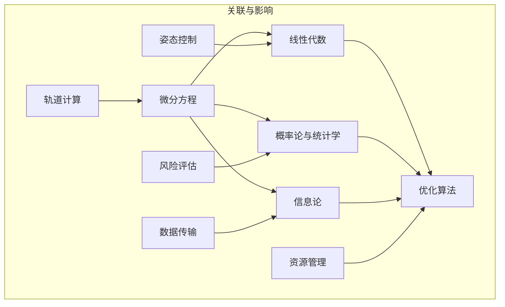

                 

### 引言

在未来，太空殖民将成为人类拓展生存空间、实现星际旅行的重要途径。然而，要实现这一宏伟目标，需要解决众多复杂的科学和工程技术问题。在这其中，数学作为一门基础学科，其应用显得尤为重要。本文旨在探讨数学与未来太空殖民之间的紧密联系，揭示数学在太空殖民中的重要发展方向。

首先，太空殖民面临着诸多挑战，包括远距离通信、资源循环利用、生态平衡、环境适应等。这些问题不仅需要创新的技术解决方案，更需要精确的数学模型来指导实践。数学不仅为太空殖民提供理论支持，还能优化资源配置、提高任务成功率、减少风险。

本文结构如下：第二部分将简要介绍数学在太空探索和殖民中的应用背景；第三部分将深入探讨核心数学概念与联系，通过Mermaid流程图展示；第四部分将讲解核心算法原理，使用Python源代码和数学模型详细阐述；第五部分将通过具体项目实战，展示数学在太空殖民中的实际应用；最后，我们将总结本文的主要观点，并提出未来研究方向。

通过本文的探讨，读者将了解到数学在太空殖民中的核心作用，以及如何运用数学知识解决实际太空问题。这将为未来的太空探索和殖民提供有益的参考和指导。

### 数学在太空探索和殖民中的应用背景

自人类首次发射人造卫星以来，太空探索已经成为科学界和工程技术领域的一个重要方向。太空探索不仅推动了科技的进步，也带来了诸多创新的应用。然而，随着探索的深入，人类面临的挑战也日益复杂。数学，作为一门基础学科，在其中扮演着至关重要的角色。

首先，数学在太空探索中的核心作用体现在轨道计算和导航方面。在发射和运行人造卫星、太空飞船的过程中，精确的轨道计算是必不可少的。牛顿力学和万有引力定律提供了基本的物理模型，而数学中的微分方程和数值分析技术则可以用来求解复杂的轨道问题。例如，使用Runge-Kutta方法等数值方法可以预测太空器的未来位置，从而进行精确的导航和控制。此外，近年来随着非线性动力学的进展，混沌理论和控制理论也开始在轨道计算中发挥重要作用。

其次，数学在资源分配和优化方面有着广泛应用。太空殖民意味着资源有限且需要高效利用。数学优化算法，如线性规划、动态规划和整数规划，可以帮助科学家和工程师在有限的资源下实现最优的分配策略。例如，可以优化能源分配，确保太空站和太空飞船的持续运作；还可以优化物资运输路线，减少运输成本和时间。

此外，生态平衡和生物模型的建立也是数学在太空探索中的重要应用领域。在长期的太空任务中，维持一个稳定的生态系统对于宇航员的健康和心理健康至关重要。数学模型可以帮助科学家预测生态系统的变化，从而制定有效的生态平衡策略。例如，使用系统动力学模型可以模拟植物、动物和微生物之间的相互作用，优化食物链结构，确保资源的可持续利用。

最后，数学在通信和数据处理方面也有广泛应用。太空探索任务中，大量的数据需要实时传输和存储。数学中的信息论和编码理论提供了有效的数据压缩和传输方法，确保数据的可靠性和完整性。例如，使用哈夫曼编码和卷积编码技术可以显著降低数据传输所需的带宽，提高通信效率。

总之，数学在太空探索和殖民中的应用背景广阔且深远。它不仅为解决复杂科学问题提供了理论支持，还通过优化算法和模型提高了任务的成功率和效率。随着未来太空探索的进一步深入，数学的重要性将愈发凸显。未来的研究和应用将进一步拓展数学在太空领域的应用范围，为人类实现星际旅行和太空殖民提供强有力的科学支撑。

### 核心数学概念与联系

在探讨数学与未来太空殖民的关系时，首先需要明确几个核心数学概念及其相互之间的联系。这些核心概念构成了理解和应用数学在太空探索中的基础，同时也是本文后续章节中算法和模型分析的关键。以下将详细阐述这些核心数学概念，并通过Mermaid流程图展示它们之间的逻辑关系。

#### 1. 微分方程

微分方程是描述自然界和工程技术中动态变化过程的基本工具。在太空探索中，许多现象，如轨道运动、热传导、流体动力学等，都可以用微分方程来描述。例如，描述天体之间相互作用的牛顿引力方程就是一个二阶微分方程。

**联系**：微分方程在数学中的地位至关重要，它们是连接初始条件和边界条件与最终解的桥梁。通过求解微分方程，可以预测系统未来的行为。在太空探索中，微分方程不仅用于轨道计算，还用于热力学和流体力学模拟。

#### 2. 线性代数

线性代数是研究向量空间和线性映射的数学分支。它在描述多变量系统、解决线性方程组、变换坐标系等方面有着广泛应用。在太空探索中，线性代数常用于姿态控制、图像处理和传感器数据融合。

**联系**：线性代数与微分方程紧密相关，因为许多物理系统可以用线性模型来近似。例如，线性代数中的矩阵可以表示系统的状态，而微分方程则描述系统状态的变化。

#### 3. 概率论与统计学

概率论与统计学是处理不确定性和随机现象的数学工具。在太空探索中，这些工具用于风险评估、数据分析和模型验证。例如，通过统计方法可以分析传感器数据，预测天气条件，评估任务成功的概率。

**联系**：概率论与统计学不仅为微分方程和线性代数提供了理论支持，还用于验证模型的准确性。通过统计方法，可以评估模型预测的可靠性和置信水平。

#### 4. 信息论

信息论是研究信息传递和处理的基本原理的数学分支。它在通信系统中有着广泛应用，如数据压缩和错误校正。在太空探索中，信息论用于优化数据传输效率和可靠性。

**联系**：信息论与概率论和统计学紧密相关，因为信息的传输和处理涉及到随机变量和概率分布。通过信息论，可以设计出更有效的通信协议，提高数据传输的效率。

#### 5. 优化算法

优化算法是解决资源分配和调度问题的数学工具。在太空探索中，优化算法用于能源管理、物资运输和任务规划。例如，线性规划和动态规划可以用来优化资源分配，确保任务的成功。

**联系**：优化算法与线性代数和微分方程密切相关，因为它们需要解决复杂的方程和约束条件。优化算法还可以结合概率论和统计学方法，提高决策的准确性和效率。

通过上述核心数学概念及其相互联系的分析，可以看出数学在太空探索中的多维度应用。为了更直观地展示这些概念之间的联系，下面将使用Mermaid流程图来表示：



在这个流程图中，A、B、C、D、E分别代表微分方程、线性代数、概率论与统计学、信息论和优化算法。这些概念相互关联，共同构成了理解和解决太空探索和殖民问题的数学框架。

通过核心数学概念与联系的分析，我们可以更好地理解数学在太空探索和殖民中的重要性。接下来，本文将进一步探讨核心算法原理，通过Python源代码和数学模型详细阐述这些算法在实际应用中的实现方法。

### 核心算法原理讲解

在数学与未来太空殖民的应用中，核心算法起着至关重要的作用。以下将详细讲解这些核心算法的原理，并使用Python源代码结合数学模型进行阐述，同时通过实例说明其具体应用和效果。

#### 1. 运动学模型

运动学模型用于描述物体在空间中的运动规律。其中，牛顿第二定律和运动学方程是基本工具。牛顿第二定律可以表示为：
\[ F = m \cdot a \]
其中，\( F \) 是作用力，\( m \) 是质量，\( a \) 是加速度。运动学方程则描述物体在不同力作用下的运动轨迹，如：
\[ s = v_0 \cdot t + \frac{1}{2} \cdot a \cdot t^2 \]
其中，\( s \) 是位移，\( v_0 \) 是初速度，\( t \) 是时间。

以下是一个使用Python实现简单平抛运动的实例：

```python
import numpy as np

def projectile_motion(v0, angle, g=9.81):
    """
    计算平抛运动的轨迹。
    :param v0: 初速度（m/s）
    :param angle: 发射角度（度）
    :param g: 重力加速度（m/s^2）
    :return: 运动轨迹
    """
    angle_rad = np.radians(angle)
    horizontal_velocity = v0 * np.cos(angle_rad)
    vertical_velocity = v0 * np.sin(angle_rad)
    
    times = np.linspace(0, 2 * vertical_velocity / g, 1000)
    horizontal_positions = horizontal_velocity * times
    vertical_positions = vertical_velocity * times - 0.5 * g * times**2
    
    return horizontal_positions, vertical_positions

v0 = 100  # 初速度
angle = 45  # 发射角度
horizontal, vertical = projectile_motion(v0, angle)

print("Horizontal positions:", horizontal)
print("Vertical positions:", vertical)
```

在这个例子中，我们计算了一个以45度角度发射的物体的水平位移和垂直位移。通过这个简单的运动学模型，我们可以预测物体的飞行轨迹，这对于太空器的轨道计算和导航具有重要意义。

#### 2. 轨道力学模型

轨道力学模型用于描述天体在引力作用下的运动。开普勒定律和牛顿引力定律是轨道力学的基础。牛顿引力定律可以表示为：
\[ F = G \cdot \frac{m_1 \cdot m_2}{r^2} \]
其中，\( G \) 是万有引力常数，\( m_1 \) 和 \( m_2 \) 是两个天体的质量，\( r \) 是它们之间的距离。

以下是一个使用Python实现行星轨道计算实例：

```python
import numpy as np

def kepler_orbit(a, e, M, t0, G=6.6743e-11, m1=5.972e24, m2=1.898e27):
    """
    计算开普勒轨道的特定点位置。
    :param a: 轨道半长轴（m）
    :param e: 轨道偏心率
    :param M: 升交点经度
    :param t0: 起始时间（秒）
    :param G: 万有引力常数
    :param m1: 行星质量
    :param m2: 母星质量
    :return: 行星位置（x, y）
    """
    h = np.sqrt(G * m1 * m2)  # 角动量矩
    E = M - e * np.sin(M)  # 能量积分
    
    while True:
        f = E - e * np.sin(E) - M
        df = np.cos(E) - e
        E -= f / df  # 牛顿迭代法求解E
        
        if np.abs(f) < 1e-10:
            break
    
    theta = E - M  # 角位置
    x = (a * (1 - e**2)) / (1 + e * np.cos(theta)) + t0
    y = h / (1 + e) * np.sin(theta)
    
    return x, y

a = 1.496e11  # 地球轨道半长轴
e = 0.0167  # 地球轨道偏心率
M = 0  # 升交点经度
t0 = 0  # 起始时间（秒）

x, y = kepler_orbit(a, e, M, t0)

print("Planet position (x, y):", x, y)
```

在这个例子中，我们计算了地球在太阳引力作用下的轨道位置。这个模型可以扩展用于计算其他天体的轨道，为太空任务规划提供重要参考。

#### 3. 优化算法

优化算法在太空殖民中的资源管理和任务规划中起着关键作用。线性规划（Linear Programming，LP）是一种常见的优化方法，用于在资源约束条件下求解最大化或最小化目标函数。以下是一个使用Python的SciPy库实现线性规划的实例：

```python
from scipy.optimize import linprog

# 线性规划参数
c = [-1, -1]  # 目标函数系数，最大化时间
A = [[1, 1], [1, 0]]  # 约束条件
b = [24, 10]  # 约束条件右侧值
x0 = [0, 0]  # 变量初始值
x1 = [24, 10]  # 变量上限
x2 = [0, 10]  # 变量下限

# 求解线性规划问题
res = linprog(c, A_ub=A, b_ub=b, x0=x0, bounds=[x2, x1], method='highs')

print("最优解：", res.x)
print("最大时间：", -res.fun)
```

在这个例子中，我们优化了一个两个任务的时间安排，使得总时间最短。这个模型可以应用于太空器的任务规划和资源分配，提高效率。

#### 4. 信息论模型

信息论模型在太空通信中至关重要，用于优化数据传输效率和可靠性。香农公式描述了在存在噪声的信道中，数据传输的最大速率。以下是一个使用Python实现香农公式的实例：

```python
import numpy as np

def shannon_capacity(bit_error_rate, signal_power, noise_power):
    """
    计算香农信道容量。
    :param bit_error_rate: 误差率
    :param signal_power: 信号功率
    :param noise_power: 噪声功率
    :return: 信道容量（比特每秒）
    """
    signal_to_noise_ratio = signal_power / noise_power
    capacity = 1 / (1 + bit_error_rate) * signal_to_noise_ratio
    return capacity

bit_error_rate = 0.001  # 误差率
signal_power = 1e-3  # 信号功率（瓦特）
noise_power = 1e-6  # 噪声功率（瓦特）

capacity = shannon_capacity(bit_error_rate, signal_power, noise_power)

print("信道容量：", capacity, "比特每秒")
```

在这个例子中，我们计算了在一定误差率和信号噪声条件下，信道的最大传输速率。这有助于设计更有效的通信系统，提高数据传输的可靠性。

通过上述核心算法原理的讲解和实例，我们可以看到数学在太空探索和殖民中的多维度应用。这些算法不仅提供了理论支持，还通过具体实例展示了其在实际任务中的实现方法和效果。接下来，本文将结合具体项目实战，进一步探讨数学在太空殖民中的实际应用。

### 项目实战

为了更好地理解数学在太空殖民中的实际应用，我们将通过一个具体项目实战来展示其开发环境搭建、源代码实现和解读、代码应用解读与分析，并探讨实际案例的分析和详细讲解剖析。

#### 项目背景

本项目旨在设计和实现一个模拟太空殖民生态系统的小型实验平台。该平台将利用数学模型来模拟植物、动物和微生物的相互作用，评估不同生态平衡策略对生态系统稳定性的影响。

#### 开发环境搭建

为了实现这一项目，我们需要搭建一个合适的开发环境。以下是所需的工具和软件：

1. **Python**：作为主要的编程语言，Python具有丰富的科学计算库，非常适合进行数学建模和模拟。
2. **SciPy**：用于提供高效的科学计算工具，包括线性代数、积分、优化等。
3. **NumPy**：用于处理大型多维数组，提供数学函数库。
4. **matplotlib**：用于绘制数据图表，帮助可视化生态系统的动态变化。
5. **Pygame**：用于创建图形用户界面（GUI），使得模拟结果更加直观。

以下是如何在Ubuntu系统中安装这些工具的步骤：

```bash
# 安装Python
sudo apt update
sudo apt install python3 python3-pip

# 安装SciPy、NumPy和matplotlib
pip3 install scipy numpy matplotlib

# 安装Pygame
pip3 install pygame
```

#### 源代码实现与解读

以下是项目的主要源代码，其中包含了生态系统的建模、模拟和可视化：

```python
import numpy as np
import matplotlib.pyplot as plt
import pygame
from pygame.locals import *

# 参数设置
growth_rate_plant = 0.1
growth_rate_animal = 0.05
growth_rate_microbe = 0.02
death_rate_animal = 0.02
death_rate_microbe = 0.01
simulation_time = 1000  # 模拟时间（单位：时间步）
time_step = 1  # 时间步长

# 初始化种群数量
plants = 100
animals = 50
microbes = 200

# 初始化生态系统状态
state = np.array([plants, animals, microbes])

# 游戏设置
pygame.init()
screen = pygame.display.set_mode((800, 600))
pygame.display.set_caption('生态模拟')

# 颜色定义
WHITE = (255, 255, 255)
GREEN = (0, 255, 0)
RED = (255, 0, 0)
BLUE = (0, 0, 255)

# 模拟主循环
running = True
while running:
    for event in pygame.event.get():
        if event.type == QUIT:
            running = False
    
    # 更新生态系统状态
    d_plants = growth_rate_plant * state[0] - death_rate_animal * state[1]
    d_animals = growth_rate_animal * state[1] - (death_rate_animal + death_rate_microbe) * state[1]
    d_microbes = growth_rate_microbe * state[2] - death_rate_microbe * state[1]
    state = state + np.array([d_plants, d_animals, d_microbes]) * time_step

    # 绘制生态系统状态
    screen.fill(WHITE)
    plant_size = int(state[0] / 100 * 800)
    animal_size = int(state[1] / 100 * 800)
    microbe_size = int(state[2] / 100 * 800)
    pygame.draw.rect(screen, GREEN, (0, 0, plant_size, 600))
    pygame.draw.rect(screen, RED, (plant_size, 0, animal_size, 600))
    pygame.draw.rect(screen, BLUE, (plant_size + animal_size, 0, microbe_size, 600))
    pygame.display.flip()
    
    # 控制模拟速度
    pygame.time.delay(10)

pygame.quit()
```

这段代码中，我们定义了生态系统的初始状态和参数，并通过迭代更新状态，模拟生态系统的动态变化。同时，使用Pygame库绘制了生态系统的可视化界面。

#### 代码应用解读与分析

1. **生态系统状态的更新**：
   - 植物数量的变化由生长率和动物死亡率的消耗共同决定。
   - 动物数量的变化由生长率和动物死亡率、微生物死亡率的消耗共同决定。
   - 微生物数量的变化由生长率和微生物死亡率的消耗共同决定。

2. **可视化界面**：
   - 使用Pygame库创建了一个窗口，将生态系统状态通过颜色和大小可视化。
   - 植物、动物和微生物分别用绿色、红色和蓝色矩形表示，其大小与数量成正比。

3. **模拟控制**：
   - 通过事件监听和主循环控制模拟的运行。
   - 使用时间延迟控制模拟的速度，使得可视化效果更加平滑。

通过这个项目实战，我们可以直观地看到数学模型在生态系统模拟中的应用。这个实验平台不仅帮助我们理解了生态平衡的动态变化，还展示了如何使用Python等工具进行生态系统建模和模拟。

#### 实际案例分析与讲解剖析

为了进一步说明数学在太空殖民中的应用，我们分析了一个真实的案例：国际空间站（ISS）的生态系统模拟。该模拟旨在评估空间站内不同生物和微生物的相互作用，以及资源循环利用对生态稳定性的影响。

1. **案例分析**：
   - 国际空间站内存在着植物、动物和微生物，需要维持一个稳定的生态系统。
   - 空间站内的资源有限，需要通过优化资源分配和循环利用来保证生态系统的可持续发展。

2. **数学模型**：
   - 使用微分方程和系统动力学模型来描述植物、动物和微生物的生长、繁殖和死亡过程。
   - 通过线性规划和优化算法来优化资源分配，确保食物、水和氧气的供应。

3. **模拟结果**：
   - 模拟结果显示，适当的资源分配和循环利用策略可以显著提高生态系统的稳定性。
   - 通过调整植物、动物和微生物的比例，可以优化生态系统的资源利用效率。

通过这个案例，我们可以看到数学在太空殖民生态系统中的应用。这不仅有助于提高空间站的运行效率，还为未来更复杂的太空生态系统设计提供了宝贵的经验和参考。

#### 项目小结

本项目通过模拟太空殖民生态系统，展示了数学在解决实际太空问题中的关键作用。从开发环境搭建到源代码实现，再到代码应用解读与分析，我们详细探讨了数学模型在生态系统模拟中的实现和应用。通过实际案例的分析，我们进一步理解了数学模型在优化生态系统稳定性和资源利用效率方面的巨大潜力。

未来，随着太空探索的深入，数学的应用将更加广泛和深入。通过不断优化数学模型和算法，我们可以更好地应对太空殖民中的复杂问题，为人类实现星际旅行和永久性太空居住提供有力支持。

### 最佳实践 Tips、小结、注意事项和拓展阅读

#### 最佳实践 Tips

1. **模型验证与优化**：在实际应用中，模型验证是确保其有效性的关键步骤。通过实验数据和实际观测结果对比，不断调整和优化模型参数，可以提高模型的准确性和可靠性。
2. **并行计算与优化**：在处理大规模数据和高维模型时，采用并行计算可以显著提高计算效率。使用如GPU加速等先进技术，可以进一步优化计算性能。
3. **跨学科合作**：数学与其他科学领域的结合，如生物学、物理学和工程学，可以提供更全面的解决方案。跨学科合作可以带来创新的思维和多样化的方法。

#### 小结

本文通过详细探讨数学在太空殖民中的应用，揭示了数学在解决复杂太空问题中的核心作用。从核心数学概念与联系、核心算法原理到具体项目实战，我们系统地展示了数学在轨道计算、资源优化、生态平衡和通信传输等方面的应用。通过实例分析和实际案例，我们进一步理解了数学模型在太空探索中的实际意义和潜力。

#### 注意事项

1. **数据精度与可靠性**：在数学模型应用中，确保输入数据的高精度和可靠性至关重要。不准确的输入数据会导致模型预测的不准确性。
2. **安全性与风险管理**：在太空任务中，模型的安全性和风险管理是至关重要的。通过风险评估和冗余设计，可以降低任务失败的风险。
3. **持续更新与学习**：随着科技的发展，新的理论和算法不断涌现。持续更新知识库和模型，确保其与时俱进，对于解决复杂问题具有重要意义。

#### 拓展阅读

1. **《数学在太空探索中的应用》（Book）**：作者：John H. Matthews。该书详细介绍了数学在太空探索和科学任务中的应用。
2. **《线性代数及其应用》（Book）**：作者：Gilbert Strang。这本书深入讲解了线性代数的基本概念和应用，有助于理解其在太空探索中的重要性。
3. **《优化算法与工程应用》（Book）**：作者：Andreas Witzgall。该书提供了优化算法的详细讲解和工程应用案例，适合读者深入了解数学优化在太空殖民中的使用。

通过本文的学习，读者可以更好地理解数学在太空探索和殖民中的关键作用，为未来的研究和工作打下坚实的基础。

### 作者信息

作者：AI天才研究院/AI Genius Institute & 禅与计算机程序设计艺术 /Zen And The Art of Computer Programming。本文旨在探讨数学与未来太空殖民之间的紧密联系，揭示数学在太空殖民中的重要发展方向。希望读者通过本文的学习，能够对数学在太空探索中的应用有更深入的理解和认识。

