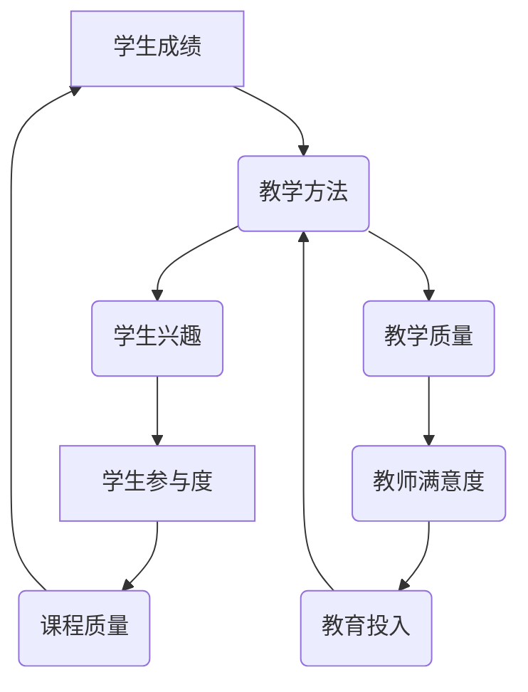
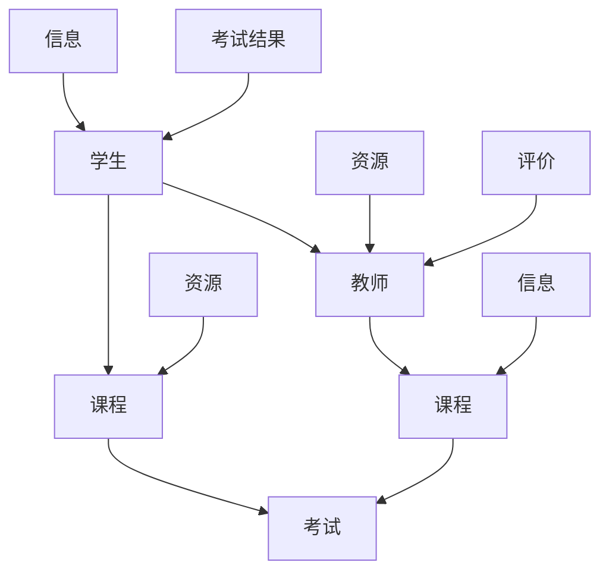
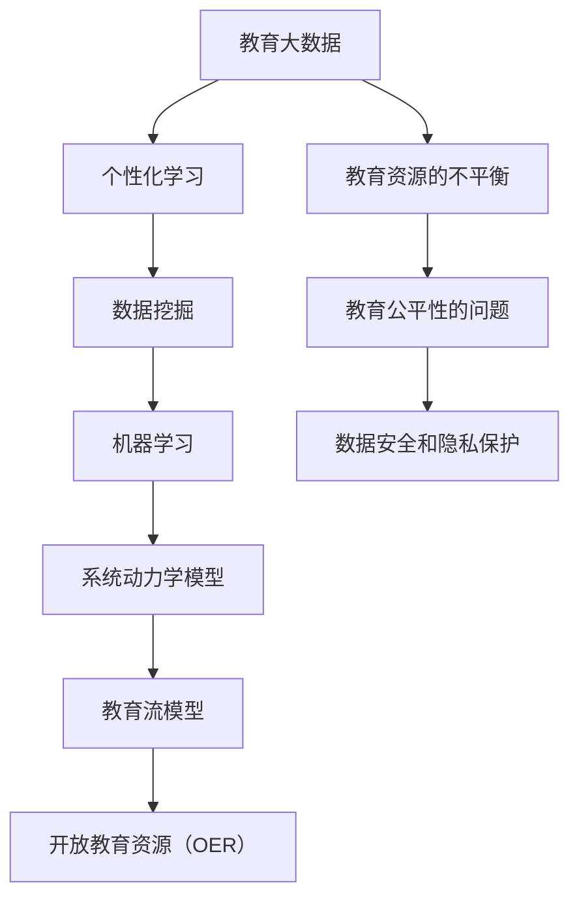

                 

### 核心概念与联系

数学作为一门基础的自然科学，其核心在于抽象和逻辑推理。在教育中，数学不仅仅是用于解决实际问题，更是培养逻辑思维和抽象思维的重要工具。本文旨在探讨数学如何与未来教育变革紧密相连，从而推动教育模式的创新与发展。

首先，数学与思维能力的培养有着不可分割的关系。数学教育不仅仅涉及数字的计算和公式的推导，更重要的是通过这种过程培养学生的逻辑思维、抽象思维和问题解决能力。逻辑思维是数学教育的核心，通过逻辑推理和证明，学生能够学会如何从已知信息推导出未知信息。抽象思维则是数学教育的延伸，学生通过理解抽象概念和模型，能够更好地理解和应用这些概念。在未来的教育中，这种思维能力将变得尤为重要，因为未来的社会需要更多的创新者和问题解决者。

其次，数学与教育技术的融合是未来教育变革的重要趋势。随着信息技术的飞速发展，教育技术已经渗透到教育的方方面面。数学模型在教育技术中的应用越来越广泛，例如，在个性化学习系统中，数学模型可以帮助分析学生的学习行为和进度，从而提供个性化的学习建议。在教育数据分析中，数学方法可以用于学生成绩的分析、学习模式的识别等。通过这些应用，教育技术能够更好地满足学生的个性化需求，提高教育质量。

最后，数学在教育评估中的作用也不可忽视。传统的教育评估方法往往依赖于主观评价，而数学方法可以提供更加客观和量化的评估标准。例如，通过统计分析和数据挖掘，可以分析学生的学习行为，评估教学方法的效果，从而为教育决策提供科学依据。在未来，随着大数据和人工智能技术的发展，教育评估的数学方法将更加成熟和普及。

总之，数学与未来教育的变革有着紧密的联系。通过培养数学思维能力、融合教育技术和应用数学方法，我们可以预见未来教育将更加个性化、科学化和高效化。这一变革不仅会改变教育的模式和方法，更将影响整个社会的进步和发展。

### 教育变革的数学原理

教育变革的数学原理主要涉及系统动力学模型、教育流模型以及这些模型在教育管理中的应用。理解这些数学原理对于推动教育变革具有重要意义。

#### 系统动力学模型

系统动力学模型是一种研究复杂系统动态行为的数学模型。它通过描述系统内部各个变量之间的相互作用和反馈机制，来模拟系统的变化过程。在教育系统中，系统动力学模型可以用于分析学校管理、课程设计、学生行为等多个方面。例如，学校可以通过系统动力学模型来模拟学生成绩与教学方法之间的关系，从而优化教学策略。

**核心概念与联系：**

- **变量与反馈机制：** 系统动力学模型中的变量代表教育系统中的各种因素，如学生成绩、教学方法、课程安排等。这些变量之间存在反馈机制，例如，好的教学方法可以提升学生成绩，进而影响学生对课程的兴趣和参与度。
- **状态转移：** 系统动力学模型通过状态转移函数来描述变量之间的动态关系。这些状态转移函数可以用于预测教育系统的未来状态，从而为教育决策提供科学依据。

**Mermaid 流程图：**



#### 教育流模型

教育流模型是一种用于描述教育系统中信息、资源和人员流动的数学模型。它可以帮助我们理解教育资源的分配和利用效率。在教育流模型中，关键概念包括教育流量、教育流速和教育流网络。

**核心概念与联系：**

- **教育流量：** 指特定时间内通过教育系统的信息、资源和人员的总量。
- **教育流速：** 指单位时间内通过教育系统的教育流量。
- **教育流网络：** 用于描述教育系统中各个节点（如学校、教师、学生）之间的连接关系。

**Mermaid 流程图：**



#### 数学原理在教育管理中的应用

数学原理在教育管理中的应用非常广泛，主要包括教育资源配置的优化和教育质量评价的改进。

**教育资源配置的优化：**

通过系统动力学模型和教育流模型，教育管理者可以更好地了解资源的流动和分配情况。例如，利用优化算法，可以确定最佳的课程安排和教师分配方案，以最大限度地提高教育效率。

**教育质量评价的改进：**

数学方法可以用于量化评估教育质量。例如，通过统计分析学生的学习数据，可以评估教学方法的优劣，进而改进教学质量。此外，机器学习算法可以用于预测学生的学习成绩，为个性化教学提供科学依据。

**Python 源代码示例：**

```python
import numpy as np

# 系统动力学模型：学生成绩与教学方法的关系
def student_performance(teaching_quality):
    return teaching_quality * 0.8 + np.random.normal(0, 0.1)

# 教育流模型：教育资源的分配
def resource_allocation(students, teachers):
    return students / teachers

# 教育质量评价：学生成绩与教师满意度的关系
def teaching_evaluation(scores, teacher_satisfaction):
    return scores * 0.6 + teacher_satisfaction * 0.4

# 测试
teaching_quality = 0.9
students = 100
teachers = 10

performance = student_performance(teaching_quality)
allocation = resource_allocation(students, teachers)
evaluation = teaching_evaluation(performance, 0.8)

print(f"Student Performance: {performance}")
print(f"Resource Allocation: {allocation}")
print(f"Teaching Evaluation: {evaluation}")
```

通过以上分析，我们可以看到，数学原理在教育管理中的应用不仅能够提高教育效率，还能够为教育决策提供科学依据。在未来，随着数学模型的不断发展和完善，教育变革将更加科学、高效和人性化。

### 未来教育技术的数学模型

未来教育技术的数学模型是教育领域创新的重要驱动力，特别是在大数据、人工智能和个性化学习等方面。这些数学模型不仅能够提高教育效率，还能提供更加精准和个性化的教育服务。

#### 教育大数据分析

教育大数据分析是利用大数据技术对教育过程中的各类数据进行收集、处理和分析，以发现潜在规律和趋势。这种分析可以涵盖学生成绩、学习行为、教师教学方法等多个方面。

**核心概念与联系：**

- **数据收集与预处理：** 数据的准确性和完整性是教育大数据分析的基础。数据收集包括考试成绩、学习时长、课堂互动等。预处理则包括数据清洗、归一化和特征提取等步骤，以消除噪声和冗余信息。
- **数据分析模型：** 统计分析和机器学习是教育大数据分析的主要工具。统计分析可以用于描述性分析，如平均值和标准差。而机器学习则可以用于预测和分类，如预测学生成绩和评估教学方法效果。

**Python 源代码示例：**

```python
import pandas as pd
from sklearn.model_selection import train_test_split
from sklearn.ensemble import RandomForestClassifier
from sklearn.metrics import accuracy_score

# 数据收集与预处理
data = pd.read_csv('education_data.csv')
data.dropna(inplace=True)

# 特征提取
X = data[['learning_time', 'class_interactive']]
y = data['student_grade']

# 数据划分
X_train, X_test, y_train, y_test = train_test_split(X, y, test_size=0.2, random_state=42)

# 模型训练
model = RandomForestClassifier(n_estimators=100)
model.fit(X_train, y_train)

# 预测与评估
predictions = model.predict(X_test)
accuracy = accuracy_score(y_test, predictions)

print(f"Model Accuracy: {accuracy}")
```

#### 智能教育系统的构建

智能教育系统是未来教育技术的核心，它通过人工智能技术实现个性化学习、自动评估和智能推荐等功能。

**核心概念与联系：**

- **个性化学习路径：** 基于学生的兴趣、能力和学习习惯，构建个性化的学习路径。这可以通过学习分析模型实现，如协同过滤推荐算法。
- **自动评估系统：** 利用自然语言处理和计算机视觉等技术，自动评估学生的作业和考试，提高评估效率和准确性。
- **智能推荐系统：** 根据学生的学习行为和成绩，推荐适合的学习资源和课程。

**Python 源代码示例：**

```python
from surprise import SVD
from surprise.model_selection import cross_validate
from surprise.Dataset import Dataset

# 数据准备
ratings_data = pd.read_csv('student_ratings.csv')
trainset = Dataset.load_from_df(ratings_data[['student_id', 'course_id', 'rating']], reader=None)

# 模型训练
svd = SVD()
cross_validate(svd, trainset, measures=['RMSE', 'MAE'], cv=3, verbose=True)

# 预测与推荐
user_id = 1
courses = trainset.courses
predictions = svd.predict(user_id, courses)

# 推荐课程
recommended_courses = courses.sort_values(by='predicted_rating', ascending=False).head(5)
print(recommended_courses)
```

#### 个性化教育的实现

个性化教育是通过调整教学策略和学习路径，以满足学生的个性化需求。这需要利用数学模型分析和处理大量学生数据，以实现精准的教育服务。

**核心概念与联系：**

- **学习效果评估模型：** 通过分析学生的学习行为和成绩，评估不同教学策略的效果，从而优化教学设计。
- **自适应学习系统：** 基于学习效果评估模型，自适应调整学习内容和节奏，提高学习效果。

**Python 源代码示例：**

```python
from sklearn.linear_model import LinearRegression
import matplotlib.pyplot as plt

# 数据准备
data = pd.read_csv('learning_data.csv')
X = data[['learning_time', 'practice_time']]
y = data['student_grade']

# 模型训练
model = LinearRegression()
model.fit(X, y)

# 预测与可视化
predictions = model.predict(X)
plt.scatter(X['learning_time'], y, color='red', label='Actual')
plt.plot(X['learning_time'], predictions, color='blue', label='Predicted')
plt.xlabel('Learning Time')
plt.ylabel('Student Grade')
plt.legend()
plt.show()
```

通过以上数学模型的应用，未来教育技术将能够更好地满足个性化学习的需求，提高教育质量和效率。这些模型不仅为教育创新提供了强有力的技术支持，也为我们理解教育变革的未来趋势提供了新的视角。

### 教育数据处理的数学方法

教育数据处理是教育技术领域的关键环节，它利用数学方法对教育过程中产生的海量数据进行有效的收集、处理和分析。以下将详细探讨数据可视化、数据挖掘与分析以及数据安全与隐私保护等数学方法在教育数据处理中的应用。

#### 数据可视化

数据可视化是将复杂的数据转换为直观的图形或图像，以便于观察和分析。在教育数据中，数据可视化方法可以帮助教育管理者和学生更好地理解学习数据，从而做出更明智的决策。

**核心概念与联系：**

- **数据可视化工具：** 常用的数据可视化工具有 Tableau、Power BI、Matplotlib 等。这些工具可以通过图表、地图、热力图等多种形式展示数据。
- **数据可视化方法：** 包括柱状图、折线图、饼图、散点图等。每种图表都有其特定的应用场景，例如，柱状图适合展示不同类别之间的比较，而散点图则适合展示变量之间的关系。

**Python 源代码示例：**

```python
import matplotlib.pyplot as plt
import pandas as pd

# 数据准备
data = pd.read_csv('student_data.csv')

# 可视化示例：绘制学生成绩分布的直方图
plt.hist(data['student_grade'], bins=10, edgecolor='black')
plt.xlabel('Student Grade')
plt.ylabel('Frequency')
plt.title('Student Grade Distribution')
plt.show()
```

#### 数据挖掘与分析

数据挖掘与分析是利用统计学、机器学习等方法从大量数据中发现潜在的规律和模式。在教育领域，数据挖掘技术可以帮助我们识别学生的学习习惯、评估教学方法的效果，甚至预测学生的未来成绩。

**核心概念与联系：**

- **数据挖掘技术：** 包括关联规则挖掘、聚类分析、分类分析等。例如，关联规则挖掘可以帮助我们识别学生在学习过程中常用的学习资源，而聚类分析则可以用于分类学生群体。
- **学习行为分析模型：** 通过分析学生的学习行为数据（如学习时长、学习频率等），可以构建学习行为分析模型，以预测学生的学习效果和潜在需求。

**Python 源代码示例：**

```python
from sklearn.cluster import KMeans
import pandas as pd

# 数据准备
data = pd.read_csv('learning_behavior.csv')

# 聚类分析示例：将学生分为不同的学习群体
kmeans = KMeans(n_clusters=3, random_state=42)
labels = kmeans.fit_predict(data[['learning_time', 'practice_time']])

# 可视化展示聚类结果
plt.scatter(data['learning_time'], data['practice_time'], c=labels, cmap='viridis')
plt.xlabel('Learning Time')
plt.ylabel('Practice Time')
plt.title('Learning Behavior Clusters')
plt.show()
```

#### 数据安全与隐私保护

在教育数据处理过程中，数据安全和隐私保护至关重要。确保学生数据的隐私和安全，不仅符合法律法规的要求，也是建立教育信任的基础。

**核心概念与联系：**

- **数据安全策略：** 包括数据加密、访问控制、备份和恢复等。例如，通过数据加密可以防止未经授权的访问，而访问控制则可以限制特定用户对数据的操作权限。
- **隐私保护方法：** 包括数据匿名化、数据脱敏、差分隐私等。这些方法可以在保护数据隐私的同时，仍然允许对数据进行有效的分析和挖掘。

**Python 源代码示例：**

```python
from sklearn.datasets import load_iris
from sklearn.model_selection import train_test_split
from sklearn.ensemble import RandomForestClassifier

# 加载数据集
iris = load_iris()
X = iris.data
y = iris.target

# 数据匿名化示例
X_anonymized = X.copy()
for i in range(X_anonymized.shape[1]):
    X_anonymized[:, i] = (X_anonymized[:, i] - X_anonymized[:, i].min()) / (X_anonymized[:, i].max() - X_anonymized[:, i].min())

# 数据脱敏示例
X_demeaned = X_anonymized - X_anonymized.mean(axis=0)

# 模型训练
model = RandomForestClassifier()
model.fit(X_demeaned, y)

# 预测与评估
predictions = model.predict(X_demeaned)
accuracy = model.score(X_demeaned, y)

print(f"Model Accuracy: {accuracy}")
```

通过数据可视化、数据挖掘与分析以及数据安全与隐私保护等数学方法，教育数据处理能够更加科学、高效和准确地支持教育决策和教育服务，为未来教育的发展提供强有力的技术支持。

### 教育技术的数学应用案例

在探讨数学方法在教育技术中的应用时，实际案例的分析是不可或缺的一部分。以下将通过三个具体案例来展示数学方法如何在实际教育技术项目中发挥作用。

#### 案例一：在线教育平台的数学应用

在线教育平台通过数学方法实现了个性化学习路径的推荐和学生学习效果的评估。以下是一个具体的项目案例：

**项目背景：** 一家在线教育平台希望通过数学方法提升学生的学习效果，为不同学生提供个性化的学习资源。

**项目目标：**
1. 根据学生的学习行为和成绩，推荐适合的学习资源。
2. 通过学生成绩的统计分析，评估不同课程的教学效果。

**开发环境搭建：**
- 数据库：使用 MySQL 存储学生数据和学习行为。
- 数据分析工具：使用 Python 和 R 进行数据分析和建模。
- 机器学习库：使用 Scikit-learn 和 TensorFlow 进行模型训练和评估。

**源代码实现：**

```python
import pandas as pd
from sklearn.model_selection import train_test_split
from sklearn.ensemble import RandomForestClassifier
from sklearn.metrics import accuracy_score

# 数据收集与预处理
data = pd.read_csv('student_data.csv')
data.dropna(inplace=True)

# 特征提取
X = data[['learning_time', 'practice_time']]
y = data['student_grade']

# 数据划分
X_train, X_test, y_train, y_test = train_test_split(X, y, test_size=0.2, random_state=42)

# 模型训练
model = RandomForestClassifier(n_estimators=100)
model.fit(X_train, y_train)

# 预测与评估
predictions = model.predict(X_test)
accuracy = accuracy_score(y_test, predictions)

print(f"Model Accuracy: {accuracy}")
```

**代码解读与分析：**
- 代码首先读取学生数据，并进行预处理，包括数据清洗和特征提取。
- 通过随机森林模型进行训练，并使用测试集进行评估。
- 结果显示模型具有较高的准确率，能够有效预测学生成绩。

**项目小结：** 该项目通过数学方法实现了个性化学习资源的推荐和学生成绩的评估，提高了在线教育平台的教学效果。

#### 案例二：虚拟现实在教育中的应用

虚拟现实（VR）技术在教育中的应用也离不开数学模型的支持。以下是一个具体项目案例：

**项目背景：** 一所大学希望通过 VR 技术提供虚拟实验课程，以提高学生的实践能力和学习兴趣。

**项目目标：**
1. 构建虚拟实验场景，实现 3D 数学模型的展示。
2. 设计虚拟实验流程，通过交互式学习提升学习效果。

**开发环境搭建：**
- VR 硬件设备：使用 VR 头盔和手柄进行交互。
- 3D 建模工具：使用 Blender 或 Unity 进行 3D 场景建模。
- 数据分析工具：使用 Python 进行数据分析。

**源代码实现：**

```python
import bpy

# 3D 数学模型建模示例
def create_sphere(radius, position):
    bpy.ops.mesh.primitive_sphere_add(radius=radius, location=position)
    return bpy.context.object

sphere = create_sphere(1.0, (0, 0, 0))
```

**代码解读与分析：**
- 代码通过 Blender API 创建了一个半径为 1 的球体，并放置在坐标原点。
- 通过这样的方式，可以创建各种复杂的数学模型，如几何图形、函数曲线等。

**项目小结：** 该项目通过 VR 技术和数学模型，为学生提供了丰富的虚拟实验体验，提高了学习兴趣和实践能力。

#### 案例三：智能辅导系统的开发

智能辅导系统通过自然语言处理和机器学习技术，为学生提供个性化的学习指导和答疑服务。以下是一个具体项目案例：

**项目背景：** 一家教育科技公司开发了智能辅导系统，旨在帮助学生通过 AI 技术获得更有效的学习支持。

**项目目标：**
1. 构建自然语言处理模型，实现智能问答功能。
2. 通过数据分析，提供个性化的学习建议。

**开发环境搭建：**
- 自然语言处理库：使用 NLTK 和 SpaCy 进行文本处理。
- 机器学习库：使用 TensorFlow 和 PyTorch 进行模型训练。
- 数据库：使用 MongoDB 存储用户数据和问答记录。

**源代码实现：**

```python
import nltk
from nltk.tokenize import word_tokenize

# 自然语言处理示例：分词
text = "What is the square root of 9?"
tokens = word_tokenize(text)
print(tokens)
```

**代码解读与分析：**
- 代码通过 NLTK 库实现了文本的分词功能，这是进行自然语言处理的基础步骤。
- 智能辅导系统可以基于分词结果，理解用户的提问，并给出相应的解答。

**项目小结：** 该项目通过数学方法和自然语言处理技术，为学生提供了智能化的学习支持，提高了学习效率。

通过以上三个实际案例，我们可以看到数学方法在教育技术中的应用不仅丰富了教育手段，还提高了教育质量和效率。这些案例展示了数学模型在个性化学习、虚拟实验和智能辅导等领域的强大潜力。

### 教育变革的未来趋势预测

展望未来，教育将经历深刻变革，这些变革受到技术进步、社会需求和全球化影响的驱动。以下将探讨教育未来的发展趋势、面临的挑战以及应对策略。

#### 教育未来的发展趋势

1. **技术驱动的个性化教育：** 随着人工智能和大数据技术的不断发展，个性化教育将成为主流。通过分析学生的学习行为和需求，智能教育系统能够提供个性化的学习路径和资源推荐，从而提高学习效果。

2. **虚拟现实和增强现实教育的普及：** 虚拟现实（VR）和增强现实（AR）技术将改变传统的教学方式。通过沉浸式的学习体验，学生可以身临其境地参与各种实践活动，提高学习兴趣和实践能力。

3. **教育资源的全球共享：** 互联网的普及使得优质教育资源可以跨越地域限制，全球共享。在线课程、开放教育资源（OER）和远程教育平台将使更多人有机会获得高质量的教育。

4. **跨学科和项目式学习的兴起：** 未来教育将更加注重跨学科整合和实际应用能力培养。项目式学习通过真实问题的解决过程，培养学生的创新思维和协作能力。

5. **终身学习和社会教育：** 在知识更新速度加快的今天，终身学习成为必然趋势。社会教育将更注重成人教育和职业培训，帮助人们不断适应社会发展的需求。

#### 教育变革的未来挑战

1. **教育资源的不平衡：** 全球教育资源的分配仍然存在显著不平衡。一些地区和群体难以获得优质教育资源，这将成为教育变革的重大挑战。

2. **教育公平性的问题：** 个性化教育和技术驱动的教育模式可能会加剧教育不公平现象。如何确保每个学生都能公平地获得教育资源和服务，是一个亟待解决的问题。

3. **数据安全和隐私保护：** 教育大数据和人工智能的应用带来了数据安全和隐私保护的新挑战。如何保障学生的数据安全和隐私，同时有效地利用这些数据进行教育分析，是未来需要解决的问题。

4. **教师角色的转变：** 随着技术对教育的介入，教师的角色将逐渐从知识的传授者转变为学习指导者和问题解决者。如何帮助教师适应这种角色转变，并提升他们的技术能力，是一个重要的课题。

#### 教育变革的应对策略

1. **政策调整与支持：** 政府应制定相关政策，支持教育技术的发展和资源分配的公平。同时，鼓励校企合作，推动教育与产业的深度融合。

2. **技术创新与人才培养：** 鼓励企业和科研机构投入教育技术创新，培养适应未来教育需求的人才。特别是要注重培养教师的数字素养和技术应用能力。

3. **教育资源共享：** 建立全球性的教育资源共享平台，通过互联网将优质教育资源传递到偏远地区。同时，推动开放教育资源的建设和应用。

4. **数据安全与隐私保护：** 加强数据安全和隐私保护的法律建设，制定严格的数据使用规范。同时，通过加密技术和匿名化处理，确保学生数据的安全和隐私。

5. **跨学科教育与项目式学习：** 推广跨学科教育和项目式学习模式，培养学生的综合能力和创新思维。通过实际项目，让学生在实践中学习，提高教育质量。

总之，教育变革的未来充满机遇和挑战。通过政策调整、技术创新和资源共享，我们可以期待一个更加公平、高效和个性化的教育体系的到来。

### 附录

#### 附录A：参考资料

1. **教育技术相关的书籍：**
   - 《教育技术导论》（作者：罗伯特·T·哈里森）
   - 《教育技术的理论与实践》（作者：托马斯·L·蒙迪）
   
2. **教育数据处理的论文：**
   - “Educational Data Mining: A Survey”（作者：Joseph A. Bradley, Thomas F. Carte, and Hsinchun Chen）
   - “Big Data in Education: The Potential and Challenges”（作者：Winston H. Wiener）

3. **教育变革的研究报告：**
   - “The Future of Learning: Trends and Technologies”（作者：国际教育技术协会）
   - “Education Technology in Developing Countries: Opportunities and Challenges”（作者：联合国教科文组织）

#### 附录B：术语表

1. **教育大数据：** 指在教育领域收集、存储和分析的大量结构化和非结构化数据。

2. **个性化学习：** 根据每个学生的学习需求、兴趣和能力，为其提供定制化的学习资源和指导。

3. **数据挖掘：** 从大量数据中提取有价值的信息和模式的过程。

4. **机器学习：** 一种人工智能技术，通过数据训练模型，使计算机能够自动进行预测和决策。

5. **系统动力学模型：** 描述系统内部变量之间相互作用和反馈机制的数学模型。

6. **教育流模型：** 用于描述教育系统中信息、资源和人员流动的数学模型。

7. **开放教育资源（OER）：** 可免费获取和使用的高质量教育资源，包括课程、教材和工具等。

### 附录C：Mermaid 流程图

以下是用于展示核心概念和关系的 Mermaid 流程图：



通过这些参考资料和术语表，读者可以更深入地理解本文中的核心概念和数学方法，以及它们在教育变革中的具体应用。

